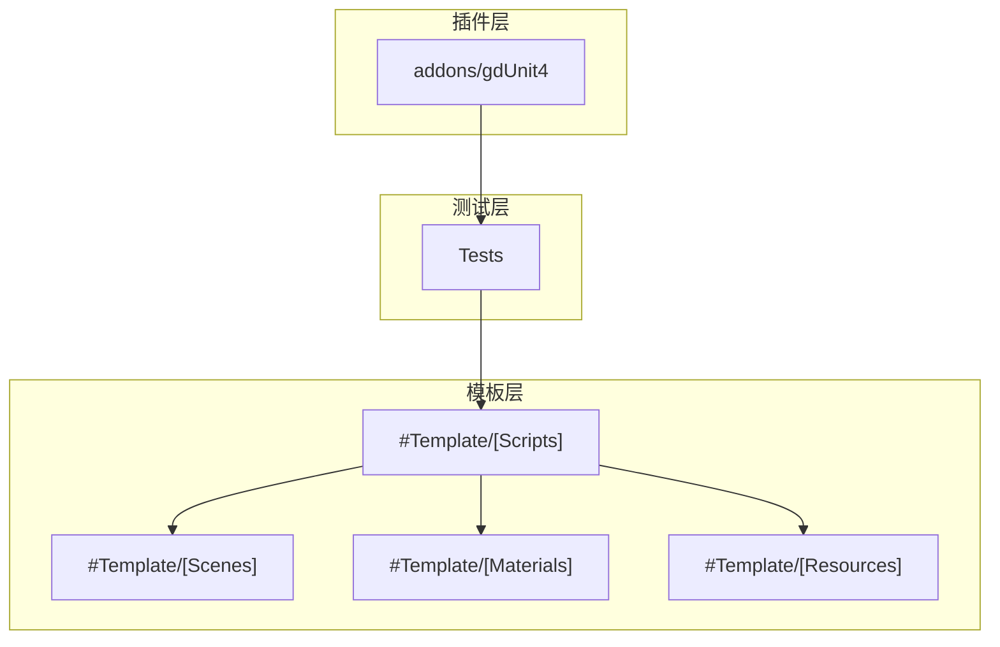
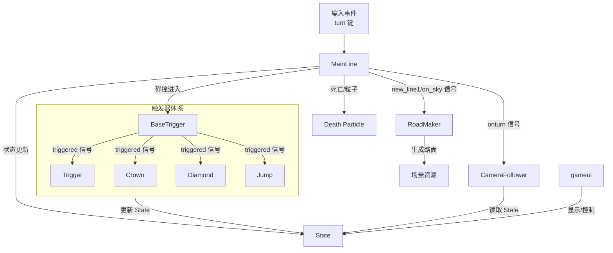
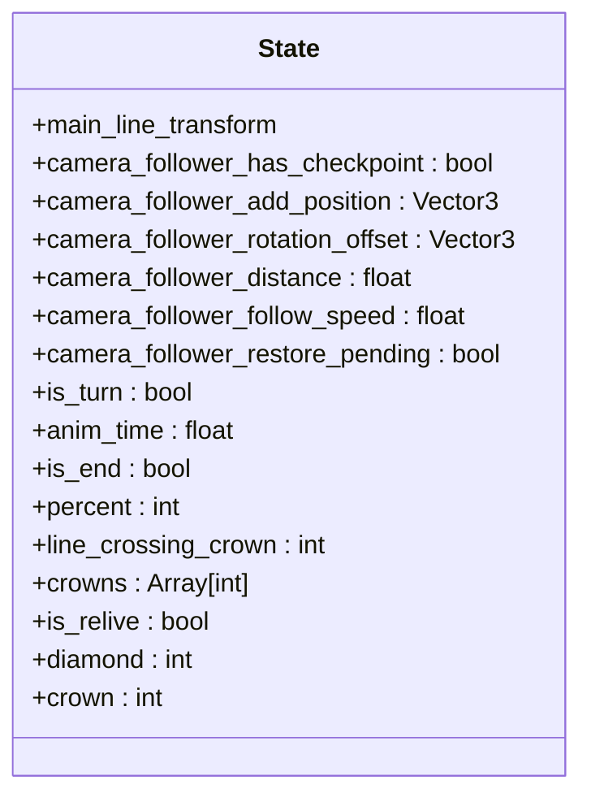
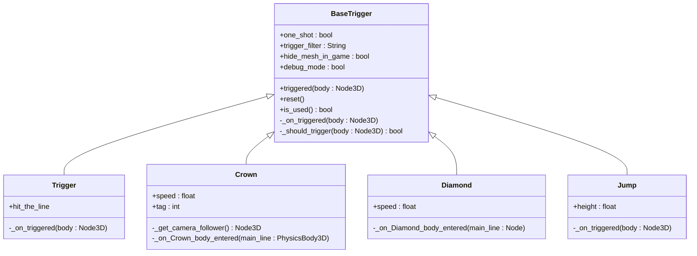
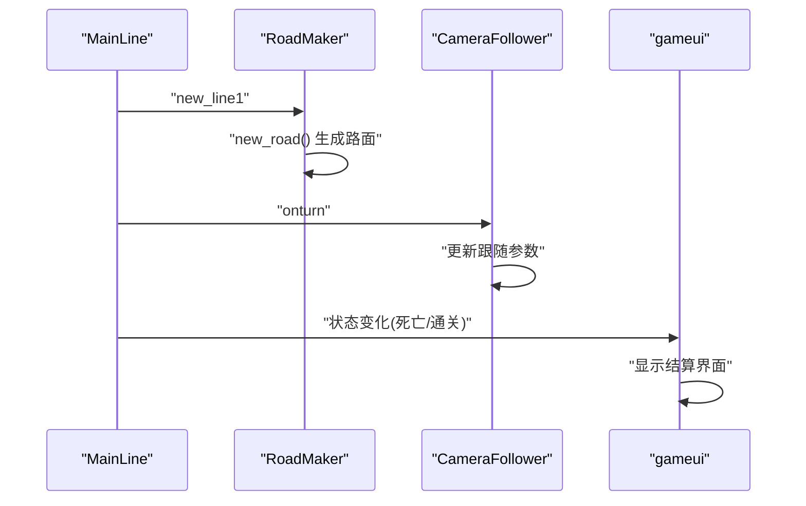
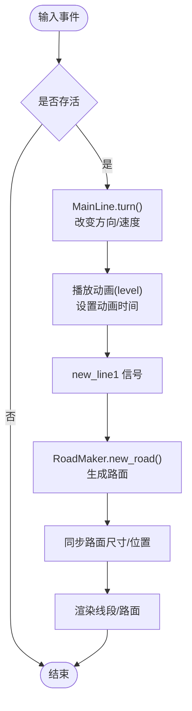
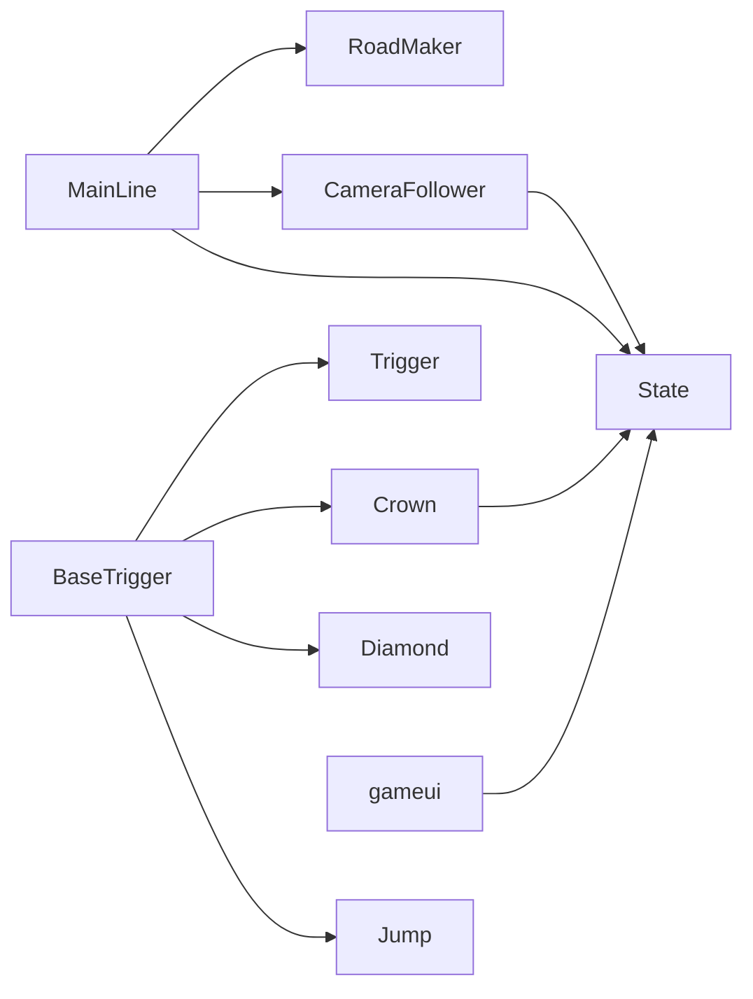

# 核心架构设计

<cite>
**本文引用的文件**
- [README.md](file://README.md)
- [GameManager.gd](file://#Template/[Scripts]/GameManager.gd)
- [MainLine.gd](file://#Template/[Scripts]/MainLine.gd)
- [State.gd](file://#Template/[Scripts]/State.gd)
- [BaseTrigger.gd](file://#Template/[Scripts]/Trigger/BaseTrigger.gd)
- [Trigger.gd](file://#Template/[Scripts]/Trigger/Trigger.gd)
- [Crown.gd](file://#Template/[Scripts]/Trigger/Crown.gd)
- [Diamond.gd](file://#Template/[Scripts]/Trigger/Diamond.gd)
- [Jump.gd](file://#Template/[Scripts]/Trigger/Jump.gd)
- [RoadMaker.gd](file://#Template/[Scripts]/RoadMaker.gd)
- [CameraFollower.gd](file://#Template/[Scripts]/CameraScripts/CameraFollower.gd)
- [gameui.gd](file://#Template/[Scripts]/gameui.gd)
- [GenerateLevelPatch.gd](file://#Template/[Scripts]/GenerateLevelPatch.gd)
- [LevelPatchMeta.gd](file://#Template/[Scripts]/LevelPatchMeta.gd)
- [MainLine_test.gd](file://Tests/MainLine_test.gd)
- [Crown_test.gd](file://Tests/Crown_test.gd)
</cite>

## 目录
1. [引言](#引言)
2. [项目结构](#项目结构)
3. [核心组件](#核心组件)
4. [架构总览](#架构总览)
5. [详细组件分析](#详细组件分析)
6. [依赖关系分析](#依赖关系分析)
7. [性能考量](#性能考量)
8. [故障排查指南](#故障排查指南)
9. [结论](#结论)
10. [附录](#附录)

## 引言
本设计文档面向Godot Line模板的核心架构，聚焦于系统边界、组件职责、数据流与交互模式。文档将阐明状态管理、触发器、观察者等设计模式在项目中的应用，梳理从玩家输入到渲染输出的完整流程，并总结关键架构决策与技术权衡，帮助开发者高效二次开发与扩展。

## 项目结构
模板采用“资源+脚本+场景”的分层组织方式，核心逻辑集中在#Template/[Scripts]目录下，配合Tests目录的单元测试保障质量。项目通过Godot 4.6的信号与节点树实现松耦合的组件协作。

图示来源
- [README.md:53-65](file://README.md#L53-L65)

章节来源
- [README.md:53-65](file://README.md#L53-L65)

## 核心组件
- 状态中心 State：集中管理全局状态（相机跟随参数、转向状态、动画起始时间、通关标志、收集品计数等），为各组件提供读取与持久化入口。
- 主角 MainLine：负责物理移动、转向动画、线段绘制、死亡与粒子效果、输入响应与重试。
- 触发器体系 BaseTrigger 及其派生：统一触发逻辑、过滤器与一次性触发，派生类实现具体行为（如 Crown、Diamond、Jump）。
- 相机跟随 CameraFollower：根据玩家状态与检查点平滑跟随，支持Tween过渡与震动。
- 道路生成 RoadMaker：监听主线新线段信号，动态生成路面网格。
- UI gameui：显示结算界面、控制按钮与收集品统计。
- 关卡生成工具 GenerateLevelPatch：基于LevelPatchMeta批量生成关卡资源文件。
- 管理器 GameManager：提供编辑器工具按钮与动画起始时间计算辅助。

章节来源
- [State.gd:1-21](file://#Template/[Scripts]/State.gd#L1-L21)
- [MainLine.gd:1-224](file://#Template/[Scripts]/MainLine.gd#L1-L224)
- [BaseTrigger.gd:1-102](file://#Template/[Scripts]/Trigger/BaseTrigger.gd#L1-L102)
- [Crown.gd:1-52](file://#Template/[Scripts]/Trigger/Crown.gd#L1-L52)
- [Diamond.gd:1-17](file://#Template/[Scripts]/Trigger/Diamond.gd#L1-L17)
- [Jump.gd:1-13](file://#Template/[Scripts]/Trigger/Jump.gd#L1-L13)
- [CameraFollower.gd:1-168](file://#Template/[Scripts]/CameraScripts/CameraFollower.gd#L1-L168)
- [RoadMaker.gd:1-46](file://#Template/[Scripts]/RoadMaker.gd#L1-L46)
- [gameui.gd:1-70](file://#Template/[Scripts]/gameui.gd#L1-L70)
- [GenerateLevelPatch.gd:1-139](file://#Template/[Scripts]/GenerateLevelPatch.gd#L1-L139)
- [LevelPatchMeta.gd:1-18](file://#Template/[Scripts]/LevelPatchMeta.gd#L1-L18)
- [GameManager.gd:1-47](file://#Template/[Scripts]/GameManager.gd#L1-L47)

## 架构总览
系统围绕“状态中心 + 观察者信号 + 触发器模式”构建，形成如下交互闭环：
- 输入事件由 MainLine 处理，触发转向与动画播放，并通过信号通知 RoadMaker 生成路面、通知 UI 更新。
- 触发器 Area3D 通过统一基类 BaseTrigger 的信号机制与外部节点解耦，派生类实现各自业务逻辑。
- State 作为全局状态容器，承载相机跟随检查点、动画起始时间、收集品计数等，贯穿重生与结算流程。
- CameraFollower 依据 State 中的检查点参数恢复相机状态，保证玩家重生体验的一致性。

图示来源
- [MainLine.gd:105-184](file://#Template/[Scripts]/MainLine.gd#L105-L184)
- [RoadMaker.gd:12-46](file://#Template/[Scripts]/RoadMaker.gd#L12-L46)
- [BaseTrigger.gd:29-98](file://#Template/[Scripts]/Trigger/BaseTrigger.gd#L29-L98)
- [Crown.gd:25-51](file://#Template/[Scripts]/Trigger/Crown.gd#L25-L51)
- [Diamond.gd:7-12](file://#Template/[Scripts]/Trigger/Diamond.gd#L7-L12)
- [Jump.gd:8-12](file://#Template/[Scripts]/Trigger/Jump.gd#L8-L12)
- [CameraFollower.gd:30-72](file://#Template/[Scripts]/CameraScripts/CameraFollower.gd#L30-L72)
- [State.gd:1-21](file://#Template/[Scripts]/State.gd#L1-L21)
- [gameui.gd:10-37](file://#Template/[Scripts]/gameui.gd#L10-L37)

## 详细组件分析

### 状态管理模式：State 全局状态
- 职责：集中存储与传播全局状态，包括相机跟随参数、转向状态、动画起始时间、通关/复活标记、收集品计数等。
- 使用方式：各组件通过读取/写入 State 实现跨场景与跨生命周期的状态一致性；相机跟随在重生时从 State 恢复参数。
- 设计要点：将“检查点”抽象为一组相机跟随参数，使相机在任意时刻都能正确恢复到上一个关键帧。

图示来源
- [State.gd:1-21](file://#Template/[Scripts]/State.gd#L1-L21)

章节来源
- [State.gd:1-21](file://#Template/[Scripts]/State.gd#L1-L21)
- [CameraFollower.gd:30-72](file://#Template/[Scripts]/CameraScripts/CameraFollower.gd#L30-L72)
- [Crown.gd:25-48](file://#Template/[Scripts]/Trigger/Crown.gd#L25-L48)

### 触发器模式：BaseTrigger 与派生类
- 基类 BaseTrigger 提供统一的触发信号、过滤器与一次性触发能力；派生类仅需实现 _on_triggered 即可扩展。
- 触发条件可按节点类型过滤，支持调试模式输出日志；reset 可重置一次性触发状态。
- 典型派生类：
  - Trigger：发射 hit_the_line 信号，供其他节点监听。
  - Crown：玩家触碰后更新 State（收集数、检查点、动画时间等），播放动画并释放。
  - Diamond：玩家触碰后更新 State 并播放粒子特效。
  - Jump：给 CharacterBody3D 施加向上速度，实现跳跃。

图示来源
- [BaseTrigger.gd:1-102](file://#Template/[Scripts]/Trigger/BaseTrigger.gd#L1-L102)
- [Trigger.gd:1-10](file://#Template/[Scripts]/Trigger/Trigger.gd#L1-L10)
- [Crown.gd:1-52](file://#Template/[Scripts]/Trigger/Crown.gd#L1-L52)
- [Diamond.gd:1-17](file://#Template/[Scripts]/Trigger/Diamond.gd#L1-L17)
- [Jump.gd:1-13](file://#Template/[Scripts]/Trigger/Jump.gd#L1-L13)

章节来源
- [BaseTrigger.gd:29-98](file://#Template/[Scripts]/Trigger/BaseTrigger.gd#L29-L98)
- [Trigger.gd:8-9](file://#Template/[Scripts]/Trigger/Trigger.gd#L8-L9)
- [Crown.gd:25-51](file://#Template/[Scripts]/Trigger/Crown.gd#L25-L51)
- [Diamond.gd:7-12](file://#Template/[Scripts]/Trigger/Diamond.gd#L7-L12)
- [Jump.gd:8-12](file://#Template/[Scripts]/Trigger/Jump.gd#L8-L12)

### 观察者模式：信号驱动的数据流
- MainLine 通过 new_line1/on_sky/onturn 等信号向 RoadMaker、UI、相机等组件广播状态变化。
- RoadMaker 监听 new_line1 生成路面，监听 on_sky 清空当前路面实例。
- UI 通过 State 与信号组合实现显示与控制逻辑。

图示来源
- [MainLine.gd:105-184](file://#Template/[Scripts]/MainLine.gd#L105-L184)
- [RoadMaker.gd:12-46](file://#Template/[Scripts]/RoadMaker.gd#L12-L46)
- [CameraFollower.gd:37-53](file://#Template/[Scripts]/CameraScripts/CameraFollower.gd#L37-L53)
- [gameui.gd:10-37](file://#Template/[Scripts]/gameui.gd#L10-L37)

章节来源
- [MainLine.gd:105-184](file://#Template/[Scripts]/MainLine.gd#L105-L184)
- [RoadMaker.gd:12-46](file://#Template/[Scripts]/RoadMaker.gd#L12-L46)
- [gameui.gd:10-37](file://#Template/[Scripts]/gameui.gd#L10-L37)

### 数据流架构：从输入到渲染
- 输入层：MainLine._input 响应 turn 键，调用 turn() 改变方向与速度，触发动画播放与线段生成。
- 物理层：_physics_process 应用重力、移动与碰撞检测，触发死亡逻辑。
- 渲染层：MainLine 动态创建线段 MeshInstance3D 并挂载到场景根节点下的 PlayerTailHolder；RoadMaker 同步生成路面网格。
- 状态层：State 记录相机跟随参数与动画起始时间，相机在重生时恢复。

图示来源
- [MainLine.gd:105-184](file://#Template/[Scripts]/MainLine.gd#L105-L184)
- [RoadMaker.gd:22-33](file://#Template/[Scripts]/RoadMaker.gd#L22-L33)

章节来源
- [MainLine.gd:53-104](file://#Template/[Scripts]/MainLine.gd#L53-L104)
- [MainLine.gd:168-184](file://#Template/[Scripts]/MainLine.gd#L168-L184)
- [RoadMaker.gd:22-33](file://#Template/[Scripts]/RoadMaker.gd#L22-L33)

### 关键架构决策与技术权衡
- 松耦合的信号驱动：通过 Godot 信号实现组件间解耦，新增功能只需扩展派生触发器或监听信号，降低修改成本。
- 状态集中化：将相机跟随与动画起始时间等状态放入 State，简化重生与恢复逻辑，提升一致性。
- 路面动态生成：RoadMaker 基于主线位置实时生成路面，减少静态资源体积，但需注意性能与内存管理。
- 触发器过滤与一次性触发：通过 BaseTrigger 的过滤器与 one_shot，避免误触发与重复逻辑，提高可维护性。
- 测试驱动：集成 gdUnit4，通过单元测试覆盖核心类的关键行为，保障重构安全性。

章节来源
- [BaseTrigger.gd:11-23](file://#Template/[Scripts]/Trigger/BaseTrigger.gd#L11-L23)
- [RoadMaker.gd:12-21](file://#Template/[Scripts]/RoadMaker.gd#L12-L21)
- [MainLine_test.gd:1-250](file://Tests/MainLine_test.gd#L1-L250)
- [Crown_test.gd:1-178](file://Tests/Crown_test.gd#L1-L178)

## 依赖关系分析
- 组件内聚与耦合：
  - MainLine 与 RoadMaker 通过信号耦合，职责清晰；MainLine 不直接依赖 RoadMaker 的具体实现。
  - CameraFollower 仅依赖 State 的检查点字段，避免与主线硬编码耦合。
  - 触发器体系通过 BaseTrigger 抽象统一接口，派生类彼此独立。
- 外部依赖：
  - Godot 引擎的信号系统、AnimationPlayer、Area3D、Marker3D 等节点类型。
  - gdUnit4 测试框架，位于 addons/gdUnit4。

图示来源
- [MainLine.gd:105-184](file://#Template/[Scripts]/MainLine.gd#L105-L184)
- [RoadMaker.gd:12-46](file://#Template/[Scripts]/RoadMaker.gd#L12-L46)
- [BaseTrigger.gd:29-98](file://#Template/[Scripts]/Trigger/BaseTrigger.gd#L29-L98)
- [Crown.gd:25-51](file://#Template/[Scripts]/Trigger/Crown.gd#L25-L51)
- [CameraFollower.gd:30-72](file://#Template/[Scripts]/CameraScripts/CameraFollower.gd#L30-L72)
- [gameui.gd:10-37](file://#Template/[Scripts]/gameui.gd#L10-L37)

章节来源
- [MainLine.gd:105-184](file://#Template/[Scripts]/MainLine.gd#L105-L184)
- [BaseTrigger.gd:29-98](file://#Template/[Scripts]/Trigger/BaseTrigger.gd#L29-L98)

## 性能考量
- 线段与路面生成：
  - MainLine 每次转向会创建新的线段 MeshInstance3D 并挂载到 PlayerTailHolder；建议在大量线段场景下定期清理历史节点，避免内存膨胀。
  - RoadMaker 基于主线位置实时计算路面尺寸与位置，建议在高频场景下考虑缓存偏移量或降低更新频率。
- 动画与相机：
  - CameraFollower 使用 Tween 平滑过渡，建议根据设备性能调整 follow_speed 与动画时长。
  - 动画起始时间由 GameManager.calculate_anim_start_time 计算，避免因速度为零导致除零风险。
- 触发器：
  - BaseTrigger 的 one_shot 与过滤器可减少无效触发，建议在复杂场景中启用 debug_mode 定位问题。

章节来源
- [MainLine.gd:139-161](file://#Template/[Scripts]/MainLine.gd#L139-L161)
- [RoadMaker.gd:29-33](file://#Template/[Scripts]/RoadMaker.gd#L29-L33)
- [CameraFollower.gd:115-148](file://#Template/[Scripts]/CameraScripts/CameraFollower.gd#L115-L148)
- [GameManager.gd:23-39](file://#Template/[Scripts]/GameManager.gd#L23-L39)
- [BaseTrigger.gd:12-23](file://#Template/[Scripts]/Trigger/BaseTrigger.gd#L12-L23)

## 故障排查指南
- 无法触发触发器：
  - 检查 BaseTrigger 的 trigger_filter 与 one_shot 设置；确认 body_entered 信号已连接且未被重置。
- 相机未恢复到检查点：
  - 确认 Crown 触碰后 State 中的相机跟随参数已被正确写入；检查 CameraFollower._apply_state_checkpoint 是否执行。
- 路面未生成或错位：
  - 确认 MainLine 已发出 new_line1 信号；检查 RoadMaker 是否连接了信号；验证 RoadMaker 的 base_floor 场景路径。
- 死亡粒子未播放：
  - 检查 MainLine.die() 中的粒子实例化与材质赋值逻辑；确认 AnimationPlayer 与 AudioStreamPlayer 正常。
- UI 显示异常：
  - 检查 gameui 对 State 的读取与动画播放逻辑；确认按钮回调是否正确清空 State。

章节来源
- [BaseTrigger.gd:29-98](file://#Template/[Scripts]/Trigger/BaseTrigger.gd#L29-L98)
- [Crown.gd:25-51](file://#Template/[Scripts]/Trigger/Crown.gd#L25-L51)
- [CameraFollower.gd:54-72](file://#Template/[Scripts]/CameraScripts/CameraFollower.gd#L54-L72)
- [RoadMaker.gd:12-27](file://#Template/[Scripts]/RoadMaker.gd#L12-L27)
- [MainLine.gd:197-213](file://#Template/[Scripts]/MainLine.gd#L197-L213)
- [gameui.gd:17-37](file://#Template/[Scripts]/gameui.gd#L17-L37)

## 结论
本模板通过“状态中心 + 观察者信号 + 触发器模式”的组合，实现了低耦合、易扩展的 Dancing Line 核心玩法框架。State 将关键状态抽象为可恢复的检查点，结合 BaseTrigger 的统一触发机制与相机跟随的 Tween 过渡，形成了从输入到渲染的完整数据流。测试驱动与模块化设计进一步提升了系统的可维护性与可扩展性。

## 附录
- 关卡生成工具链：
  - LevelPatchMeta 定义关卡元数据；GenerateLevelPatch 基于元数据批量生成关卡资源文件，便于大规模内容生产与版本管理。

章节来源
- [LevelPatchMeta.gd:1-18](file://#Template/[Scripts]/LevelPatchMeta.gd#L1-L18)
- [GenerateLevelPatch.gd:1-139](file://#Template/[Scripts]/GenerateLevelPatch.gd#L1-L139)