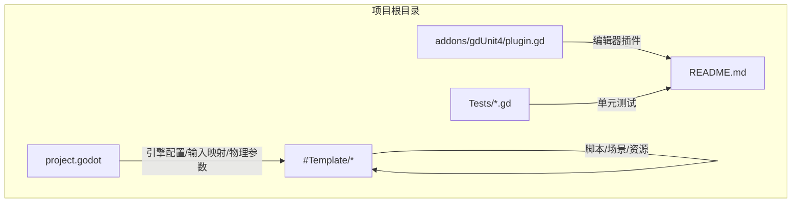
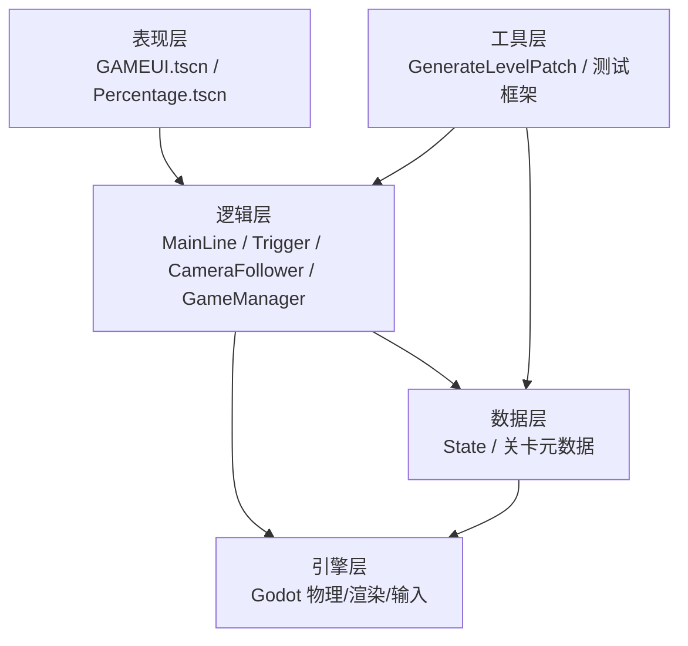
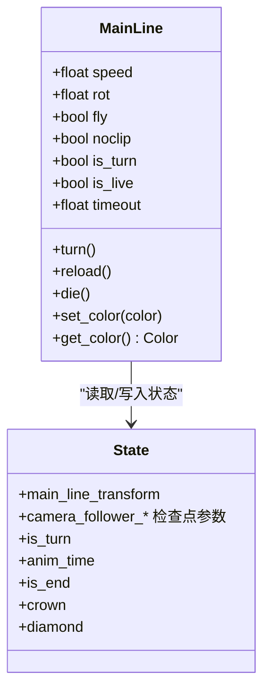
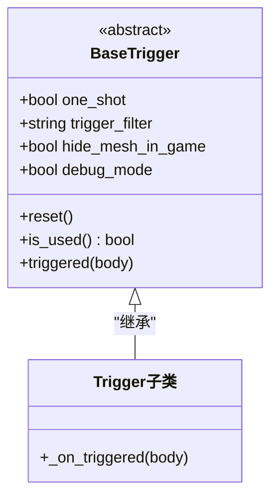
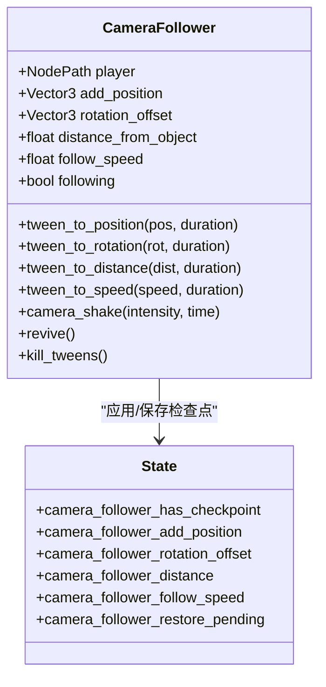
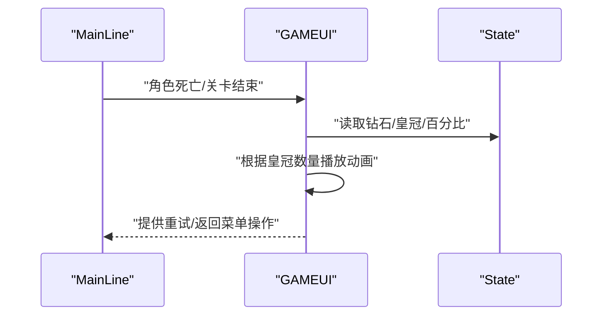
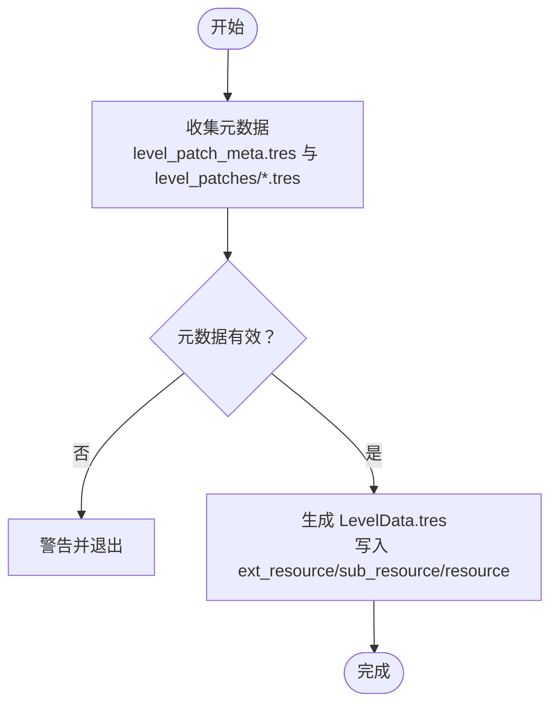
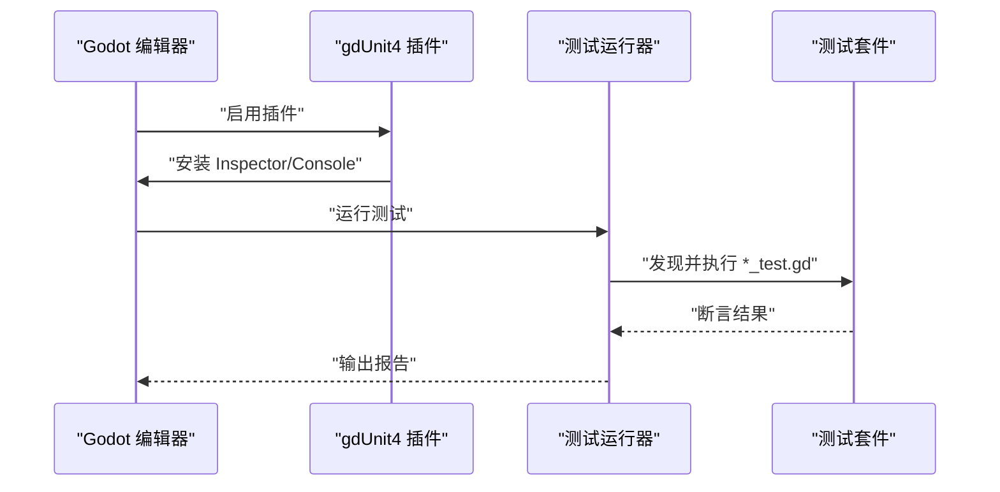
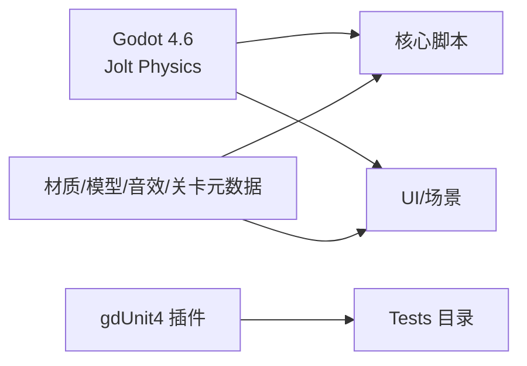

# 系统总体架构

<cite>
**本文引用的文件**
- [README.md](file://README.md)
- [project.godot](file://project.godot)
- [plugin.gd](file://addons/gdUnit4/plugin.gd)
- [GameManager.gd](file://#Template/[Scripts]/GameManager.gd)
- [MainLine.gd](file://#Template/[Scripts]/MainLine.gd)
- [State.gd](file://#Template/[Scripts]/State.gd)
- [GenerateLevelPatch.gd](file://#Template/[Scripts]/GenerateLevelPatch.gd)
- [TinyLevelMeta.gd](file://#Template/[Scripts]/TinyLevelMeta.gd)
- [Percentage.gd](file://#Template/[Scripts]/Percentage.gd)
- [gameui.gd](file://#Template/[Scripts]/gameui.gd)
- [BaseTrigger.gd](file://#Template/[Scripts]/Trigger/BaseTrigger.gd)
- [CameraFollower.gd](file://#Template/[Scripts]/CameraScripts/CameraFollower.gd)
- [GuideTap.gd](file://#Template/[Scripts]/GuideLine/GuideTap.gd)
- [MainLine_test.gd](file://Tests/MainLine_test.gd)
- [Crown_test.gd](file://Tests/Crown_test.gd)
- [CONTRIBUTING.md](file://CONTRIBUTING.md)
</cite>

## 目录
1. [引言](#引言)
2. [项目结构](#项目结构)
3. [核心组件](#核心组件)
4. [架构总览](#架构总览)
5. [详细组件分析](#详细组件分析)
6. [依赖分析](#依赖分析)
7. [性能考量](#性能考量)
8. [故障排查指南](#故障排查指南)
9. [结论](#结论)
10. [附录](#附录)

## 引言
本文件面向Godot Line项目，提供系统总体架构文档，聚焦于从底层物理引擎到上层游戏逻辑的完整分层设计，阐明组件职责、相互关系与数据流，总结核心设计理念（如组件化、事件驱动），并给出系统边界与外部依赖说明，帮助开发者建立全局视角。

## 项目结构
项目采用“模板+插件+测试”的组织方式：
- 模板系统：包含核心脚本、场景、资源与工具脚本，构成可复用的游戏框架。
- 插件系统：集成gdUnit4测试框架，提供编辑器内测能力与命令行无头测试。
- 测试体系：Tests目录下的单元测试，验证核心行为与契约。

图示来源
- [project.godot](file://project.godot)
- [plugin.gd](file://addons/gdUnit4/plugin.gd)

章节来源
- [README.md](file://README.md)
- [project.godot](file://project.godot)

## 核心组件
- 状态管理器（State.gd）：全局状态单例，承载玩家进度、相机检查点、动画起始时间等横切关注点。
- 主角色（MainLine.gd）：继承CharacterBody3D，负责移动、转向、线段绘制、死亡与粒子效果。
- 游戏管理器（GameManager.gd）：提供编辑器工具按钮、计算动画起始时间、颜色设置等辅助能力。
- 相机跟随（CameraFollower.gd）：围绕玩家节点进行平滑跟随、检查点恢复、Tween过渡与震动。
- 触发器基类（BaseTrigger.gd）：统一触发器的连接、过滤、一次性触发与信号发射。
- UI与进度（gameui.gd、Percentage.gd）：结算界面、百分比显示与场景保存/恢复。
- 关卡生成工具（GenerateLevelPatch.gd、TinyLevelMeta.gd）：关卡元数据生成与打包。
- 测试框架（gdUnit4）：编辑器与命令行测试执行环境。

章节来源
- [State.gd](file://#Template/[Scripts]/State.gd)
- [MainLine.gd](file://#Template/[Scripts]/MainLine.gd)
- [GameManager.gd](file://#Template/[Scripts]/GameManager.gd)
- [CameraFollower.gd](file://#Template/[Scripts]/CameraScripts/CameraFollower.gd)
- [BaseTrigger.gd](file://#Template/[Scripts]/Trigger/BaseTrigger.gd)
- [gameui.gd](file://#Template/[Scripts]/gameui.gd)
- [Percentage.gd](file://#Template/[Scripts]/Percentage.gd)
- [GenerateLevelPatch.gd](file://#Template/[Scripts]/GenerateLevelPatch.gd)
- [TinyLevelMeta.gd](file://#Template/[Scripts]/TinyLevelMeta.gd)
- [plugin.gd](file://addons/gdUnit4/plugin.gd)

## 架构总览
系统采用“分层+事件驱动”的架构：
- 表现层：场景与UI（GAMEUI、Percentage等），负责渲染与用户交互。
- 逻辑层：角色、触发器、相机跟随、UI控制器等，负责业务规则与状态流转。
- 数据层：State单例与资源（关卡元数据、材质、音效等），提供持久化与共享数据。
- 外部层：Godot引擎（物理、渲染、输入）、操作系统（文件系统、命令行）。

图示来源
- [MainLine.gd](file://#Template/[Scripts]/MainLine.gd)
- [BaseTrigger.gd](file://#Template/[Scripts]/Trigger/BaseTrigger.gd)
- [CameraFollower.gd](file://#Template/[Scripts]/CameraScripts/CameraFollower.gd)
- [GameManager.gd](file://#Template/[Scripts]/GameManager.gd)
- [State.gd](file://#Template/[Scripts]/State.gd)
- [GenerateLevelPatch.gd](file://#Template/[Scripts]/GenerateLevelPatch.gd)
- [project.godot](file://project.godot)

## 详细组件分析

### 角色系统（MainLine）
- 职责：控制角色移动、转向、线段绘制、碰撞检测、死亡与粒子效果。
- 关键点：
  - 物理更新在_physics_process中进行，结合重力与地面判定。
  - 转向触发时播放动画并切换朝向，同时生成新的线段节点。
  - 死亡时创建碎片粒子并施加冲量与扭矩。
  - 通过State恢复初始状态与相机参数。

图示来源
- [MainLine.gd](file://#Template/[Scripts]/MainLine.gd)
- [State.gd](file://#Template/[Scripts]/State.gd)

章节来源
- [MainLine.gd](file://#Template/[Scripts]/MainLine.gd)
- [State.gd](file://#Template/[Scripts]/State.gd)

### 触发器系统（BaseTrigger）
- 职责：统一触发器的连接、过滤、一次性触发与信号发射；子类仅需实现具体逻辑。
- 关键点：
  - 支持过滤类型（CharacterBody3D、PhysicsBody3D、Any）。
  - one_shot控制一次性触发。
  - 提供reset与is_used查询。

图示来源
- [BaseTrigger.gd](file://#Template/[Scripts]/Trigger/BaseTrigger.gd)

章节来源
- [BaseTrigger.gd](file://#Template/[Scripts]/Trigger/BaseTrigger.gd)

### 相机跟随（CameraFollower）
- 职责：围绕玩家节点平滑跟随，支持检查点恢复、Tween过渡与震动。
- 关键点：
  - 从State恢复相机参数，避免硬切。
  - 提供tween_to_*系列方法，平滑过渡位置/旋转/距离/速度。
  - 提供revive与kill_tweens等控制接口。

图示来源
- [CameraFollower.gd](file://#Template/[Scripts]/CameraScripts/CameraFollower.gd)
- [State.gd](file://#Template/[Scripts]/State.gd)

章节来源
- [CameraFollower.gd](file://#Template/[Scripts]/CameraScripts/CameraFollower.gd)
- [State.gd](file://#Template/[Scripts]/State.gd)

### UI与进度（GAMEUI/Percentage）
- GAMEUI：在角色死亡或关卡结束时显示结算界面，根据State.crown播放不同动画。
- Percentage：在编辑器中动态切换文本网格显示的百分比数字，保存时自动调整所有权。

图示来源
- [gameui.gd](file://#Template/[Scripts]/gameui.gd)
- [State.gd](file://#Template/[Scripts]/State.gd)

章节来源
- [gameui.gd](file://#Template/[Scripts]/gameui.gd)
- [Percentage.gd](file://#Template/[Scripts]/Percentage.gd)
- [State.gd](file://#Template/[Scripts]/State.gd)

### 关卡生成与元数据（GenerateLevelPatch/TinyLevelMeta）
- GenerateLevelPatch：扫描元数据资源，生成关卡数据文件（LevelData），包含子关卡引用与扩展资源。
- TinyLevelMeta：单个子关卡元数据（名称与场景路径）。

图示来源
- [GenerateLevelPatch.gd](file://#Template/[Scripts]/GenerateLevelPatch.gd)
- [TinyLevelMeta.gd](file://#Template/[Scripts]/TinyLevelMeta.gd)

章节来源
- [GenerateLevelPatch.gd](file://#Template/[Scripts]/GenerateLevelPatch.gd)
- [TinyLevelMeta.gd](file://#Template/[Scripts]/TinyLevelMeta.gd)

### 测试框架（gdUnit4）
- 插件在编辑器中安装UI与控制台，支持上下文菜单与脚本发现。
- Tests目录下用例验证MainLine与Trigger等核心行为。

图示来源
- [plugin.gd](file://addons/gdUnit4/plugin.gd)
- [MainLine_test.gd](file://Tests/MainLine_test.gd)
- [Crown_test.gd](file://Tests/Crown_test.gd)

章节来源
- [plugin.gd](file://addons/gdUnit4/plugin.gd)
- [MainLine_test.gd](file://Tests/MainLine_test.gd)
- [Crown_test.gd](file://Tests/Crown_test.gd)

## 依赖分析
- 引擎依赖：Godot 4.6，Jolt Physics，移动端渲染策略，输入映射（turn/retry/save/reload/savetaper）。
- 插件依赖：gdUnit4测试框架，启用后在编辑器中提供UI与命令行测试能力。
- 资源依赖：材质、模型、音效、场景与关卡元数据。

图示来源
- [project.godot](file://project.godot)
- [plugin.gd](file://addons/gdUnit4/plugin.gd)

章节来源
- [project.godot](file://project.godot)
- [plugin.gd](file://addons/gdUnit4/plugin.gd)

## 性能考量
- 物理与渲染：启用3D物理独立线程与物理插值，移动端渲染策略优化。
- 粒子与动画：死亡粒子数量可控，动画播放与seek减少卡顿。
- 状态持久化：通过State单例集中管理，避免频繁跨场景查找。
- 测试驱动：使用gdUnit4在开发期快速验证，降低回归风险。

## 故障排查指南
- 测试无法在编辑器中运行：检查gdUnit4插件启用状态与引擎版本要求。
- 关卡生成失败：确认元数据文件路径与格式正确，输出目录可写。
- 相机跳变：确保相机跟随在State检查点恢复后调用revive或等待恢复完成。
- 角色死亡异常：检查死亡触发条件与粒子创建逻辑，确认材质与mesh引用有效。

章节来源
- [plugin.gd](file://addons/gdUnit4/plugin.gd)
- [GenerateLevelPatch.gd](file://#Template/[Scripts]/GenerateLevelPatch.gd)
- [CameraFollower.gd](file://#Template/[Scripts]/CameraScripts/CameraFollower.gd)
- [MainLine.gd](file://#Template/[Scripts]/MainLine.gd)

## 结论
Godot Line采用清晰的分层与组件化设计，结合事件驱动与状态单例，实现了从物理到表现的完整闭环。通过gdUnit4测试框架与工具链（关卡生成），项目具备良好的可维护性与扩展性。建议在新增功能时遵循现有分层与命名规范，优先通过测试验证。

## 附录
- 系统边界：模板系统为内部边界，外部依赖主要为Godot引擎与gdUnit4插件。
- 命名与规范：遵循Godot GDScript编码规范，类名PascalCase，变量与函数snake_case，信号snake_case。
- 贡献流程：Issue驱动，Pull Request审查，破坏性变更需标注并提供迁移指南。

章节来源
- [CONTRIBUTING.md](file://CONTRIBUTING.md)
- [README.md](file://README.md)