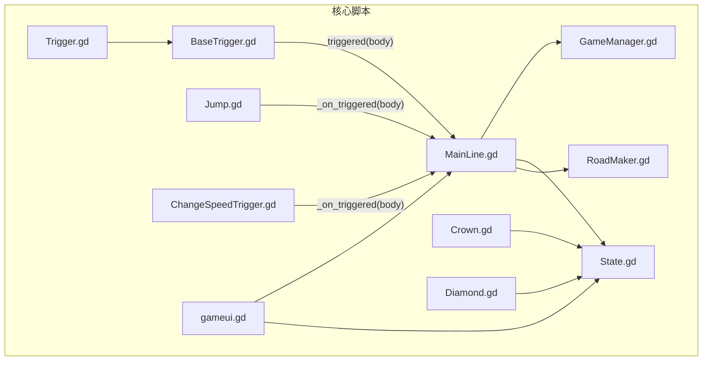
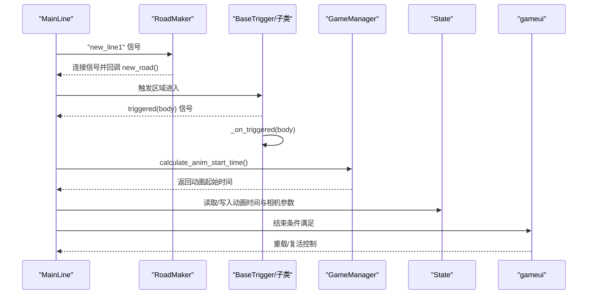
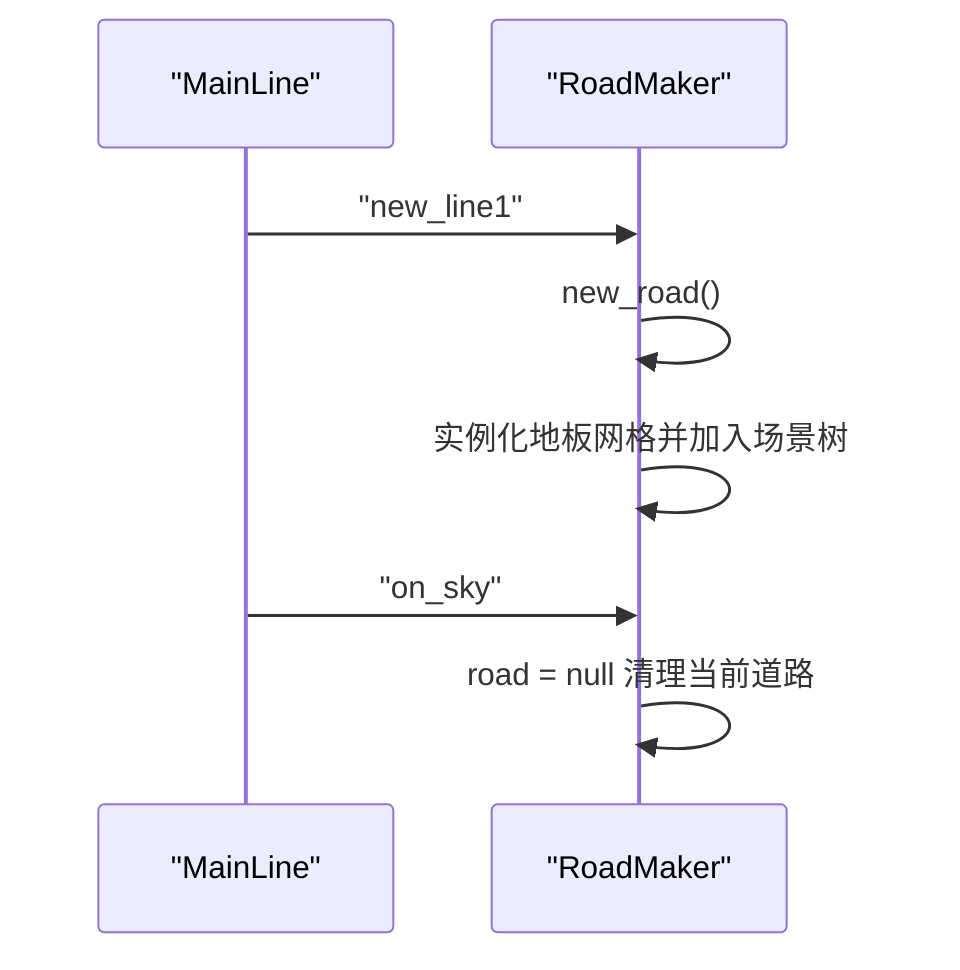
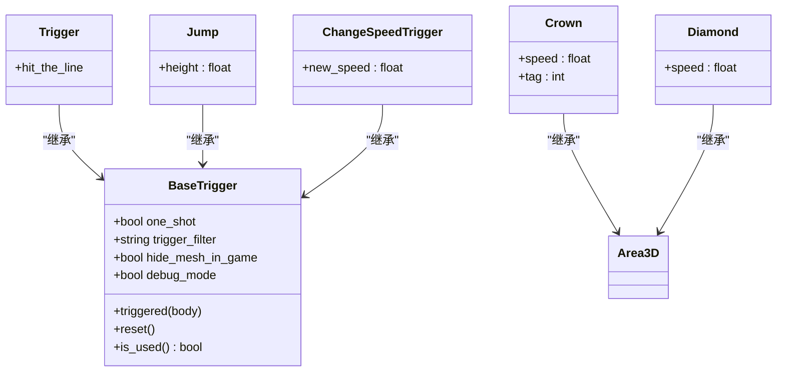
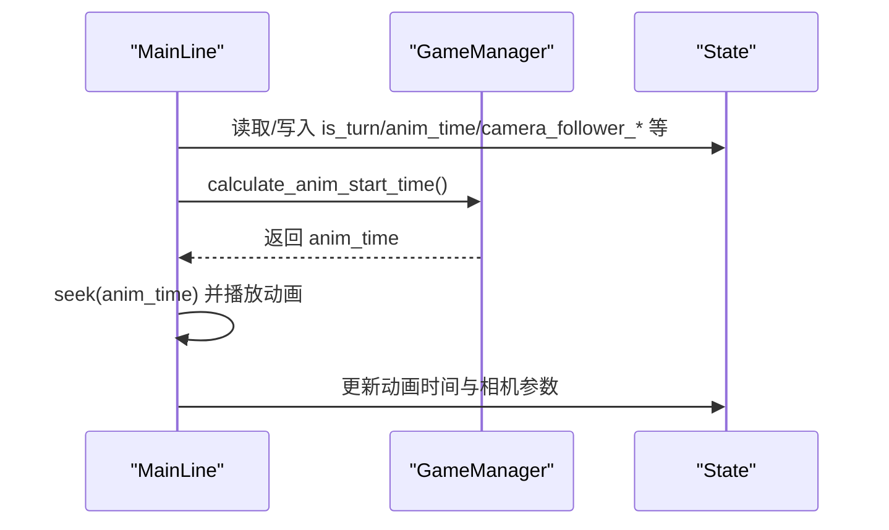
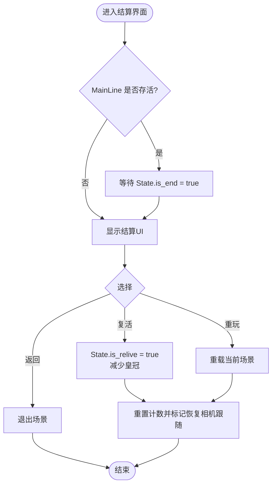
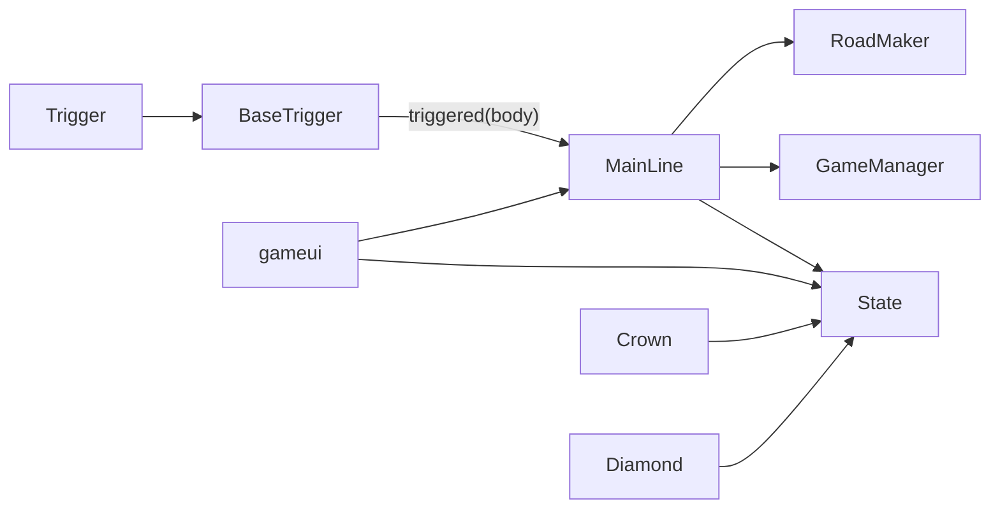

# 组件交互机制

<cite>
**本文引用的文件**
- [MainLine.gd](file://#Template/[Scripts]/MainLine.gd)
- [GameManager.gd](file://#Template/[Scripts]/GameManager.gd)
- [State.gd](file://#Template/[Scripts]/State.gd)
- [BaseTrigger.gd](file://#Template/[Scripts]/Trigger/BaseTrigger.gd)
- [Trigger.gd](file://#Template/[Scripts]/Trigger/Trigger.gd)
- [RoadMaker.gd](file://#Template/[Scripts]/RoadMaker.gd)
- [Crown.gd](file://#Template/[Scripts]/Trigger/Crown.gd)
- [Diamond.gd](file://#Template/[Scripts]/Trigger/Diamond.gd)
- [Jump.gd](file://#Template/[Scripts]/Trigger/Jump.gd)
- [ChangeSpeedTrigger.gd](file://#Template/[Scripts]/Trigger/ChangeSpeedTrigger.gd)
- [gameui.gd](file://#Template/[Scripts]/gameui.gd)
- [MainLine_test.gd](file://Tests/MainLine_test.gd)
</cite>

## 目录
1. [简介](#简介)
2. [项目结构](#项目结构)
3. [核心组件](#核心组件)
4. [架构总览](#架构总览)
5. [详细组件分析](#详细组件分析)
6. [依赖关系分析](#依赖关系分析)
7. [性能考量](#性能考量)
8. [故障排查指南](#故障排查指南)
9. [结论](#结论)
10. [附录](#附录)

## 简介
本文件聚焦Godot Line项目的组件交互机制，系统化阐述MainLine与Trigger系统、State管理器、GameManager控制器之间的协作关系；解释信号系统的使用方式、参数传递机制与回调处理；梳理组件间的依赖关系与生命周期管理；并提供交互时序图与调用关系图，帮助开发者进行组件扩展与集成开发。

## 项目结构
项目采用“脚本集中于#Template/[Scripts]”的组织方式，核心交互围绕MainLine角色、触发器系统、道路生成器、状态管理器与UI控制器展开。测试位于Tests目录，验证MainLine基础行为与信号存在性。

图表来源
- [MainLine.gd:42-124](file://#Template/[Scripts]/MainLine.gd#L42-L124)
- [RoadMaker.gd:12-27](file://#Template/[Scripts]/RoadMaker.gd#L12-L27)
- [BaseTrigger.gd:29-72](file://#Template/[Scripts]/BaseTrigger.gd#L29-L72)
- [Trigger.gd:8-9](file://#Template/[Scripts]/Trigger/Trigger.gd#L8-L9)
- [Crown.gd:25-57](file://#Template/[Scripts]/Trigger/Crown.gd#L25-L57)
- [Diamond.gd:7-12](file://#Template/[Scripts]/Trigger/Diamond.gd#L7-L12)
- [Jump.gd:8-12](file://#Template/[Scripts]/Trigger/Jump.gd#L8-L12)
- [ChangeSpeedTrigger.gd:8-14](file://#Template/[Scripts]/Trigger/ChangeSpeedTrigger.gd#L8-L14)
- [gameui.gd:7-37](file://#Template/[Scripts]/gameui.gd#L7-L37)

章节来源
- [MainLine.gd:42-124](file://#Template/[Scripts]/MainLine.gd#L42-L124)
- [RoadMaker.gd:12-27](file://#Template/[Scripts]/RoadMaker.gd#L12-L27)
- [BaseTrigger.gd:29-72](file://#Template/[Scripts]/BaseTrigger.gd#L29-L72)
- [Trigger.gd:8-9](file://#Template/[Scripts]/Trigger/Trigger.gd#L8-L9)
- [Crown.gd:25-57](file://#Template/[Scripts]/Trigger/Crown.gd#L25-L57)
- [Diamond.gd:7-12](file://#Template/[Scripts]/Trigger/Diamond.gd#L7-L12)
- [Jump.gd:8-12](file://#Template/[Scripts]/Trigger/Jump.gd#L8-L12)
- [ChangeSpeedTrigger.gd:8-14](file://#Template/[Scripts]/Trigger/ChangeSpeedTrigger.gd#L8-L14)
- [gameui.gd:7-37](file://#Template/[Scripts]/gameui.gd#L7-L37)

## 核心组件
- MainLine：玩家角色，负责物理移动、转向、连线绘制、死亡与重生、与GameManager/State交互。
- RoadMaker：监听MainLine信号，动态生成道路网格，随MainLine位移同步缩放。
- Trigger/BaseTrigger：触发器基类，统一触发逻辑、过滤器与一次性触发；具体触发器继承并实现自定义效果。
- GameManager：提供动画起始时间计算、颜色读取/设置等辅助能力。
- State：全局状态容器，保存相机跟随参数、转向状态、动画时间、关卡进度与收集品计数等。
- gameui：结算界面，根据State更新UI并控制场景重载或复活流程。

章节来源
- [MainLine.gd:42-124](file://#Template/[Scripts]/MainLine.gd#L42-L124)
- [RoadMaker.gd:12-27](file://#Template/[Scripts]/RoadMaker.gd#L12-L27)
- [BaseTrigger.gd:29-72](file://#Template/[Scripts]/BaseTrigger.gd#L29-L72)
- [GameManager.gd:23-46](file://#Template/[Scripts]/GameManager.gd#L23-L46)
- [State.gd:1-23](file://#Template/[Scripts]/State.gd#L1-L23)
- [gameui.gd:7-37](file://#Template/[Scripts]/gameui.gd#L7-L37)

## 架构总览
MainLine作为中心节点，通过信号与各组件解耦协作：
- 与RoadMaker：通过“new_line1”“on_sky”信号驱动道路生成与清理。
- 与Trigger：通过Area3D触发器捕获碰撞，BaseTrigger统一发射“triggered(body)”信号，子类实现具体效果。
- 与GameManager：计算动画起始时间，配合State同步动画进度。
- 与State：读写全局状态，支撑相机跟随、转向、动画时间、收集品统计与复活逻辑。
- 与UI：UI监听MainLine存活状态与State结束标志，展示结算界面并控制重载/复活。

图表来源
- [MainLine.gd:160](file://#Template/[Scripts]/MainLine.gd#L160)
- [RoadMaker.gd:14-16](file://#Template/[Scripts]/RoadMaker.gd#L14-L16)
- [BaseTrigger.gd:68-72](file://#Template/[Scripts]/BaseTrigger.gd#L68-L72)
- [GameManager.gd:23-39](file://#Template/[Scripts]/GameManager.gd#L23-L39)
- [gameui.gd:10-16](file://#Template/[Scripts]/gameui.gd#L10-L16)

## 详细组件分析

### MainLine 与 RoadMaker 的协作
- 信号绑定：RoadMaker在准备阶段检测MainLine的信号并建立连接。
- 新线段生成：MainLine每落地一次产生新线段，RoadMaker据此实例化地板网格并随MainLine位移同步更新。
- 离地处理：MainLine离地时发出“on_sky”，RoadMaker清空当前道路引用，避免悬挂。

图表来源
- [MainLine.gd:160](file://#Template/[Scripts]/MainLine.gd#L160)
- [RoadMaker.gd:14-16](file://#Template/[Scripts]/RoadMaker.gd#L14-L16)
- [RoadMaker.gd:22-27](file://#Template/[Scripts]/RoadMaker.gd#L22-L27)
- [RoadMaker.gd:44-45](file://#Template/[Scripts]/RoadMaker.gd#L44-L45)

章节来源
- [MainLine.gd:139-161](file://#Template/[Scripts]/MainLine.gd#L139-L161)
- [RoadMaker.gd:12-27](file://#Template/[Scripts]/RoadMaker.gd#L12-L27)

### MainLine 与 Trigger 系统
- 触发器基类：统一处理“body_entered”事件、过滤器、一次性触发与调试输出；派发“triggered(body)”信号。
- 具体触发器：
  - Trigger：发射“hit_the_line”信号，供其他节点监听。
  - Jump：给CharacterBody3D施加向上速度。
  - ChangeSpeedTrigger：修改目标对象的speed与v（若已开始移动）。
  - Crown/Diamond：更新State中的收集品计数与相机跟随参数，播放动画并销毁自身。

图表来源
- [BaseTrigger.gd:29-72](file://#Template/[Scripts]/BaseTrigger.gd#L29-L72)
- [Trigger.gd:8-9](file://#Template/[Scripts]/Trigger/Trigger.gd#L8-L9)
- [Jump.gd:8-12](file://#Template/[Scripts]/Trigger/Jump.gd#L8-L12)
- [ChangeSpeedTrigger.gd:8-14](file://#Template/[Scripts]/Trigger/ChangeSpeedTrigger.gd#L8-L14)
- [Crown.gd:25-57](file://#Template/[Scripts]/Trigger/Crown.gd#L25-L57)
- [Diamond.gd:7-12](file://#Template/[Scripts]/Trigger/Diamond.gd#L7-L12)

章节来源
- [BaseTrigger.gd:29-72](file://#Template/[Scripts]/BaseTrigger.gd#L29-L72)
- [Trigger.gd:8-9](file://#Template/[Scripts]/Trigger/Trigger.gd#L8-L9)
- [Jump.gd:8-12](file://#Template/[Scripts]/Trigger/Jump.gd#L8-L12)
- [ChangeSpeedTrigger.gd:8-14](file://#Template/[Scripts]/Trigger/ChangeSpeedTrigger.gd#L8-L14)
- [Crown.gd:25-57](file://#Template/[Scripts]/Trigger/Crown.gd#L25-L57)
- [Diamond.gd:7-12](file://#Template/[Scripts]/Trigger/Diamond.gd#L7-L12)

### MainLine 与 GameManager、State 的交互
- GameManager提供“calculate_anim_start_time()”，依据MainLine当前位置与导出因子计算动画起始时间，MainLine在转向时读取并seek动画。
- State保存相机跟随参数、转向状态、动画时间、收集品数量与复活标记；MainLine与Crown/Diamond在运行时更新State，gameui基于State决定UI显示与场景重置。

图表来源
- [MainLine.gd:168-184](file://#Template/[Scripts]/MainLine.gd#L168-L184)
- [GameManager.gd:23-39](file://#Template/[Scripts]/GameManager.gd#L23-L39)
- [State.gd:1-23](file://#Template/[Scripts]/State.gd#L1-L23)
- [Crown.gd:25-57](file://#Template/[Scripts]/Trigger/Crown.gd#L25-L57)

章节来源
- [MainLine.gd:168-184](file://#Template/[Scripts]/MainLine.gd#L168-L184)
- [GameManager.gd:23-39](file://#Template/[Scripts]/GameManager.gd#L23-L39)
- [State.gd:1-23](file://#Template/[Scripts]/State.gd#L1-L23)
- [Crown.gd:25-57](file://#Template/[Scripts]/Trigger/Crown.gd#L25-L57)

### UI 控制器与状态联动
- gameui在MainLine死亡或State标记结束时显示结算界面，根据State.crown播放不同动画并提供返回主菜单、重玩或复活选项。
- 复活时减少一个皇冠，重置部分State计数并标记恢复相机跟随。

图表来源
- [gameui.gd:10-16](file://#Template/[Scripts]/gameui.gd#L10-L16)
- [gameui.gd:17-37](file://#Template/[Scripts]/gameui.gd#L17-L37)
- [gameui.gd:51-69](file://#Template/[Scripts]/gameui.gd#L51-L69)

章节来源
- [gameui.gd:10-16](file://#Template/[Scripts]/gameui.gd#L10-L16)
- [gameui.gd:17-37](file://#Template/[Scripts]/gameui.gd#L17-L37)
- [gameui.gd:51-69](file://#Template/[Scripts]/gameui.gd#L51-L69)

## 依赖关系分析
- MainLine依赖：
  - RoadMaker：通过信号驱动道路生成。
  - GameManager：计算动画起始时间。
  - State：读写全局状态。
- Trigger系统：
  - BaseTrigger为所有触发器提供统一接口；子类仅需实现“_on_triggered”。
- UI依赖State与MainLine状态，控制场景重载与复活。

图表来源
- [MainLine.gd:160](file://#Template/[Scripts]/MainLine.gd#L160)
- [RoadMaker.gd:14-16](file://#Template/[Scripts]/RoadMaker.gd#L14-L16)
- [GameManager.gd:23-39](file://#Template/[Scripts]/GameManager.gd#L23-L39)
- [BaseTrigger.gd:68-72](file://#Template/[Scripts]/BaseTrigger.gd#L68-L72)
- [gameui.gd:10-16](file://#Template/[Scripts]/gameui.gd#L10-L16)
- [Crown.gd:25-57](file://#Template/[Scripts]/Trigger/Crown.gd#L25-L57)
- [Diamond.gd:7-12](file://#Template/[Scripts]/Trigger/Diamond.gd#L7-L12)

章节来源
- [MainLine.gd:160](file://#Template/[Scripts]/MainLine.gd#L160)
- [RoadMaker.gd:14-16](file://#Template/[Scripts]/RoadMaker.gd#L14-L16)
- [GameManager.gd:23-39](file://#Template/[Scripts]/GameManager.gd#L23-L39)
- [BaseTrigger.gd:68-72](file://#Template/[Scripts]/BaseTrigger.gd#L68-L72)
- [gameui.gd:10-16](file://#Template/[Scripts]/gameui.gd#L10-L16)
- [Crown.gd:25-57](file://#Template/[Scripts]/Trigger/Crown.gd#L25-L57)
- [Diamond.gd:7-12](file://#Template/[Scripts]/Trigger/Diamond.gd#L7-L12)

## 性能考量
- 信号连接建议在Ready阶段完成，避免重复连接与回调开销。
- RoadMaker按帧更新道路网格，注意在离地期间及时清空引用，防止无效计算。
- Trigger过滤器可限制触发对象类型，减少不必要的回调处理。
- 动画seek操作应结合State缓存，避免频繁计算与播放抖动。

## 故障排查指南
- 信号未触发：
  - 检查MainLine是否正确发出信号，RoadMaker是否已连接对应信号。
  - 参考：[MainLine.gd:160](file://#Template/[Scripts]/MainLine.gd#L160)，[RoadMaker.gd:14-16](file://#Template/[Scripts]/RoadMaker.gd#L14-L16)
- 触发器不生效：
  - 确认Area3D碰撞体配置与过滤器设置；查看BaseTrigger调试输出。
  - 参考：[BaseTrigger.gd:29-72](file://#Template/[Scripts]/BaseTrigger.gd#L29-L72)
- 动画时间异常：
  - 检查GameManager计算逻辑与MainLine的seek调用时机。
  - 参考：[GameManager.gd:23-39](file://#Template/[Scripts]/GameManager.gd#L23-L39)，[MainLine.gd:168-184](file://#Template/[Scripts]/MainLine.gd#L168-L184)
- UI不显示或状态错乱：
  - 检查gameui对State与MainLine状态的判断逻辑。
  - 参考：[gameui.gd:10-16](file://#Template/[Scripts]/gameui.gd#L10-L16)，[gameui.gd:17-37](file://#Template/[Scripts]/gameui.gd#L17-L37)
- 测试验证：
  - 使用GdUnit测试套件验证MainLine信号与方法存在性。
  - 参考：[MainLine_test.gd:141-177](file://Tests/MainLine_test.gd#L141-L177)

章节来源
- [MainLine.gd:160](file://#Template/[Scripts]/MainLine.gd#L160)
- [RoadMaker.gd:14-16](file://#Template/[Scripts]/RoadMaker.gd#L14-L16)
- [BaseTrigger.gd:29-72](file://#Template/[Scripts]/BaseTrigger.gd#L29-L72)
- [GameManager.gd:23-39](file://#Template/[Scripts]/GameManager.gd#L23-L39)
- [gameui.gd:10-16](file://#Template/[Scripts]/gameui.gd#L10-L16)
- [MainLine_test.gd:141-177](file://Tests/MainLine_test.gd#L141-L177)

## 结论
本项目通过信号驱动与状态共享实现了清晰的组件解耦：MainLine为核心，RoadMaker负责视觉扩展，Trigger系统提供丰富的交互效果，GameManager与State保障动画与全局状态一致性，gameui提供用户反馈与流程控制。遵循本文的交互规范与最佳实践，开发者可安全扩展新的触发器、UI与流程。

## 附录
- 扩展建议：
  - 新增触发器：继承BaseTrigger并实现“_on_triggered”，利用“triggered(body)”与其他组件解耦。
  - 新增UI：监听State变化与MainLine状态，避免直接耦合具体逻辑。
  - 新增动画/特效：通过GameManager计算时间并由MainLine seek，保持动画一致性。