# 状态管理模式

<cite>
**本文引用的文件**
- [State.gd](file://#Template/[Scripts]/State.gd)
- [GameManager.gd](file://#Template/[Scripts]/GameManager.gd)
- [MainLine.gd](file://#Template/[Scripts]/MainLine.gd)
- [CameraFollower.gd](file://#Template/[Scripts]/CameraScripts/CameraFollower.gd)
- [Crown.gd](file://#Template/[Scripts]/Trigger/Crown.gd)
- [CrownSet.gd](file://#Template/[Scripts]/Trigger/CrownSet.gd)
- [Diamond.gd](file://#Template/[Scripts]/Trigger/Diamond.gd)
- [gameui.gd](file://#Template/[Scripts]/gameui.gd)
- [save_manager.gd](file://addons/savekit/save_manager.gd)
- [serializer.gd](file://addons/savekit/serializer.gd)
- [README.md](file://README.md)
</cite>

## 更新摘要
**变更内容**
- 状态管理系统从分散的检查点变量重构为统一的RefCounted系统
- 新增持久化检查点数据与运行时数据的分类管理
- 集成SaveKit序列化框架，提供完整的序列化和反序列化能力
- 增强状态重置功能，支持部分重置和完全重置
- 优化相机检查点的数据结构，使用字典统一管理

## 目录
1. [引言](#引言)
2. [项目结构](#项目结构)
3. [核心组件](#核心组件)
4. [架构总览](#架构总览)
5. [详细组件分析](#详细组件分析)
6. [依赖分析](#依赖分析)
7. [性能考虑](#性能考虑)
8. [故障排查指南](#故障排查指南)
9. [结论](#结论)
10. [附录](#附录)

## 引言
本文件围绕 Godot Line 的状态管理模式进行系统化梳理，重点解析 State 节点作为全局状态管理器的设计与实现。经过重大重构，系统已从分散的检查点变量转变为统一的RefCounted系统，涵盖以下关键主题：
- RefCounted基础的单例模式应用与全局访问策略
- 分类化的状态数据结构：持久化检查点数据与运行时数据
- 完整的序列化/反序列化框架集成
- 增强的状态重置与恢复机制
- GameManager 与 State 的协作关系（动画时间计算、颜色管理等）
- 音乐播放检查点与多皇冠状态管理系统的优化
- 状态扩展与最佳实践
- 状态同步与并发控制等高级主题

## 项目结构
本项目采用模板化的资源组织方式，核心逻辑集中在 Template/[Scripts] 下，状态管理由重构后的 State.gd 提供统一的RefCounted状态容器；游戏主逻辑由 MainLine.gd 实现，相机跟随由 CameraFollower.gd 实现，触发器（Crown、Diamond）负责采集状态并写入 State；UI 层通过 gameui.gd 读取 State 并展示。

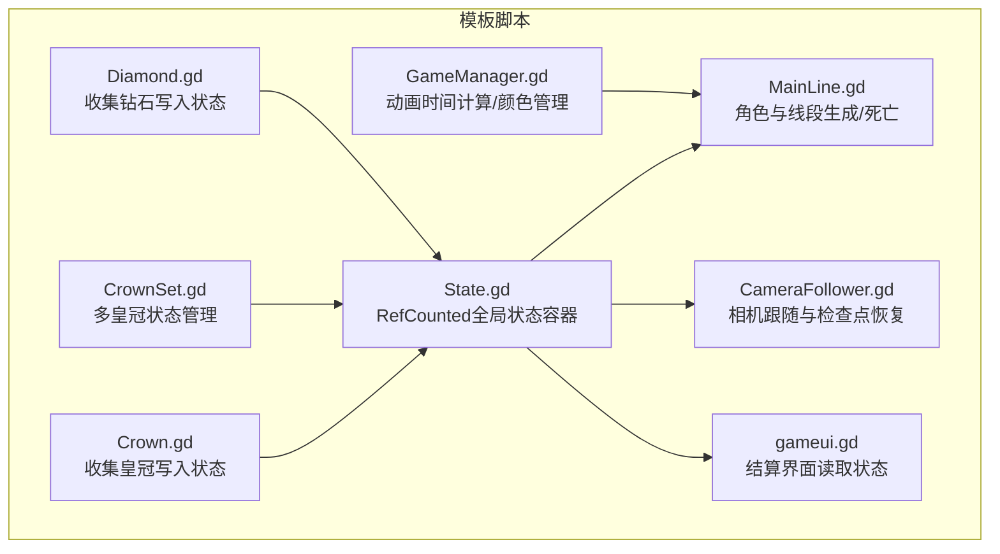

**图示来源**
- [State.gd](file://#Template/[Scripts]/State.gd)
- [GameManager.gd](file://#Template/[Scripts]/GameManager.gd)
- [MainLine.gd](file://#Template/[Scripts]/MainLine.gd)
- [CameraFollower.gd](file://#Template/[Scripts]/CameraScripts/CameraFollower.gd)
- [Crown.gd](file://#Template/[Scripts]/Trigger/Crown.gd)
- [CrownSet.gd](file://#Template/[Scripts]/Trigger/CrownSet.gd)
- [Diamond.gd](file://#Template/[Scripts]/Trigger/Diamond.gd)
- [gameui.gd](file://#Template/[Scripts]/gameui.gd)

**章节来源**
- [README.md](file://README.md)

## 核心组件
- **重构后的State.gd**：基于RefCounted的全局状态容器，采用分类化数据结构，包含持久化检查点数据、运行时数据、相机检查点字典、序列化接口和重置功能。
- GameManager.gd：提供动画起始时间计算与颜色管理接口，供 MainLine 使用。
- MainLine.gd：角色主体，负责线段生成、转向动画播放与时间跳转、死亡处理、场景重载与状态恢复。
- CameraFollower.gd：相机跟随逻辑，从重构后的 State 读取检查点参数并在必要时恢复相机状态。
- Trigger/Crown.gd 与 Trigger/Diamond.gd：触发器，负责在碰撞时更新重构后的 State 的计数与检查点信息。
- Trigger/CrownSet.gd：多皇冠状态管理器，根据重构后的 State.crowns 数组状态控制皇冠显示。
- gameui.gd：结算界面，读取重构后的 State.crown/diamond/percent 等并展示动画。

**章节来源**
- [State.gd](file://#Template/[Scripts]/State.gd)
- [GameManager.gd](file://#Template/[Scripts]/GameManager.gd)
- [MainLine.gd](file://#Template/[Scripts]/MainLine.gd)
- [CameraFollower.gd](file://#Template/[Scripts]/CameraScripts/CameraFollower.gd)
- [Crown.gd](file://#Template/[Scripts]/Trigger/Crown.gd)
- [CrownSet.gd](file://#Template/[Scripts]/Trigger/CrownSet.gd)
- [Diamond.gd](file://#Template/[Scripts]/Trigger/Diamond.gd)
- [gameui.gd](file://#Template/[Scripts]/gameui.gd)

## 架构总览
下图展示了重构后的 State 作为中心枢纽，协调角色、相机、触发器与 UI 的交互关系，包括新增的序列化框架和优化的检查点管理。

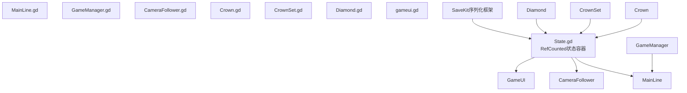

**图示来源**
- [State.gd](file://#Template/[Scripts]/State.gd)
- [MainLine.gd](file://#Template/[Scripts]/MainLine.gd)
- [GameManager.gd](file://#Template/[Scripts]/GameManager.gd)
- [CameraFollower.gd](file://#Template/[Scripts]/CameraScripts/CameraFollower.gd)
- [Crown.gd](file://#Template/[Scripts]/Trigger/Crown.gd)
- [CrownSet.gd](file://#Template/[Scripts]/Trigger/CrownSet.gd)
- [Diamond.gd](file://#Template/[Scripts]/Trigger/Diamond.gd)
- [gameui.gd](file://#Template/[Scripts]/gameui.gd)
- [save_manager.gd](file://addons/savekit/save_manager.gd)

## 详细组件分析

### 重构后的State全局状态容器
**重大更新**：State 已从简单的静态变量容器重构为基于 RefCounted 的完整状态管理系统，采用分类化数据结构：

- **持久化检查点数据**：main_line_transform、is_turn、anim_time、music_checkpoint_time、is_end、percent、line_crossing_crown、crowns[3]、is_relive、diamond、crown
- **相机检查点数据**：整合为字典结构 camera_checkpoint，包含 has_checkpoint、add_position、rotation_offset、distance、follow_speed、restore_pending
- **运行时数据**：main_line_data 字典，包含 transform、linear_velocity、is_turn、is_start、v、past_translation 等仅场景存活期间有效的数据
- **单例模式**：通过 RefCounted 基础类实现，提供更好的内存管理和生命周期控制

**新增功能**：
- save_checkpoint()：统一保存检查点到所有相关数据
- load_checkpoint_to_main_line()：从持久化数据恢复主线路线
- load_runtime_to_main_line()：从运行时数据恢复主线路线
- save_to_dict()/load_from_dict()：完整的序列化/反序列化接口
- reset_to_defaults()：完全重置状态到默认值
- reset_camera_checkpoint()：重置相机检查点到默认值
- reset_main_line_data()：重置运行时数据到默认值

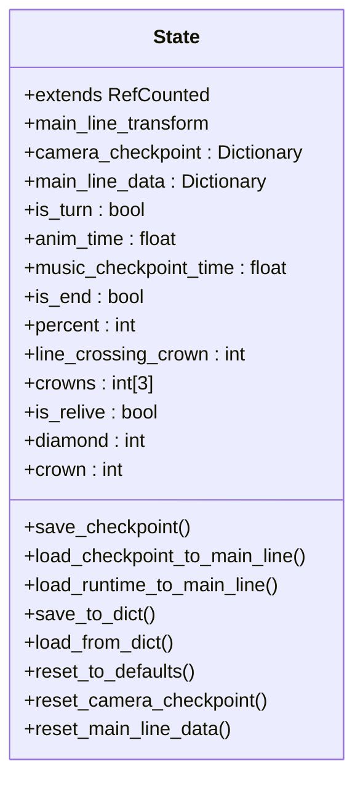

**图示来源**
- [State.gd](file://#Template/[Scripts]/State.gd)

**章节来源**
- [State.gd](file://#Template/[Scripts]/State.gd)

### GameManager 与动画时间计算
- 功能职责：根据起点与当前位置计算二维距离，结合速度与系数得到动画起始时间，用于在转向时同步动画播放进度。
- 与 MainLine 的协作：MainLine 在转向前调用 GameManager.calculate_anim_start_time()，并将返回值用于 AnimationPlayer.seek。

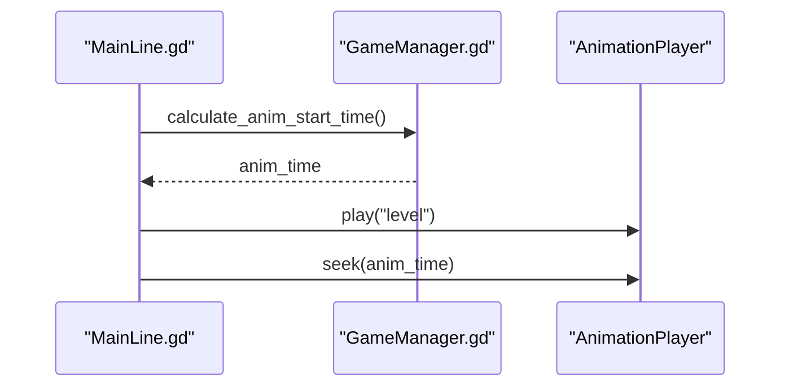

**图示来源**
- [GameManager.gd](file://#Template/[Scripts]/GameManager.gd)
- [MainLine.gd](file://#Template/[Scripts]/MainLine.gd)

**章节来源**
- [GameManager.gd](file://#Template/[Scripts]/GameManager.gd)
- [MainLine.gd](file://#Template/[Scripts]/MainLine.gd)

### MainLine 状态更新与恢复
- **重构后的状态恢复**：在 _ready 中调用 State.load_checkpoint_to_main_line() 从持久化数据恢复主线路线，调用 State.load_runtime_to_main_line() 从运行时数据恢复运行时状态。
- **音乐播放恢复**：当 State.music_checkpoint_time > 0.0 时，从指定时间点恢复音乐播放。
- **状态写入**：转向时若未处于"跨冠动画"，则写入 State.anim_time；死亡时触发粒子效果与音效。
- **线段生成**：在地面阶段动态生成线段并维护地面段列表，以同步高度。

**更新**：状态恢复现在分为两个层次：持久化数据恢复和运行时数据恢复，提供更精确的状态控制。

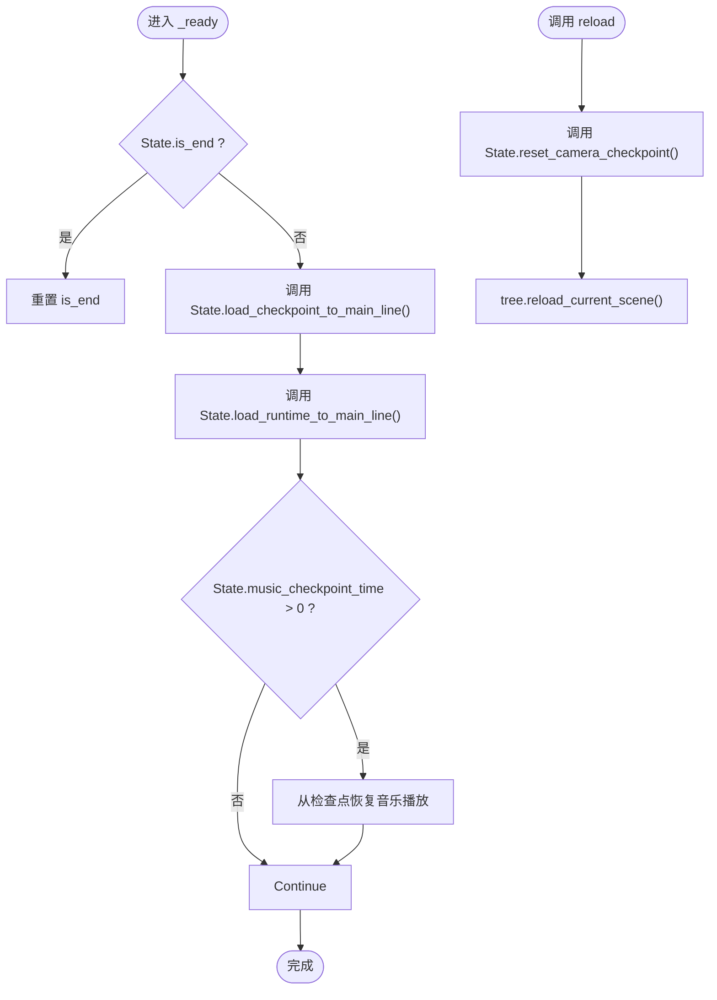

**图示来源**
- [MainLine.gd](file://#Template/[Scripts]/MainLine.gd)

**章节来源**
- [MainLine.gd](file://#Template/[Scripts]/MainLine.gd)

### 相机跟随与检查点恢复
- **重构后的检查点写入**：Crown 触发器调用 State.save_checkpoint() 统一保存所有检查点数据，包括相机参数、主线路线和音乐播放位置。
- **优化的恢复逻辑**：CameraFollower 在 _ready 与 _process 中检测 State.camera_checkpoint.restore_pending，调用 State.load_to_camera_follower() 将相机参数恢复并清除 pending 标志。

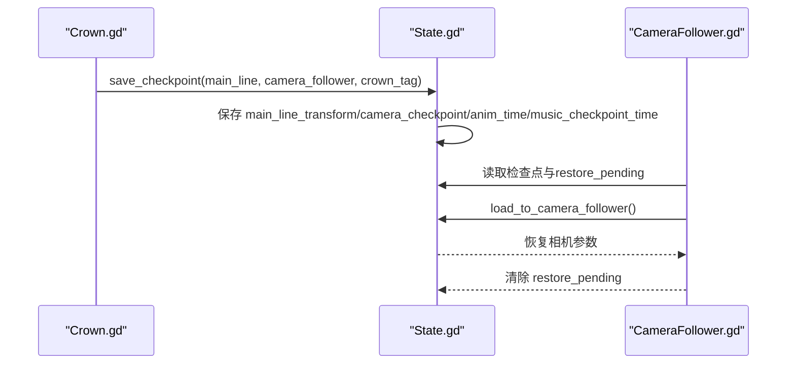

**图示来源**
- [Crown.gd](file://#Template/[Scripts]/Trigger/Crown.gd)
- [CameraFollower.gd](file://#Template/[Scripts]/CameraScripts/CameraFollower.gd)
- [State.gd](file://#Template/[Scripts]/State.gd)

**章节来源**
- [Crown.gd](file://#Template/[Scripts]/Trigger/Crown.gd)
- [CameraFollower.gd](file://#Template/[Scripts]/CameraScripts/CameraFollower.gd)
- [State.gd](file://#Template/[Scripts]/State.gd)

### 触发器：皇冠与钻石
- **重构后的皇冠（Crown.gd）**：收集时调用 State.save_checkpoint() 统一保存所有状态，包括增加 State.crown、记录 main_line_transform 与相机参数、写入 line_crossing_crown 与 crowns 数组，并播放动画后销毁。
- **优化的音乐播放检查点**：在收集时记录当前音乐播放位置到 State.music_checkpoint_time，以便后续恢复。
- **钻石（Diamond.gd）**：收集时增加 State.diamond，播放粒子与动画后销毁。

**更新**：所有触发器现在使用统一的 State.save_checkpoint() 接口，确保状态的一致性和完整性。

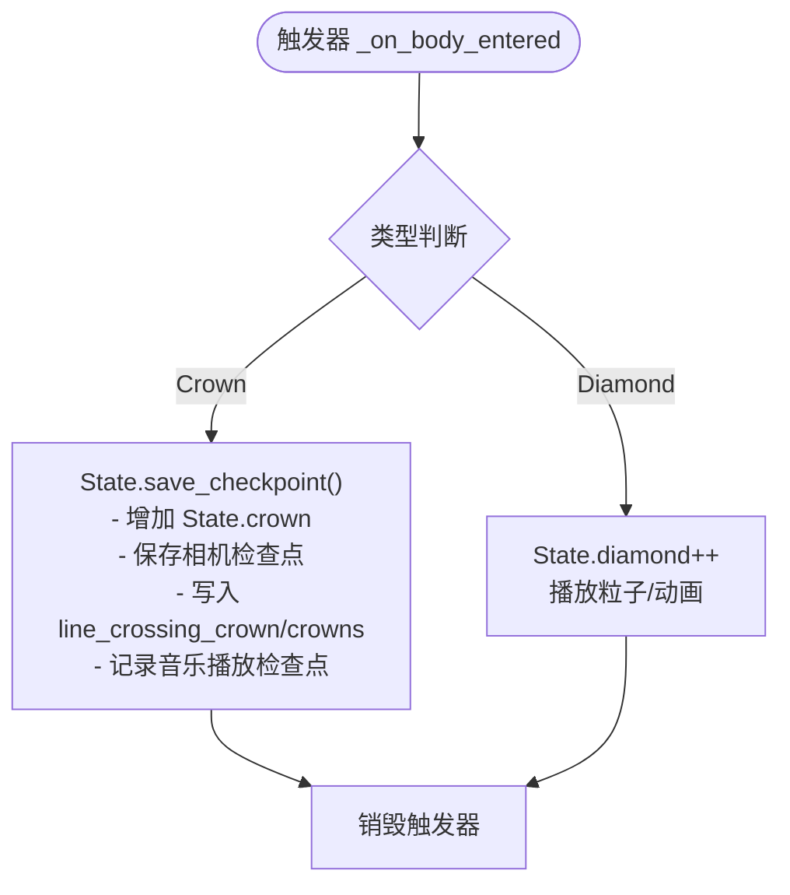

**图示来源**
- [Crown.gd](file://#Template/[Scripts]/Trigger/Crown.gd)
- [Diamond.gd](file://#Template/[Scripts]/Trigger/Diamond.gd)
- [State.gd](file://#Template/[Scripts]/State.gd)

**章节来源**
- [Crown.gd](file://#Template/[Scripts]/Trigger/Crown.gd)
- [Diamond.gd](file://#Template/[Scripts]/Trigger/Diamond.gd)
- [State.gd](file://#Template/[Scripts]/State.gd)

### 多皇冠状态管理系统
**新增** CrownSet.gd 负责管理多皇冠状态，根据重构后的 State.crowns 数组状态控制皇冠显示。

- **优化的 Crowns 数组系统**：State.crowns[3] 支持三个位置的皇冠状态管理
- **状态同步**：当 line_crossing_crown >= tag 且 State.crowns[tag-1] == 1 时，播放 crown_change 动画
- **标签系统**：通过 tag 属性标识不同的皇冠位置（1-3）

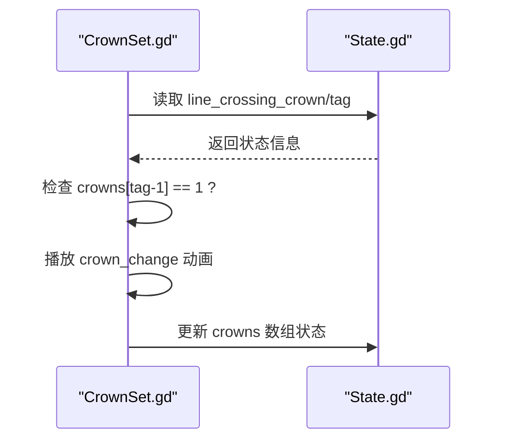

**图示来源**
- [CrownSet.gd](file://#Template/[Scripts]/Trigger/CrownSet.gd)
- [State.gd](file://#Template/[Scripts]/State.gd)

**章节来源**
- [CrownSet.gd](file://#Template/[Scripts]/Trigger/CrownSet.gd)
- [State.gd](file://#Template/[Scripts]/State.gd)

### UI 结算与状态读取
- gameui.gd 在 _process 中监听重构后的 State.is_end 与角色死亡，显示结算界面。
- 根据重构后的 State.crown 播放不同动画；若 State.is_relive 为真，则在结算前扣减 1 个 Crown。
- **优化的状态重置**：在重玩游戏时调用 State.reset_to_defaults() 重置所有状态，包括 music_checkpoint_time、crowns 数组等。

**更新**：UI 现在使用重构后的 State.reset_to_defaults() 进行完全状态重置，确保游戏从初始状态开始。

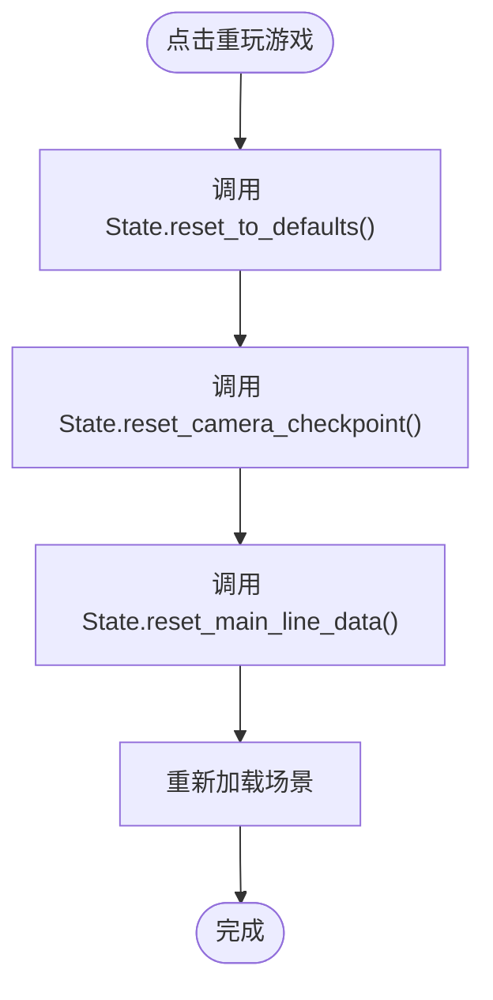

**图示来源**
- [gameui.gd](file://#Template/[Scripts]/gameui.gd)
- [State.gd](file://#Template/[Scripts]/State.gd)

**章节来源**
- [gameui.gd](file://#Template/[Scripts]/gameui.gd)
- [State.gd](file://#Template/[Scripts]/State.gd)

### SaveKit序列化框架集成
**新增**：State.gd 集成了完整的 SaveKit 序列化框架，提供以下功能：

- **save_to_dict()**：使用 SaveKitSerializer 将所有状态属性编码为字典
- **load_from_dict()**：使用 SaveKitDeserializer 从字典解码恢复状态
- **类型安全**：通过 TYPE_* 常量确保正确的数据类型转换
- **完整覆盖**：序列化所有状态数据，包括持久化数据、运行时数据和相机检查点

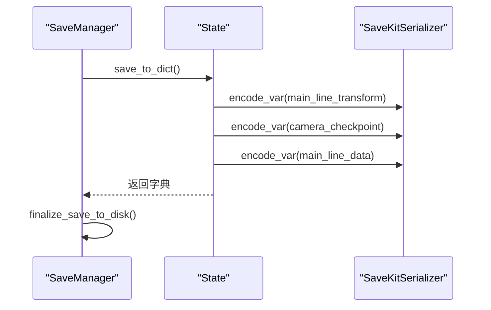

**图示来源**
- [save_manager.gd](file://addons/savekit/save_manager.gd)
- [serializer.gd](file://addons/savekit/serializer.gd)
- [State.gd](file://#Template/[Scripts]/State.gd)

**章节来源**
- [save_manager.gd](file://addons/savekit/save_manager.gd)
- [serializer.gd](file://addons/savekit/serializer.gd)
- [State.gd](file://#Template/[Scripts]/State.gd)

## 依赖分析
- **重构后的State**：作为全局中心，被 MainLine、CameraFollower、Trigger、UI 多处读取与写入，现在提供统一的接口。
- GameManager 与 MainLine 存在直接耦合：MainLine 依赖 GameManager 的动画时间计算。
- 触发器与 State 的耦合较弱，仅通过统一的 save_checkpoint() 接口进行状态写入，利于扩展新触发器。
- **新增**：SaveKit 序列化框架与 State 的集成关系。

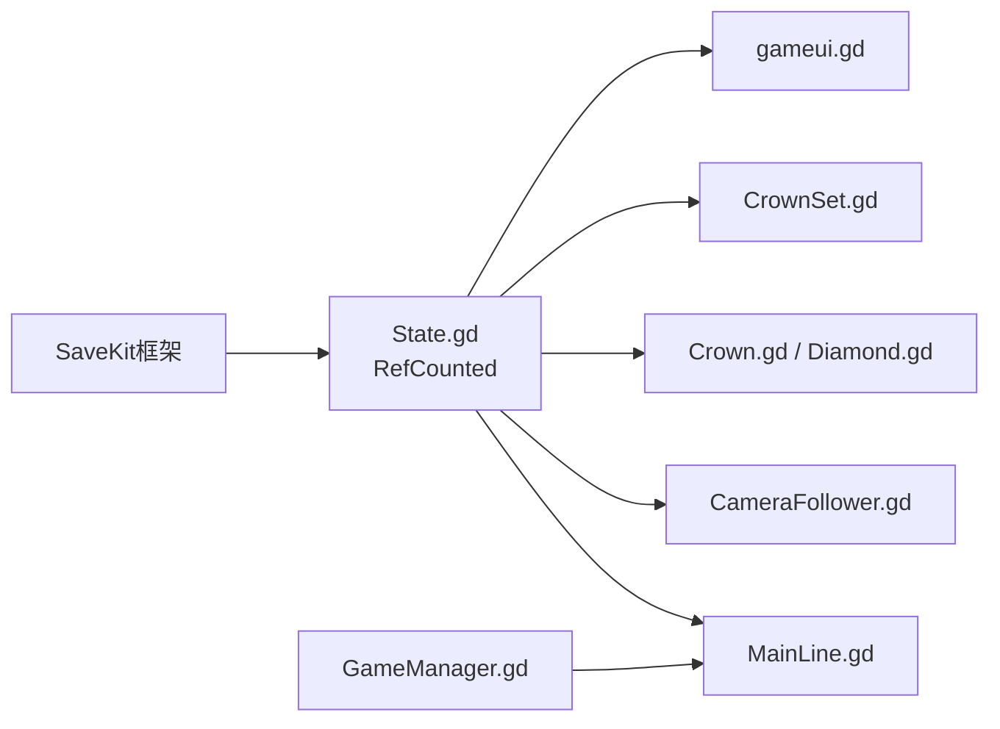

**图示来源**
- [State.gd](file://#Template/[Scripts]/State.gd)
- [MainLine.gd](file://#Template/[Scripts]/MainLine.gd)
- [GameManager.gd](file://#Template/[Scripts]/GameManager.gd)
- [CameraFollower.gd](file://#Template/[Scripts]/CameraScripts/CameraFollower.gd)
- [Crown.gd](file://#Template/[Scripts]/Trigger/Crown.gd)
- [CrownSet.gd](file://#Template/[Scripts]/Trigger/CrownSet.gd)
- [Diamond.gd](file://#Template/[Scripts]/Trigger/Diamond.gd)
- [gameui.gd](file://#Template/[Scripts]/gameui.gd)
- [save_manager.gd](file://addons/savekit/save_manager.gd)

**章节来源**
- [State.gd](file://#Template/[Scripts]/State.gd)
- [MainLine.gd](file://#Template/[Scripts]/MainLine.gd)
- [GameManager.gd](file://#Template/[Scripts]/GameManager.gd)
- [CameraFollower.gd](file://#Template/[Scripts]/CameraScripts/CameraFollower.gd)
- [Crown.gd](file://#Template/[Scripts]/Trigger/Crown.gd)
- [CrownSet.gd](file://#Template/[Scripts]/Trigger/CrownSet.gd)
- [Diamond.gd](file://#Template/[Scripts]/Trigger/Diamond.gd)
- [gameui.gd](file://#Template/[Scripts]/gameui.gd)
- [save_manager.gd](file://addons/savekit/save_manager.gd)

## 性能考虑
- **RefCounted优势**：基于 RefCounted 的状态管理提供更好的内存管理和生命周期控制，避免内存泄漏。
- 状态读写频率：重构后的 State 通过统一接口访问，减少了重复代码和潜在的竞态条件。
- 动画时间计算：GameManager 的计算为 O(1)，成本极低。
- 相机恢复：CameraFollower 的恢复逻辑在首次检测到 pending 时执行，避免每帧重复计算。
- 线段生成：MainLine 在地面阶段生成线段并同步高度，注意在高密度场景中控制生成频率与数量。
- **新增**：序列化框架的性能优化：SaveKit 提供高效的二进制和JSON序列化选项。

## 故障排查指南
- **相机未恢复**：确认 Crown 是否正确调用 State.save_checkpoint()；检查 CameraFollower 是否在 _ready/_process 中检测 restore_pending。
- 动画不同步：确认 MainLine 在转向前是否调用 GameManager.calculate_anim_start_time 并将返回值传给 AnimationPlayer.seek。
- 死亡判定异常：检查 MainLine 的 die() 逻辑与 noclip 标志，确保粒子与音效按预期播放。
- UI 不显示结算：确认重构后的 State.is_end 或角色死亡条件满足；检查 gameui.gd 的可见性逻辑。
- **新增**：音乐播放异常：检查 Crown 是否正确记录 music_checkpoint_time，MainLine 是否正确从检查点恢复播放。
- **新增**：状态序列化失败：检查 SaveKit 的序列化配置，确认所有状态数据都能正确编码和解码。
- **新增**：状态重置问题：确认使用 State.reset_to_defaults() 进行完全重置，或使用特定的 reset_* 方法进行部分重置。

**章节来源**
- [CameraFollower.gd](file://#Template/[Scripts]/CameraScripts/CameraFollower.gd)
- [GameManager.gd](file://#Template/[Scripts]/GameManager.gd)
- [MainLine.gd](file://#Template/[Scripts]/MainLine.gd)
- [gameui.gd](file://#Template/[Scripts]/gameui.gd)
- [Crown.gd](file://#Template/[Scripts]/Trigger/Crown.gd)
- [CrownSet.gd](file://#Template/[Scripts]/Trigger/CrownSet.gd)
- [State.gd](file://#Template/[Scripts]/State.gd)

## 结论
重构后的状态管理模式以基于 RefCounted 的 State.gd 为核心，通过分类化的数据结构和完整的序列化框架，实现了更加健壮和可维护的关卡状态管理。其优势在于：
- **统一接口**：通过 save_checkpoint() 等统一接口简化状态管理
- **分类化结构**：持久化数据与运行时数据分离，职责清晰
- **序列化支持**：完整的 SaveKit 集成提供持久化能力
- **内存安全**：基于 RefCounted 的生命周期管理避免内存泄漏
- **状态重置**：提供完全重置和部分重置功能
- **触发器解耦**：通过统一接口与相机恢复逻辑解耦，便于扩展
- **动画时间计算与 UI 结算分离**，职责清晰

建议在大型项目中进一步利用 SaveKit 的高级功能，如自定义序列化器、增量保存和版本兼容性管理。

## 附录

### 状态扩展指导原则
- **重构后的扩展方式**：在 State.gd 中添加新字段时，根据用途选择合适的分类（持久化数据或运行时数据）。
- **触发器接入**：新增触发器时，使用 State.save_checkpoint() 统一保存状态，避免直接修改多个状态变量。
- **相机检查点**：如需新增相机参数，统一在 Crown 触发器中通过 State.save_checkpoint() 写入，并在 CameraFollower 中读取恢复。
- UI 展示：在 gameui.gd 中按需读取重构后的 State 并更新界面。
- **新增**：序列化扩展：如果需要持久化新状态，确保在 save_to_dict() 和 load_from_dict() 中正确处理。
- **新增**：状态重置：为新状态提供相应的重置方法，确保完全重置时不会遗漏。

### 状态管理最佳实践
- **统一接口**：避免在多处直接修改同一状态，优先通过统一接口（如 State.save_checkpoint()）写入。
- **分类管理**：对关键状态（如 is_end、camera_checkpoint.restore_pending）使用布尔标志位，减少竞态风险。
- **生命周期控制**：利用 RefCounted 的优势，在场景切换或重载时，显式调用 reset_* 方法清理状态。
- **序列化策略**：对高频读写的字段（如 anim_time）尽量在必要时才更新，减少不必要的序列化操作。
- **新增**：状态验证：在 load_from_dict() 中添加数据验证逻辑，确保从存档恢复时的数据完整性。
- **新增**：渐进式重置：使用部分重置方法（如 reset_camera_checkpoint()）而不是完全重置，提高用户体验。

### 高级主题：状态同步与并发控制
- **状态同步**：在多线程或网络场景中，建议引入订阅/发布模式或事件总线，确保状态变更的顺序一致性。
- **并发控制**：对共享状态的写入使用互斥锁或队列化写入，避免竞态；读取侧可通过快照或不可变对象降低锁粒度。
- **持久化策略**：可将重构后的 State 通过 SaveKit 序列化为 JSON 或二进制存档，结合场景切换或用户主动保存功能，实现进度继承。
- **新增**：序列化优化：使用 SaveKit 的二进制序列化格式，提高存档读写的性能。
- **新增**：版本兼容**：在 save_to_dict() 中添加版本信息，支持未来状态结构的向后兼容性。
- **新增**：增量保存**：实现增量状态保存，只保存发生变化的状态，减少存档大小和IO开销。