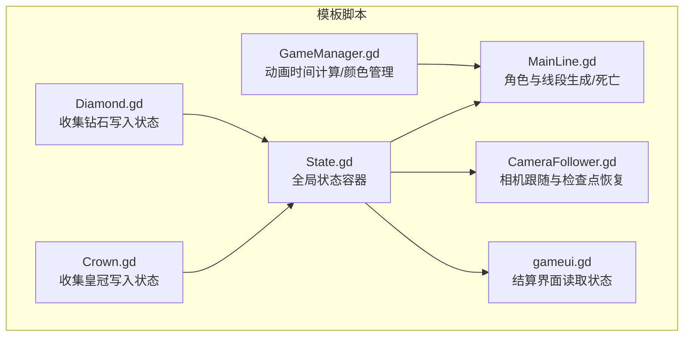
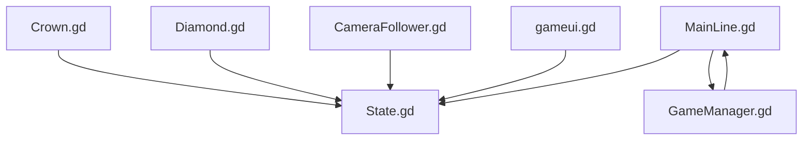
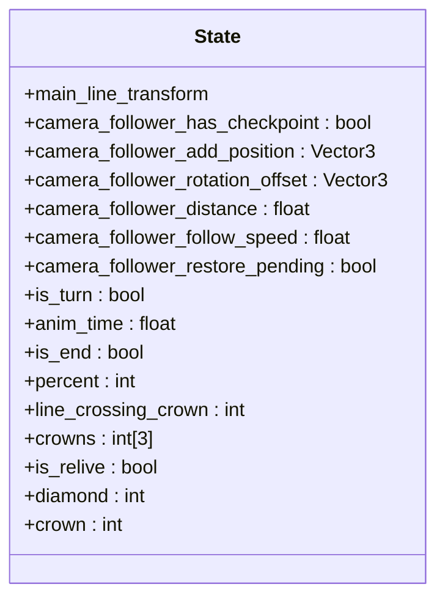
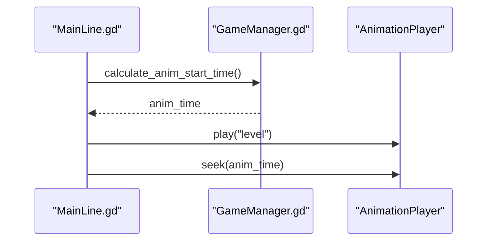
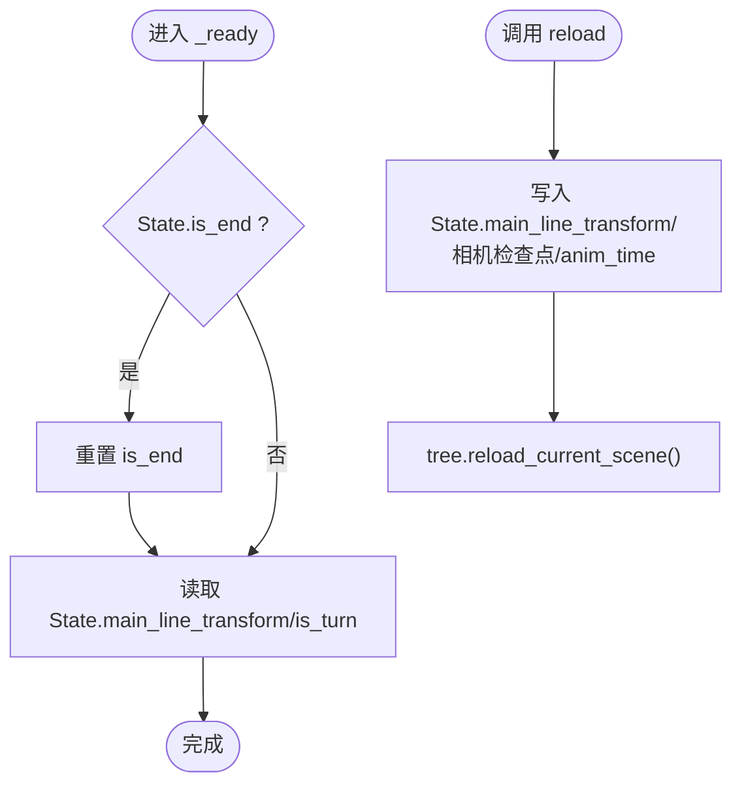
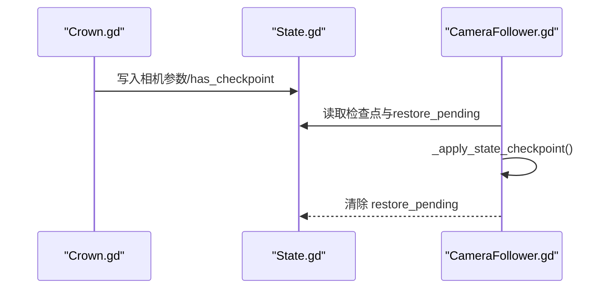
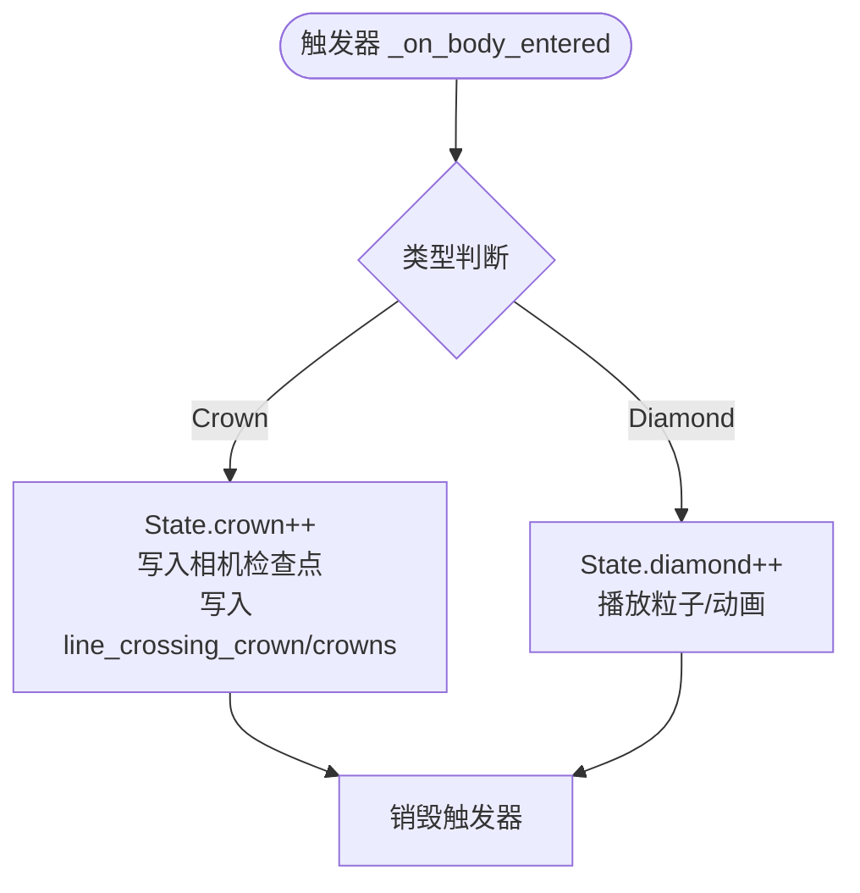
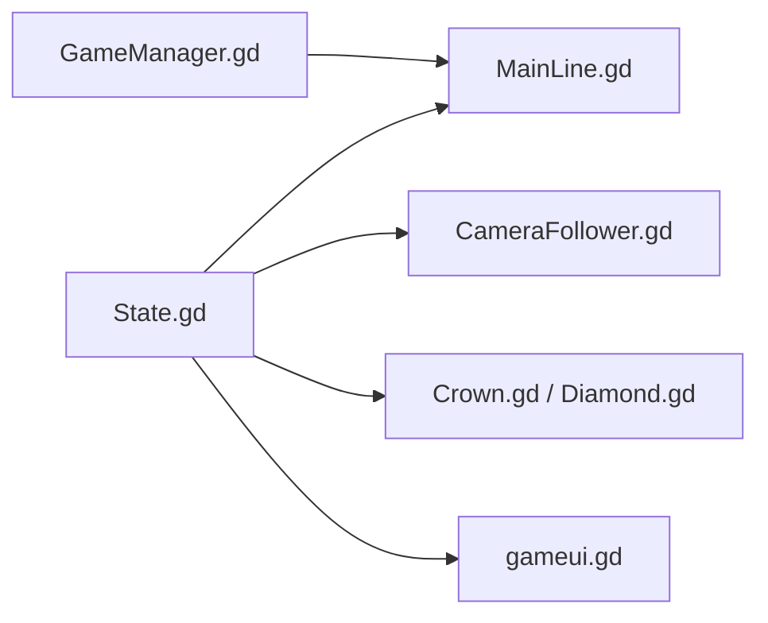

# 状态管理模式

<cite>
**本文引用的文件**
- [State.gd](file://#Template/[Scripts]/State.gd)
- [GameManager.gd](file://#Template/[Scripts]/GameManager.gd)
- [MainLine.gd](file://#Template/[Scripts]/MainLine.gd)
- [CameraFollower.gd](file://#Template/[Scripts]/CameraScripts/CameraFollower.gd)
- [Crown.gd](file://#Template/[Scripts]/Trigger/Crown.gd)
- [Diamond.gd](file://#Template/[Scripts]/Trigger/Diamond.gd)
- [gameui.gd](file://#Template/[Scripts]/gameui.gd)
- [README.md](file://README.md)
</cite>

## 目录
1. [引言](#引言)
2. [项目结构](#项目结构)
3. [核心组件](#核心组件)
4. [架构总览](#架构总览)
5. [详细组件分析](#详细组件分析)
6. [依赖分析](#依赖分析)
7. [性能考虑](#性能考虑)
8. [故障排查指南](#故障排查指南)
9. [结论](#结论)
10. [附录](#附录)

## 引言
本文件围绕 Godot Line 的状态管理模式进行系统化梳理，重点解析 State 节点作为全局状态管理器的设计与实现，覆盖以下关键主题：
- 单例模式的应用与全局访问策略
- 状态数据结构与持久化机制
- 状态更新流程与恢复机制
- GameManager 与 State 的协作关系（动画时间计算、颜色管理等）
- 状态扩展与最佳实践
- 状态同步与并发控制等高级主题

## 项目结构
本项目采用模板化的资源组织方式，核心逻辑集中在 Template/[Scripts] 下，状态管理由 State.gd 提供全局状态容器；游戏主逻辑由 MainLine.gd 实现，相机跟随由 CameraFollower.gd 实现，触发器（Crown、Diamond）负责采集状态并写入 State；UI 层通过 gameui.gd 读取 State 并展示。

图示来源
- [State.gd](file://#Template/[Scripts]/State.gd)
- [GameManager.gd](file://#Template/[Scripts]/GameManager.gd)
- [MainLine.gd](file://#Template/[Scripts]/MainLine.gd)
- [CameraFollower.gd](file://#Template/[Scripts]/CameraScripts/CameraFollower.gd)
- [Crown.gd](file://#Template/[Scripts]/Trigger/Crown.gd)
- [Diamond.gd](file://#Template/[Scripts]/Trigger/Diamond.gd)
- [gameui.gd](file://#Template/[Scripts]/gameui.gd)

章节来源
- [README.md](file://README.md)

## 核心组件
- State.gd：全局状态容器，存储主线 transform、相机跟随参数、转向状态、动画时间、通关标志、百分比、皇冠与钻石计数等。
- GameManager.gd：提供动画起始时间计算与颜色管理接口，供 MainLine 使用。
- MainLine.gd：角色主体，负责线段生成、转向动画播放与时间跳转、死亡处理、场景重载与状态恢复。
- CameraFollower.gd：相机跟随逻辑，从 State 读取检查点参数并在必要时恢复相机状态。
- Trigger/Crown.gd 与 Trigger/Diamond.gd：触发器，负责在碰撞时更新 State 的计数与检查点信息。
- gameui.gd：结算界面，读取 State.crown/diamond/percent 等并展示动画。

章节来源
- [State.gd](file://#Template/[Scripts]/State.gd)
- [GameManager.gd](file://#Template/[Scripts]/GameManager.gd)
- [MainLine.gd](file://#Template/[Scripts]/MainLine.gd)
- [CameraFollower.gd](file://#Template/[Scripts]/CameraScripts/CameraFollower.gd)
- [Crown.gd](file://#Template/[Scripts]/Trigger/Crown.gd)
- [Diamond.gd](file://#Template/[Scripts]/Trigger/Diamond.gd)
- [gameui.gd](file://#Template/[Scripts]/gameui.gd)

## 架构总览
下图展示了 State 作为中心枢纽，协调角色、相机、触发器与 UI 的交互关系。

图示来源
- [State.gd](file://#Template/[Scripts]/State.gd)
- [MainLine.gd](file://#Template/[Scripts]/MainLine.gd)
- [GameManager.gd](file://#Template/[Scripts]/GameManager.gd)
- [CameraFollower.gd](file://#Template/[Scripts]/CameraScripts/CameraFollower.gd)
- [Crown.gd](file://#Template/[Scripts]/Trigger/Crown.gd)
- [Diamond.gd](file://#Template/[Scripts]/Trigger/Diamond.gd)
- [gameui.gd](file://#Template/[Scripts]/gameui.gd)

## 详细组件分析

### State 全局状态容器
- 角色状态：main_line_transform、is_turn、anim_time、is_end、percent
- 相机检查点：camera_follower_has_checkpoint、camera_follower_add_position、camera_follower_rotation_offset、camera_follower_distance、camera_follower_follow_speed、camera_follower_restore_pending
- 关卡统计：line_crossing_crown、crowns[3]、diamond、crown、is_relive
- 单例模式：通过 Engine 元数据注册与访问，实现全局唯一状态对象（参考 Engine.meta 机制）

图示来源
- [State.gd](file://#Template/[Scripts]/State.gd)

章节来源
- [State.gd](file://#Template/[Scripts]/State.gd)

### GameManager 与动画时间计算
- 功能职责：根据起点与当前位置计算二维距离，结合速度与系数得到动画起始时间，用于在转向时同步动画播放进度。
- 与 MainLine 的协作：MainLine 在转向前调用 GameManager.calculate_anim_start_time()，并将返回值用于 AnimationPlayer.seek。

图示来源
- [GameManager.gd](file://#Template/[Scripts]/GameManager.gd)
- [MainLine.gd](file://#Template/[Scripts]/MainLine.gd)

章节来源
- [GameManager.gd](file://#Template/[Scripts]/GameManager.gd)
- [MainLine.gd](file://#Template/[Scripts]/MainLine.gd)

### MainLine 状态更新与恢复
- 状态恢复：在 _ready 中读取 State.main_line_transform 与 is_turn，并在 reload() 时重置相机检查点与动画时间。
- 状态写入：转向时若未处于“跨冠动画”，则写入 State.anim_time；死亡时触发粒子效果与音效。
- 线段生成：在地面阶段动态生成线段并维护地面段列表，以同步高度。

图示来源
- [MainLine.gd](file://#Template/[Scripts]/MainLine.gd)

章节来源
- [MainLine.gd](file://#Template/[Scripts]/MainLine.gd)

### 相机跟随与检查点恢复
- 检查点写入：Crown 触发器在收集时将相机参数写入 State，并标记 camera_follower_has_checkpoint。
- 恢复逻辑：CameraFollower 在 _ready 与 _process 中检测 State.camera_follower_restore_pending，调用 _apply_state_checkpoint 将相机参数恢复并清除 pending 标志。

图示来源
- [Crown.gd](file://#Template/[Scripts]/Trigger/Crown.gd)
- [CameraFollower.gd](file://#Template/[Scripts]/CameraScripts/CameraFollower.gd)
- [State.gd](file://#Template/[Scripts]/State.gd)

章节来源
- [Crown.gd](file://#Template/[Scripts]/Trigger/Crown.gd)
- [CameraFollower.gd](file://#Template/[Scripts]/CameraScripts/CameraFollower.gd)
- [State.gd](file://#Template/[Scripts]/State.gd)

### 触发器：皇冠与钻石
- 皇冠（Crown.gd）：收集时增加 State.crown，记录 main_line_transform 与相机参数，写入 line_crossing_crown 与 crowns 数组，并播放动画后销毁。
- 钻石（Diamond.gd）：收集时增加 State.diamond，播放粒子与动画后销毁。

图示来源
- [Crown.gd](file://#Template/[Scripts]/Trigger/Crown.gd)
- [Diamond.gd](file://#Template/[Scripts]/Trigger/Diamond.gd)
- [State.gd](file://#Template/[Scripts]/State.gd)

章节来源
- [Crown.gd](file://#Template/[Scripts]/Trigger/Crown.gd)
- [Diamond.gd](file://#Template/[Scripts]/Trigger/Diamond.gd)
- [State.gd](file://#Template/[Scripts]/State.gd)

### UI 结算与状态读取
- gameui.gd 在 _process 中监听 State.is_end 与角色死亡，显示结算界面。
- 根据 State.crown 播放不同动画；若 State.is_relive 为真，则在结算前扣减 1 个 Crown。
- 提供“返回”“重玩”“重载”按钮，分别重置或更新 State 的若干字段。

章节来源
- [gameui.gd](file://#Template/[Scripts]/gameui.gd)
- [State.gd](file://#Template/[Scripts]/State.gd)

## 依赖分析
- State 作为全局中心，被 MainLine、CameraFollower、Trigger、UI 多处读取与写入。
- GameManager 与 MainLine 存在直接耦合：MainLine 依赖 GameManager 的动画时间计算。
- 触发器与 State 的耦合较弱，仅通过字段名约定进行状态写入，利于扩展新触发器。

图示来源
- [State.gd](file://#Template/[Scripts]/State.gd)
- [MainLine.gd](file://#Template/[Scripts]/MainLine.gd)
- [GameManager.gd](file://#Template/[Scripts]/GameManager.gd)
- [CameraFollower.gd](file://#Template/[Scripts]/CameraScripts/CameraFollower.gd)
- [Crown.gd](file://#Template/[Scripts]/Trigger/Crown.gd)
- [Diamond.gd](file://#Template/[Scripts]/Trigger/Diamond.gd)
- [gameui.gd](file://#Template/[Scripts]/gameui.gd)

章节来源
- [State.gd](file://#Template/[Scripts]/State.gd)
- [MainLine.gd](file://#Template/[Scripts]/MainLine.gd)
- [GameManager.gd](file://#Template/[Scripts]/GameManager.gd)
- [CameraFollower.gd](file://#Template/[Scripts]/CameraScripts/CameraFollower.gd)
- [Crown.gd](file://#Template/[Scripts]/Trigger/Crown.gd)
- [Diamond.gd](file://#Template/[Scripts]/Trigger/Diamond.gd)
- [gameui.gd](file://#Template/[Scripts]/gameui.gd)

## 性能考虑
- 状态读写频率：State 位于 Engine.meta，频繁读写可能带来轻微开销，但整体影响有限。
- 动画时间计算：GameManager 的计算为 O(1)，成本极低。
- 相机恢复：CameraFollower 的恢复逻辑在首次检测到 pending 时执行，避免每帧重复计算。
- 线段生成：MainLine 在地面阶段生成线段并同步高度，注意在高密度场景中控制生成频率与数量，避免过多节点造成性能压力。

## 故障排查指南
- 相机未恢复：确认 Crown 是否正确写入相机参数与 has_checkpoint 标记；检查 CameraFollower 是否在 _ready/_process 中检测 restore_pending。
- 动画不同步：确认 MainLine 在转向前是否调用 GameManager.calculate_anim_start_time 并将返回值传给 AnimationPlayer.seek。
- 死亡判定异常：检查 MainLine 的 die() 逻辑与 noclip 标志，确保粒子与音效按预期播放。
- UI 不显示结算：确认 State.is_end 或角色死亡条件满足；检查 gameui.gd 的可见性逻辑。

章节来源
- [CameraFollower.gd](file://#Template/[Scripts]/CameraScripts/CameraFollower.gd)
- [GameManager.gd](file://#Template/[Scripts]/GameManager.gd)
- [MainLine.gd](file://#Template/[Scripts]/MainLine.gd)
- [gameui.gd](file://#Template/[Scripts]/gameui.gd)

## 结论
本状态管理模式以 State.gd 为核心，通过 Engine.meta 实现全局状态访问，配合触发器、相机与 UI 的协同，实现了简洁而高效的关卡状态管理。其优势在于：
- 状态集中、易于观测与调试
- 触发器与相机恢复逻辑解耦，便于扩展
- 动画时间计算与 UI 结算分离，职责清晰

建议在大型项目中进一步引入状态订阅/广播机制与持久化方案，以增强可维护性与跨场景继承能力。

## 附录

### 状态扩展指导原则
- 新增字段：在 State.gd 中声明新字段，保持语义清晰与命名一致。
- 触发器接入：新增触发器时，仅通过字段名约定写入 State，避免强耦合。
- 相机检查点：如需新增相机参数，统一在 Crown 触发器中写入 State，并在 CameraFollower 中读取恢复。
- UI 展示：在 gameui.gd 中按需读取 State 并更新界面。

### 状态管理最佳实践
- 避免在多处直接修改同一状态，优先通过统一入口（如触发器）写入。
- 对关键状态（如 is_end、camera_follower_restore_pending）使用布尔标志位，减少竞态风险。
- 在场景切换或重载时，显式清理或重置 State，防止状态泄漏。
- 对高频读写的字段（如 anim_time）尽量在必要时才更新，减少不必要的写操作。

### 高级主题：状态同步与并发控制
- 状态同步：在多线程或网络场景中，建议引入订阅/发布模式或事件总线，确保状态变更的顺序一致性。
- 并发控制：对共享状态的写入使用互斥锁或队列化写入，避免竞态；读取侧可通过快照或不可变对象降低锁粒度。
- 持久化：可将 State 序列化为 JSON 或二进制存档，结合场景切换或用户主动保存功能，实现进度继承。