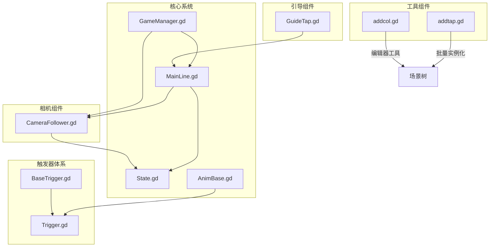
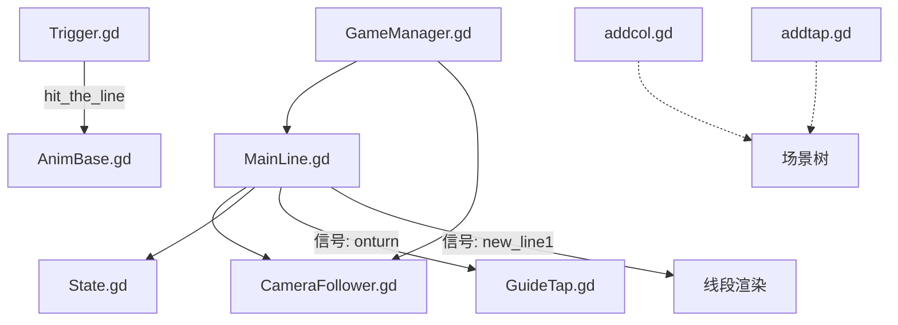
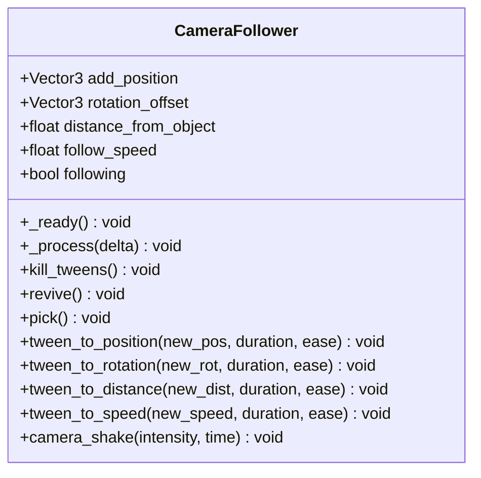
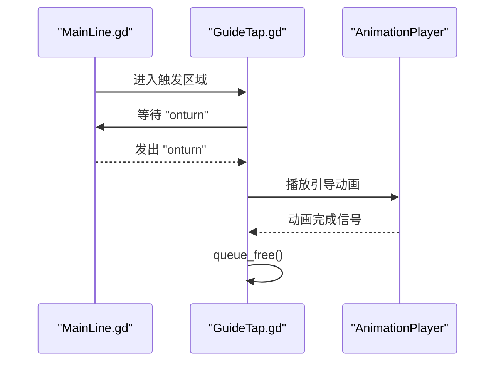
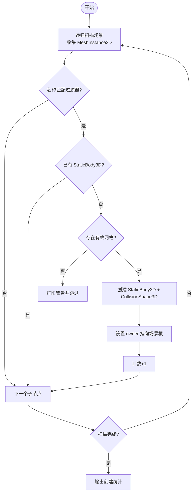
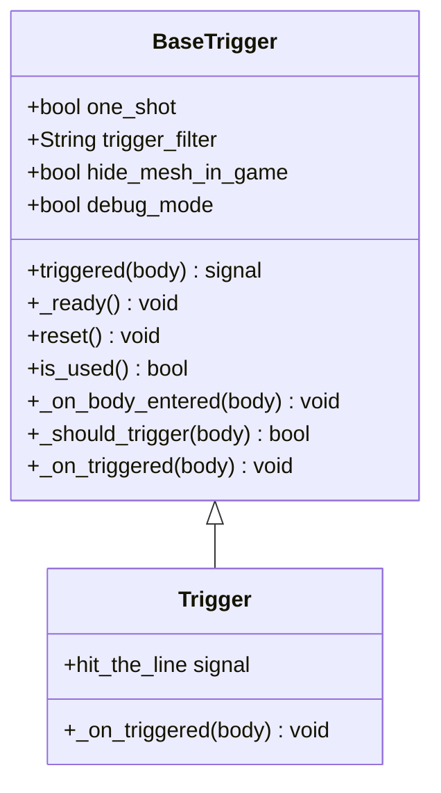
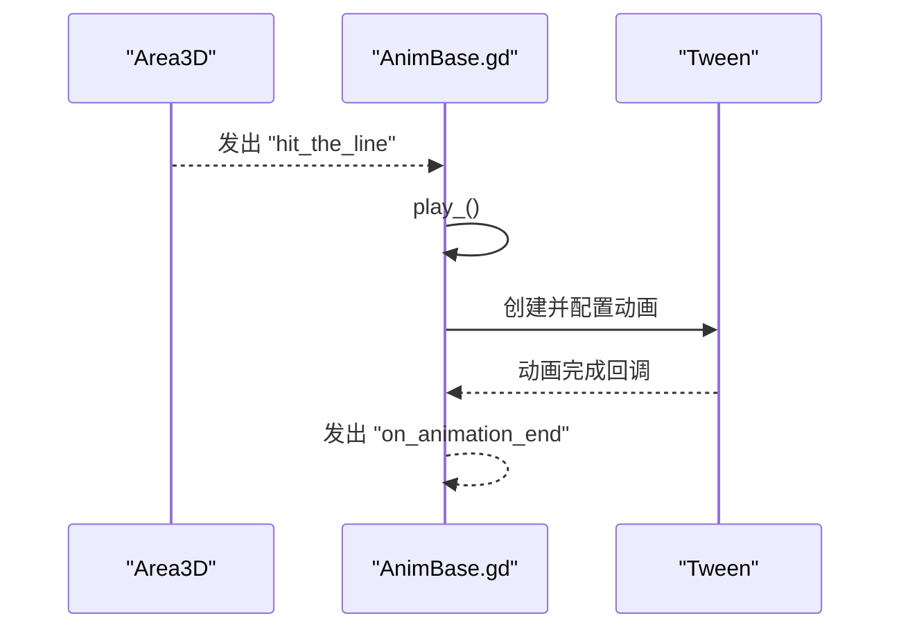
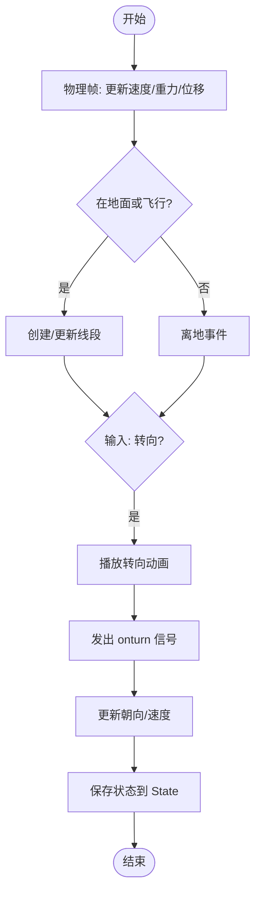
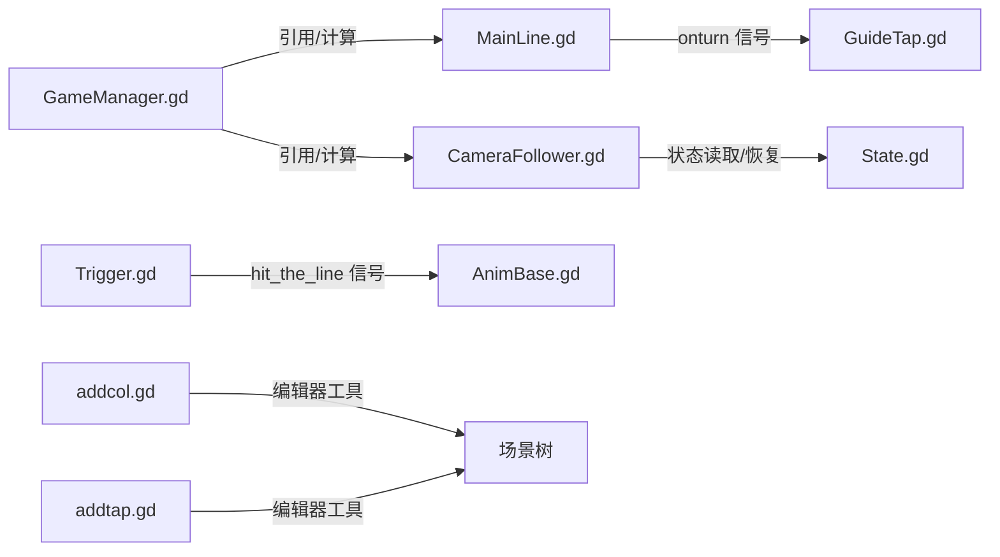

# 组件模式

<cite>
**本文引用的文件**
- [CameraFollower.gd](file://#Template/[Scripts]/CameraScripts/CameraFollower.gd)
- [GuideTap.gd](file://#Template/[Scripts]/GuideLine/GuideTap.gd)
- [addcol.gd](file://#Template/[Scripts]/PortTookits/addcol.gd)
- [addtap.gd](file://#Template/[Scripts]/PortTookits/addtap.gd)
- [BaseTrigger.gd](file://#Template/[Scripts]/Trigger/BaseTrigger.gd)
- [Trigger.gd](file://#Template/[Scripts]/Trigger/Trigger.gd)
- [GameManager.gd](file://#Template/[Scripts]/GameManager.gd)
- [State.gd](file://#Template/[Scripts]/State.gd)
- [AnimBase.gd](file://#Template/[Scripts]/AnimBase.gd)
- [MainLine.gd](file://#Template/[Scripts]/MainLine.gd)
</cite>

## 目录
1. [引言](#引言)
2. [项目结构](#项目结构)
3. [核心组件](#核心组件)
4. [架构总览](#架构总览)
5. [详细组件分析](#详细组件分析)
6. [依赖分析](#依赖分析)
7. [性能考量](#性能考量)
8. [故障排查指南](#故障排查指南)
9. [结论](#结论)
10. [附录](#附录)

## 引言
本文件系统性梳理 Godot Line 项目中的“组件模式”，聚焦于独立功能组件的设计与实现，包括相机跟随组件、引导点击组件、工具组件以及触发器体系，并解释它们的职责分离、接口设计、组合使用方式、组件间通信与依赖关系。同时给出扩展与自定义的指导原则，涵盖生命周期管理、资源共享、错误处理等主题，并总结在游戏开发中的最佳实践与性能优化建议。

## 项目结构
项目采用按功能域分层的脚本组织方式：
- CameraScripts：相机相关组件（如相机跟随、震动等）
- GuideLine：引导交互组件（如引导点击）
- PortTookits：关卡/场景辅助工具（碰撞体生成、引导点放置等）
- Trigger：触发器体系（基础触发器与具体触发器）
- 其他核心脚本：游戏状态、动画基类、主角色、管理器等

图表来源
- [CameraFollower.gd:1-168](file://#Template/[Scripts]/CameraScripts/CameraFollower.gd#L1-L168)
- [GuideTap.gd:1-11](file://#Template/[Scripts]/GuideLine/GuideTap.gd#L1-L11)
- [addcol.gd:1-121](file://#Template/[Scripts]/PortTookits/addcol.gd#L1-L121)
- [addtap.gd:1-27](file://#Template/[Scripts]/PortTookits/addtap.gd#L1-L27)
- [BaseTrigger.gd:1-102](file://#Template/[Scripts]/Trigger/BaseTrigger.gd#L1-L102)
- [Trigger.gd:1-10](file://#Template/[Scripts]/Trigger/Trigger.gd#L1-L10)
- [GameManager.gd:1-47](file://#Template/[Scripts]/GameManager.gd#L1-L47)
- [State.gd:1-21](file://#Template/[Scripts]/State.gd#L1-L21)
- [AnimBase.gd:1-82](file://#Template/[Scripts]/AnimBase.gd#L1-L82)
- [MainLine.gd:1-224](file://#Template/[Scripts]/MainLine.gd#L1-L224)

章节来源
- [CameraFollower.gd:1-168](file://#Template/[Scripts]/CameraScripts/CameraFollower.gd#L1-L168)
- [GuideTap.gd:1-11](file://#Template/[Scripts]/GuideLine/GuideTap.gd#L1-L11)
- [addcol.gd:1-121](file://#Template/[Scripts]/PortTookits/addcol.gd#L1-L121)
- [addtap.gd:1-27](file://#Template/[Scripts]/PortTookits/addtap.gd#L1-L27)
- [BaseTrigger.gd:1-102](file://#Template/[Scripts]/Trigger/BaseTrigger.gd#L1-L102)
- [Trigger.gd:1-10](file://#Template/[Scripts]/Trigger/Trigger.gd#L1-L10)
- [GameManager.gd:1-47](file://#Template/[Scripts]/GameManager.gd#L1-L47)
- [State.gd:1-21](file://#Template/[Scripts]/State.gd#L1-L21)
- [AnimBase.gd:1-82](file://#Template/[Scripts]/AnimBase.gd#L1-L82)
- [MainLine.gd:1-224](file://#Template/[Scripts]/MainLine.gd#L1-L224)

## 核心组件
- 相机跟随组件（CameraFollower）：负责根据玩家节点动态调整相机位置与旋转，支持平滑插值、参数化配置、状态检查点恢复、震动等能力。
- 引导点击组件（GuideTap）：在角色进入触发区域时播放引导动画并清理自身。
- 工具组件（addcol、addtap）：编辑器工具，批量为网格生成凸形碰撞体或在子节点位置批量添加引导点击对象。
- 触发器体系（BaseTrigger、Trigger）：提供统一的触发逻辑、过滤器、一次性触发、信号发射与重置能力；子类通过覆盖回调实现自定义行为。
- 动画基类（AnimBase）：抽象动画控制器，支持编辑器下设定起点/终点、运行时触发播放、过渡类型与缓动配置。
- 主角色（MainLine）：玩家角色，负责移动、转向、连线绘制、死亡与粒子效果、状态持久化等。
- 游戏管理器（GameManager）：提供相机、主角色引用、原点位置、动画起始时间计算、颜色设置等。
- 游戏状态（State）：跨场景共享的状态容器，承载相机跟随参数、动画时间、通关/复活等全局状态。

章节来源
- [CameraFollower.gd:1-168](file://#Template/[Scripts]/CameraScripts/CameraFollower.gd#L1-L168)
- [GuideTap.gd:1-11](file://#Template/[Scripts]/GuideLine/GuideTap.gd#L1-L11)
- [addcol.gd:1-121](file://#Template/[Scripts]/PortTookits/addcol.gd#L1-L121)
- [addtap.gd:1-27](file://#Template/[Scripts]/PortTookits/addtap.gd#L1-L27)
- [BaseTrigger.gd:1-102](file://#Template/[Scripts]/Trigger/BaseTrigger.gd#L1-L102)
- [Trigger.gd:1-10](file://#Template/[Scripts]/Trigger/Trigger.gd#L1-L10)
- [AnimBase.gd:1-82](file://#Template/[Scripts]/AnimBase.gd#L1-L82)
- [MainLine.gd:1-224](file://#Template/[Scripts]/MainLine.gd#L1-L224)
- [GameManager.gd:1-47](file://#Template/[Scripts]/GameManager.gd#L1-L47)
- [State.gd:1-21](file://#Template/[Scripts]/State.gd#L1-L21)

## 架构总览
组件间通过以下方式进行协作：
- 主角色（MainLine）驱动游戏流程，与相机跟随（CameraFollower）建立父子/依赖关系，与状态（State）进行数据交换。
- 触发器（BaseTrigger/Trigger）与动画基类（AnimBase）解耦，通过信号与外部触发器（Area3D）对接。
- 工具组件（addcol/addtap）在编辑器环境下对场景树进行修改，不参与运行时逻辑。
- 游戏管理器（GameManager）提供全局计算与资源引用，供主角色与相机跟随使用。

图表来源
- [MainLine.gd:1-224](file://#Template/[Scripts]/MainLine.gd#L1-L224)
- [CameraFollower.gd:1-168](file://#Template/[Scripts]/CameraScripts/CameraFollower.gd#L1-L168)
- [State.gd:1-21](file://#Template/[Scripts]/State.gd#L1-L21)
- [GuideTap.gd:1-11](file://#Template/[Scripts]/GuideLine/GuideTap.gd#L1-L11)
- [Trigger.gd:1-10](file://#Template/[Scripts]/Trigger/Trigger.gd#L1-L10)
- [AnimBase.gd:1-82](file://#Template/[Scripts]/AnimBase.gd#L1-L82)
- [GameManager.gd:1-47](file://#Template/[Scripts]/GameManager.gd#L1-L47)
- [addcol.gd:1-121](file://#Template/[Scripts]/PortTookits/addcol.gd#L1-L121)
- [addtap.gd:1-27](file://#Template/[Scripts]/PortTookits/addtap.gd#L1-L27)

## 详细组件分析

### 相机跟随组件（CameraFollower）
职责与接口
- 跟随玩家节点，支持平滑插值、偏移量与距离配置、速度调节。
- 提供状态检查点读取与恢复、参数化Tween动画、相机震动等能力。
- 通过状态模块（State）实现跨场景参数持久化与恢复。

关键实现要点
- 参数化属性：位置偏移、旋转偏移、跟随距离、跟随速度、开关标志等。
- 状态恢复：在就绪阶段检测是否存在检查点并执行恢复，随后标记恢复完成。
- 平滑跟随：基于插值函数实现平滑过渡，避免瞬移。
- 动态Tween：提供针对位置、旋转、距离、速度的Tween封装，便于动画化调整。
- 安全停止：当玩家处于特定状态时，停止跟随并终止所有进行中的Tween。

图表来源
- [CameraFollower.gd:1-168](file://#Template/[Scripts]/CameraScripts/CameraFollower.gd#L1-L168)

章节来源
- [CameraFollower.gd:1-168](file://#Template/[Scripts]/CameraScripts/CameraFollower.gd#L1-L168)
- [State.gd:1-21](file://#Template/[Scripts]/State.gd#L1-L21)

### 引导点击组件（GuideTap）
职责与接口
- 作为场景中的引导点击对象，当角色进入其区域时触发引导动画并销毁自身。
- 与主角色的转向信号联动，保证动画播放顺序。

关键实现要点
- 进入触发：检测 CharacterBody3D 类型角色进入，等待其转向信号完成后播放引导动画。
- 动画播放：通过 AnimationPlayer 播放预设动画并等待结束。
- 生命周期：播放结束后主动释放自身，避免残留。

图表来源
- [GuideTap.gd:1-11](file://#Template/[Scripts]/GuideLine/GuideTap.gd#L1-L11)
- [MainLine.gd:1-224](file://#Template/[Scripts]/MainLine.gd#L1-L224)

章节来源
- [GuideTap.gd:1-11](file://#Template/[Scripts]/GuideLine/GuideTap.gd#L1-L11)
- [MainLine.gd:1-224](file://#Template/[Scripts]/MainLine.gd#L1-L224)

### 工具组件（addcol、addtap）
职责与接口
- addcol：编辑器工具，为场景中满足名称过滤条件的网格实例批量添加凸形碰撞体，支持移除。
- addtap：编辑器工具，遍历当前节点的子节点，在相同位置批量实例化引导点击对象。

关键实现要点
- 名称过滤：支持大小写无关的关键字过滤，仅对匹配的节点进行处理。
- 递归扫描：递归遍历场景树，收集 MeshInstance3D 或 StaticBody3D。
- 批量操作：在编辑器提示下执行创建/移除，设置 owner 以确保保存到场景。
- 安全检查：跳过已有碰撞体的节点，避免重复创建。

图表来源
- [addcol.gd:1-121](file://#Template/[Scripts]/PortTookits/addcol.gd#L1-L121)

章节来源
- [addcol.gd:1-121](file://#Template/[Scripts]/PortTookits/addcol.gd#L1-L121)
- [addtap.gd:1-27](file://#Template/[Scripts]/PortTookits/addtap.gd#L1-L27)

### 触发器体系（BaseTrigger、Trigger）
职责与接口
- BaseTrigger：提供统一的触发逻辑、过滤器、一次性触发、调试输出、信号发射与重置能力。
- Trigger：继承自 BaseTrigger，发射通用信号供其他组件订阅。

关键实现要点
- 触发过滤：支持仅允许 CharacterBody3D、PhysicsBody3D 或任意类型触发。
- 一次性触发：可配置 one_shot，防止重复触发。
- 信号链路：在满足条件时发出 triggered(body)，并调用子类 _on_triggered(body)。
- 重置：提供 reset() 以重新激活 one_shot 触发器。

图表来源
- [BaseTrigger.gd:1-102](file://#Template/[Scripts]/Trigger/BaseTrigger.gd#L1-L102)
- [Trigger.gd:1-10](file://#Template/[Scripts]/Trigger/Trigger.gd#L1-L10)

章节来源
- [BaseTrigger.gd:1-102](file://#Template/[Scripts]/Trigger/BaseTrigger.gd#L1-L102)
- [Trigger.gd:1-10](file://#Template/[Scripts]/Trigger/Trigger.gd#L1-L10)

### 动画基类（AnimBase）
职责与接口
- 抽象动画控制器，支持编辑器下设定起点/终点、运行时触发播放、过渡类型与缓动配置。
- 与外部触发器（Area3D）通过信号对接，实现事件驱动的动画播放。

关键实现要点
- 编辑器工具：提供“设置起点/终点/播放”按钮，自动记录当前值或应用到目标属性。
- 运行时播放：创建 Tween，设置过渡与缓动，播放完成后回到起点（编辑器模式）。
- 触发对接：若绑定触发器且其发出 hit_the_line，则自动播放。

图表来源
- [AnimBase.gd:1-82](file://#Template/[Scripts]/AnimBase.gd#L1-L82)
- [Trigger.gd:1-10](file://#Template/[Scripts]/Trigger/Trigger.gd#L1-L10)

章节来源
- [AnimBase.gd:1-82](file://#Template/[Scripts]/AnimBase.gd#L1-L82)
- [Trigger.gd:1-10](file://#Template/[Scripts]/Trigger/Trigger.gd#L1-L10)

### 主角色（MainLine）
职责与接口
- 控制角色移动、转向、连线绘制、死亡与粒子效果、状态持久化。
- 与相机跟随、动画系统、状态模块协同工作。

关键实现要点
- 物理移动：在物理帧更新速度与位移，处理重力、墙面碰撞与飞行模式。
- 连线绘制：在地面阶段创建线段节点并维护尾段列表，实时更新位置与缩放。
- 转向动画：在满足条件时播放动画并更新朝向，同时发出转向信号供引导点击使用。
- 死亡处理：播放音效与粒子，生成碎块并施加冲量与扭矩。
- 状态持久化：在重载场景前保存关键状态至 State。

图表来源
- [MainLine.gd:1-224](file://#Template/[Scripts]/MainLine.gd#L1-L224)
- [State.gd:1-21](file://#Template/[Scripts]/State.gd#L1-L21)

章节来源
- [MainLine.gd:1-224](file://#Template/[Scripts]/MainLine.gd#L1-L224)
- [State.gd:1-21](file://#Template/[Scripts]/State.gd#L1-L21)

### 游戏管理器（GameManager）
职责与接口
- 提供相机、主角色引用，计算动画起始时间，设置/获取主角色颜色。
- 提供编辑器工具按钮，用于快速设置/获取原点位置。

关键实现要点
- 动画起始时间：基于主角色与原点的 2D 距离与速度计算。
- 颜色管理：通过主角色材质设置/获取颜色。
- 编辑器工具：提供“获取原点/回到原点”的便捷操作。

章节来源
- [GameManager.gd:1-47](file://#Template/[Scripts]/GameManager.gd#L1-L47)
- [MainLine.gd:1-224](file://#Template/[Scripts]/MainLine.gd#L1-L224)

## 依赖分析
- 组件内聚与耦合
  - CameraFollower 与 State 高度耦合（状态恢复），但与 MainLine 通过信号弱耦合。
  - GuideTap 与 MainLine 通过信号弱耦合，无直接依赖。
  - addcol/addtap 仅在编辑器环境工作，不参与运行时逻辑。
  - BaseTrigger/Trigger 与 AnimBase 解耦，通过 Area3D 与信号对接。
- 外部依赖
  - Godot 核心节点类型：Node3D、Area3D、CharacterBody3D、AnimationPlayer、Tween、StaticBody3D、CollisionShape3D 等。
  - 场景树与资源：场景中的节点路径、材质、动画资源等。

图表来源
- [CameraFollower.gd:1-168](file://#Template/[Scripts]/CameraScripts/CameraFollower.gd#L1-L168)
- [GuideTap.gd:1-11](file://#Template/[Scripts]/GuideLine/GuideTap.gd#L1-L11)
- [addcol.gd:1-121](file://#Template/[Scripts]/PortTookits/addcol.gd#L1-L121)
- [addtap.gd:1-27](file://#Template/[Scripts]/PortTookits/addtap.gd#L1-L27)
- [BaseTrigger.gd:1-102](file://#Template/[Scripts]/Trigger/BaseTrigger.gd#L1-L102)
- [Trigger.gd:1-10](file://#Template/[Scripts]/Trigger/Trigger.gd#L1-L10)
- [AnimBase.gd:1-82](file://#Template/[Scripts]/AnimBase.gd#L1-L82)
- [GameManager.gd:1-47](file://#Template/[Scripts]/GameManager.gd#L1-L47)
- [State.gd:1-21](file://#Template/[Scripts]/State.gd#L1-L21)
- [MainLine.gd:1-224](file://#Template/[Scripts]/MainLine.gd#L1-L224)

章节来源
- [CameraFollower.gd:1-168](file://#Template/[Scripts]/CameraScripts/CameraFollower.gd#L1-L168)
- [GuideTap.gd:1-11](file://#Template/[Scripts]/GuideLine/GuideTap.gd#L1-L11)
- [addcol.gd:1-121](file://#Template/[Scripts]/PortTookits/addcol.gd#L1-L121)
- [addtap.gd:1-27](file://#Template/[Scripts]/PortTookits/addtap.gd#L1-L27)
- [BaseTrigger.gd:1-102](file://#Template/[Scripts]/Trigger/BaseTrigger.gd#L1-L102)
- [Trigger.gd:1-10](file://#Template/[Scripts]/Trigger/Trigger.gd#L1-L10)
- [AnimBase.gd:1-82](file://#Template/[Scripts]/AnimBase.gd#L1-L82)
- [GameManager.gd:1-47](file://#Template/[Scripts]/GameManager.gd#L1-L47)
- [State.gd:1-21](file://#Template/[Scripts]/State.gd#L1-L21)
- [MainLine.gd:1-224](file://#Template/[Scripts]/MainLine.gd#L1-L224)

## 性能考量
- 相机跟随
  - 使用插值而非瞬移，避免视觉抖动；合理设置 follow_speed，避免过度频繁的 Tween。
  - 在停止跟随时及时 kill_tweens，减少不必要的动画开销。
- 触发器
  - one_shot 避免重复触发带来的额外处理；过滤器应尽量精确，减少无效判断。
  - 调试模式仅在开发阶段开启，避免运行时日志开销。
- 动画基类
  - 编辑器模式下自动记录值，运行时避免重复创建 Tween；过渡与缓动类型选择应平衡表现与性能。
- 主角色
  - 连线绘制仅在地面阶段进行，避免离地时的无效更新；粒子系统按需播放，避免过多并发。
- 工具组件
  - 批量操作仅在编辑器执行，避免在运行时扫描场景树造成卡顿。

## 故障排查指南
- 相机跟随未生效
  - 检查 player 节点路径是否正确，相机子节点是否存在。
  - 确认 following 开关与玩家状态（如 Is_Stop/Over）是否导致提前停止。
  - 若使用状态恢复，请确认 State 中的检查点参数是否正确。
- 引导点击不播放
  - 确认角色进入区域并发出 onturn 信号；检查 AnimationPlayer 的动画名称与播放顺序。
- 触发器无效
  - 检查 trigger_filter 与实际进入的节点类型是否匹配；确认 one_shot 已重置。
  - 查看调试输出以定位触发条件。
- 动画基类不播放
  - 确认已连接 Area3D 的 hit_the_line 信号；检查过渡与缓动参数是否合理。
- 工具组件无效果
  - 确认在编辑器环境下执行；检查名称过滤器与场景树结构。

章节来源
- [CameraFollower.gd:1-168](file://#Template/[Scripts]/CameraScripts/CameraFollower.gd#L1-L168)
- [GuideTap.gd:1-11](file://#Template/[Scripts]/GuideLine/GuideTap.gd#L1-L11)
- [BaseTrigger.gd:1-102](file://#Template/[Scripts]/Trigger/BaseTrigger.gd#L1-L102)
- [AnimBase.gd:1-82](file://#Template/[Scripts]/AnimBase.gd#L1-L82)
- [addcol.gd:1-121](file://#Template/[Scripts]/PortTookits/addcol.gd#L1-L121)
- [addtap.gd:1-27](file://#Template/[Scripts]/PortTookits/addtap.gd#L1-L27)

## 结论
Godot Line 的组件模式通过清晰的职责划分与松耦合设计，实现了相机跟随、引导交互、触发器与动画系统的灵活组合。借助状态模块与信号机制，组件间实现了稳定的通信与复用。遵循本文的扩展与最佳实践建议，可在保持性能与可维护性的前提下，进一步增强组件的灵活性与可定制性。

## 附录
- 组件扩展与自定义指导原则
  - 生命周期管理：在 _ready 中完成初始化与连接，在 _process/_physics_process 中处理更新；在需要时提供 pause/resume 能力。
  - 接口设计：统一使用信号与参数化属性，避免硬编码依赖；提供 reset/is_used 等状态查询接口。
  - 资源共享：通过 SceneTree 或全局节点（如 GameManager）提供共享引用；避免在组件内部硬编码路径。
  - 错误处理：对空引用、无效节点、缺失资源进行防御式检查；在编辑器模式下提供友好的提示。
  - 性能优化：减少不必要的计算与动画；在运行时避免深度递归扫描；合理使用 one_shot 与过滤器。