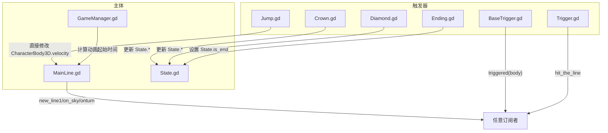
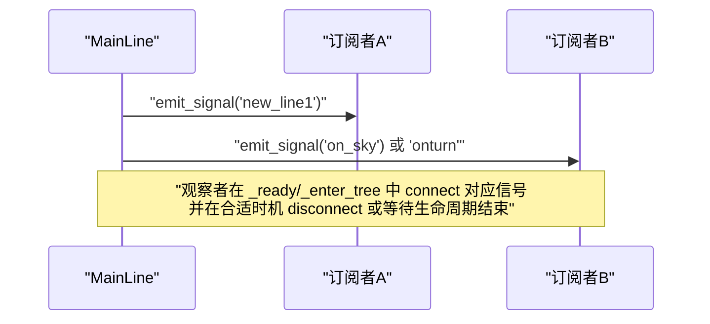
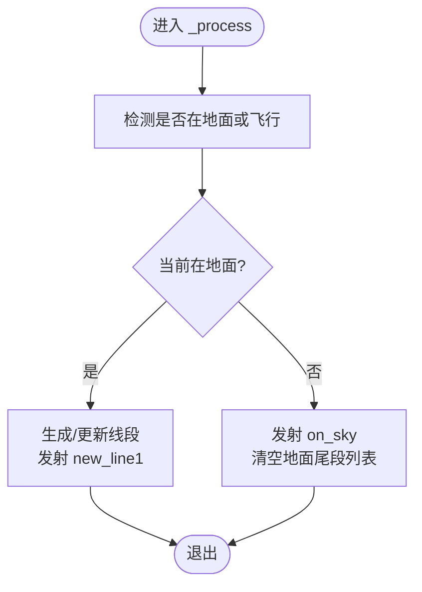
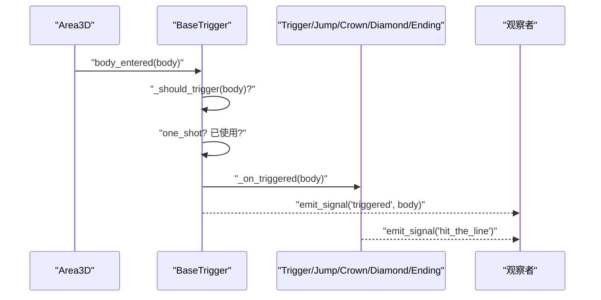
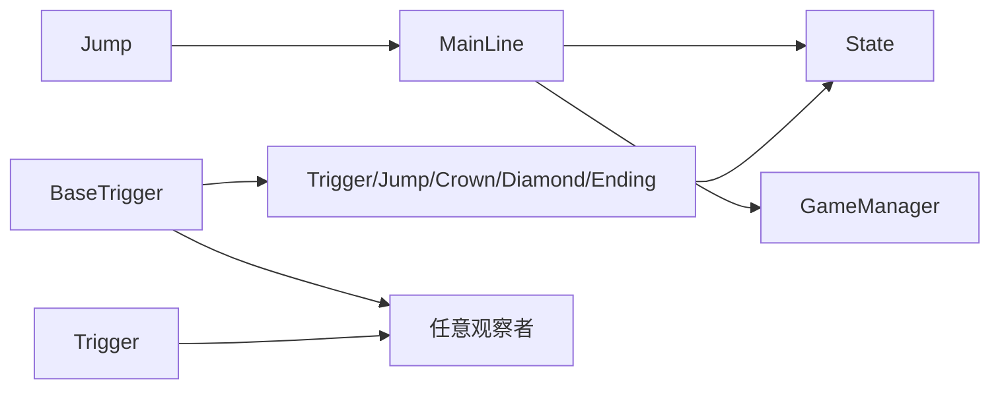

# 观察者模式

<cite>
**本文引用的文件**
- [MainLine.gd](file://#Template/[Scripts]/MainLine.gd)
- [State.gd](file://#Template/[Scripts]/State.gd)
- [BaseTrigger.gd](file://#Template/[Scripts]/Trigger/BaseTrigger.gd)
- [Trigger.gd](file://#Template/[Scripts]/Trigger/Trigger.gd)
- [GameManager.gd](file://#Template/[Scripts]/GameManager.gd)
- [Crown.gd](file://#Template/[Scripts]/Trigger/Crown.gd)
- [Diamond.gd](file://#Template/[Scripts]/Trigger/Diamond.gd)
- [Jump.gd](file://#Template/[Scripts]/Trigger/Jump.gd)
- [Ending.gd](file://#Template/[Scripts]/Trigger/Ending.gd)
- [MainLine_test.gd](file://Tests/MainLine_test.gd)
</cite>

## 目录
1. [引言](#引言)
2. [项目结构](#项目结构)
3. [核心组件](#核心组件)
4. [架构总览](#架构总览)
5. [详细组件分析](#详细组件分析)
6. [依赖关系分析](#依赖关系分析)
7. [性能考量](#性能考量)
8. [故障排查指南](#故障排查指南)
9. [结论](#结论)
10. [附录](#附录)

## 引言
本文件系统化阐述 Godot Line 中基于信号（Signal）的观察者模式实现，重点覆盖以下方面：
- 信号发射、连接与断开的完整流程
- MainLine、Trigger、State 等组件之间的事件通信机制
- 自定义信号设计与使用，如 new_line1、on_sky、onturn、triggered、hit_the_line 等
- 信号管理最佳实践：内存泄漏防护、循环引用规避
- 异步事件处理与性能优化策略

## 项目结构
围绕观察者模式的关键文件组织如下：
- 主体角色
  - MainLine.gd：玩家主体，负责移动、转向、地面/空中状态切换、线段生成与信号发射
  - State.gd：全局状态容器，跨场景持久化关键状态
  - GameManager.gd：辅助计算动画起始时间、颜色等
- 触发器体系
  - BaseTrigger.gd：触发器基类，统一“进入区域→判断过滤→一次性触发→发射 triggered 信号”的流程
  - Trigger.gd：通用触发器，发射 hit_the_line 信号
  - Jump.gd：继承 BaseTrigger，对 CharacterBody3D 施加跳跃速度
  - Crown.gd：拾取皇冠，更新状态并播放动画后销毁
  - Diamond.gd：拾取钻石，更新状态并播放粒子/动画后销毁
  - Ending.gd：终点区域，触发结算与结束逻辑

图表来源
- [MainLine.gd:1-224](file://#Template/[Scripts]/MainLine.gd#L1-L224)
- [State.gd:1-21](file://#Template/[Scripts]/State.gd#L1-L21)
- [BaseTrigger.gd:1-102](file://#Template/[Scripts]/Trigger/BaseTrigger.gd#L1-L102)
- [Trigger.gd:1-10](file://#Template/[Scripts]/Trigger/Trigger.gd#L1-L10)
- [Jump.gd:1-13](file://#Template/[Scripts]/Trigger/Jump.gd#L1-L13)
- [Crown.gd:1-44](file://#Template/[Scripts]/Trigger/Crown.gd#L1-L44)
- [Diamond.gd:1-17](file://#Template/[Scripts]/Trigger/Diamond.gd#L1-L17)
- [Ending.gd:1-15](file://#Template/[Scripts]/Trigger/Ending.gd#L1-L15)
- [GameManager.gd:1-47](file://#Template/[Scripts]/GameManager.gd#L1-L47)

章节来源
- [MainLine.gd:1-224](file://#Template/[Scripts]/MainLine.gd#L1-L224)
- [State.gd:1-21](file://#Template/[Scripts]/State.gd#L1-L21)
- [BaseTrigger.gd:1-102](file://#Template/[Scripts]/Trigger/BaseTrigger.gd#L1-L102)
- [Trigger.gd:1-10](file://#Template/[Scripts]/Trigger/Trigger.gd#L1-L10)
- [Jump.gd:1-13](file://#Template/[Scripts]/Trigger/Jump.gd#L1-L13)
- [Crown.gd:1-44](file://#Template/[Scripts]/Trigger/Crown.gd#L1-L44)
- [Diamond.gd:1-17](file://#Template/[Scripts]/Trigger/Diamond.gd#L1-L17)
- [Ending.gd:1-15](file://#Template/[Scripts]/Trigger/Ending.gd#L1-L15)
- [GameManager.gd:1-47](file://#Template/[Scripts]/GameManager.gd#L1-L47)

## 核心组件
- MainLine：作为事件源，负责在物理帧与处理帧中根据状态变化发射 new_line1、on_sky、onturn 等信号；同时通过 State 在场景间共享状态
- BaseTrigger：作为事件源，统一处理 body_entered，按过滤器与一次性触发策略发射 triggered(body)，并调用子类 _on_triggered
- Trigger：继承 BaseTrigger，发射 hit_the_line 信号，便于通用监听
- Jump：继承 BaseTrigger，直接对 CharacterBody3D 修改速度，体现“信号+直接副作用”的混合模式
- Crown/Diamond/Ending：作为事件消费者与状态变更者，更新 State 并执行动画/销毁

章节来源
- [MainLine.gd:4-104](file://#Template/[Scripts]/MainLine.gd#L4-L104)
- [BaseTrigger.gd:8-91](file://#Template/[Scripts]/Trigger/BaseTrigger.gd#L8-L91)
- [Trigger.gd:6-9](file://#Template/[Scripts]/Trigger/Trigger.gd#L6-L9)
- [Jump.gd:8-12](file://#Template/[Scripts]/Trigger/Jump.gd#L8-L12)
- [Crown.gd:25-43](file://#Template/[Scripts]/Trigger/Crown.gd#L25-L43)
- [Diamond.gd:7-16](file://#Template/[Scripts]/Trigger/Diamond.gd#L7-L16)
- [Ending.gd:7-14](file://#Template/[Scripts]/Trigger/Ending.gd#L7-L14)
- [State.gd:1-21](file://#Template/[Scripts]/State.gd#L1-L21)

## 架构总览
观察者模式在本项目中的体现：
- 事件源：MainLine、BaseTrigger 派生类、Area3D 触发器
- 观察者：任意订阅了相应信号的节点或脚本
- 状态枢纽：State 提供跨场景状态共享，使信号驱动的状态变更可被其他模块感知

图表来源
- [MainLine.gd:139-161](file://#Template/[Scripts]/MainLine.gd#L139-L161)
- [MainLine.gd:99-103](file://#Template/[Scripts]/MainLine.gd#L99-L103)
- [MainLine.gd:168-184](file://#Template/[Scripts]/MainLine.gd#L168-L184)

## 详细组件分析

### MainLine：信号发射与状态联动
- 信号定义与发射
  - new_line1：每生成一条新线段时发射，通知观察者进行渲染或特效同步
  - on_sky：从地面离地时发射，用于暂停/冻结尾段窗口等逻辑
  - onturn：转向动作开始时发射，用于相机/动画同步
- 关键流程
  - 物理帧：处理重力、移动、碰撞检测；在地面与空中切换时发射 on_sky
  - 处理帧：检测位移并动态调整线段位置与缩放；每次生成新线段时发射 new_line1
  - 输入帧：响应输入触发转向，发射 onturn 并更新速度与线段起点
- 与 State 的交互
  - 读取/保存 State.main_line_transform、State.is_turn、State.anim_time 等，保证重启/加载时状态一致
  - 通过 GameManager 计算动画起始时间，配合 State 同步动画进度

图表来源
- [MainLine.gd:75-103](file://#Template/[Scripts]/MainLine.gd#L75-L103)
- [MainLine.gd:139-161](file://#Template/[Scripts]/MainLine.gd#L139-L161)

章节来源
- [MainLine.gd:4-104](file://#Template/[Scripts]/MainLine.gd#L4-L104)
- [MainLine.gd:114-124](file://#Template/[Scripts]/MainLine.gd#L114-L124)
- [GameManager.gd:23-39](file://#Template/[Scripts]/GameManager.gd#L23-L39)
- [State.gd:1-21](file://#Template/[Scripts]/State.gd#L1-L21)

### BaseTrigger 与 Trigger：统一触发与信号发射
- BaseTrigger
  - 统一入口：监听 body_entered，按 one_shot 与 trigger_filter 进行过滤
  - 信号发射：满足条件后发射 triggered(body)，随后调用子类 _on_triggered
  - 生命周期：在 _ready 中仅连接一次 body_entered，避免重复连接
- Trigger
  - 继承 BaseTrigger，直接发射 hit_the_line，便于通用监听

图表来源
- [BaseTrigger.gd:29-73](file://#Template/[Scripts]/Trigger/BaseTrigger.gd#L29-L73)
- [BaseTrigger.gd:76-91](file://#Template/[Scripts]/Trigger/BaseTrigger.gd#L76-L91)
- [Trigger.gd:8-9](file://#Template/[Scripts]/Trigger/Trigger.gd#L8-L9)

章节来源
- [BaseTrigger.gd:1-102](file://#Template/[Scripts]/Trigger/BaseTrigger.gd#L1-L102)
- [Trigger.gd:1-10](file://#Template/[Scripts]/Trigger/Trigger.gd#L1-L10)

### Jump：信号与直接副作用结合
- 继承 BaseTrigger，接收 triggered(body)，对 CharacterBody3D 直接施加速度
- 体现了“信号 + 直接副作用”的混合模式，适合即时物理修改

章节来源
- [Jump.gd:1-13](file://#Template/[Scripts]/Trigger/Jump.gd#L1-L13)

### Crown/Diamond/Ending：状态变更与信号消费
- Crown：拾取后更新 State.crown、State.main_line_transform、State.camera_follower_* 等，并播放动画后销毁
- Diamond：拾取后更新 State.diamond，播放粒子/动画后销毁
- Ending：进入后播放动画、调整主玩家朝向与尾部缩放、触发转向、设置 State.is_end

章节来源
- [Crown.gd:25-43](file://#Template/[Scripts]/Trigger/Crown.gd#L25-L43)
- [Diamond.gd:7-16](file://#Template/[Scripts]/Trigger/Diamond.gd#L7-L16)
- [Ending.gd:7-14](file://#Template/[Scripts]/Trigger/Ending.gd#L7-L14)

## 依赖关系分析
- MainLine 依赖 State 与 GameManager
  - 读取/写入 State 以保持跨场景一致性
  - 使用 GameManager 计算动画起始时间，确保动画与当前位置匹配
- 触发器依赖 BaseTrigger 的统一连接与过滤机制
  - Trigger/Jump/Crown/Diamond/Ending 各自扩展 _on_triggered 实现差异化行为
- 观察者依赖信号连接
  - 在合适的生命周期（如 _ready/_enter_tree）建立连接，在对象释放前断开或依赖自动清理

图表来源
- [MainLine.gd:42-51](file://#Template/[Scripts]/MainLine.gd#L42-L51)
- [GameManager.gd:23-39](file://#Template/[Scripts]/GameManager.gd#L23-L39)
- [BaseTrigger.gd:47-51](file://#Template/[Scripts]/Trigger/BaseTrigger.gd#L47-L51)
- [Trigger.gd:6-9](file://#Template/[Scripts]/Trigger/Trigger.gd#L6-L9)
- [Jump.gd:8-12](file://#Template/[Scripts]/Trigger/Jump.gd#L8-L12)
- [Crown.gd:25-43](file://#Template/[Scripts]/Trigger/Crown.gd#L25-L43)
- [Diamond.gd:7-16](file://#Template/[Scripts]/Trigger/Diamond.gd#L7-L16)

章节来源
- [MainLine.gd:1-224](file://#Template/[Scripts]/MainLine.gd#L1-L224)
- [BaseTrigger.gd:1-102](file://#Template/[Scripts]/Trigger/BaseTrigger.gd#L1-L102)
- [Trigger.gd:1-10](file://#Template/[Scripts]/Trigger/Trigger.gd#L1-L10)
- [Jump.gd:1-13](file://#Template/[Scripts]/Trigger/Jump.gd#L1-L13)
- [Crown.gd:1-44](file://#Template/[Scripts]/Trigger/Crown.gd#L1-L44)
- [Diamond.gd:1-17](file://#Template/[Scripts]/Trigger/Diamond.gd#L1-L17)
- [Ending.gd:1-15](file://#Template/[Scripts]/Trigger/Ending.gd#L1-L15)
- [GameManager.gd:1-47](file://#Template/[Scripts]/GameManager.gd#L1-L47)
- [State.gd:1-21](file://#Template/[Scripts]/State.gd#L1-L21)

## 性能考量
- 信号连接去重
  - BaseTrigger 在 _ready 中仅连接一次 body_entered，避免重复连接导致的多次回调与潜在性能问题
- 一次性触发优化
  - one_shot 标志减少无效处理，降低不必要的状态更新与动画播放
- 状态共享与延迟计算
  - State 作为全局单例式容器，避免频繁跨场景传递复杂数据，减少拷贝与查找成本
- 动画时间计算
  - GameManager 使用当前位置与导出系数快速估算动画起始时间，避免复杂路径计算带来的帧抖动

章节来源
- [BaseTrigger.gd:47-51](file://#Template/[Scripts]/Trigger/BaseTrigger.gd#L47-L51)
- [BaseTrigger.gd:56-63](file://#Template/[Scripts]/Trigger/BaseTrigger.gd#L56-L63)
- [GameManager.gd:23-39](file://#Template/[Scripts]/GameManager.gd#L23-L39)

## 故障排查指南
- 信号未触发
  - 检查触发器是否正确连接 body_entered；确认 one_shot 未提前使用
  - 确认 trigger_filter 与目标节点类型匹配
- 观察者未收到信号
  - 确认观察者在 _ready 或 _enter_tree 中已 connect 对应信号
  - 若使用一次性触发，需在合适时机调用 reset 重置状态
- 状态不同步
  - 确认 MainLine 在 _ready 中读取 State 并在 reload 时写回关键字段
  - 拾取器（Crown/Diamond/Ending）完成后是否正确 queue_free，避免残留节点影响后续逻辑
- 内存泄漏与循环引用
  - 不要持有对 MainLine 或 Area3D 的强引用；使用信号弱化耦合
  - 在对象释放前断开信号连接（若手动管理），或依赖 Godot 的自动清理机制

章节来源
- [BaseTrigger.gd:29-73](file://#Template/[Scripts]/Trigger/BaseTrigger.gd#L29-L73)
- [BaseTrigger.gd:94-101](file://#Template/[Scripts]/Trigger/BaseTrigger.gd#L94-L101)
- [MainLine.gd:42-51](file://#Template/[Scripts]/MainLine.gd#L42-L51)
- [Crown.gd:42-43](file://#Template/[Scripts]/Trigger/Crown.gd#L42-L43)
- [Diamond.gd:11-12](file://#Template/[Scripts]/Trigger/Diamond.gd#L11-L12)

## 结论
本项目通过清晰的信号分层与统一的触发器基类，实现了高内聚、低耦合的观察者模式：
- 事件源职责单一：MainLine 专注玩家行为与线段生成；触发器专注区域触发与状态更新
- 观察者解耦：通过信号与 State 协作，避免强耦合与循环引用
- 可扩展性强：新增触发器仅需继承 BaseTrigger 并实现 _on_triggered
- 性能友好：连接去重、一次性触发、状态共享与延迟计算共同保障流畅体验

## 附录
- 信号清单与用途
  - new_line1：通知生成新线段，用于渲染/特效同步
  - on_sky：通知离地，用于暂停尾段窗口
  - onturn：通知转向开始，用于相机/动画同步
  - triggered(body)：通用触发信号，携带触发者节点
  - hit_the_line：通用命中信号，便于通用监听
- 测试要点（来自单元测试）
  - 验证 MainLine 场景与脚本存在性
  - 验证信号存在性（new_line1、on_sky、onturn）
  - 验证方法存在性（turn/reload/die）
  - 验证属性默认值与可变性（speed、rot、color、fly、noclip、is_turn、is_live、timeout）

章节来源
- [MainLine_test.gd:141-177](file://Tests/MainLine_test.gd#L141-L177)
- [MainLine_test.gd:213-249](file://Tests/MainLine_test.gd#L213-L249)