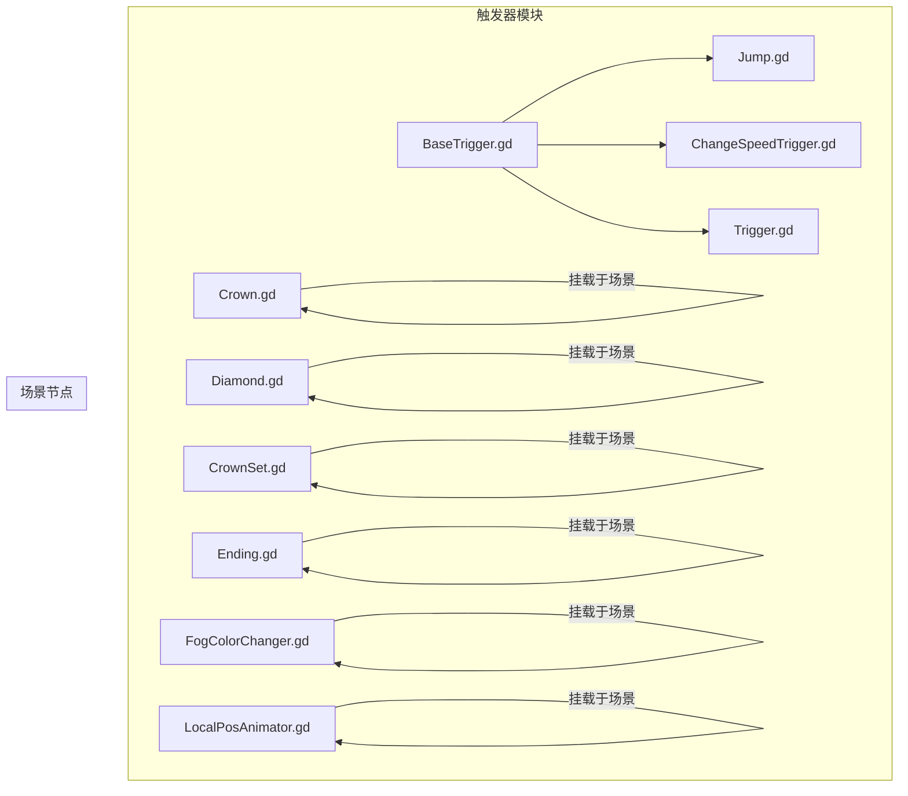
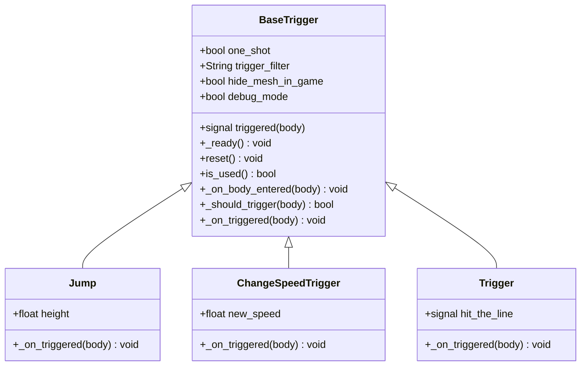
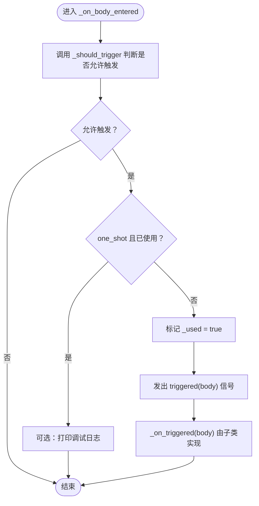
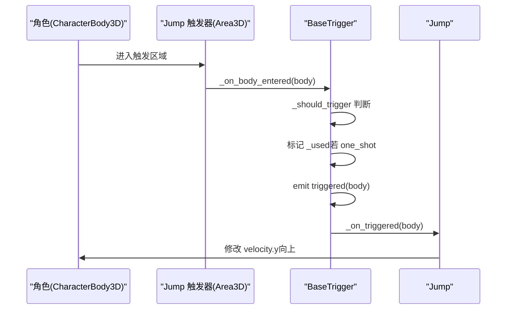
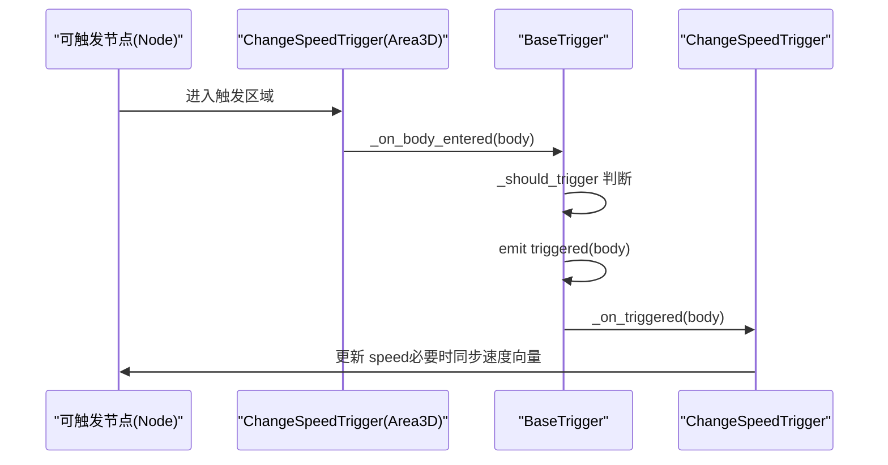
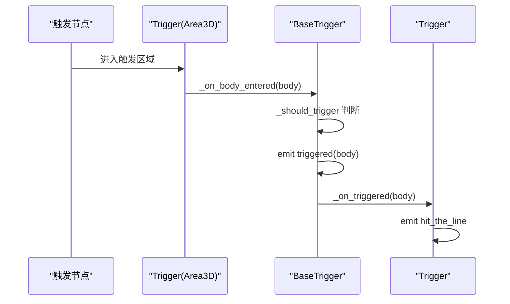
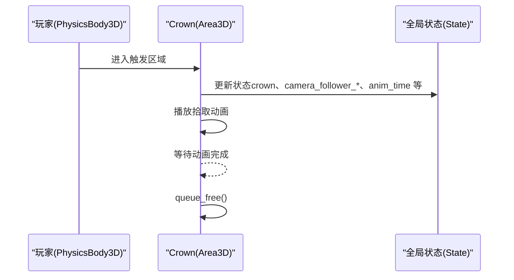
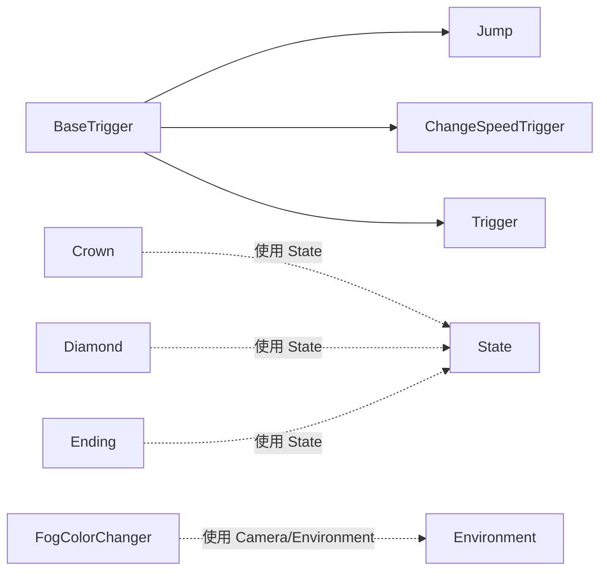

# 触发器模式

<cite>
**本文引用的文件**
- [BaseTrigger.gd](file://#Template/[Scripts]/Trigger/BaseTrigger.gd)
- [Jump.gd](file://#Template/[Scripts]/Trigger/Jump.gd)
- [ChangeSpeedTrigger.gd](file://#Template/[Scripts]/Trigger/ChangeSpeedTrigger.gd)
- [Trigger.gd](file://#Template/[Scripts]/Trigger/Trigger.gd)
- [Crown.gd](file://#Template/[Scripts]/Trigger/Crown.gd)
- [Diamond.gd](file://#Template/[Scripts]/Trigger/Diamond.gd)
- [CrownSet.gd](file://#Template/[Scripts]/Trigger/CrownSet.gd)
- [Ending.gd](file://#Template/[Scripts]/Trigger/Ending.gd)
- [FogColorChanger.gd](file://#Template/[Scripts]/Trigger/FogColorChanger.gd)
- [LocalPosAnimator.gd](file://#Template/[Scripts]/Trigger/LocalPosAnimator.gd)
</cite>

## 目录
1. [引言](#引言)
2. [项目结构](#项目结构)
3. [核心组件](#核心组件)
4. [架构总览](#架构总览)
5. [详细组件分析](#详细组件分析)
6. [依赖关系分析](#依赖关系分析)
7. [性能考量](#性能考量)
8. [故障排查指南](#故障排查指南)
9. [结论](#结论)
10. [附录](#附录)

## 引言
本文件系统性阐述 Godot Line 中“触发器模式”的设计与实现，重点围绕 BaseTrigger 基类展开，解释其模板方法模式的应用、生命周期管理、一次性触发机制与触发过滤器系统；并结合具体子类（如 Jump、ChangeSpeedTrigger、Trigger、Crown、Diamond、CrownSet、Ending、FogColorChanger、LocalPosAnimator）说明如何继承 BaseTrigger 并实现定制逻辑。文档同时覆盖配置项、调试能力、信号系统的使用方式，并给出扩展最佳实践与常见问题的解决方案。

## 项目结构
触发器相关脚本集中于 #Template/[Scripts]/Trigger/ 目录，采用“基类 + 多个派生触发器”的分层组织方式：
- 基类：BaseTrigger.gd 提供统一的触发入口、过滤与生命周期钩子
- 行为触发器：Jump.gd、ChangeSpeedTrigger.gd、Trigger.gd 继承 BaseTrigger 实现不同交互
- 场景触发器：Crown.gd、Diamond.gd、CrownSet.gd、Ending.gd、FogColorChanger.gd 等直接挂载于场景节点
- 动画与工具：LocalPosAnimator.gd 等作为动画辅助组件

图表来源
- [BaseTrigger.gd:1-102](file://#Template/[Scripts]/Trigger/BaseTrigger.gd#L1-L102)
- [Jump.gd:1-13](file://#Template/[Scripts]/Trigger/Jump.gd#L1-L13)
- [ChangeSpeedTrigger.gd:1-15](file://#Template/[Scripts]/Trigger/ChangeSpeedTrigger.gd#L1-L15)
- [Trigger.gd:1-10](file://#Template/[Scripts]/Trigger/Trigger.gd#L1-L10)
- [Crown.gd:1-54](file://#Template/[Scripts]/Trigger/Crown.gd#L1-L54)
- [Diamond.gd:1-17](file://#Template/[Scripts]/Trigger/Diamond.gd#L1-L17)
- [CrownSet.gd:1-13](file://#Template/[Scripts]/Trigger/CrownSet.gd#L1-L13)
- [Ending.gd:1-15](file://#Template/[Scripts]/Trigger/Ending.gd#L1-L15)
- [FogColorChanger.gd:1-25](file://#Template/[Scripts]/Trigger/FogColorChanger.gd#L1-L25)
- [LocalPosAnimator.gd:1-13](file://#Template/[Scripts]/Trigger/LocalPosAnimator.gd#L1-L13)

章节来源
- [BaseTrigger.gd:1-102](file://#Template/[Scripts]/Trigger/BaseTrigger.gd#L1-L102)
- [Jump.gd:1-13](file://#Template/[Scripts]/Trigger/Jump.gd#L1-L13)
- [ChangeSpeedTrigger.gd:1-15](file://#Template/[Scripts]/Trigger/ChangeSpeedTrigger.gd#L1-L15)
- [Trigger.gd:1-10](file://#Template/[Scripts]/Trigger/Trigger.gd#L1-L10)
- [Crown.gd:1-54](file://#Template/[Scripts]/Trigger/Crown.gd#L1-L54)
- [Diamond.gd:1-17](file://#Template/[Scripts]/Trigger/Diamond.gd#L1-L17)
- [CrownSet.gd:1-13](file://#Template/[Scripts]/Trigger/CrownSet.gd#L1-L13)
- [Ending.gd:1-15](file://#Template/[Scripts]/Trigger/Ending.gd#L1-L15)
- [FogColorChanger.gd:1-25](file://#Template/[Scripts]/Trigger/FogColorChanger.gd#L1-L25)
- [LocalPosAnimator.gd:1-13](file://#Template/[Scripts]/Trigger/LocalPosAnimator.gd#L1-L13)

## 核心组件
本节聚焦 BaseTrigger 基类的设计理念与实现要点，涵盖模板方法模式、生命周期、一次性触发与过滤器。

- 设计理念与模板方法
  - BaseTrigger 将“检测到碰撞”这一外部事件与“实际触发行为”解耦：子类仅需实现 _on_triggered 即可完成自定义逻辑，而触发条件、过滤与信号发射由基类统一处理。
  - 模板方法体现在 _on_body_entered 的固定流程：先判断是否应触发（_should_trigger），再处理一次性触发标记，随后发出 triggered 信号，最后调用 _on_triggered。

- 生命周期管理
  - _ready：在运行时隐藏可视化网格（可选）、建立触发信号连接（仅首次有效）。
  - 运行期：Area3D 的 body_entered 事件驱动触发流程。
  - 重置：reset 可清除一次性触发标记，便于关卡重试或动态复用。

- 一次性触发机制
  - one_shot 为真时，首次触发后内部标记 _used 置位；后续同次进入将被忽略（可选打印日志）。
  - reset 可手动重置状态，使触发器再次生效。

- 触发过滤器系统
  - trigger_filter 支持三类过滤：
    - CharacterBody3D：仅允许 CharacterBody3D 类型节点触发
    - PhysicsBody3D：允许任意 PhysicsBody3D 派生体触发
    - Any：允许任何节点触发
  - 默认回退到 CharacterBody3D，确保安全兼容。

- 配置与调试
  - hide_mesh_in_game：运行时隐藏 MeshInstance3D 子节点，避免影响渲染
  - debug_mode：开启后输出触发日志，便于定位问题
  - 通过 @export 暴露参数，可在编辑器中直观配置

- 信号系统
  - BaseTrigger 定义 triggered(body) 信号，子类无需重复声明，即可与其他节点解耦通信

章节来源
- [BaseTrigger.gd:1-102](file://#Template/[Scripts]/Trigger/BaseTrigger.gd#L1-L102)

## 架构总览
下图展示 BaseTrigger 与其派生触发器之间的继承关系与职责分工：

图表来源
- [BaseTrigger.gd:1-102](file://#Template/[Scripts]/Trigger/BaseTrigger.gd#L1-L102)
- [Jump.gd:1-13](file://#Template/[Scripts]/Trigger/Jump.gd#L1-L13)
- [ChangeSpeedTrigger.gd:1-15](file://#Template/[Scripts]/Trigger/ChangeSpeedTrigger.gd#L1-L15)
- [Trigger.gd:1-10](file://#Template/[Scripts]/Trigger/Trigger.gd#L1-L10)

## 详细组件分析

### BaseTrigger 基类
- 触发流程（模板方法）
  - 输入：body_entered 事件携带的 Node3D
  - 步骤：_should_trigger → 一次性检查 → 发出 triggered → 调用 _on_triggered
- 过滤策略：根据 trigger_filter 选择类型匹配
- 一次性触发：one_shot + _used 标记
- 重置：reset 清除 _used
- 可见性：hide_mesh_in_game 控制运行时网格隐藏
- 调试：debug_mode 输出触发日志

图表来源
- [BaseTrigger.gd:54-91](file://#Template/[Scripts]/Trigger/BaseTrigger.gd#L54-L91)

章节来源
- [BaseTrigger.gd:1-102](file://#Template/[Scripts]/Trigger/BaseTrigger.gd#L1-L102)

### Jump 触发器
- 继承 BaseTrigger，实现垂直跳跃效果
- 参数：height 决定跳跃高度（通过物理公式计算初速度）
- 触发时机：当 CharacterBody3D 进入触发区时执行
- 行为：对 CharacterBody3D.velocity 增加向上的速度分量

图表来源
- [BaseTrigger.gd:54-91](file://#Template/[Scripts]/Trigger/BaseTrigger.gd#L54-L91)
- [Jump.gd:8-12](file://#Template/[Scripts]/Trigger/Jump.gd#L8-L12)

章节来源
- [Jump.gd:1-13](file://#Template/[Scripts]/Trigger/Jump.gd#L1-L13)
- [BaseTrigger.gd:1-102](file://#Template/[Scripts]/Trigger/BaseTrigger.gd#L1-L102)

### ChangeSpeedTrigger 触发器
- 继承 BaseTrigger，用于修改角色移动速度
- 参数：new_speed 新速度值
- 行为：若目标节点存在 speed 属性，则更新 speed；若节点处于“已开始移动”状态，同步更新速度向量

图表来源
- [BaseTrigger.gd:54-91](file://#Template/[Scripts]/Trigger/BaseTrigger.gd#L54-L91)
- [ChangeSpeedTrigger.gd:8-14](file://#Template/[Scripts]/Trigger/ChangeSpeedTrigger.gd#L8-L14)

章节来源
- [ChangeSpeedTrigger.gd:1-15](file://#Template/[Scripts]/Trigger/ChangeSpeedTrigger.gd#L1-L15)
- [BaseTrigger.gd:1-102](file://#Template/[Scripts]/Trigger/BaseTrigger.gd#L1-L102)

### Trigger 通用触发器
- 继承 BaseTrigger，不执行复杂动作，仅发出 hit_the_line 信号
- 典型用途：作为事件枢纽，供其他节点订阅并响应

图表来源
- [BaseTrigger.gd:54-91](file://#Template/[Scripts]/Trigger/BaseTrigger.gd#L54-L91)
- [Trigger.gd:8-9](file://#Template/[Scripts]/Trigger/Trigger.gd#L8-L9)

章节来源
- [Trigger.gd:1-10](file://#Template/[Scripts]/Trigger/Trigger.gd#L1-L10)
- [BaseTrigger.gd:1-102](file://#Template/[Scripts]/Trigger/BaseTrigger.gd#L1-L102)

### Crown 皇冠触发器
- 非继承 BaseTrigger，直接挂载于场景节点
- 行为：记录状态（如 Crown 数量、相机跟随参数、动画时间等），播放拾取动画并销毁自身
- 特点：使用 State 全局状态进行跨节点通信，适合一次性资源拾取

图表来源
- [Crown.gd:25-53](file://#Template/[Scripts]/Trigger/Crown.gd#L25-L53)

章节来源
- [Crown.gd:1-54](file://#Template/[Scripts]/Trigger/Crown.gd#L1-L54)

### Diamond 钻石触发器
- 非继承 BaseTrigger，直接挂载于场景节点
- 行为：增加钻石计数，播放拾取动画并播放粒子效果，完成后销毁
- 特点：在编辑器中也保持旋转，便于预览

章节来源
- [Diamond.gd:1-17](file://#Template/[Scripts]/Trigger/Diamond.gd#L1-L17)

### CrownSet 皇冠集合控制器
- 非继承 BaseTrigger，直接挂载于场景节点
- 行为：根据全局状态与标签 tag，在满足条件时播放动画并切换 tag

章节来源
- [CrownSet.gd:1-13](file://#Template/[Scripts]/Trigger/CrownSet.gd#L1-L13)

### Ending 终点触发器
- 非继承 BaseTrigger，直接挂载于场景节点
- 行为：检测到 CharacterBody3D 后播放动画、调整朝向、触发结束状态

章节来源
- [Ending.gd:1-15](file://#Template/[Scripts]/Trigger/Ending.gd#L1-L15)

### FogColorChanger 雾色变化器
- 非继承 BaseTrigger，直接挂载于场景节点
- 行为：检测到 CharacterBody3D 后，使用 Tween 在指定时间内将环境雾色过渡到目标颜色，并发出动画开始/结束信号

章节来源
- [FogColorChanger.gd:1-25](file://#Template/[Scripts]/Trigger/FogColorChanger.gd#L1-L25)

### LocalPosAnimator 本地位置动画器
- 非继承 BaseTrigger，直接挂载于场景节点
- 行为：作为动画基类的属性适配器，提供 position 的读取与设置接口

章节来源
- [LocalPosAnimator.gd:1-13](file://#Template/[Scripts]/Trigger/LocalPosAnimator.gd#L1-L13)

## 依赖关系分析
- 继承关系
  - Jump、ChangeSpeedTrigger、Trigger 直接继承 BaseTrigger
  - 其他触发器（Crown、Diamond、CrownSet、Ending、FogColorChanger、LocalPosAnimator）未继承 BaseTrigger，但遵循类似的“进入触发区域 → 执行动作 → 销毁/更新状态”的模式
- 信号依赖
  - BaseTrigger 的 triggered 信号被多个派生类共享
  - Trigger 自身发出 hit_the_line 信号，供其他节点订阅
  - FogColorChanger 发出 on_animation_start/on_animation_end 信号
- 状态依赖
  - 多个触发器（尤其是 Crown、Ending）依赖全局状态 State 进行跨节点通信

图表来源
- [BaseTrigger.gd:1-102](file://#Template/[Scripts]/Trigger/BaseTrigger.gd#L1-L102)
- [Jump.gd:1-13](file://#Template/[Scripts]/Trigger/Jump.gd#L1-L13)
- [ChangeSpeedTrigger.gd:1-15](file://#Template/[Scripts]/Trigger/ChangeSpeedTrigger.gd#L1-L15)
- [Trigger.gd:1-10](file://#Template/[Scripts]/Trigger/Trigger.gd#L1-L10)
- [Crown.gd:25-53](file://#Template/[Scripts]/Trigger/Crown.gd#L25-L53)
- [Diamond.gd:7-12](file://#Template/[Scripts]/Trigger/Diamond.gd#L7-L12)
- [Ending.gd:7-14](file://#Template/[Scripts]/Trigger/Ending.gd#L7-L14)
- [FogColorChanger.gd:17-24](file://#Template/[Scripts]/Trigger/FogColorChanger.gd#L17-L24)

章节来源
- [BaseTrigger.gd:1-102](file://#Template/[Scripts]/Trigger/BaseTrigger.gd#L1-L102)
- [Jump.gd:1-13](file://#Template/[Scripts]/Trigger/Jump.gd#L1-L13)
- [ChangeSpeedTrigger.gd:1-15](file://#Template/[Scripts]/Trigger/ChangeSpeedTrigger.gd#L1-L15)
- [Trigger.gd:1-10](file://#Template/[Scripts]/Trigger/Trigger.gd#L1-L10)
- [Crown.gd:1-54](file://#Template/[Scripts]/Trigger/Crown.gd#L1-L54)
- [Diamond.gd:1-17](file://#Template/[Scripts]/Trigger/Diamond.gd#L1-L17)
- [Ending.gd:1-15](file://#Template/[Scripts]/Trigger/Ending.gd#L1-L15)
- [FogColorChanger.gd:1-25](file://#Template/[Scripts]/Trigger/FogColorChanger.gd#L1-L25)

## 性能考量
- Area3D 触发器的开销较低，适合频繁使用的轻量逻辑
- 一次性触发器（one_shot）可减少重复处理，建议在不需要重复触发的场景启用
- 避免在 _on_triggered 中执行重型操作（如大量计算或频繁内存分配），必要时拆分为帧内增量处理
- 使用调试模式（debug_mode）仅在开发阶段开启，避免生产环境的额外日志开销
- 对于需要持续动画的场景触发器（如 Diamond、Crown），注意在动画结束后及时释放节点，防止残留节点累积

## 故障排查指南
- 触发无效
  - 检查 trigger_filter 是否与目标节点类型匹配（默认仅允许 CharacterBody3D）
  - 确认 Area3D 的 CollisionShape3D 与目标节点的 Shape 是否正确配置
- 一次性触发器不再触发
  - 检查 one_shot 是否启用；如需再次触发，调用 reset 或在关卡重置时重置状态
- 触发后无响应
  - 确认子类是否正确实现 _on_triggered
  - 若依赖信号，请确认订阅方是否正确接收 triggered 或自定义信号
- 运行时网格显示异常
  - 检查 hide_mesh_in_game 是否导致视觉遮挡；编辑器中可正常查看网格
- 调试日志缺失
  - 确认 debug_mode 已启用；注意仅在运行时输出

章节来源
- [BaseTrigger.gd:54-101](file://#Template/[Scripts]/Trigger/BaseTrigger.gd#L54-L101)

## 结论
BaseTrigger 通过模板方法模式将“触发检测”与“具体行为”分离，既保证了统一的生命周期与过滤机制，又允许子类灵活实现差异化逻辑。结合一次性触发、过滤器与信号系统，该模式能够高效支撑多样化的游戏交互需求。对于非继承 BaseTrigger 的场景触发器，同样可通过 State 与信号实现清晰的状态流转与解耦通信。

## 附录
- 最佳实践
  - 优先继承 BaseTrigger 以复用统一的触发与生命周期管理
  - 将一次性触发用于一次性事件（如拾取、终点），避免重复逻辑
  - 使用信号而非直接调用，降低耦合度
  - 在 _on_triggered 中尽量保持轻量，必要时拆分为多帧处理
  - 开发阶段开启 debug_mode，发布前关闭以减少日志开销
- 常见问题
  - 目标节点类型不匹配：调整 trigger_filter 或确保目标节点继承 PhysicsBody3D/CharacterBody3D
  - one_shot 导致无法再次触发：显式调用 reset 或在关卡重置时重置状态
  - 触发器未销毁：确保在完成动作后调用 queue_free 或相应清理逻辑