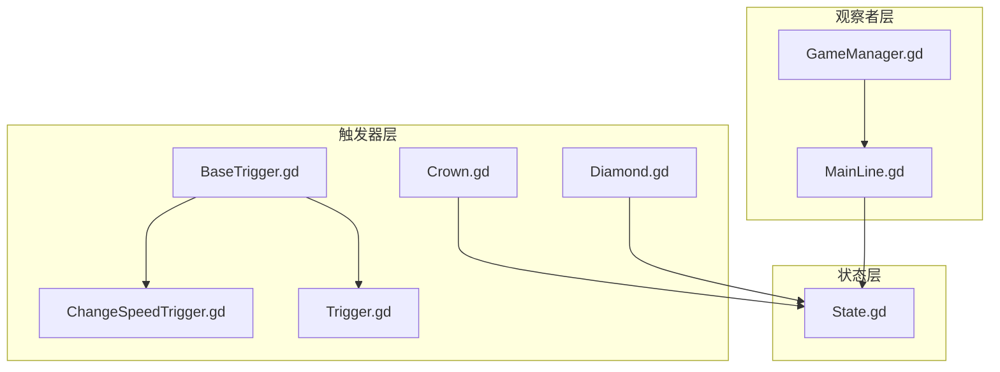
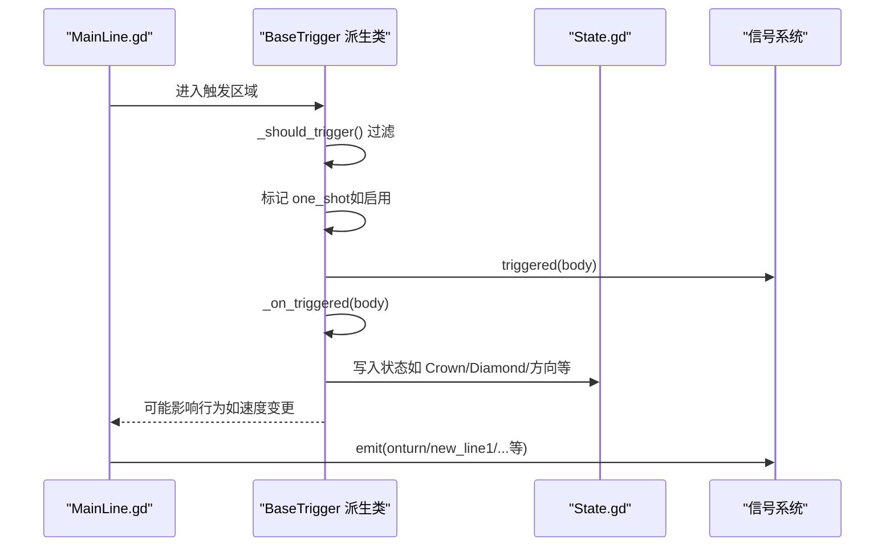
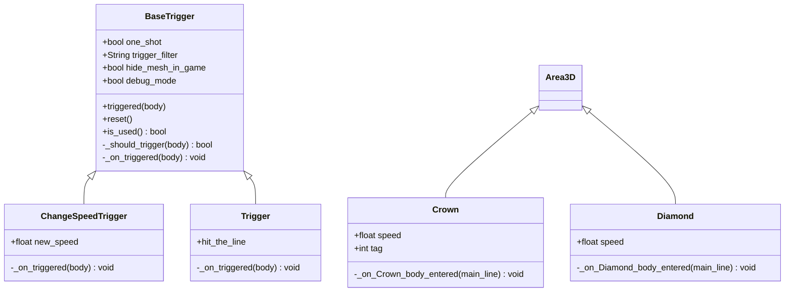
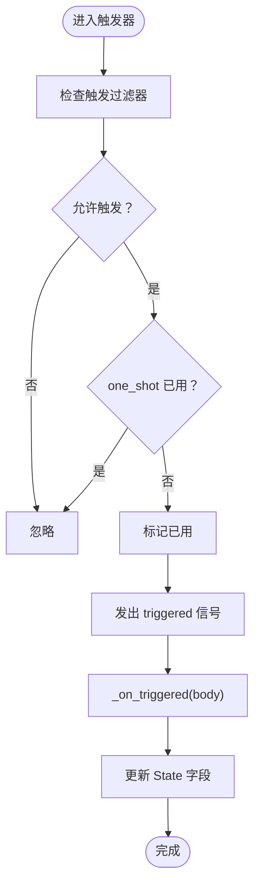
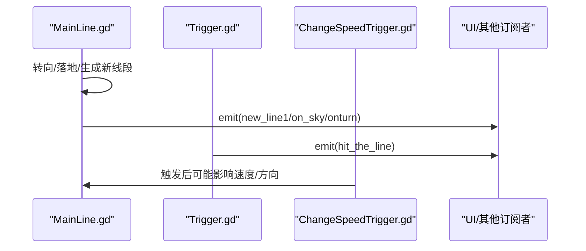
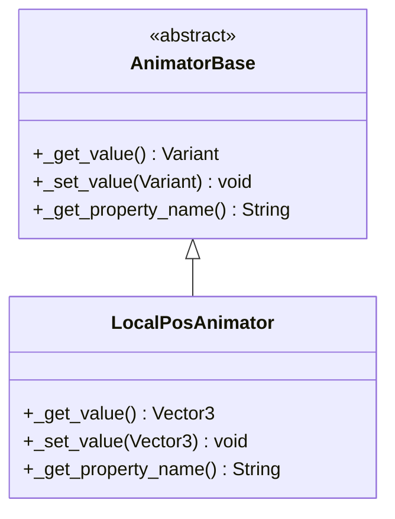
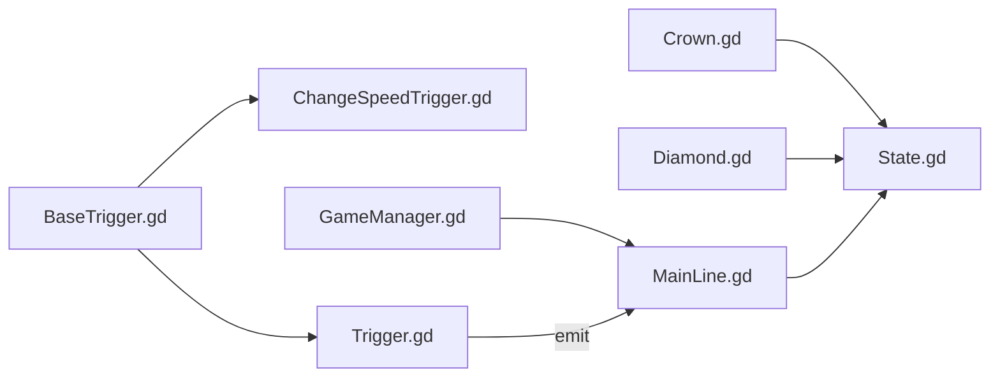

# 设计模式应用

<cite>
**本文引用的文件**
- [BaseTrigger.gd](file://#Template/[Scripts]/Trigger/BaseTrigger.gd)
- [ChangeSpeedTrigger.gd](file://#Template/[Scripts]/Trigger/ChangeSpeedTrigger.gd)
- [Trigger.gd](file://#Template/[Scripts]/Trigger/Trigger.gd)
- [Crown.gd](file://#Template/[Scripts]/Trigger/Crown.gd)
- [Diamond.gd](file://#Template/[Scripts]/Trigger/Diamond.gd)
- [State.gd](file://#Template/[Scripts]/State.gd)
- [GameManager.gd](file://#Template/[Scripts]/GameManager.gd)
- [MainLine.gd](file://#Template/[Scripts]/MainLine.gd)
- [LocalPosAnimator.gd](file://#Template/[Scripts]/Trigger/LocalPosAnimator.gd)
- [README.md](file://README.md)
</cite>

## 目录
1. [引言](#引言)
2. [项目结构](#项目结构)
3. [核心组件](#核心组件)
4. [架构总览](#架构总览)
5. [详细组件分析](#详细组件分析)
6. [依赖关系分析](#依赖关系分析)
7. [性能考量](#性能考量)
8. [故障排查指南](#故障排查指南)
9. [结论](#结论)
10. [附录](#附录)

## 引言
本文件聚焦于 Godot Line 模板中的设计模式应用，围绕以下主题展开：触发器模式（BaseTrigger 基类）、状态管理模式（State 节点）、观察者模式（信号系统）。我们将结合实际代码文件，解释每种模式的使用场景、实现方式与带来的好处，并给出最佳实践与排错建议，帮助开发者理解并扩展项目架构。

## 项目结构
项目采用“模板 + 脚本 + 场景”的组织方式，核心逻辑集中在 #Template/[Scripts] 下，其中：
- 触发器体系位于 Trigger 目录，以 BaseTrigger 为抽象基类，派生出多种具体触发器。
- 状态数据集中于 State.gd，作为全局共享的状态容器。
- 观察者模式通过 Godot 的信号系统贯穿各组件，如 MainLine 的转向、落地、死亡等信号。
- GameManager 提供与场景、主角色相关的辅助计算与工具。

图表来源
- [BaseTrigger.gd:1-102](file://#Template/[Scripts]/Trigger/BaseTrigger.gd#L1-L102)
- [ChangeSpeedTrigger.gd:1-15](file://#Template/[Scripts]/Trigger/ChangeSpeedTrigger.gd#L1-L15)
- [Trigger.gd:1-10](file://#Template/[Scripts]/Trigger/Trigger.gd#L1-L10)
- [Crown.gd:1-58](file://#Template/[Scripts]/Trigger/Crown.gd#L1-L58)
- [Diamond.gd:1-17](file://#Template/[Scripts]/Trigger/Diamond.gd#L1-L17)
- [State.gd:1-23](file://#Template/[Scripts]/State.gd#L1-L23)
- [MainLine.gd:1-224](file://#Template/[Scripts]/MainLine.gd#L1-L224)
- [GameManager.gd:1-47](file://#Template/[Scripts]/GameManager.gd#L1-L47)

章节来源
- [README.md:53-65](file://README.md#L53-L65)

## 核心组件
- 触发器基类 BaseTrigger：统一处理触发区域、过滤器、一次性触发、调试输出与子类回调。
- 具体触发器：如 ChangeSpeedTrigger（速度变更）、Trigger（发射 hit_the_line 信号）、Crown/Diamond（收集物处理）。
- 状态容器 State：集中存放与游戏进程相关的全局状态（如转向、动画时间、收集品数量等）。
- 观察者组件：MainLine 通过信号对外广播状态变化；GameManager 提供计算与工具函数。

章节来源
- [BaseTrigger.gd:1-102](file://#Template/[Scripts]/Trigger/BaseTrigger.gd#L1-L102)
- [State.gd:1-23](file://#Template/[Scripts]/State.gd#L1-L23)
- [MainLine.gd:1-224](file://#Template/[Scripts]/MainLine.gd#L1-L224)
- [GameManager.gd:1-47](file://#Template/[Scripts]/GameManager.gd#L1-L47)

## 架构总览
下图展示了触发器模式、状态管理模式与观察者模式在运行时的交互关系：

图表来源
- [BaseTrigger.gd:53-91](file://#Template/[Scripts]/Trigger/BaseTrigger.gd#L53-L91)
- [ChangeSpeedTrigger.gd:8-15](file://#Template/[Scripts]/Trigger/ChangeSpeedTrigger.gd#L8-L15)
- [Crown.gd:25-57](file://#Template/[Scripts]/Trigger/Crown.gd#L25-L57)
- [Diamond.gd:7-12](file://#Template/[Scripts]/Trigger/Diamond.gd#L7-L12)
- [MainLine.gd:168-184](file://#Template/[Scripts]/MainLine.gd#L168-L184)

## 详细组件分析

### 触发器模式：BaseTrigger 基类与派生类
- 使用场景
  - 需要以 Area3D 定义可复用的触发区域，支持过滤器、一次性触发与调试输出。
  - 子类仅需关注“被触发后”的业务逻辑，无需重复实现通用流程。
- 实现要点
  - 统一的信号 triggered(body)，由子类通过 _on_triggered(body) 处理。
  - 支持 trigger_filter（CharacterBody3D/PhysicsBody3D/Any）与 one_shot。
  - 提供 reset()/is_used() 以便重置一次性触发器。
  - 编辑器模式下跳过运行时逻辑，避免干扰场景编辑。
- 典型派生类
  - ChangeSpeedTrigger：根据目标对象属性动态调整速度。
  - Trigger：发射 hit_the_line 信号，供其他节点订阅。
  - Crown/Diamond：采集物处理，更新 State 并播放动画/粒子。
- 好处
  - 低耦合：触发器只关心“是否触发”和“触发后做什么”，不依赖具体业务。
  - 易扩展：新增触发器只需继承 BaseTrigger 并实现 _on_triggered。
  - 可复用：过滤器与一次性触发逻辑在基类统一处理。

图表来源
- [BaseTrigger.gd:1-102](file://#Template/[Scripts]/Trigger/BaseTrigger.gd#L1-L102)
- [ChangeSpeedTrigger.gd:1-15](file://#Template/[Scripts]/Trigger/ChangeSpeedTrigger.gd#L1-L15)
- [Trigger.gd:1-10](file://#Template/[Scripts]/Trigger/Trigger.gd#L1-L10)
- [Crown.gd:1-58](file://#Template/[Scripts]/Trigger/Crown.gd#L1-L58)
- [Diamond.gd:1-17](file://#Template/[Scripts]/Trigger/Diamond.gd#L1-L17)

章节来源
- [BaseTrigger.gd:29-91](file://#Template/[Scripts]/Trigger/BaseTrigger.gd#L29-L91)
- [ChangeSpeedTrigger.gd:8-15](file://#Template/[Scripts]/Trigger/ChangeSpeedTrigger.gd#L8-L15)
- [Trigger.gd:8-9](file://#Template/[Scripts]/Trigger/Trigger.gd#L8-L9)
- [Crown.gd:25-57](file://#Template/[Scripts]/Trigger/Crown.gd#L25-L57)
- [Diamond.gd:7-12](file://#Template/[Scripts]/Trigger/Diamond.gd#L7-L12)

最佳实践
- 在派生类中优先使用属性检查（如 "speed" in body）避免硬编码类型依赖。
- 对于需要立即生效的参数（如速度），在触发后同步更新目标对象的内部状态。
- 使用 one_shot 时，确保在合适时机调用 reset() 以支持重玩或重置。

### 状态管理模式：State 节点
- 使用场景
  - 需要在多个节点之间共享轻量级、跨帧的运行时状态（如转向、动画时间、收集品计数）。
- 实现要点
  - State.gd 以 Node 为基类，集中声明各类布尔/数值字段，便于全局访问。
  - MainLine 在重载时读取/写入 State，保证状态持久化到下一帧。
  - Crown/Diamond 触发器在碰撞时更新 State，形成“触发器写入状态”的统一模式。
- 好处
  - 解耦：不需要通过父子或兄弟节点传递状态。
  - 易维护：状态集中管理，避免散落各处的魔法数字与变量。

图表来源
- [BaseTrigger.gd:53-91](file://#Template/[Scripts]/Trigger/BaseTrigger.gd#L53-L91)
- [Crown.gd:25-57](file://#Template/[Scripts]/Trigger/Crown.gd#L25-L57)
- [Diamond.gd:7-12](file://#Template/[Scripts]/Trigger/Diamond.gd#L7-L12)
- [State.gd:1-23](file://#Template/[Scripts]/State.gd#L1-L23)

章节来源
- [State.gd:1-23](file://#Template/[Scripts]/State.gd#L1-L23)
- [Crown.gd:25-57](file://#Template/[Scripts]/Trigger/Crown.gd#L25-L57)
- [Diamond.gd:7-12](file://#Template/[Scripts]/Trigger/Diamond.gd#L7-L12)
- [MainLine.gd:44-51](file://#Template/[Scripts]/MainLine.gd#L44-L51)

最佳实践
- 将状态字段语义化命名，避免使用“临时变量”污染全局。
- 对于需要在场景切换间保留的状态，确保在合适的生命周期（如 _ready 或 _exit_tree）进行读写。
- 对复杂状态可考虑分组（如 UI 状态、游戏进程状态），便于维护。

### 观察者模式：信号系统
- 使用场景
  - 需要解耦事件产生方与消费方，支持一对多通知（如转向、落地、死亡）。
- 实现要点
  - MainLine 定义并发射 new_line1、on_sky、onturn 等信号，触发器与 UI 可订阅。
  - Trigger 派生类通过 triggered(body) 与自定义信号（如 hit_the_line）实现事件传播。
  - GameManager 提供计算函数（如 calculate_anim_start_time），供 MainLine 等节点调用。
- 好处
  - 松耦合：发送方无需了解订阅者是谁。
  - 可扩展：新增订阅者不影响发送方。

图表来源
- [MainLine.gd:4-7](file://#Template/[Scripts]/MainLine.gd#L4-L7)
- [MainLine.gd:168-184](file://#Template/[Scripts]/MainLine.gd#L168-L184)
- [Trigger.gd:6](file://#Template/[Scripts]/Trigger/Trigger.gd#L6)
- [ChangeSpeedTrigger.gd:8-15](file://#Template/[Scripts]/Trigger/ChangeSpeedTrigger.gd#L8-L15)

章节来源
- [MainLine.gd:4-7](file://#Template/[Scripts]/MainLine.gd#L4-L7)
- [Trigger.gd:6](file://#Template/[Scripts]/Trigger/Trigger.gd#L6)
- [GameManager.gd:23-39](file://#Template/[Scripts]/GameManager.gd#L23-L39)

最佳实践
- 信号命名采用动词短语，表达“发生了什么”，如 onturn/new_line1。
- 订阅信号时注意在节点销毁前断开连接，避免悬挂引用。
- 对高频信号（如 _process）谨慎使用，必要时加节流或合并事件。

### 复杂逻辑组件：动画属性适配器（AnimatorBase 族）
- 使用场景
  - 需要对节点的局部属性（如 position/rotation/scale）进行统一的读取/设置与属性名抽象。
- 实现要点
  - LocalPosAnimator.gd 通过 _get_value/_set_value/_get_property_name 抽象了对 position 的读写。
  - 该模式可推广到其他属性（如 rotation/scale），形成“属性适配器”族。
- 好处
  - 统一接口：对不同属性的操作具有一致的调用方式。
  - 易扩展：新增属性适配器只需实现三个虚方法。

图表来源
- [LocalPosAnimator.gd:1-13](file://#Template/[Scripts]/Trigger/LocalPosAnimator.gd#L1-L13)

章节来源
- [LocalPosAnimator.gd:5-12](file://#Template/[Scripts]/Trigger/LocalPosAnimator.gd#L5-L12)

## 依赖关系分析
- BaseTrigger 与派生类：派生类依赖基类提供的触发流程与信号；基类通过 _should_trigger 与 _on_triggered 与派生类解耦。
- State：被触发器与 MainLine 读写，形成“触发器写入状态、主角色读取状态”的双向依赖。
- 观察者：MainLine 作为事件源，Trigger/Trigger 派生类与 UI 订阅其信号。
- GameManager：为 MainLine 提供计算辅助，间接参与状态计算。

图表来源
- [BaseTrigger.gd:1-102](file://#Template/[Scripts]/Trigger/BaseTrigger.gd#L1-L102)
- [ChangeSpeedTrigger.gd:1-15](file://#Template/[Scripts]/Trigger/ChangeSpeedTrigger.gd#L1-L15)
- [Trigger.gd:1-10](file://#Template/[Scripts]/Trigger/Trigger.gd#L1-L10)
- [Crown.gd:1-58](file://#Template/[Scripts]/Trigger/Crown.gd#L1-L58)
- [Diamond.gd:1-17](file://#Template/[Scripts]/Trigger/Diamond.gd#L1-L17)
- [State.gd:1-23](file://#Template/[Scripts]/State.gd#L1-L23)
- [MainLine.gd:1-224](file://#Template/[Scripts]/MainLine.gd#L1-L224)
- [GameManager.gd:1-47](file://#Template/[Scripts]/GameManager.gd#L1-L47)

章节来源
- [BaseTrigger.gd:47-73](file://#Template/[Scripts]/Trigger/BaseTrigger.gd#L47-L73)
- [Crown.gd:25-57](file://#Template/[Scripts]/Trigger/Crown.gd#L25-L57)
- [Diamond.gd:7-12](file://#Template/[Scripts]/Trigger/Diamond.gd#L7-L12)
- [MainLine.gd:44-51](file://#Template/[Scripts]/MainLine.gd#L44-L51)

## 性能考量
- 触发器过滤：合理使用 trigger_filter，避免对无关节点进行处理。
- 一次性触发：启用 one_shot 可减少重复处理，但需在重置时显式调用 reset()。
- 信号频率：高频信号（如 _process）应谨慎使用，必要时合并事件或降采样。
- 状态读写：集中于 State.gd 的字段访问应保持简单，避免在热路径中做重型计算。

## 故障排查指南
- 触发器未生效
  - 检查触发器是否正确连接 body_entered 信号，确认 _setup_trigger 已执行。
  - 确认 trigger_filter 与目标节点类型匹配。
  - 若启用 one_shot，请确认 reset() 是否被调用。
- 状态未更新
  - 确认触发器在 _on_triggered 中确实写入了 State 字段。
  - 检查 MainLine 是否在 _ready 时读取了 State。
- 信号未到达订阅者
  - 确认订阅者在节点生命周期内已建立连接。
  - 检查信号名称拼写与参数类型一致。
- 动画/属性不生效
  - 确认属性适配器的 _get_property_name 返回的是目标属性名。
  - 检查节点是否存在以及属性是否可写。

章节来源
- [BaseTrigger.gd:29-40](file://#Template/[Scripts]/Trigger/BaseTrigger.gd#L29-L40)
- [BaseTrigger.gd:76-86](file://#Template/[Scripts]/Trigger/BaseTrigger.gd#L76-L86)
- [Crown.gd:25-57](file://#Template/[Scripts]/Trigger/Crown.gd#L25-L57)
- [Diamond.gd:7-12](file://#Template/[Scripts]/Trigger/Diamond.gd#L7-L12)
- [MainLine.gd:44-51](file://#Template/[Scripts]/MainLine.gd#L44-L51)

## 结论
本项目通过触发器模式、状态管理模式与观察者模式实现了清晰的职责分离与良好的扩展性。BaseTrigger 抽象了触发流程，派生类专注于业务细节；State 集中管理跨组件状态；信号系统解耦了事件产生与消费。遵循本文的最佳实践，开发者可以安全地扩展新的触发器、状态与事件，同时保持架构的一致性与可维护性。

## 附录
- 相关文件路径与用途概览
  - 触发器基类与派生类：BaseTrigger.gd、ChangeSpeedTrigger.gd、Trigger.gd、Crown.gd、Diamond.gd
  - 状态容器：State.gd
  - 观察者与工具：MainLine.gd、GameManager.gd
  - 属性适配器：LocalPosAnimator.gd