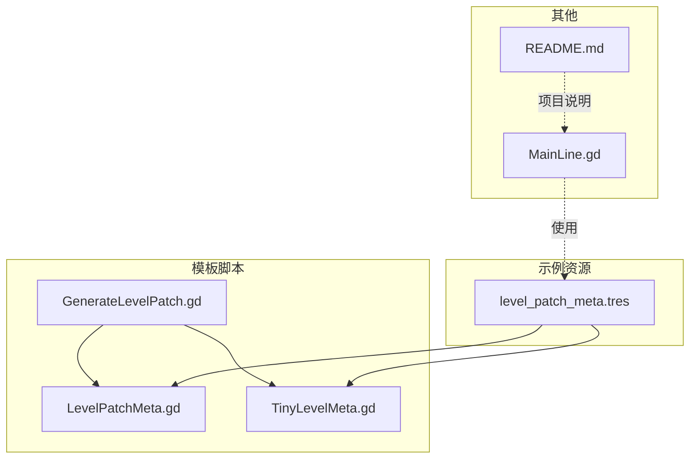
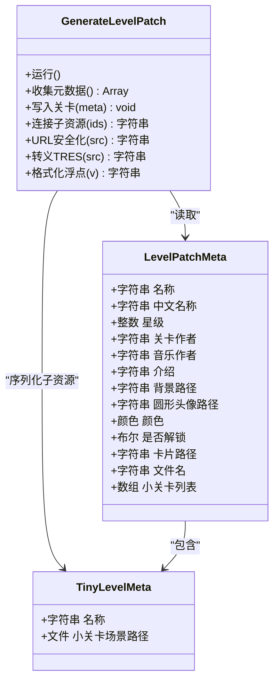
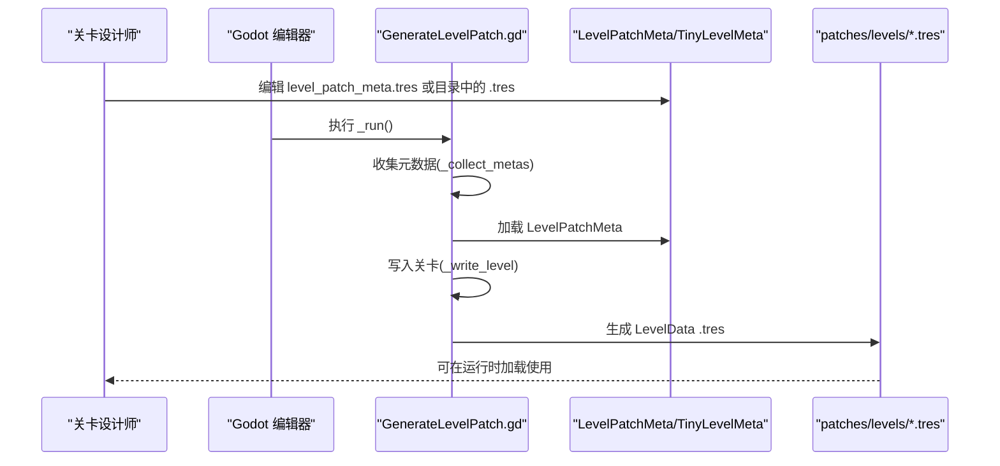
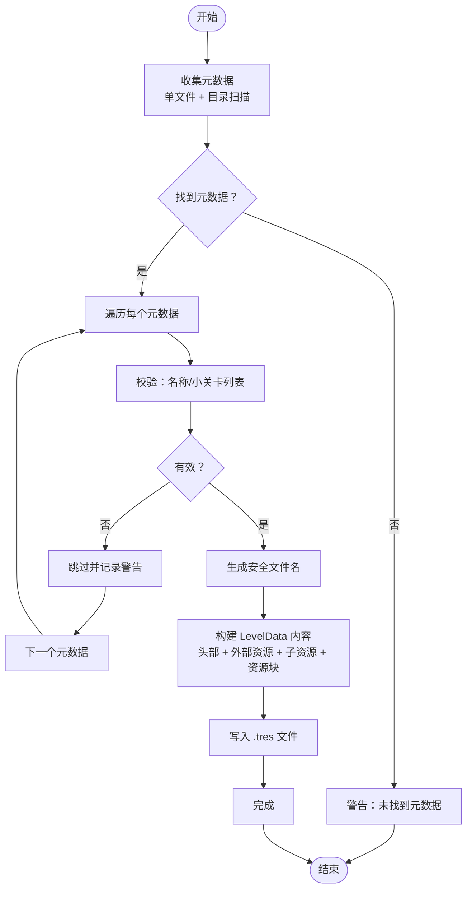
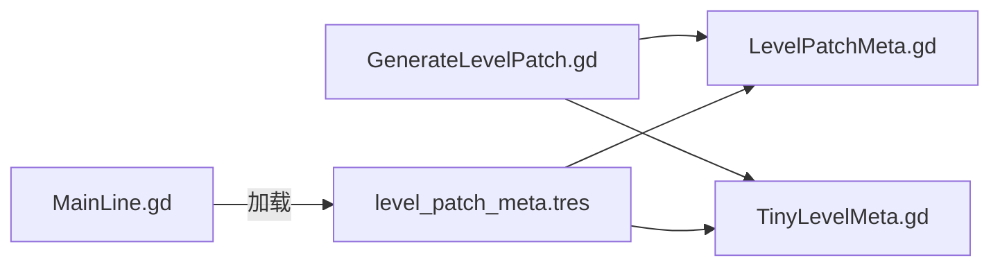

# 模板系统

<cite>
**本文引用的文件**
- [LevelPatchMeta.gd](file://#Template/[Scripts]/LevelPatchMeta.gd)
- [TinyLevelMeta.gd](file://#Template/[Scripts]/TinyLevelMeta.gd)
- [GenerateLevelPatch.gd](file://#Template/[Scripts]/GenerateLevelPatch.gd)
- [level_patch_meta.tres](file://#Template/level_patch_meta.tres)
- [MainLine.gd](file://#Template/[Scripts]/MainLine.gd)
- [README.md](file://README.md)
</cite>

## 目录
1. [简介](#简介)
2. [项目结构](#项目结构)
3. [核心组件](#核心组件)
4. [架构总览](#架构总览)
5. [详细组件分析](#详细组件分析)
6. [依赖关系分析](#依赖关系分析)
7. [性能考量](#性能考量)
8. [故障排查指南](#故障排查指南)
9. [结论](#结论)
10. [附录](#附录)

## 简介
本文件面向关卡设计师与开发者，系统化阐述 Godot Line 模板中的关卡模板系统，重点解析以下内容：
- LevelPatchMeta 的设计理念与字段语义
- TinyLevelMeta 的作用与约束
- GenerateLevelPatch 的生成流程与序列化规则
- 关卡元数据的结构与管理方式
- 如何创建、编辑与生成自定义关卡
- 关卡模板的最佳实践与设计原则
- 关卡数据的序列化与反序列化过程

目标是帮助你在不深入阅读源码的情况下，也能高效地使用与扩展关卡模板系统。

## 项目结构
模板系统位于 #Template/[Scripts] 目录下，核心文件包括：
- LevelPatchMeta.gd：关卡补丁元数据资源类
- TinyLevelMeta.gd：小关卡条目资源类
- GenerateLevelPatch.gd：关卡补丁生成脚本（编辑器工具）
- level_patch_meta.tres：示例关卡补丁资源文件

此外，README.md 提供了项目概览与快速开始信息，有助于理解模板的整体定位与使用方式。

**图表来源**
- [LevelPatchMeta.gd:1-18](file://#Template/[Scripts]/LevelPatchMeta.gd#L1-L18)
- [TinyLevelMeta.gd:1-7](file://#Template/[Scripts]/TinyLevelMeta.gd#L1-L7)
- [GenerateLevelPatch.gd:1-139](file://#Template/[Scripts]/GenerateLevelPatch.gd#L1-L139)
- [level_patch_meta.tres:1-22](file://#Template/level_patch_meta.tres#L1-L22)
- [MainLine.gd:1-224](file://#Template/[Scripts]/MainLine.gd#L1-L224)
- [README.md:1-137](file://README.md#L1-L137)

**章节来源**
- [README.md:53-65](file://README.md#L53-L65)
- [README.md:1-137](file://README.md#L1-L137)

## 核心组件
本节聚焦三个关键组件：LevelPatchMeta、TinyLevelMeta、GenerateLevelPatch，并解释它们之间的协作关系。

- LevelPatchMeta：描述一个“关卡补丁”的元数据集合，包含名称、星级、作者、音乐作者、介绍、背景图路径、圆形头像路径、卡片资源路径、文件名、是否解锁、颜色等；同时聚合多个 TinyLevelMeta 条目，形成一个完整的关卡补丁。
- TinyLevelMeta：描述一个“小关卡”条目，包含显示名称与场景路径（限定为 .tscn 文件），用于组成关卡补丁内的子关卡列表。
- GenerateLevelPatch：编辑器脚本，负责收集 LevelPatchMeta 资源（支持单个资源文件与目录批量），遍历生成 LevelData 资源文件（.tres），并将 TinyLevelMeta 子项序列化为子资源，最终写入 patches/levels 输出目录。

**图表来源**
- [LevelPatchMeta.gd:1-18](file://#Template/[Scripts]/LevelPatchMeta.gd#L1-L18)
- [TinyLevelMeta.gd:1-7](file://#Template/[Scripts]/TinyLevelMeta.gd#L1-L7)
- [GenerateLevelPatch.gd:1-139](file://#Template/[Scripts]/GenerateLevelPatch.gd#L1-L139)

**章节来源**
- [LevelPatchMeta.gd:1-18](file://#Template/[Scripts]/LevelPatchMeta.gd#L1-L18)
- [TinyLevelMeta.gd:1-7](file://#Template/[Scripts]/TinyLevelMeta.gd#L1-L7)
- [GenerateLevelPatch.gd:1-139](file://#Template/[Scripts]/GenerateLevelPatch.gd#L1-L139)

## 架构总览
关卡模板系统采用“元数据驱动 + 编辑器生成”的架构：
- 元数据层：LevelPatchMeta 与 TinyLevelMeta 以资源形式存在，便于在 Godot 编辑器中可视化编辑。
- 生成层：GenerateLevelPatch 作为编辑器脚本，扫描元数据资源，生成 LevelData 资源文件，供运行时加载。
- 运行时消费：游戏逻辑（如 MainLine.gd）通过加载 LevelData 资源来获取关卡信息与小关卡列表，驱动关卡行为。

**图表来源**
- [GenerateLevelPatch.gd:8-43](file://#Template/[Scripts]/GenerateLevelPatch.gd#L8-L43)
- [GenerateLevelPatch.gd:45-110](file://#Template/[Scripts]/GenerateLevelPatch.gd#L45-L110)
- [level_patch_meta.tres:1-22](file://#Template/level_patch_meta.tres#L1-L22)

**章节来源**
- [GenerateLevelPatch.gd:1-139](file://#Template/[Scripts]/GenerateLevelPatch.gd#L1-L139)
- [level_patch_meta.tres:1-22](file://#Template/level_patch_meta.tres#L1-L22)

## 详细组件分析

### LevelPatchMeta：关卡补丁元数据
- 角色定位：描述一个“关卡补丁”的整体信息，作为生成 LevelData 的输入。
- 关键字段与语义：
  - 名称与中文名称：用于 UI 展示与本地化
  - 星级：影响难度或解锁条件
  - 关卡作者/音乐作者：版权与署名信息
  - 介绍：简短描述
  - 背景路径/圆形头像路径：界面素材
  - 颜色：主题色
  - 是否解锁：初始可见性
  - 卡片路径：额外卡片资源
  - 文件名：生成 LevelData 的文件名（未提供时由名称生成）
  - 小关卡列表：聚合多个 TinyLevelMeta
- 设计要点：
  - 使用 @export 与 @export_multiline 等导出属性，便于在编辑器中直接编辑
  - 通过 Array[TinyLevelMeta] 聚合子关卡，保证结构清晰

**章节来源**
- [LevelPatchMeta.gd:1-18](file://#Template/[Scripts]/LevelPatchMeta.gd#L1-L18)

### TinyLevelMeta：小关卡条目
- 角色定位：描述一个“小关卡”的基本信息，作为 LevelPatchMeta 的子项。
- 关键字段与约束：
  - 名称：显示用名称
  - 场景路径：限定为 .tscn 文件，确保可被场景加载
- 设计要点：
  - 使用 @export_file 并限制类型，避免错误引用
  - 与 LevelPatchMeta 通过数组关联，形成层级结构

**章节来源**
- [TinyLevelMeta.gd:1-7](file://#Template/[Scripts]/TinyLevelMeta.gd#L1-L7)

### GenerateLevelPatch：关卡补丁生成器
- 功能概述：扫描元数据资源，生成 LevelData 资源文件，写入 patches/levels 目录。
- 关键流程：
  - 收集元数据：优先加载单个资源文件，再扫描目录中的 .tres
  - 写入关卡：校验元数据有效性，生成 LevelData .tres 内容
  - 序列化细节：TinyLevelMeta 子项序列化为子资源，LevelData 引用这些子资源
- 输出结构：
  - 顶层资源类型为 LevelData
  - 引用外部脚本与 TinyLevel 资源
  - tinylevel 字段为 TinyLevelMeta 子资源数组
- 辅助方法：
  - URL安全化：将名称转换为安全文件名
  - TRES 字符串转义：处理换行、引号、反斜杠等
  - 浮点格式化：固定精度，保证一致性

**图表来源**
- [GenerateLevelPatch.gd:8-43](file://#Template/[Scripts]/GenerateLevelPatch.gd#L8-L43)
- [GenerateLevelPatch.gd:45-110](file://#Template/[Scripts]/GenerateLevelPatch.gd#L45-L110)
- [GenerateLevelPatch.gd:112-139](file://#Template/[Scripts]/GenerateLevelPatch.gd#L112-L139)

**章节来源**
- [GenerateLevelPatch.gd:1-139](file://#Template/[Scripts]/GenerateLevelPatch.gd#L1-L139)

### 示例资源：level_patch_meta.tres
- 作用：演示如何组织 LevelPatchMeta 与 TinyLevelMeta 的关系
- 关键点：
  - 外部脚本引用指向 LevelPatchMeta.gd 与 TinyLevelMeta.gd
  - 子资源定义 TinyLevelMeta 条目
  - LevelPatchMeta 的 tiny_levels 字段引用子资源

**章节来源**
- [level_patch_meta.tres:1-22](file://#Template/level_patch_meta.tres#L1-L22)

### 运行时消费：MainLine.gd 与关卡数据的关系
- MainLine.gd 是游戏中的核心角色/逻辑类，负责渲染线条、转向、死亡等行为
- 关卡数据（LevelData）由 GenerateLevelPatch 生成，供运行时加载与使用
- 两者通过 LevelData 资源进行解耦：MainLine.gd 不直接依赖具体关卡场景，而是依赖 LevelData 中的元信息与小关卡列表

**章节来源**
- [MainLine.gd:1-224](file://#Template/[Scripts]/MainLine.gd#L1-L224)

## 依赖关系分析
- GenerateLevelPatch 依赖 LevelPatchMeta 与 TinyLevelMeta 的导出属性与类名，以正确读取与序列化
- level_patch_meta.tres 作为示例资源，示范了资源引用与子资源的组织方式
- 运行时（如 MainLine.gd）通过加载 LevelData 资源间接消费关卡元数据

**图表来源**
- [GenerateLevelPatch.gd:1-139](file://#Template/[Scripts]/GenerateLevelPatch.gd#L1-L139)
- [LevelPatchMeta.gd:1-18](file://#Template/[Scripts]/LevelPatchMeta.gd#L1-L18)
- [TinyLevelMeta.gd:1-7](file://#Template/[Scripts]/TinyLevelMeta.gd#L1-L7)
- [level_patch_meta.tres:1-22](file://#Template/level_patch_meta.tres#L1-L22)
- [MainLine.gd:1-224](file://#Template/[Scripts]/MainLine.gd#L1-L224)

**章节来源**
- [GenerateLevelPatch.gd:1-139](file://#Template/[Scripts]/GenerateLevelPatch.gd#L1-L139)
- [level_patch_meta.tres:1-22](file://#Template/level_patch_meta.tres#L1-L22)
- [MainLine.gd:1-224](file://#Template/[Scripts]/MainLine.gd#L1-L224)

## 性能考量
- 生成阶段：
  - 批量扫描目录时注意资源数量，避免过多 .tres 导致生成时间增长
  - 写入文件为一次性操作，建议在空闲时间执行生成
- 运行时：
  - LevelData 为轻量资源，加载成本低
  - 若 tinylevel 数量较多，建议分批加载或延迟实例化子场景，减少首帧压力

[本节为通用指导，无需特定文件引用]

## 故障排查指南
- 未找到元数据资源
  - 现象：生成器提示未找到 LevelPatchMeta
  - 排查：确认单文件路径与目录结构是否存在，文件扩展名为 .tres
  - 参考：[GenerateLevelPatch.gd:24-43](file://#Template/[Scripts]/GenerateLevelPatch.gd#L24-L43)
- 元数据无效
  - 现象：跳过生成并给出警告（名称为空、小关卡列表为空）
  - 排查：检查 LevelPatchMeta 的 name 与 tiny_levels 字段
  - 参考：[GenerateLevelPatch.gd:45-54](file://#Template/[Scripts]/GenerateLevelPatch.gd#L45-L54)
- 文件写入失败
  - 现象：无法写入输出目录
  - 排查：确认输出目录权限与磁盘空间，检查文件名是否合法
  - 参考：[GenerateLevelPatch.gd:104-109](file://#Template/[Scripts]/GenerateLevelPatch.gd#L104-L109)
- 场景路径无效
  - 现象：TinyLevelMeta 的场景路径不正确
  - 排查：确保路径指向 .tscn 文件，且在项目内可访问
  - 参考：[TinyLevelMeta.gd:6](file://#Template/[Scripts]/TinyLevelMeta.gd#L6)

**章节来源**
- [GenerateLevelPatch.gd:24-43](file://#Template/[Scripts]/GenerateLevelPatch.gd#L24-L43)
- [GenerateLevelPatch.gd:45-54](file://#Template/[Scripts]/GenerateLevelPatch.gd#L45-L54)
- [GenerateLevelPatch.gd:104-109](file://#Template/[Scripts]/GenerateLevelPatch.gd#L104-L109)
- [TinyLevelMeta.gd:6](file://#Template/[Scripts]/TinyLevelMeta.gd#L6)

## 结论
关卡模板系统通过 LevelPatchMeta 与 TinyLevelMeta 的清晰分层，配合 GenerateLevelPatch 的自动化生成，实现了“可视化编辑 + 自动序列化”的高效工作流。运行时通过 LevelData 资源解耦具体场景，既便于关卡设计师维护，也利于开发者扩展。遵循本文最佳实践，可显著提升关卡制作效率与质量。

[本节为总结性内容，无需特定文件引用]

## 附录

### 关卡元数据结构与字段说明
- LevelPatchMeta
  - 名称：字符串，必填
  - 中文名称：字符串，用于本地化展示
  - 星级：整数范围 [0,6]，用于难度/解锁控制
  - 关卡作者：字符串
  - 音乐作者：字符串
  - 介绍：多行文本
  - 背景路径：字符串，资源路径
  - 圆形头像路径：字符串，资源路径
  - 颜色：颜色值
  - 是否解锁：布尔
  - 卡片路径：字符串，资源路径（可选）
  - 文件名：字符串，生成 .tres 的文件名（可选）
  - 小关卡列表：数组，元素为 TinyLevelMeta
- TinyLevelMeta
  - 名称：字符串，显示用
  - 场景路径：文件，限定为 .tscn

**章节来源**
- [LevelPatchMeta.gd:1-18](file://#Template/[Scripts]/LevelPatchMeta.gd#L1-L18)
- [TinyLevelMeta.gd:1-7](file://#Template/[Scripts]/TinyLevelMeta.gd#L1-L7)

### 创建、编辑与生成自定义关卡的步骤
- 准备小关卡场景
  - 在 #Template/[Scenes] 下创建 .tscn 场景
  - 确保场景路径仅包含 .tscn 文件
- 编辑关卡元数据
  - 方式一：编辑单个资源文件
    - 在 #Template/level_patch_meta.tres 中填写 LevelPatchMeta 字段
    - 在 tiny_levels 中添加 TinyLevelMeta 子项，设置名称与场景路径
  - 方式二：使用目录批量
    - 将多个 .tres 放入 #Template/level_patches 目录
    - 每个 .tres 对应一个 LevelPatchMeta
- 生成关卡数据
  - 在 Godot 编辑器中执行 GenerateLevelPatch.gd
  - 检查 patches/levels 目录是否生成对应 .tres
- 在运行时加载
  - 通过资源路径加载 LevelData，读取 name、tinylevel 等字段
  - 根据 tinylevel 列表实例化小关卡场景

**章节来源**
- [GenerateLevelPatch.gd:1-139](file://#Template/[Scripts]/GenerateLevelPatch.gd#L1-L139)
- [level_patch_meta.tres:1-22](file://#Template/level_patch_meta.tres#L1-L22)

### 序列化与反序列化过程
- 序列化（生成阶段）
  - 读取 LevelPatchMeta 与 TinyLevelMeta
  - 生成 LevelData .tres 的头部、外部脚本与资源引用
  - 为每个 TinyLevelMeta 生成子资源，并在 LevelData 的 tinylevel 字段中引用
  - 写入文件到 patches/levels
- 反序列化（运行时）
  - 加载 LevelData 资源
  - 读取 LevelPatchMeta 字段与 tinylevel 子资源数组
  - 实例化子资源对应的场景或脚本

**章节来源**
- [GenerateLevelPatch.gd:45-110](file://#Template/[Scripts]/GenerateLevelPatch.gd#L45-L110)
- [level_patch_meta.tres:1-22](file://#Template/level_patch_meta.tres#L1-L22)

### 最佳实践与设计原则
- 元数据优先：将关卡信息集中在 LevelPatchMeta，避免散落于场景
- 路径统一：使用 res:// 前缀的相对路径，便于迁移与打包
- 文件名安全：尽量提供 file_name，避免生成不安全的文件名
- 小关卡粒度：每个 TinyLevelMeta 对应一个独立的小关卡，便于测试与迭代
- 解耦设计：运行时只依赖 LevelData，不直接依赖具体场景文件
- 批量管理：利用目录批量生成，提高多关卡维护效率

[本节为通用指导，无需特定文件引用]