# 示例场景

<cite>
**本文引用的文件**
- [README.md](file://README.md)
- [CONTRIBUTING.md](file://CONTRIBUTING.md)
- [project.godot](file://project.godot)
- [plugin.gd](file://addons/gdUnit4/plugin.gd)
- [plugin.cfg](file://addons/gdUnit4/plugin.cfg)
- [GameManager.gd](file://#Template/[Scripts]/GameManager.gd)
- [MainLine.gd](file://#Template/[Scripts]/Level/MainLine.gd)
- [State.gd](file://#Template/[Scripts]/State.gd)
- [RoadMaker.gd](file://#Template/[Scripts]/Level/RoadMaker.gd)
- [gameui.gd](file://#Template/[Scripts]/Level/gameui.gd)
- [Crown.gd](file://#Template/[Scripts]/Trigger/Crown.gd)
- [Diamond.gd](file://#Template/[Scripts]/Trigger/Diamond.gd)
- [Trigger.gd](file://#Template/[Scripts]/Trigger/Trigger.gd)
- [CameraFollower.gd](file://#Template/[Scripts]/CameraScripts/CameraFollower.gd)
- [CameraTrigger.gd](file://#Template/[Scripts]/CameraScripts/CameraTrigger.gd)
- [CamShaker.gd](file://#Template/[Scripts]/CameraScripts/CamShaker.gd)
- [MainLine_test.gd](file://Tests/MainLine_test.gd)
- [Crown_test.gd](file://Tests/Crown_test.gd)
- [Sample.tscn](file://#Template/[Scenes]/Sample.tscn)
- [Scene.tscn](file://#Template/[Scenes]/Scene.tscn)
- [MainLine.tscn](file://#Template/MainLine.tscn)
- [CrownCheckPoint.tscn](file://#Template/CrownCheckPoint.tscn)
</cite>

## 更新摘要
**所做变更**
- 更新场景组织结构章节以反映Crown对象节点层级重构，child nodes现在正确嵌套在父节点下
- 更新相机系统章节以反映从ease_type到tween_transition和tween_ease的新属性系统的迁移
- 更新Sample.tscn场景配置部分以反映新的相机触发器属性和重构的Crown节点结构
- 更新相机系统配置指南以反映新的Tween属性系统
- 更新故障排除指南中的相机系统问题部分

## 目录
1. [简介](#简介)
2. [项目结构](#项目结构)
3. [核心组件](#核心组件)
4. [架构总览](#架构总览)
5. [详细组件分析](#详细组件分析)
6. [场景组织结构](#场景组织结构)
7. [相机系统详解](#相机系统详解)
8. [依赖关系分析](#依赖关系分析)
9. [性能考量](#性能考量)
10. [故障排除指南](#故障排除指南)
11. [结论](#结论)
12. [附录](#附录)

## 简介
本项目是一个基于 Godot Engine 4.6 的 Dancing Line 游戏模板框架，目标是提供一套开箱即用、模块化的线条游戏实现，支持快速关卡迁移与跨平台发布。项目内建完整的模板系统与测试框架（gdUnit4），并通过输入映射与状态管理实现流畅的玩法体验。

- 支持平台：Windows、Linux、macOS
- 引擎版本：Godot 4.6
- 测试框架：gdUnit4
- 模块化设计：清晰的脚本与场景组织，便于扩展与定制
- **更新**：场景组织结构已重构，Crown对象的节点层级现在正确嵌套，改善了场景组织和动画触发逻辑
- **更新**：相机系统已从 ease_type 系统迁移到新的 tween_transition 和 tween_ease 属性系统

**章节来源**
- [README.md: 1-102:1-102](file://README.md#L1-L102)

## 项目结构
项目采用模板化与模块化结合的组织方式：
- #Template/：核心模板资源与脚本，包含场景、材质、音效、触发器与工具脚本
- Tests/：单元测试（gdUnit4）
- addons/gdUnit4/：测试插件与工具
- reports/：测试报告输出目录
- project.godot：项目配置（输入映射、层位、渲染等）
- 其他：README、贡献指南、导出预设等

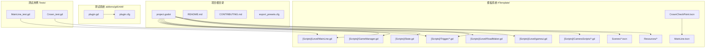

**图表来源**
- [project.godot: 1-88:1-88](file://project.godot#L1-L88)
- [plugin.gd: 1-102:1-102](file://addons/gdUnit4/plugin.gd#L1-L102)
- [plugin.cfg: 1-8:1-8](file://addons/gdUnit4/plugin.cfg#L1-L8)

**章节来源**
- [README.md: 52-61:52-61](file://README.md#L52-L61)
- [project.godot: 15-88:15-88](file://project.godot#L15-L88)

## 核心组件
- GameManager：负责相机、主线与动画起始时间计算等
- MainLine：角色主体，处理移动、转向、连线绘制、死亡与特效
- State：全局状态容器，保存相机检查点、动画时间、音乐检查点、通关状态等
- RoadMaker：根据主线位置动态生成道路网格
- gameui：结算界面与交互逻辑
- 触发器：Crown（皇冠）、Diamond（钻石）、Trigger（通用触发器）
- **相机系统**：CameraFollower（相机跟随器）、CameraTrigger（相机触发器）、CamShaker（相机震动器）

**章节来源**
- [GameManager.gd: 1-50:1-50](file://#Template/[Scripts]/GameManager.gd#L1-L50)
- [MainLine.gd: 1-218:1-218](file://#Template/[Scripts]/Level/MainLine.gd#L1-L218)
- [State.gd: 1-196:1-196](file://#Template/[Scripts]/State.gd#L1-L196)
- [RoadMaker.gd: 1-46:1-46](file://#Template/[Scripts]/Level/RoadMaker.gd#L1-L46)
- [gameui.gd: 1-74:1-74](file://#Template/[Scripts]/Level/gameui.gd#L1-L74)
- [Crown.gd: 1-21:1-21](file://#Template/[Scripts]/Trigger/Crown.gd#L1-L21)
- [Diamond.gd: 1-15:1-15](file://#Template/[Scripts]/Trigger/Diamond.gd#L1-L15)
- [Trigger.gd: 1-10:1-10](file://#Template/[Scripts]/Trigger/Trigger.gd#L1-L10)
- [CameraFollower.gd: 1-179:1-179](file://#Template/[Scripts]/CameraScripts/CameraFollower.gd#L1-L179)
- [CameraTrigger.gd: 1-75:1-75](file://#Template/[Scripts]/CameraScripts/CameraTrigger.gd#L1-L75)
- [CamShaker.gd: 1-33:1-33](file://#Template/[Scripts]/CameraScripts/CamShaker.gd#L1-L33)

## 架构总览
整体架构围绕"状态驱动 + 事件触发"的模式构建：
- 输入事件通过 project.godot 的输入映射触发 MainLine 的转向逻辑
- MainLine 在物理帧中更新运动与连线，同时与 RoadMaker 协作生成道路
- 触发器（Crown/Diamond）通过 Area3D 与 MainLine 交互，更新 State
- GameManager 负责计算动画起始时间并与 MainLine 的动画同步
- gameui 基于 State 显示结算界面与交互
- **相机系统**：CameraFollower 提供平滑的相机跟随，CameraTrigger 处理相机参数的过渡动画，CamShaker 提供震动效果

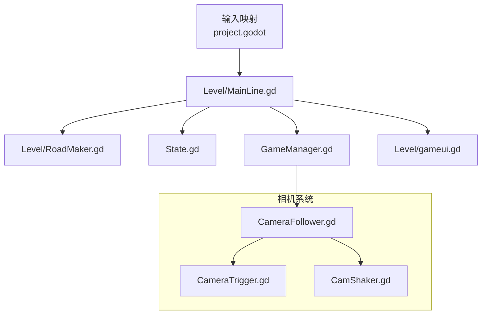

**图表来源**
- [project.godot: 43-71:43-71](file://project.godot#L43-L71)
- [MainLine.gd: 56-201:56-201](file://#Template/[Scripts]/Level/MainLine.gd#L56-L201)
- [RoadMaker.gd: 22-46:22-46](file://#Template/[Scripts]/Level/RoadMaker.gd#L22-L46)
- [GameManager.gd: 23-39:23-39](file://#Template/[Scripts]/GameManager.gd#L23-L39)
- [State.gd: 1-196:1-196](file://#Template/[Scripts]/State.gd#L1-L196)
- [Crown.gd: 16-42:16-42](file://#Template/[Scripts]/Trigger/Crown.gd#L16-L42)
- [Diamond.gd: 6-15:6-15](file://#Template/[Scripts]/Trigger/Diamond.gd#L6-L15)
- [Trigger.gd: 8-10:8-10](file://#Template/[Scripts]/Trigger/Trigger.gd#L8-L10)
- [CameraFollower.gd: 1-179:1-179](file://#Template/[Scripts]/CameraScripts/CameraFollower.gd#L1-L179)
- [CameraTrigger.gd: 1-75:1-75](file://#Template/[Scripts]/CameraScripts/CameraTrigger.gd#L1-L75)
- [CamShaker.gd: 1-33:1-33](file://#Template/[Scripts]/CameraScripts/CamShaker.gd#L1-L33)

## 详细组件分析

### GameManager 组件分析
职责与行为
- 暴露相机、主线引用与系数因子
- 提供原点位置设置与跳转功能
- 计算动画起始时间：基于主线当前位置与原点的2D距离、速度与系数

复杂度与性能
- 计算为 O(1)，仅涉及向量距离与除法运算
- 速度为零时返回 0，避免无效时间

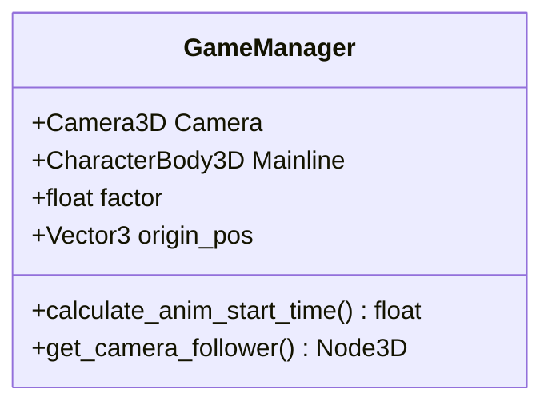

**图表来源**
- [GameManager.gd: 5-50:5-50](file://#Template/[Scripts]/GameManager.gd#L5-L50)

**章节来源**
- [GameManager.gd: 11-39:11-39](file://#Template/[Scripts]/GameManager.gd#L11-L39)

### MainLine 组件分析
职责与行为
- 物理移动：重力、地板检测、飞行模式、穿墙模式
- 转向与动画：响应输入事件，播放动画并同步音乐时间
- 连线绘制：每步生成线段，地面阶段同步地面段高度
- 死亡与粒子：碰撞墙体或触发器时死亡，生成粒子效果
- 状态持久化：在重载时保存 transform、动画时间、音乐检查点等

关键流程（转向与动画同步）
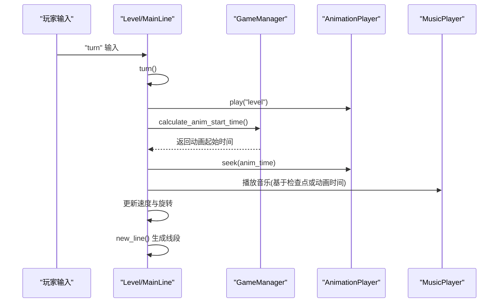

**图表来源**
- [MainLine.gd: 176-201:176-201](file://#Template/[Scripts]/Level/MainLine.gd#L176-L201)
- [GameManager.gd: 33-50:33-50](file://#Template/[Scripts]/GameManager.gd#L33-L50)

**章节来源**
- [MainLine.gd: 56-121:56-121](file://#Template/[Scripts]/Level/MainLine.gd#L56-L121)
- [MainLine.gd: 147-169:147-169](file://#Template/[Scripts]/Level/MainLine.gd#L147-L169)
- [MainLine.gd: 212-248:212-248](file://#Template/[Scripts]/Level/MainLine.gd#L212-L248)

### State 组件分析
职责与行为
- 存储全局状态：相机检查点、动画时间、音乐检查点、通关状态、分数等
- 与触发器交互：记录收集的皇冠数量与标签，设置检查点标志

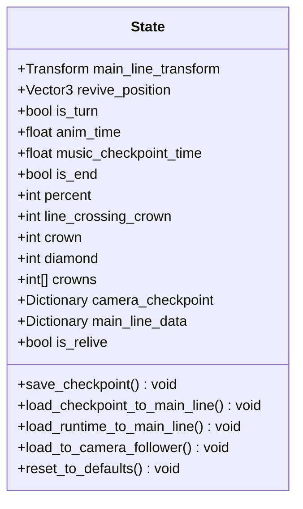

**图表来源**
- [State.gd: 3-196:3-196](file://#Template/[Scripts]/State.gd#L3-L196)

**章节来源**
- [State.gd: 1-196:1-196](file://#Template/[Scripts]/State.gd#L1-L196)

### RoadMaker 组件分析
职责与行为
- 监听 MainLine 的 new_line1 与 on_sky 信号
- 动态生成道路网格，随主线移动更新位置与尺寸
- 提供保存功能，将生成的道路打包为场景资源

**图表来源**
- [RoadMaker.gd: 12-46:12-46](file://#Template/[Scripts]/Level/RoadMaker.gd#L12-L46)

**章节来源**
- [RoadMaker.gd: 22-46:22-46](file://#Template/[Scripts]/Level/RoadMaker.gd#L22-L46)

### 触发器组件分析
- Crown（皇冠）：旋转展示，进入时增加 State.crown，记录相机检查点与动画时间，设置标签检查点
- Diamond（钻石）：旋转展示，进入时增加 State.diamond，播放粒子与动画后销毁
- Trigger（通用触发器）：发出 hit_the_line 信号

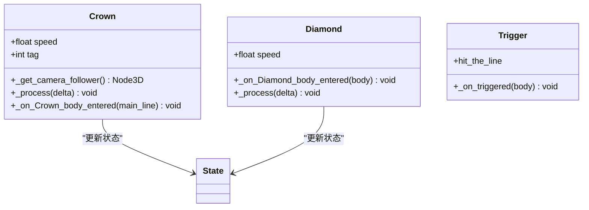

**图表来源**
- [Crown.gd: 3-21:3-21](file://#Template/[Scripts]/Trigger/Crown.gd#L3-L21)
- [Diamond.gd: 4-15:4-15](file://#Template/[Scripts]/Trigger/Diamond.gd#L4-L15)
- [Trigger.gd: 6-10:6-10](file://#Template/[Scripts]/Trigger/Trigger.gd#L6-L10)

**章节来源**
- [Crown.gd: 16-42:16-42](file://#Template/[Scripts]/Trigger/Crown.gd#L16-L42)
- [Diamond.gd: 6-15:6-15](file://#Template/[Scripts]/Trigger/Diamond.gd#L6-L15)
- [Trigger.gd: 8-10:8-10](file://#Template/[Scripts]/Trigger/Trigger.gd#L8-L10)

### 测试框架与用例分析
- gdUnit4 插件：在编辑器中安装控制台与检查器，支持无头模式运行测试
- 测试用例：
  - MainLine_test.gd：验证 MainLine 场景存在、继承关系、属性与方法
  - Crown_test.gd：验证 Crown 脚本与场景存在、继承关系、属性、状态更新与方法存在性

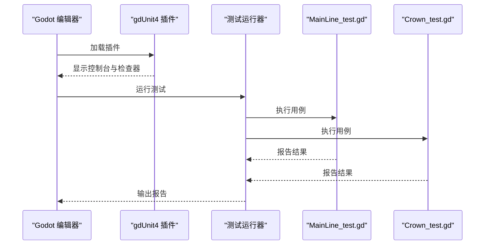

**图表来源**
- [plugin.gd: 11-72:11-72](file://addons/gdUnit4/plugin.gd#L11-L72)
- [plugin.cfg: 1-8:1-8](file://addons/gdUnit4/plugin.cfg#L1-L8)
- [MainLine_test.gd: 1-250:1-250](file://Tests/MainLine_test.gd#L1-L250)
- [Crown_test.gd: 1-178:1-178](file://Tests/Crown_test.gd#L1-L178)

**章节来源**
- [plugin.gd: 11-72:11-72](file://addons/gdUnit4/plugin.gd#L11-L72)
- [MainLine_test.gd: 1-250:1-250](file://Tests/MainLine_test.gd#L1-L250)
- [Crown_test.gd: 1-178:1-178](file://Tests/Crown_test.gd#L1-L178)

## 场景组织结构

### Crown 对象节点层级重构
**更新**：Crown 对象的节点层级已完全重构，child nodes 现在正确嵌套在父节点下

重构前的问题
- Crown 对象的子节点（Crown、CrownTrigger、Marker3D、AnimationPlayer、RevivePos、CrownSprite）直接作为 Scene 的子节点
- 导致节点层次混乱，难以维护和理解场景结构
- 动画触发和检查点逻辑不够清晰

重构后的结构
- 每个 Crown 对象现在都有一个独立的父节点：`Scene/Crown`、`Scene/Crown2`、`Scene/Crown3`
- 所有子节点都正确嵌套在对应的父节点下
- 改善了场景组织和动画触发逻辑

节点层次结构
```mermaid
graph TB
Scene["Scene"] --> CrownParent["Crown (Area3D)"]
CrownParent --> CrownMesh["Crown (MeshInstance3D)"]
CrownParent --> CrownTrigger["CrownTrigger (CollisionShape3D)"]
CrownTrigger --> Marker3D["Marker3D"]
CrownParent --> AnimationPlayer["AnimationPlayer"]
CrownParent --> RevivePos["RevivePos (MeshInstance3D)"]
CrownParent --> CrownSprite["CrownSprite (Sprite3D)"]
Scene --> CrownParent2["Crown2 (Area3D)"]
CrownParent2 --> CrownMesh2["Crown (MeshInstance3D)"]
CrownParent2 --> CrownTrigger2["CrownTrigger (CollisionShape3D)"]
CrownTrigger2 --> Marker3D2["Marker3D"]
CrownParent2 --> AnimationPlayer2["AnimationPlayer"]
CrownParent2 --> RevivePos2["RevivePos (MeshInstance3D)"]
CrownParent2 --> CrownSprite2["CrownSprite (Sprite3D)"]
Scene --> CrownParent3["Crown3 (Area3D)"]
CrownParent3 --> CrownMesh3["Crown (MeshInstance3D)"]
CrownParent3 --> CrownTrigger3["CrownTrigger (CollisionShape3D)"]
CrownTrigger3 --> Marker3D3["Marker3D"]
CrownParent3 --> AnimationPlayer3["AnimationPlayer"]
CrownParent3 --> RevivePos3["RevivePos (MeshInstance3D)"]
CrownParent3 --> CrownSprite3["CrownSprite (Sprite3D)"]
```

**图表来源**
- [Sample.tscn: 213-297:213-297](file://#Template/[Scenes]/Sample.tscn#L213-L297)

重构优势
- **清晰的层次结构**：每个 Crown 对象都有独立的命名空间
- **更好的维护性**：子节点的生命周期与父节点绑定
- **改进的动画触发**：AnimationPlayer 和其他组件都在正确的父节点下
- **简化了检查点逻辑**：RevivePos 和其他组件都位于 Crown 对象内部

**章节来源**
- [Sample.tscn: 213-297:213-297](file://#Template/[Scenes]/Sample.tscn#L213-L297)
- [CrownCheckPoint.tscn: 77-104:77-104](file://#Template/CrownCheckPoint.tscn#L77-L104)

### 场景文件结构
- **Sample.tscn**：演示场景，包含多个 Crown 对象和相机触发器
- **Scene.tscn**：基础场景模板，包含核心游戏对象
- **MainLine.tscn**：主角色场景，包含 MainLine 的完整配置
- **CrownCheckPoint.tscn**：Crown 检查点场景模板

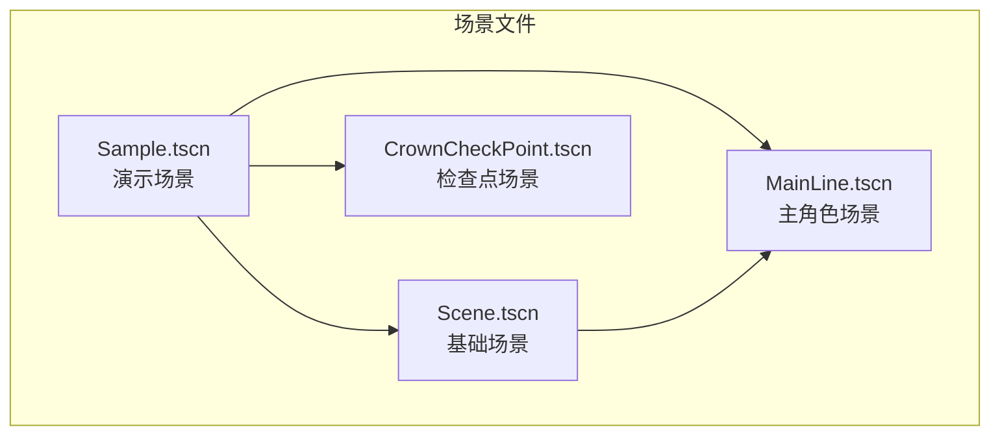

**图表来源**
- [Sample.tscn: 1-305:1-305](file://#Template/[Scenes]/Sample.tscn#L1-L305)
- [Scene.tscn: 1-85:1-85](file://#Template/[Scenes]/Scene.tscn#L1-L85)
- [MainLine.tscn: 1-72:1-72](file://#Template/MainLine.tscn#L1-L72)
- [CrownCheckPoint.tscn: 1-104:1-104](file://#Template/CrownCheckPoint.tscn#L1-L104)

**章节来源**
- [Sample.tscn: 1-305:1-305](file://#Template/[Scenes]/Sample.tscn#L1-L305)
- [Scene.tscn: 1-85:1-85](file://#Template/[Scenes]/Scene.tscn#L1-L85)
- [MainLine.tscn: 1-72:1-72](file://#Template/MainLine.tscn#L1-L72)
- [CrownCheckPoint.tscn: 1-104:1-104](file://#Template/CrownCheckPoint.tscn#L1-L104)

## 相机系统详解

### CameraFollower 相机跟随器
**更新**：相机跟随器现在支持新的 tween_transition 和 tween_ease 属性系统

职责与行为
- 平滑跟随玩家角色，提供自然的相机移动体验
- 支持多种相机参数的 Tween 动画：位置、旋转、距离、跟随速度
- 提供相机检查点功能，支持状态恢复
- 内置 Lerp 过渡系统，支持最短角路径旋转

关键特性
- **Tween 系统**：使用 `tween_transition` 和 `tween_ease` 属性控制动画曲线
- **多属性管理**：统一管理相机位置、旋转、距离和速度的 Tween 实例
- **状态备份**：支持相机参数的备份与恢复
- **实时中断**：支持停止正在进行的 Tween 动画

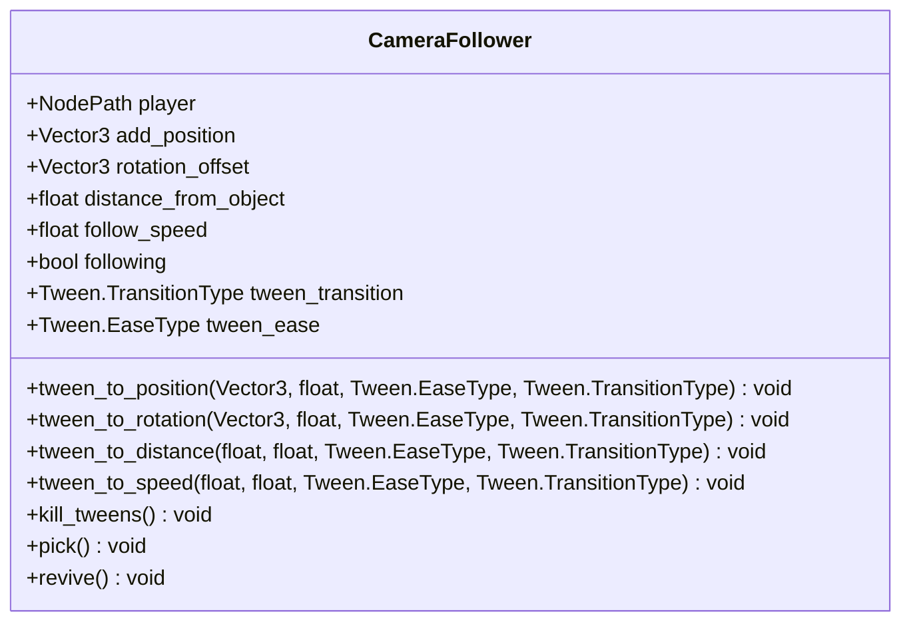

**图表来源**
- [CameraFollower.gd: 3-179:3-179](file://#Template/[Scripts]/CameraScripts/CameraFollower.gd#L3-L179)

**章节来源**
- [CameraFollower.gd: 1-179:1-179](file://#Template/[Scripts]/CameraScripts/CameraFollower.gd#L1-L179)

### CameraTrigger 相机触发器
**更新**：相机触发器已从 ease_type 系统迁移到新的 tween_transition 和 tween_ease 属性系统

职责与行为
- 检测玩家进入触发区域时执行相机参数变更
- 支持基于时间或即时触发的相机切换
- 使用 Tween 系统平滑过渡相机参数

新属性系统
- `tween_transition`：控制动画的过渡类型（如 Sine、Linear、Quad 等）
- `tween_ease`：控制动画的缓动类型（如 In、Out、InOut 等）
- `need_time`：动画持续时间

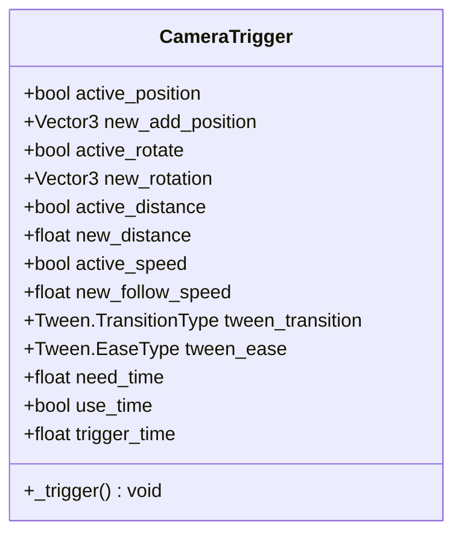

**图表来源**
- [CameraTrigger.gd: 3-75:3-75](file://#Template/[Scripts]/CameraScripts/CameraTrigger.gd#L3-L75)

**章节来源**
- [CameraTrigger.gd: 1-75:1-75](file://#Template/[Scripts]/CameraScripts/CameraTrigger.gd#L1-L75)

### CamShaker 相机震动器
职责与行为
- 提供相机震动效果，增强游戏的反馈体验
- 支持自定义震动强度和持续时间
- 基于随机偏移实现自然的震动效果

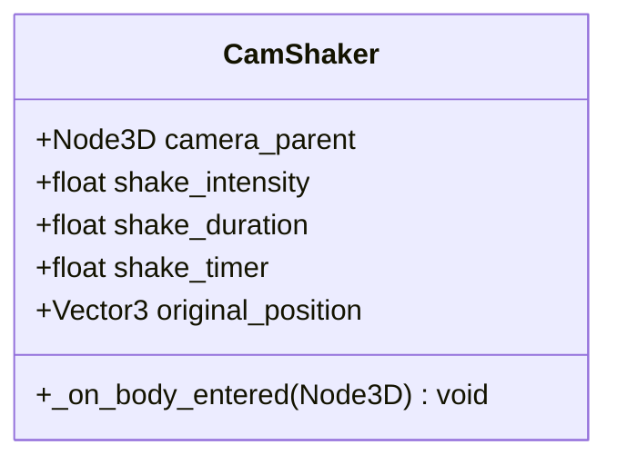

**图表来源**
- [CamShaker.gd: 3-33:3-33](file://#Template/[Scripts]/CameraScripts/CamShaker.gd#L3-L33)

**章节来源**
- [CamShaker.gd: 1-33:1-33](file://#Template/[Scripts]/CameraScripts/CamShaker.gd#L1-L33)

### Sample.tscn 场景中的相机配置
**更新**：Sample.tscn 场景中多个相机触发器已配置新的 Tween 属性系统

场景中的相机触发器配置
- **Trigger2**：配置了 `tween_transition = 1`（Sine）和 `tween_ease = 2`（InOut）
- **Trigger3**：同样配置了 `tween_transition = 1`（Sine）和 `tween_ease = 2`（InOut）
- 所有触发器都设置了 `need_time = 1.0` 或 `need_time = 2.0` 的动画持续时间

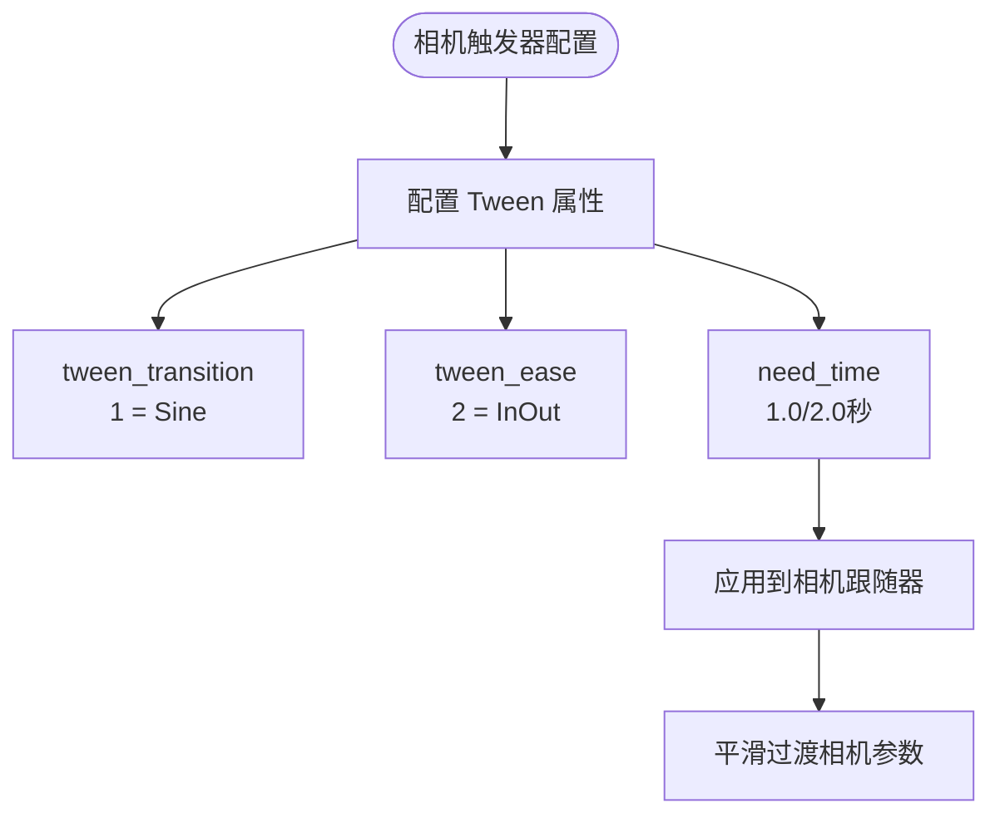

**图表来源**
- [Sample.tscn: 159-190:159-190](file://#Template/[Scenes]/Sample.tscn#L159-L190)

**章节来源**
- [Sample.tscn: 159-190:159-190](file://#Template/[Scenes]/Sample.tscn#L159-L190)

## 依赖关系分析
- 项目配置依赖：project.godot 定义输入映射、层位、渲染与插件启用
- 运行时依赖：MainLine 依赖 State、RoadMaker、GameManager；触发器依赖 State
- 测试依赖：gdUnit4 插件与测试套件
- **相机系统依赖**：CameraTrigger 依赖 CameraFollower，GameManager 提供相机跟随器访问
- **场景组织依赖**：Crown 对象的正确嵌套依赖于 Scene 文件的节点层次结构

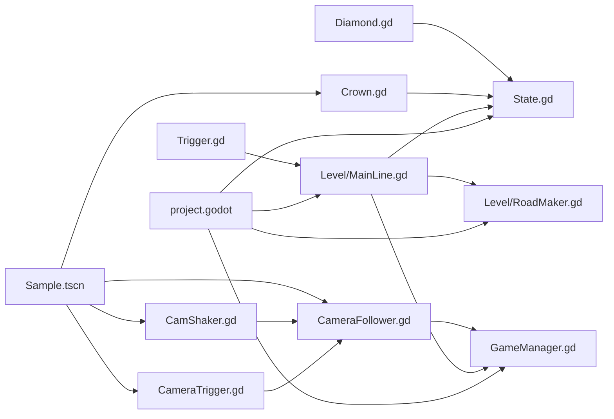

**图表来源**
- [project.godot: 22-88:22-88](file://project.godot#L22-L88)
- [MainLine.gd: 1-218:1-218](file://#Template/[Scripts]/Level/MainLine.gd#L1-L218)
- [RoadMaker.gd: 1-46:1-46](file://#Template/[Scripts]/Level/RoadMaker.gd#L1-L46)
- [GameManager.gd: 1-50:1-50](file://#Template/[Scripts]/GameManager.gd#L1-L50)
- [Crown.gd: 1-21:1-21](file://#Template/[Scripts]/Trigger/Crown.gd#L1-L21)
- [Diamond.gd: 1-15:1-15](file://#Template/[Scripts]/Trigger/Diamond.gd#L1-L15)
- [Trigger.gd: 1-10:1-10](file://#Template/[Scripts]/Trigger/Trigger.gd#L1-L10)
- [CameraFollower.gd: 1-179:1-179](file://#Template/[Scripts]/CameraScripts/CameraFollower.gd#L1-L179)
- [CameraTrigger.gd: 1-75:1-75](file://#Template/[Scripts]/CameraScripts/CameraTrigger.gd#L1-L75)
- [CamShaker.gd: 1-33:1-33](file://#Template/[Scripts]/CameraScripts/CamShaker.gd#L1-L33)
- [Sample.tscn: 1-305:1-305](file://#Template/[Scenes]/Sample.tscn#L1-L305)

**章节来源**
- [project.godot: 22-88:22-88](file://project.godot#L22-L88)

## 性能考量
- 物理与渲染
  - 3D 物理在独立线程运行，使用 Jolt 物理引擎，有助于提升性能
  - 移动端渲染方法设为 mobile，纹理 VRAM 压缩开启，有利于移动端表现
- 动画与音乐同步
  - 使用音画同步策略，减少视觉与音频不同步带来的额外计算
- 线段与网格
  - 线段与道路网格按需生成与更新，避免不必要的对象创建
- 测试环境
  - 无头模式运行测试，减少图形与音频开销
- **相机系统性能**
  - Tween 动画使用 Godot 内置优化，避免手动插值计算
  - 相机跟随使用球面插值（slerp），提供更自然的过渡效果
- **场景组织性能**
  - 重构后的节点层级减少了场景树的深度，提高了节点查找效率
  - 子节点的正确嵌套改善了内存管理和垃圾回收性能

**章节来源**
- [project.godot: 78-88:78-88](file://project.godot#L78-L88)
- [MainLine.gd: 74-76:74-76](file://#Template/[Scripts]/Level/MainLine.gd#L74-L76)
- [CameraFollower.gd: 54-62:54-62](file://#Template/[Scripts]/CameraScripts/CameraFollower.gd#L54-L62)

## 故障排除指南
- 插件警告与兼容性
  - 若出现 GDScript 推断声明警告，需在项目设置中排除插件路径或关闭相关警告
  - 插件要求 Godot 4.5+，低版本会提示无法加载
- 输入映射问题
  - 检查 project.godot 的 input 节是否正确配置 turn/retry/save/reload/savetaper
- 动画与音乐不同步
  - 确认 MainLine 的音乐播放与 AnimationPlayer 的 seek 时间一致
- 线段未生成或消失
  - 确认 MainLine 已连接 new_line1 信号，且 RoadMaker 已添加到场景树
- 测试运行异常
  - 使用无头模式运行测试，确认 gdUnit4 插件已启用
- **相机系统问题**
  - **Tween 属性配置错误**：检查相机触发器的 `tween_transition` 和 `tween_ease` 是否为有效的 Tween 枚举值
  - **相机跟随异常**：确认 CameraFollower 的 `player` 属性指向正确的玩家节点
  - **动画不生效**：检查相机触发器是否正确调用了 `kill_tweens()` 来中断现有动画
- **场景组织问题**
  - **Crown 节点层级错误**：检查 Sample.tscn 中 Crown 对象的父子关系，确保子节点正确嵌套在父节点下
  - **动画触发失败**：确认 AnimationPlayer 和其他组件都在正确的 Crown 父节点下
  - **检查点逻辑异常**：验证 RevivePos 和其他检查点组件的位置和可见性

**章节来源**
- [plugin.gd: 11-38:11-38](file://addons/gdUnit4/plugin.gd#L11-L38)
- [project.godot: 43-71:43-71](file://project.godot#L43-L71)
- [MainLine.gd: 147-169:147-169](file://#Template/[Scripts]/Level/MainLine.gd#L147-L169)
- [RoadMaker.gd: 12-21:12-21](file://#Template/[Scripts]/Level/RoadMaker.gd#L12-L21)
- [CameraTrigger.gd: 54-75:54-75](file://#Template/[Scripts]/CameraScripts/CameraTrigger.gd#L54-L75)
- [CameraFollower.gd: 86-132:86-132](file://#Template/[Scripts]/CameraScripts/CameraFollower.gd#L86-L132)
- [Sample.tscn: 213-297:213-297](file://#Template/[Scenes]/Sample.tscn#L213-L297)

## 结论
本模板以模块化与测试驱动为核心，提供了 Dancing Line 的完整实现骨架。通过清晰的状态管理、事件驱动的触发器系统、高效的物理渲染配置以及全新的相机 Tween 动画系统，能够快速搭建关卡并进行功能扩展。gdUnit4 的集成保证了代码质量与可维护性，适合团队协作与持续交付。

**更新总结**：
- 场景组织结构已完全重构，Crown 对象的节点层级现在正确嵌套，改善了场景组织和动画触发逻辑
- 相机系统已完全迁移到新的 Tween 属性系统
- CameraTrigger 和 CameraFollower 现在使用 `tween_transition` 和 `tween_ease` 替代旧的 `ease_type` 系统
- Sample.tscn 场景中的相机触发器已配置新的动画属性
- 新的系统提供了更灵活和直观的相机动画控制
- 重构后的场景结构提高了代码的可维护性和性能

## 附录
- 快速开始
  - 克隆仓库并在 Godot 4.6 中打开项目
  - 运行主场景或使用 Main.tscn 启动
- 输入控制
  - 转向：鼠标左键或空格
  - 重试：R
  - 保存：S
  - 重载：Q
  - 保存锥体：W
- 测试运行
  - 无头模式：godot --headless --run-tests
  - 编辑器中：打开底部 gdUnit4 面板
- **相机系统配置**
  - **Tween 类型**：TRANS_LINEAR、TRANS_SINE、TRANS_QUAD、TRANS_CUBIC 等
  - **缓动类型**：EASE_IN、EASE_OUT、EASE_IN_OUT
  - **动画持续时间**：建议 1.0-2.0 秒之间
  - **相机触发器使用**：支持即时触发和基于时间的触发
- **场景组织最佳实践**
  - **节点层级**：确保子节点正确嵌套在父节点下
  - **命名规范**：使用清晰的节点名称，便于识别和维护
  - **检查点管理**：将 RevivePos 和其他检查点组件放在正确的父节点下
  - **动画分离**：每个 Crown 对象的 AnimationPlayer 应该在其父节点下独立管理

**章节来源**
- [README.md: 18-51:18-51](file://README.md#L18-L51)
- [CONTRIBUTING.md: 41-59:41-59](file://CONTRIBUTING.md#L41-L59)
- [CameraTrigger.gd: 11-12:11-12](file://#Template/[Scripts]/CameraScripts/CameraTrigger.gd#L11-L12)
- [CameraFollower.gd: 9-10:9-10](file://#Template/[Scripts]/CameraScripts/CameraFollower.gd#L9-L10)
- [Sample.tscn: 98-116:98-116](file://#Template/[Scenes]/Sample.tscn#L98-L116)
- [Sample.tscn: 213-297:213-297](file://#Template/[Scenes]/Sample.tscn#L213-L297)