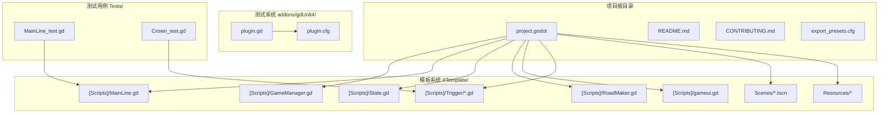
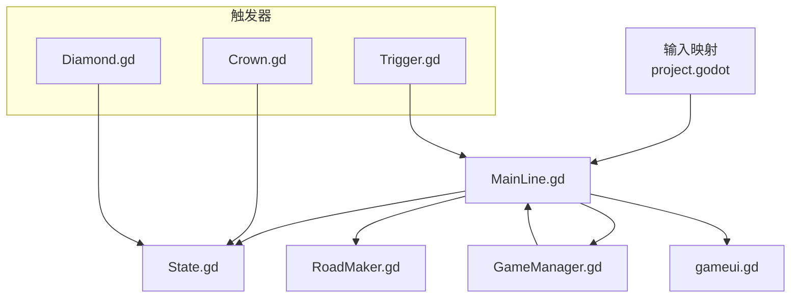
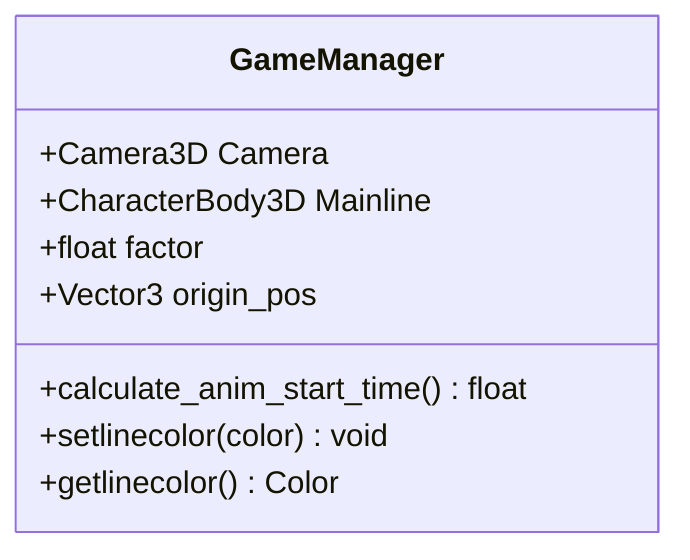
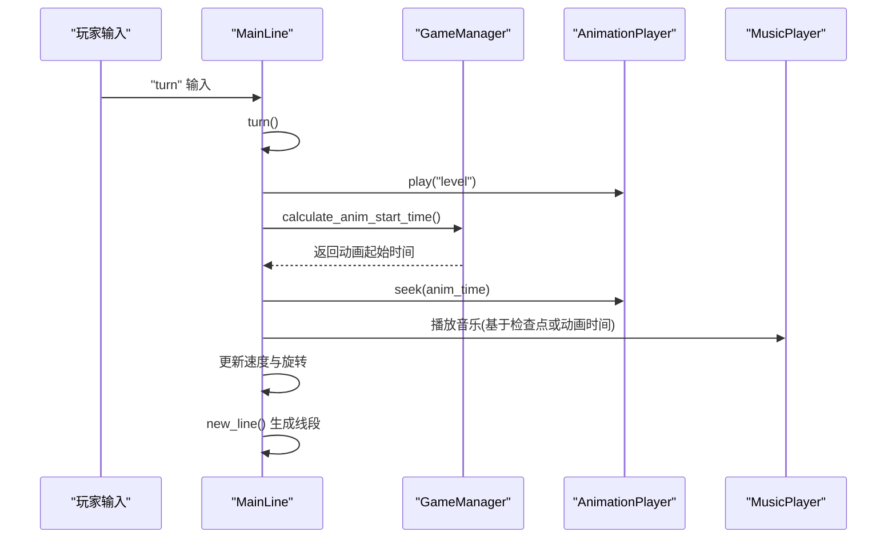
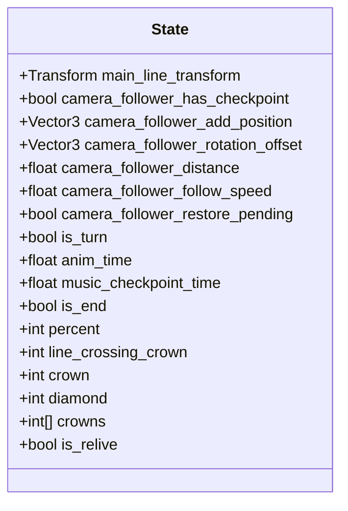
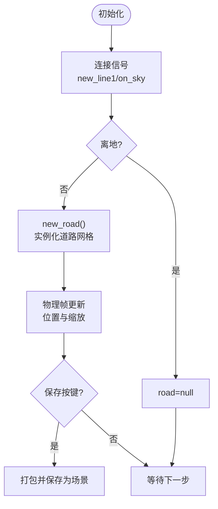
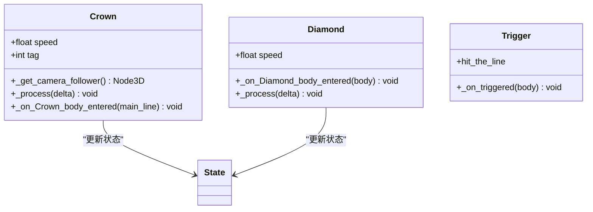
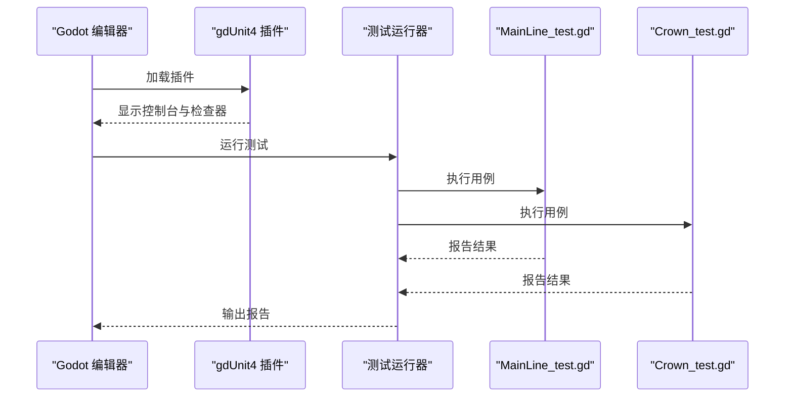
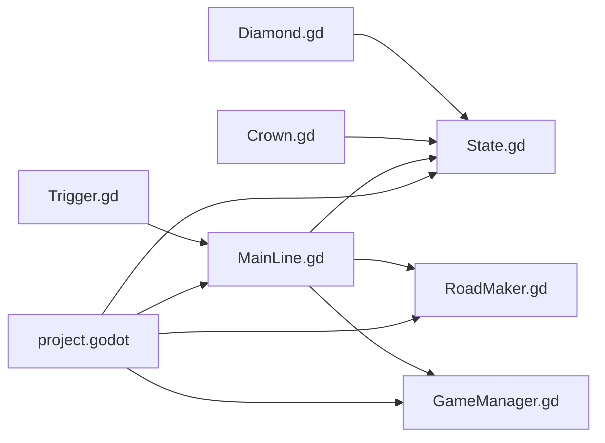

# 示例场景

<cite>
**本文引用的文件**
- [README.md](file://README.md)
- [CONTRIBUTING.md](file://CONTRIBUTING.md)
- [project.godot](file://project.godot)
- [plugin.gd](file://addons/gdUnit4/plugin.gd)
- [plugin.cfg](file://addons/gdUnit4/plugin.cfg)
- [GameManager.gd](file://#Template/[Scripts]/GameManager.gd)
- [MainLine.gd](file://#Template/[Scripts]/MainLine.gd)
- [State.gd](file://#Template/[Scripts]/State.gd)
- [RoadMaker.gd](file://#Template/[Scripts]/RoadMaker.gd)
- [gameui.gd](file://#Template/[Scripts]/gameui.gd)
- [Crown.gd](file://#Template/[Scripts]/Trigger/Crown.gd)
- [Diamond.gd](file://#Template/[Scripts]/Trigger/Diamond.gd)
- [Trigger.gd](file://#Template/[Scripts]/Trigger/Trigger.gd)
- [MainLine_test.gd](file://Tests/MainLine_test.gd)
- [Crown_test.gd](file://Tests/Crown_test.gd)
</cite>

## 目录
1. [简介](#简介)
2. [项目结构](#项目结构)
3. [核心组件](#核心组件)
4. [架构总览](#架构总览)
5. [详细组件分析](#详细组件分析)
6. [依赖关系分析](#依赖关系分析)
7. [性能考量](#性能考量)
8. [故障排除指南](#故障排除指南)
9. [结论](#结论)
10. [附录](#附录)

## 简介
本项目是一个基于 Godot Engine 4.6 的 Dancing Line 游戏模板框架，目标是提供一套开箱即用、模块化的线条游戏实现，支持快速关卡迁移与跨平台发布。项目内建完整的模板系统与测试框架（gdUnit4），并通过输入映射与状态管理实现流畅的玩法体验。

- 支持平台：Windows、Linux、macOS
- 引擎版本：Godot 4.6
- 测试框架：gdUnit4
- 模块化设计：清晰的脚本与场景组织，便于扩展与定制

**章节来源**
- [README.md: 1-138:1-138](file://README.md#L1-L138)

## 项目结构
项目采用模板化与模块化结合的组织方式：
- #Template/：核心模板资源与脚本，包含场景、材质、音效、触发器与工具脚本
- Tests/：单元测试（gdUnit4）
- addons/gdUnit4/：测试插件与工具
- reports/：测试报告输出目录
- project.godot：项目配置（输入映射、层位、渲染等）
- 其他：README、贡献指南、导出预设等

**图表来源**
- [project.godot: 1-88:1-88](file://project.godot#L1-L88)
- [plugin.gd: 1-102:1-102](file://addons/gdUnit4/plugin.gd#L1-L102)
- [plugin.cfg: 1-8:1-8](file://addons/gdUnit4/plugin.cfg#L1-L8)

**章节来源**
- [README.md: 53-65:53-65](file://README.md#L53-L65)
- [project.godot: 15-88:15-88](file://project.godot#L15-L88)

## 核心组件
- GameManager：负责相机、主线与动画起始时间计算等
- MainLine：角色主体，处理移动、转向、连线绘制、死亡与特效
- State：全局状态容器，保存相机检查点、动画时间、音乐检查点、通关状态等
- RoadMaker：根据主线位置动态生成道路网格
- gameui：结算界面与交互逻辑
- 触发器：Crown（皇冠）、Diamond（钻石）、Trigger（通用触发器）

**章节来源**
- [GameManager.gd: 1-47:1-47](file://#Template/[Scripts]/GameManager.gd#L1-L47)
- [MainLine.gd: 1-253:1-253](file://#Template/[Scripts]/MainLine.gd#L1-L253)
- [State.gd: 1-22:1-22](file://#Template/[Scripts]/State.gd#L1-L22)
- [RoadMaker.gd: 1-46:1-46](file://#Template/[Scripts]/RoadMaker.gd#L1-L46)
- [gameui.gd: 1-74:1-74](file://#Template/[Scripts]/gameui.gd#L1-L74)
- [Crown.gd: 1-42:1-42](file://#Template/[Scripts]/Trigger/Crown.gd#L1-L42)
- [Diamond.gd: 1-15:1-15](file://#Template/[Scripts]/Trigger/Diamond.gd#L1-L15)
- [Trigger.gd: 1-10:1-10](file://#Template/[Scripts]/Trigger/Trigger.gd#L1-L10)

## 架构总览
整体架构围绕“状态驱动 + 事件触发”的模式构建：
- 输入事件通过 project.godot 的输入映射触发 MainLine 的转向逻辑
- MainLine 在物理帧中更新运动与连线，同时与 RoadMaker 协作生成道路
- 触发器（Crown/Diamond）通过 Area3D 与 MainLine 交互，更新 State
- GameManager 负责计算动画起始时间并与 MainLine 的动画同步
- gameui 基于 State 显示结算界面与交互

**图表来源**
- [project.godot: 43-71:43-71](file://project.godot#L43-L71)
- [MainLine.gd: 56-201:56-201](file://#Template/[Scripts]/MainLine.gd#L56-L201)
- [RoadMaker.gd: 22-46:22-46](file://#Template/[Scripts]/RoadMaker.gd#L22-L46)
- [GameManager.gd: 23-39:23-39](file://#Template/[Scripts]/GameManager.gd#L23-L39)
- [State.gd: 1-22:1-22](file://#Template/[Scripts]/State.gd#L1-L22)
- [Crown.gd: 16-42:16-42](file://#Template/[Scripts]/Trigger/Crown.gd#L16-L42)
- [Diamond.gd: 6-15:6-15](file://#Template/[Scripts]/Trigger/Diamond.gd#L6-L15)
- [Trigger.gd: 8-10:8-10](file://#Template/[Scripts]/Trigger/Trigger.gd#L8-L10)

## 详细组件分析

### GameManager 组件分析
职责与行为
- 暴露相机、主线引用与系数因子
- 提供原点位置设置与跳转功能
- 计算动画起始时间：基于主线当前位置与原点的2D距离、速度与系数

复杂度与性能
- 计算为 O(1)，仅涉及向量距离与除法运算
- 速度为零时返回 0，避免无效时间

**图表来源**
- [GameManager.gd: 5-47:5-47](file://#Template/[Scripts]/GameManager.gd#L5-L47)

**章节来源**
- [GameManager.gd: 11-39:11-39](file://#Template/[Scripts]/GameManager.gd#L11-L39)

### MainLine 组件分析
职责与行为
- 物理移动：重力、地板检测、飞行模式、穿墙模式
- 转向与动画：响应输入事件，播放动画并同步音乐时间
- 连线绘制：每步生成线段，地面阶段同步地面段高度
- 死亡与粒子：碰撞墙体或触发器时死亡，生成粒子效果
- 状态持久化：在重载时保存 transform、动画时间、音乐检查点等

关键流程（转向与动画同步）

**图表来源**
- [MainLine.gd: 176-201:176-201](file://#Template/[Scripts]/MainLine.gd#L176-L201)
- [GameManager.gd: 23-39:23-39](file://#Template/[Scripts]/GameManager.gd#L23-L39)

**章节来源**
- [MainLine.gd: 56-121:56-121](file://#Template/[Scripts]/MainLine.gd#L56-L121)
- [MainLine.gd: 147-169:147-169](file://#Template/[Scripts]/MainLine.gd#L147-L169)
- [MainLine.gd: 212-248:212-248](file://#Template/[Scripts]/MainLine.gd#L212-L248)

### State 组件分析
职责与行为
- 存储全局状态：相机检查点、动画时间、音乐检查点、通关状态、分数等
- 与触发器交互：记录收集的皇冠数量与标签，设置检查点标志

**图表来源**
- [State.gd: 3-22:3-22](file://#Template/[Scripts]/State.gd#L3-L22)

**章节来源**
- [State.gd: 1-22:1-22](file://#Template/[Scripts]/State.gd#L1-L22)

### RoadMaker 组件分析
职责与行为
- 监听 MainLine 的 new_line1 与 on_sky 信号
- 动态生成道路网格，随主线移动更新位置与尺寸
- 提供保存功能，将生成的道路打包为场景资源

**图表来源**
- [RoadMaker.gd: 12-46:12-46](file://#Template/[Scripts]/RoadMaker.gd#L12-L46)

**章节来源**
- [RoadMaker.gd: 22-46:22-46](file://#Template/[Scripts]/RoadMaker.gd#L22-L46)

### 触发器组件分析
- Crown（皇冠）：旋转展示，进入时增加 State.crown，记录相机检查点与动画时间，设置标签检查点
- Diamond（钻石）：旋转展示，进入时增加 State.diamond，播放粒子与动画后销毁
- Trigger（通用触发器）：发出 hit_the_line 信号

**图表来源**
- [Crown.gd: 3-42:3-42](file://#Template/[Scripts]/Trigger/Crown.gd#L3-L42)
- [Diamond.gd: 4-15:4-15](file://#Template/[Scripts]/Trigger/Diamond.gd#L4-L15)
- [Trigger.gd: 6-10:6-10](file://#Template/[Scripts]/Trigger/Trigger.gd#L6-L10)

**章节来源**
- [Crown.gd: 16-42:16-42](file://#Template/[Scripts]/Trigger/Crown.gd#L16-L42)
- [Diamond.gd: 6-15:6-15](file://#Template/[Scripts]/Trigger/Diamond.gd#L6-L15)
- [Trigger.gd: 8-10:8-10](file://#Template/[Scripts]/Trigger/Trigger.gd#L8-L10)

### 测试框架与用例分析
- gdUnit4 插件：在编辑器中安装控制台与检查器，支持无头模式运行测试
- 测试用例：
  - MainLine_test.gd：验证 MainLine 场景存在、继承关系、属性与方法
  - Crown_test.gd：验证 Crown 脚本与场景存在、继承关系、属性、状态更新与方法存在性

**图表来源**
- [plugin.gd: 11-72:11-72](file://addons/gdUnit4/plugin.gd#L11-L72)
- [plugin.cfg: 1-8:1-8](file://addons/gdUnit4/plugin.cfg#L1-L8)
- [MainLine_test.gd: 1-250:1-250](file://Tests/MainLine_test.gd#L1-L250)
- [Crown_test.gd: 1-178:1-178](file://Tests/Crown_test.gd#L1-L178)

**章节来源**
- [plugin.gd: 11-72:11-72](file://addons/gdUnit4/plugin.gd#L11-L72)
- [MainLine_test.gd: 1-250:1-250](file://Tests/MainLine_test.gd#L1-L250)
- [Crown_test.gd: 1-178:1-178](file://Tests/Crown_test.gd#L1-L178)

## 依赖关系分析
- 项目配置依赖：project.godot 定义输入映射、层位、渲染与插件启用
- 运行时依赖：MainLine 依赖 State、RoadMaker、GameManager；触发器依赖 State
- 测试依赖：gdUnit4 插件与测试套件

**图表来源**
- [project.godot: 22-88:22-88](file://project.godot#L22-L88)
- [MainLine.gd: 1-253:1-253](file://#Template/[Scripts]/MainLine.gd#L1-L253)
- [RoadMaker.gd: 1-46:1-46](file://#Template/[Scripts]/RoadMaker.gd#L1-L46)
- [GameManager.gd: 1-47:1-47](file://#Template/[Scripts]/GameManager.gd#L1-L47)
- [Crown.gd: 1-42:1-42](file://#Template/[Scripts]/Trigger/Crown.gd#L1-L42)
- [Diamond.gd: 1-15:1-15](file://#Template/[Scripts]/Trigger/Diamond.gd#L1-L15)
- [Trigger.gd: 1-10:1-10](file://#Template/[Scripts]/Trigger/Trigger.gd#L1-L10)

**章节来源**
- [project.godot: 22-88:22-88](file://project.godot#L22-L88)

## 性能考量
- 物理与渲染
  - 3D 物理在独立线程运行，使用 Jolt 物理引擎，有助于提升性能
  - 移动端渲染方法设为 mobile，纹理 VRAM 压缩开启，有利于移动端表现
- 动画与音乐同步
  - 使用音画同步策略，减少视觉与音频不同步带来的额外计算
- 线段与网格
  - 线段与道路网格按需生成与更新，避免不必要的对象创建
- 测试环境
  - 无头模式运行测试，减少图形与音频开销

**章节来源**
- [project.godot: 78-88:78-88](file://project.godot#L78-L88)
- [MainLine.gd: 74-76:74-76](file://#Template/[Scripts]/MainLine.gd#L74-L76)

## 故障排除指南
- 插件警告与兼容性
  - 若出现 GDScript 推断声明警告，需在项目设置中排除插件路径或关闭相关警告
  - 插件要求 Godot 4.5+，低版本会提示无法加载
- 输入映射问题
  - 检查 project.godot 的 input 节是否正确配置 turn/retry/save/reload/savetaper
- 动画与音乐不同步
  - 确认 MainLine 的音乐播放与 AnimationPlayer 的 seek 时间一致
- 线段未生成或消失
  - 确认 MainLine 已连接 new_line1 信号，且 RoadMaker 已添加到场景树
- 测试运行异常
  - 使用无头模式运行测试，确认 gdUnit4 插件已启用

**章节来源**
- [plugin.gd: 11-38:11-38](file://addons/gdUnit4/plugin.gd#L11-L38)
- [project.godot: 43-71:43-71](file://project.godot#L43-L71)
- [MainLine.gd: 147-169:147-169](file://#Template/[Scripts]/MainLine.gd#L147-L169)
- [RoadMaker.gd: 12-21:12-21](file://#Template/[Scripts]/RoadMaker.gd#L12-L21)

## 结论
本模板以模块化与测试驱动为核心，提供了 Dancing Line 的完整实现骨架。通过清晰的状态管理、事件驱动的触发器系统与高效的物理渲染配置，能够快速搭建关卡并进行功能扩展。gdUnit4 的集成保证了代码质量与可维护性，适合团队协作与持续交付。

## 附录
- 快速开始
  - 克隆仓库并在 Godot 4.6 中打开项目
  - 运行主场景或使用 Main.tscn 启动
- 输入控制
  - 转向：鼠标左键或空格
  - 重试：R
  - 保存：S
  - 重载：Q
  - 保存锥体：W
- 测试运行
  - 无头模式：godot --headless --run-tests
  - 编辑器中：打开底部 gdUnit4 面板

**章节来源**
- [README.md: 19-87:19-87](file://README.md#L19-L87)
- [CONTRIBUTING.md: 41-59:41-59](file://CONTRIBUTING.md#L41-L59)