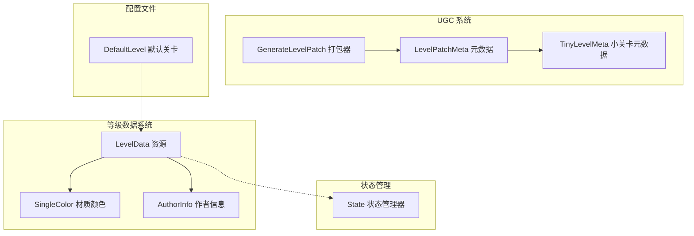
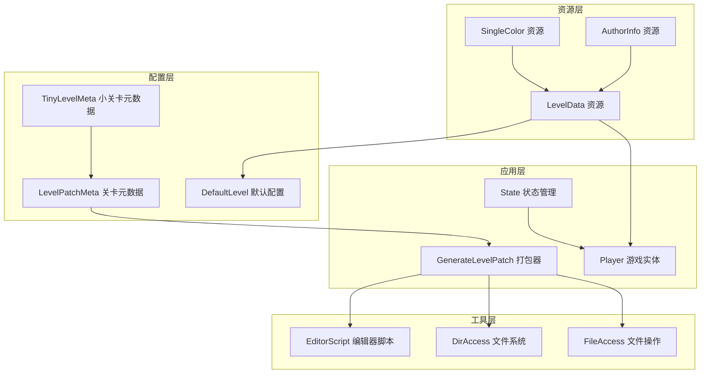
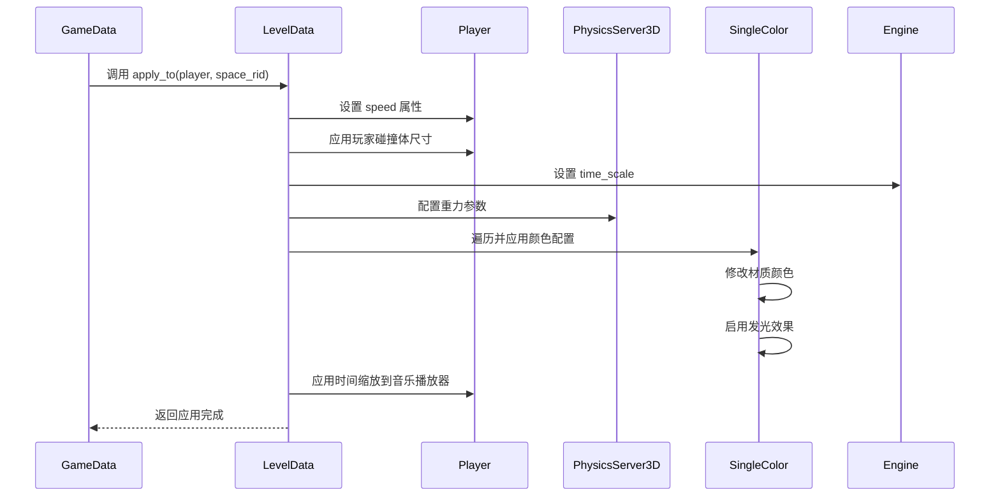
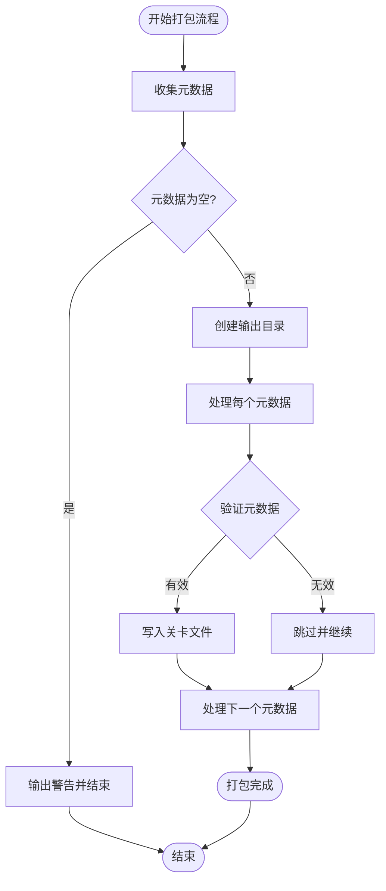
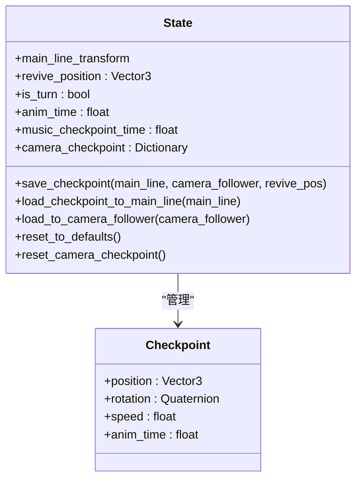
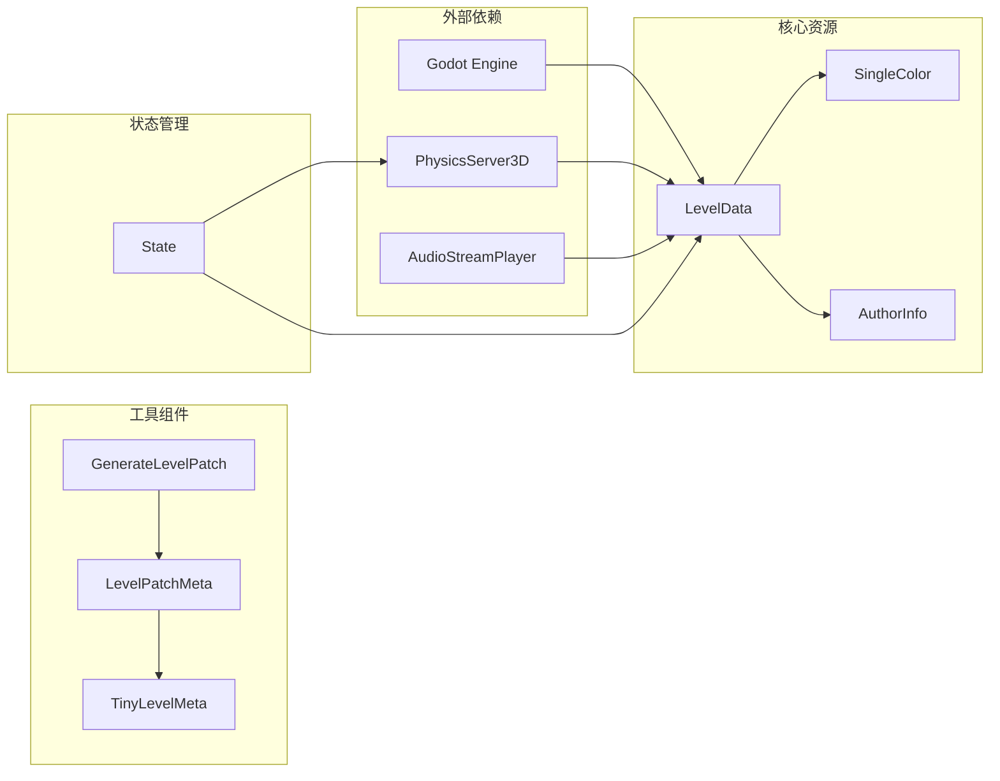

# 等级数据系统

<cite>
**本文档引用的文件**
- [LevelData.gd](file://#Template/[Scripts]/Settings/LevelData.gd)
- [DefaultLevel.tres](file://#Template/[Resources]/LevelData/DefaultLevel.tres)
- [SingleColor.gd](file://#Template/[Scripts]/Settings/SingleColor.gd)
- [AuthorInfo.gd](file://#Template/[Scripts]/Settings/AuthorInfo.gd)
- [GenerateLevelPatch.gd](file://#Template/[Scripts]/UGC/GenerateLevelPatch.gd)
- [LevelPatchMeta.gd](file://#Template/[Scripts]/UGC/LevelPatchMeta.gd)
- [TinyLevelMeta.gd](file://#Template/[Scripts]/UGC/TinyLevelMeta.gd)
- [State.gd](file://#Template/[Scripts]/State.gd)
- [Player.gd](file://#Template/[Scripts]/Level/Player.gd)
</cite>

## 更新摘要
**变更内容**
- 更新了LevelData.gd的apply_to方法签名，从接受MainLine实例改为接受Player实例
- 更新了相关的应用流程图和架构图以反映这一变更
- 增强了玩家属性应用的直接性和效率

## 目录
1. [简介](#简介)
2. [项目结构](#项目结构)
3. [核心组件](#核心组件)
4. [架构概览](#架构概览)
5. [详细组件分析](#详细组件分析)
6. [依赖关系分析](#依赖关系分析)
7. [性能考虑](#性能考虑)
8. [故障排除指南](#故障排除指南)
9. [结论](#结论)

## 简介

等级数据系统是Godot游戏项目中的核心配置管理系统，负责存储和管理关卡的各种属性设置。该系统采用资源驱动的设计模式，通过LevelData资源类提供统一的关卡配置接口，支持物理参数、音频配置、视觉效果等多个方面的定制。

系统主要包含以下功能模块：
- 关卡基础属性配置（速度、重力、时间缩放等）
- 音频系统集成（背景音乐、多音轨支持）
- 材质颜色管理（动态颜色变化）
- 作者信息管理
- UGC（用户生成内容）关卡打包系统

## 项目结构

等级数据系统在项目中的组织结构如下：

**图表来源**
- [LevelData.gd:1-72](file://#Template/[Scripts]/Settings/LevelData.gd#L1-L72)
- [GenerateLevelPatch.gd:1-139](file://#Template/[Scripts]/UGC/GenerateLevelPatch.gd#L1-L139)

**章节来源**
- [LevelData.gd:1-72](file://#Template/[Scripts]/Settings/LevelData.gd#L1-L72)
- [DefaultLevel.tres:1-24](file://#Template/[Resources]/LevelData/DefaultLevel.tres#L1-L24)

## 核心组件

### LevelData 资源类

LevelData是整个等级数据系统的核心类，继承自Resource基类，提供了完整的关卡配置管理功能。

**主要特性：**
- 基础物理参数配置（速度、重力、时间缩放）
- 音频系统集成（单音轨和多音轨支持）
- 材质颜色管理（动态颜色变化）
- 关卡应用接口（apply_to方法）

**关键属性：**
- `saveID`: 关卡唯一标识符
- `levelTitleKey`: 关卡标题键值
- `speed`: 玩家移动速度
- `timeScale`: 游戏时间缩放系数
- `gravity`: 重力向量配置
- `playerHeadBoxColliderSize`: 玩家头部碰撞体尺寸
- `colors`: 材质颜色数组
- `levelTitle`: 关卡标题
- `authors`: 作者信息数组

**更新** LevelData.gd的apply_to方法已更新为接受Player实例而非MainLine实例，实现更直接的玩家属性应用。

**章节来源**
- [LevelData.gd:1-72](file://#Template/[Scripts]/Settings/LevelData.gd#L1-L72)

### SingleColor 材质颜色管理

SingleColor类专门负责处理材质的颜色配置和动态变化。

**核心功能：**
- 材质颜色应用
- 发光效果控制
- 颜色强度调节

**实现机制：**
通过StandardMaterial3D的属性直接修改材质的albedo_color、emission_enabled等参数，实现动态颜色变化效果。

**章节来源**
- [SingleColor.gd:1-19](file://#Template/[Scripts]/Settings/SingleColor.gd#L1-L19)

### AuthorInfo 作者信息管理

AuthorInfo类用于存储和管理关卡作者的相关信息。

**包含字段：**
- `name`: 作者姓名
- `page_url`: 作者主页链接

**用途：**
为关卡提供作者信息展示，支持多作者协作开发。

**章节来源**
- [AuthorInfo.gd:1-9](file://#Template/[Scripts]/Settings/AuthorInfo.gd#L1-L9)

## 架构概览

等级数据系统的整体架构采用分层设计，从底层资源定义到上层应用接口形成清晰的层次结构。

**更新** 系统架构已更新以反映Player实例作为主要应用目标的变更。

**图表来源**
- [LevelData.gd:1-72](file://#Template/[Scripts]/Settings/LevelData.gd#L1-L72)
- [GenerateLevelPatch.gd:1-139](file://#Template/[Scripts]/UGC/GenerateLevelPatch.gd#L1-L139)
- [State.gd:1-159](file://#Template/[Scripts]/State.gd#L1-L159)

## 详细组件分析

### 关卡应用流程

LevelData的apply_to方法实现了关卡配置到游戏实体的完整应用过程。**更新** 方法现已直接接受Player实例，提供更直接的玩家属性应用。

**图表来源**
- [LevelData.gd:25-40](file://#Template/[Scripts]/Settings/LevelData.gd#L25-L40)

**章节来源**
- [LevelData.gd:25-40](file://#Template/[Scripts]/Settings/LevelData.gd#L25-L40)

### UGC 关卡打包系统

GenerateLevelPatch提供了完整的用户生成内容关卡打包功能，支持批量生成可发布的关卡资源。

**图表来源**
- [GenerateLevelPatch.gd:8-22](file://#Template/[Scripts]/UGC/GenerateLevelPatch.gd#L8-L22)

**章节来源**
- [GenerateLevelPatch.gd:1-139](file://#Template/[Scripts]/UGC/GenerateLevelPatch.gd#L1-L139)

### 状态管理与检查点系统

State类负责管理游戏运行时的状态数据，包括玩家位置、动画时间、重置点等关键信息。

**图表来源**
- [State.gd:52-80](file://#Template/[Scripts]/State.gd#L52-L80)
- [State.gd:86-112](file://#Template/[Scripts]/State.gd#L86-L112)

**章节来源**
- [State.gd:1-159](file://#Template/[Scripts]/State.gd#L1-L159)

## 依赖关系分析

等级数据系统各组件之间的依赖关系形成了一个清晰的依赖层次结构。

**更新** 依赖关系已更新以反映Player实例作为主要应用目标的变更。

**图表来源**
- [LevelData.gd:25-47](file://#Template/[Scripts]/Settings/LevelData.gd#L25-L47)
- [GenerateLevelPatch.gd:45-54](file://#Template/[Scripts]/UGC/GenerateLevelPatch.gd#L45-L54)

**章节来源**
- [LevelData.gd:25-47](file://#Template/[Scripts]/Settings/LevelData.gd#L25-L47)
- [GenerateLevelPatch.gd:45-54](file://#Template/[Scripts]/UGC/GenerateLevelPatch.gd#L45-L54)

## 性能考虑

等级数据系统在设计时充分考虑了性能优化：

### 内存管理
- 使用@tool注解确保编辑器环境下的资源预览功能
- 采用RefCounted基类的State类减少内存泄漏风险
- 资源对象的生命周期由Godot引擎自动管理

### 运行时优化
- apply_to方法采用条件检查避免不必要的物理服务器调用
- SingleColor的apply方法仅在材质存在时执行颜色修改
- 音频时间计算使用三元运算符简化逻辑分支
- **更新** 直接应用到Player实例减少了中间层调用开销

### 文件I/O优化
- GenerateLevelPatch使用批量文件写入减少磁盘操作次数
- 元数据收集阶段进行空值检查避免无效处理
- 目录创建采用递归方式一次性完成

## 故障排除指南

### 常见问题及解决方案

**问题1：关卡配置不生效**
- 检查LevelData资源是否正确加载
- 验证apply_to方法的调用时机
- 确认PhysicsServer3D参数设置权限
- **更新** 确认传入的是Player实例而非MainLine实例

**问题2：材质颜色不更新**
- 验证SingleColor.material是否正确赋值
- 检查StandardMaterial3D的emission相关属性
- 确认apply方法的执行顺序

**问题3：UGC打包失败**
- 检查LevelPatchMeta的元数据完整性
- 验证TinyLevelMeta的场景文件路径
- 确认输出目录的写入权限

**问题4：状态恢复异常**
- 检查State.save_checkpoint的调用频率
- 验证revive_position的有效性
- 确认相机跟随器的检查点数据

**章节来源**
- [LevelData.gd:25-47](file://#Template/[Scripts]/Settings/LevelData.gd#L25-L47)
- [GenerateLevelPatch.gd:105-107](file://#Template/[Scripts]/UGC/GenerateLevelPatch.gd#L105-L107)

## 结论

等级数据系统通过精心设计的架构和模块化实现，为Godot游戏项目提供了强大而灵活的关卡配置管理能力。系统的主要优势包括：

1. **模块化设计**：各个组件职责明确，便于维护和扩展
2. **资源驱动**：基于Godot资源系统的配置管理更加直观
3. **UGC支持**：完善的用户生成内容打包系统
4. **性能优化**：合理的内存管理和运行时优化
5. **错误处理**：全面的边界检查和异常处理机制
6. **直接应用**：**更新** 通过Player实例直接应用属性，提高了效率和准确性

该系统为游戏开发提供了坚实的基础设施，支持从简单关卡到复杂UGC内容的完整工作流程。通过进一步的模块化和插件化设计，可以更好地适应不同规模的游戏项目需求。

**更新** 最新的变更将LevelData.gd的apply_to方法从接受MainLine实例改为Player实例，实现了更直接、更高效的玩家属性应用机制。这一改进减少了中间层调用，提高了系统的响应速度和可靠性。