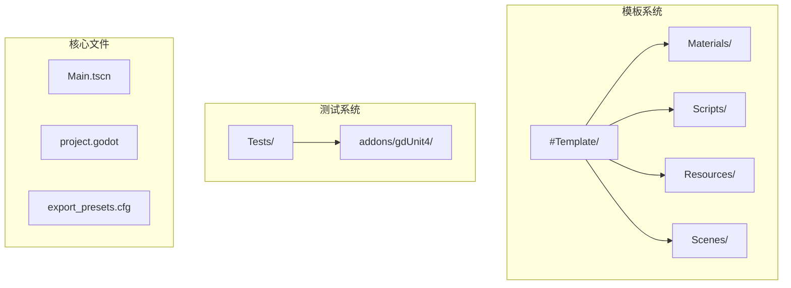
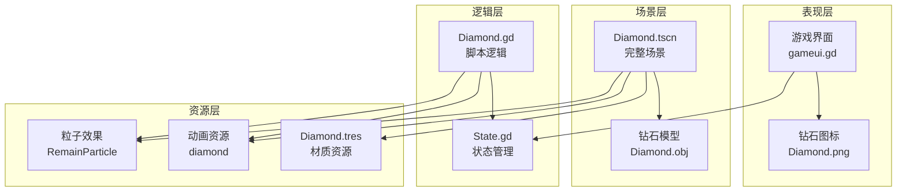
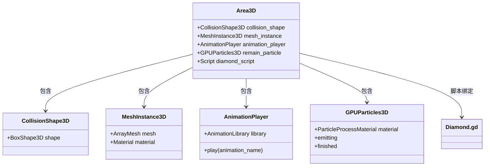
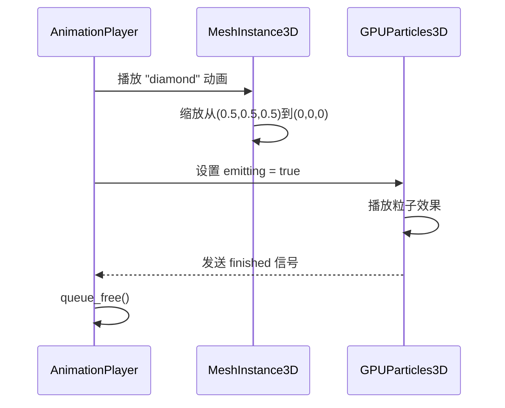
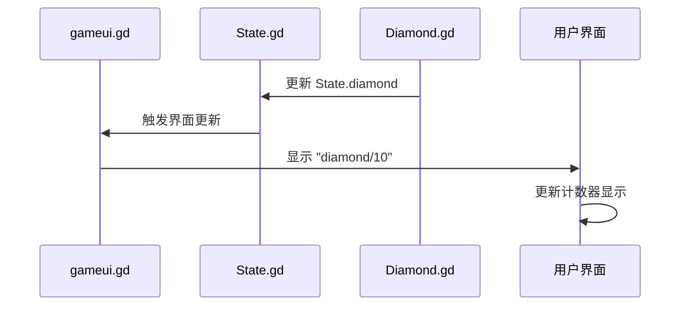
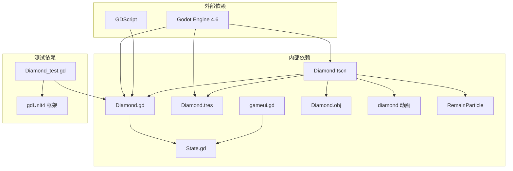

# 钻石材质

<cite>
**本文引用的文件**
- [Diamond.tscn](file://#Template/Diamond.tscn)
- [Diamond.tres](file://#Template/[Materials]/Diamond.tres)
- [Diamond.gd](file://#Template/[Scripts]/Trigger/Diamond.gd)
- [Diamond_test.gd](file://Tests/Diamond_test.gd)
- [Diamond.obj.import](file://#Template/[Resources]/Models/Diamond.obj.import)
- [Diamond.png.import](file://#Template/[Resources]/ui/Diamond.png.import)
- [State.gd](file://#Template/[Scripts]/State.gd)
- [gameui.gd](file://#Template/[Scripts]/gameui.gd)
- [README.md](file://README.md)
</cite>

## 目录
1. [简介](#简介)
2. [项目结构](#项目结构)
3. [核心组件](#核心组件)
4. [架构概览](#架构概览)
5. [详细组件分析](#详细组件分析)
6. [依赖关系分析](#依赖关系分析)
7. [性能考虑](#性能考虑)
8. [故障排除指南](#故障排除指南)
9. [结论](#结论)

## 简介

钻石材质是基于 Godot Engine 4.6 开发的 Dancing Line 游戏模板中的一个关键元素。该项目是一个完整的线条游戏框架，提供了高兼容性和模块化设计，支持跨平台运行。钻石材质作为游戏中重要的收集物品，具有独特的视觉效果和交互功能。

本项目的核心特性包括：
- Dancing Line 核心玩法的完整实现
- 与冰焰模板 3/4 的高兼容性
- 内置的完整游戏框架和模板系统
- 集成的 gdUnit4 测试框架
- 模块化设计，易于扩展和定制
- 支持 Windows、Linux、macOS 平台

## 项目结构

项目采用模板化的组织结构，将核心功能模块化管理：



**图表来源**
- [README.md:53-65](file://README.md#L53-L65)

**章节来源**
- [README.md:53-65](file://README.md#L53-L65)

## 核心组件

钻石材质系统由多个相互协作的组件构成，每个组件都有特定的功能和职责：

### 材质系统
- **Diamond.tres**: 标准材质资源，定义钻石的视觉外观
- **Diamond.png.import**: UI 图标纹理资源
- **Diamond.obj.import**: 3D 模型导入配置

### 场景系统
- **Diamond.tscn**: 完整的钻石场景，包含物理碰撞、动画和粒子效果
- **Diamond.gd**: 钻石的脚本逻辑，处理收集交互和动画播放

### 状态管理系统
- **State.gd**: 全局状态管理，跟踪钻石收集数量
- **gameui.gd**: 游戏界面显示，实时更新钻石计数

**章节来源**
- [Diamond.tscn:1-127](file://#Template/Diamond.tscn#L1-L127)
- [Diamond.tres:1-5](file://#Template/[Materials]/Diamond.tres#L1-L5)
- [Diamond.gd:1-15](file://#Template/[Scripts]/Trigger/Diamond.gd#L1-L15)

## 架构概览

钻石材质系统的整体架构采用了分层设计，确保了良好的模块化和可维护性：



**图表来源**
- [Diamond.tscn:100-127](file://#Template/Diamond.tscn#L100-L127)
- [Diamond.gd:6-11](file://#Template/[Scripts]/Trigger/Diamond.gd#L6-L11)
- [State.gd:20](file://#Template/[Scripts]/State.gd#L20)

## 详细组件分析

### 钻石场景组件 (Diamond.tscn)

钻石场景是整个钻石材质系统的核心容器，包含了所有必要的节点和资源：

#### 场景节点结构



**图表来源**
- [Diamond.tscn:100-127](file://#Template/Diamond.tscn#L100-L127)

#### 动画系统

钻石场景实现了复杂的动画效果，包括缩放动画和旋转效果：



**图表来源**
- [Diamond.tscn:24-44](file://#Template/Diamond.tscn#L24-L44)
- [Diamond.tscn:113-124](file://#Template/Diamond.tscn#L113-L124)

**章节来源**
- [Diamond.tscn:1-127](file://#Template/Diamond.tscn#L1-L127)

### 钻石材质资源 (Diamond.tres)

钻石材质定义了钻石的视觉外观特征：

#### 材质属性配置

| 属性名称 | 值 | 说明 |
|---------|-----|------|
| albedo_color | Color(0, 1, 1, 1) | 青蓝色调的镜面反射材质 |
| metalness | 默认 | 金属质感 |
| roughness | 默认 | 粗糙度设置 |

材质采用青蓝色调，具有明显的镜面反射效果，为钻石提供了逼真的光学特性。

**章节来源**
- [Diamond.tres:1-5](file://#Template/[Materials]/Diamond.tres#L1-L5)

### 钻石脚本逻辑 (Diamond.gd)

钻石脚本实现了核心的游戏逻辑，包括收集检测、动画播放和状态更新：

#### 收集流程

```mermaid
flowchart TD
Start([玩家进入碰撞范围]) --> CheckBody{检查碰撞体}
CheckBody --> |有效| IncreaseCount[State.diamond += 1]
CheckBody --> |无效| End([结束])
IncreaseCount --> PlayAnim[播放 "diamond" 动画]
PlayAnim --> StartParticle[启动 RemainParticle]
StartParticle --> WaitParticle[等待粒子效果完成]
WaitParticle --> FreeNode[释放节点]
FreeNode --> End
```

**图表来源**
- [Diamond.gd:6-11](file://#Template/[Scripts]/Trigger/Diamond.gd#L6-L11)

#### 旋转机制

钻石实现了持续的旋转效果，通过速度参数控制旋转速率：

```mermaid
classDiagram
class Diamond {
+float speed
+rotate_y(delta * speed)
+_process(delta)
}
note for Diamond : "仅在运行时生效<br/>编辑器模式下禁用旋转"
```

**图表来源**
- [Diamond.gd:12-14](file://#Template/[Scripts]/Trigger/Diamond.gd#L12-L14)

**章节来源**
- [Diamond.gd:1-15](file://#Template/[Scripts]/Trigger/Diamond.gd#L1-L15)

### 状态管理系统

全局状态管理负责跟踪钻石收集进度和其他游戏状态：

#### 状态变量

| 变量名 | 类型 | 默认值 | 说明 |
|--------|------|--------|------|
| diamond | int | 0 | 已收集的钻石数量 |
| crown | int | 0 | 王冠收集数量 |
| is_end | bool | false | 关卡是否结束 |
| percent | int | 0 | 完成百分比 |

**章节来源**
- [State.gd:1-21](file://#Template/[Scripts]/State.gd#L1-L21)

### 用户界面集成

游戏界面实时显示钻石收集状态：

#### 界面更新流程



**图表来源**
- [gameui.gd:21](file://#Template/[Scripts]/gameui.gd#L21)

**章节来源**
- [gameui.gd:1-73](file://#Template/[Scripts]/gameui.gd#L1-L73)

## 依赖关系分析

钻石材质系统各组件之间的依赖关系体现了清晰的分层架构：



**图表来源**
- [Diamond.tscn:3-5](file://#Template/Diamond.tscn#L3-L5)
- [Diamond.gd:1](file://#Template/[Scripts]/Trigger/Diamond.gd#L1)

**章节来源**
- [Diamond.tscn:1-127](file://#Template/Diamond.tscn#L1-L127)
- [Diamond.gd:1-15](file://#Template/[Scripts]/Trigger/Diamond.gd#L1-L15)

## 性能考虑

钻石材质系统在设计时充分考虑了性能优化：

### 渲染优化
- 使用 GPU 粒子系统进行高效的粒子渲染
- 优化的 3D 模型网格数据
- 材质资源的合理配置

### 内存管理
- 自动释放机制确保内存及时回收
- 粒子效果的生命周期管理
- 场景节点的智能销毁

### 运行时优化
- 编辑器模式下的功能禁用
- 条件执行的性能路径
- 资源的延迟加载策略

## 故障排除指南

### 常见问题及解决方案

#### 钻石无法被收集
1. **检查碰撞形状**: 确保 BoxShape3D 正确配置
2. **验证脚本连接**: 确认 body_entered 信号正确连接
3. **检查状态更新**: 验证 State.diamond 是否递增

#### 动画不播放
1. **验证动画资源**: 检查 AnimationLibrary 中的 "diamond" 动画
2. **确认节点路径**: 确保 AnimationPlayer 节点路径正确
3. **检查材质覆盖**: 验证 surface_material_override 设置

#### 粒子效果异常
1. **检查粒子材质**: 验证 ParticleProcessMaterial 配置
2. **确认发射状态**: 确保 emitting 参数正确设置
3. **验证生命周期**: 检查 lifetime 和 amount 参数

**章节来源**
- [Diamond_test.gd:1-167](file://Tests/Diamond_test.gd#L1-L167)

## 结论

钻石材质系统展现了良好的软件工程实践，通过模块化设计实现了高度的可维护性和扩展性。系统的关键优势包括：

1. **清晰的架构分离**: 表现层、逻辑层和资源层的明确分工
2. **完善的测试覆盖**: 使用 gdUnit4 框架确保代码质量
3. **高效的性能设计**: 优化的渲染和内存管理策略
4. **灵活的配置选项**: 支持自定义速度和视觉效果

该系统为 Dancing Line 游戏模板提供了坚实的基础设施，为后续的功能扩展和内容创作奠定了良好的基础。通过合理的依赖管理和错误处理机制，确保了系统的稳定性和可靠性。