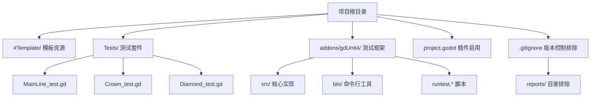
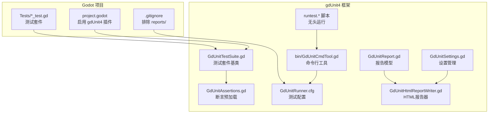
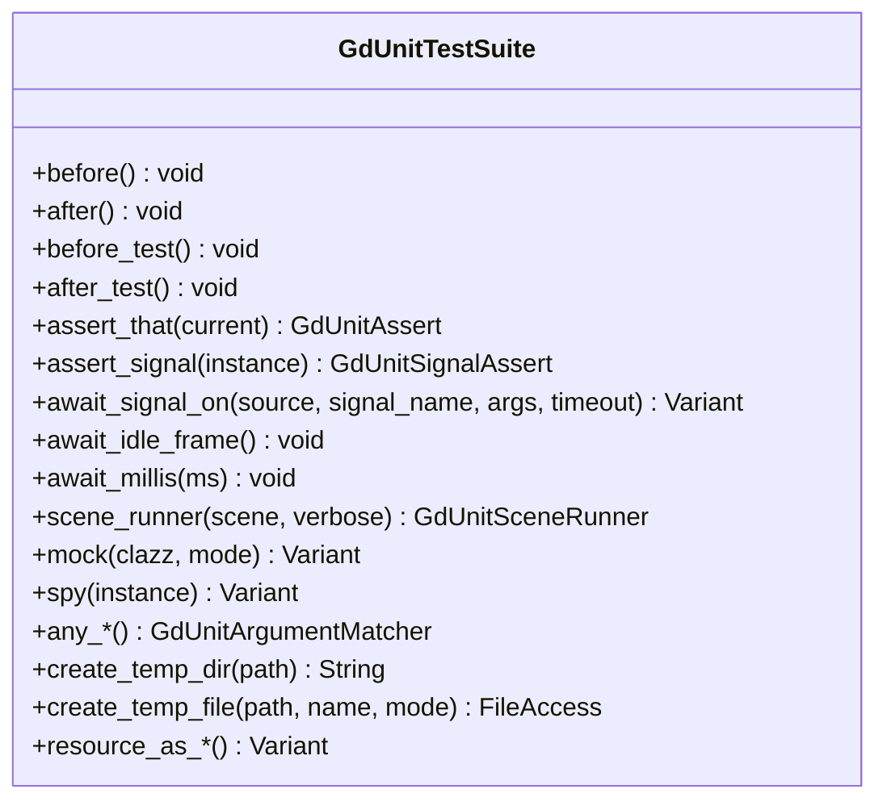
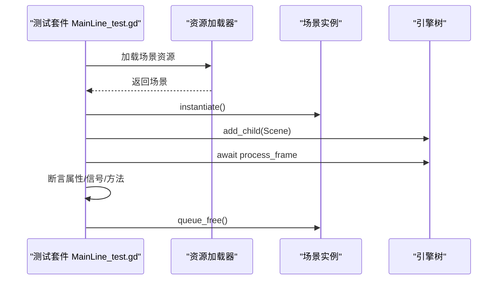
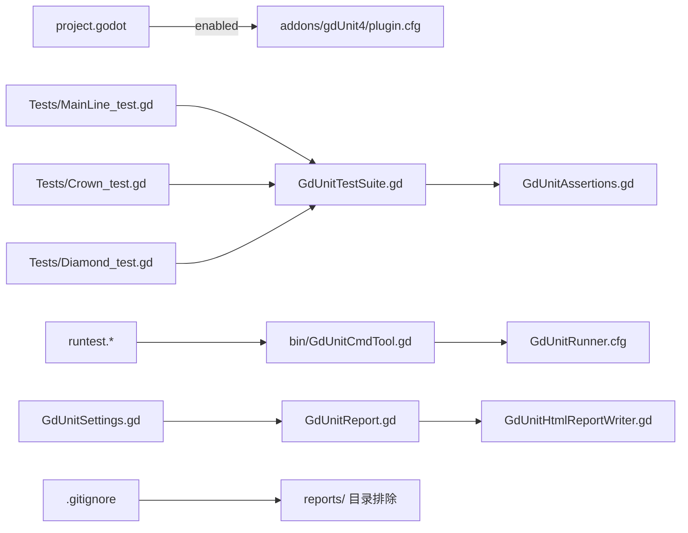

# 测试框架

<cite>
**本文引用的文件**   
- [README.md](file://README.md)
- [CONTRIBUTING.md](file://CONTRIBUTING.md)
- [project.godot](file://project.godot)
- [plugin.cfg](file://addons/gdUnit4/plugin.cfg)
- [GdUnitRunner.cfg](file://addons/gdUnit4/GdUnitRunner.cfg)
- [.gitignore](file://.gitignore)
- [runtest.cmd](file://addons/gdUnit4/runtest.cmd)
- [runtest.sh](file://addons/gdUnit4/runtest.sh)
- [GdUnitTestSuite.gd](file://addons/gdUnit4/src/GdUnitTestSuite.gd)
- [GdUnitAssertions.gd](file://addons/gdUnit4/src/asserts/GdUnitAssertions.gd)
- [MainLine_test.gd](file://Tests/MainLine_test.gd)
- [Crown_test.gd](file://Tests/Crown_test.gd)
- [Diamond_test.gd](file://Tests/Diamond_test.gd)
- [GdUnitConstants.gd](file://addons/gdUnit4/src/GdUnitConstants.gd)
- [GdUnitSettings.gd](file://addons/gdUnit4/src/core/GdUnitSettings.gd)
- [GdUnitReport.gd](file://addons/gdUnit4/src/core/report/GdUnitReport.gd)
- [GdUnitReportSummary.gd](file://addons/gdUnit4/src/reporters/GdUnitReportSummary.gd)
- [GdUnitTestReporter.gd](file://addons/gdUnit4/src/reporters/GdUnitTestReporter.gd)
- [GdUnitHtmlReportWriter.gd](file://addons/gdUnit4/src/reporters/html/GdUnitHtmlReportWriter.gd)
- [GdUnitByPathReport.gd](file://addons/gdUnit4/src/reporters/html/GdUnitByPathReport.gd)
- [GdUnitHtmlPatterns.gd](file://addons/gdUnit4/src/reporters/html/GdUnitHtmlPatterns.gd)
- [GdUnitCopyLog.gd](file://addons/gdUnit4/bin/GdUnitCopyLog.gd)
</cite>

## 更新摘要
**所做更改**   
- 更新报告系统配置，移除 report_1 目录相关配置
- 更新 .gitignore 文件，添加 reports/ 目录排除规则
- 优化测试报告生成与存储机制
- 完善报告历史管理与清理策略

## 目录
1. [简介](#简介)
2. [项目结构](#项目结构)
3. [核心组件](#核心组件)
4. [架构总览](#架构总览)
5. [详细组件分析](#详细组件分析)
6. [依赖关系分析](#依赖关系分析)
7. [性能考量](#性能考量)
8. [故障排查指南](#故障排查指南)
9. [结论](#结论)
10. [附录](#附录)

## 简介
本项目基于 Godot 4.6，采用 gdUnit4 测试框架进行测试驱动开发，覆盖单元测试与集成测试，保障核心逻辑（如 MainLine、Crown、Diamond 等）的正确性与稳定性。测试文件统一放置于 Tests 目录，命名规范为"*_test.gd"，继承自 GdUnitTestSuite，断言与工具由 gdUnit4 提供。项目还提供了命令行测试运行脚本与编辑器内运行入口，并支持生成 HTML/XML 报告。最新更新移除了旧的 report_1 报告系统，采用新的报告管理机制。

## 项目结构
- 核心模板与资源位于 #Template/，包含场景、脚本、材质等。
- 测试文件位于 Tests/，使用 gdUnit4 断言与生命周期钩子。
- 测试框架位于 addons/gdUnit4/，包含插件配置、断言实现、执行器、报告器等。
- 项目配置文件 project.godot 已启用 gdUnit4 插件。
- .gitignore 文件已更新，排除 reports/ 目录以避免版本控制污染。
- README.md 与 CONTRIBUTING.md 提供测试运行、命名规范与最佳实践说明。

**图示来源**
- [project.godot:40](file://project.godot#L40)
- [.gitignore:4-5](file://.gitignore#L4-L5)
- [README.md:53-65](file://README.md#L53-L65)

**章节来源**
- [README.md:53-65](file://README.md#L53-L65)
- [project.godot:40](file://project.godot#L40)
- [.gitignore:4-5](file://.gitignore#L4-L5)

## 核心组件
- 测试框架插件：通过 plugin.cfg 注册，版本与描述见插件配置。
- 测试套件基类：GdUnitTestSuite 提供断言、等待、场景运行器、Mock/Spy、参数匹配器等能力。
- 断言预加载：GdUnitAssertions 在初始化时预加载全部断言类型，提升加载性能。
- 测试运行配置：GdUnitRunner.cfg 记录测试发现结果与元数据。
- 命令行运行：runtest.cmd/runtest.sh 封装无头模式运行与日志复制。
- 报告系统：采用新的报告管理机制，支持 HTML 报告生成与历史记录管理。
- 版本控制排除：.gitignore 文件排除 reports/ 目录，避免测试报告污染版本库。

**章节来源**
- [plugin.cfg:1-8](file://addons/gdUnit4/plugin.cfg#L1-L8)
- [GdUnitTestSuite.gd:1-747](file://addons/gdUnit4/src/GdUnitTestSuite.gd#L1-L747)
- [GdUnitAssertions.gd:1-69](file://addons/gdUnit4/src/asserts/GdUnitAssertions.gd#L1-L69)
- [GdUnitRunner.cfg:1-97](file://addons/gdUnit4/GdUnitRunner.cfg#L1-L97)
- [runtest.cmd:1-63](file://addons/gdUnit4/runtest.cmd#L1-L63)
- [runtest.sh:1-63](file://addons/gdUnit4/runtest.sh#L1-L63)
- [.gitignore:4-5](file://.gitignore#L4-L5)

## 架构总览
gdUnit4 在 Godot 项目中的角色是"测试框架 + 执行器 + 报告器"的组合。测试套件通过继承 GdUnitTestSuite 实现，断言与工具由框架提供；命令行脚本通过 --headless --run-tests 或加载 GdUnitCmdTool.gd 触发测试执行；报告器生成 HTML/XML 报告并输出到 reports/ 目录。新版本移除了旧的 report_1 系统，采用更高效的报告管理机制。

**图示来源**
- [project.godot:40](file://project.godot#L40)
- [GdUnitTestSuite.gd:1-747](file://addons/gdUnit4/src/GdUnitTestSuite.gd#L1-L747)
- [GdUnitAssertions.gd:1-69](file://addons/gdUnit4/src/asserts/GdUnitAssertions.gd#L1-L69)
- [GdUnitRunner.cfg:1-97](file://addons/gdUnit4/GdUnitRunner.cfg#L1-L97)
- [runtest.cmd:54-55](file://addons/gdUnit4/runtest.cmd#L54-L55)
- [runtest.sh:54-55](file://addons/gdUnit4/runtest.sh#L54-L55)
- [.gitignore:4-5](file://.gitignore#L4-L5)
- [GdUnitSettings.gd:118-122](file://addons/gdUnit4/src/core/GdUnitSettings.gd#L118-L122)
- [GdUnitReport.gd:1-84](file://addons/gdUnit4/src/core/report/GdUnitReport.gd#L1-L84)
- [GdUnitHtmlReportWriter.gd](file://addons/gdUnit4/src/reporters/html/GdUnitHtmlReportWriter.gd)

## 详细组件分析

### 测试套件基类：GdUnitTestSuite
- 生命周期钩子：before()/after()、before_test()/after_test()，用于全局与单测级的准备与清理。
- 断言工具：assert_that(...) 自动分派到布尔/整数/浮点/字符串/向量/数组/字典/对象/File/Result/信号/函数等断言实现。
- 等待与信号：await_signal_on、await_idle_frame、await_millis；monitor_signals 辅助信号收集。
- 场景运行器：scene_runner(...) 用于模拟场景交互与管理生命周期。
- Mock/Spy：mock/spy/do_return/verify/reset 等，支持行为验证与桩函数返回值控制。
- 参数匹配器：any_* 系列与 any_class，用于灵活匹配参数。
- 文件与临时目录：create_temp_dir/create_temp_file/resource_as_* 等辅助测试数据管理。

**图示来源**
- [GdUnitTestSuite.gd:61-80](file://addons/gdUnit4/src/GdUnitTestSuite.gd#L61-L80)
- [GdUnitTestSuite.gd:582-708](file://addons/gdUnit4/src/GdUnitTestSuite.gd#L582-L708)
- [GdUnitTestSuite.gd:168-188](file://addons/gdUnit4/src/GdUnitTestSuite.gd#L168-L188)
- [GdUnitTestSuite.gd:241-242](file://addons/gdUnit4/src/GdUnitTestSuite.gd#L241-L242)
- [GdUnitTestSuite.gd:257-321](file://addons/gdUnit4/src/GdUnitTestSuite.gd#L257-L321)
- [GdUnitTestSuite.gd:325-539](file://addons/gdUnit4/src/GdUnitTestSuite.gd#L325-L539)
- [GdUnitTestSuite.gd:125-142](file://addons/gdUnit4/src/GdUnitTestSuite.gd#L125-L142)
- [GdUnitTestSuite.gd:146-161](file://addons/gdUnit4/src/GdUnitTestSuite.gd#L146-L161)

**章节来源**
- [GdUnitTestSuite.gd:1-747](file://addons/gdUnit4/src/GdUnitTestSuite.gd#L1-L747)

### 断言预加载：GdUnitAssertions
- 初始化时预加载所有断言实现，避免重复解析，显著提升测试套件加载速度。
- 提供 get_line_number 辅助定位断言错误行号，跳过内部辅助断言栈帧。

**章节来源**
- [GdUnitAssertions.gd:1-69](file://addons/gdUnit4/src/asserts/GdUnitAssertions.gd#L1-L69)

### 测试运行配置：GdUnitRunner.cfg
- 记录测试用例清单、显示名称、源文件路径、套件名称、测试名称、GUID 等元数据。
- 支持退出策略（fail-fast）、服务器端口等配置项。

**章节来源**
- [GdUnitRunner.cfg:1-97](file://addons/gdUnit4/GdUnitRunner.cfg#L1-L97)

### 命令行运行：runtest.cmd / runtest.sh
- 解析 --godot_binary 或环境变量 GODOT_BIN，校验二进制存在性与可执行权限。
- 若检测到 Mono 构建，先编译 C# 组件。
- 以 --path . -s -d 方式调用 GdUnitCmdTool.gd 执行测试；随后复制日志到 reports/。

**章节来源**
- [runtest.cmd:1-63](file://addons/gdUnit4/runtest.cmd#L1-L63)
- [runtest.sh:1-63](file://addons/gdUnit4/runtest.sh#L1-L63)

### 报告系统配置：GdUnitSettings 与 GdUnitConstants
- 报告设置管理：GdUnitSettings.gd 提供详细的报告配置选项，包括错误报告、孤儿节点检测、断言警告等。
- 报告常量定义：GdUnitConstants.gd 定义报告历史数量限制（DEFAULT_REPORT_HISTORY_COUNT = 20）和报告目录前缀。
- 报告模型：GdUnitReport.gd 定义报告类型枚举（SUCCESS、FAILURE、ERROR、ORPHAN 等）和报告数据结构。

**章节来源**
- [GdUnitSettings.gd:118-122](file://addons/gdUnit4/src/core/GdUnitSettings.gd#L118-L122)
- [GdUnitConstants.gd:8-10](file://addons/gdUnit4/src/GdUnitConstants.gd#L8-L10)
- [GdUnitReport.gd:4-14](file://addons/gdUnit4/src/core/report/GdUnitReport.gd#L4-L14)

### HTML 报告生成：GdUnitHtmlReportWriter 与 GdUnitByPathReport
- HTML 报告器：GdUnitHtmlReportWriter.gd 负责生成 HTML 格式的测试报告，包含统计信息和详细结果。
- 路径报告：GdUnitByPathReport.gd 支持按路径分组的报告生成，便于组织和查看测试结果。
- 报告模式：GdUnitHtmlPatterns.gd 提供 HTML 模板和样式，支持多种报告视图模式。

**章节来源**
- [GdUnitHtmlReportWriter.gd](file://addons/gdUnit4/src/reporters/html/GdUnitHtmlReportWriter.gd)
- [GdUnitByPathReport.gd:1-33](file://addons/gdUnit4/src/reporters/html/GdUnitByPathReport.gd#L1-L33)
- [GdUnitHtmlPatterns.gd:66-147](file://addons/gdUnit4/src/reporters/html/GdUnitHtmlPatterns.gd#L66-L147)

### 日志复制与报告管理：GdUnitCopyLog
- 日志复制：GdUnitCopyLog.gd 负责将测试日志复制到报告目录，生成可浏览的 HTML 报告。
- 报告索引：自动更新报告索引文件，包含日志文件路径和链接信息。
- 命令行参数：支持调试模式下的命令行参数处理。

**章节来源**
- [GdUnitCopyLog.gd:134-167](file://addons/gdUnit4/bin/GdUnitCopyLog.gd#L134-L167)

### 版本控制排除：.gitignore
- 目录排除：.gitignore 文件明确排除 reports/ 目录，避免测试报告文件进入版本控制。
- 隐藏目录：排除 .godot/ 目录，保持项目根目录整洁。
- 开发工具：排除 .vscode/ 目录，避免 IDE 配置文件污染版本库。

**章节来源**
- [.gitignore:1-7](file://.gitignore#L1-L7)

### 测试用例示例：MainLine_test.gd
- 覆盖 MainLine 场景与脚本的存在性校验。
- 验证继承关系（CharacterBody3D）、属性（speed/rot/color/fly/noclip/is_turn/is_live/timeout）读写与默认值。
- 验证信号存在性与方法存在性（turn/reload/die）。
- 使用 await get_tree().process_frame 等待一帧以确保属性初始化完成。

**图示来源**
- [MainLine_test.gd:10-28](file://Tests/MainLine_test.gd#L10-L28)
- [MainLine_test.gd:32-44](file://Tests/MainLine_test.gd#L32-L44)
- [MainLine_test.gd:141-151](file://Tests/MainLine_test.gd#L141-L151)
- [MainLine_test.gd:213-223](file://Tests/MainLine_test.gd#L213-L223)

**章节来源**
- [MainLine_test.gd:1-250](file://Tests/MainLine_test.gd#L1-L250)

### 测试用例示例：Crown_test.gd
- 验证 Crown 脚本与场景存在性。
- 验证继承关系（Area3D），属性（speed/tag）默认值与 setter 行为。
- 验证状态共享（State.crown、line_crossing_crown）与相机跟随获取方法存在性。
- 多个 Crown 实例的标签区分。

**章节来源**
- [Crown_test.gd:1-178](file://Tests/Crown_test.gd#L1-L178)

### 测试用例示例：Diamond_test.gd
- 验证 Diamond 脚本与场景存在性。
- 验证继承关系（Area3D），color/speed 默认值与 setter 行为。
- 验证状态共享（State.diamond）与颜色变化触发网格更新的方法存在性。
- 多次收集钻石计数验证。

**章节来源**
- [Diamond_test.gd:1-167](file://Tests/Diamond_test.gd#L1-L167)

## 依赖关系分析
- 项目对 gdUnit4 插件的依赖通过 project.godot 的 editor_plugins.enabled 字段声明。
- 测试套件通过继承 GdUnitTestSuite 使用框架提供的断言与工具。
- 命令行脚本依赖 Godot 二进制与 GdUnitCmdTool.gd；Mono 构建时依赖 dotnet CLI。
- 测试运行配置由 GdUnitRunner.cfg 维护，供执行器读取。
- 报告系统依赖 GdUnitSettings.gd 进行配置管理，GdUnitReport.gd 定义报告数据结构。
- 版本控制排除通过 .gitignore 文件管理，避免 reports/ 目录进入版本控制。

**图示来源**
- [project.godot:40](file://project.godot#L40)
- [plugin.cfg:1-8](file://addons/gdUnit4/plugin.cfg#L1-L8)
- [GdUnitTestSuite.gd:1-747](file://addons/gdUnit4/src/GdUnitTestSuite.gd#L1-L747)
- [GdUnitAssertions.gd:1-69](file://addons/gdUnit4/src/asserts/GdUnitAssertions.gd#L1-L69)
- [GdUnitRunner.cfg:1-97](file://addons/gdUnit4/GdUnitRunner.cfg#L1-L97)
- [runtest.cmd:54-55](file://addons/gdUnit4/runtest.cmd#L54-L55)
- [runtest.sh:54-55](file://addons/gdUnit4/runtest.sh#L54-L55)
- [GdUnitSettings.gd:118-122](file://addons/gdUnit4/src/core/GdUnitSettings.gd#L118-L122)
- [GdUnitReport.gd:1-84](file://addons/gdUnit4/src/core/report/GdUnitReport.gd#L1-L84)
- [GdUnitHtmlReportWriter.gd](file://addons/gdUnit4/src/reporters/html/GdUnitHtmlReportWriter.gd)
- [.gitignore:4-5](file://.gitignore#L4-L5)

**章节来源**
- [project.godot:40](file://project.godot#L40)
- [runtest.cmd:1-63](file://addons/gdUnit4/runtest.cmd#L1-L63)
- [runtest.sh:1-63](file://addons/gdUnit4/runtest.sh#L1-L63)

## 性能考量
- 断言预加载：GdUnitAssertions 在初始化阶段预加载所有断言实现，减少重复解析，提升测试套件加载速度。
- 懒加载工具：GdUnitTestSuite 内部通过 __lazy_load 机制按需加载断言与工具脚本，进一步优化启动时间。
- 等待与超时：使用 await_signal_on/await_idle_frame/await_millis 替代引擎计时器，避免超时中断导致的错误误报。
- 临时目录与资源读取：利用 create_temp_dir/create_temp_file 与 resource_as_* 读取测试资源，自动清理临时数据。
- 报告历史管理：GdUnitConstants.gd 中的 DEFAULT_REPORT_HISTORY_COUNT = 20 限制报告文件数量，避免磁盘空间过度占用。
- 版本控制优化：.gitignore 排除 reports/ 目录，减少版本库大小和 Git 操作开销。

**章节来源**
- [GdUnitAssertions.gd:7-36](file://addons/gdUnit4/src/asserts/GdUnitAssertions.gd#L7-L36)
- [GdUnitTestSuite.gd:31-52](file://addons/gdUnit4/src/GdUnitTestSuite.gd#L31-L52)
- [GdUnitTestSuite.gd:168-188](file://addons/gdUnit4/src/GdUnitTestSuite.gd#L168-L188)
- [GdUnitTestSuite.gd:125-142](file://addons/gdUnit4/src/GdUnitTestSuite.gd#L125-L142)
- [GdUnitTestSuite.gd:146-161](file://addons/gdUnit4/src/GdUnitTestSuite.gd#L146-L161)
- [GdUnitConstants.gd:8-10](file://addons/gdUnit4/src/GdUnitConstants.gd#L8-L10)
- [.gitignore:4-5](file://.gitignore#L4-L5)

## 故障排查指南
- 插件未启用：确认 project.godot 的 editor_plugins.enabled 包含 gdUnit4。
- 测试无法发现：检查 Tests/ 下文件是否符合"*_test.gd"命名规范，且继承自 GdUnitTestSuite。
- 断言行号不准确：GdUnitAssertions 的 get_line_number 会跳过内部断言栈帧，定位到实际测试行。
- 超时中断误报：使用 discard_error_interupted_by_timeout 显式将被超时打断的错误视为成功。
- 孤儿节点检测：在测试结束时调用 collect_orphan_node_details 获取未释放节点的调试信息。
- 命令行运行失败：runtest.* 会校验 GODOT_BIN 或 --godot_binary，确保二进制存在且可执行；Mono 构建需安装 dotnet CLI。
- 报告生成问题：检查 reports/ 目录权限和磁盘空间，确认 GdUnitSettings.gd 中的报告配置正确。
- 版本控制冲突：确认 .gitignore 正确排除 reports/ 目录，避免测试报告文件进入版本控制。

**章节来源**
- [project.godot:40](file://project.godot#L40)
- [GdUnitAssertions.gd:43-68](file://addons/gdUnit4/src/asserts/GdUnitAssertions.gd#L43-L68)
- [GdUnitTestSuite.gd:117-119](file://addons/gdUnit4/src/GdUnitTestSuite.gd#L117-L119)
- [GdUnitTestSuite.gd:226-227](file://addons/gdUnit4/src/GdUnitTestSuite.gd#L226-L227)
- [runtest.cmd:24-42](file://addons/gdUnit4/runtest.cmd#L24-L42)
- [runtest.sh:20-43](file://addons/gdUnit4/runtest.sh#L20-L43)
- [GdUnitSettings.gd:118-122](file://addons/gdUnit4/src/core/GdUnitSettings.gd#L118-L122)
- [.gitignore:4-5](file://.gitignore#L4-L5)

## 结论
本项目通过 gdUnit4 实现了完善的测试体系：清晰的命名规范、统一的测试套件基类、丰富的断言与工具、可靠的命令行运行脚本与报告生成。最新更新移除了旧的 report_1 报告系统，采用新的报告管理机制，通过 .gitignore 排除 reports/ 目录，优化了版本控制和磁盘空间使用。结合生命周期钩子与等待机制，能够稳定验证核心逻辑与场景交互。建议在新增功能时同步补充单元与集成测试，并遵循项目贡献指南中的测试要求与最佳实践。

## 附录

### 测试文件命名规范与组织结构
- 命名规范：Tests/ 目录下的测试文件必须以"*_test.gd"结尾。
- 组织结构：按功能模块划分（如 MainLine、Crown、Diamond），每个模块对应一个测试套件文件。
- 继承基类：所有测试文件需继承 GdUnitTestSuite。

**章节来源**
- [README.md:83-86](file://README.md#L83-L86)
- [CONTRIBUTING.md:48-49](file://CONTRIBUTING.md#L48-L49)

### 测试报告生成与分析
- 报告输出：通过 runtest.* 脚本执行后，报告器会生成 HTML/XML 报告并输出到 reports/ 目录。
- 报告内容：包含测试套件、用例、断言结果、失败详情与元数据（如 GUID、源文件路径）。
- 报告历史：支持最多 20 个报告文件的历史记录管理，超出数量会自动清理。
- 报告格式：支持 HTML 和 XML 格式，便于集成到 CI/CD 流程中。

**章节来源**
- [README.md:67-87](file://README.md#L67-L87)
- [GdUnitRunner.cfg:1-97](file://addons/gdUnit4/GdUnitRunner.cfg#L1-L97)
- [GdUnitConstants.gd:8-10](file://addons/gdUnit4/src/GdUnitConstants.gd#L8-L10)
- [GdUnitSettings.gd:118-122](file://addons/gdUnit4/src/core/GdUnitSettings.gd#L118-L122)

### 自动化测试与持续集成
- 无头模式运行：使用 godot --headless --run-tests 或 runtest.* 脚本。
- 编辑器内运行：在 Godot 编辑器底部面板打开 gdUnit4 标签页运行测试。
- CI 集成建议：在 CI 环境中设置 GODOT_BIN 环境变量，调用 runtest.* 脚本执行测试并收集 reports/ 输出。
- 版本控制：.gitignore 已配置排除 reports/ 目录，确保测试报告不会污染版本库。

**章节来源**
- [README.md:71-79](file://README.md#L71-L79)
- [runtest.cmd:24-36](file://addons/gdUnit4/runtest.cmd#L24-L36)
- [runtest.sh:20-32](file://addons/gdUnit4/runtest.sh#L20-L32)
- [.gitignore:4-5](file://.gitignore#L4-L5)

### 报告系统配置优化
- 报告设置：通过 GdUnitSettings.gd 配置报告行为，包括错误报告、孤儿节点检测、断言警告等。
- 历史管理：GdUnitConstants.gd 定义报告历史数量限制，防止磁盘空间过度占用。
- 目录排除：.gitignore 明确排除 reports/ 目录，优化版本控制性能。
- 日志管理：GdUnitCopyLog.gd 自动处理日志复制和报告索引更新。

**章节来源**
- [GdUnitSettings.gd:118-122](file://addons/gdUnit4/src/core/GdUnitSettings.gd#L118-L122)
- [GdUnitConstants.gd:8-10](file://addons/gdUnit4/src/GdUnitConstants.gd#L8-L10)
- [.gitignore:4-5](file://.gitignore#L4-L5)
- [GdUnitCopyLog.gd:134-167](file://addons/gdUnit4/bin/GdUnitCopyLog.gd#L134-L167)