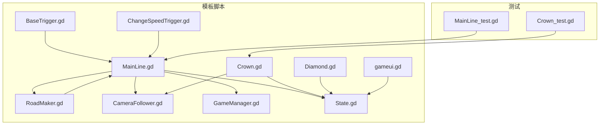
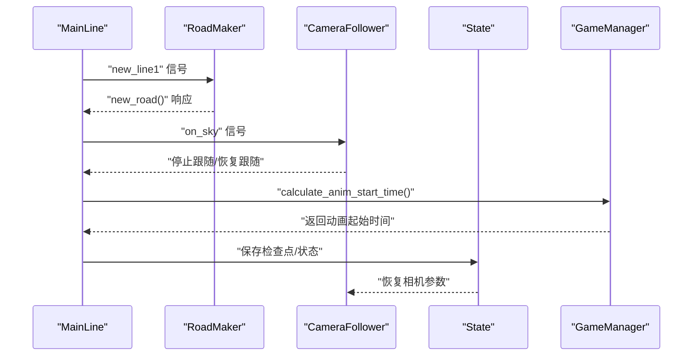
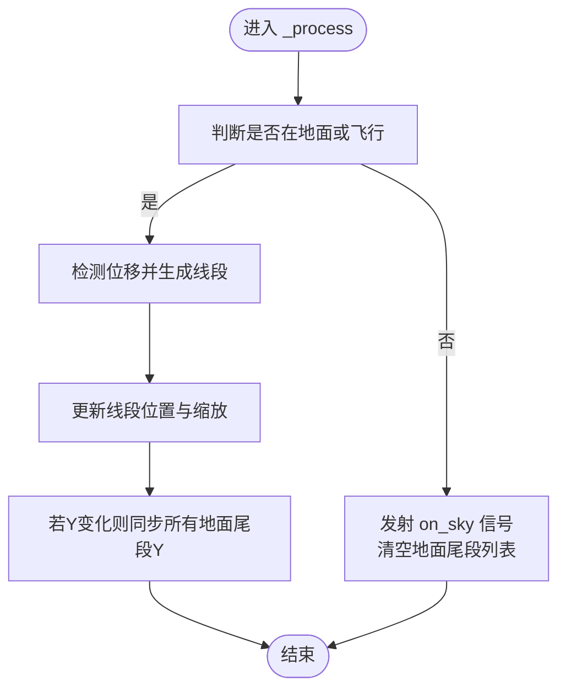
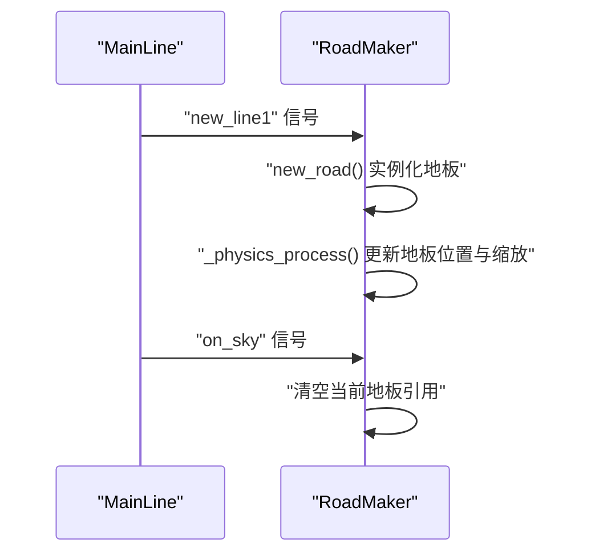
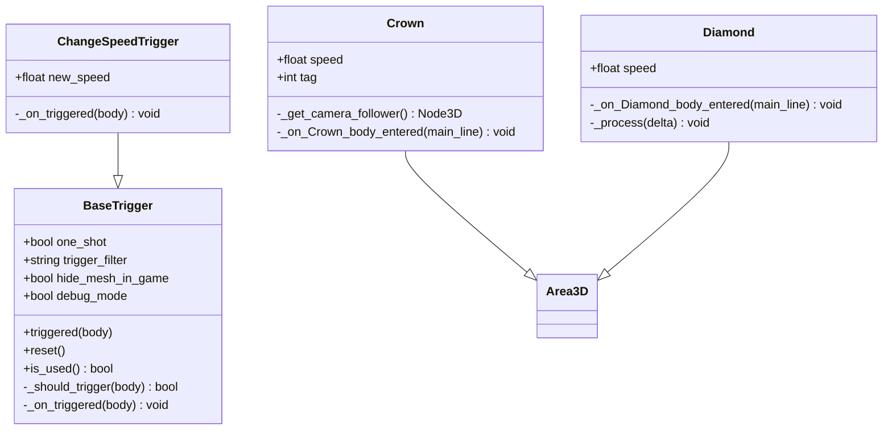
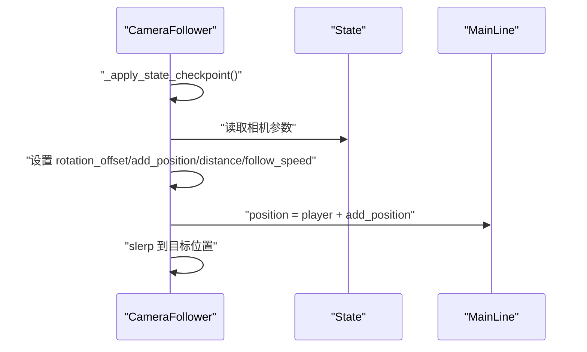
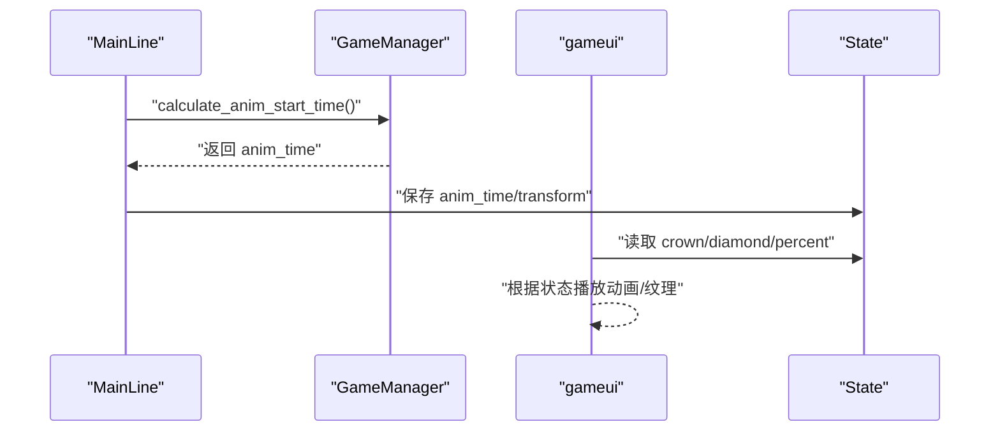
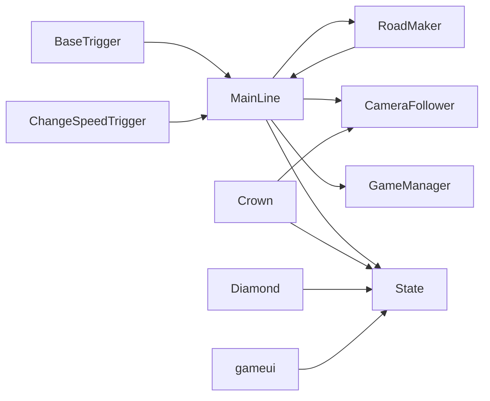

# 游戏系统

<cite>
**本文引用的文件**
- [MainLine.gd](file://#Template/[Scripts]/MainLine.gd)
- [RoadMaker.gd](file://#Template/[Scripts]/RoadMaker.gd)
- [BaseTrigger.gd](file://#Template/[Scripts]/Trigger/BaseTrigger.gd)
- [ChangeSpeedTrigger.gd](file://#Template/[Scripts]/Trigger/ChangeSpeedTrigger.gd)
- [Crown.gd](file://#Template/[Scripts]/Trigger/Crown.gd)
- [Diamond.gd](file://#Template/[Scripts]/Trigger/Diamond.gd)
- [CameraFollower.gd](file://#Template/[Scripts]/CameraScripts/CameraFollower.gd)
- [GameManager.gd](file://#Template/[Scripts]/GameManager.gd)
- [State.gd](file://#Template/[Scripts]/State.gd)
- [gameui.gd](file://#Template/[Scripts]/gameui.gd)
- [MainLine_test.gd](file://Tests/MainLine_test.gd)
- [Crown_test.gd](file://Tests/Crown_test.gd)
- [README.md](file://README.md)
</cite>

## 目录
1. [简介](#简介)
2. [项目结构](#项目结构)
3. [核心组件](#核心组件)
4. [架构总览](#架构总览)
5. [详细组件分析](#详细组件分析)
6. [依赖分析](#依赖分析)
7. [性能考量](#性能考量)
8. [故障排查指南](#故障排查指南)
9. [结论](#结论)
10. [附录](#附录)

## 简介
本文件面向开发者，系统性梳理 Godot Line 模板中的游戏系统，重点覆盖以下子系统：
- 角色控制系统（MainLine）
- 路径生成系统（RoadMaker）
- 触发器系统（BaseTrigger 及其派生类）
- 相机跟随系统（CameraFollower）
- 状态管理（State）
- 关卡管理与 UI（GameManager、gameui）

文档解释各系统之间的协作关系与数据传递机制，并提供扩展指导与性能优化建议。

## 项目结构
模板采用“脚本集中于 #Template/[Scripts]/”的组织方式，配合 Tests 目录进行单元测试；核心场景与资源位于 #Template 下，便于快速替换与扩展。

图表来源
- [MainLine.gd:1-224](file://#Template/[Scripts]/MainLine.gd#L1-L224)
- [RoadMaker.gd:1-46](file://#Template/[Scripts]/RoadMaker.gd#L1-L46)
- [BaseTrigger.gd:1-102](file://#Template/[Scripts]/Trigger/BaseTrigger.gd#L1-L102)
- [ChangeSpeedTrigger.gd:1-15](file://#Template/[Scripts]/Trigger/ChangeSpeedTrigger.gd#L1-L15)
- [Crown.gd:1-52](file://#Template/[Scripts]/Trigger/Crown.gd#L1-L52)
- [Diamond.gd:1-17](file://#Template/[Scripts]/Trigger/Diamond.gd#L1-L17)
- [CameraFollower.gd:1-168](file://#Template/[Scripts]/CameraScripts/CameraFollower.gd#L1-L168)
- [GameManager.gd:1-47](file://#Template/[Scripts]/GameManager.gd#L1-L47)
- [State.gd:1-21](file://#Template/[Scripts]/State.gd#L1-L21)
- [gameui.gd:1-70](file://#Template/[Scripts]/gameui.gd#L1-L70)
- [MainLine_test.gd:1-250](file://Tests/MainLine_test.gd#L1-L250)
- [Crown_test.gd:1-178](file://Tests/Crown_test.gd#L1-L178)

章节来源
- [README.md:53-65](file://README.md#L53-L65)

## 核心组件
- 角色控制器（MainLine）：负责角色物理移动、转向、连线绘制、死亡与重生、动画时间计算等。
- 路径生成器（RoadMaker）：根据角色位置动态生成路地板块，支持保存为场景资源。
- 触发器系统（BaseTrigger 及派生类）：统一触发逻辑、过滤器、一次性触发与调试输出；派生类实现具体效果。
- 相机跟随（CameraFollower）：平滑跟随角色，支持参数检查点、Tween 动画与震动。
- 状态管理（State）：全局状态容器，承载重生、相机参数、收集品计数等。
- 关卡管理与 UI（GameManager、gameui）：计算动画起始时间、UI 显示与重置逻辑。

章节来源
- [MainLine.gd:1-224](file://#Template/[Scripts]/MainLine.gd#L1-L224)
- [RoadMaker.gd:1-46](file://#Template/[Scripts]/RoadMaker.gd#L1-L46)
- [BaseTrigger.gd:1-102](file://#Template/[Scripts]/Trigger/BaseTrigger.gd#L1-L102)
- [CameraFollower.gd:1-168](file://#Template/[Scripts]/CameraScripts/CameraFollower.gd#L1-L168)
- [State.gd:1-21](file://#Template/[Scripts]/State.gd#L1-L21)
- [GameManager.gd:1-47](file://#Template/[Scripts]/GameManager.gd#L1-L47)
- [gameui.gd:1-70](file://#Template/[Scripts]/gameui.gd#L1-L70)

## 架构总览
系统围绕 MainLine 的物理与动画状态展开，通过信号与 State 实现松耦合协作；RoadMaker 与 CameraFollower 分别负责“路径渲染”和“视角跟随”，Trigger 系列提供可插拔的交互扩展点。

图表来源
- [MainLine.gd:139-184](file://#Template/[Scripts]/MainLine.gd#L139-L184)
- [RoadMaker.gd:22-46](file://#Template/[Scripts]/RoadMaker.gd#L22-L46)
- [CameraFollower.gd:30-73](file://#Template/[Scripts]/CameraScripts/CameraFollower.gd#L30-L73)
- [GameManager.gd:23-39](file://#Template/[Scripts]/GameManager.gd#L23-L39)
- [State.gd:1-21](file://#Template/[Scripts]/State.gd#L1-L21)

## 详细组件分析

### 角色控制系统（MainLine）
职责与要点
- 物理移动：重力、滑行、墙面碰撞判定与死亡。
- 转向与连线：按键触发转向，生成线段 Mesh 并挂载到场景树；地面阶段同步所有尾段高度。
- 动画时间：结合 GameManager 计算动画起始时间，保证转向前后动画连续。
- 死亡与粒子：播放音效与发射刚体碎片粒子，支持 noclip。
- 重载与状态：保存当前位置与相机参数，支持场景重载与恢复。

关键流程图（连线生成与地面同步）

图表来源
- [MainLine.gd:75-103](file://#Template/[Scripts]/MainLine.gd#L75-L103)

章节来源
- [MainLine.gd:1-224](file://#Template/[Scripts]/MainLine.gd#L1-L224)

### 路径生成系统（RoadMaker）
职责与要点
- 监听 MainLine 的 new_line1 与 on_sky 信号，动态实例化地板并随角色移动调整位置与缩放。
- 支持保存当前生成的路网为场景资源，便于离线烘焙与复用。

序列图（连线生成与路径生成）

图表来源
- [RoadMaker.gd:12-46](file://#Template/[Scripts]/RoadMaker.gd#L12-L46)
- [MainLine.gd:139-161](file://#Template/[Scripts]/MainLine.gd#L139-L161)

章节来源
- [RoadMaker.gd:1-46](file://#Template/[Scripts]/RoadMaker.gd#L1-L46)

### 触发器系统（BaseTrigger 及派生类）
职责与要点
- BaseTrigger：统一触发信号、过滤器（任意类型/物理体/角色）、一次性触发、调试输出与重置。
- 派生类示例：
  - ChangeSpeedTrigger：修改角色速度与瞬时速度向量。
  - Crown：收集时记录检查点、更新相机参数、播放动画并销毁自身。
  - Diamond：播放拾取动画与粒子后销毁。

类图（BaseTrigger 与派生类）

图表来源
- [BaseTrigger.gd:1-102](file://#Template/[Scripts]/Trigger/BaseTrigger.gd#L1-L102)
- [ChangeSpeedTrigger.gd:1-15](file://#Template/[Scripts]/Trigger/ChangeSpeedTrigger.gd#L1-L15)
- [Crown.gd:1-52](file://#Template/[Scripts]/Trigger/Crown.gd#L1-L52)
- [Diamond.gd:1-17](file://#Template/[Scripts]/Trigger/Diamond.gd#L1-L17)

章节来源
- [BaseTrigger.gd:1-102](file://#Template/[Scripts]/Trigger/BaseTrigger.gd#L1-L102)
- [ChangeSpeedTrigger.gd:1-15](file://#Template/[Scripts]/Trigger/ChangeSpeedTrigger.gd#L1-L15)
- [Crown.gd:1-52](file://#Template/[Scripts]/Trigger/Crown.gd#L1-L52)
- [Diamond.gd:1-17](file://#Template/[Scripts]/Trigger/Diamond.gd#L1-L17)

### 相机跟随系统（CameraFollower）
职责与要点
- 平滑跟随角色，支持偏移、距离、速度等参数的 Tween 动画过渡。
- 检查点恢复：读取 State 中的相机参数，应用到相机跟随节点。
- 震动：提供简单的时间衰减震动效果。

序列图（相机跟随与检查点恢复）

图表来源
- [CameraFollower.gd:30-73](file://#Template/[Scripts]/CameraScripts/CameraFollower.gd#L30-L73)
- [State.gd:1-21](file://#Template/[Scripts]/State.gd#L1-L21)

章节来源
- [CameraFollower.gd:1-168](file://#Template/[Scripts]/CameraScripts/CameraFollower.gd#L1-L168)
- [State.gd:1-21](file://#Template/[Scripts]/State.gd#L1-L21)

### 状态管理与 UI（State、GameManager、gameui）
职责与要点
- State：集中存储重生、相机参数、收集品计数、动画时间等全局状态。
- GameManager：计算动画起始时间，提供颜色设置接口。
- gameui：显示结算界面、统计钻石与皇冠数量、控制重试/返回菜单。

序列图（动画时间计算与 UI 更新）

图表来源
- [GameManager.gd:23-39](file://#Template/[Scripts]/GameManager.gd#L23-L39)
- [State.gd:1-21](file://#Template/[Scripts]/State.gd#L1-L21)
- [gameui.gd:10-37](file://#Template/[Scripts]/gameui.gd#L10-L37)

章节来源
- [State.gd:1-21](file://#Template/[Scripts]/State.gd#L1-L21)
- [GameManager.gd:1-47](file://#Template/[Scripts]/GameManager.gd#L1-L47)
- [gameui.gd:1-70](file://#Template/[Scripts]/gameui.gd#L1-L70)

## 依赖分析
- MainLine 依赖：
  - RoadMaker：通过信号驱动地板生成。
  - CameraFollower：通过 State 恢复相机参数。
  - GameManager：计算动画起始时间。
  - State：保存/读取检查点与全局状态。
- RoadMaker 依赖 MainLine 的信号。
- Trigger 系列依赖 BaseTrigger 的统一触发逻辑。
- gameui 依赖 State 进行 UI 统计与动画播放。

图表来源
- [MainLine.gd:139-184](file://#Template/[Scripts]/MainLine.gd#L139-L184)
- [RoadMaker.gd:12-46](file://#Template/[Scripts]/RoadMaker.gd#L12-L46)
- [BaseTrigger.gd:47-72](file://#Template/[Scripts]/Trigger/BaseTrigger.gd#L47-L72)
- [Crown.gd:25-51](file://#Template/[Scripts]/Trigger/Crown.gd#L25-L51)
- [gameui.gd:10-37](file://#Template/[Scripts]/gameui.gd#L10-L37)

## 性能考量
- 线段与地板实例化
  - 建议批量复用 MeshInstance3D 与 StaticBody3D，避免频繁 instantiate/queue_free。
  - 对大量尾段的 Y 同步操作，可在每帧仅同步必要片段，减少遍历成本。
- 相机跟随
  - 使用 slerp 的系数与 follow_speed 成比例，避免过大 delta 导致抖动。
  - Tween 动画叠加过多时，优先 kill 旧 Tween，防止累积。
- 触发器
  - one_shot 与 _used 标志避免重复触发，注意在重置时调用 reset。
  - trigger_filter 严格限定触发对象，减少不必要的回调。
- UI 与状态
  - UI 动画播放与纹理切换按需触发，避免每帧重复计算。

## 故障排查指南
- 角色无法转向或连线不生成
  - 检查输入映射与 turn 信号是否正确触发。
  - 确认 MainLine 的 new_line1 信号是否连接到 RoadMaker。
- 相机未恢复到检查点
  - 确认 State 中相机参数已保存且相机跟随节点存在。
  - 检查 _apply_state_checkpoint 是否执行。
- 触发器无效
  - 确认 BaseTrigger 的 body_entered 连接正常，trigger_filter 与对象类型匹配。
  - one_shot 模式需在重置后再次进入触发区域。
- UI 不显示或统计异常
  - 检查 gameui 的 State 读取逻辑与可见性切换条件。

章节来源
- [MainLine_test.gd:141-177](file://Tests/MainLine_test.gd#L141-L177)
- [Crown_test.gd:101-109](file://Tests/Crown_test.gd#L101-L109)

## 结论
本模板通过清晰的信号与状态机制，将角色控制、路径生成、相机跟随与触发器系统解耦组合，形成可扩展的 Dancing Line 核心玩法框架。开发者可基于 BaseTrigger 快速扩展新的交互元素，同时利用 State 与 GameManager 实现稳定的检查点与动画同步。

## 附录
- 快速开始与输入控制参见项目说明。
- 测试运行方式与规范参见 README。

章节来源
- [README.md:43-52](file://README.md#L43-L52)
- [README.md:67-87](file://README.md#L67-L87)