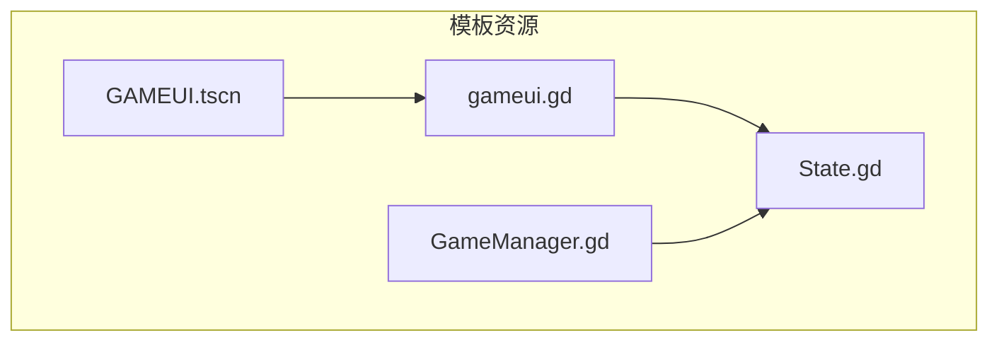
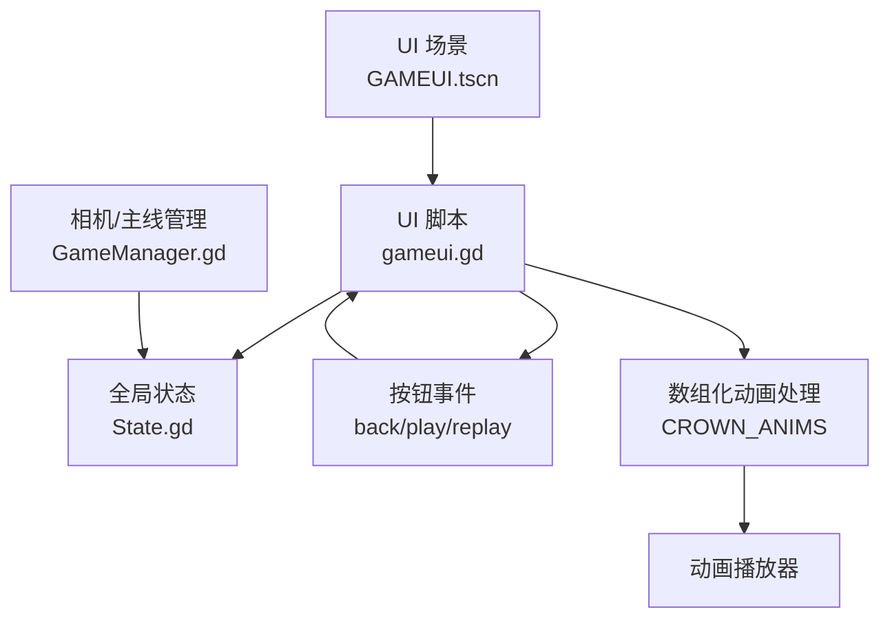
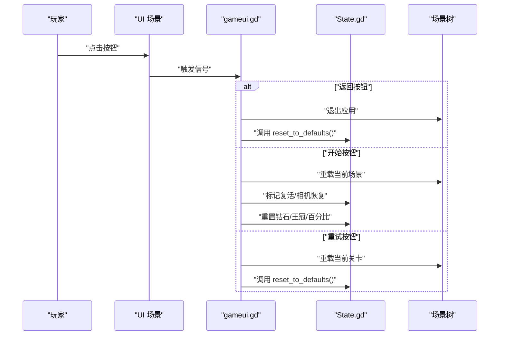
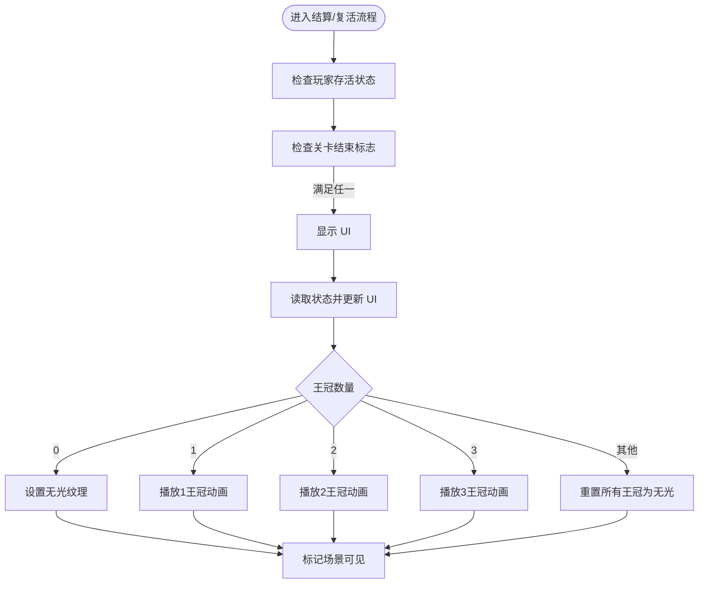
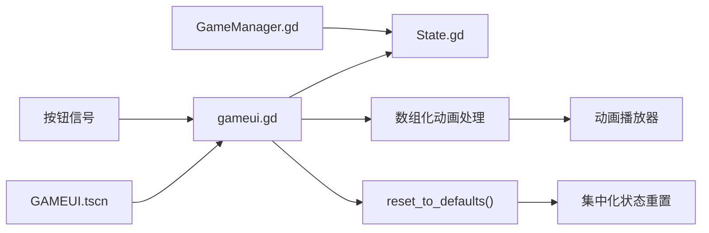

# 用户界面系统

<cite>
**本文引用的文件**
- [gameui.gd](file://#Template/[Scripts]/gameui.gd)
- [GAMEUI.tscn](file://#Template/GAMEUI.tscn)
- [State.gd](file://#Template/[Scripts]/State.gd)
- [GameManager.gd](file://#Template/[Scripts]/GameManager.gd)
- [README.md](file://README.md)
</cite>

## 更新摘要
**所做更改**
- 更新了王冠动画处理机制，从传统条件判断改为数组化索引访问
- 改进了状态重置功能，使用集中化的 `reset_to_defaults()` 方法
- 增强了 UI 系统的可维护性和扩展性
- 优化了代码结构和性能表现

## 目录
1. [简介](#简介)
2. [项目结构](#项目结构)
3. [核心组件](#核心组件)
4. [架构总览](#架构总览)
5. [详细组件分析](#详细组件分析)
6. [依赖关系分析](#依赖关系分析)
7. [性能考虑](#性能考虑)
8. [故障排除指南](#故障排除指南)
9. [结论](#结论)
10. [附录](#附录)

## 简介
本文件面向开发者与内容创作者，系统性解析用户界面系统的设计与实现，重点围绕 gameui.gd 脚本的 UI 管理机制展开，涵盖布局设计、元素管理、事件处理、UI 与游戏状态同步、数据绑定与实时更新、响应式适配策略、性能优化建议以及与触发器、状态管理等其他系统的交互关系。文档同时提供使用示例与自定义界面的开发方法，帮助读者快速上手并进行二次开发。

**更新** 本版本引入了现代化的数组化王冠动画处理机制和改进的状态重置功能，显著提升了代码的可维护性和性能表现。

## 项目结构
用户界面系统位于模板目录下，核心由一个场景文件与一个脚本文件组成：
- 场景文件：GAMEUI.tscn，定义了 UI 的层级结构、节点类型、资源引用、布局参数与连接关系。
- 脚本文件：gameui.gd，负责 UI 的显示逻辑、事件处理、与全局状态 State 的交互。

此外，项目还包含全局状态 State.gd 与相机/主线管理 GameManager.gd，它们共同构成 UI 系统与游戏核心的桥梁。



**图表来源**
- [GAMEUI.tscn:325-333](file://#Template/GAMEUI.tscn#L325-L333)
- [gameui.gd:1-69](file://#Template/[Scripts]/gameui.gd#L1-L69)
- [State.gd:1-190](file://#Template/[Scripts]/State.gd#L1-L190)
- [GameManager.gd:1-46](file://#Template/[Scripts]/GameManager.gd#L1-L46)

**章节来源**
- [README.md:53-65](file://README.md#L53-L65)

## 核心组件
- **UI 场景与节点层次**：GAMEUI.tscn 定义了背景遮罩、返回按钮、开始按钮、重试按钮、标题标签、钻石数量标签、三枚王冠精灵节点以及动画播放器与音效播放器，并通过连接建立按钮与脚本事件的映射。
- **UI 脚本**：gameui.gd 实现了 UI 的可见性控制、状态同步、事件回调与场景切换逻辑，采用现代化的数组化动画处理机制。
- **全局状态**：State.gd 提供游戏运行期的关键状态字段，UI 通过读取这些字段实现数据绑定与实时更新，支持集中化的状态重置。
- **相机/主线管理**：GameManager.gd 提供相机与主线的导出变量与工具函数，间接影响 UI 的触发时机与行为。

**章节来源**
- [GAMEUI.tscn:325-454](file://#Template/GAMEUI.tscn#L325-L454)
- [gameui.gd:1-69](file://#Template/[Scripts]/gameui.gd#L1-L69)
- [State.gd:1-190](file://#Template/[Scripts]/State.gd#L1-L190)
- [GameManager.gd:1-46](file://#Template/[Scripts]/GameManager.gd#L1-L46)

## 架构总览
UI 系统采用"场景 + 脚本 + 全局状态"的分层架构：
- **场景层**：负责视觉呈现与布局，定义节点类型、资源引用与连接关系。
- **脚本层**：负责业务逻辑与状态同步，处理输入事件并驱动场景更新，采用数组化动画处理机制。
- **状态层**：集中存储游戏运行期的状态数据，支持集中化的重置功能，UI 通过读取状态实现数据绑定与实时刷新。



**图表来源**
- [GAMEUI.tscn:325-454](file://#Template/GAMEUI.tscn#L325-L454)
- [gameui.gd:1-69](file://#Template/[Scripts]/gameui.gd#L1-L69)
- [State.gd:1-190](file://#Template/[Scripts]/State.gd#L1-L190)
- [GameManager.gd:1-46](file://#Template/[Scripts]/GameManager.gd#L1-L46)

## 详细组件分析

### UI 场景与布局设计
- **布局模式与锚点**：场景根节点与多个子节点使用布局模式与锚点预设，确保在不同分辨率下保持相对位置稳定。
- **节点类型与职责**：
  - **背景遮罩**：半透明色块，用于突出 UI 内容。
  - **返回按钮**：退出应用并重置全局状态。
  - **开始按钮**：重载当前场景并根据状态决定是否复活。
  - **重试按钮**：重载当前关卡并重置状态。
  - **标题标签**：显示关卡名称。
  - **钻石标签**：显示收集进度。
  - **王冠精灵**：根据状态动态切换纹理与播放动画。
  - **动画播放器**：驱动王冠精灵的纹理切换与淡入淡出效果。
  - **音效播放器**：配合动画播放音效。
- **连接关系**：按钮按下信号连接到脚本的事件处理方法，形成事件驱动的数据流。

**章节来源**
- [GAMEUI.tscn:325-454](file://#Template/GAMEUI.tscn#L325-L454)

### UI 脚本：gameui.gd
- **初始化与可见性控制**：
  - 场景默认隐藏，等待条件满足后显示。
  - 在每帧检查玩家存活状态与关卡结束标志，满足任一条件即显示 UI。
- **现代化的动画处理机制**：
  - **数组化动画索引**：使用 `CROWN_ANIMS` 数组存储动画名称，按王冠数量进行索引访问。
  - **简化动画播放**：通过 `CROWN_ANIMS[count]` 直接获取对应动画名称，避免复杂的条件判断。
  - **统一的无光纹理处理**：当王冠数量不在有效范围内时，统一设置为无光纹理。
- **数据绑定与实时更新**：
  - 当处于复活结算阶段时，递减王冠数量并更新钻石标签与关卡标题。
  - 使用数组化机制根据王冠数量播放相应动画。
  - 最终将场景标记为可见。
- **事件处理**：
  - **返回按钮**：退出应用并调用 `State.reset_to_defaults()` 进行完整状态重置。
  - **开始按钮**：重载当前场景；若存在王冠则标记复活状态并准备恢复相机跟随。
  - **重试按钮**：重载当前关卡并调用 `State.reset_to_defaults()` 进行完整状态重置。



**图表来源**
- [gameui.gd:45-69](file://#Template/[Scripts]/gameui.gd#L45-L69)
- [GAMEUI.tscn:451-453](file://#Template/GAMEUI.tscn#L451-L453)

**章节来源**
- [gameui.gd:1-69](file://#Template/[Scripts]/gameui.gd#L1-L69)

### 全局状态与 UI 同步
- **状态字段**：
  - 关卡结束标志、复活标志、相机跟随恢复标志、钻石数量、王冠数量、百分比等。
  - **数组化王冠状态**：`crowns := [0, 0, 0]` 存储三个位置的王冠状态。
- **现代化的重置机制**：
  - **集中化重置**：`reset_to_defaults()` 方法统一重置所有状态字段。
  - **完整的状态清理**：包括持久化检查点数据、运行时数据、相机检查点等。
- **同步机制**：
  - UI 在显示前读取状态值，执行相应的视觉更新与逻辑分支。
  - 事件处理方法在触发时修改状态，从而驱动 UI 下一次刷新。



**图表来源**
- [gameui.gd:13-27](file://#Template/[Scripts]/gameui.gd#L13-L27)
- [State.gd:10-18](file://#Template/[Scripts]/State.gd#L10-L18)

**章节来源**
- [State.gd:1-190](file://#Template/[Scripts]/State.gd#L1-190)
- [gameui.gd:13-27](file://#Template/[Scripts]/gameui.gd#L13-L27)

### 事件处理与交互
- **事件来源**：按钮按下信号。
- **现代化处理逻辑**：
  - **返回按钮**：退出应用并调用 `State.reset_to_defaults()` 进行完整状态重置。
  - **开始按钮**：重载当前场景；若存在王冠则标记复活状态并准备恢复相机跟随。
  - **重试按钮**：重载当前关卡并调用 `State.reset_to_defaults()` 进行完整状态重置。
- **与场景树的交互**：通过场景树接口进行场景重载与状态重置。

**章节来源**
- [GAMEUI.tscn:451-453](file://#Template/GAMEUI.tscn#L451-L453)
- [gameui.gd:45-69](file://#Template/[Scripts]/gameui.gd#L45-L69)

### 响应式设计与适配策略
- **布局参数**：
  - 根节点与多个子节点使用布局模式与锚点预设，确保在窗口尺寸变化时节点位置与大小按比例调整。
  - 背景遮罩与按钮容器均采用相同的锚点与增长策略，保证整体布局的一致性。
- **适配建议**：
  - 使用锚点与增长策略替代固定像素定位，以提升多分辨率适配能力。
  - 对关键文本与图标使用主题覆盖字体与图标，确保在不同 DPI 下清晰可读。
  - 通过动画与音效增强交互反馈，提升用户体验。

**章节来源**
- [GAMEUI.tscn:325-343](file://#Template/GAMEUI.tscn#L325-L343)
- [GAMEUI.tscn:345-453](file://#Template/GAMEUI.tscn#L345-L453)

### 现代化的动画与音效联动
- **数组化动画库**：场景内定义了多种动画资源，分别对应不同王冠数量的视觉效果，存储在 `CROWN_ANIMS` 数组中。
- **优化的播放控制**：
  - **数组索引访问**：通过 `CROWN_ANIMS[count]` 直接获取动画名称，避免复杂的条件判断。
  - **统一的动画处理**：简化了动画播放逻辑，提高了代码可读性和维护性。
- **音效配合**：动画轨道中包含音效剪辑，播放动画的同时触发音效，增强沉浸感。

**章节来源**
- [GAMEUI.tscn:17-323](file://#Template/GAMEUI.tscn#L17-L323)
- [GAMEUI.tscn:445-450](file://#Template/GAMEUI.tscn#L445-L450)
- [gameui.gd:7-8](file://#Template/[Scripts]/gameui.gd#L7-L8)

## 依赖关系分析
UI 系统与其他模块的耦合关系如下：
- UI 场景依赖 UI 脚本，脚本通过全局状态进行数据读取与写入。
- 相机/主线管理器与全局状态交互，间接影响 UI 的触发时机与行为。
- 按钮事件通过信号连接到脚本方法，形成单向数据流。
- **现代化改进**：状态重置通过集中化方法实现，提高了系统的可维护性。



**图表来源**
- [GAMEUI.tscn:325-454](file://#Template/GAMEUI.tscn#L325-L454)
- [gameui.gd:1-69](file://#Template/[Scripts]/gameui.gd#L1-L69)
- [State.gd:1-190](file://#Template/[Scripts]/State.gd#L1-L190)
- [GameManager.gd:1-46](file://#Template/[Scripts]/GameManager.gd#L1-L46)

**章节来源**
- [GAMEUI.tscn:325-454](file://#Template/GAMEUI.tscn#L325-L454)
- [gameui.gd:1-69](file://#Template/[Scripts]/gameui.gd#L1-L69)
- [State.gd:1-190](file://#Template/[Scripts]/State.gd#L1-L190)
- [GameManager.gd:1-46](file://#Template/[Scripts]/GameManager.gd#L1-L46)

## 性能考虑
- **减少不必要的刷新**：UI 在每帧仅做一次可见性判断，避免频繁的 UI 更新。
- **事件驱动更新**：通过按钮事件触发状态修改，减少轮询带来的开销。
- **资源复用**：动画与音效资源在场景中统一管理，避免重复加载。
- **布局优化**：使用锚点与增长策略，减少因分辨率变化导致的重排计算。
- **现代化优化**：
  - **数组化访问**：使用数组索引替代条件判断，提高动画播放效率。
  - **集中化重置**：通过单一方法重置所有状态，减少重复代码和潜在错误。
  - **内存优化**：避免创建临时字符串，直接使用数组索引访问。

## 故障排除指南
- **UI 不显示**：
  - 检查玩家存活状态与关卡结束标志是否满足显示条件。
  - 确认场景初始可见性被正确设置为隐藏。
- **按钮无响应**：
  - 检查按钮信号是否正确连接到脚本方法。
  - 确认脚本方法签名与信号一致。
- **王冠动画未播放**：
  - 检查状态中的王冠数量是否正确更新。
  - 确认 `CROWN_ANIMS` 数组索引是否在有效范围内（1-3）。
  - 确认动画库与播放器已正确配置。
- **状态重置问题**：
  - 确认事件处理方法中调用了 `State.reset_to_defaults()`。
  - 检查 `reset_to_defaults()` 方法是否正确重置了所有状态字段。
- **数组化动画处理异常**：
  - 确认 `CROWN_ANIMS` 数组的索引顺序与动画名称匹配。
  - 检查王冠数量是否在数组的有效索引范围内。

**章节来源**
- [gameui.gd:13-27](file://#Template/[Scripts]/gameui.gd#L13-L27)
- [gameui.gd:30-43](file://#Template/[Scripts]/gameui.gd#L30-L43)
- [gameui.gd:45-69](file://#Template/[Scripts]/gameui.gd#L45-L69)
- [GAMEUI.tscn:451-453](file://#Template/GAMEUI.tscn#L451-L453)

## 结论
用户界面系统通过场景与脚本的清晰分离、全局状态的集中管理以及事件驱动的交互模型，实现了简洁高效的 UI 管理机制。**现代化改进**包括采用数组化的王冠动画处理机制和集中化的状态重置功能，显著提升了代码的可维护性、性能表现和扩展能力。其响应式布局与动画音效联动提升了用户体验，而事件处理与状态同步确保了 UI 与游戏状态的实时一致性。开发者可在现有基础上进一步扩展新的按钮、动画与状态字段，以满足更复杂的界面需求。

## 附录

### 使用示例
- **显示 UI 并更新数据**：
  - 在玩家死亡或关卡结束后，UI 自动显示；脚本读取状态并更新标题、钻石与王冠显示。
  - **现代化处理**：使用数组化机制根据王冠数量自动选择相应动画。
- **触发场景重载**：
  - 点击"开始"或"重试"按钮后，UI 调用场景重载并根据状态决定复活与相机恢复。
  - **改进的重置**：使用 `State.reset_to_defaults()` 进行完整状态重置。
- **退出应用**：
  - 点击"返回"按钮后，UI 退出应用并调用 `State.reset_to_defaults()` 进行完整状态重置。

**章节来源**
- [gameui.gd:13-27](file://#Template/[Scripts]/gameui.gd#L13-L27)
- [gameui.gd:45-69](file://#Template/[Scripts]/gameui.gd#L45-L69)

### 自定义界面开发方法
- **新增按钮与事件**：
  - 在场景中添加按钮节点并设置图标资源，通过连接将按钮信号映射到脚本方法。
  - 在脚本中实现对应的事件处理方法，修改全局状态并驱动 UI 刷新。
  - **现代化实践**：使用 `State.reset_to_defaults()` 进行状态重置。
- **扩展动画与音效**：
  - 在场景中新增动画资源并加入动画库，通过数组化机制播放相应动画。
  - 在动画轨道中添加音效剪辑，实现音画同步。
  - **优化实践**：利用数组化索引机制简化动画播放逻辑。
- **状态扩展**：
  - 在全局状态中新增字段，UI 通过读取新字段实现数据绑定与实时更新。
  - **现代化重置**：确保新状态也包含在 `reset_to_defaults()` 方法中。

**章节来源**
- [GAMEUI.tscn:325-454](file://#Template/GAMEUI.tscn#L325-L454)
- [gameui.gd:1-69](file://#Template/[Scripts]/gameui.gd#L1-L69)
- [State.gd:1-190](file://#Template/[Scripts]/State.gd#L1-L190)

### 现代化改进详解

#### 数组化王冠动画处理
**更新** 引入了现代化的数组化动画处理机制，替代了传统的多重条件判断：

```gdscript
## 皇冠动画名称数组，按数量索引
const CROWN_ANIMS: Array[String] = ["", "1crown", "2crown", "3crown"]

## 根据皇冠数量更新显示（使用数组替代多重 if-elif）
func _update_crown_display(count: int) -> void:
    # 获取所有皇冠节点
    var crown_nodes := [
        $PerfactCrownNoLight,
        $PerfactCrownNoLight2,
        $PerfactCrownNoLight3,
    ]
    if count >= 1 and count <= 3:
        $AnimationPlayer.play(CROWN_ANIMS[count])
    else:
        for node in crown_nodes:
            node.texture = crown_no_light
```

**优势**：
- **代码简洁**：避免了复杂的 if-elif 条件判断
- **易于扩展**：新增动画类型只需修改数组即可
- **性能优化**：数组索引访问比条件判断更快
- **可维护性**：逻辑清晰，便于理解和修改

#### 改进的状态重置功能
**更新** 采用了集中化的状态重置机制：

```gdscript
func _on_back_pressed() -> void:
    get_tree().quit()
    State.reset_to_defaults()

func _on_gamereplay_pressed() -> void:
    line.reload()
    State.reset_to_defaults()
```

**优势**：
- **完整性**：一次性重置所有状态字段，包括持久化和运行时数据
- **一致性**：确保游戏回到完全干净的状态
- **可维护性**：集中管理重置逻辑，避免分散的重置代码
- **可靠性**：减少状态重置遗漏的可能性

**章节来源**
- [gameui.gd:7-8](file://#Template/[Scripts]/gameui.gd#L7-L8)
- [gameui.gd:30-43](file://#Template/[Scripts]/gameui.gd#L30-L43)
- [gameui.gd:45-69](file://#Template/[Scripts]/gameui.gd#L45-L69)
- [State.gd:154-168](file://#Template/[Scripts]/State.gd#L154-L168)