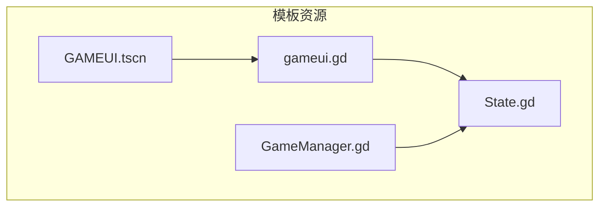
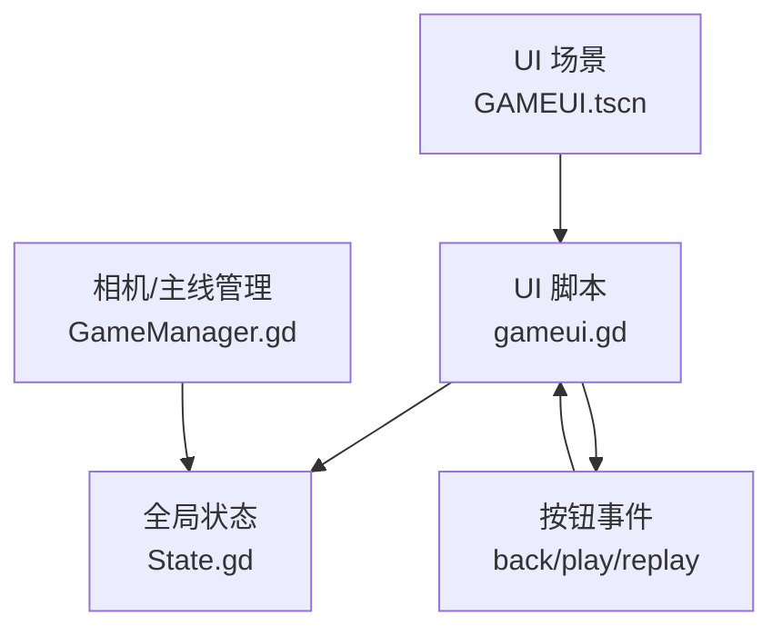
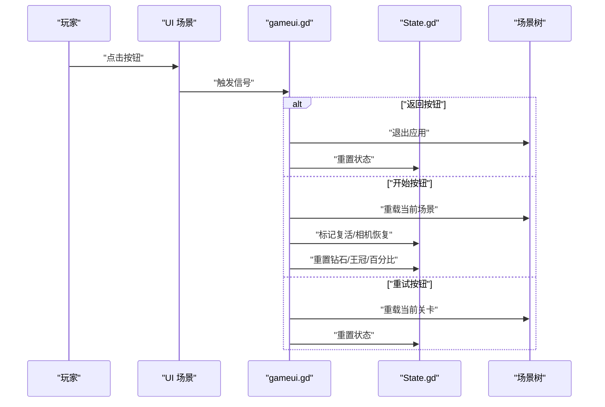
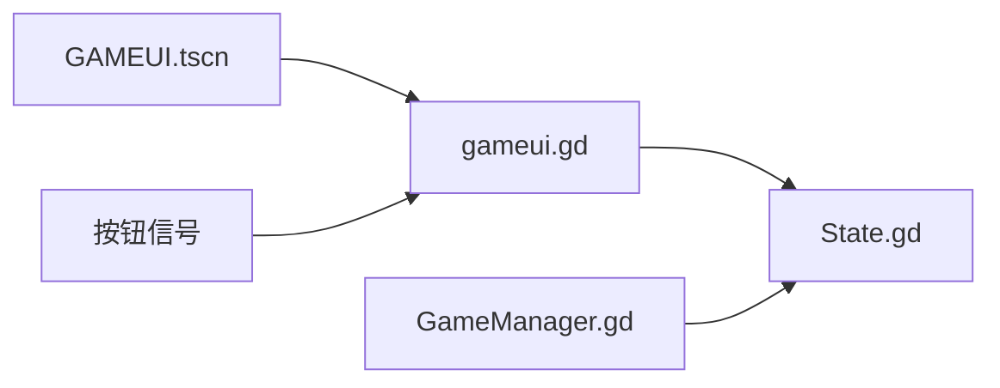

# 用户界面系统

<cite>
**本文引用的文件**
- [gameui.gd](file://#Template/[Scripts]/gameui.gd)
- [GAMEUI.tscn](file://#Template/GAMEUI.tscn)
- [State.gd](file://#Template/[Scripts]/State.gd)
- [GameManager.gd](file://#Template/[Scripts]/GameManager.gd)
- [README.md](file://README.md)
</cite>

## 目录
1. [简介](#简介)
2. [项目结构](#项目结构)
3. [核心组件](#核心组件)
4. [架构总览](#架构总览)
5. [详细组件分析](#详细组件分析)
6. [依赖关系分析](#依赖关系分析)
7. [性能考虑](#性能考虑)
8. [故障排除指南](#故障排除指南)
9. [结论](#结论)
10. [附录](#附录)

## 简介
本文件面向开发者与内容创作者，系统性解析用户界面系统的设计与实现，重点围绕 gameui.gd 脚本的 UI 管理机制展开，涵盖布局设计、元素管理、事件处理、UI 与游戏状态同步、数据绑定与实时更新、响应式适配策略、性能优化建议以及与触发器、状态管理等其他系统的交互关系。文档同时提供使用示例与自定义界面的开发方法，帮助读者快速上手并进行二次开发。

## 项目结构
用户界面系统位于模板目录下，核心由一个场景文件与一个脚本文件组成：
- 场景文件：GAMEUI.tscn，定义了 UI 的层级结构、节点类型、资源引用、布局参数与连接关系。
- 脚本文件：gameui.gd，负责 UI 的显示逻辑、事件处理、与全局状态 State 的交互。

此外，项目还包含全局状态 State.gd 与相机/主线管理 GameManager.gd，它们共同构成 UI 系统与游戏核心的桥梁。

图表来源
- [GAMEUI.tscn:325-333](file://#Template/GAMEUI.tscn#L325-L333)
- [gameui.gd:1-70](file://#Template/[Scripts]/gameui.gd#L1-L70)
- [State.gd:1-21](file://#Template/[Scripts]/State.gd#L1-L21)
- [GameManager.gd:1-47](file://#Template/[Scripts]/GameManager.gd#L1-L47)

章节来源
- [README.md:53-65](file://README.md#L53-L65)

## 核心组件
- UI 场景与节点层次：GAMEUI.tscn 定义了背景遮罩、返回按钮、开始按钮、重试按钮、标题标签、钻石数量标签、三枚王冠精灵节点以及动画播放器与音效播放器，并通过连接建立按钮与脚本事件的映射。
- UI 脚本：gameui.gd 实现了 UI 的可见性控制、状态同步、事件回调与场景切换逻辑。
- 全局状态：State.gd 提供游戏运行期的关键状态字段，UI 通过读取这些字段实现数据绑定与实时更新。
- 相机/主线管理：GameManager.gd 提供相机与主线的导出变量与工具函数，间接影响 UI 的触发时机与行为。

章节来源
- [GAMEUI.tscn:325-454](file://#Template/GAMEUI.tscn#L325-L454)
- [gameui.gd:1-70](file://#Template/[Scripts]/gameui.gd#L1-L70)
- [State.gd:1-21](file://#Template/[Scripts]/State.gd#L1-L21)
- [GameManager.gd:1-47](file://#Template/[Scripts]/GameManager.gd#L1-L47)

## 架构总览
UI 系统采用“场景 + 脚本 + 全局状态”的分层架构：
- 场景层：负责视觉呈现与布局，定义节点类型、资源引用与连接关系。
- 脚本层：负责业务逻辑与状态同步，处理输入事件并驱动场景更新。
- 状态层：集中存储游戏运行期的状态数据，UI 通过读取状态实现数据绑定与实时刷新。

图表来源
- [GAMEUI.tscn:325-454](file://#Template/GAMEUI.tscn#L325-L454)
- [gameui.gd:1-70](file://#Template/[Scripts]/gameui.gd#L1-L70)
- [State.gd:1-21](file://#Template/[Scripts]/State.gd#L1-L21)
- [GameManager.gd:1-47](file://#Template/[Scripts]/GameManager.gd#L1-L47)

## 详细组件分析

### UI 场景与布局设计
- 布局模式与锚点：场景根节点与多个子节点使用布局模式与锚点预设，确保在不同分辨率下保持相对位置稳定。
- 节点类型与职责：
  - 背景遮罩：半透明色块，用于突出 UI 内容。
  - 返回按钮：退出应用并重置全局状态。
  - 开始按钮：重载当前场景并根据状态决定是否复活。
  - 重试按钮：重载当前关卡并重置状态。
  - 标题标签：显示关卡名称。
  - 钻石标签：显示收集进度。
  - 王冠精灵：根据状态动态切换纹理与播放动画。
  - 动画播放器：驱动王冠精灵的纹理切换与淡入淡出效果。
  - 音效播放器：配合动画播放音效。
- 连接关系：按钮按下信号连接到脚本的事件处理方法，形成事件驱动的数据流。

章节来源
- [GAMEUI.tscn:325-454](file://#Template/GAMEUI.tscn#L325-L454)

### UI 脚本：gameui.gd
- 初始化与可见性控制：
  - 场景默认隐藏，等待条件满足后显示。
  - 在每帧检查玩家存活状态与关卡结束标志，满足任一条件即显示 UI。
- 数据绑定与实时更新：
  - 当处于复活结算阶段时，递减王冠数量并更新钻石标签与关卡标题。
  - 根据王冠数量播放不同动画，或直接设置无光纹理。
  - 最终将场景标记为可见。
- 事件处理：
  - 返回按钮：退出应用并重置全局状态。
  - 开始按钮：重载当前场景；若存在王冠则标记复活状态并准备恢复相机跟随。
  - 重试按钮：重载当前关卡并重置状态。

图表来源
- [gameui.gd:40-70](file://#Template/[Scripts]/gameui.gd#L40-L70)
- [GAMEUI.tscn:451-453](file://#Template/GAMEUI.tscn#L451-L453)

章节来源
- [gameui.gd:1-70](file://#Template/[Scripts]/gameui.gd#L1-L70)

### 全局状态与 UI 同步
- 状态字段：
  - 关卡结束标志、复活标志、相机跟随恢复标志、钻石数量、王冠数量、百分比等。
- 同步机制：
  - UI 在显示前读取状态值，执行相应的视觉更新与逻辑分支。
  - 事件处理方法在触发时修改状态，从而驱动 UI 下一次刷新。

图表来源
- [gameui.gd:10-37](file://#Template/[Scripts]/gameui.gd#L10-L37)
- [State.gd:12-21](file://#Template/[Scripts]/State.gd#L12-L21)

章节来源
- [State.gd:1-21](file://#Template/[Scripts]/State.gd#L1-21)
- [gameui.gd:10-37](file://#Template/[Scripts]/gameui.gd#L10-L37)

### 事件处理与交互
- 事件来源：按钮按下信号。
- 处理逻辑：
  - 返回按钮：退出应用并重置全局状态。
  - 开始按钮：重载当前场景；若存在王冠则标记复活状态并准备恢复相机跟随。
  - 重试按钮：重载当前关卡并重置状态。
- 与场景树的交互：通过场景树接口进行场景重载与状态重置。

章节来源
- [GAMEUI.tscn:451-453](file://#Template/GAMEUI.tscn#L451-L453)
- [gameui.gd:40-70](file://#Template/[Scripts]/gameui.gd#L40-L70)

### 响应式设计与适配策略
- 布局参数：
  - 根节点与多个子节点使用布局模式与锚点预设，确保在窗口尺寸变化时节点位置与大小按比例调整。
  - 背景遮罩与按钮容器均采用相同的锚点与增长策略，保证整体布局的一致性。
- 适配建议：
  - 使用锚点与增长策略替代固定像素定位，以提升多分辨率适配能力。
  - 对关键文本与图标使用主题覆盖字体与图标，确保在不同 DPI 下清晰可读。
  - 通过动画与音效增强交互反馈，提升用户体验。

章节来源
- [GAMEUI.tscn:325-343](file://#Template/GAMEUI.tscn#L325-L343)
- [GAMEUI.tscn:345-453](file://#Template/GAMEUI.tscn#L345-L453)

### 动画与音效联动
- 动画库：场景内定义了多种动画资源，分别对应不同王冠数量的视觉效果。
- 播放控制：脚本根据状态播放相应动画，实现纹理切换与淡入淡出效果。
- 音效配合：动画轨道中包含音效剪辑，播放动画的同时触发音效，增强沉浸感。

章节来源
- [GAMEUI.tscn:17-323](file://#Template/GAMEUI.tscn#L17-L323)
- [GAMEUI.tscn:445-450](file://#Template/GAMEUI.tscn#L445-L450)

## 依赖关系分析
UI 系统与其他模块的耦合关系如下：
- UI 场景依赖 UI 脚本，脚本通过全局状态进行数据读取与写入。
- 相机/主线管理器与全局状态交互，间接影响 UI 的触发时机与行为。
- 按钮事件通过信号连接到脚本方法，形成单向数据流。

图表来源
- [GAMEUI.tscn:325-454](file://#Template/GAMEUI.tscn#L325-L454)
- [gameui.gd:1-70](file://#Template/[Scripts]/gameui.gd#L1-L70)
- [State.gd:1-21](file://#Template/[Scripts]/State.gd#L1-L21)
- [GameManager.gd:1-47](file://#Template/[Scripts]/GameManager.gd#L1-L47)

章节来源
- [GAMEUI.tscn:325-454](file://#Template/GAMEUI.tscn#L325-L454)
- [gameui.gd:1-70](file://#Template/[Scripts]/gameui.gd#L1-L70)
- [State.gd:1-21](file://#Template/[Scripts]/State.gd#L1-L21)
- [GameManager.gd:1-47](file://#Template/[Scripts]/GameManager.gd#L1-L47)

## 性能考虑
- 减少不必要的刷新：UI 在每帧仅做一次可见性判断，避免频繁的 UI 更新。
- 事件驱动更新：通过按钮事件触发状态修改，减少轮询带来的开销。
- 资源复用：动画与音效资源在场景中统一管理，避免重复加载。
- 布局优化：使用锚点与增长策略，减少因分辨率变化导致的重排计算。

## 故障排除指南
- UI 不显示：
  - 检查玩家存活状态与关卡结束标志是否满足显示条件。
  - 确认场景初始可见性被正确设置为隐藏。
- 按钮无响应：
  - 检查按钮信号是否正确连接到脚本方法。
  - 确认脚本方法签名与信号一致。
- 王冠动画未播放：
  - 检查状态中的王冠数量是否正确更新。
  - 确认动画库与播放器已正确配置。
- 状态未重置：
  - 确认事件处理方法中调用了状态重置逻辑。

章节来源
- [gameui.gd:10-37](file://#Template/[Scripts]/gameui.gd#L10-L37)
- [gameui.gd:40-70](file://#Template/[Scripts]/gameui.gd#L40-L70)
- [GAMEUI.tscn:451-453](file://#Template/GAMEUI.tscn#L451-L453)

## 结论
用户界面系统通过场景与脚本的清晰分离、全局状态的集中管理以及事件驱动的交互模型，实现了简洁高效的 UI 管理机制。其响应式布局与动画音效联动提升了用户体验，而事件处理与状态同步确保了 UI 与游戏状态的实时一致性。开发者可在现有基础上扩展新的按钮、动画与状态字段，以满足更复杂的界面需求。

## 附录

### 使用示例
- 显示 UI 并更新数据：
  - 在玩家死亡或关卡结束后，UI 自动显示；脚本读取状态并更新标题、钻石与王冠显示。
- 触发场景重载：
  - 点击“开始”或“重试”按钮后，UI 调用场景重载并根据状态决定复活与相机恢复。
- 退出应用：
  - 点击“返回”按钮后，UI 退出应用并重置全局状态。

章节来源
- [gameui.gd:10-37](file://#Template/[Scripts]/gameui.gd#L10-L37)
- [gameui.gd:40-70](file://#Template/[Scripts]/gameui.gd#L40-L70)

### 自定义界面开发方法
- 新增按钮与事件：
  - 在场景中添加按钮节点并设置图标资源，通过连接将按钮信号映射到脚本方法。
  - 在脚本中实现对应的事件处理方法，修改全局状态并驱动 UI 刷新。
- 扩展动画与音效：
  - 在场景中新增动画资源并加入动画库，通过脚本播放相应动画。
  - 在动画轨道中添加音效剪辑，实现音画同步。
- 状态扩展：
  - 在全局状态中新增字段，UI 通过读取新字段实现数据绑定与实时更新。

章节来源
- [GAMEUI.tscn:325-454](file://#Template/GAMEUI.tscn#L325-L454)
- [gameui.gd:1-70](file://#Template/[Scripts]/gameui.gd#L1-L70)
- [State.gd:1-21](file://#Template/[Scripts]/State.gd#L1-L21)