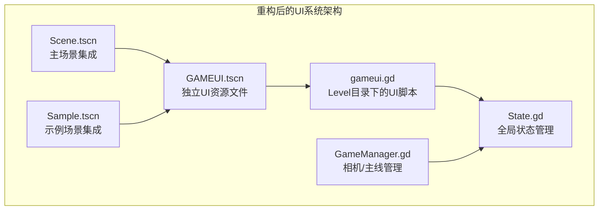
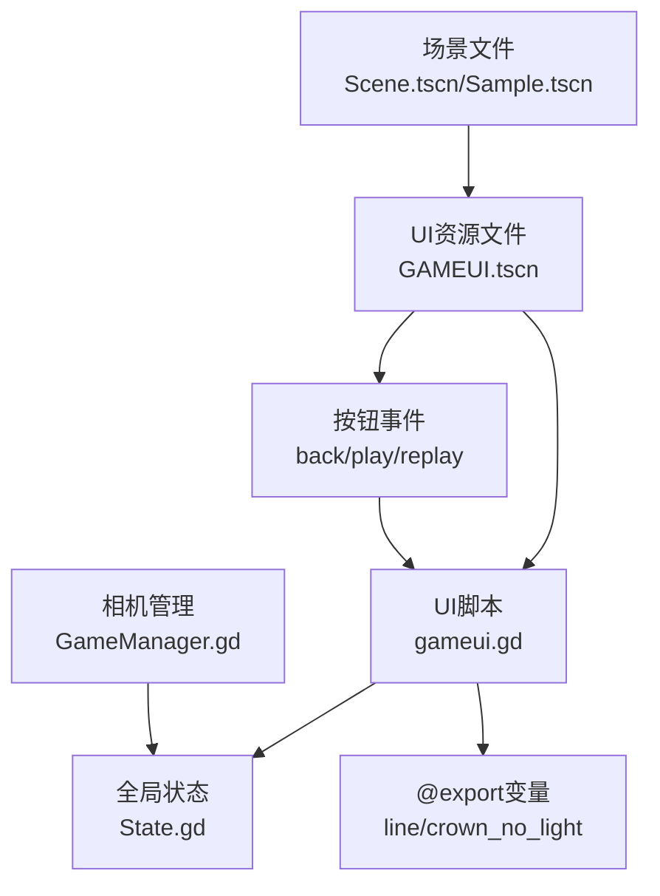
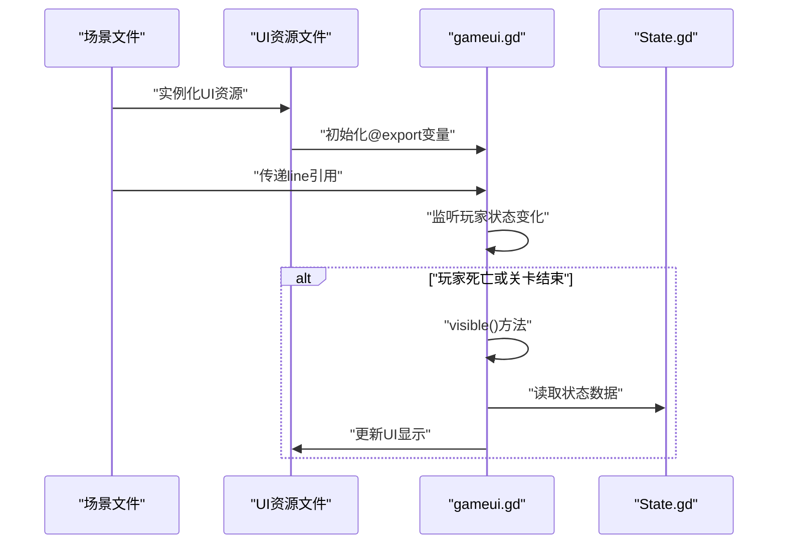
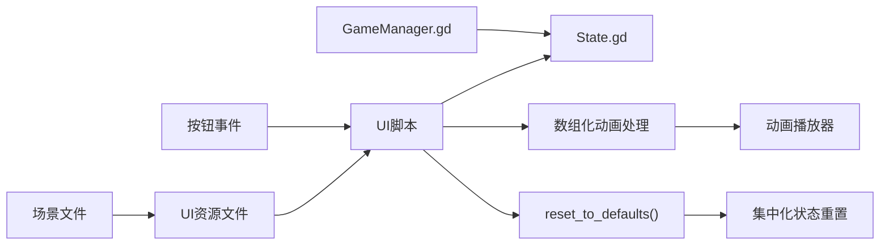
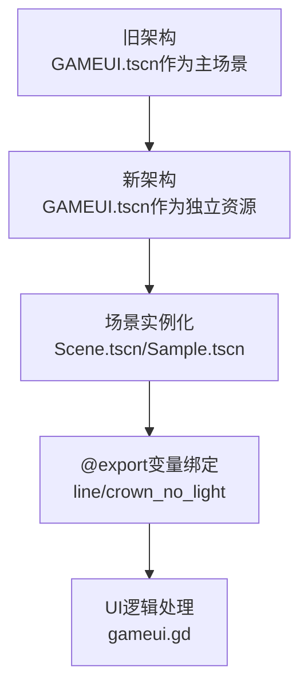

# 用户界面系统

<cite>
**本文引用的文件**
- [gameui.gd](file://#Template/[Scripts]/Level/gameui.gd)
- [GAMEUI.tscn](file://#Template/[Resources]/GAMEUI.tscn)
- [State.gd](file://#Template/[Scripts]/State.gd)
- [GameManager.gd](file://#Template/[Scripts]/GameManager.gd)
- [README.md](file://README.md)
- [Scene.tscn](file://#Template/[Scenes]/Scene.tscn)
- [Sample.tscn](file://#Template/[Scenes]/Sample.tscn)
</cite>

## 更新摘要
**所做更改**
- 更新了UI系统架构：GAMEUI场景已重构为独立资源文件，不再作为主场景存在
- 修正了UI脚本位置：gameui.gd已移动到Level目录下的独立脚本文件
- 改进了UI系统与场景的集成方式：通过场景实例化而非直接场景加载
- 更新了UI系统的技术实现细节和架构说明

## 目录
1. [简介](#简介)
2. [项目结构](#项目结构)
3. [核心组件](#核心组件)
4. [架构总览](#架构总览)
5. [详细组件分析](#详细组件分析)
6. [依赖关系分析](#依赖关系分析)
7. [性能考虑](#性能考虑)
8. [故障排除指南](#故障排除指南)
9. [结论](#结论)
10. [附录](#附录)

## 简介
本文件面向开发者与内容创作者，系统性解析用户界面系统的设计与实现，重点围绕重构后的gameui.gd脚本的UI管理机制展开，涵盖布局设计、元素管理、事件处理、UI与游戏状态同步、数据绑定与实时更新、响应式适配策略、性能优化建议以及与触发器、状态管理等其他系统的交互关系。文档同时提供使用示例与自定义界面的开发方法，帮助读者快速上手并进行二次开发。

**更新** 本版本反映了UI系统的重大重构：GAMEUI场景已完全重构为独立资源文件，UI脚本位置已调整，系统架构更加模块化和灵活。

## 项目结构
用户界面系统经过重构后，采用更加模块化的架构：
- **资源文件**：GAMEUI.tscn作为独立的UI资源文件，定义了UI的视觉元素和动画资源
- **脚本文件**：gameui.gd位于Level目录下，专门负责UI的逻辑处理
- **场景集成**：通过Scene.tscn和Sample.tscn等场景文件实例化UI资源
- **全局状态**：State.gd提供游戏运行期的关键状态字段
- **相机管理**：GameManager.gd提供相机与主线的导出变量与工具函数



**图表来源**
- [GAMEUI.tscn:1-454](file://#Template/[Resources]/GAMEUI.tscn#L1-L454)
- [gameui.gd:1-69](file://#Template/[Scripts]/Level/gameui.gd#L1-L69)
- [Scene.tscn:73-76](file://#Template/[Scenes]/Scene.tscn#L73-L76)
- [Sample.tscn:135-138](file://#Template/[Scenes]/Sample.tscn#L135-L138)

**章节来源**
- [README.md:52-61](file://README.md#L52-L61)

## 核心组件
- **重构后的UI资源**：GAMEUI.tscn作为独立的UI资源文件，包含完整的UI视觉元素、动画资源和按钮配置
- **模块化UI脚本**：gameui.gd位于Level目录下，专注于UI逻辑处理，通过@export变量接收外部依赖
- **场景级集成**：通过Scene.tscn和Sample.tscn等场景文件实例化UI资源，实现灵活的UI集成
- **全局状态管理**：State.gd提供集中化的游戏状态管理，支持完整的状态重置功能
- **相机跟随管理**：GameManager.gd提供相机跟随器的访问和工具函数

**章节来源**
- [GAMEUI.tscn:325-454](file://#Template/[Resources]/GAMEUI.tscn#L325-L454)
- [gameui.gd:1-69](file://#Template/[Scripts]/Level/gameui.gd#L1-L69)
- [State.gd:159-196](file://#Template/[Scripts]/State.gd#L159-L196)
- [GameManager.gd:10-18](file://#Template/[Scripts]/GameManager.gd#L10-L18)

## 架构总览
UI系统采用"资源文件 + 脚本 + 场景集成"的模块化架构：
- **资源层**：GAMEUI.tscn定义UI的视觉元素、动画资源和按钮配置
- **逻辑层**：gameui.gd处理UI逻辑、状态同步和事件响应
- **集成层**：场景文件通过实例化UI资源实现灵活的UI集成
- **状态层**：State.gd提供集中化的状态管理和重置功能



**图表来源**
- [GAMEUI.tscn:325-454](file://#Template/[Resources]/GAMEUI.tscn#L325-L454)
- [gameui.gd:2-5](file://#Template/[Scripts]/Level/gameui.gd#L2-L5)
- [Scene.tscn:73-76](file://#Template/[Scenes]/Scene.tscn#L73-L76)
- [Sample.tscn:135-138](file://#Template/[Scenes]/Sample.tscn#L135-L138)

## 详细组件分析

### 重构后的UI资源文件
- **独立资源架构**：GAMEUI.tscn作为独立的UI资源文件，不再作为主场景存在
- **完整的UI元素**：包含背景遮罩、按钮容器、标题标签、钻石显示、王冠精灵等完整UI组件
- **丰富的动画资源**：定义了1王冠、2王冠、3王冠和重置动画库，支持完整的视觉反馈
- **按钮事件连接**：通过信号连接实现按钮事件与UI脚本的解耦

**章节来源**
- [GAMEUI.tscn:17-323](file://#Template/[Resources]/GAMEUI.tscn#L17-L323)
- [GAMEUI.tscn:445-454](file://#Template/[Resources]/GAMEUI.tscn#L445-L454)

### 模块化UI脚本：gameui.gd
- **@export变量系统**：
  - `line`：CharacterBody3D类型的主线引用
  - `levelname`：字符串类型的关卡名称
  - `crown_no_light`：Texture2D类型的无光王冠纹理
- **初始化与可见性控制**：
  - 场景默认隐藏，等待条件满足后显示
  - 在每帧检查玩家存活状态与关卡结束标志，满足任一条件即显示 UI
- **现代化的动画处理机制**：
  - **数组化动画索引**：使用 `CROWN_ANIMS` 数组存储动画名称，按王冠数量进行索引访问
  - **简化动画播放**：通过 `CROWN_ANIMS[count]` 直接获取对应动画名称
  - **统一的无光纹理处理**：当王冠数量不在有效范围内时，统一设置为无光纹理
- **事件处理**：
  - **返回按钮**：退出应用并调用 `State.reset_to_defaults()` 进行完整状态重置
  - **开始按钮**：重载当前场景；若存在王冠则标记复活状态并准备恢复相机跟随
  - **重试按钮**：重载当前关卡并调用 `State.reset_to_defaults()` 进行完整状态重置



**图表来源**
- [gameui.gd:10-27](file://#Template/[Scripts]/Level/gameui.gd#L10-L27)
- [gameui.gd:45-69](file://#Template/[Scripts]/Level/gameui.gd#L45-L69)

**章节来源**
- [gameui.gd:1-69](file://#Template/[Scripts]/Level/gameui.gd#L1-L69)

### 场景级UI集成
- **场景实例化机制**：通过Scene.tscn和Sample.tscn等场景文件实例化UI资源
- **变量绑定系统**：场景文件通过node_paths和ext_resource将UI资源与脚本变量绑定
- **灵活的UI集成**：可以在不同场景中灵活集成UI资源，实现统一的UI体验

**章节来源**
- [Scene.tscn:73-76](file://#Template/[Scenes]/Scene.tscn#L73-L76)
- [Sample.tscn:135-138](file://#Template/[Scenes]/Sample.tscn#L135-L138)

### 全局状态与UI同步
- **集中化状态管理**：State.gd提供完整的状态管理，包括持久化检查点数据和运行时数据
- **现代化的重置机制**：`reset_to_defaults()` 方法统一重置所有状态字段
- **状态同步机制**：UI通过读取State.gd的状态实现数据绑定与实时更新

**章节来源**
- [State.gd:159-196](file://#Template/[Scripts]/State.gd#L159-L196)
- [gameui.gd:20-27](file://#Template/[Scripts]/Level/gameui.gd#L20-L27)

### 响应式设计与适配策略
- **布局锚点系统**：根节点与多个子节点使用布局模式与锚点预设，确保在不同分辨率下保持相对位置稳定
- **按钮容器设计**：使用Sprite2D作为按钮背景，通过旋转和缩放实现装饰效果
- **字体与图标适配**：使用CaviarDreams字体和UI图标资源，确保在不同DPI下清晰可读

**章节来源**
- [GAMEUI.tscn:325-454](file://#Template/[Resources]/GAMEUI.tscn#L325-L454)

### 现代化的动画与音效联动
- **完整的动画库**：包含1王冠、2王冠、3王冠和RESET动画，支持完整的视觉反馈
- **音效同步机制**：动画轨道中包含音效剪辑，播放动画的同时触发音效
- **纹理切换效果**：通过动画实现王冠纹理的切换和淡入淡出效果

**章节来源**
- [GAMEUI.tscn:17-323](file://#Template/[Resources]/GAMEUI.tscn#L17-L323)
- [GAMEUI.tscn:445-450](file://#Template/[Resources]/GAMEUI.tscn#L445-L450)

## 依赖关系分析
UI系统经过重构后，采用更加清晰的依赖关系：
- **UI资源依赖**：gameui.gd脚本依赖GAMEUI.tscn资源文件
- **场景集成依赖**：场景文件通过实例化UI资源实现UI集成
- **状态管理依赖**：UI系统通过State.gd进行状态读取与写入
- **相机管理依赖**：GameManager.gd提供相机跟随器访问



**图表来源**
- [Scene.tscn:73-76](file://#Template/[Scenes]/Scene.tscn#L73-L76)
- [gameui.gd:1-69](file://#Template/[Scripts]/Level/gameui.gd#L1-L69)
- [State.gd:159-196](file://#Template/[Scripts]/State.gd#L159-L196)
- [GameManager.gd:10-18](file://#Template/[Scripts]/GameManager.gd#L10-L18)

**章节来源**
- [Scene.tscn:73-76](file://#Template/[Scenes]/Scene.tscn#L73-L76)
- [gameui.gd:1-69](file://#Template/[Scripts]/Level/gameui.gd#L1-L69)
- [State.gd:159-196](file://#Template/[Scripts]/State.gd#L159-L196)
- [GameManager.gd:10-18](file://#Template/[Scripts]/GameManager.gd#L10-L18)

## 性能考虑
- **资源复用优化**：UI资源文件作为独立资源，避免重复加载和内存占用
- **事件驱动更新**：通过按钮事件触发状态修改，减少轮询带来的开销
- **模块化架构**：UI脚本位于Level目录，便于维护和扩展
- **场景级集成**：通过场景实例化实现灵活的UI集成，减少代码重复
- **现代化优化**：
  - **数组化访问**：使用数组索引替代条件判断，提高动画播放效率
  - **集中化重置**：通过单一方法重置所有状态，减少重复代码和潜在错误

## 故障排除指南
- **UI不显示问题**：
  - 检查场景文件是否正确实例化UI资源
  - 确认@export变量是否正确绑定到场景中的line引用
  - 检查玩家存活状态与关卡结束标志是否满足显示条件
- **按钮无响应问题**：
  - 检查按钮信号是否正确连接到UI脚本方法
  - 确认脚本方法签名与信号一致
  - 验证场景文件中的node_paths配置
- **动画播放异常**：
  - 检查状态中的王冠数量是否正确更新
  - 确认 `CROWN_ANIMS` 数组索引是否在有效范围内（1-3）
  - 确认动画库与播放器已正确配置
- **状态重置问题**：
  - 确认事件处理方法中调用了 `State.reset_to_defaults()`
  - 检查 `reset_to_defaults()` 方法是否正确重置了所有状态字段
- **资源加载问题**：
  - 检查ext_resource路径是否正确指向GAMEUI.tscn
  - 确认UI资源文件没有被意外删除或移动

**章节来源**
- [gameui.gd:13-27](file://#Template/[Scripts]/Level/gameui.gd#L13-L27)
- [gameui.gd:30-43](file://#Template/[Scripts]/Level/gameui.gd#L30-L43)
- [gameui.gd:45-69](file://#Template/[Scripts]/Level/gameui.gd#L45-L69)
- [GAMEUI.tscn:451-453](file://#Template/[Resources]/GAMEUI.tscn#L451-L453)

## 结论
用户界面系统经过重大重构后，采用了更加模块化和灵活的架构。通过将GAMEUI场景重构为独立资源文件、将UI脚本移动到Level目录、改进场景级集成方式，系统实现了更好的可维护性和扩展性。重构后的UI系统通过资源文件与脚本的清晰分离、全局状态的集中管理以及场景级的灵活集成，提供了简洁高效的UI管理机制。现代化的数组化动画处理机制和集中化的状态重置功能显著提升了代码的可维护性、性能表现和扩展能力。开发者可以在现有基础上进一步扩展新的UI元素、动画与状态字段，以满足更复杂的界面需求。

## 附录

### 使用示例
- **场景集成UI资源**：
  - 在Scene.tscn和Sample.tscn等场景文件中实例化GAMEUI.tscn资源
  - 通过node_paths将UI资源与脚本变量绑定
  - 确保@export变量正确配置
- **显示UI并更新数据**：
  - 在玩家死亡或关卡结束后，UI自动显示；脚本读取状态并更新标题、钻石与王冠显示
  - 使用数组化机制根据王冠数量自动选择相应动画
- **触发场景重载**：
  - 点击"开始"或"重试"按钮后，UI调用场景重载并根据状态决定复活与相机恢复
  - 使用 `State.reset_to_defaults()` 进行完整状态重置

**章节来源**
- [Scene.tscn:73-76](file://#Template/[Scenes]/Scene.tscn#L73-L76)
- [Sample.tscn:135-138](file://#Template/[Scenes]/Sample.tscn#L135-L138)
- [gameui.gd:13-27](file://#Template/[Scripts]/Level/gameui.gd#L13-L27)
- [gameui.gd:45-69](file://#Template/[Scripts]/Level/gameui.gd#L45-L69)

### 自定义界面开发方法
- **扩展UI资源文件**：
  - 在GAMEUI.tscn中添加新的UI元素和按钮
  - 定义相应的动画资源和音效
  - 更新按钮事件连接
- **修改UI脚本**：
  - 在gameui.gd中添加新的事件处理方法
  - 扩展状态读取和更新逻辑
  - 维护@export变量系统
- **场景集成新UI**：
  - 在场景文件中实例化新的UI资源
  - 配置node_paths和ext_resource
  - 测试UI功能和事件响应

**章节来源**
- [GAMEUI.tscn:325-454](file://#Template/[Resources]/GAMEUI.tscn#L325-L454)
- [gameui.gd:1-69](file://#Template/[Scripts]/Level/gameui.gd#L1-L69)
- [State.gd:159-196](file://#Template/[Scripts]/State.gd#L159-L196)

### 重构后的现代化改进详解

#### 独立UI资源文件架构
**更新** UI系统已完全重构为独立资源文件架构：



**优势**：
- **模块化设计**：UI资源文件可以独立维护和更新
- **灵活集成**：可以在不同场景中灵活集成UI资源
- **代码分离**：UI逻辑与场景结构分离，便于维护

#### @export变量系统
**更新** 引入了现代化的@export变量系统：

```gdscript
extends Control
@export var line : CharacterBody3D
@export var levelname := "level name"
@export var crown_no_light: Texture2D
```

**优势**：
- **类型安全**：明确的变量类型声明
- **场景绑定**：通过场景文件进行变量绑定
- **灵活性**：支持运行时变量修改

#### 改进的状态重置功能
**更新** 采用了集中化的状态重置机制：

```gdscript
func _on_back_pressed() -> void:
    get_tree().quit()
    State.reset_to_defaults()

func _on_gamereplay_pressed() -> void:
    line.reload()
    State.reset_to_defaults()
```

**优势**：
- **完整性**：一次性重置所有状态字段，包括持久化和运行时数据
- **一致性**：确保游戏回到完全干净的状态
- **可维护性**：集中管理重置逻辑，避免分散的重置代码

**章节来源**
- [gameui.gd:2-5](file://#Template/[Scripts]/Level/gameui.gd#L2-L5)
- [gameui.gd:45-69](file://#Template/[Scripts]/Level/gameui.gd#L45-L69)
- [State.gd:159-196](file://#Template/[Scripts]/State.gd#L159-L196)