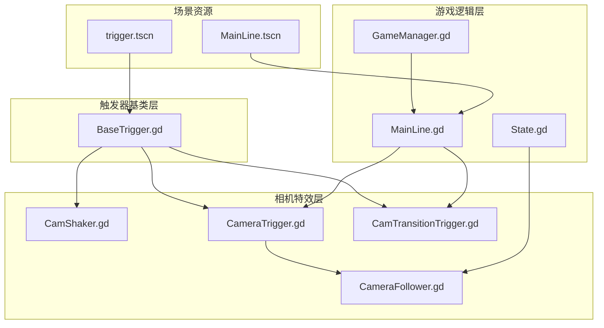
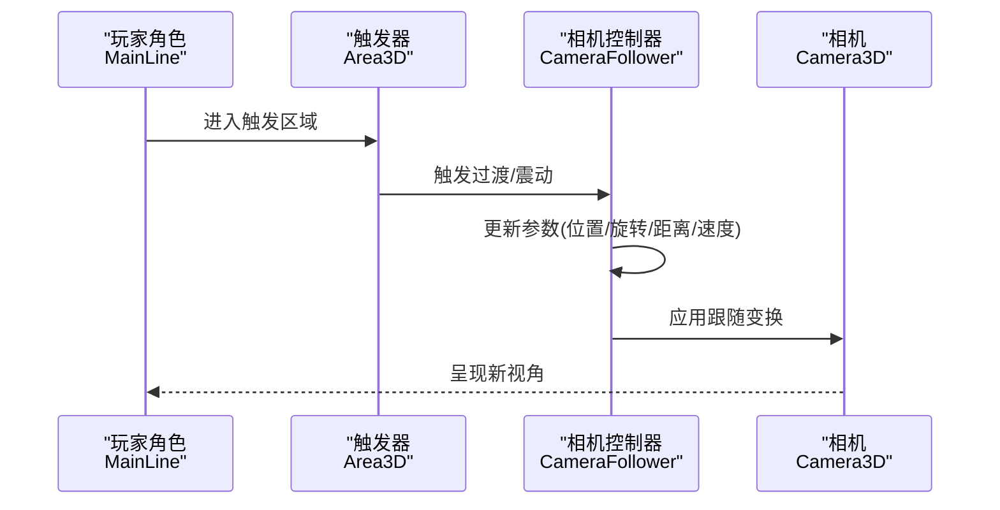
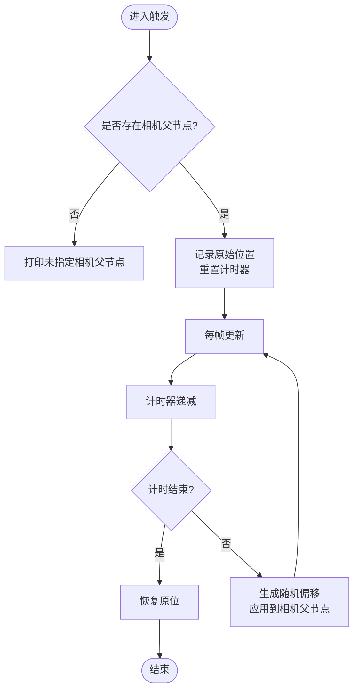
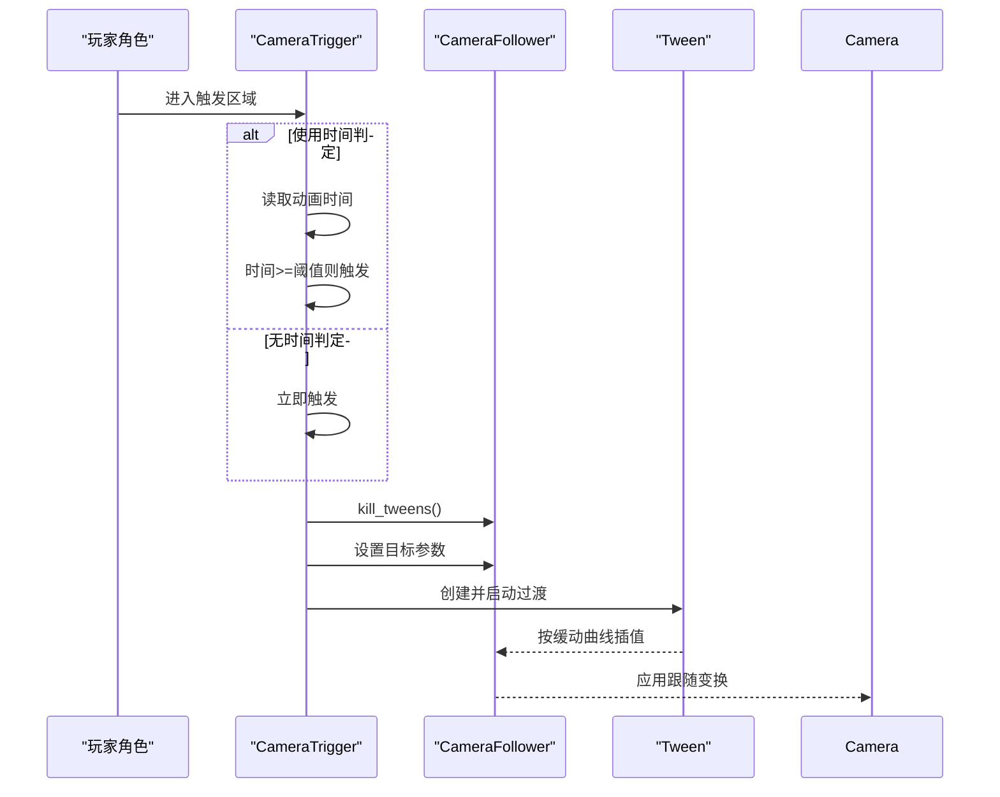
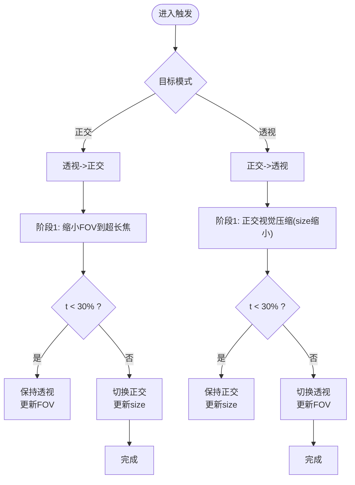
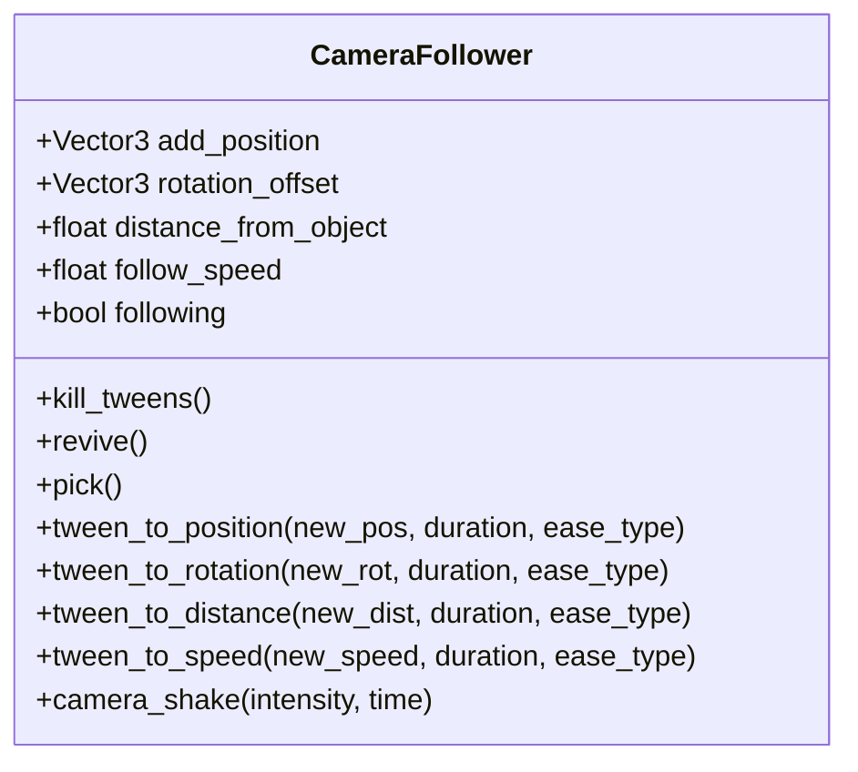
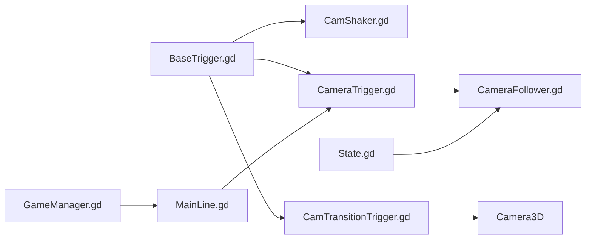

# 相机特效系统

<cite>
**本文引用的文件**
- [CamShaker.gd](file://#Template/[Scripts]/CameraScripts/CamShaker.gd)
- [CameraTrigger.gd](file://#Template/[Scripts]/CameraScripts/CameraTrigger.gd)
- [CamTransitionTrigger.gd](file://#Template/[Scripts]/CameraScripts/CamTransitionTrigger.gd)
- [CameraFollower.gd](file://#Template/[Scripts]/CameraScripts/CameraFollower.gd)
- [BaseTrigger.gd](file://#Template/[Scripts]/Trigger/BaseTrigger.gd)
- [MainLine.gd](file://#Template/[Scripts]/MainLine.gd)
- [GameManager.gd](file://#Template/[Scripts]/GameManager.gd)
- [State.gd](file://#Template/[Scripts]/State.gd)
- [MainLine.tscn](file://#Template/MainLine.tscn)
- [trigger.tscn](file://#Template/trigger.tscn)
</cite>

## 目录
1. [简介](#简介)
2. [项目结构](#项目结构)
3. [核心组件](#核心组件)
4. [架构总览](#架构总览)
5. [详细组件分析](#详细组件分析)
6. [依赖关系分析](#依赖关系分析)
7. [性能考量](#性能考量)
8. [故障排查指南](#故障排查指南)
9. [结论](#结论)
10. [附录](#附录)

## 简介
本文件系统性梳理了相机特效系统的设计与实现，重点覆盖以下内容：
- CamShaker 相机抖动效果的实现原理与参数配置
- CameraTrigger 与 CamTransitionTrigger 的触发机制与过渡效果
- 相机特效的时序控制、强度调节、持续时间等技术实现
- 使用示例与组合应用方法
- 性能考虑与视觉效果优化建议
- 与游戏状态系统的集成方式与触发条件

## 项目结构
相机特效相关代码集中在 Template/[Scripts]/CameraScripts 目录，配合 Trigger 基类与 MainLine 主角系统协同工作。核心文件如下：
- CamShaker.gd：基于 Area3D 的相机抖动触发器
- CameraTrigger.gd：基于 CameraFollower 的相机参数过渡触发器
- CamTransitionTrigger.gd：投影模式切换（正交/透视）的过渡触发器
- CameraFollower.gd：相机跟随与参数过渡的核心节点
- BaseTrigger.gd：通用触发器基类，提供过滤、一次性触发与信号机制
- MainLine.gd：主角节点，承载动画播放与触发时机
- GameManager.gd：提供计算动画起始时间等辅助能力
- State.gd：全局状态，用于相机跟随器的检查点恢复

图表来源
- [CamShaker.gd:1-37](file://#Template/[Scripts]/CameraScripts/CamShaker.gd#L1-L37)
- [CameraTrigger.gd:1-76](file://#Template/[Scripts]/CameraScripts/CameraTrigger.gd#L1-L76)
- [CamTransitionTrigger.gd:1-125](file://#Template/[Scripts]/CameraScripts/CamTransitionTrigger.gd#L1-L125)
- [CameraFollower.gd:1-168](file://#Template/[Scripts]/CameraScripts/CameraFollower.gd#L1-L168)
- [BaseTrigger.gd:1-102](file://#Template/[Scripts]/Trigger/BaseTrigger.gd#L1-L102)
- [MainLine.gd:1-224](file://#Template/[Scripts]/MainLine.gd#L1-L224)
- [GameManager.gd:1-47](file://#Template/[Scripts]/GameManager.gd#L1-L47)
- [State.gd:1-21](file://#Template/[Scripts]/State.gd#L1-L21)
- [MainLine.tscn:1-68](file://#Template/MainLine.tscn#L1-L68)
- [trigger.tscn:1-24](file://#Template/trigger.tscn#L1-L24)

章节来源
- [CamShaker.gd:1-37](file://#Template/[Scripts]/CameraScripts/CamShaker.gd#L1-L37)
- [CameraTrigger.gd:1-76](file://#Template/[Scripts]/CameraScripts/CameraTrigger.gd#L1-L76)
- [CamTransitionTrigger.gd:1-125](file://#Template/[Scripts]/CameraScripts/CamTransitionTrigger.gd#L1-L125)
- [CameraFollower.gd:1-168](file://#Template/[Scripts]/CameraScripts/CameraFollower.gd#L1-L168)
- [BaseTrigger.gd:1-102](file://#Template/[Scripts]/Trigger/BaseTrigger.gd#L1-L102)
- [MainLine.gd:1-224](file://#Template/[Scripts]/MainLine.gd#L1-L224)
- [GameManager.gd:1-47](file://#Template/[Scripts]/GameManager.gd#L1-L47)
- [State.gd:1-21](file://#Template/[Scripts]/State.gd#L1-L21)
- [MainLine.tscn:1-68](file://#Template/MainLine.tscn#L1-L68)
- [trigger.tscn:1-24](file://#Template/trigger.tscn#L1-L24)

## 核心组件
- CamShaker：基于 Area3D 的触发器，检测 CharacterBody3D 进入触发区后对相机父节点进行随机抖动偏移，支持强度与持续时间参数。
- CameraTrigger：基于 CameraFollower 的触发器，按需过渡位置偏移、旋转偏移、距离与跟随速度，支持缓动类型与过渡时长。
- CamTransitionTrigger：基于 Area3D 的投影切换触发器，支持正交/透视两种模式的平滑过渡，包含“超长焦”阶段以模拟正交感。
- CameraFollower：相机跟随核心节点，负责位置插值、参数过渡（位置、旋转、距离、速度），并提供检查点保存/恢复与即时震动接口。
- BaseTrigger：通用触发器基类，提供过滤器、一次性触发、信号发射与调试输出。
- MainLine：主角节点，承载动画播放与触发时机，为 CameraTrigger 的时间判定提供动画时间基准。
- GameManager：提供计算动画起始时间等工具方法。
- State：全局状态，用于相机跟随器的检查点恢复。

章节来源
- [CamShaker.gd:1-37](file://#Template/[Scripts]/CameraScripts/CamShaker.gd#L1-L37)
- [CameraTrigger.gd:1-76](file://#Template/[Scripts]/CameraScripts/CameraTrigger.gd#L1-L76)
- [CamTransitionTrigger.gd:1-125](file://#Template/[Scripts]/CameraScripts/CamTransitionTrigger.gd#L1-L125)
- [CameraFollower.gd:1-168](file://#Template/[Scripts]/CameraScripts/CameraFollower.gd#L1-L168)
- [BaseTrigger.gd:1-102](file://#Template/[Scripts]/Trigger/BaseTrigger.gd#L1-L102)
- [MainLine.gd:1-224](file://#Template/[Scripts]/MainLine.gd#L1-L224)
- [GameManager.gd:1-47](file://#Template/[Scripts]/GameManager.gd#L1-L47)
- [State.gd:1-21](file://#Template/[Scripts]/State.gd#L1-L21)

## 架构总览
相机特效系统采用“触发器 + 参数过渡”的分层设计：
- 触发器层：Area3D 触发器根据进入的主体类型与条件触发
- 控制层：CameraFollower 负责参数过渡与跟随逻辑
- 渲染层：Camera3D 作为最终渲染输出

图表来源
- [CameraTrigger.gd:27-76](file://#Template/[Scripts]/CameraScripts/CameraTrigger.gd#L27-L76)
- [CameraFollower.gd:37-52](file://#Template/[Scripts]/CameraScripts/CameraFollower.gd#L37-L52)
- [CamShaker.gd:30-37](file://#Template/[Scripts]/CameraScripts/CamShaker.gd#L30-L37)

## 详细组件分析

### CamShaker 相机抖动
- 触发条件：CharacterBody3D 进入 Area3D；若未设置 camera_parent，则打印提示。
- 抖动实现：在每帧根据剩余抖动时间计算随机偏移，更新相机父节点位置；到期后恢复原位。
- 参数配置：
  - camera_parent：相机父节点（通常为 CameraFollower）
  - shake_intensity：抖动强度（范围 [-intensity, intensity]）
  - shake_duration：抖动持续时间

图表来源
- [CamShaker.gd:10-37](file://#Template/[Scripts]/CameraScripts/CamShaker.gd#L10-L37)

章节来源
- [CamShaker.gd:1-37](file://#Template/[Scripts]/CameraScripts/CamShaker.gd#L1-L37)

### CameraTrigger 相机参数过渡
- 触发条件：进入触发区的主体属于 mainline 分组或名称为 MainLine；可选使用时间判定（基于 AnimationPlayer 当前动画时间）。
- 过渡参数：
  - 位置偏移：add_position
  - 旋转偏移：rotation_offset
  - 距离：distance_from_object
  - 跟随速度：follow_speed
- 过渡控制：
  - ease_type：缓动类型
  - need_time：过渡时长
  - kill_tweens：在新触发前停止正在进行的 Tween

图表来源
- [CameraTrigger.gd:27-76](file://#Template/[Scripts]/CameraScripts/CameraTrigger.gd#L27-L76)
- [CameraFollower.gd:74-83](file://#Template/[Scripts]/CameraScripts/CameraFollower.gd#L74-L83)

章节来源
- [CameraTrigger.gd:1-76](file://#Template/[Scripts]/CameraScripts/CameraTrigger.gd#L1-L76)
- [CameraFollower.gd:1-168](file://#Template/[Scripts]/CameraScripts/CameraFollower.gd#L1-L168)

### CamTransitionTrigger 投影切换过渡
- 触发条件：CharacterBody3D 进入 Area3D；防止重复触发。
- 支持模式：
  - 切换至正交：先将透视 FOV 缩小到“超长焦”，再切换到正交并调整 size
  - 切换至透视：先将正交 size 缩小到视觉压缩，再切换到透视并调整 FOV
- 过渡参数：
  - transition_duration：总过渡时长
  - orthogonal_size / perspective_fov：目标正交 size 或透视 FOV
  - SWITCH_THRESHOLD：30% 阈值，用于在两个阶段间平滑切换

图表来源
- [CamTransitionTrigger.gd:21-125](file://#Template/[Scripts]/CameraScripts/CamTransitionTrigger.gd#L21-L125)

章节来源
- [CamTransitionTrigger.gd:1-125](file://#Template/[Scripts]/CameraScripts/CamTransitionTrigger.gd#L1-L125)

### CameraFollower 相机跟随与过渡核心
- 跟随逻辑：基于 player_node 的位置与偏移，使用球面插值（slerp）平滑移动到目标位置
- 参数过渡：提供独立的 Tween 接口，分别过渡 add_position、rotation_offset、distance_from_object、follow_speed
- 检查点：支持保存/恢复相机跟随器的状态，便于关卡重载后恢复
- 震动接口：提供即时震动函数，按衰减曲线随机抖动相机位置

图表来源
- [CameraFollower.gd:1-168](file://#Template/[Scripts]/CameraScripts/CameraFollower.gd#L1-L168)

章节来源
- [CameraFollower.gd:1-168](file://#Template/[Scripts]/CameraScripts/CameraFollower.gd#L1-L168)

### BaseTrigger 通用触发器基类
- 提供统一的触发信号、过滤器与一次性触发能力
- 可在编辑器中隐藏可视化网格，减少运行时开销
- 子类仅需重写 _on_triggered 即可实现自定义触发效果

章节来源
- [BaseTrigger.gd:1-102](file://#Template/[Scripts]/Trigger/BaseTrigger.gd#L1-L102)

### 与游戏状态系统的集成
- State.gd 提供相机跟随器检查点相关字段，CameraFollower 在 _ready 时可从 State 恢复
- MainLine.gd 在重载时清空相机状态并调用 reload，确保相机跟随器状态一致
- GameManager.gd 提供计算动画起始时间的方法，CameraTrigger 可据此进行时间判定

章节来源
- [State.gd:1-21](file://#Template/[Scripts]/State.gd#L1-L21)
- [CameraFollower.gd:30-36](file://#Template/[Scripts]/CameraScripts/CameraFollower.gd#L30-L36)
- [MainLine.gd:114-124](file://#Template/[Scripts]/MainLine.gd#L114-L124)
- [GameManager.gd:23-39](file://#Template/[Scripts]/GameManager.gd#L23-L39)

## 依赖关系分析
- CamShaker 依赖 CharacterBody3D 与 CameraFollower 的父节点
- CameraTrigger 依赖 CameraFollower，并通过 Tween 对其参数进行过渡
- CamTransitionTrigger 依赖 Camera3D 的投影切换与 FOV/size 参数
- BaseTrigger 为 CamShaker/CameraTrigger/CamTransitionTrigger 提供统一触发框架
- MainLine 通过 AnimationPlayer 与 GameManager 提供时间判定基础
- State 为 CameraFollower 的检查点恢复提供数据源

图表来源
- [BaseTrigger.gd:1-102](file://#Template/[Scripts]/Trigger/BaseTrigger.gd#L1-L102)
- [CamShaker.gd:1-37](file://#Template/[Scripts]/CameraScripts/CamShaker.gd#L1-L37)
- [CameraTrigger.gd:1-76](file://#Template/[Scripts]/CameraScripts/CameraTrigger.gd#L1-L76)
- [CamTransitionTrigger.gd:1-125](file://#Template/[Scripts]/CameraScripts/CamTransitionTrigger.gd#L1-L125)
- [CameraFollower.gd:1-168](file://#Template/[Scripts]/CameraScripts/CameraFollower.gd#L1-L168)
- [MainLine.gd:1-224](file://#Template/[Scripts]/MainLine.gd#L1-L224)
- [GameManager.gd:1-47](file://#Template/[Scripts]/GameManager.gd#L1-L47)
- [State.gd:1-21](file://#Template/[Scripts]/State.gd#L1-L21)

章节来源
- [BaseTrigger.gd:1-102](file://#Template/[Scripts]/Trigger/BaseTrigger.gd#L1-L102)
- [CamShaker.gd:1-37](file://#Template/[Scripts]/CameraScripts/CamShaker.gd#L1-L37)
- [CameraTrigger.gd:1-76](file://#Template/[Scripts]/CameraScripts/CameraTrigger.gd#L1-L76)
- [CamTransitionTrigger.gd:1-125](file://#Template/[Scripts]/CameraScripts/CamTransitionTrigger.gd#L1-L125)
- [CameraFollower.gd:1-168](file://#Template/[Scripts]/CameraScripts/CameraFollower.gd#L1-L168)
- [MainLine.gd:1-224](file://#Template/[Scripts]/MainLine.gd#L1-L224)
- [GameManager.gd:1-47](file://#Template/[Scripts]/GameManager.gd#L1-L47)
- [State.gd:1-21](file://#Template/[Scripts]/State.gd#L1-L21)

## 性能考量
- 抖动实现：CamShaker 使用每帧随机偏移，建议在短时强抖动场景中适度降低 shake_intensity 与 shake_duration，避免过度 CPU/GPU 开销。
- 参数过渡：CameraTrigger 通过 Tween 插值，ease_type 与 need_time 影响 CPU 占用；建议在多参数同时过渡时合并 Tween，减少对象数量。
- 投影切换：CamTransitionTrigger 的过渡包含多次属性变更，建议合理设置 transition_duration，避免频繁切换导致的视觉与性能波动。
- 跟随插值：CameraFollower 使用 slerp 平滑移动，follow_speed 与 delta 的乘积决定平滑度；过高的 follow_speed 会增加插值次数，建议按帧率动态调整。
- 检查点恢复：State 恢复时 CameraFollower 会立即跳变一次，建议在重载流程中先暂停动画再恢复，避免瞬移带来的不适。

[本节为通用性能建议，不直接分析具体文件]

## 故障排查指南
- 相机父节点未指定：CamShaker 在未设置 camera_parent 时会打印提示，请确认挂载层级与路径正确。
- 触发无效：
  - 检查触发器的 body_entered 连接是否生效（BaseTrigger._setup_trigger）
  - 确认进入触发区的主体类型符合 trigger_filter
  - 对于 CameraTrigger，确认 use_time 条件满足（AnimationPlayer 当前动画时间）
- 过渡冲突：CameraTrigger 在新触发前会 kill_tweens，如出现异常请检查是否在外部也创建了同名 Tween。
- 投影切换异常：CamTransitionTrigger 会防止重复触发，若切换无效，请确认 is_transitioning 状态与 camera 引用。
- 检查点恢复：State 恢复依赖 State 字段存在且 camera_follower_restore_pending 为真，确保在重载流程中正确设置。

章节来源
- [CamShaker.gd:30-37](file://#Template/[Scripts]/CameraScripts/CamShaker.gd#L30-L37)
- [BaseTrigger.gd:46-73](file://#Template/[Scripts]/Trigger/BaseTrigger.gd#L46-L73)
- [CameraTrigger.gd:44-76](file://#Template/[Scripts]/CameraScripts/CameraTrigger.gd#L44-L76)
- [CamTransitionTrigger.gd:21-30](file://#Template/[Scripts]/CameraScripts/CamTransitionTrigger.gd#L21-L30)
- [CameraFollower.gd:33-36](file://#Template/[Scripts]/CameraScripts/CameraFollower.gd#L33-L36)

## 结论
相机特效系统通过 Area3D 触发器与 CameraFollower 的参数过渡实现了灵活的视角控制与视觉反馈。CamShaker 提供即时震动，CameraTrigger 实现参数渐变，CamTransitionTrigger 实现投影模式切换。结合 State 与 MainLine 的状态管理，系统可在关卡重载与动画驱动下保持一致的相机行为。建议在复杂场景中合并 Tween、合理设置参数与时长，并注意检查点恢复的时机，以获得最佳性能与体验。

[本节为总结性内容，不直接分析具体文件]

## 附录

### 使用示例与组合应用
- 基础震动：将 CamShaker 放置于玩家附近，设置合适的 shake_intensity 与 shake_duration，当玩家进入触发区时产生震动。
- 参数过渡：在关键节点放置 CameraTrigger，设置目标参数与过渡时长，结合 ease_type 实现自然的视角变化。
- 投影切换：在场景切换处放置 CamTransitionTrigger，选择目标模式（正交/透视），设置 orthogonal_size 或 perspective_fov，实现流畅的视角转换。
- 组合应用：先通过 CameraTrigger 调整视角，再用 CamTransitionTrigger 切换投影，最后用 CamShaker 表达冲击感，形成“视角调整—投影切换—震动反馈”的三段式体验。

[本节为概念性说明，不直接分析具体文件]