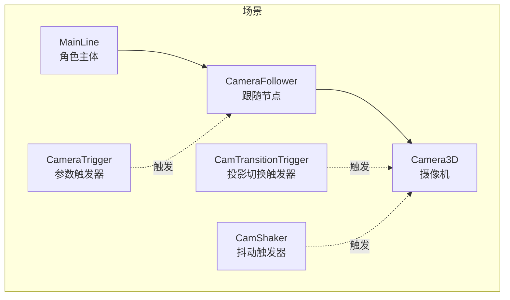
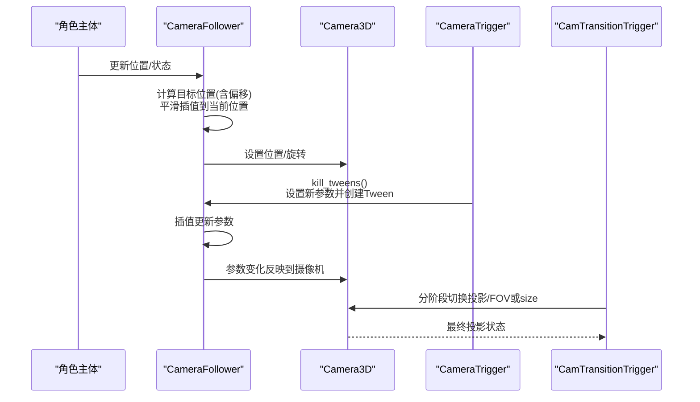
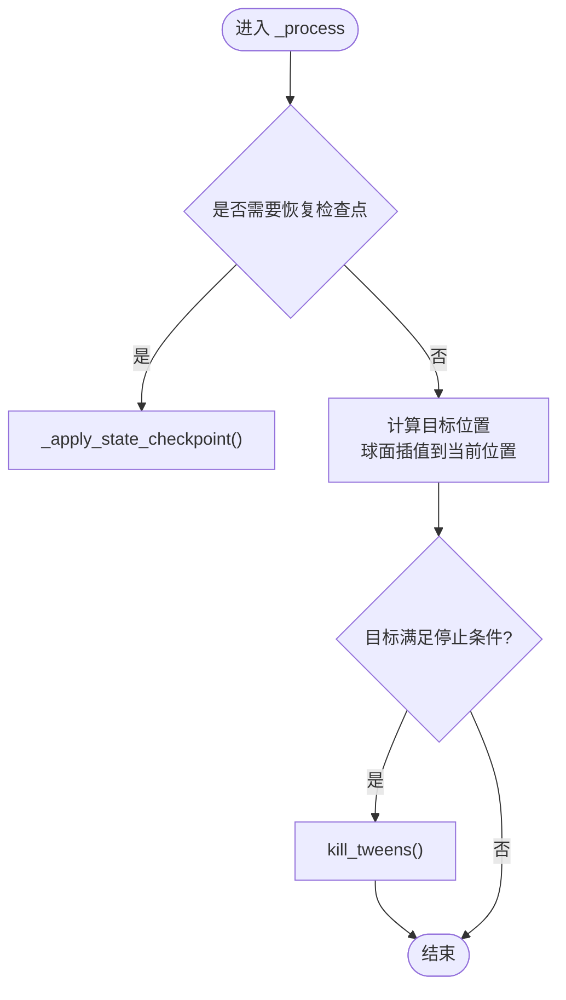
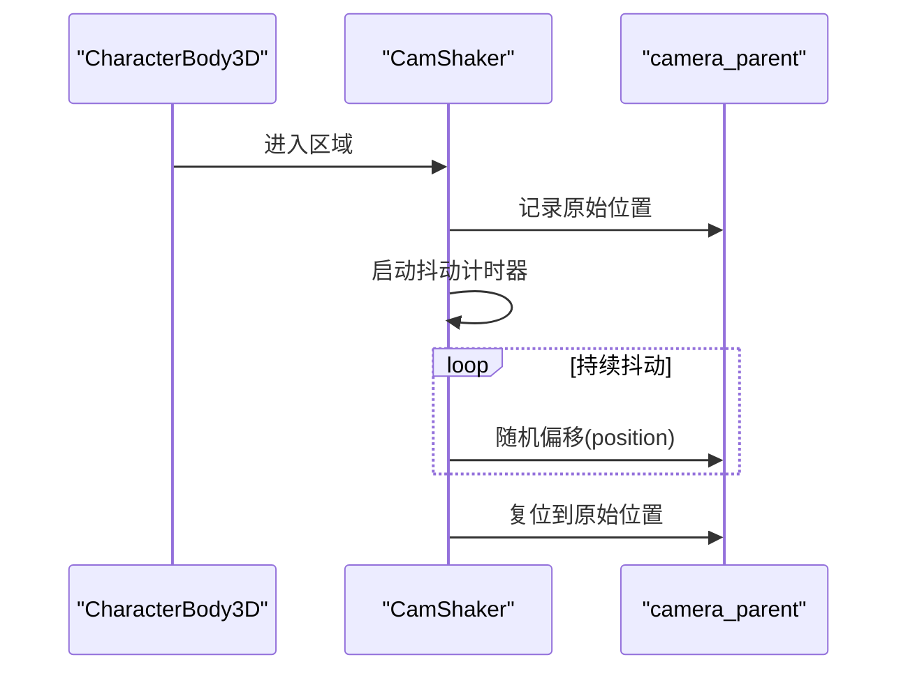
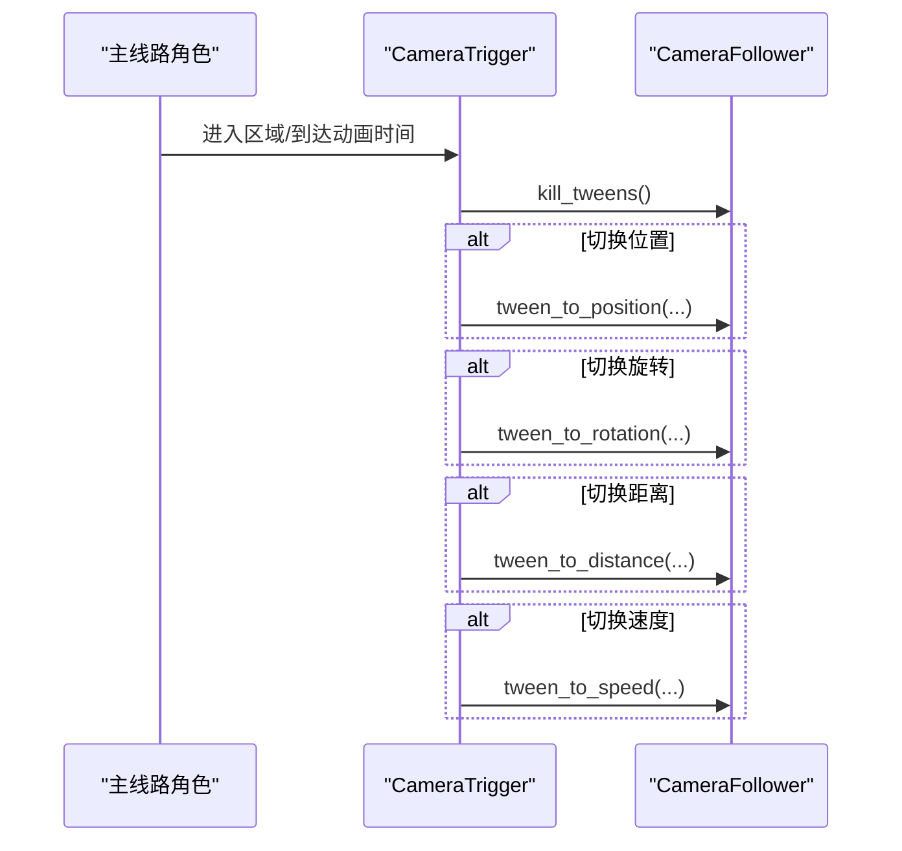
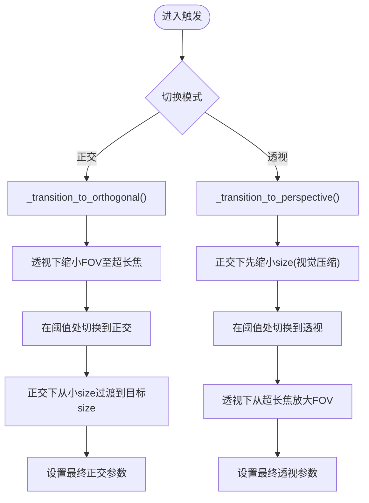
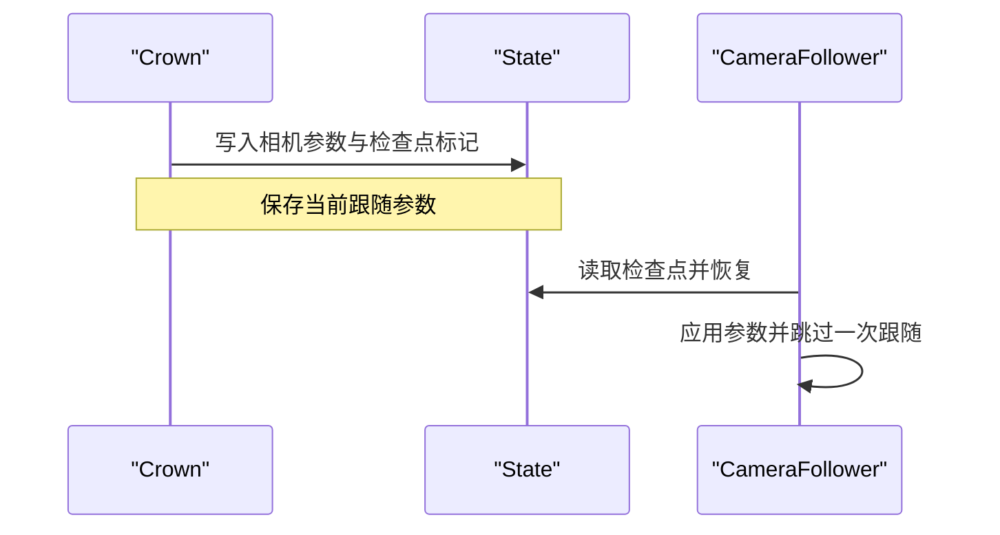
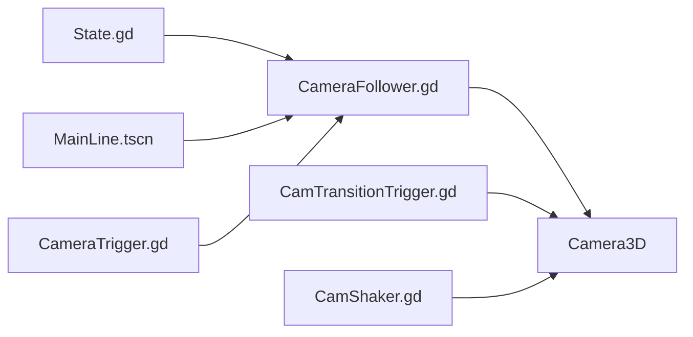

# 相机系统

<cite>
**本文引用的文件**
- [CameraFollower.gd](file://#Template/[Scripts]/CameraScripts/CameraFollower.gd)
- [CamShaker.gd](file://#Template/[Scripts]/CameraScripts/CamShaker.gd)
- [CameraTrigger.gd](file://#Template/[Scripts]/CameraScripts/CameraTrigger.gd)
- [CamTransitionTrigger.gd](file://#Template/[Scripts]/CameraScripts/CamTransitionTrigger.gd)
- [State.gd](file://#Template/[Scripts]/State.gd)
- [Crown.gd](file://#Template/[Scripts]/Trigger/Crown.gd)
- [GameManager.gd](file://#Template/[Scripts]/GameManager.gd)
- [Sample.tscn](file://#Template/[Scenes]/Sample.tscn)
- [MainLine.tscn](file://#Template/MainLine.tscn)
</cite>

## 目录
1. [简介](#简介)
2. [项目结构](#项目结构)
3. [核心组件](#核心组件)
4. [架构总览](#架构总览)
5. [详细组件分析](#详细组件分析)
6. [依赖关系分析](#依赖关系分析)
7. [性能考量](#性能考量)
8. [故障排查指南](#故障排查指南)
9. [结论](#结论)
10. [附录](#附录)

## 简介
本文件系统化梳理并解读项目中的相机系统，重点覆盖以下方面：
- 智能跟随与平滑过渡：CameraFollower 的跟随算法、Tween 参数调节与状态检查点机制
- 抖动特效：CamShaker 的触发与抖动实现、参数配置与适用场景
- 触发器：CameraTrigger 的按条件触发与按时间触发、CamTransitionTrigger 的投影切换序列
- 参数调节与特效集成：如何通过导出参数与 Tween 实现平滑过渡与即时切换
- 扩展与自定义：相机系统的可扩展点与自定义效果开发建议
- 性能优化与最佳实践：帧循环开销控制、Tween 复用与状态同步

## 项目结构
相机系统主要由四个脚本组成，并在场景中进行装配：
- CameraFollower：负责跟随主体、平滑移动、参数过渡与状态检查点恢复
- CamShaker：基于 Area3D 的触发式抖动
- CameraTrigger：基于进入触发的相机参数切换
- CamTransitionTrigger：基于投影模式切换的镜头过渡

图表来源
- [Sample.tscn:60-70](file://#Template/[Scenes]/Sample.tscn#L60-L70)
- [MainLine.tscn:36](file://#Template/MainLine.tscn#L36)
- [CameraFollower.gd:10](file://#Template/[Scripts]/CameraScripts/CameraFollower.gd#L10)
- [CamShaker.gd:3](file://#Template/[Scripts]/CameraScripts/CamShaker.gd#L3)
- [CameraTrigger.gd:3](file://#Template/[Scripts]/CameraScripts/CameraTrigger.gd#L3)
- [CamTransitionTrigger.gd:9](file://#Template/[Scripts]/CameraScripts/CamTransitionTrigger.gd#L9)

章节来源
- [Sample.tscn:48-70](file://#Template/[Scenes]/Sample.tscn#L48-L70)
- [MainLine.tscn:36](file://#Template/MainLine.tscn#L36)

## 核心组件
- CameraFollower：导出跟随目标、偏移、旋转、距离、跟随速度与开关；在每帧根据目标位置与偏移计算平滑位置；支持停止条件检测；提供参数 Tween 化接口；内置状态检查点应用与恢复；提供简易抖动接口
- CamShaker：Area3D 触发器，对指定父级节点进行随机抖动；记录原始位置并在结束后复位
- CameraTrigger：Area3D 触发器，按需切换跟随参数（位置偏移、旋转、距离、跟随速度），支持按时间触发
- CamTransitionTrigger：投影切换触发器，支持正交/透视模式间平滑过渡，分阶段调整 FOV 或 size 并在阈值处切换投影类型

章节来源
- [CameraFollower.gd:3-8](file://#Template/[Scripts]/CameraScripts/CameraFollower.gd#L3-L8)
- [CameraFollower.gd:114-148](file://#Template/[Scripts]/CameraScripts/CameraFollower.gd#L114-L148)
- [CamShaker.gd:3-6](file://#Template/[Scripts]/CameraScripts/CamShaker.gd#L3-L6)
- [CameraTrigger.gd:3-13](file://#Template/[Scripts]/CameraScripts/CameraTrigger.gd#L3-L13)
- [CamTransitionTrigger.gd:3-6](file://#Template/[Scripts]/CameraScripts/CamTransitionTrigger.gd#L3-L6)

## 架构总览
相机系统围绕“跟随节点 + 摄像机”组织，触发器通过信号或时间驱动参数变更，Tween 提供平滑插值，状态模块用于跨关卡/事件保存与恢复。

图表来源
- [CameraFollower.gd:37-52](file://#Template/[Scripts]/CameraScripts/CameraFollower.gd#L37-L52)
- [CameraFollower.gd:114-148](file://#Template/[Scripts]/CameraScripts/CameraFollower.gd#L114-L148)
- [CameraTrigger.gd:44-75](file://#Template/[Scripts]/CameraScripts/CameraTrigger.gd#L44-L75)
- [CamTransitionTrigger.gd:21-83](file://#Template/[Scripts]/CameraScripts/CamTransitionTrigger.gd#L21-L83)

## 详细组件分析

### CameraFollower：智能跟随与参数过渡
- 跟随算法
  - 每帧将自身位置朝“目标位置+偏移”的方向进行球面插值，插值系数与跟随速度和 delta 时间相关，保证平滑且不越界
  - 支持一次性跳过一次跟随以立即贴合目标
- 参数过渡
  - 提供位置、旋转、距离、速度四类参数的 Tween 化过渡接口，自动停止旧 Tween 并创建新的
  - 支持外部触发器直接调用接口进行平滑切换
- 状态检查点
  - 在就绪时尝试从全局状态恢复相机参数
  - 可通过 pick/revive 保存与恢复当前参数集
- 停止条件
  - 当目标对象满足特定状态时，停止跟随并终止所有 Tween
- 抖动接口
  - 内置简易抖动：在指定时间内按衰减随机偏移摄像机位置

图表来源
- [CameraFollower.gd:37-52](file://#Template/[Scripts]/CameraScripts/CameraFollower.gd#L37-L52)
- [CameraFollower.gd:54-72](file://#Template/[Scripts]/CameraScripts/CameraFollower.gd#L54-L72)
- [CameraFollower.gd:74-82](file://#Template/[Scripts]/CameraScripts/CameraFollower.gd#L74-L82)

章节来源
- [CameraFollower.gd:37-167](file://#Template/[Scripts]/CameraScripts/CameraFollower.gd#L37-L167)
- [State.gd:4-9](file://#Template/[Scripts]/State.gd#L4-L9)

### CamShaker：触发式抖动
- 触发方式
  - 作为 Area3D，当 CharacterBody3D 进入时启动抖动计时器
- 抖动实现
  - 在抖动持续时间内，对指定父节点的 position 进行随机偏移
  - 抖动强度随时间线性衰减，结束后复位到原始位置
- 使用建议
  - 将 Camera3D 的父节点（如 CameraFollower）作为 camera_parent，避免抖动作用于错误层级

图表来源
- [CamShaker.gd:16-36](file://#Template/[Scripts]/CameraScripts/CamShaker.gd#L16-L36)

章节来源
- [CamShaker.gd:10-36](file://#Template/[Scripts]/CameraScripts/CamShaker.gd#L10-L36)

### CameraTrigger：参数触发器
- 触发条件
  - 默认进入触发：当主线路角色进入区域时执行
  - 时间触发：可选，基于主线路动画播放进度达到设定时间后触发
- 参数切换
  - 可选择性地切换位置偏移、旋转、距离、跟随速度
  - 使用 Tween 对各参数进行平滑过渡，Ease 与时长可配置
- 与跟随器协作
  - 先停止跟随器的现有 Tween，再创建新的过渡

图表来源
- [CameraTrigger.gd:27-43](file://#Template/[Scripts]/CameraScripts/CameraTrigger.gd#L27-L43)
- [CameraTrigger.gd:44-75](file://#Template/[Scripts]/CameraScripts/CameraTrigger.gd#L44-L75)

章节来源
- [CameraTrigger.gd:27-75](file://#Template/[Scripts]/CameraScripts/CameraTrigger.gd#L27-L75)

### CamTransitionTrigger：投影切换
- 切换模式
  - 支持“切换到正交”和“切换到透视”
- 切换流程
  - 分两阶段：先在当前投影下进行参数过渡（透视下缩小 FOV 至近似正交感；正交下缩小 size）
  - 在阈值处切换投影类型
  - 第二阶段完成最终参数设置
- 参数与阈值
  - 过渡时长、目标正交 size、目标透视 FOV、切换阈值均为可调

图表来源
- [CamTransitionTrigger.gd:21-83](file://#Template/[Scripts]/CameraScripts/CamTransitionTrigger.gd#L21-L83)
- [CamTransitionTrigger.gd:85-124](file://#Template/[Scripts]/CameraScripts/CamTransitionTrigger.gd#L85-L124)

章节来源
- [CamTransitionTrigger.gd:21-124](file://#Template/[Scripts]/CameraScripts/CamTransitionTrigger.gd#L21-L124)

### 状态与检查点：相机参数持久化
- 状态模块保存相机跟随器的关键参数，以及是否需要恢复
- 皇冠收集脚本在拾取时将当前相机参数写入状态，以便后续恢复

图表来源
- [Crown.gd:25-48](file://#Template/[Scripts]/Trigger/Crown.gd#L25-L48)
- [State.gd:4-9](file://#Template/[Scripts]/State.gd#L4-L9)
- [CameraFollower.gd:54-72](file://#Template/[Scripts]/CameraScripts/CameraFollower.gd#L54-L72)

章节来源
- [Crown.gd:25-48](file://#Template/[Scripts]/Trigger/Crown.gd#L25-L48)
- [State.gd:4-9](file://#Template/[Scripts]/State.gd#L4-L9)

## 依赖关系分析
- CameraFollower 依赖：
  - 目标节点（通常为主线路角色）
  - 摄像机节点（Camera3D）
  - Tween 系统进行参数插值
  - 全局状态模块用于检查点恢复
- CamShaker 依赖：
  - Area3D 触发
  - 指定父节点（通常是 CameraFollower）
- CameraTrigger 依赖：
  - 目标跟随器节点
  - 主线路动画播放器（可选，用于时间触发）
- CamTransitionTrigger 依赖：
  - Camera3D 投影切换能力
  - Tween 进行参数插值

图表来源
- [State.gd:4-9](file://#Template/[Scripts]/State.gd#L4-L9)
- [CameraFollower.gd:10](file://#Template/[Scripts]/CameraScripts/CameraFollower.gd#L10)
- [Sample.tscn:60-70](file://#Template/[Scenes]/Sample.tscn#L60-L70)
- [CameraTrigger.gd:19](file://#Template/[Scripts]/CameraScripts/CameraTrigger.gd#L19)
- [CamTransitionTrigger.gd:9](file://#Template/[Scripts]/CameraScripts/CamTransitionTrigger.gd#L9)
- [CamShaker.gd:3](file://#Template/[Scripts]/CameraScripts/CamShaker.gd#L3)

章节来源
- [Sample.tscn:48-70](file://#Template/[Scenes]/Sample.tscn#L48-L70)
- [MainLine.tscn:36](file://#Template/MainLine.tscn#L36)

## 性能考量
- 帧循环开销
  - CameraFollower 每帧进行球面插值与可选的停止条件判断，开销较低；注意避免在大量帧内频繁创建 Tween
- Tween 管理
  - 在触发器切换参数前先 kill_tweens()，防止多个 Tween 同时运行造成资源浪费
- 抖动实现
  - CamShaker 使用逐帧抖动，建议缩短抖动时长并合理设置强度，避免过度影响渲染
- 投影切换
  - CamTransitionTrigger 使用 tween_method 与回调，建议将过渡时长与阈值合理设置，避免频繁切换导致视觉不适

## 故障排查指南
- 相机不跟随
  - 检查 CameraFollower 的 player 导出路径是否正确指向主线路角色
  - 检查 following 开关是否被意外关闭
- 参数切换无效
  - 确认 CameraTrigger 的 set_camera 是否指向正确的 CameraFollower
  - 确认 active_* 选项已启用对应参数切换
- 抖动无效果
  - 确认 CamShaker 的 camera_parent 已正确指向 CameraFollower
  - 确认 CharacterBody3D 进入了 CamShaker 的区域
- 投影切换异常
  - 确认 CamTransitionTrigger 的 camera 引用有效
  - 检查切换阈值与目标参数是否合理

章节来源
- [CameraFollower.gd:10](file://#Template/[Scripts]/CameraScripts/CameraFollower.gd#L10)
- [CameraTrigger.gd:19](file://#Template/[Scripts]/CameraScripts/CameraTrigger.gd#L19)
- [CamShaker.gd:3](file://#Template/[Scripts]/CameraScripts/CamShaker.gd#L3)
- [CamTransitionTrigger.gd:9](file://#Template/[Scripts]/CameraScripts/CamTransitionTrigger.gd#L9)

## 结论
该相机系统通过“跟随节点 + 触发器 + Tween”的组合实现了灵活而稳定的跟随体验，并提供了抖动与投影切换等特效能力。借助状态模块与检查点机制，可在事件节点（如拾取皇冠）后恢复相机参数，提升关卡连贯性。通过合理配置参数与管理 Tween 生命周期，可获得流畅且可控的相机表现。

## 附录

### 参数调节与使用建议
- 跟随参数
  - add_position：微调相机相对角色的偏移
  - rotation_offset：初始旋转角度，建议与角色朝向一致
  - distance_from_object：初始距离，结合 CamTransitionTrigger 的正交/透视目标参数使用
  - follow_speed：跟随速度，过大易产生“冲过头”，过小则响应迟缓
- Tween 过渡
  - ease_type 与 need_time 影响观感与节奏，建议在不同场景（紧张/舒缓）采用不同缓动曲线与时长
- 抖动参数
  - shake_intensity 与 shake_duration 控制强度与持续时间，建议配合 CamShaker 的触发频率使用
- 投影切换
  - transition_duration、orthogonal_size、perspective_fov 与 SWITCH_THRESHOLD 需结合场景规模与玩家体验权衡

### 扩展与自定义
- 自定义相机效果
  - 在 CameraFollower 中新增参数与 tween 接口，例如缩放、倾斜、近剪裁等
  - 新增触发器脚本，通过信号或时间驱动 CameraFollower 的新接口
- 集成其他系统
  - 与主线路动画系统联动，基于动画事件驱动相机参数
  - 与 UI/特效系统联动，实现“镜头聚焦”等复合效果