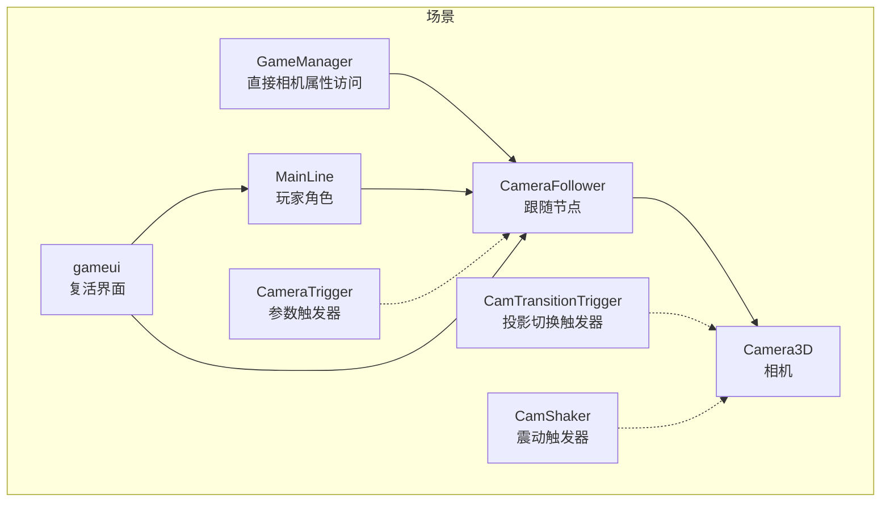
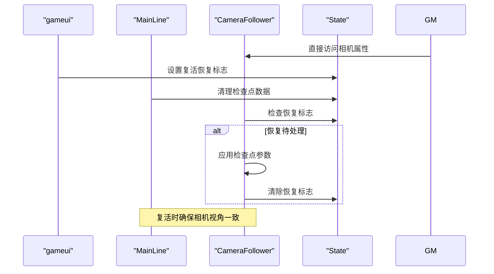
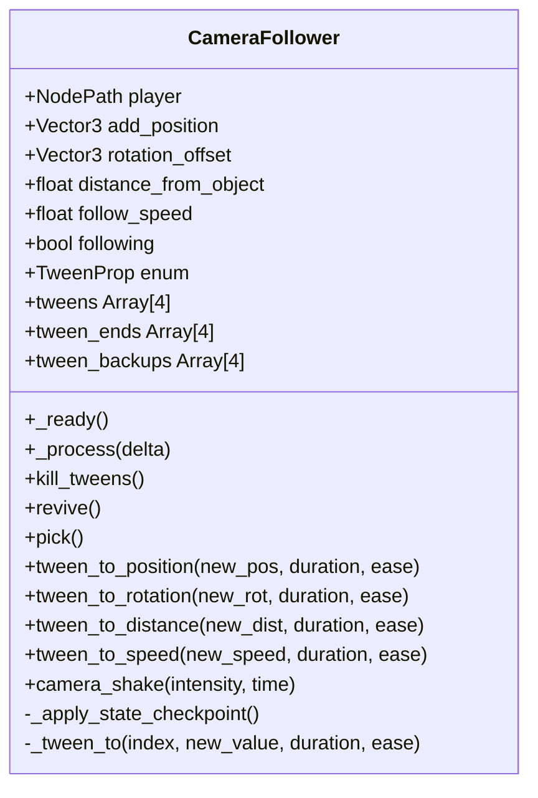
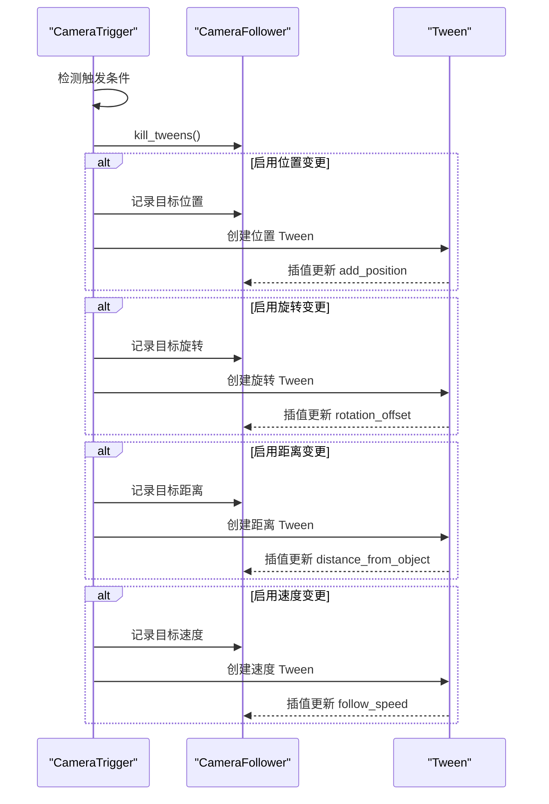
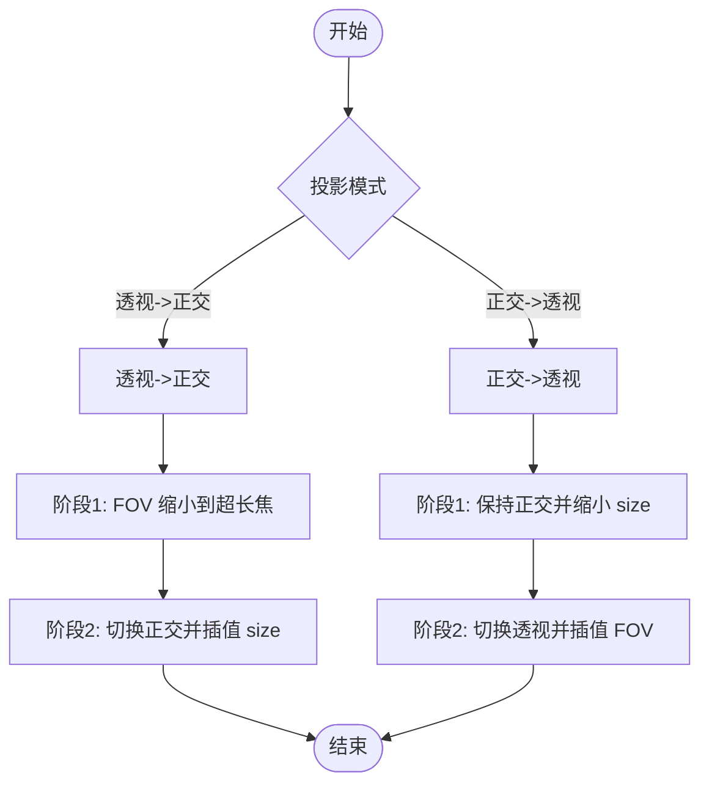
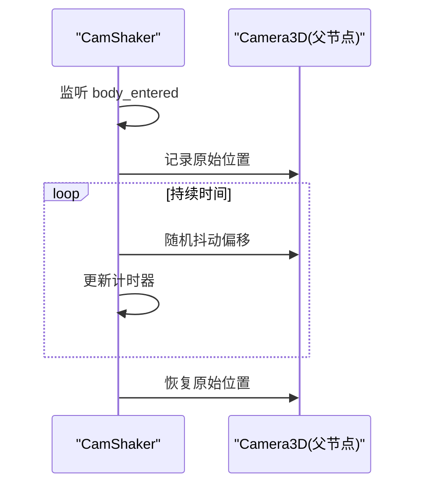
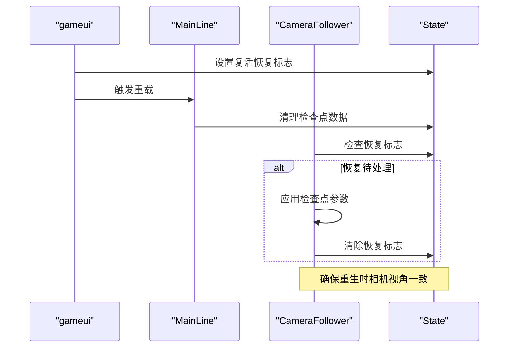
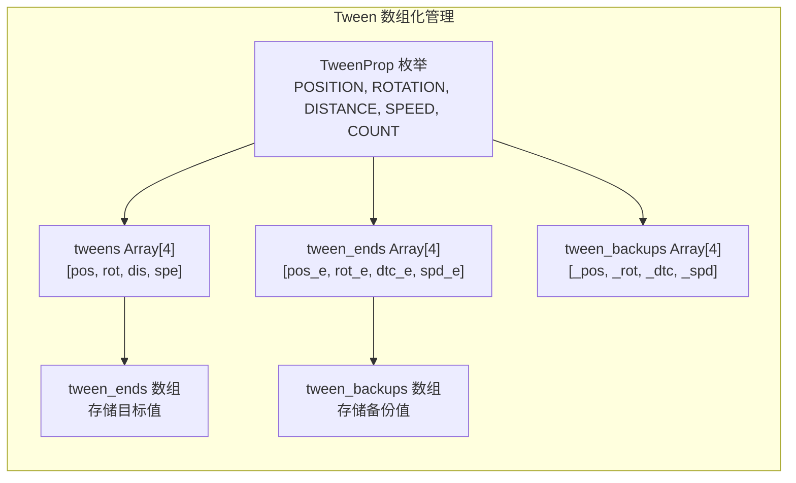
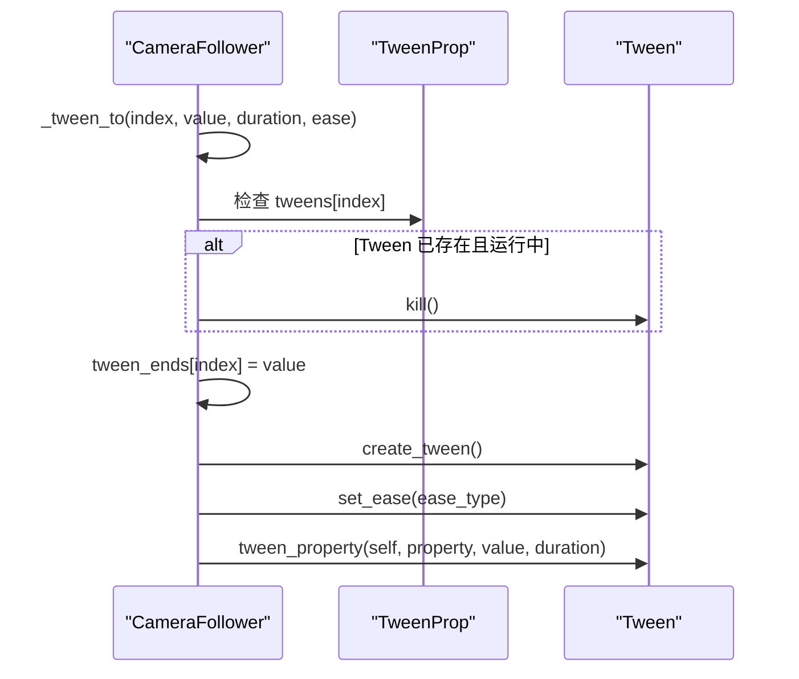
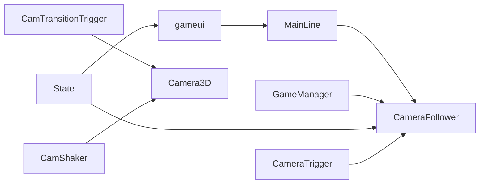

# 相机跟随系统

<cite>
**本文引用的文件**
- [CameraFollower.gd](file://#Template/[Scripts]/CameraScripts/CameraFollower.gd)
- [CamShaker.gd](file://#Template/[Scripts]/CameraScripts/CamShaker.gd)
- [CamTransitionTrigger.gd](file://#Template/[Scripts]/CameraScripts/CamTransitionTrigger.gd)
- [CameraTrigger.gd](file://#Template/[Scripts]/CameraScripts/CameraTrigger.gd)
- [State.gd](file://#Template/[Scripts]/State.gd)
- [GameManager.gd](file://#Template/[Scripts]/GameManager.gd)
- [MainLine.gd](file://#Template/[Scripts]/MainLine.gd)
- [Scene.tscn](file://#Template/[Scenes]/Scene.tscn)
- [gameui.gd](file://#Template/[Scripts]/gameui.gd)
</cite>

## 更新摘要
**所做更改**
- 新增了Tween数组化管理的详细说明，从单个Tween变量转变为枚举索引的TweenProp数组
- 更新了相机复活恢复功能的技术细节，包括状态检查点机制的完整分析
- 增强了相机跟随系统的可维护性和可扩展性架构说明
- 补充了新的相机状态备份与恢复机制的技术实现
- 更新了依赖关系分析，反映Tween数组化管理的架构改进

## 目录
1. [简介](#简介)
2. [项目结构](#项目结构)
3. [核心组件](#核心组件)
4. [架构总览](#架构总览)
5. [详细组件分析](#详细组件分析)
6. [Tween数组化管理架构](#tween数组化管理架构)
7. [依赖关系分析](#依赖关系分析)
8. [性能考虑](#性能考虑)
9. [故障排查指南](#故障排查指南)
10. [结论](#结论)
11. [附录](#附录)

## 简介
本文件系统化阐述相机跟随系统的设计与实现，重点覆盖 CameraFollower 的智能跟随算法、相机位置计算机制、平滑跟随、距离控制、角度调整、参数配置、响应延迟与边界限制等核心功能；同时给出使用示例、自定义配置方法、性能优化与流畅度调优策略，并深入解析 Tween 数组化管理、状态检查点机制以及复活恢复功能等高级特性。

**更新** 本版本特别强调了相机跟随系统通过 GameManager 直接访问相机属性的简化架构，以及优化的复活功能相机状态恢复机制。系统现已采用枚举索引的 TweenProp 数组管理多个 Tween 实例，提供了更好的可维护性和可扩展性。

## 项目结构
相机跟随系统位于模板脚本目录的 CameraScripts 子目录中，配合场景 Scene.tscn 完成节点装配与导出路径绑定。主要文件包括：
- CameraFollower.gd：相机跟随核心逻辑与 Tween 数组化管理接口
- CamShaker.gd：基于 Area3D 的相机震动触发器
- CamTransitionTrigger.gd：投影模式切换（正交/透视）的过渡动画
- CameraTrigger.gd：基于触发器的相机参数变更（位置、旋转、距离、速度）
- State.gd：全局状态存储（含相机检查点）
- GameManager.gd：游戏管理器（与相机联动，提供直接属性访问）
- MainLine.gd：玩家角色（作为相机跟随目标）
- Scene.tscn：场景装配与节点路径绑定
- gameui.gd：游戏界面（包含复活功能）

**图表来源**
- [Scene.tscn:40-66](file://#Template/[Scenes]/Scene.tscn#L40-L66)
- [CameraFollower.gd:1-139](file://#Template/[Scripts]/CameraScripts/CameraFollower.gd#L1-L139)
- [CameraTrigger.gd:1-74](file://#Template/[Scripts]/CameraScripts/CameraTrigger.gd#L1-L74)
- [CamTransitionTrigger.gd:1-125](file://#Template/[Scripts]/CameraScripts/CamTransitionTrigger.gd#L1-L125)
- [CamShaker.gd:1-37](file://#Template/[Scripts]/CameraScripts/CamShaker.gd#L1-L37)
- [gameui.gd:1-69](file://#Template/[Scripts]/gameui.gd#L1-L69)

**章节来源**
- [Scene.tscn:40-66](file://#Template/[Scenes]/Scene.tscn#L40-L66)
- [CameraFollower.gd:1-139](file://#Template/[Scripts]/CameraScripts/CameraFollower.gd#L1-L139)

## 核心组件
- CameraFollower：负责根据目标节点（玩家）实时计算相机位置，提供平滑插值、参数 Tween 数组化动画、状态检查点与复活恢复、临时跳过跟随等能力。
- CameraTrigger：在触发时对相机参数进行 Tween 动画式变更，支持位置、旋转、距离、跟随速度四维参数。
- CamTransitionTrigger：在正交与透视投影之间进行平滑过渡，包含两阶段切换与缓动曲线。
- CamShaker：基于 Area3D 的震动触发器，对相机父节点进行随机抖动。
- State：全局状态容器，保存相机跟随参数的检查点与恢复标志位。
- GameManager/MainLine：与相机系统协作的游戏管理与玩家角色。
- gameui：游戏界面，提供复活功能并管理相机恢复状态。

**更新** GameManager 现在提供直接的相机属性访问，简化了相机跟随系统的依赖关系，提高了代码的可靠性。同时，新增的复活恢复机制确保了重生时相机视角的一致性。

**章节来源**
- [CameraFollower.gd:1-139](file://#Template/[Scripts]/CameraScripts/CameraFollower.gd#L1-L139)
- [CameraTrigger.gd:1-74](file://#Template/[Scripts]/CameraScripts/CameraTrigger.gd#L1-L74)
- [CamTransitionTrigger.gd:1-125](file://#Template/[Scripts]/CameraScripts/CamTransitionTrigger.gd#L1-L125)
- [CamShaker.gd:1-37](file://#Template/[Scripts]/CameraScripts/CamShaker.gd#L1-L37)
- [State.gd:1-190](file://#Template/[Scripts]/State.gd#L1-L190)
- [GameManager.gd:1-46](file://#Template/[Scripts]/GameManager.gd#L1-L46)
- [MainLine.gd:1-214](file://#Template/[Scripts]/MainLine.gd#L1-L214)
- [gameui.gd:1-69](file://#Template/[Scripts]/gameui.gd#L1-L69)

## 架构总览
相机跟随系统采用"跟随节点 + 参数触发器 + 投影切换 + 震动触发"的分层设计：
- 跟随节点：CameraFollower 通过目标节点位置与偏移量计算相机目标位置，使用球面插值实现平滑跟随。
- 参数触发器：CameraTrigger 在特定事件或时间点对相机参数发起 Tween 动画，保证过渡自然。
- 投影切换：CamTransitionTrigger 在正交与透视间进行两阶段过渡，避免视觉突变。
- 震动触发：CamShaker 基于 Area3D 区域触发，对相机父节点进行随机抖动。
- 状态管理：State 提供相机参数检查点与恢复标志位，配合 CameraFollower 的复活恢复流程。
- 复活机制：gameui 控制复活流程，设置相机恢复状态标志，CameraFollower 在加载时自动应用检查点。

**更新** 架构现在通过 GameManager 提供统一的相机属性访问入口，简化了场景搜索逻辑，提高了系统的稳定性和可维护性。同时，新增的复活恢复机制通过状态检查点确保重生时相机视角的一致性。

**图表来源**
- [Scene.tscn:40-66](file://#Template/[Scenes]/Scene.tscn#L40-L66)
- [CameraFollower.gd:34-73](file://#Template/[Scripts]/CameraScripts/CameraFollower.gd#L34-L73)
- [gameui.gd:58-58](file://#Template/[Scripts]/gameui.gd#L58-L58)
- [MainLine.gd:110-115](file://#Template/[Scripts]/MainLine.gd#L110-L115)

## 详细组件分析

### CameraFollower 组件
CameraFollower 是相机跟随的核心节点，负责：
- 目标定位：基于 player_node 的 position 与 add_position 偏移计算目标位置
- 平滑跟随：使用球面插值（slerp）按 follow_speed 与 delta 实现平滑过渡
- 参数控制：distance_from_object 控制相机到目标的距离；rotation_offset 控制初始旋转
- **更新** Tween 数组化管理：使用枚举索引的 TweenProp 数组管理多个 Tween 实例，支持位置、旋转、距离、速度的独立 Tween 动画
- 状态检查点：从 State 恢复相机参数，应用后标记恢复完成
- 复活恢复：将缓存的参数回填至当前相机状态
- 临时跳过：在恢复或强制重置时跳过一次插值，直接定位到目标

**更新** CameraFollower 现在通过 GameManager 提供的直接属性访问机制，简化了相机属性的获取方式，提高了代码的可靠性和维护性。同时，新增的复活恢复机制通过 `_apply_state_checkpoint()` 函数确保重生时相机视角的一致性。

**图表来源**
- [CameraFollower.gd:1-139](file://#Template/[Scripts]/CameraScripts/CameraFollower.gd#L1-L139)

**章节来源**
- [CameraFollower.gd:1-139](file://#Template/[Scripts]/CameraScripts/CameraFollower.gd#L1-L139)

### CameraTrigger 组件
CameraTrigger 在触发时对 CameraFollower 的参数发起 Tween 动画，支持：
- 位置：add_position
- 旋转：rotation_offset
- 距离：distance_from_object
- 跟随速度：follow_speed
- 支持按需启用/禁用各维度的变更
- 支持基于时间的触发（读取 MainLine 的动画播放进度）

**图表来源**
- [CameraTrigger.gd:53-74](file://#Template/[Scripts]/CameraScripts/CameraTrigger.gd#L53-L74)
- [CameraFollower.gd:97-119](file://#Template/[Scripts]/CameraScripts/CameraFollower.gd#L97-L119)

**章节来源**
- [CameraTrigger.gd:1-74](file://#Template/[Scripts]/CameraScripts/CameraTrigger.gd#L1-L74)

### CamTransitionTrigger 组件
CamTransitionTrigger 在正交与透视投影之间进行平滑过渡，分为两个阶段：
- 透视→正交：先将 FOV 缩小到接近正交的超长焦，再切换到正交并插值 size
- 正交→透视：先将 size 缩小到视觉压缩，再切换到透视并插值 FOV
- 使用 Tween 的缓动与过渡类型，保证视觉连贯

**图表来源**
- [CamTransitionTrigger.gd:31-125](file://#Template/[Scripts]/CameraScripts/CamTransitionTrigger.gd#L31-L125)

**章节来源**
- [CamTransitionTrigger.gd:1-125](file://#Template/[Scripts]/CameraScripts/CamTransitionTrigger.gd#L1-L125)

### CamShaker 组件
CamShaker 基于 Area3D 的进入事件触发相机震动，对相机父节点进行随机抖动，支持强度与持续时间配置。

**图表来源**
- [CamShaker.gd:30-37](file://#Template/[Scripts]/CameraScripts/CamShaker.gd#L30-L37)

**章节来源**
- [CamShaker.gd:1-37](file://#Template/[Scripts]/CameraScripts/CamShaker.gd#L1-L37)

### 状态检查点与复活恢复
State 提供相机跟随参数的检查点与恢复标志位，CameraFollower 在就绪时检测并应用检查点，随后标记恢复完成。MainLine 在重载时清空检查点并重置相机参数。gameui 控制复活流程，设置相机恢复状态标志。

**更新** 复活恢复机制通过以下流程确保相机视角一致性：
- gameui 在复活时设置 `State.camera_checkpoint.restore_pending = true`
- MainLine 重载时清理所有检查点数据
- CameraFollower 在 `_ready()` 和 `_process()` 中检测恢复标志
- `_apply_state_checkpoint()` 函数应用检查点参数并清除标志

**图表来源**
- [State.gd:19-27](file://#Template/[Scripts]/State.gd#L19-L27)
- [CameraFollower.gd:34-73](file://#Template/[Scripts]/CameraScripts/CameraFollower.gd#L34-L73)
- [MainLine.gd:110-115](file://#Template/[Scripts]/MainLine.gd#L110-L115)
- [gameui.gd:58-58](file://#Template/[Scripts]/gameui.gd#L58-L58)

**章节来源**
- [State.gd:1-190](file://#Template/[Scripts]/State.gd#L1-L190)
- [CameraFollower.gd:34-73](file://#Template/[Scripts]/CameraScripts/CameraFollower.gd#L34-L73)
- [MainLine.gd:110-115](file://#Template/[Scripts]/MainLine.gd#L110-L115)
- [gameui.gd:58-58](file://#Template/[Scripts]/gameui.gd#L58-L58)

## Tween数组化管理架构

### 枚举索引系统
CameraFollower 现已采用枚举索引的 TweenProp 数组管理系统，提供更好的可维护性和可扩展性：

**图表来源**
- [CameraFollower.gd:13-29](file://#Template/[Scripts]/CameraScripts/CameraFollower.gd#L13-L29)

### 数组化管理的优势
- **类型安全**：通过枚举索引确保数组访问的正确性
- **可维护性**：统一的数组结构便于管理和扩展
- **性能优化**：避免重复的 Tween 实例创建和销毁
- **状态同步**：数组索引与属性名称一一对应，确保状态同步

### 核心数组结构
- **tweens**：存储当前运行的 Tween 实例数组
- **tween_ends**：存储每个属性的目标值数组
- **tween_backups**：存储每个属性的备份值数组
- **TWEEN_PROPERTIES**：属性名称映射数组

**章节来源**
- [CameraFollower.gd:13-29](file://#Template/[Scripts]/CameraScripts/CameraFollower.gd#L13-L29)
- [CameraFollower.gd:76-119](file://#Template/[Scripts]/CameraScripts/CameraFollower.gd#L76-L119)

### Tween操作流程

**图表来源**
- [CameraFollower.gd:97-103](file://#Template/[Scripts]/CameraScripts/CameraFollower.gd#L97-L103)

**章节来源**
- [CameraFollower.gd:97-103](file://#Template/[Scripts]/CameraScripts/CameraFollower.gd#L97-L103)

## 依赖关系分析
- CameraFollower 依赖：
  - 目标节点（MainLine）的位置与状态
  - GameManager 提供的直接相机属性访问
  - State 的检查点数据
- CameraTrigger 依赖：
  - 目标 CameraFollower 节点
  - MainLine 的动画播放进度（可选）
- CamTransitionTrigger 依赖：
  - Camera3D 的投影模式与 FOV/size
- CamShaker 依赖：
  - Area3D 的进入事件与相机父节点
- gameui 依赖：
  - State 的复活状态标志
  - MainLine 的重载功能

**更新** 依赖关系现在通过 GameManager 提供统一的相机属性访问，简化了场景搜索逻辑，提高了系统的稳定性和可维护性。同时，新增的复活恢复流程通过 gameui、MainLine 和 State 的协同工作，确保了相机状态的正确恢复。

**图表来源**
- [Scene.tscn:40-66](file://#Template/[Scenes]/Scene.tscn#L40-L66)
- [CameraFollower.gd:10-11](file://#Template/[Scripts]/CameraScripts/CameraFollower.gd#L10-L11)
- [CameraTrigger.gd:20-27](file://#Template/[Scripts]/CameraScripts/CameraTrigger.gd#L20-L27)
- [CamTransitionTrigger.gd:8](file://#Template/[Scripts]/CameraScripts/CamTransitionTrigger.gd#L8)
- [CamShaker.gd:3](file://#Template/[Scripts]/CameraScripts/CamShaker.gd#L3)
- [gameui.gd:58-58](file://#Template/[Scripts]/gameui.gd#L58-L58)

**章节来源**
- [Scene.tscn:40-66](file://#Template/[Scenes]/Scene.tscn#L40-L66)
- [CameraFollower.gd:10-11](file://#Template/[Scripts]/CameraScripts/CameraFollower.gd#L10-L11)
- [CameraTrigger.gd:20-27](file://#Template/[Scripts]/CameraScripts/CameraTrigger.gd#L20-L27)
- [CamTransitionTrigger.gd:8](file://#Template/[Scripts]/CameraScripts/CamTransitionTrigger.gd#L8)
- [CamShaker.gd:3](file://#Template/[Scripts]/CameraScripts/CamShaker.gd#L3)
- [gameui.gd:58-58](file://#Template/[Scripts]/gameui.gd#L58-L58)

## 性能考虑
- 插值平滑：使用球面插值（slerp）与 delta 时间驱动，避免固定帧率差异导致的跳跃感。
- **更新** Tween 数组化管理：通过枚举索引的数组结构，减少 Tween 实例的创建和销毁开销，提高内存使用效率。
- 条件暂停：当目标处于停止或结束状态时，停止相机跟随并清理 Tween，降低无效计算。
- 抖动优化：震动过程按帧等待，避免阻塞主线程；建议合理设置强度与持续时间。
- 投影切换：使用两阶段过渡与缓动曲线，避免瞬时视觉冲击；建议根据场景规模调整过渡时长。
- **更新** GameManager 直接属性访问：通过 GameManager 提供的直接相机属性访问，减少了场景搜索的开销，提高了性能稳定性。
- **新增** 复活恢复优化：CameraFollower 通过 `_checkpoint_applied` 标志避免重复应用检查点，提高复活时的性能表现。

## 故障排查指南
- 相机不跟随
  - 检查 Scene.tscn 中 GameManager 的相机路径是否正确指向 CameraFollower/Camera3D
  - 确认 CameraFollower 的 player 节点路径有效
  - **新增** 验证 GameManager 的 Camera 属性是否正确设置
- 参数变更无效
  - 确认 CameraTrigger 的 set_camera 路径正确
  - 检查触发器是否被 one-shot 或过滤器阻止
  - **新增** 确认 GameManager 提供的相机属性访问正常工作
- **更新** Tween 数组化管理问题
  - 检查 TweenProp 枚举索引是否正确
  - 验证 tweens、tween_ends、tween_backups 数组长度一致
  - 确认 TWEEN_PROPERTIES 数组中的属性名称与实际属性匹配
- 投影切换异常
  - 确认 CamTransitionTrigger 的 camera 引用有效
  - 检查投影模式枚举值与切换阈值
- 震动无效果
  - 确认 CamShaker 的 camera_parent 指向 Camera3D 的父节点
  - 检查 Area3D 的碰撞体与触发事件连接
- **新增** 复活功能问题
  - 检查 gameui 是否正确设置 `State.camera_checkpoint.restore_pending = true`
  - 确认 MainLine 的 `reload()` 方法是否清理了检查点数据
  - 验证 CameraFollower 的 `_apply_state_checkpoint()` 是否被调用
  - 检查 State 中的相机检查点数据是否正确保存
- **新增** GameManager 相关问题
  - 检查 GameManager 的 Camera 属性是否正确导出
  - 验证 GameManager 与场景的连接关系
  - 确认 GameManager 的相机属性访问权限设置正确

**章节来源**
- [Scene.tscn:40-66](file://#Template/[Scenes]/Scene.tscn#L40-L66)
- [CameraTrigger.gd:20-27](file://#Template/[Scripts]/CameraScripts/CameraTrigger.gd#L20-L27)
- [CamTransitionTrigger.gd:8](file://#Template/[Scripts]/CameraScripts/CamTransitionTrigger.gd#L8)
- [CamShaker.gd:3](file://#Template/[Scripts]/CameraScripts/CamShaker.gd#L3)
- [gameui.gd:58-58](file://#Template/[Scripts]/gameui.gd#L58-L58)
- [MainLine.gd:110-115](file://#Template/[Scripts]/MainLine.gd#L110-L115)

## 结论
相机跟随系统通过 CameraFollower 的智能插值算法与参数化的 Tween 数组化动画，实现了平滑、可控且可扩展的跟随体验；结合状态检查点、复活恢复、投影切换与震动触发，满足了复杂关卡与动态场景的需求。通过引入 GameManager 的直接属性访问机制和 Tween 数组化管理架构，系统架构得到了显著简化，提高了代码的可靠性和维护性。**新增的复活恢复机制**通过状态检查点确保了重生时相机视角的一致性，为玩家提供了无缝的游戏体验。**Tween 数组化管理**提供了更好的可维护性和性能表现，通过枚举索引确保了类型安全和状态同步。通过合理的参数配置与性能优化策略，可在不同设备上获得稳定的流畅度表现。

## 附录

### 使用示例与自定义配置
- 场景装配
  - 在 Scene.tscn 中将 GameManager 的 Camera 指向 CameraFollower/Camera3D
  - 在 CameraFollower 中设置 player 节点路径为主线角色
- 参数配置
  - add_position：相机相对角色的偏移量
  - rotation_offset：初始旋转（度）
  - distance_from_object：相机到角色的距离
  - follow_speed：跟随插值系数（越大越快）
- 触发器使用
  - 在 CameraTrigger 中选择启用的参数维度，设置目标值与动画时长
  - 可选使用时间判定，基于 MainLine 的动画进度触发
- 投影切换
  - 在 CamTransitionTrigger 中设置过渡时长、正交 size 与透视 FOV
- 震动效果
  - 在 CamShaker 中设置强度与持续时间，确保 camera_parent 指向相机父节点
- **新增** 复活功能配置
  - 在 gameui 中正确设置复活状态标志
  - 确保 MainLine 的 `reload()` 方法清理检查点数据
  - 验证 CameraFollower 的复活恢复流程
- **新增** GameManager 配置
  - 在 GameManager 中正确设置 Camera 属性
  - 确保相机路径指向正确的 Camera3D 节点
  - 验证相机属性的导出设置
- **新增** Tween 数组化管理配置
  - 确保 TweenProp 枚举与数组长度一致
  - 验证 TWEEN_PROPERTIES 数组中的属性名称正确
  - 检查数组初始化时的空值设置

**章节来源**
- [Scene.tscn:40-66](file://#Template/[Scenes]/Scene.tscn#L40-L66)
- [CameraFollower.gd:3-8](file://#Template/[Scripts]/CameraScripts/CameraFollower.gd#L3-L8)
- [CameraTrigger.gd:3-17](file://#Template/[Scripts]/CameraScripts/CameraTrigger.gd#L3-L17)
- [CamTransitionTrigger.gd:3-6](file://#Template/[Scripts]/CameraScripts/CamTransitionTrigger.gd#L3-L6)
- [CamShaker.gd:3-5](file://#Template/[Scripts]/CameraScripts/CamShaker.gd#L3-L5)
- [GameManager.gd:6-7](file://#Template/[Scripts]/GameManager.gd#L6-L7)
- [gameui.gd:58-58](file://#Template/[Scripts]/gameui.gd#L58-L58)
- [MainLine.gd:110-115](file://#Template/[Scripts]/MainLine.gd#L110-L115)