# 相机跟随系统

<cite>
**本文引用的文件**
- [CameraFollower.gd](file://#Template/[Scripts]/CameraScripts/CameraFollower.gd)
- [CameraTrigger.gd](file://#Template/[Scripts]/CameraScripts/CameraTrigger.gd)
- [CameraShakeTrigger.gd](file://#Template/[Scripts]/CameraScripts/CameraShakeTrigger.gd)
- [PreEnding.gd](file://#Template/[Scripts]/Trigger/PreEnding.gd)
- [State.gd](file://#Template/[Scripts]/State.gd)
- [GameManager.gd](file://#Template/[Scripts]/GameManager.gd)
- [Scene.tscn](file://#Template/[Scenes]/Scene.tscn)
</cite>

## 更新摘要
**所做更改**
- 重构了CameraFollower脚本，移除了复杂的树遍历逻辑，简化了相机跟随器集成
- 增强了复活场景下的相机处理，通过_check_point_applied标志避免重复应用检查点
- 更新了旋转模式系统，新增了FastBeyond360、WorldAxisAdd、LocalAxisAdd三种模式
- 简化了GameManager的相机属性访问，通过Camera.get_parent()直接获取CameraFollower
- 移除了Tween数组化管理架构，采用简化的Tween状态管理
- 增强了lerp_to方法的实现，支持更精确的旋转插值
- 更新了相机跟随系统的整体架构，提高了代码的可维护性和性能

## 目录
1. [简介](#简介)
2. [项目结构](#项目结构)
3. [核心组件](#核心组件)
4. [架构总览](#架构总览)
5. [详细组件分析](#详细组件分析)
6. [旋转模式系统](#旋转模式系统)
7. [Tween简化管理架构](#tween简化管理架构)
8. [依赖关系分析](#依赖关系分析)
9. [性能考虑](#性能考虑)
10. [故障排查指南](#故障排查指南)
11. [结论](#结论)
12. [附录](#附录)

## 简介
本文件系统化阐述相机跟随系统的设计与实现，重点覆盖 CameraFollower 的智能跟随算法、相机位置计算机制、平滑跟随、距离控制、角度调整、参数配置、响应延迟与边界限制等核心功能；同时给出使用示例、自定义配置方法、性能优化与流畅度调优策略，并深入解析旋转模式系统、简化Tween管理架构以及复活恢复功能等高级特性。

**更新** 本版本特别强调了CameraFollower脚本的大幅重构，移除了复杂的树遍历逻辑，简化了相机跟随器集成，增强了复活场景下的相机处理。系统现在采用简化的Tween状态管理，提供了更好的可维护性和性能表现。新增的旋转模式系统支持更灵活的相机旋转控制，包括最短路径旋转、超过360度旋转和基于坐标系的旋转模式。

## 项目结构
相机跟随系统位于模板脚本目录的 CameraScripts 子目录中，配合场景 Scene.tscn 完成节点装配与导出路径绑定。主要文件包括：
- CameraFollower.gd：相机跟随核心逻辑与简化的Tween状态管理接口
- CameraTrigger.gd：基于触发器的相机参数变更（位置、旋转、距离、速度）
- CameraShakeTrigger.gd：基于BaseTrigger的相机震动触发器
- PreEnding.gd：预结束触发器，展示lerp_to方法的实际应用
- State.gd：全局状态存储（含相机检查点）
- GameManager.gd：游戏管理器（与相机联动，提供直接属性访问）
- Scene.tscn：场景装配与节点路径绑定

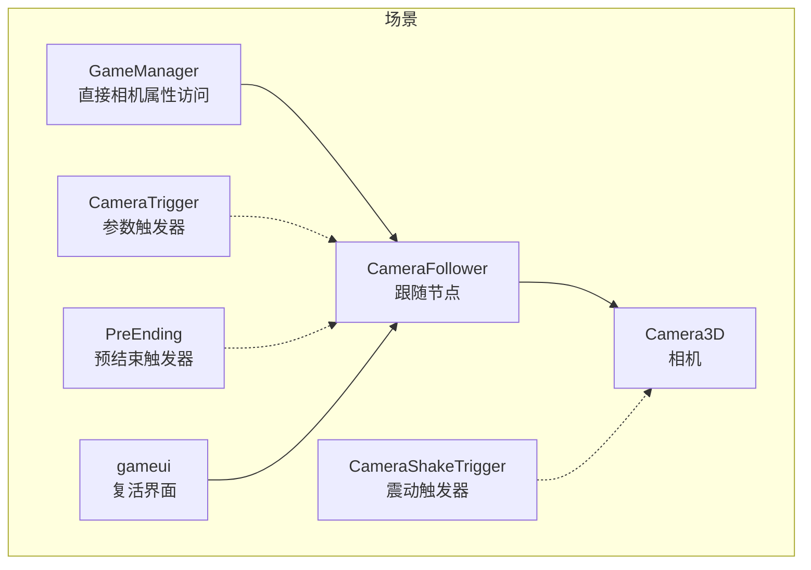

**图表来源**
- [Scene.tscn:40-66](file://#Template/[Scenes]/Scene.tscn#L40-L66)
- [CameraFollower.gd:1-146](file://#Template/[Scripts]/CameraScripts/CameraFollower.gd#L1-L146)
- [CameraTrigger.gd:1-112](file://#Template/[Scripts]/CameraScripts/CameraTrigger.gd#L1-L112)
- [PreEnding.gd:1-31](file://#Template/[Scripts]/Trigger/PreEnding.gd#L1-L31)
- [CameraShakeTrigger.gd:1-33](file://#Template/[Scripts]/CameraScripts/CameraShakeTrigger.gd#L1-L33)

**章节来源**
- [Scene.tscn:40-66](file://#Template/[Scenes]/Scene.tscn#L40-L66)
- [CameraFollower.gd:1-146](file://#Template/[Scripts]/CameraScripts/CameraFollower.gd#L1-L146)

## 核心组件
- CameraFollower：负责根据目标节点（玩家）实时计算相机位置，提供平滑插值、简化的Tween状态管理、旋转模式控制、状态检查点与复活恢复等功能。**更新** 现在采用简化的Tween状态管理，移除了复杂的数组化架构。
- CameraTrigger：在触发时对相机参数进行Tween动画式变更，支持位置、旋转、距离、跟随速度四维参数，支持多种旋转模式。
- CameraShakeTrigger：基于BaseTrigger的震动触发器，对相机父节点进行随机抖动。
- PreEnding：预结束触发器，展示如何使用 `lerp_to` 方法实现精确的相机运动控制。
- State：全局状态容器，保存相机跟随参数的检查点与恢复标志位。
- GameManager：游戏管理器，提供相机属性的直接访问，简化了相机跟随系统的依赖关系。
- Scene：场景装配与节点路径绑定，定义了相机跟随系统的完整节点树。

**更新** CameraFollower脚本经过大幅重构，移除了复杂的树遍历逻辑，简化了相机跟随器集成。现在通过GameManager提供的直接属性访问机制，简化了相机属性的获取方式，提高了代码的可靠性和维护性。同时，新增的复活恢复机制通过 `_check_point_applied` 标志确保重生时相机视角的一致性。**新增** 旋转模式系统提供了更灵活的相机旋转控制，支持最短路径旋转、超过360度旋转和基于坐标系的旋转模式。

**章节来源**
- [CameraFollower.gd:1-146](file://#Template/[Scripts]/CameraScripts/CameraFollower.gd#L1-L146)
- [CameraTrigger.gd:1-112](file://#Template/[Scripts]/CameraScripts/CameraTrigger.gd#L1-L112)
- [PreEnding.gd:1-31](file://#Template/[Scripts]/Trigger/PreEnding.gd#L1-L31)
- [CameraShakeTrigger.gd:1-33](file://#Template/[Scripts]/CameraScripts/CameraShakeTrigger.gd#L1-L33)
- [State.gd:1-195](file://#Template/[Scripts]/State.gd#L1-L195)
- [GameManager.gd:1-50](file://#Template/[Scripts]/GameManager.gd#L1-L50)
- [Scene.tscn:40-66](file://#Template/[Scenes]/Scene.tscn#L40-L66)

## 架构总览
相机跟随系统采用"跟随节点 + 参数触发器 + 预结束触发器 + 震动触发器"的分层设计：
- 跟随节点：CameraFollower 通过目标节点位置与偏移量计算相机目标位置，使用球面插值实现平滑跟随。**更新** 现在采用简化的Tween状态管理，移除了复杂的数组化架构。
- 参数触发器：CameraTrigger 在特定事件或时间点对相机参数发起Tween动画，支持多种旋转模式，保证过渡自然。
- 预结束触发器：PreEnding 展示了 `lerp_to` 方法的实际应用场景，通过指数插值实现精确的相机运动控制。
- 震动触发器：CameraShakeTrigger 基于BaseTrigger区域触发，对相机父节点进行随机抖动。
- 状态管理：State 提供相机参数检查点与恢复标志位，配合 CameraFollower 的复活恢复流程。
- 复活机制：通过 State 和 GameManager 协同工作，确保重生时相机视角的一致性。

**更新** 架构现在通过 GameManager 提供统一的相机属性访问入口，简化了场景搜索逻辑，提高了系统的稳定性和可维护性。同时，新增的复活恢复机制通过 `_check_point_applied` 标志避免重复应用检查点，提高了复活时的性能表现。**新增** 旋转模式系统提供了更灵活的相机旋转控制，支持最短路径旋转、超过360度旋转和基于坐标系的旋转模式，为开发者提供了更多样化的相机控制选项。

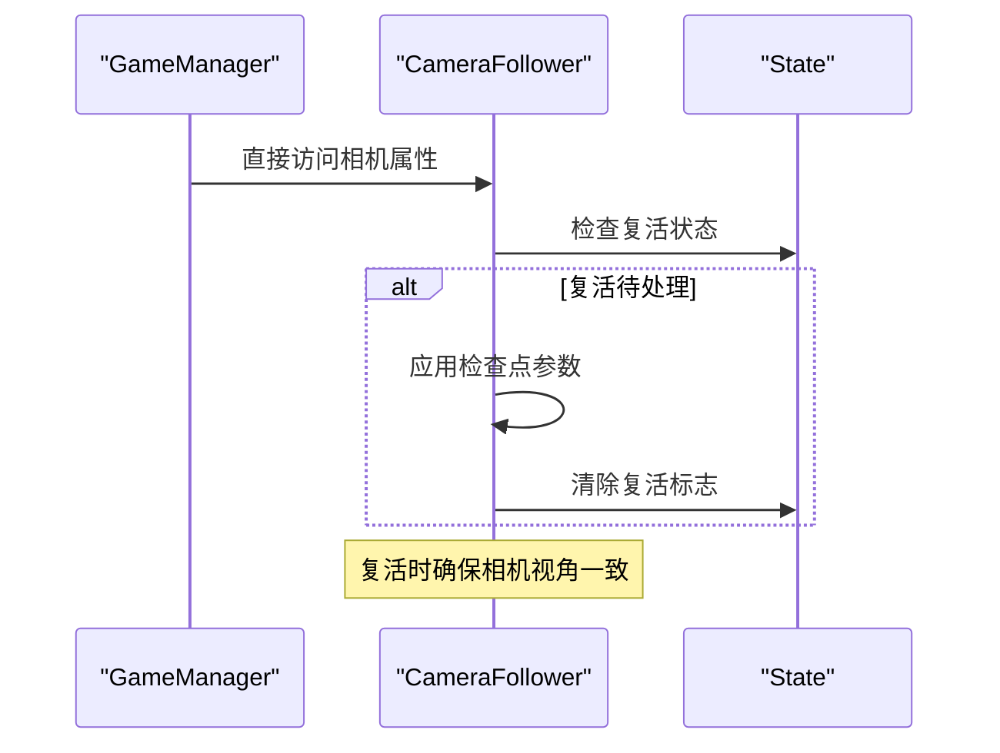

**图表来源**
- [GameManager.gd:10-18](file://#Template/[Scripts]/GameManager.gd#L10-L18)
- [CameraFollower.gd:40-41](file://#Template/[Scripts]/CameraScripts/CameraFollower.gd#L40-L41)
- [State.gd:20-35](file://#Template/[Scripts]/State.gd#L20-L35)

## 详细组件分析

### CameraFollower 组件
CameraFollower 是相机跟随的核心节点，负责：
- 目标定位：基于 player_node 的 position 与 add_position 偏移计算目标位置
- 平滑跟随：使用球面插值（slerp）按 follow_speed 与 delta 实现平滑过渡
- **更新** 简化Tween状态管理：移除了复杂的数组化架构，采用简化的Tween状态变量管理
- 旋转模式控制：支持 Fast、FastBeyond360、WorldAxisAdd、LocalAxisAdd 四种旋转模式
- 参数控制：distance_from_object 控制相机到目标的距离；rotation_offset 控制初始旋转
- 状态检查点：从 State 恢复相机参数，应用后标记恢复完成
- 复活恢复：将缓存的参数回填至当前相机状态，通过 `_check_point_applied` 标志避免重复应用
- 临时跳过：在恢复或强制重置时跳过一次插值，直接定位到目标
- **新增** 增强的lerp_to方法：通过 `lerp_to` 方法实现基于指数衰减的平滑相机移动
- **新增** 旋转模式系统：通过 `_apply_rotate_mode` 方法实现不同的旋转插值算法

**更新** CameraFollower脚本经过大幅重构，移除了复杂的树遍历逻辑，简化了相机跟随器集成。现在通过GameManager提供的直接属性访问机制，简化了相机属性的获取方式，提高了代码的可靠性和维护性。同时，新增的复活恢复机制通过 `_check_point_applied` 标志避免重复应用检查点，提高了复活时的性能表现。**新增** 旋转模式系统提供了更灵活的相机旋转控制，支持最短路径旋转、超过360度旋转和基于坐标系的旋转模式。

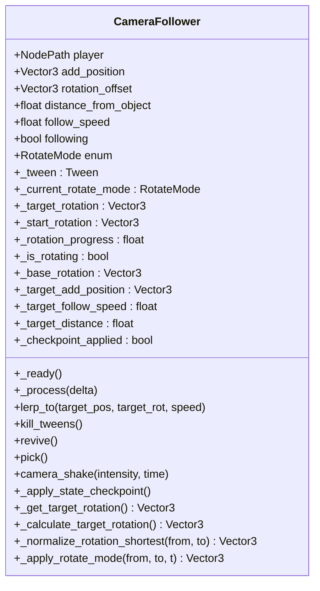

**图表来源**
- [CameraFollower.gd:1-146](file://#Template/[Scripts]/CameraScripts/CameraFollower.gd#L1-L146)

**章节来源**
- [CameraFollower.gd:1-146](file://#Template/[Scripts]/CameraScripts/CameraFollower.gd#L1-L146)

### CameraTrigger 组件
CameraTrigger 在触发时对 CameraFollower 的参数发起 Tween 动画，支持：
- 位置：add_position
- 旋转：rotation_offset
- 距离：distance_from_object
- 跟随速度：follow_speed
- 支持按需启用/禁用各维度的变更
- 支持基于时间的触发（读取MainLine的动画播放进度）
- **更新** 通过GameManager提供的相机属性访问，简化了触发器的实现
- **新增** 支持多种旋转模式：Fast、FastBeyond360、WorldAxisAdd、LocalAxisAdd

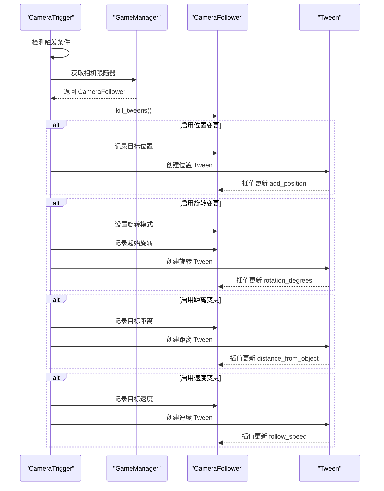

**图表来源**
- [CameraTrigger.gd:28-35](file://#Template/[Scripts]/CameraScripts/CameraTrigger.gd#L28-L35)
- [CameraTrigger.gd:60-112](file://#Template/[Scripts]/CameraScripts/CameraTrigger.gd#L60-L112)
- [GameManager.gd:10-18](file://#Template/[Scripts]/GameManager.gd#L10-L18)

**章节来源**
- [CameraTrigger.gd:1-112](file://#Template/[Scripts]/CameraScripts/CameraTrigger.gd#L1-L112)
- [GameManager.gd:10-18](file://#Template/[Scripts]/GameManager.gd#L10-L18)

### PreEnding 组件
PreEnding 预结束触发器展示了 `lerp_to` 方法的实际应用场景，通过指数插值实现精确的相机运动控制：

- **应用场景**：常用于游戏结束前的特殊镜头效果
- **实现方式**：计算目标位置和旋转，调用 `lerp_to` 方法实现平滑过渡
- **参数控制**：通过 Offset 参数控制相机位置偏移，通过速度参数控制插值速度
- **集成方式**：通过 GameManager 获取相机跟随器实例

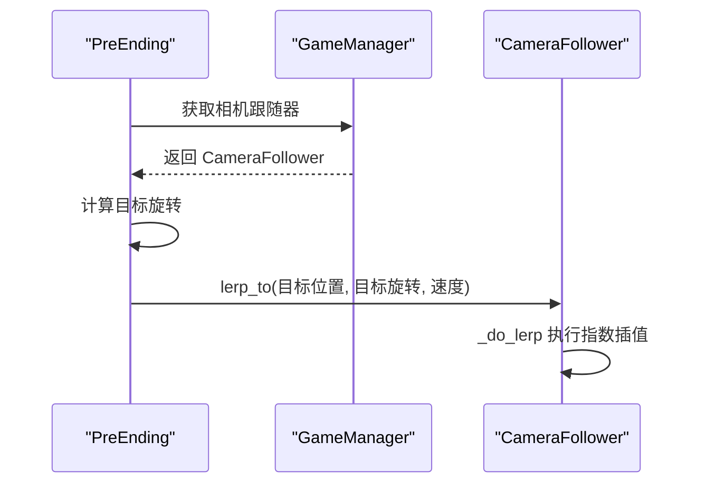

**图表来源**
- [PreEnding.gd:10-21](file://#Template/[Scripts]/Trigger/PreEnding.gd#L10-L21)
- [GameManager.gd:10-18](file://#Template/[Scripts]/GameManager.gd#L10-L18)

**章节来源**
- [PreEnding.gd:1-31](file://#Template/[Scripts]/Trigger/PreEnding.gd#L1-L31)
- [GameManager.gd:10-18](file://#Template/[Scripts]/GameManager.gd#L10-L18)

### CameraShakeTrigger 组件
CameraShakeTrigger 基于BaseTrigger的进入事件触发相机震动，对相机父节点进行随机抖动，支持强度与持续时间配置。

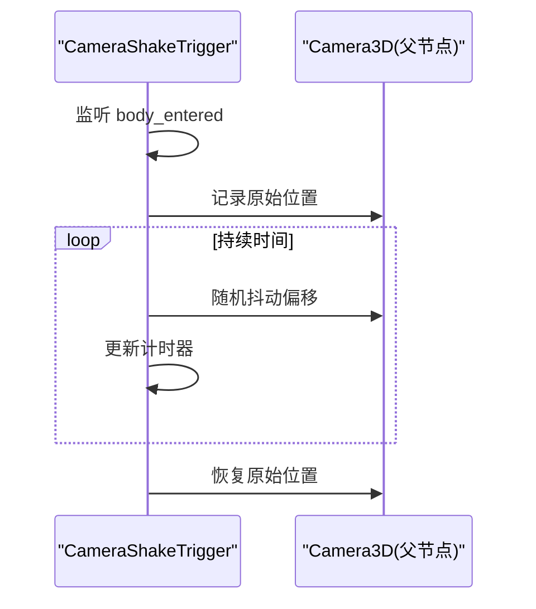

**图表来源**
- [CameraShakeTrigger.gd:13-33](file://#Template/[Scripts]/CameraScripts/CameraShakeTrigger.gd#L13-L33)

**章节来源**
- [CameraShakeTrigger.gd:1-33](file://#Template/[Scripts]/CameraScripts/CameraShakeTrigger.gd#L1-L33)

### 状态检查点与复活恢复
State 提供相机跟随参数的检查点与恢复标志位，CameraFollower 在就绪时检测并应用检查点，随后标记恢复完成。GameManager 提供相机属性的直接访问，简化了状态管理流程。

**更新** 复活恢复机制通过以下流程确保相机视角一致性：
- 通过 GameManager 获取相机跟随器实例
- 检查 State 中的复活状态标志
- 应用检查点参数并清除标志
- 通过 `_check_point_applied` 标志避免重复应用检查点
- 确保重生时相机视角的一致性

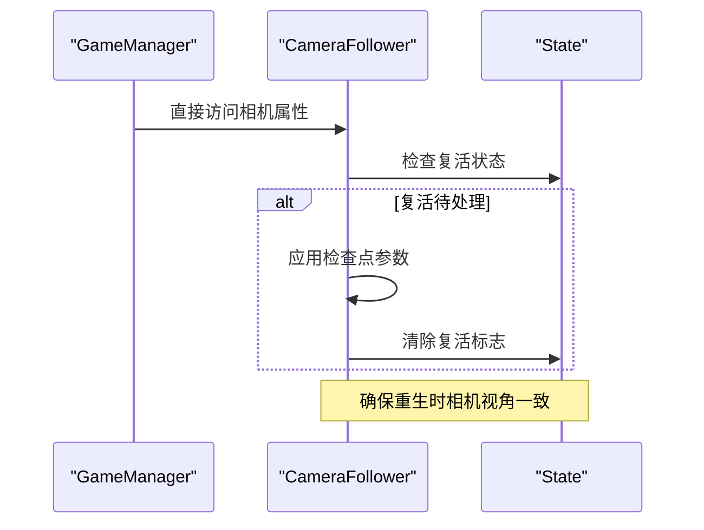

**图表来源**
- [GameManager.gd:10-18](file://#Template/[Scripts]/GameManager.gd#L10-L18)
- [CameraFollower.gd:40-41](file://#Template/[Scripts]/CameraScripts/CameraFollower.gd#L40-L41)
- [State.gd:20-35](file://#Template/[Scripts]/State.gd#L20-L35)

**章节来源**
- [GameManager.gd:10-18](file://#Template/[Scripts]/GameManager.gd#L10-L18)
- [CameraFollower.gd:40-41](file://#Template/[Scripts]/CameraScripts/CameraFollower.gd#L40-L41)
- [State.gd:20-35](file://#Template/[Scripts]/State.gd#L20-L35)

## 旋转模式系统

### 旋转模式枚举
CameraFollower 现在支持四种旋转模式，通过 `RotateMode` 枚举实现：

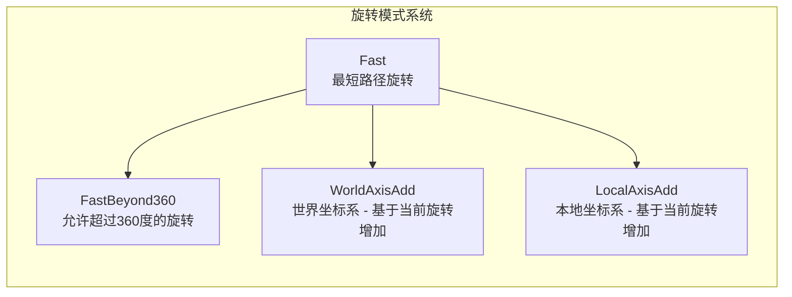

**图表来源**
- [CameraFollower.gd:3-8](file://#Template/[Scripts]/CameraScripts/CameraFollower.gd#L3-L8)

### 旋转模式算法原理
- **Fast模式**：使用 `lerp_angle` 实现每轴的最短路径旋转，避免角度环绕问题
- **FastBeyond360模式**：直接使用线性插值，允许旋转超过360度
- **WorldAxisAdd模式**：基于世界坐标系，将当前旋转与偏移量相加
- **LocalAxisAdd模式**：基于本地坐标系，将当前旋转与偏移量相加

### 旋转模式应用流程
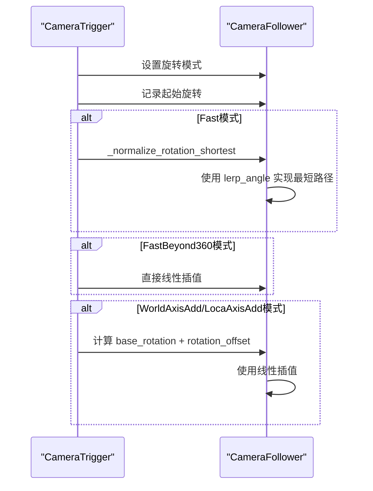

**图表来源**
- [CameraTrigger.gd:78-103](file://#Template/[Scripts]/CameraScripts/CameraTrigger.gd#L78-L103)
- [CameraFollower.gd:89-128](file://#Template/[Scripts]/CameraScripts/CameraFollower.gd#L89-L128)

### 旋转模式对比
- **Fast模式**：适合需要最短路径的场景，避免角度环绕问题
- **FastBeyond360模式**：适合需要连续旋转的场景，允许超过360度
- **WorldAxisAdd模式**：适合基于世界坐标系的旋转控制
- **LocalAxisAdd模式**：适合基于本地坐标系的旋转控制

**章节来源**
- [CameraFollower.gd:3-8](file://#Template/[Scripts]/CameraScripts/CameraFollower.gd#L3-L8)
- [CameraTrigger.gd:78-103](file://#Template/[Scripts]/CameraScripts/CameraTrigger.gd#L78-L103)
- [CameraFollower.gd:89-128](file://#Template/[Scripts]/CameraScripts/CameraFollower.gd#L89-L128)

## Tween简化管理架构

### 简化Tween状态管理
CameraFollower 现已采用简化的Tween状态管理，移除了复杂的数组化架构：

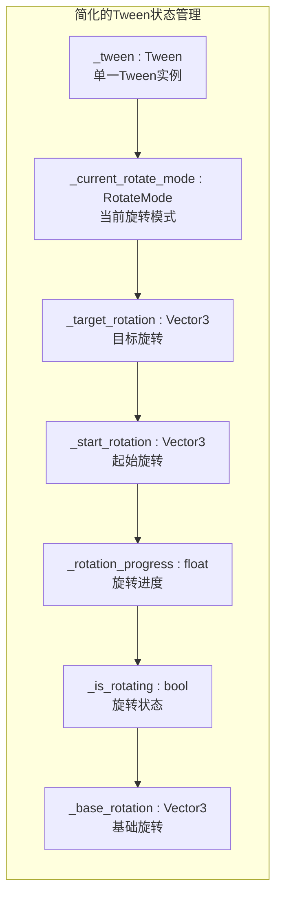

**图表来源**
- [CameraFollower.gd:22-32](file://#Template/[Scripts]/CameraScripts/CameraFollower.gd#L22-L32)

### 简化管理的优势
- **类型安全**：单一Tween实例避免了数组索引错误
- **可维护性**：简化的状态变量便于理解和维护
- **性能优化**：避免了数组操作的开销，提高了执行效率
- **状态同步**：单一状态变量确保了状态的一致性

### 核心状态变量
- **_tween**：当前运行的Tween实例
- **_current_rotate_mode**：当前旋转模式
- **_target_rotation**：目标旋转值
- **_start_rotation**：起始旋转值
- **_rotation_progress**：旋转进度（0-1）
- **_is_rotating**：旋转状态标志
- **_base_rotation**：基础旋转值（用于累加模式）

**章节来源**
- [CameraFollower.gd:22-32](file://#Template/[Scripts]/CameraScripts/CameraFollower.gd#L22-L32)
- [CameraFollower.gd:130-146](file://#Template/[Scripts]/CameraScripts/CameraFollower.gd#L130-L146)

### Tween操作流程
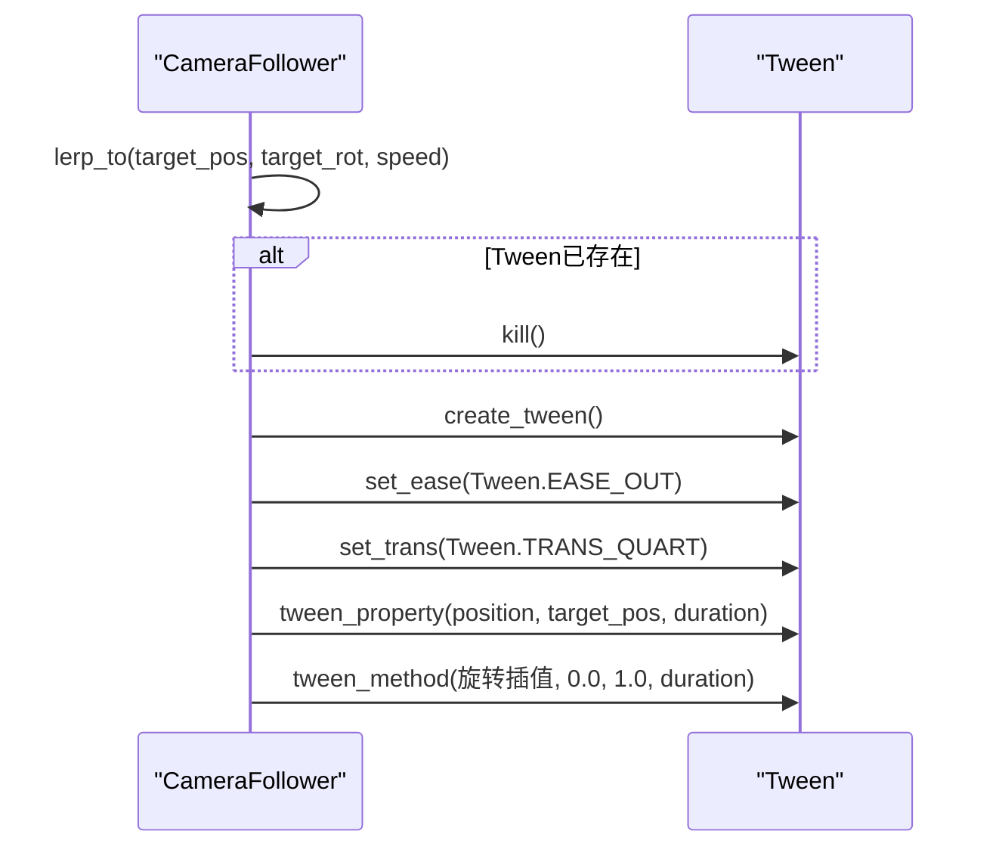

**图表来源**
- [CameraFollower.gd:130-146](file://#Template/[Scripts]/CameraScripts/CameraFollower.gd#L130-L146)

**章节来源**
- [CameraFollower.gd:130-146](file://#Template/[Scripts]/CameraScripts/CameraFollower.gd#L130-L146)

## 依赖关系分析
- CameraFollower 依赖：
  - 目标节点（MainLine）的位置与状态
  - GameManager 提供的直接相机属性访问
  - State 的检查点数据
- CameraTrigger 依赖：
  - GameManager 提供的相机跟随器实例
  - MainLine 的动画播放进度（可选）
  - 旋转模式系统
- PreEnding 依赖：
  - GameManager 提供的相机跟随器实例
  - 目标位置和旋转的计算
- CameraShakeTrigger 依赖：
  - BaseTrigger 的进入事件与相机父节点
- GameManager 依赖：
  - Camera3D 的父节点（CameraFollower）
  - Scene 的节点树结构

**更新** 依赖关系现在通过 GameManager 提供统一的相机属性访问，简化了场景搜索逻辑，提高了系统的稳定性和可维护性。同时，新增的复活恢复流程通过 GameManager、CameraFollower 和 State 的协同工作，确保了相机状态的正确恢复。**新增** 旋转模式系统不依赖外部组件，完全在 CameraFollower 内部实现，通过 CameraTrigger 展示了其在实际场景中的应用价值。

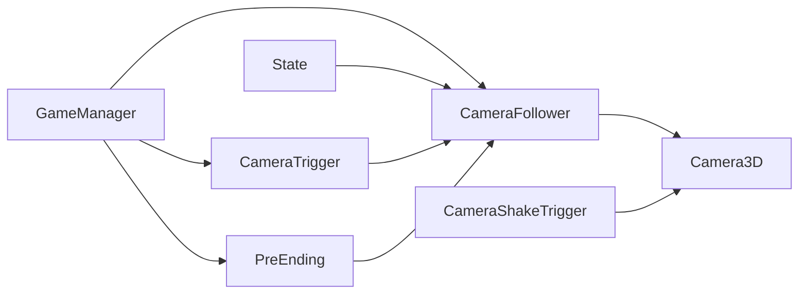

**图表来源**
- [GameManager.gd:10-18](file://#Template/[Scripts]/GameManager.gd#L10-L18)
- [CameraFollower.gd:17-18](file://#Template/[Scripts]/CameraScripts/CameraFollower.gd#L17-L18)
- [CameraTrigger.gd:28-35](file://#Template/[Scripts]/CameraScripts/CameraTrigger.gd#L28-L35)
- [PreEnding.gd:10-11](file://#Template/[Scripts]/Trigger/PreEnding.gd#L10-L11)

**章节来源**
- [GameManager.gd:10-18](file://#Template/[Scripts]/GameManager.gd#L10-L18)
- [CameraFollower.gd:17-18](file://#Template/[Scripts]/CameraScripts/CameraFollower.gd#L17-L18)
- [CameraTrigger.gd:28-35](file://#Template/[Scripts]/CameraScripts/CameraTrigger.gd#L28-L35)
- [PreEnding.gd:10-11](file://#Template/[Scripts]/Trigger/PreEnding.gd#L10-L11)

## 性能考虑
- 插值平滑：使用球面插值（slerp）与 delta 时间驱动，避免固定帧率差异导致的跳跃感。
- **更新** 简化Tween状态管理：通过简化的状态变量管理，减少Tween实例的创建和销毁开销，提高内存使用效率。
- 条件暂停：当目标处于停止或结束状态时，停止相机跟随并清理 Tween，降低无效计算。
- 抖动优化：震动过程按帧等待，避免阻塞主线程；建议合理设置强度与持续时间。
- **更新** GameManager 直接属性访问：通过 GameManager 提供的直接相机属性访问，减少了场景搜索的开销，提高了性能稳定性。
- **新增** 复活恢复优化：CameraFollower 通过 `_check_point_applied` 标志避免重复应用检查点，提高复活时的性能表现。
- **新增** 旋转模式优化：`_apply_rotate_mode` 方法使用高效的条件判断，避免不必要的计算。
- **新增** 预结束触发器优化：PreEnding 通过 GameManager 直接获取相机跟随器，避免了场景搜索的开销。

## 故障排查指南
- 相机不跟随
  - 检查 Scene.tscn 中 GameManager 的相机路径是否正确指向 CameraFollower/Camera3D
  - 确认 CameraFollower 的 player 节点路径有效
  - **新增** 验证 GameManager 的 Camera 属性是否正确设置
- 参数变更无效
  - 确认 CameraTrigger 的 set_camera 路径正确
  - 检查触发器是否被 one-shot 或过滤器阻止
  - **新增** 确认 GameManager 提供的相机属性访问正常工作
  - **新增** 验证旋转模式设置是否正确
- **更新** 简化Tween状态管理问题
  - 检查 `_tween` 状态变量是否正确初始化
  - 验证旋转模式状态变量是否正确设置
  - 确认 `_check_point_applied` 标志是否正确使用
- 预结束触发器异常
  - 确认 PreEnding 的 Offset 参数设置正确
  - 检查 GameManager 是否能正确返回相机跟随器实例
  - **新增** 验证 lerp_to 方法的调用参数是否正确
- 抖动无效果
  - 确认 CameraShakeTrigger 的 camera_parent 指向 Camera3D 的父节点
  - 检查 BaseTrigger 的碰撞体与触发事件连接
- **新增** 复活功能问题
  - 检查 gameui 是否正确设置 `State.camera_checkpoint.restore_pending = true`
  - 确认 MainLine 的 `reload()` 方法是否清理了检查点数据
  - 验证 CameraFollower 的 `_apply_state_checkpoint()` 是否被调用
  - 检查 State 中的相机检查点数据是否正确保存
  - **新增** 验证 `_check_point_applied` 标志是否正确设置
- **新增** GameManager 相关问题
  - 检查 GameManager 的 Camera 属性是否正确导出
  - 验证 GameManager 与场景的连接关系
  - 确认 GameManager 的相机属性访问权限设置正确
- **新增** 旋转模式问题
  - 检查 `RotateMode` 枚举设置是否正确
  - 验证 `_apply_rotate_mode` 方法的旋转计算逻辑
  - 确认不同旋转模式下的状态变量设置
  - 检查 `_normalize_rotation_shortest` 方法的角度计算
- **新增** lerp_to方法问题
  - 检查 `lerp_to` 方法的调用参数是否正确
  - 验证 Tween 实例的创建和销毁逻辑
  - 确认旋转插值的 `lerp_angle` 使用是否正确

**章节来源**
- [Scene.tscn:40-66](file://#Template/[Scenes]/Scene.tscn#L40-L66)
- [CameraTrigger.gd:28-35](file://#Template/[Scripts]/CameraScripts/CameraTrigger.gd#L28-L35)
- [PreEnding.gd:10-21](file://#Template/[Scripts]/Trigger/PreEnding.gd#L10-L21)
- [CameraShakeTrigger.gd:13-33](file://#Template/[Scripts]/CameraScripts/CameraShakeTrigger.gd#L13-L33)
- [GameManager.gd:10-18](file://#Template/[Scripts]/GameManager.gd#L10-L18)
- [CameraFollower.gd:130-146](file://#Template/[Scripts]/CameraScripts/CameraFollower.gd#L130-L146)

## 结论
相机跟随系统通过 CameraFollower 的智能插值算法与简化的Tween状态管理，实现了平滑、可控且可扩展的跟随体验；结合状态检查点、复活恢复、预结束触发器与震动触发器，满足了复杂关卡与动态场景的需求。通过引入 GameManager 的直接属性访问机制和简化的Tween状态管理架构，系统架构得到了显著简化，提高了代码的可靠性和维护性。**新增的复活恢复机制**通过 `_check_point_applied` 标志避免重复应用检查点，提高了复活时的性能表现。**新增的旋转模式系统**提供了更灵活的相机旋转控制，支持最短路径旋转、超过360度旋转和基于坐标系的旋转模式，为开发者提供了更多样化的相机控制选项。**新增的预结束触发器**展示了 `lerp_to` 方法在实际游戏开发中的实用价值，通过 GameManager 的直接访问简化了实现流程。**简化的Tween状态管理**提供了更好的可维护性和性能表现，通过简化的状态变量确保了类型安全和状态同步。通过合理的参数配置与性能优化策略，可在不同设备上获得稳定的流畅度表现。

## 附录

### 使用示例与自定义配置
- 场景装配
  - 在 Scene.tscn 中将 GameManager 的 Camera 指向 CameraFollower/Camera3D
  - 在 CameraFollower 中设置 player 节点路径为主线角色
- 参数配置
  - add_position：相机相对角色的偏移量
  - rotation_offset：初始旋转（度）
  - distance_from_object：相机到角色的距离
  - follow_speed：跟随插值系数（越大越快）
  - **新增** 旋转模式：选择合适的 RotateMode（Fast、FastBeyond360、WorldAxisAdd、LocalAxisAdd）
- 触发器使用
  - 在 CameraTrigger 中选择启用的参数维度，设置目标值与动画时长
  - 可选使用时间判定，基于 MainLine 的动画进度触发
  - **更新** 通过 GameManager 获取相机跟随器实例，简化实现
  - **新增** 设置旋转模式，支持不同的旋转控制方式
- **新增** 预结束触发器使用
  - 在 PreEnding 中设置 Offset 参数控制相机位置偏移
  - 通过 GameManager 获取相机跟随器实例
  - 调用 `lerp_to` 方法实现平滑的相机过渡
- 抖动效果
  - 在 CameraShakeTrigger 中设置强度与持续时间，确保 camera_parent 指向相机父节点
- **新增** 复活功能配置
  - 在 gameui 中正确设置复活状态标志
  - 确保 MainLine 的 `reload()` 方法清理检查点数据
  - 验证 CameraFollower 的复活恢复流程
  - **新增** 检查 `_check_point_applied` 标志的状态
- **新增** GameManager 配置
  - 在 GameManager 中正确设置 Camera 属性
  - 确保相机路径指向正确的 Camera3D 节点
  - 验证相机属性的导出设置
- **新增** 旋转模式配置
  - 在 CameraTrigger 中设置 rotate_mode 参数
  - 选择合适的旋转模式以适应不同的场景需求
  - 验证旋转模式下的状态变量设置
- **新增** lerp_to方法使用
  - 调用 `lerp_to(target_pos, target_rot, speed)` 开始指数插值跟随
  - 使用适当的 speed 参数控制插值速度
  - 系统会自动处理角度环绕问题

**章节来源**
- [Scene.tscn:40-66](file://#Template/[Scenes]/Scene.tscn#L40-L66)
- [CameraFollower.gd:10-15](file://#Template/[Scripts]/CameraScripts/CameraFollower.gd#L10-L15)
- [CameraTrigger.gd:3-17](file://#Template/[Scripts]/CameraScripts/CameraTrigger.gd#L3-L17)
- [PreEnding.gd:3-21](file://#Template/[Scripts]/Trigger/PreEnding.gd#L3-L21)
- [CameraShakeTrigger.gd:3-5](file://#Template/[Scripts]/CameraScripts/CameraShakeTrigger.gd#L3-L5)
- [GameManager.gd:6-18](file://#Template/[Scripts]/GameManager.gd#L6-L18)
- [CameraFollower.gd:130-146](file://#Template/[Scripts]/CameraScripts/CameraFollower.gd#L130-L146)
- [CameraTrigger.gd:78-103](file://#Template/[Scripts]/CameraScripts/CameraTrigger.gd#L78-L103)