# 相机跟随系统

<cite>
**本文引用的文件**
- [CameraFollower.gd](file://#Template/[Scripts]/CameraScripts/CameraFollower.gd)
- [CamShaker.gd](file://#Template/[Scripts]/CameraScripts/CamShaker.gd)
- [CameraTrigger.gd](file://#Template/[Scripts]/CameraScripts/CameraTrigger.gd)
- [PreEnding.gd](file://#Template/[Scripts]/Trigger/PreEnding.gd)
- [State.gd](file://#Template/[Scripts]/State.gd)
- [GameManager.gd](file://#Template/[Scripts]/GameManager.gd)
- [Scene.tscn](file://#Template/[Scenes]/Scene.tscn)
</cite>

## 更新摘要
**所做更改**
- 新增了基于指数插值的 `lerp_to` 方法，支持位置和旋转的独立目标跟踪
- 增强了角度近似计算功能，解决了角度环绕问题
- 更新了相机跟随系统的双模式架构：传统平滑跟随与指数插值跟随
- 补充了 Lerp 状态管理机制，包括目标位置、旋转、速度和状态标志
- 更新了相机复活恢复功能的技术细节，包括状态检查点机制的完整分析
- 新增了 GameManager 的相机属性访问简化架构
- 扩展了预结束触发器的使用示例，展示指数插值跟随的实际应用

## 目录
1. [简介](#简介)
2. [项目结构](#项目结构)
3. [核心组件](#核心组件)
4. [架构总览](#架构总览)
5. [详细组件分析](#详细组件分析)
6. [双模式跟随系统](#双模式跟随系统)
7. [Tween数组化管理架构](#tween数组化管理架构)
8. [依赖关系分析](#依赖关系分析)
9. [性能考虑](#性能考虑)
10. [故障排查指南](#故障排查指南)
11. [结论](#结论)
12. [附录](#附录)

## 简介
本文件系统化阐述相机跟随系统的设计与实现，重点覆盖 CameraFollower 的智能跟随算法、相机位置计算机制、平滑跟随、距离控制、角度调整、参数配置、响应延迟与边界限制等核心功能；同时给出使用示例、自定义配置方法、性能优化与流畅度调优策略，并深入解析 Tween 数组化管理、状态检查点机制以及复活恢复功能等高级特性。

**更新** 本版本特别强调了相机跟随系统通过 GameManager 直接访问相机属性的简化架构，以及优化的复活功能相机状态恢复机制。系统现已采用枚举索引的 TweenProp 数组管理多个 Tween 实例，提供了更好的可维护性和可扩展性。新增的指数插值跟随系统支持更灵活的相机运动控制，包括位置和旋转的独立目标跟踪。预结束触发器展示了指数插值跟随在实际场景中的应用。

## 项目结构
相机跟随系统位于模板脚本目录的 CameraScripts 子目录中，配合场景 Scene.tscn 完成节点装配与导出路径绑定。主要文件包括：
- CameraFollower.gd：相机跟随核心逻辑与 Tween 数组化管理接口
- CamShaker.gd：基于 Area3D 的相机震动触发器
- CameraTrigger.gd：基于触发器的相机参数变更（位置、旋转、距离、速度）
- PreEnding.gd：预结束触发器，展示指数插值跟随的实际应用
- State.gd：全局状态存储（含相机检查点）
- GameManager.gd：游戏管理器（与相机联动，提供直接属性访问）
- Scene.tscn：场景装配与节点路径绑定

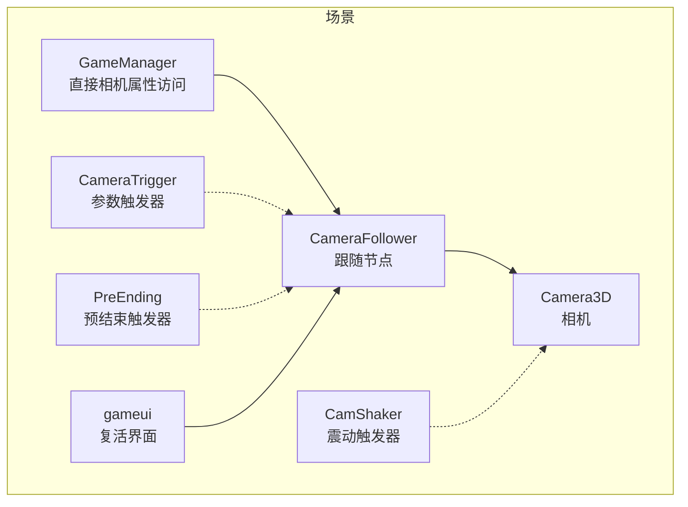

**图表来源**
- [Scene.tscn:40-66](file://#Template/[Scenes]/Scene.tscn#L40-L66)
- [CameraFollower.gd:1-179](file://#Template/[Scripts]/CameraScripts/CameraFollower.gd#L1-L179)
- [CameraTrigger.gd:1-74](file://#Template/[Scripts]/CameraScripts/CameraTrigger.gd#L1-L74)
- [PreEnding.gd:1-31](file://#Template/[Scripts]/Trigger/PreEnding.gd#L1-L31)
- [CamShaker.gd:1-33](file://#Template/[Scripts]/CameraScripts/CamShaker.gd#L1-L33)

**章节来源**
- [Scene.tscn:40-66](file://#Template/[Scenes]/Scene.tscn#L40-L66)
- [CameraFollower.gd:1-179](file://#Template/[Scripts]/CameraScripts/CameraFollower.gd#L1-L179)

## 核心组件
- CameraFollower：负责根据目标节点（玩家）实时计算相机位置，提供平滑插值、参数 Tween 数组化动画、状态检查点与复活恢复、临时跳过跟随等能力。**更新** 现在支持双模式跟随：传统球面插值和平滑指数插值。
- CameraTrigger：在触发时对相机参数进行 Tween 动画式变更，支持位置、旋转、距离、跟随速度四维参数。
- PreEnding：预结束触发器，展示如何使用 `lerp_to` 方法实现指数插值跟随，常用于特殊场景的相机过渡。
- CamShaker：基于 Area3D 的震动触发器，对相机父节点进行随机抖动。
- State：全局状态容器，保存相机跟随参数的检查点与恢复标志位。
- GameManager：游戏管理器，提供相机属性的直接访问，简化了相机跟随系统的依赖关系。
- Scene：场景装配与节点路径绑定，定义了相机跟随系统的完整节点树。

**更新** GameManager 现在提供直接的相机属性访问，简化了相机跟随系统的依赖关系，提高了代码的可靠性。同时，新增的复活恢复机制确保了重生时相机视角的一致性。**新增** 指数插值跟随系统提供了更精确的相机运动控制，支持独立的位置和旋转目标跟踪。预结束触发器展示了指数插值跟随在实际游戏场景中的应用价值。

**章节来源**
- [CameraFollower.gd:1-179](file://#Template/[Scripts]/CameraScripts/CameraFollower.gd#L1-L179)
- [CameraTrigger.gd:1-74](file://#Template/[Scripts]/CameraScripts/CameraTrigger.gd#L1-L74)
- [PreEnding.gd:1-31](file://#Template/[Scripts]/Trigger/PreEnding.gd#L1-L31)
- [CamShaker.gd:1-33](file://#Template/[Scripts]/CameraScripts/CamShaker.gd#L1-L33)
- [State.gd:1-137](file://#Template/[Scripts]/State.gd#L1-L137)
- [GameManager.gd:1-50](file://#Template/[Scripts]/GameManager.gd#L1-L50)
- [Scene.tscn:40-66](file://#Template/[Scenes]/Scene.tscn#L40-L66)

## 架构总览
相机跟随系统采用"跟随节点 + 参数触发器 + 预结束触发器 + 震动触发"的分层设计：
- 跟随节点：CameraFollower 通过目标节点位置与偏移量计算相机目标位置，使用球面插值实现平滑跟随。**更新** 现在支持指数插值模式，提供更精确的相机运动控制。
- 参数触发器：CameraTrigger 在特定事件或时间点对相机参数发起 Tween 动画，保证过渡自然。
- 预结束触发器：PreEnding 展示了指数插值跟随的实际应用场景，通过 `lerp_to` 方法实现精确的相机运动控制。
- 震动触发：CamShaker 基于 Area3D 区域触发，对相机父节点进行随机抖动。
- 状态管理：State 提供相机参数检查点与恢复标志位，配合 CameraFollower 的复活恢复流程。
- 复活机制：通过 State 和 GameManager 协同工作，确保重生时相机视角的一致性。

**更新** 架构现在通过 GameManager 提供统一的相机属性访问入口，简化了场景搜索逻辑，提高了系统的稳定性和可维护性。同时，新增的复活恢复机制通过状态检查点确保重生时相机视角的一致性。**新增** 指数插值跟随系统提供了双模式架构，用户可以根据需要选择最适合的跟随模式。预结束触发器展示了指数插值跟随在实际游戏开发中的实用价值。

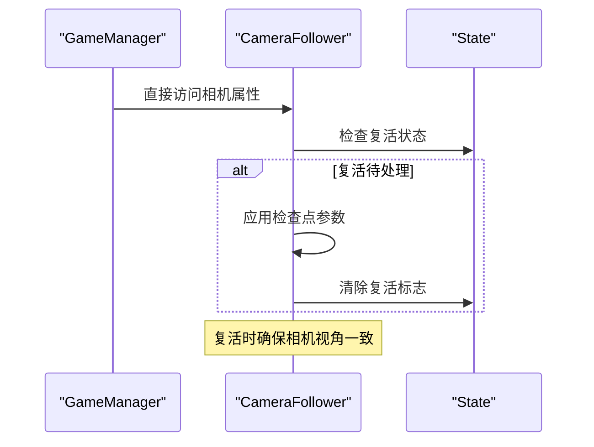

**图表来源**
- [GameManager.gd:10-18](file://#Template/[Scripts]/GameManager.gd#L10-L18)
- [CameraFollower.gd:42-83](file://#Template/[Scripts]/CameraScripts/CameraFollower.gd#L42-L83)
- [State.gd:19-27](file://#Template/[Scripts]/State.gd#L19-L27)

## 详细组件分析

### CameraFollower 组件
CameraFollower 是相机跟随的核心节点，负责：
- 目标定位：基于 player_node 的 position 与 add_position 偏移计算目标位置
- 平滑跟随：使用球面插值（slerp）按 follow_speed 与 delta 实现平滑过渡
- **更新** 双模式跟随：支持传统球面插值跟随和指数插值跟随两种模式
- 参数控制：distance_from_object 控制相机到目标的距离；rotation_offset 控制初始旋转
- **更新** Tween 数组化管理：使用枚举索引的 TweenProp 数组管理多个 Tween 实例，支持位置、旋转、距离、速度的独立 Tween 动画
- 状态检查点：从 State 恢复相机参数，应用后标记恢复完成
- 复活恢复：将缓存的参数回填至当前相机状态
- 临时跳过：在恢复或强制重置时跳过一次插值，直接定位到目标
- **新增** 指数插值跟随：通过 `lerp_to` 方法实现基于指数衰减的平滑相机移动
- **新增** 角度近似计算：通过 `_angle_approx` 方法处理角度环绕问题，确保旋转插值的准确性

**更新** CameraFollower 现在通过 GameManager 提供的直接属性访问机制，简化了相机属性的获取方式，提高了代码的可靠性和维护性。同时，新增的复活恢复机制通过 `_apply_state_checkpoint()` 函数确保重生时相机视角的一致性。**新增** 指数插值跟随系统提供了更精确的相机运动控制，支持独立的位置和旋转目标跟踪，通过 `_do_lerp` 方法实现基于指数衰减的插值算法。

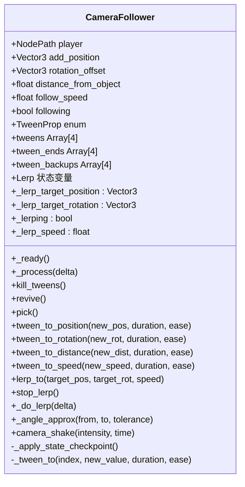

**图表来源**
- [CameraFollower.gd:1-179](file://#Template/[Scripts]/CameraScripts/CameraFollower.gd#L1-L179)

**章节来源**
- [CameraFollower.gd:1-179](file://#Template/[Scripts]/CameraScripts/CameraFollower.gd#L1-L179)

### CameraTrigger 组件
CameraTrigger 在触发时对 CameraFollower 的参数发起 Tween 动画，支持：
- 位置：add_position
- 旋转：rotation_offset
- 距离：distance_from_object
- 跟随速度：follow_speed
- 支持按需启用/禁用各维度的变更
- 支持基于时间的触发（读取 MainLine 的动画播放进度）
- **更新** 通过 GameManager 提供的相机属性访问，简化了触发器的实现

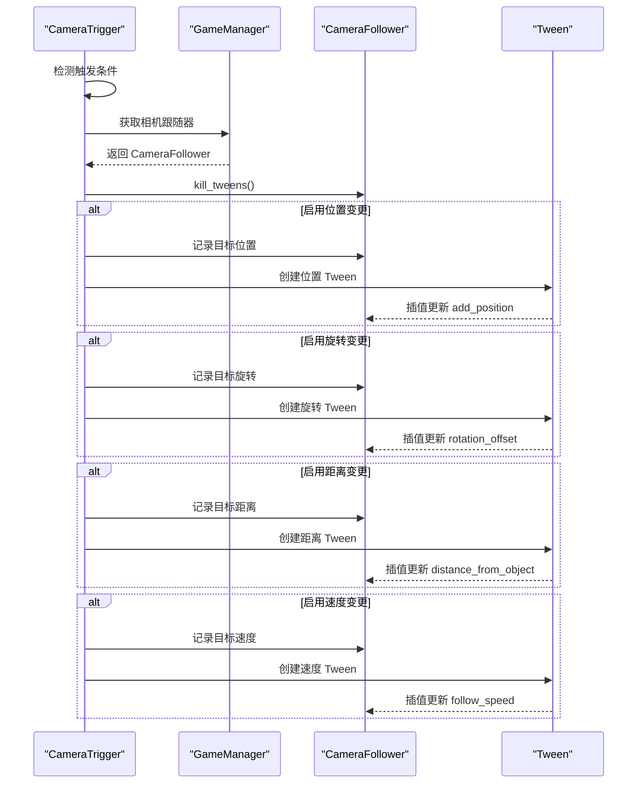

**图表来源**
- [CameraTrigger.gd:21-28](file://#Template/[Scripts]/CameraScripts/CameraTrigger.gd#L21-L28)
- [CameraTrigger.gd:54-74](file://#Template/[Scripts]/CameraScripts/CameraTrigger.gd#L54-L74)
- [GameManager.gd:10-18](file://#Template/[Scripts]/GameManager.gd#L10-L18)

**章节来源**
- [CameraTrigger.gd:1-74](file://#Template/[Scripts]/CameraScripts/CameraTrigger.gd#L1-L74)
- [GameManager.gd:10-18](file://#Template/[Scripts]/GameManager.gd#L10-L18)

### PreEnding 组件
PreEnding 预结束触发器展示了指数插值跟随的实际应用场景，通过 `lerp_to` 方法实现精确的相机运动控制：

- **应用场景**：常用于游戏结束前的特殊镜头效果
- **实现方式**：计算目标位置和旋转，调用 `lerp_to` 方法实现平滑过渡
- **参数控制**：通过 Offset 参数控制相机位置偏移，通过速度参数控制插值速度
- **集成方式**：通过 GameManager 获取相机跟随器实例

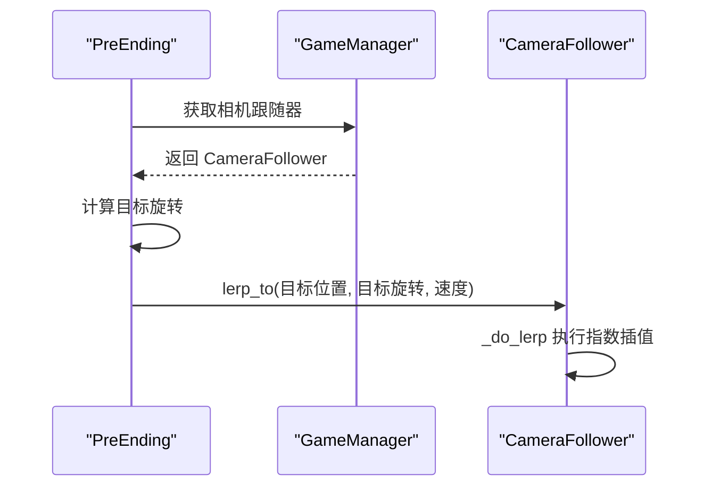

**图表来源**
- [PreEnding.gd:10-21](file://#Template/[Scripts]/Trigger/PreEnding.gd#L10-L21)
- [GameManager.gd:10-18](file://#Template/[Scripts]/GameManager.gd#L10-L18)

**章节来源**
- [PreEnding.gd:1-31](file://#Template/[Scripts]/Trigger/PreEnding.gd#L1-L31)
- [GameManager.gd:10-18](file://#Template/[Scripts]/GameManager.gd#L10-L18)

### CamShaker 组件
CamShaker 基于 Area3D 的进入事件触发相机震动，对相机父节点进行随机抖动，支持强度与持续时间配置。

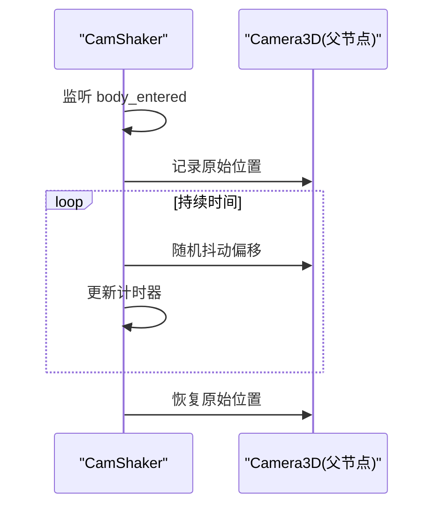

**图表来源**
- [CamShaker.gd:13-33](file://#Template/[Scripts]/CameraScripts/CamShaker.gd#L13-L33)

**章节来源**
- [CamShaker.gd:1-33](file://#Template/[Scripts]/CameraScripts/CamShaker.gd#L1-L33)

### 状态检查点与复活恢复
State 提供相机跟随参数的检查点与恢复标志位，CameraFollower 在就绪时检测并应用检查点，随后标记恢复完成。GameManager 提供相机属性的直接访问，简化了状态管理流程。

**更新** 复活恢复机制通过以下流程确保相机视角一致性：
- 通过 GameManager 获取相机跟随器实例
- 检查 State 中的复活状态标志
- 应用检查点参数并清除标志
- 确保重生时相机视角的一致性

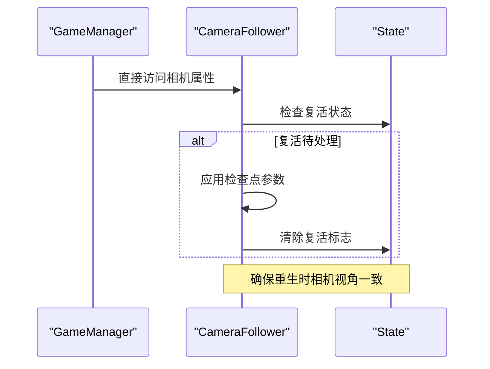

**图表来源**
- [GameManager.gd:10-18](file://#Template/[Scripts]/GameManager.gd#L10-L18)
- [CameraFollower.gd:42-83](file://#Template/[Scripts]/CameraScripts/CameraFollower.gd#L42-L83)
- [State.gd:19-27](file://#Template/[Scripts]/State.gd#L19-L27)

**章节来源**
- [GameManager.gd:10-18](file://#Template/[Scripts]/GameManager.gd#L10-L18)
- [CameraFollower.gd:42-83](file://#Template/[Scripts]/CameraScripts/CameraFollower.gd#L42-L83)
- [State.gd:19-27](file://#Template/[Scripts]/State.gd#L19-L27)

## 双模式跟随系统

### 指数插值跟随系统
CameraFollower 现在支持基于指数插值的平滑相机移动系统，通过 `lerp_to` 方法实现：

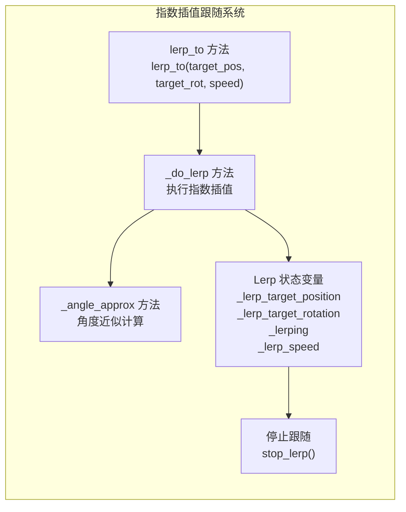

**图表来源**
- [CameraFollower.gd:134-159](file://#Template/[Scripts]/CameraScripts/CameraFollower.gd#L134-L159)

### 指数插值算法原理
指数插值使用公式：`weight = 1.0 - exp(-speed * delta)`，其中：
- `speed`：插值速度系数
- `delta`：每帧时间增量
- `exp()`：自然指数函数

这种算法的特点是：
- **快速响应**：初期移动速度快，快速接近目标
- **平滑收敛**：随着接近目标，移动速度逐渐减慢
- **理论停止**：数学上永远不会完全到达目标，但会无限接近

### 角度近似计算
`_angle_approx` 方法专门处理角度环绕问题，使用模运算解决 0° 和 360° 之间的连续性问题：

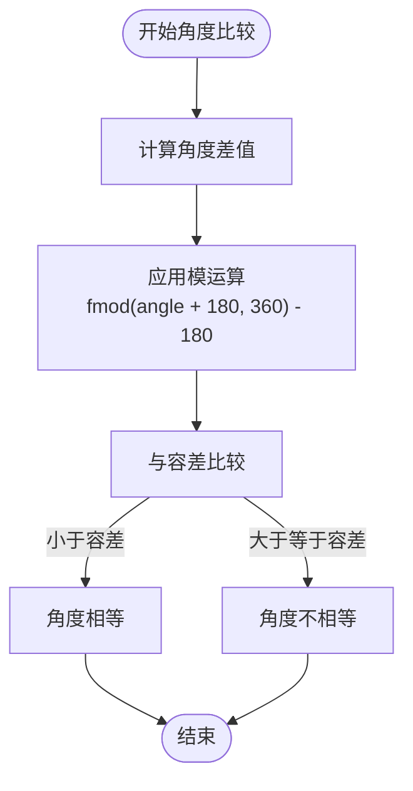

**图表来源**
- [CameraFollower.gd:156-159](file://#Template/[Scripts]/CameraScripts/CameraFollower.gd#L156-L159)

### 双模式跟随对比
- **传统模式**：使用球面插值（slerp），适合连续平滑的跟随
- **指数模式**：使用指数衰减插值，适合需要快速响应的场景

**章节来源**
- [CameraFollower.gd:134-159](file://#Template/[Scripts]/CameraScripts/CameraFollower.gd#L134-L159)

## Tween数组化管理架构

### 枚举索引系统
CameraFollower 现已采用枚举索引的 TweenProp 数组管理系统，提供更好的可维护性和可扩展性：

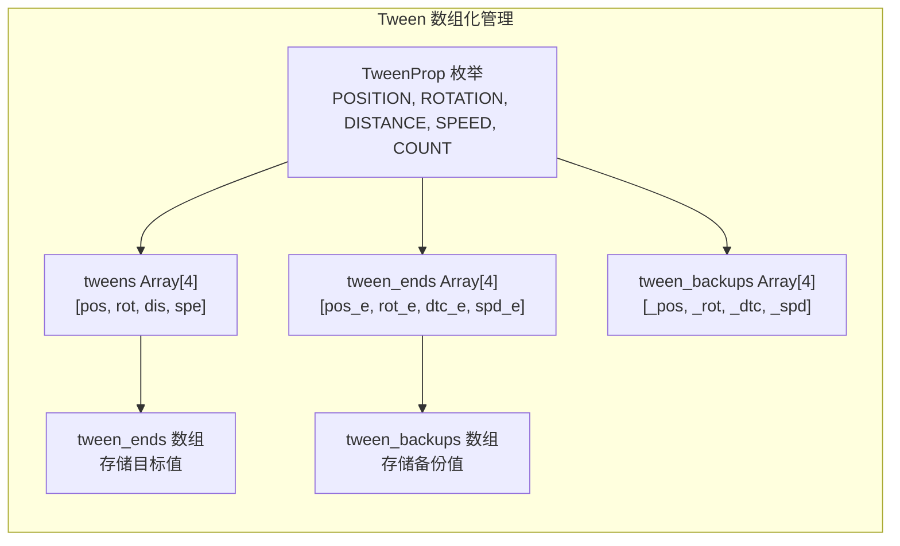

**图表来源**
- [CameraFollower.gd:15-31](file://#Template/[Scripts]/CameraScripts/CameraFollower.gd#L15-L31)

### 数组化管理的优势
- **类型安全**：通过枚举索引确保数组访问的正确性
- **可维护性**：统一的数组结构便于管理和扩展
- **性能优化**：避免重复的 Tween 实例创建和销毁
- **状态同步**：数组索引与属性名称一一对应，确保状态同步

### 核心数组结构
- **tweens**：存储当前运行的 Tween 实例数组
- **tween_ends**：存储每个属性的目标值数组
- **tween_backups**：存储每个属性的备份值数组
- **TWEEN_PROPERTIES**：属性名称映射数组

**章节来源**
- [CameraFollower.gd:15-31](file://#Template/[Scripts]/CameraScripts/CameraFollower.gd#L15-L31)
- [CameraFollower.gd:107-132](file://#Template/[Scripts]/CameraScripts/CameraFollower.gd#L107-L132)

### Tween操作流程
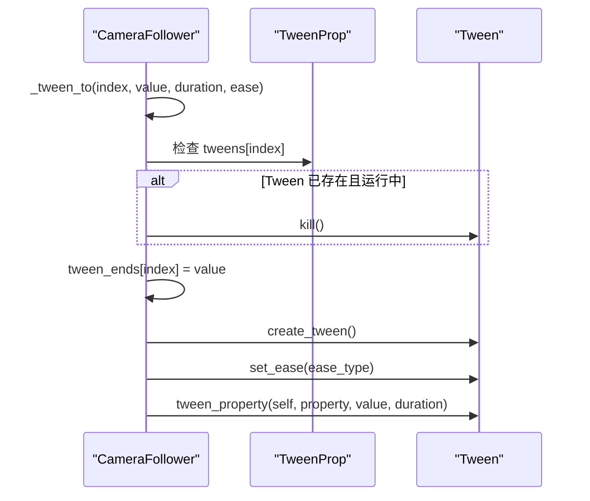

**图表来源**
- [CameraFollower.gd:107-116](file://#Template/[Scripts]/CameraScripts/CameraFollower.gd#L107-L116)

**章节来源**
- [CameraFollower.gd:107-116](file://#Template/[Scripts]/CameraScripts/CameraFollower.gd#L107-L116)

## 依赖关系分析
- CameraFollower 依赖：
  - 目标节点（MainLine）的位置与状态
  - GameManager 提供的直接相机属性访问
  - State 的检查点数据
- CameraTrigger 依赖：
  - GameManager 提供的相机跟随器实例
  - MainLine 的动画播放进度（可选）
- PreEnding 依赖：
  - GameManager 提供的相机跟随器实例
  - 目标位置和旋转的计算
- CamShaker 依赖：
  - Area3D 的进入事件与相机父节点
- GameManager 依赖：
  - Camera3D 的父节点（CameraFollower）
  - Scene 的节点树结构

**更新** 依赖关系现在通过 GameManager 提供统一的相机属性访问，简化了场景搜索逻辑，提高了系统的稳定性和可维护性。同时，新增的复活恢复流程通过 GameManager、CameraFollower 和 State 的协同工作，确保了相机状态的正确恢复。**新增** 指数插值跟随系统不依赖外部组件，完全在 CameraFollower 内部实现，通过 PreEnding 展示了其在实际场景中的应用价值。

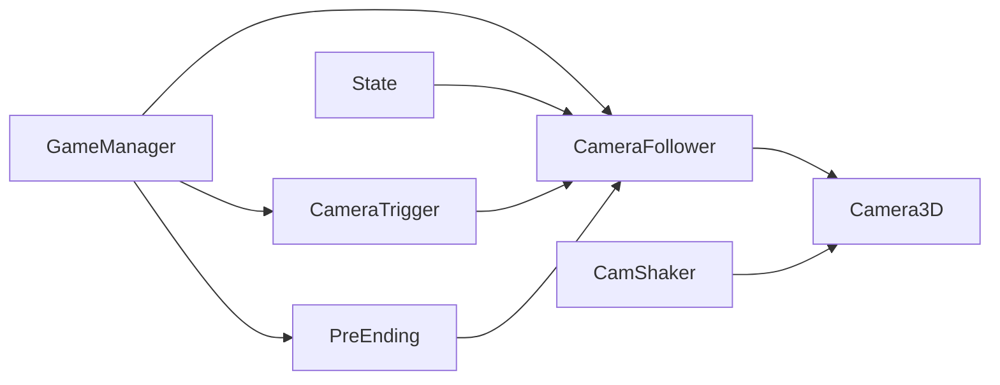

**图表来源**
- [GameManager.gd:10-18](file://#Template/[Scripts]/GameManager.gd#L10-L18)
- [CameraFollower.gd:10-13](file://#Template/[Scripts]/CameraScripts/CameraFollower.gd#L10-L13)
- [CameraTrigger.gd:21-28](file://#Template/[Scripts]/CameraScripts/CameraTrigger.gd#L21-L28)
- [PreEnding.gd:10-11](file://#Template/[Scripts]/Trigger/PreEnding.gd#L10-L11)

**章节来源**
- [GameManager.gd:10-18](file://#Template/[Scripts]/GameManager.gd#L10-L18)
- [CameraFollower.gd:10-13](file://#Template/[Scripts]/CameraScripts/CameraFollower.gd#L10-L13)
- [CameraTrigger.gd:21-28](file://#Template/[Scripts]/CameraScripts/CameraTrigger.gd#L21-L28)
- [PreEnding.gd:10-11](file://#Template/[Scripts]/Trigger/PreEnding.gd#L10-L11)

## 性能考虑
- 插值平滑：使用球面插值（slerp）与 delta 时间驱动，避免固定帧率差异导致的跳跃感。
- **更新** Tween 数组化管理：通过枚举索引的数组结构，减少 Tween 实例的创建和销毁开销，提高内存使用效率。
- 条件暂停：当目标处于停止或结束状态时，停止相机跟随并清理 Tween，降低无效计算。
- 抖动优化：震动过程按帧等待，避免阻塞主线程；建议合理设置强度与持续时间。
- **更新** GameManager 直接属性访问：通过 GameManager 提供的直接相机属性访问，减少了场景搜索的开销，提高了性能稳定性。
- **新增** 复活恢复优化：CameraFollower 通过 `_checkpoint_applied` 标志避免重复应用检查点，提高复活时的性能表现。
- **新增** 指数插值性能：指数插值算法计算简单，CPU 开销极小，适合频繁调用的场景。
- **新增** 角度计算优化：`_angle_approx` 方法使用高效的模运算，避免复杂的三角函数计算。
- **新增** 预结束触发器优化：PreEnding 通过 GameManager 直接获取相机跟随器，避免了场景搜索的开销。

## 故障排查指南
- 相机不跟随
  - 检查 Scene.tscn 中 GameManager 的相机路径是否正确指向 CameraFollower/Camera3D
  - 确认 CameraFollower 的 player 节点路径有效
  - **新增** 验证 GameManager 的 Camera 属性是否正确设置
- 参数变更无效
  - 确认 CameraTrigger 的 set_camera 路径正确
  - 检查触发器是否被 one-shot 或过滤器阻止
  - **新增** 确认 GameManager 提供的相机属性访问正常工作
- **更新** Tween 数组化管理问题
  - 检查 TweenProp 枚举索引是否正确
  - 验证 tweens、tween_ends、tween_backups 数组长度一致
  - 确认 TWEEN_PROPERTIES 数组中的属性名称与实际属性匹配
- 预结束触发器异常
  - 确认 PreEnding 的 Offset 参数设置正确
  - 检查 GameManager 是否能正确返回相机跟随器实例
  - **新增** 验证 lerp_to 方法的调用参数是否正确
- 抖动无效果
  - 确认 CamShaker 的 camera_parent 指向 Camera3D 的父节点
  - 检查 Area3D 的碰撞体与触发事件连接
- **新增** 复活功能问题
  - 检查 gameui 是否正确设置 `State.camera_checkpoint.restore_pending = true`
  - 确认 MainLine 的 `reload()` 方法是否清理了检查点数据
  - 验证 CameraFollower 的 `_apply_state_checkpoint()` 是否被调用
  - 检查 State 中的相机检查点数据是否正确保存
- **新增** GameManager 相关问题
  - 检查 GameManager 的 Camera 属性是否正确导出
  - 验证 GameManager 与场景的连接关系
  - 确认 GameManager 的相机属性访问权限设置正确
- **新增** 指数插值跟随问题
  - 检查 `lerp_to` 方法的调用参数是否正确
  - 验证 `_do_lerp` 方法是否在 `_process` 中被调用
  - 确认 `_angle_approx` 方法的角度计算逻辑
  - 检查 `_lerping` 状态标志是否正确设置和清除

**章节来源**
- [Scene.tscn:40-66](file://#Template/[Scenes]/Scene.tscn#L40-L66)
- [CameraTrigger.gd:21-28](file://#Template/[Scripts]/CameraScripts/CameraTrigger.gd#L21-L28)
- [PreEnding.gd:10-21](file://#Template/[Scripts]/Trigger/PreEnding.gd#L10-L21)
- [CamShaker.gd:13-33](file://#Template/[Scripts]/CameraScripts/CamShaker.gd#L13-L33)
- [GameManager.gd:10-18](file://#Template/[Scripts]/GameManager.gd#L10-L18)
- [CameraFollower.gd:134-159](file://#Template/[Scripts]/CameraScripts/CameraFollower.gd#L134-L159)

## 结论
相机跟随系统通过 CameraFollower 的智能插值算法与参数化的 Tween 数组化动画，实现了平滑、可控且可扩展的跟随体验；结合状态检查点、复活恢复、预结束触发器与震动触发，满足了复杂关卡与动态场景的需求。通过引入 GameManager 的直接属性访问机制和 Tween 数组化管理架构，系统架构得到了显著简化，提高了代码的可靠性和维护性。**新增的复活恢复机制**通过状态检查点确保了重生时相机视角的一致性，为玩家提供了无缝的游戏体验。**新增的指数插值跟随系统**提供了更精确的相机运动控制，支持独立的位置和旋转目标跟踪，为开发者提供了更多样化的相机控制选项。**新增的预结束触发器**展示了指数插值跟随在实际游戏开发中的实用价值，通过 GameManager 的直接访问简化了实现流程。**Tween 数组化管理**提供了更好的可维护性和性能表现，通过枚举索引确保了类型安全和状态同步。通过合理的参数配置与性能优化策略，可在不同设备上获得稳定的流畅度表现。

## 附录

### 使用示例与自定义配置
- 场景装配
  - 在 Scene.tscn 中将 GameManager 的 Camera 指向 CameraFollower/Camera3D
  - 在 CameraFollower 中设置 player 节点路径为主线角色
- 参数配置
  - add_position：相机相对角色的偏移量
  - rotation_offset：初始旋转（度）
  - distance_from_object：相机到角色的距离
  - follow_speed：跟随插值系数（越大越快）
  - **新增** lerp_speed：指数插值速度系数
- 触发器使用
  - 在 CameraTrigger 中选择启用的参数维度，设置目标值与动画时长
  - 可选使用时间判定，基于 MainLine 的动画进度触发
  - **更新** 通过 GameManager 获取相机跟随器实例，简化实现
- **新增** 预结束触发器使用
  - 在 PreEnding 中设置 Offset 参数控制相机位置偏移
  - 通过 GameManager 获取相机跟随器实例
  - 调用 `lerp_to` 方法实现平滑的相机过渡
- 抖动效果
  - 在 CamShaker 中设置强度与持续时间，确保 camera_parent 指向相机父节点
- **新增** 复活功能配置
  - 在 gameui 中正确设置复活状态标志
  - 确保 MainLine 的 `reload()` 方法清理检查点数据
  - 验证 CameraFollower 的复活恢复流程
- **新增** GameManager 配置
  - 在 GameManager 中正确设置 Camera 属性
  - 确保相机路径指向正确的 Camera3D 节点
  - 验证相机属性的导出设置
- **新增** Tween 数组化管理配置
  - 确保 TweenProp 枚举与数组长度一致
  - 验证 TWEEN_PROPERTIES 数组中的属性名称正确
  - 检查数组初始化时的空值设置
- **新增** 指数插值跟随使用
  - 调用 `lerp_to(target_pos, target_rot, speed)` 开始指数插值跟随
  - 使用 `stop_lerp()` 停止插值跟随
  - 通过 `speed` 参数控制插值速度
  - 系统会自动处理角度环绕问题

**章节来源**
- [Scene.tscn:40-66](file://#Template/[Scenes]/Scene.tscn#L40-L66)
- [CameraFollower.gd:3-10](file://#Template/[Scripts]/CameraScripts/CameraFollower.gd#L3-L10)
- [CameraTrigger.gd:3-17](file://#Template/[Scripts]/CameraScripts/CameraTrigger.gd#L3-L17)
- [PreEnding.gd:3-21](file://#Template/[Scripts]/Trigger/PreEnding.gd#L3-L21)
- [CamShaker.gd:3-5](file://#Template/[Scripts]/CameraScripts/CamShaker.gd#L3-L5)
- [GameManager.gd:6-18](file://#Template/[Scripts]/GameManager.gd#L6-L18)
- [CameraFollower.gd:134-159](file://#Template/[Scripts]/CameraScripts/CameraFollower.gd#L134-L159)