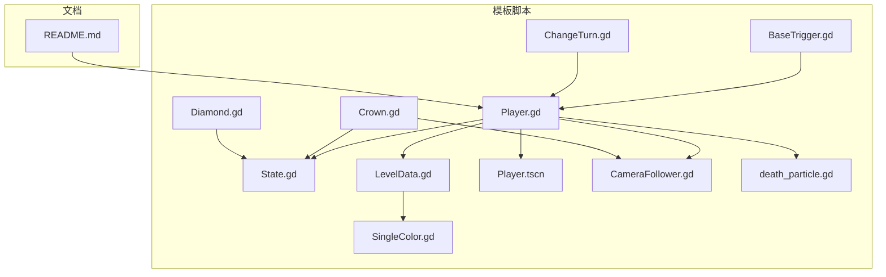
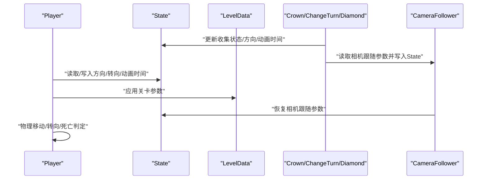
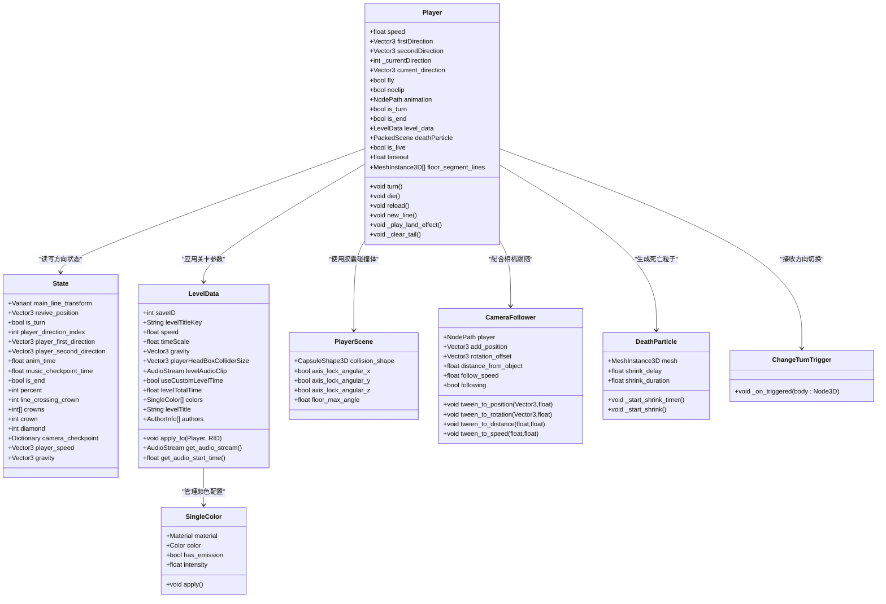
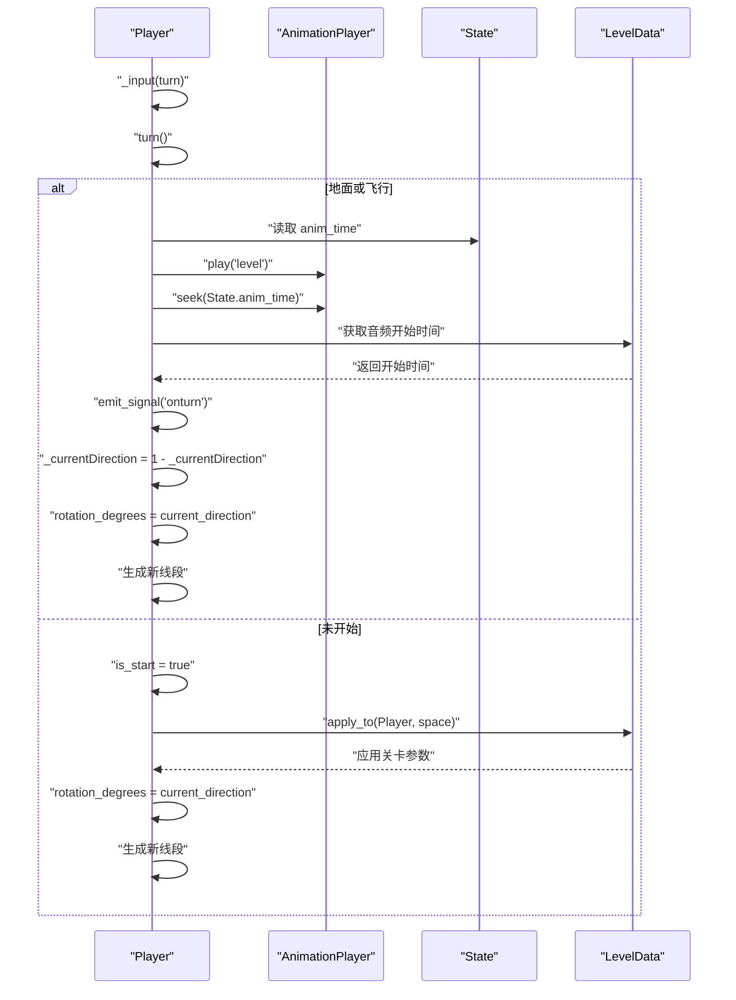
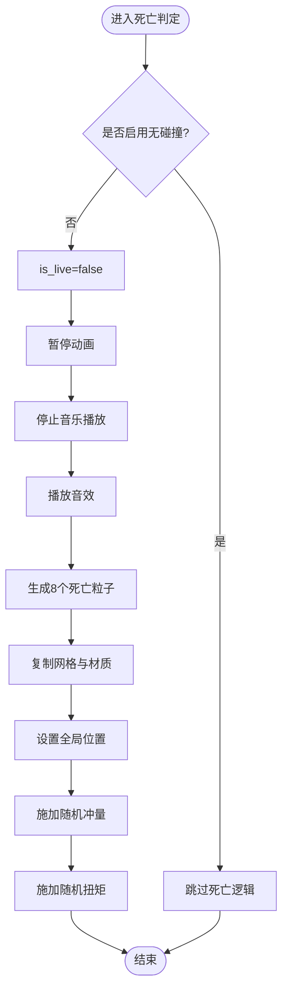
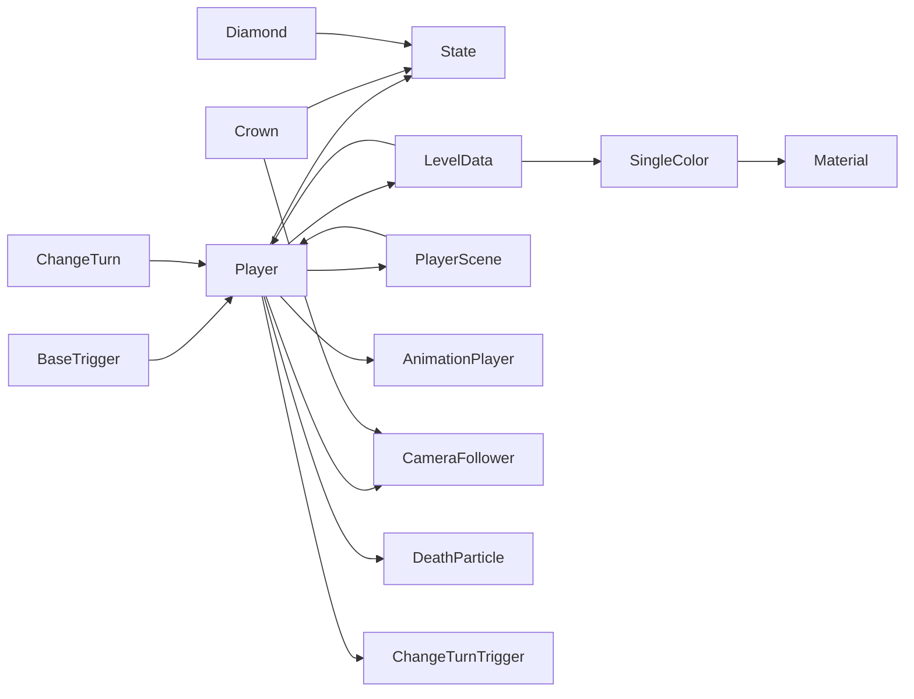

# 角色控制系统

<cite>
**本文引用的文件**
- [Player.gd](file://#Template/[Scripts]/Level/Player.gd)
- [State.gd](file://#Template/[Scripts]/State.gd)
- [LevelData.gd](file://#Template/[Scripts]/Settings/LevelData.gd)
- [SingleColor.gd](file://#Template/[Scripts]/Settings/SingleColor.gd)
- [Player.tscn](file://#Template/Player.tscn)
- [CameraFollower.gd](file://#Template/[Scripts]/CameraScripts/CameraFollower.gd)
- [BaseTrigger.gd](file://#Template/[Scripts]/Trigger/BaseTrigger.gd)
- [Crown.gd](file://#Template/[Scripts]/Trigger/Crown.gd)
- [Diamond.gd](file://#Template/[Scripts]/Trigger/Diamond.gd)
- [ChangeTurn.gd](file://#Template/[Scripts]/Trigger/ChangeTurn.gd)
- [death_particle.gd](file://#Template/[Scripts]/Level/death_particle.gd)
- [README.md](file://README.md)
</cite>

## 更新摘要
**变更内容**
- 重大重构：玩家方向系统从传统的布尔值转向机制转变为基于_int_的多方向系统
- 新增方向状态管理：包括_player_direction_index_、_player_first_direction_、_player_second_direction_等新变量
- 更新状态同步机制：State节点现在包含完整的方向状态信息
- 新增触发器系统：ChangeTurn.gd提供动态方向切换功能
- 改进了初始化过程的安全性：在多个关键位置添加 level_data 安全检查
- 新增轴锁定和角度调整功能，改善角色稳定性
- 适配新的胶囊碰撞几何对 Player 脚本的影响
- 更新了物理参数配置和触发器系统

## 目录
1. [简介](#简介)
2. [项目结构](#项目结构)
3. [核心组件](#核心组件)
4. [架构总览](#架构总览)
5. [详细组件分析](#详细组件分析)
6. [依赖关系分析](#依赖关系分析)
7. [性能考量](#性能考量)
8. [故障排查指南](#故障排查指南)
9. [结论](#结论)
10. [附录](#附录)

## 简介
本文件围绕角色控制系统进行深入解析，重点阐述 Player 类的实现原理与工作机制，涵盖 CharacterBody3D 物理移动、方向控制逻辑、死亡机制、移动状态管理、物理参数配置、动画播放控制等关键点。同时说明与 State 节点的状态同步机制，以及与触发器、相机等系统的交互关系，并提供性能优化建议与常见问题解决方案。

**更新** 本次更新反映了角色控制器的重大重构：Player.gd 中的方向系统已从传统的布尔值转向机制转变为基于_int_的多方向系统，新增了_player_direction_index_、_player_first_direction_、_player_second_direction_等新变量，以及_current_direction_状态管理机制。State节点现在包含完整的方向状态信息，支持更复杂的方向控制和状态同步。

## 项目结构
本项目采用模板化组织，核心逻辑集中在 #Template/[Scripts] 下，测试位于 Tests 目录，README 提供快速入门与输入说明。

**图表来源**
- [Player.gd:1-257](file://#Template/[Scripts]/Level/Player.gd#L1-L257)
- [State.gd:1-167](file://#Template/[Scripts]/State.gd#L1-L167)
- [LevelData.gd:1-72](file://#Template/[Scripts]/Settings/LevelData.gd#L1-L72)
- [SingleColor.gd:1-19](file://#Template/[Scripts]/Settings/SingleColor.gd#L1-L19)
- [Player.tscn:1-78](file://#Template/Player.tscn#L1-L78)
- [CameraFollower.gd:1-150](file://#Template/[Scripts]/CameraScripts/CameraFollower.gd#L1-L150)
- [BaseTrigger.gd:1-38](file://#Template/[Scripts]/Trigger/BaseTrigger.gd#L1-L38)
- [Crown.gd:1-14](file://#Template/[Scripts]/Trigger/Crown.gd#L1-L14)
- [Diamond.gd:1-15](file://#Template/[Scripts]/Trigger/Diamond.gd#L1-L15)
- [ChangeTurn.gd:1-12](file://#Template/[Scripts]/Trigger/ChangeTurn.gd#L1-L12)
- [death_particle.gd:1-28](file://#Template/[Scripts]/Level/death_particle.gd#L1-L28)
- [README.md:1-102](file://README.md#L1-L102)

**章节来源**
- [README.md:52-61](file://README.md#L52-L61)

## 核心组件
- Player：继承 CharacterBody3D 的角色主体，负责物理移动、转向、死亡、线段尾迹生成、着陆特效与动画播放控制。
- State：全局状态节点，存储相机跟随参数、转向状态、动画时间、关卡统计等，现在包含完整的方向状态信息。
- LevelData：关卡数据资源，用于存储关卡配置，包括速度、重力、颜色等参数。
- SingleColor：单色配置类，管理材质颜色和发光效果。
- Player.tscn：角色场景配置，包含新的胶囊碰撞体、轴锁定和角度调整。
- CameraFollower：相机跟随逻辑，支持检查点恢复、平滑跟随与多种 Tween 参数调整。
- 触发器系统：BaseTrigger 提供统一触发框架；Crown/Diamond 实现收集与状态同步；ChangeTurn 提供动态方向切换。
- 死亡粒子：death_particle.gd 作为刚体掉落粒子实体，支持缩放动画。

**更新** 新增了 ChangeTurn.gd 触发器，支持动态切换玩家方向状态，以及 SingleColor 类用于管理材质颜色和发光效果。

**章节来源**
- [Player.gd:1-257](file://#Template/[Scripts]/Level/Player.gd#L1-L257)
- [State.gd:1-167](file://#Template/[Scripts]/State.gd#L1-L167)
- [LevelData.gd:1-72](file://#Template/[Scripts]/Settings/LevelData.gd#L1-L72)
- [SingleColor.gd:1-19](file://#Template/[Scripts]/Settings/SingleColor.gd#L1-L19)
- [Player.tscn:1-78](file://#Template/Player.tscn#L1-L78)
- [CameraFollower.gd:1-150](file://#Template/[Scripts]/CameraScripts/CameraFollower.gd#L1-L150)
- [BaseTrigger.gd:1-38](file://#Template/[Scripts]/Trigger/BaseTrigger.gd#L1-L38)
- [Crown.gd:1-14](file://#Template/[Scripts]/Trigger/Crown.gd#L1-L14)
- [Diamond.gd:1-15](file://#Template/[Scripts]/Trigger/Diamond.gd#L1-L15)
- [ChangeTurn.gd:1-12](file://#Template/[Scripts]/Trigger/ChangeTurn.gd#L1-L12)
- [death_particle.gd:1-28](file://#Template/[Scripts]/Level/death_particle.gd#L1-L28)

## 架构总览
Player 与 State 之间通过共享变量进行状态同步，包括方向状态、转向状态、动画时间、相机跟随参数等。LevelData 系统提供关卡参数配置，支持物理参数的动态调整。触发器在碰撞时更新 State 并驱动相机跟随与 UI 表现。相机跟随器根据 State 的检查点恢复相机参数。

**图表来源**
- [Player.gd:54-66](file://#Template/[Scripts]/Level/Player.gd#L54-L66)
- [Player.gd:193-216](file://#Template/[Scripts]/Level/Player.gd#L193-L216)
- [State.gd:57-60](file://#Template/[Scripts]/State.gd#L57-L60)
- [State.gd:95-98](file://#Template/[Scripts]/State.gd#L95-L98)
- [LevelData.gd:26-36](file://#Template/[Scripts]/Settings/LevelData.gd#L26-L36)
- [Crown.gd:7-13](file://#Template/[Scripts]/Trigger/Crown.gd#L7-L13)
- [ChangeTurn.gd:6-11](file://#Template/[Scripts]/Trigger/ChangeTurn.gd#L6-L11)
- [Diamond.gd:6-11](file://#Template/[Scripts]/Trigger/Diamond.gd#L6-L11)
- [CameraFollower.gd:47-72](file://#Template/[Scripts]/CameraScripts/CameraFollower.gd#L47-L72)

## 详细组件分析

### Player 类实现详解
- 继承与导出属性
  - 继承 CharacterBody3D，提供速度、两个方向向量、当前方向索引等导出属性。
  - 新增 level_data 属性，支持 LevelData 系统集成。
  - 通过 @onready 初始化网格、材质、动画节点、着陆粒子等资源。
- 生命周期与状态同步
  - _ready：设置实例引用，在运行时从 State 恢复 transform、方向状态与转向状态。
- 物理移动与重力
  - _physics_process：若不在地板上则施加重力；将 v.x/z 赋给 velocity 并调用 move_and_slide；若撞墙则死亡；飞行模式下固定 Y 坐标。
- 地面/空中状态与线段尾迹
  - _process：检测着陆特效、生成线段、计算线段长度与朝向；地面阶段同步所有地面段的 Y 值；离地时清空地面段列表并发出 on_sky。
- 输入与转向
  - _input：响应转向输入，调用 turn()；内部维护 is_start、is_turn、v 等状态，生成新线段并发射信号。
- 方向系统重构
  - _currentDirection：基于_int_的方向索引，0表示firstDirection，1表示secondDirection。
  - current_direction：基于_currentDirection的计算属性，返回对应的方向向量。
  - firstDirection/secondDirection：两个预设的方向向量，支持任意角度配置。
- 动画播放控制
  - turn()：在地面或飞行时播放动画，结合 LevelData 获取音频开始时间；seek 到 State.anim_time；随后执行转向并更新速度方向。
- 死亡机制
  - die()：若未开启无碰撞，暂停动画、播放音效、生成多个死亡粒子，赋予随机冲量与扭矩；支持自定义死亡粒子场景。
- 线段尾迹管理
  - new_line()：创建线段 MeshInstance3D，继承材质与网格，加入 PlayerTailHolder 或场景根节点；地面段加入 floor_segment_lines。
- LevelData 集成
  - 支持通过 level_data.apply_to() 应用关卡参数到 Player 和物理空间。
  - 自动播放关卡音频流，支持音频同步。

**更新** 重大重构了方向系统，从传统的布尔值转向机制转变为基于_int_的多方向系统，包括_player_direction_index_、_player_first_direction_、_player_second_direction_等新变量，以及_current_direction_状态管理机制。

**图表来源**
- [Player.gd:1-257](file://#Template/[Scripts]/Level/Player.gd#L1-L257)
- [State.gd:1-167](file://#Template/[Scripts]/State.gd#L1-L167)
- [LevelData.gd:1-72](file://#Template/[Scripts]/Settings/LevelData.gd#L1-L72)
- [SingleColor.gd:1-19](file://#Template/[Scripts]/Settings/SingleColor.gd#L1-L19)
- [Player.tscn:1-78](file://#Template/Player.tscn#L1-L78)
- [CameraFollower.gd:1-150](file://#Template/[Scripts]/CameraScripts/CameraFollower.gd#L1-L150)
- [death_particle.gd:1-28](file://#Template/[Scripts]/Level/death_particle.gd#L1-L28)
- [ChangeTurn.gd:1-12](file://#Template/[Scripts]/Trigger/ChangeTurn.gd#L1-L12)

**章节来源**
- [Player.gd:54-66](file://#Template/[Scripts]/Level/Player.gd#L54-L66)
- [Player.gd:193-216](file://#Template/[Scripts]/Level/Player.gd#L193-L216)
- [Player.gd:220-257](file://#Template/[Scripts]/Level/Player.gd#L220-L257)

#### 多方向转向流程时序图

**图表来源**
- [Player.gd:124-127](file://#Template/[Scripts]/Level/Player.gd#L124-L127)
- [Player.gd:193-216](file://#Template/[Scripts]/Level/Player.gd#L193-L216)
- [Player.gd:209](file://#Template/[Scripts]/Level/Player.gd#L209)
- [LevelData.gd:48-51](file://#Template/[Scripts]/Settings/LevelData.gd#L48-L51)

#### 死亡判定与粒子生成流程图

**图表来源**
- [Player.gd:222-257](file://#Template/[Scripts]/Level/Player.gd#L222-L257)
- [death_particle.gd:1-28](file://#Template/[Scripts]/Level/death_particle.gd#L1-L28)

### Player 场景配置详解
- **胶囊碰撞体**：使用 CapsuleShape3D，高度为1.0，提供更好的滚动和碰撞体验
- **轴锁定**：禁用角运动，确保角色稳定不翻滚
  - axis_lock_angular_x = true
  - axis_lock_angular_y = true  
  - axis_lock_angular_z = true
- **最大角度**：floor_max_angle = 1.553343，允许角色在较陡峭的表面上行走
- **触发器区域**：保留 BoxShape3D 作为触发器碰撞体
- **物理参数**：collision_mask 设置为2，确保与环境正确交互

**更新** 新增了胶囊碰撞体配置，提升了角色的物理交互体验和稳定性。

**章节来源**
- [Player.tscn:8-49](file://#Template/Player.tscn#L8-L49)

### State 节点状态同步机制
- 关键字段：main_line_transform、revive_position、is_turn、player_direction_index、player_first_direction、player_second_direction、anim_time、music_checkpoint_time、is_end、percent、line_crossing_crown、crowns、crown、diamond 等。
- Player 在 _ready 时从 State 恢复 transform、is_turn、_currentDirection、firstDirection、secondDirection；turn() 时读取 anim_time；reload() 时重置相机跟随参数并写回 State。
- 触发器（Crown/Diamond/ChangeTurn）在碰撞时更新相应统计与检查点，供相机跟随器恢复使用。

**更新** State 节点现在包含完整的方向状态信息，包括 player_direction_index、player_first_direction、player_second_direction 字段，支持多方向状态的保存和恢复。

**章节来源**
- [State.gd:1-167](file://#Template/[Scripts]/State.gd#L1-L167)
- [Player.gd:54-66](file://#Template/[Scripts]/Level/Player.gd#L54-L66)
- [Player.gd:113-119](file://#Template/[Scripts]/Level/Player.gd#L113-L119)
- [Crown.gd:7-13](file://#Template/[Scripts]/Trigger/Crown.gd#L7-L13)
- [Diamond.gd:6-11](file://#Template/[Scripts]/Trigger/Diamond.gd#L6-L11)
- [ChangeTurn.gd:6-11](file://#Template/[Scripts]/Trigger/ChangeTurn.gd#L6-L11)

### LevelData 系统集成
- 关卡参数管理：提供速度、重力、时间缩放、颜色等参数的集中管理。
- 物理集成：通过 apply_to() 方法将关卡参数应用到 Player 和物理空间。
- 音频同步：支持关卡音频流的自动播放和时间同步。
- 颜色系统：支持 MultipleColor 资源的批量应用。
- **胶囊碰撞体适配**：新增 _apply_player_collider_size() 方法，支持胶囊碰撞体的尺寸调整。

**更新** 移除了复杂的颜色属性系统，采用简化的 SingleColor 类管理材质颜色，新增了多处安全的 level_data 检查。

**章节来源**
- [LevelData.gd:1-72](file://#Template/[Scripts]/Settings/LevelData.gd#L1-L72)
- [SingleColor.gd:1-19](file://#Template/[Scripts]/Settings/SingleColor.gd#L1-L19)
- [Player.gd:182-187](file://#Template/[Scripts]/Level/Player.gd#L182-L187)
- [LevelData.gd:66-72](file://#Template/[Scripts]/Settings/LevelData.gd#L66-L72)

### SingleColor 颜色管理系统
- **材质颜色管理**：SingleColor 类管理材质的 albedo_color 属性，支持颜色的动态应用。
- **发光效果支持**：可选的发光效果，支持 StandardMaterial3D 的 emission 属性配置。
- **批量应用**：LevelData 通过遍历 colors 数组批量应用 SingleColor 配置。
- **类型安全**：通过 has_emission 和 intensity 参数控制发光效果的启用和强度。

**更新** 新增了 SingleColor 类，用于替代之前的复杂颜色属性系统，提供更简洁的颜色管理方案。

**章节来源**
- [SingleColor.gd:1-19](file://#Template/[Scripts]/Settings/SingleColor.gd#L1-L19)
- [LevelData.gd:19-37](file://#Template/[Scripts]/Settings/LevelData.gd#L19-L37)

### 多方向系统与 ChangeTurn 触发器
- **方向索引系统**：_currentDirection 使用整数索引（0或1）来表示当前方向状态。
- **方向向量管理**：firstDirection 和 secondDirection 分别存储两个预设的方向向量。
- **动态方向切换**：ChangeTurn.gd 触发器通过切换 _currentDirection 来实现动态方向切换。
- **状态同步**：State 节点保存完整的方向状态，包括 player_direction_index、player_first_direction、player_second_direction。

**更新** 新增了 ChangeTurn.gd 触发器，支持在游戏过程中动态切换玩家方向状态，增强了方向控制的灵活性。

**章节来源**
- [Player.gd:13-19](file://#Template/[Scripts]/Level/Player.gd#L13-L19)
- [Player.gd:209](file://#Template/[Scripts]/Level/Player.gd#L209)
- [State.gd:9-23](file://#Template/[Scripts]/State.gd#L9-L23)
- [ChangeTurn.gd:6-11](file://#Template/[Scripts]/Trigger/ChangeTurn.gd#L6-L11)

### 与触发器、相机的交互
- 触发器 BaseTrigger 提供统一的触发框架，子类仅需实现 _on_triggered()。
- Crown：玩家进入时增加 Crown 数量、记录 MainLine transform、读取相机跟随参数写入 State、播放 Crown 动画并等待结束再销毁。
- Diamond：玩家进入时增加 Diamond 数量、播放粒子与动画后销毁。
- ChangeTurn：玩家进入时切换方向状态，通过 State 同步到所有相关组件。
- CameraFollower：在 _ready 与 _process 中根据 State 的检查点恢复相机参数，支持平滑跟随与多种 Tween 调整。

**章节来源**
- [BaseTrigger.gd:1-38](file://#Template/[Scripts]/Trigger/BaseTrigger.gd#L1-L38)
- [Crown.gd:1-14](file://#Template/[Scripts]/Trigger/Crown.gd#L1-L14)
- [Diamond.gd:1-15](file://#Template/[Scripts]/Trigger/Diamond.gd#L1-L15)
- [ChangeTurn.gd:1-12](file://#Template/[Scripts]/Trigger/ChangeTurn.gd#L1-L12)
- [CameraFollower.gd:47-72](file://#Template/[Scripts]/CameraScripts/CameraFollower.gd#L47-L72)

### 使用示例与操作要点
- 转向：绑定输入动作"turn"，调用 turn()；在地面或飞行状态下会播放动画并执行转向。
- 多方向控制：通过 firstDirection 和 secondDirection 设置两个预设方向，使用 ChangeTurn 触发器动态切换。
- 飞行模式：设置 fly 为 true，角色将忽略重力影响并在固定 Y 坐标移动。
- 无碰撞模式：设置 noclip 为 true，死亡判定将被跳过。
- LevelData 集成：通过 level_data 属性设置关卡数据，自动应用速度、重力等参数。
- 颜色管理：通过 LevelData.colors 数组配置 SingleColor 资源，实现材质颜色的批量应用。
- 音频同步：LevelData 支持关卡音频的自动播放和时间同步。
- 重试/重载：调用 reload() 将相机跟随参数与状态写回 State 并重载场景。
- **胶囊碰撞体**：新的胶囊形状提供更好的滚动和碰撞体验，适合角色移动。
- **动态方向切换**：通过 ChangeTurn 触发器在游戏过程中切换玩家方向状态。

**更新** 新增了多方向控制和动态方向切换的使用说明，包括 firstDirection、secondDirection 和 ChangeTurn 触发器的配置和使用方法。

**章节来源**
- [Player.gd:124-127](file://#Template/[Scripts]/Level/Player.gd#L124-L127)
- [Player.gd:193-216](file://#Template/[Scripts]/Level/Player.gd#L193-L216)
- [Player.gd:222-257](file://#Template/[Scripts]/Level/Player.gd#L222-L257)
- [Player.gd:113-119](file://#Template/[Scripts]/Level/Player.gd#L113-L119)
- [LevelData.gd:19-37](file://#Template/[Scripts]/Settings/LevelData.gd#L19-L37)
- [ChangeTurn.gd:6-11](file://#Template/[Scripts]/Trigger/ChangeTurn.gd#L6-L11)

## 依赖关系分析
- Player 依赖 State 进行状态持久化与相机跟随参数恢复；依赖 LevelData 进行关卡参数应用；依赖 AnimationPlayer 控制动画；依赖 CameraFollower 实现跟随体验。
- **Player.tscn**：依赖胶囊碰撞体配置，提供稳定的物理交互基础。
- 触发器系统通过 Area3D 与 BodyEnter 事件与 Player 交互，更新 State 并驱动相机跟随。
- 死亡粒子系统支持自定义场景配置，增强视觉效果。
- **SingleColor 系统**：LevelData 通过 SingleColor 类管理材质颜色，提供类型安全的颜色配置。
- **ChangeTurn 触发器**：通过修改 Player 的 _currentDirection 属性实现动态方向切换。

**更新** 新增了 ChangeTurn 触发器的依赖关系，Player 现在可以通过触发器动态切换方向状态。

**图表来源**
- [Player.gd:1-257](file://#Template/[Scripts]/Level/Player.gd#L1-L257)
- [State.gd:1-167](file://#Template/[Scripts]/State.gd#L1-L167)
- [LevelData.gd:1-72](file://#Template/[Scripts]/Settings/LevelData.gd#L1-L72)
- [SingleColor.gd:1-19](file://#Template/[Scripts]/Settings/SingleColor.gd#L1-L19)
- [Player.tscn:1-78](file://#Template/Player.tscn#L1-L78)
- [CameraFollower.gd:1-150](file://#Template/[Scripts]/CameraScripts/CameraFollower.gd#L1-L150)
- [Crown.gd:1-14](file://#Template/[Scripts]/Trigger/Crown.gd#L1-L14)
- [Diamond.gd:1-15](file://#Template/[Scripts]/Trigger/Diamond.gd#L1-L15)
- [ChangeTurn.gd:1-12](file://#Template/[Scripts]/Trigger/ChangeTurn.gd#L1-L12)
- [BaseTrigger.gd:1-38](file://#Template/[Scripts]/Trigger/BaseTrigger.gd#L1-L38)

## 性能考量
- 线段尾迹管理
  - 地面段列表仅在地面阶段维护，离地清空，避免无效节点累积。
  - 线段数量与缩放计算在每帧进行，建议在复杂场景中限制 tailScale 或合并渲染批次。
- 动画同步
  - 通过 LevelData.get_audio_start_time() 获取精确的音频开始时间，减少动画与音乐的错位。
- 相机跟随
  - 使用 slerp 平滑跟随，必要时可调整 follow_speed；相机抖动为即时计算，注意帧率波动影响。
- 死亡粒子
  - 一次性生成多个刚体粒子，支持自定义场景配置，建议在密集场景中限制数量或使用对象池。
- LevelData 集成
  - 关卡参数应用采用批量处理，避免重复配置造成的性能开销。
- **胶囊碰撞体优化**
  - 胶囊碰撞体相比方块碰撞体具有更好的滚动性能，减少摩擦和碰撞计算开销。
  - 轴锁定功能防止不必要的旋转计算，提升物理模拟效率。
- **颜色系统优化**
  - SingleColor 类提供类型安全的颜色管理，避免了复杂的 getter/setter 方法开销。
  - 批量应用 SingleColor 配置，减少重复的材质访问操作。
- **多方向系统优化**
  - 基于_int_的方向索引系统比布尔值系统更高效，减少了条件判断开销。
  - current_direction 计算属性仅在需要时计算，避免重复的向量比较操作。
  - State 节点的批量状态保存和加载提高了检查点恢复的效率。

**更新** 新增了多方向系统的性能考量，包括基于_int_的方向索引系统的优势和 current_direction 计算属性的优化。

## 故障排查指南
- 转向无效
  - 检查输入动作"turn"是否正确绑定；确认 is_live 为真且处于地面或飞行状态。
  - 确认 AnimationPlayer 路径与动画名称正确。
- 多方向切换失败
  - 检查 ChangeTurn 触发器是否正确配置；确认触发器的 one_shot 设置。
  - 确认 Player 的 _currentDirection 属性是否被正确修改。
  - 检查 State 节点中的 player_direction_index 是否正确保存和加载。
- 动画不同步
  - 检查 LevelData.get_audio_start_time() 返回值；确认 State.anim_time 已正确写入。
- 相机未恢复
  - 确认 State 中相机跟随参数已写入；检查 CameraFollower._apply_state_checkpoint() 是否被调用。
- 死亡不触发
  - 检查 noclip 是否开启；确认碰撞体与触发器配置正确。
- 线段丢失
  - 确认 PlayerTailHolder 存在；若不存在，Player 会回退到场景根节点。
- LevelData 未生效
  - 检查 level_data 资源是否正确设置；确认 apply_to() 方法被调用。
- 音频不同步
  - 检查 MusicPlayer 配置；确认 get_audio_start_time() 返回正确的开始时间。
- **胶囊碰撞体问题**
  - 检查 CapsuleShape3D 高度设置是否正确；确认轴锁定配置是否符合预期。
  - 确认 floor_max_angle 设置是否适合目标地形；调整以获得最佳行走体验。
- **颜色系统问题**
  - 检查 LevelData.colors 数组是否正确配置 SingleColor 资源。
  - 确认材质对象是否正确设置；检查 has_emission 和 intensity 参数。
  - 确认 SingleColor.apply() 方法是否被正确调用。
- **方向状态问题**
  - 检查 Player 的 firstDirection 和 secondDirection 是否正确设置。
  - 确认 _currentDirection 的初始值是否为 0。
  - 检查 State 节点中的方向状态是否正确保存和加载。

**更新** 新增了多方向系统的故障排查指南，包括 ChangeTurn 触发器、方向状态保存加载等问题的诊断方法。

**章节来源**
- [Player.gd:124-127](file://#Template/[Scripts]/Level/Player.gd#L124-L127)
- [Player.gd:193-216](file://#Template/[Scripts]/Level/Player.gd#L193-L216)
- [Player.gd:222-257](file://#Template/[Scripts]/Level/Player.gd#L222-L257)
- [LevelData.gd:48-51](file://#Template/[Scripts]/Settings/LevelData.gd#L48-L51)
- [CameraFollower.gd:74-91](file://#Template/[Scripts]/CameraScripts/CameraFollower.gd#L74-L91)
- [Player.tscn:40-44](file://#Template/Player.tscn#L40-L44)
- [SingleColor.gd:12-19](file://#Template/[Scripts]/Settings/SingleColor.gd#L12-L19)
- [ChangeTurn.gd:6-11](file://#Template/[Scripts]/Trigger/ChangeTurn.gd#L6-L11)
- [State.gd:57-60](file://#Template/[Scripts]/State.gd#L57-L60)

## 结论
Player 通过 CharacterBody3D 提供稳定的物理移动与重力控制，结合 State 的状态同步与 LevelData 的关卡参数管理，实现了与相机跟随、触发器系统的无缝协作。其转向、飞行、无碰撞、死亡等特殊状态均可通过导出属性与方法灵活配置。新增的 LevelData 系统进一步增强了角色控制的灵活性和可配置性。**最新的胶囊碰撞体配置**显著提升了角色的物理交互体验，轴锁定功能确保了角色稳定性，最大角度设置改善了地形适应性。**重构后的颜色属性系统**通过 SingleColor 类提供了更简洁、类型安全的颜色管理方案，移除了复杂的 getter/setter 方法，提升了代码的可维护性。**最重要的更新**是方向系统的重大重构：从传统的布尔值转向机制转变为基于_int_的多方向系统，包括_player_direction_index_、_player_first_direction_、_player_second_direction_等新变量，以及_current_direction_状态管理机制。这一重构不仅提升了方向控制的灵活性，还通过 State 节点的完整状态同步支持，实现了更复杂的游戏逻辑需求。建议在复杂场景中关注线段尾迹与粒子性能，并通过测试用例持续验证核心行为。

**更新** 本次重构显著增强了角色控制系统的功能性和可维护性，特别是 LevelData 系统的引入、胶囊碰撞体配置的优化、颜色属性系统的重构，以及最重要的方向系统的重大升级。新的多方向系统通过基于_int_的方向索引机制，提供了更灵活和高效的转向控制能力，State 节点的完整状态同步支持进一步增强了系统的可扩展性。

## 附录
- 输入控制参考：README 中列出的按键与操作说明。
- 关卡配置：通过 LevelData 资源文件配置关卡参数，包括速度、重力、颜色等。
- 颜色管理：通过 LevelData.colors 数组配置 SingleColor 资源，实现材质颜色的批量应用。
- 音频同步：LevelData 支持关卡音频的自动播放和精确的时间同步。
- **胶囊碰撞体配置**：通过 Player.tscn 场景文件配置胶囊碰撞体参数，包括高度、轴锁定和最大角度设置。
- **多方向系统配置**：通过 firstDirection 和 secondDirection 设置两个预设方向，使用 ChangeTurn 触发器实现动态切换。
- **方向状态管理**：State 节点现在包含 player_direction_index、player_first_direction、player_second_direction 字段，支持完整的方向状态保存和恢复。

**章节来源**
- [README.md:42-51](file://README.md#L42-L51)
- [LevelData.gd:7-22](file://#Template/[Scripts]/Settings/LevelData.gd#L7-L22)
- [SingleColor.gd:7-19](file://#Template/[Scripts]/Settings/SingleColor.gd#L7-L19)
- [Player.gd:169-175](file://#Template/[Scripts]/Level/Player.gd#L169-L175)
- [Player.tscn:8-49](file://#Template/Player.tscn#L8-L49)
- [ChangeTurn.gd:6-11](file://#Template/[Scripts]/Trigger/ChangeTurn.gd#L6-L11)
- [State.gd:9-23](file://#Template/[Scripts]/State.gd#L9-L23)