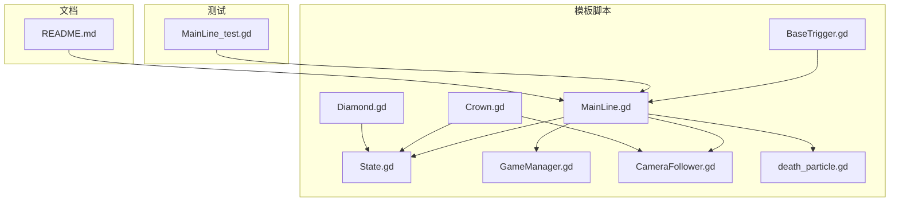
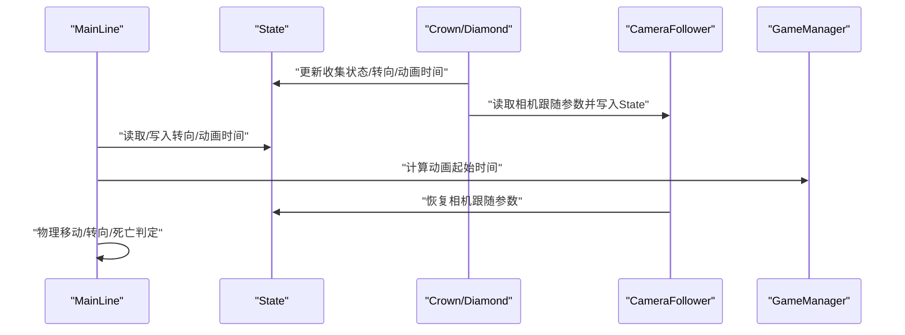
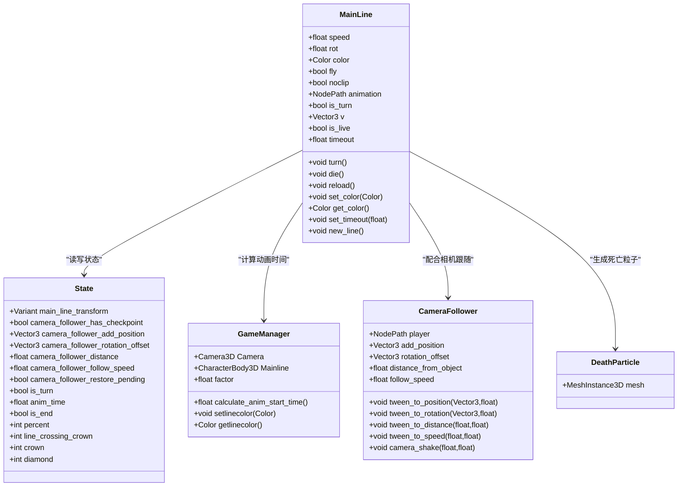
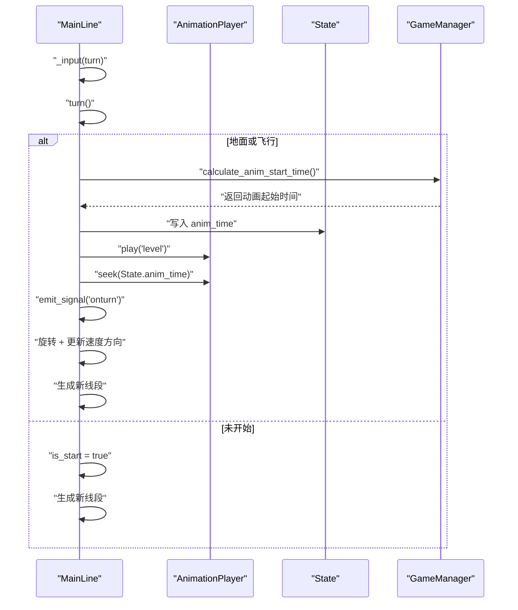
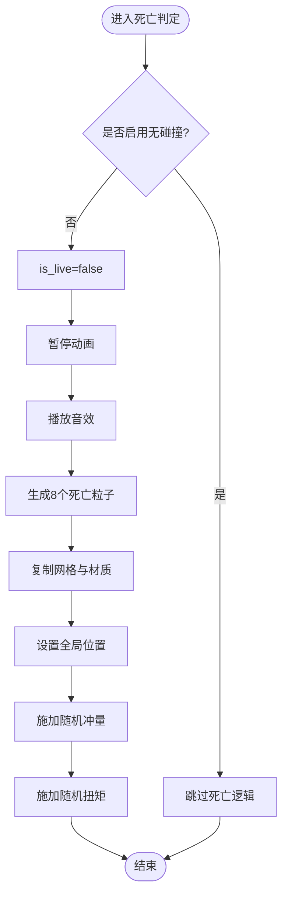
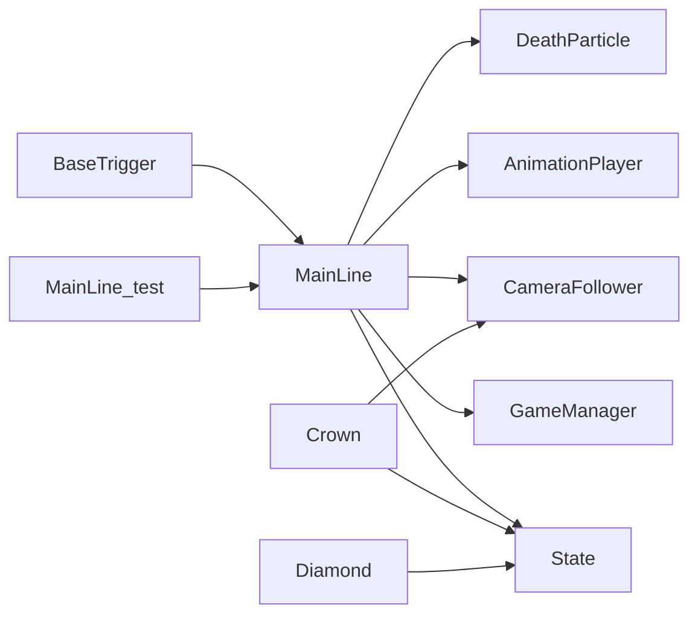

# 角色控制系统

<cite>
**本文引用的文件**
- [MainLine.gd](file://#Template/[Scripts]/MainLine.gd)
- [State.gd](file://#Template/[Scripts]/State.gd)
- [GameManager.gd](file://#Template/[Scripts]/GameManager.gd)
- [CameraFollower.gd](file://#Template/[Scripts]/CameraScripts/CameraFollower.gd)
- [BaseTrigger.gd](file://#Template/[Scripts]/Trigger/BaseTrigger.gd)
- [Crown.gd](file://#Template/[Scripts]/Trigger/Crown.gd)
- [Diamond.gd](file://#Template/[Scripts]/Trigger/Diamond.gd)
- [death_particle.gd](file://#Template/[Scripts]/death_particle.gd)
- [MainLine_test.gd](file://Tests/MainLine_test.gd)
- [README.md](file://README.md)
</cite>

## 目录
1. [简介](#简介)
2. [项目结构](#项目结构)
3. [核心组件](#核心组件)
4. [架构总览](#架构总览)
5. [详细组件分析](#详细组件分析)
6. [依赖关系分析](#依赖关系分析)
7. [性能考量](#性能考量)
8. [故障排查指南](#故障排查指南)
9. [结论](#结论)
10. [附录](#附录)

## 简介
本文件围绕角色控制系统进行深入解析，重点阐述 MainLine 类的实现原理与工作机制，涵盖 CharacterBody3D 物理移动、方向控制逻辑、死亡机制、移动状态管理、物理参数配置、动画播放控制等关键点。同时说明与 State 节点的状态同步机制，以及与触发器、相机等系统的交互关系，并提供性能优化建议与常见问题解决方案。

## 项目结构
本项目采用模板化组织，核心逻辑集中在 #Template/[Scripts] 下，测试位于 Tests 目录，README 提供快速入门与输入说明。

图表来源
- [MainLine.gd:1-224](file://#Template/[Scripts]/MainLine.gd#L1-L224)
- [State.gd:1-23](file://#Template/[Scripts]/State.gd#L1-L23)
- [GameManager.gd:1-47](file://#Template/[Scripts]/GameManager.gd#L1-L47)
- [CameraFollower.gd:1-168](file://#Template/[Scripts]/CameraScripts/CameraFollower.gd#L1-L168)
- [BaseTrigger.gd:1-102](file://#Template/[Scripts]/Trigger/BaseTrigger.gd#L1-L102)
- [Crown.gd:1-52](file://#Template/[Scripts]/Trigger/Crown.gd#L1-L52)
- [Diamond.gd:1-17](file://#Template/[Scripts]/Trigger/Diamond.gd#L1-L17)
- [death_particle.gd:1-4](file://#Template/[Scripts]/death_particle.gd#L1-L4)
- [MainLine_test.gd:1-250](file://Tests/MainLine_test.gd#L1-L250)
- [README.md:1-137](file://README.md#L1-L137)

章节来源
- [README.md:53-65](file://README.md#L53-L65)

## 核心组件
- MainLine：继承 CharacterBody3D 的角色主体，负责物理移动、转向、死亡、线段尾迹生成、着陆特效与动画播放控制。
- State：全局状态节点，存储相机跟随参数、转向状态、动画时间、关卡统计等。
- GameManager：提供动画起始时间计算、颜色读取/设置等辅助能力。
- CameraFollower：相机跟随逻辑，支持检查点恢复、平滑跟随与多种 Tween 参数调整。
- 触发器系统：BaseTrigger 提供统一触发框架；Crown/Diamond 实现收集与状态同步。
- 死亡粒子：death_particle.gd 作为刚体掉落粒子实体。

章节来源
- [MainLine.gd:1-224](file://#Template/[Scripts]/MainLine.gd#L1-L224)
- [State.gd:1-23](file://#Template/[Scripts]/State.gd#L1-L23)
- [GameManager.gd:1-47](file://#Template/[Scripts]/GameManager.gd#L1-L47)
- [CameraFollower.gd:1-168](file://#Template/[Scripts]/CameraScripts/CameraFollower.gd#L1-L168)
- [BaseTrigger.gd:1-102](file://#Template/[Scripts]/Trigger/BaseTrigger.gd#L1-L102)
- [Crown.gd:1-52](file://#Template/[Scripts]/Trigger/Crown.gd#L1-L52)
- [Diamond.gd:1-17](file://#Template/[Scripts]/Trigger/Diamond.gd#L1-L17)
- [death_particle.gd:1-4](file://#Template/[Scripts]/death_particle.gd#L1-L4)

## 架构总览
MainLine 与 State 之间通过共享变量进行状态同步，例如转向状态、动画时间、相机跟随参数等。触发器在碰撞时更新 State 并驱动相机跟随与 UI 表现。相机跟随器根据 State 的检查点恢复相机参数。GameManager 提供动画起始时间计算，用于保证动画与物理移动的同步。

图表来源
- [MainLine.gd:42-124](file://#Template/[Scripts]/MainLine.gd#L42-L124)
- [State.gd:1-23](file://#Template/[Scripts]/State.gd#L1-L23)
- [Crown.gd:25-51](file://#Template/[Scripts]/Trigger/Crown.gd#L25-L51)
- [Diamond.gd:7-12](file://#Template/[Scripts]/Trigger/Diamond.gd#L7-L12)
- [CameraFollower.gd:30-72](file://#Template/[Scripts]/CameraScripts/CameraFollower.gd#L30-L72)
- [GameManager.gd:23-39](file://#Template/[Scripts]/GameManager.gd#L23-L39)

## 详细组件分析

### MainLine 类实现详解
- 继承与导出属性
  - 继承 CharacterBody3D，提供速度、转向角度、颜色、飞行模式、无碰撞模式、动画节点路径、转向标志等导出属性。
  - 通过 @onready 初始化网格、材质、动画节点、着陆粒子等资源。
- 生命周期与状态同步
  - _ready：在运行时读取当前场景，若处于结束状态则重载；从 State 恢复 transform 与转向状态。
- 物理移动与重力
  - _physics_process：若不在地板上则施加重力；将 v.x/z 赋给 velocity 并调用 move_and_slide；若撞墙则死亡；飞行模式下固定 Y 坐标。
- 地面/空中状态与线段尾迹
  - _process：检测着陆特效、生成线段、计算线段长度与朝向；地面阶段同步所有地面段的 Y 值；离地时清空地面段列表并发出 on_sky。
- 输入与转向
  - _input：响应转向输入，调用 turn()；内部维护 is_start、is_turn、v 等状态，生成新线段并发射信号。
- 动画播放控制
  - turn()：在地面或飞行时播放动画，结合 GameManager 计算动画起始时间；seek 到 State.anim_time；随后执行转向并更新速度方向。
- 死亡机制
  - die()：若未开启无碰撞，暂停动画、播放音效、生成多个死亡粒子，赋予随机冲量与扭矩；随后可配合重试逻辑。
- 线段尾迹管理
  - new_line()：创建线段 MeshInstance3D，继承材质与网格，加入 PlayerTailHolder 或场景根节点；地面段加入 floor_segment_lines。
- 其他工具
  - reload()：将相机跟随参数与转向状态写回 State 并重载场景。
  - set_color/get_color：动态设置/读取材质颜色。
  - set_timeout：设置动画延迟。

图表来源
- [MainLine.gd:1-224](file://#Template/[Scripts]/MainLine.gd#L1-L224)
- [State.gd:1-23](file://#Template/[Scripts]/State.gd#L1-L23)
- [GameManager.gd:1-47](file://#Template/[Scripts]/GameManager.gd#L1-L47)
- [CameraFollower.gd:1-168](file://#Template/[Scripts]/CameraScripts/CameraFollower.gd#L1-L168)
- [death_particle.gd:1-4](file://#Template/[Scripts]/death_particle.gd#L1-L4)

章节来源
- [MainLine.gd:42-124](file://#Template/[Scripts]/MainLine.gd#L42-L124)
- [MainLine.gd:139-184](file://#Template/[Scripts]/MainLine.gd#L139-L184)
- [MainLine.gd:195-213](file://#Template/[Scripts]/MainLine.gd#L195-L213)

#### 转向流程时序图

图表来源
- [MainLine.gd:105-113](file://#Template/[Scripts]/MainLine.gd#L105-L113)
- [MainLine.gd:168-184](file://#Template/[Scripts]/MainLine.gd#L168-L184)
- [GameManager.gd:23-39](file://#Template/[Scripts]/GameManager.gd#L23-L39)

#### 死亡判定与粒子生成流程图

图表来源
- [MainLine.gd:197-213](file://#Template/[Scripts]/MainLine.gd#L197-L213)
- [death_particle.gd:1-4](file://#Template/[Scripts]/death_particle.gd#L1-L4)

### State 节点状态同步机制
- 关键字段：main_line_transform、camera_follower_*、is_turn、anim_time、is_end、percent、line_crossing_crown、crown、diamond 等。
- MainLine 在 _ready 时从 State 恢复 transform 与 is_turn；turn() 时写入 anim_time；reload() 时重置相机跟随参数并写回 State。
- 触发器（Crown/Diamond）在碰撞时更新相应统计与检查点，供相机跟随器恢复使用。

章节来源
- [State.gd:1-23](file://#Template/[Scripts]/State.gd#L1-L23)
- [MainLine.gd:48-51](file://#Template/[Scripts]/MainLine.gd#L48-L51)
- [MainLine.gd:114-124](file://#Template/[Scripts]/MainLine.gd#L114-L124)
- [Crown.gd:25-48](file://#Template/[Scripts]/Trigger/Crown.gd#L25-L48)
- [Diamond.gd:7-12](file://#Template/[Scripts]/Trigger/Diamond.gd#L7-L12)

### 与触发器、相机的交互
- 触发器 BaseTrigger 提供统一的触发框架，子类仅需实现 _on_triggered()。
- Crown：玩家进入时增加 Crown 数量、记录 MainLine transform、读取相机跟随参数写入 State、播放 Crown 动画并等待结束再销毁。
- Diamond：玩家进入时增加 Diamond 数量、播放粒子与动画后销毁。
- CameraFollower：在 _ready 与 _process 中根据 State 的检查点恢复相机参数，支持平滑跟随与多种 Tween 调整。

章节来源
- [BaseTrigger.gd:1-102](file://#Template/[Scripts]/Trigger/BaseTrigger.gd#L1-L102)
- [Crown.gd:1-52](file://#Template/[Scripts]/Trigger/Crown.gd#L1-L52)
- [Diamond.gd:1-17](file://#Template/[Scripts]/Trigger/Diamond.gd#L1-L17)
- [CameraFollower.gd:30-72](file://#Template/[Scripts]/CameraScripts/CameraFollower.gd#L30-L72)

### 使用示例与操作要点
- 转向：绑定输入动作“turn”，调用 turn()；在地面或飞行状态下会播放动画并执行转向。
- 飞行模式：设置 fly 为 true，角色将忽略重力影响并在固定 Y 坐标移动。
- 无碰撞模式：设置 noclip 为 true，死亡判定将被跳过。
- 动画同步：通过 GameManager.calculate_anim_start_time() 计算动画起始时间，结合 State.anim_time 实现物理与动画同步。
- 重试/重载：调用 reload() 将相机跟随参数与状态写回 State 并重载场景。

章节来源
- [MainLine.gd:105-113](file://#Template/[Scripts]/MainLine.gd#L105-L113)
- [MainLine.gd:168-184](file://#Template/[Scripts]/MainLine.gd#L168-L184)
- [MainLine.gd:197-213](file://#Template/[Scripts]/MainLine.gd#L197-L213)
- [GameManager.gd:23-39](file://#Template/[Scripts]/GameManager.gd#L23-L39)
- [MainLine.gd:114-124](file://#Template/[Scripts]/MainLine.gd#L114-L124)

## 依赖关系分析
- MainLine 依赖 State 进行状态持久化与相机跟随参数恢复；依赖 GameManager 计算动画起始时间；依赖 AnimationPlayer 控制动画；依赖 CameraFollower 实现跟随体验。
- 触发器系统通过 Area3D 与 BodyEnter 事件与 MainLine 交互，更新 State 并驱动相机跟随。
- 测试用例覆盖 MainLine 的属性、信号与方法存在性，验证基本行为。

图表来源
- [MainLine.gd:1-224](file://#Template/[Scripts]/MainLine.gd#L1-L224)
- [State.gd:1-23](file://#Template/[Scripts]/State.gd#L1-L23)
- [GameManager.gd:1-47](file://#Template/[Scripts]/GameManager.gd#L1-L47)
- [CameraFollower.gd:1-168](file://#Template/[Scripts]/CameraScripts/CameraFollower.gd#L1-L168)
- [Crown.gd:1-52](file://#Template/[Scripts]/Trigger/Crown.gd#L1-L52)
- [Diamond.gd:1-17](file://#Template/[Scripts]/Trigger/Diamond.gd#L1-L17)
- [BaseTrigger.gd:1-102](file://#Template/[Scripts]/Trigger/BaseTrigger.gd#L1-L102)
- [MainLine_test.gd:1-250](file://Tests/MainLine_test.gd#L1-L250)

章节来源
- [MainLine_test.gd:6-29](file://Tests/MainLine_test.gd#L6-L29)

## 性能考量
- 线段尾迹管理
  - 地面段列表仅在地面阶段维护，离地清空，避免无效节点累积。
  - 线段数量与缩放计算在每帧进行，建议在复杂场景中限制 tailScale 或合并渲染批次。
- 动画同步
  - 通过 GameManager 计算动画起始时间，减少因物理步长差异导致的动画错位。
- 相机跟随
  - 使用 slerp 平滑跟随，必要时可调整 follow_speed；相机抖动为即时计算，注意帧率波动影响。
- 死亡粒子
  - 一次性生成多个刚体粒子，建议在密集场景中限制数量或使用对象池。

## 故障排查指南
- 转向无效
  - 检查输入动作“turn”是否正确绑定；确认 is_live 为真且处于地面或飞行状态。
  - 确认 AnimationPlayer 路径与动画名称正确。
- 动画不同步
  - 检查 GameManager.calculate_anim_start_time() 返回值；确认 State.anim_time 已正确写入。
- 相机未恢复
  - 确认 State 中相机跟随参数已写入；检查 CameraFollower._apply_state_checkpoint() 是否被调用。
- 死亡不触发
  - 检查 noclip 是否开启；确认碰撞体与触发器配置正确。
- 线段丢失
  - 确认 PlayerTailHolder 存在；若不存在，MainLine 会回退到场景根节点。

章节来源
- [MainLine.gd:105-113](file://#Template/[Scripts]/MainLine.gd#L105-L113)
- [MainLine.gd:168-184](file://#Template/[Scripts]/MainLine.gd#L168-L184)
- [MainLine.gd:197-213](file://#Template/[Scripts]/MainLine.gd#L197-L213)
- [GameManager.gd:23-39](file://#Template/[Scripts]/GameManager.gd#L23-L39)
- [CameraFollower.gd:54-72](file://#Template/[Scripts]/CameraScripts/CameraFollower.gd#L54-L72)

## 结论
MainLine 通过 CharacterBody3D 提供稳定的物理移动与重力控制，结合 State 的状态同步与 GameManager 的动画时间计算，实现了与相机跟随、触发器系统的无缝协作。其转向、飞行、无碰撞、死亡等特殊状态均可通过导出属性与方法灵活配置。建议在复杂场景中关注线段尾迹与粒子性能，并通过测试用例持续验证核心行为。

## 附录
- 输入控制参考：README 中列出的按键与操作说明。
- 测试运行：gdUnit4 测试框架支持无头模式与编辑器内运行。

章节来源
- [README.md:43-52](file://README.md#L43-L52)
- [README.md:67-79](file://README.md#L67-L79)