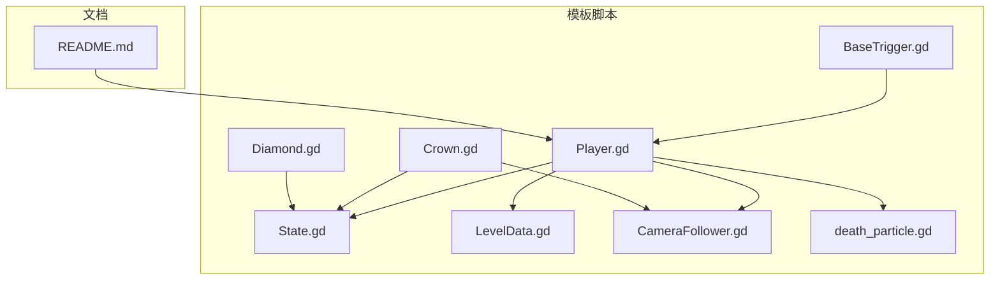
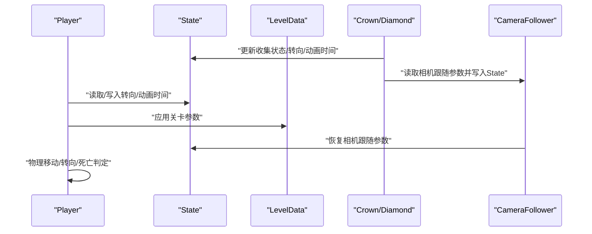
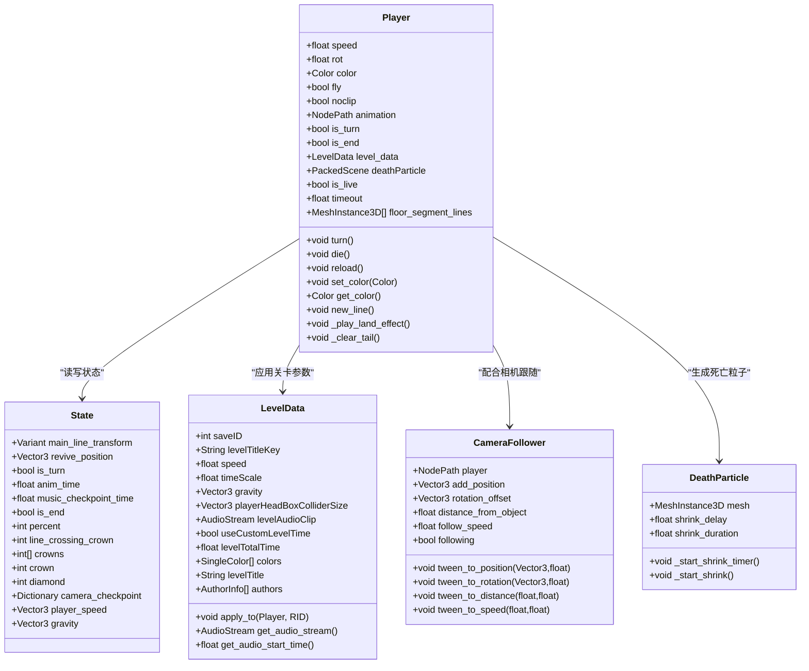
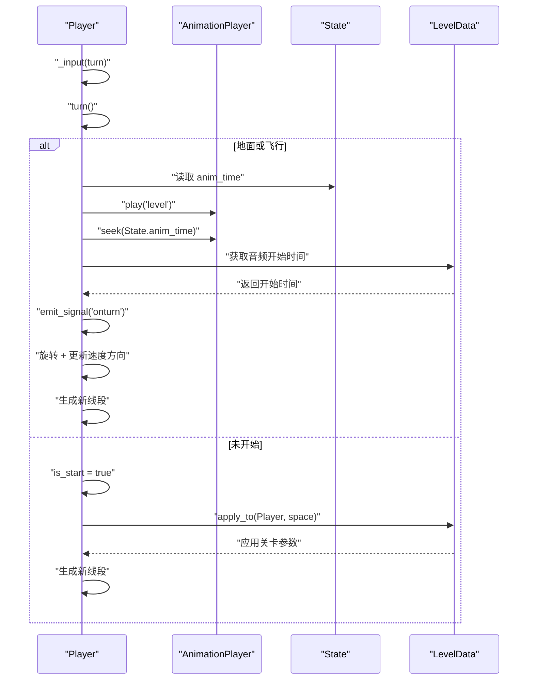
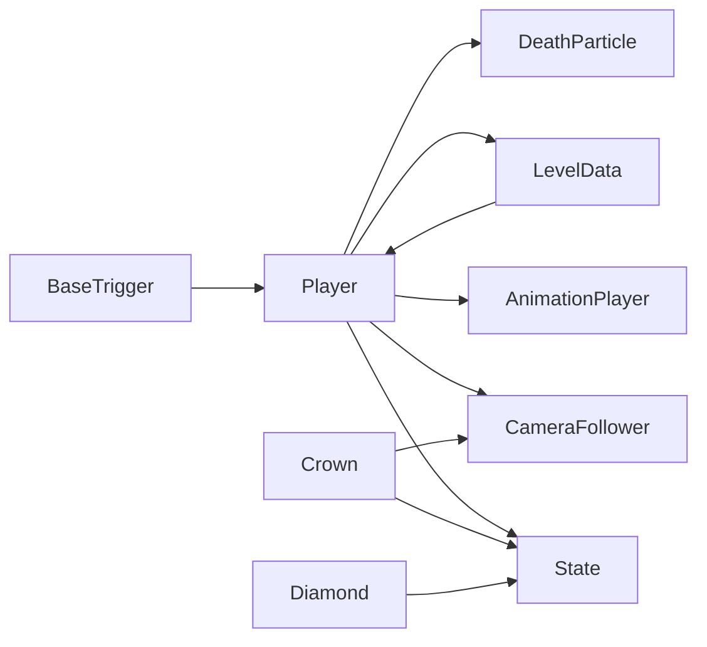

# 角色控制系统

<cite>
**本文引用的文件**
- [Player.gd](file://#Template/[Scripts]/Level/Player.gd)
- [State.gd](file://#Template/[Scripts]/State.gd)
- [LevelData.gd](file://#Template/[Scripts]/Settings/LevelData.gd)
- [CameraFollower.gd](file://#Template/[Scripts]/CameraScripts/CameraFollower.gd)
- [BaseTrigger.gd](file://#Template/[Scripts]/Trigger/BaseTrigger.gd)
- [Crown.gd](file://#Template/[Scripts]/Trigger/Crown.gd)
- [Diamond.gd](file://#Template/[Scripts]/Trigger/Diamond.gd)
- [death_particle.gd](file://#Template/[Scripts]/Level/death_particle.gd)
- [README.md](file://README.md)
</cite>

## 目录
1. [简介](#简介)
2. [项目结构](#项目结构)
3. [核心组件](#核心组件)
4. [架构总览](#架构总览)
5. [详细组件分析](#详细组件分析)
6. [依赖关系分析](#依赖关系分析)
7. [性能考量](#性能考量)
8. [故障排查指南](#故障排查指南)
9. [结论](#结论)
10. [附录](#附录)

## 简介
本文件围绕角色控制系统进行深入解析，重点阐述 Player 类的实现原理与工作机制，涵盖 CharacterBody3D 物理移动、方向控制逻辑、死亡机制、移动状态管理、物理参数配置、动画播放控制等关键点。同时说明与 State 节点的状态同步机制，以及与触发器、相机等系统的交互关系，并提供性能优化建议与常见问题解决方案。

**更新** 本次更新反映了角色控制器的重大重构：MainLine.gd 重命名为 Player.gd，增加了新的线绘制机制、粒子效果、物理集成和 LevelData 系统兼容性，从原来的 230 行代码扩展到 233 行。

## 项目结构
本项目采用模板化组织，核心逻辑集中在 #Template/[Scripts] 下，测试位于 Tests 目录，README 提供快速入门与输入说明。

**图表来源**
- [Player.gd:1-233](file://#Template/[Scripts]/Level/Player.gd#L1-L233)
- [State.gd:1-159](file://#Template/[Scripts]/State.gd#L1-L159)
- [LevelData.gd:1-48](file://#Template/[Scripts]/Settings/LevelData.gd#L1-L48)
- [CameraFollower.gd:1-150](file://#Template/[Scripts]/CameraScripts/CameraFollower.gd#L1-L150)
- [BaseTrigger.gd:1-38](file://#Template/[Scripts]/Trigger/BaseTrigger.gd#L1-L38)
- [Crown.gd:1-14](file://#Template/[Scripts]/Trigger/Crown.gd#L1-L14)
- [Diamond.gd:1-15](file://#Template/[Scripts]/Trigger/Diamond.gd#L1-L15)
- [death_particle.gd:1-28](file://#Template/[Scripts]/Level/death_particle.gd#L1-L28)
- [README.md:1-102](file://README.md#L1-L102)

**章节来源**
- [README.md:52-61](file://README.md#L52-L61)

## 核心组件
- Player：继承 CharacterBody3D 的角色主体，负责物理移动、转向、死亡、线段尾迹生成、着陆特效与动画播放控制。
- State：全局状态节点，存储相机跟随参数、转向状态、动画时间、关卡统计等。
- LevelData：关卡数据资源，用于存储关卡配置，包括速度、重力、颜色等参数。
- CameraFollower：相机跟随逻辑，支持检查点恢复、平滑跟随与多种 Tween 参数调整。
- 触发器系统：BaseTrigger 提供统一触发框架；Crown/Diamond 实现收集与状态同步。
- 死亡粒子：death_particle.gd 作为刚体掉落粒子实体，支持缩放动画。

**更新** 新增了 LevelData 系统，提供关卡参数配置和物理集成功能。

**章节来源**
- [Player.gd:1-233](file://#Template/[Scripts]/Level/Player.gd#L1-L233)
- [State.gd:1-159](file://#Template/[Scripts]/State.gd#L1-L159)
- [LevelData.gd:1-48](file://#Template/[Scripts]/Settings/LevelData.gd#L1-L48)
- [CameraFollower.gd:1-150](file://#Template/[Scripts]/CameraScripts/CameraFollower.gd#L1-L150)
- [BaseTrigger.gd:1-38](file://#Template/[Scripts]/Trigger/BaseTrigger.gd#L1-L38)
- [Crown.gd:1-14](file://#Template/[Scripts]/Trigger/Crown.gd#L1-L14)
- [Diamond.gd:1-15](file://#Template/[Scripts]/Trigger/Diamond.gd#L1-L15)
- [death_particle.gd:1-28](file://#Template/[Scripts]/Level/death_particle.gd#L1-L28)

## 架构总览
Player 与 State 之间通过共享变量进行状态同步，例如转向状态、动画时间、相机跟随参数等。LevelData 系统提供关卡参数配置，支持物理参数的动态调整。触发器在碰撞时更新 State 并驱动相机跟随与 UI 表现。相机跟随器根据 State 的检查点恢复相机参数。

**图表来源**
- [Player.gd:46-55](file://#Template/[Scripts]/Level/Player.gd#L46-L55)
- [Player.gd:160-185](file://#Template/[Scripts]/Level/Player.gd#L160-L185)
- [State.gd:86-94](file://#Template/[Scripts]/State.gd#L86-L94)
- [LevelData.gd:26-36](file://#Template/[Scripts]/Settings/LevelData.gd#L26-L36)
- [Crown.gd:7-13](file://#Template/[Scripts]/Trigger/Crown.gd#L7-L13)
- [Diamond.gd:6-11](file://#Template/[Scripts]/Trigger/Diamond.gd#L6-L11)
- [CameraFollower.gd:47-72](file://#Template/[Scripts]/CameraScripts/CameraFollower.gd#L47-L72)

## 详细组件分析

### Player 类实现详解
- 继承与导出属性
  - 继承 CharacterBody3D，提供速度、转向角度、颜色、飞行模式、无碰撞模式、动画节点路径、转向标志等导出属性。
  - 新增 level_data 属性，支持 LevelData 系统集成。
  - 通过 @onready 初始化网格、材质、动画节点、着陆粒子等资源。
- 生命周期与状态同步
  - _ready：设置实例引用，在运行时从 State 恢复 transform 与转向状态。
- 物理移动与重力
  - _physics_process：若不在地板上则施加重力；将 v.x/z 赋给 velocity 并调用 move_and_slide；若撞墙则死亡；飞行模式下固定 Y 坐标。
- 地面/空中状态与线段尾迹
  - _process：检测着陆特效、生成线段、计算线段长度与朝向；地面阶段同步所有地面段的 Y 值；离地时清空地面段列表并发出 on_sky。
- 输入与转向
  - _input：响应转向输入，调用 turn()；内部维护 is_start、is_turn、v 等状态，生成新线段并发射信号。
- 动画播放控制
  - turn()：在地面或飞行时播放动画，结合 LevelData 获取音频开始时间；seek 到 State.anim_time；随后执行转向并更新速度方向。
- 死亡机制
  - die()：若未开启无碰撞，暂停动画、播放音效、生成多个死亡粒子，赋予随机冲量与扭矩；支持自定义死亡粒子场景。
- 线段尾迹管理
  - new_line()：创建线段 MeshInstance3D，继承材质与网格，加入 PlayerTailHolder 或场景根节点；地面段加入 floor_segment_lines。
- LevelData 集成
  - 支持通过 level_data.apply_to() 应用关卡参数到 Player 和物理空间。
  - 自动播放关卡音频流，支持音频同步。

**更新** 新增了 LevelData 系统集成，支持关卡参数的动态应用和音频同步。

**图表来源**
- [Player.gd:1-233](file://#Template/[Scripts]/Level/Player.gd#L1-L233)
- [State.gd:1-159](file://#Template/[Scripts]/State.gd#L1-L159)
- [LevelData.gd:1-48](file://#Template/[Scripts]/Settings/LevelData.gd#L1-L48)
- [CameraFollower.gd:1-150](file://#Template/[Scripts]/CameraScripts/CameraFollower.gd#L1-L150)
- [death_particle.gd:1-28](file://#Template/[Scripts]/Level/death_particle.gd#L1-L28)

**章节来源**
- [Player.gd:46-55](file://#Template/[Scripts]/Level/Player.gd#L46-L55)
- [Player.gd:160-185](file://#Template/[Scripts]/Level/Player.gd#L160-L185)
- [Player.gd:198-232](file://#Template/[Scripts]/Level/Player.gd#L198-L232)

#### 转向流程时序图

**图表来源**
- [Player.gd:106-109](file://#Template/[Scripts]/Level/Player.gd#L106-L109)
- [Player.gd:160-185](file://#Template/[Scripts]/Level/Player.gd#L160-L185)
- [LevelData.gd:44-47](file://#Template/[Scripts]/Settings/LevelData.gd#L44-L47)

#### 死亡判定与粒子生成流程图

**图表来源**
- [Player.gd:198-232](file://#Template/[Scripts]/Level/Player.gd#L198-L232)
- [death_particle.gd:1-28](file://#Template/[Scripts]/Level/death_particle.gd#L1-L28)

### State 节点状态同步机制
- 关键字段：main_line_transform、revive_position、is_turn、anim_time、music_checkpoint_time、is_end、percent、line_crossing_crown、crowns、crown、diamond 等。
- Player 在 _ready 时从 State 恢复 transform 与 is_turn；turn() 时读取 anim_time；reload() 时重置相机跟随参数并写回 State。
- 触发器（Crown/Diamond）在碰撞时更新相应统计与检查点，供相机跟随器恢复使用。

**更新** State 节点现在包含 revive_position 字段，支持重生位置的保存和恢复。

**章节来源**
- [State.gd:1-159](file://#Template/[Scripts]/State.gd#L1-L159)
- [Player.gd:46-55](file://#Template/[Scripts]/Level/Player.gd#L46-L55)
- [Player.gd:111-117](file://#Template/[Scripts]/Level/Player.gd#L111-L117)
- [Crown.gd:7-13](file://#Template/[Scripts]/Trigger/Crown.gd#L7-L13)
- [Diamond.gd:6-11](file://#Template/[Scripts]/Trigger/Diamond.gd#L6-L11)

### LevelData 系统集成
- 关卡参数管理：提供速度、重力、时间缩放、颜色等参数的集中管理。
- 物理集成：通过 apply_to() 方法将关卡参数应用到 Player 和物理空间。
- 音频同步：支持关卡音频流的自动播放和时间同步。
- 颜色系统：支持 MultipleColor 资源的批量应用。

**新增** LevelData 系统提供了完整的关卡配置管理功能，增强了角色控制系统的灵活性。

**章节来源**
- [LevelData.gd:1-48](file://#Template/[Scripts]/Settings/LevelData.gd#L1-L48)
- [Player.gd:181-182](file://#Template/[Scripts]/Level/Player.gd#L181-L182)

### 与触发器、相机的交互
- 触发器 BaseTrigger 提供统一的触发框架，子类仅需实现 _on_triggered()。
- Crown：玩家进入时增加 Crown 数量、记录 MainLine transform、读取相机跟随参数写入 State、播放 Crown 动画并等待结束再销毁。
- Diamond：玩家进入时增加 Diamond 数量、播放粒子与动画后销毁。
- CameraFollower：在 _ready 与 _process 中根据 State 的检查点恢复相机参数，支持平滑跟随与多种 Tween 调整。

**章节来源**
- [BaseTrigger.gd:1-38](file://#Template/[Scripts]/Trigger/BaseTrigger.gd#L1-L38)
- [Crown.gd:1-14](file://#Template/[Scripts]/Trigger/Crown.gd#L1-L14)
- [Diamond.gd:1-15](file://#Template/[Scripts]/Trigger/Diamond.gd#L1-L15)
- [CameraFollower.gd:47-72](file://#Template/[Scripts]/CameraScripts/CameraFollower.gd#L47-L72)

### 使用示例与操作要点
- 转向：绑定输入动作"turn"，调用 turn()；在地面或飞行状态下会播放动画并执行转向。
- 飞行模式：设置 fly 为 true，角色将忽略重力影响并在固定 Y 坐标移动。
- 无碰撞模式：设置 noclip 为 true，死亡判定将被跳过。
- LevelData 集成：通过 level_data 属性设置关卡数据，自动应用速度、重力等参数。
- 音频同步：LevelData 支持关卡音频的自动播放和时间同步。
- 重试/重载：调用 reload() 将相机跟随参数与状态写回 State 并重载场景。

**更新** 新增了 LevelData 系统的使用方法和音频同步功能。

**章节来源**
- [Player.gd:106-109](file://#Template/[Scripts]/Level/Player.gd#L106-L109)
- [Player.gd:160-185](file://#Template/[Scripts]/Level/Player.gd#L160-L185)
- [Player.gd:198-232](file://#Template/[Scripts]/Level/Player.gd#L198-L232)
- [Player.gd:111-117](file://#Template/[Scripts]/Level/Player.gd#L111-L117)

## 依赖关系分析
- Player 依赖 State 进行状态持久化与相机跟随参数恢复；依赖 LevelData 进行关卡参数应用；依赖 AnimationPlayer 控制动画；依赖 CameraFollower 实现跟随体验。
- 触发器系统通过 Area3D 与 BodyEnter 事件与 Player 交互，更新 State 并驱动相机跟随。
- 死亡粒子系统支持自定义场景配置，增强视觉效果。

**更新** 新增了 LevelData 系统的依赖关系，Player 现在可以直接应用关卡参数而无需手动配置。

**图表来源**
- [Player.gd:1-233](file://#Template/[Scripts]/Level/Player.gd#L1-L233)
- [State.gd:1-159](file://#Template/[Scripts]/State.gd#L1-L159)
- [LevelData.gd:1-48](file://#Template/[Scripts]/Settings/LevelData.gd#L1-L48)
- [CameraFollower.gd:1-150](file://#Template/[Scripts]/CameraScripts/CameraFollower.gd#L1-L150)
- [Crown.gd:1-14](file://#Template/[Scripts]/Trigger/Crown.gd#L1-L14)
- [Diamond.gd:1-15](file://#Template/[Scripts]/Trigger/Diamond.gd#L1-L15)
- [BaseTrigger.gd:1-38](file://#Template/[Scripts]/Trigger/BaseTrigger.gd#L1-L38)

## 性能考量
- 线段尾迹管理
  - 地面段列表仅在地面阶段维护，离地清空，避免无效节点累积。
  - 线段数量与缩放计算在每帧进行，建议在复杂场景中限制 tailScale 或合并渲染批次。
- 动画同步
  - 通过 LevelData.get_audio_start_time() 获取精确的音频开始时间，减少动画与音乐的错位。
- 相机跟随
  - 使用 slerp 平滑跟随，必要时可调整 follow_speed；相机抖动为即时计算，注意帧率波动影响。
- 死亡粒子
  - 一次性生成多个刚体粒子，支持自定义场景配置，建议在密集场景中限制数量或使用对象池。
- LevelData 集成
  - 关卡参数应用采用批量处理，避免重复配置造成的性能开销。

**更新** 新增了 LevelData 系统的性能考量，包括批量参数应用和音频同步优化。

## 故障排查指南
- 转向无效
  - 检查输入动作"turn"是否正确绑定；确认 is_live 为真且处于地面或飞行状态。
  - 确认 AnimationPlayer 路径与动画名称正确。
- 动画不同步
  - 检查 LevelData.get_audio_start_time() 返回值；确认 State.anim_time 已正确写入。
- 相机未恢复
  - 确认 State 中相机跟随参数已写入；检查 CameraFollower._apply_state_checkpoint() 是否被调用。
- 死亡不触发
  - 检查 noclip 是否开启；确认碰撞体与触发器配置正确。
- 线段丢失
  - 确认 PlayerTailHolder 存在；若不存在，Player 会回退到场景根节点。
- LevelData 未生效
  - 检查 level_data 资源是否正确设置；确认 apply_to() 方法被调用。
- 音频不同步
  - 检查 MusicPlayer 配置；确认 get_audio_start_time() 返回正确的开始时间。

**更新** 新增了 LevelData 系统相关的故障排查指南。

**章节来源**
- [Player.gd:106-109](file://#Template/[Scripts]/Level/Player.gd#L106-L109)
- [Player.gd:160-185](file://#Template/[Scripts]/Level/Player.gd#L160-L185)
- [Player.gd:198-232](file://#Template/[Scripts]/Level/Player.gd#L198-L232)
- [LevelData.gd:44-47](file://#Template/[Scripts]/Settings/LevelData.gd#L44-L47)
- [CameraFollower.gd:74-91](file://#Template/[Scripts]/CameraScripts/CameraFollower.gd#L74-L91)

## 结论
Player 通过 CharacterBody3D 提供稳定的物理移动与重力控制，结合 State 的状态同步与 LevelData 的关卡参数管理，实现了与相机跟随、触发器系统的无缝协作。其转向、飞行、无碰撞、死亡等特殊状态均可通过导出属性与方法灵活配置。新增的 LevelData 系统进一步增强了角色控制的灵活性和可配置性。建议在复杂场景中关注线段尾迹与粒子性能，并通过测试用例持续验证核心行为。

**更新** 本次重构显著增强了角色控制系统的功能性和可维护性，特别是 LevelData 系统的引入为关卡配置提供了更强大的支持。

## 附录
- 输入控制参考：README 中列出的按键与操作说明。
- 关卡配置：通过 LevelData 资源文件配置关卡参数，包括速度、重力、颜色等。
- 音频同步：LevelData 支持关卡音频的自动播放和精确的时间同步。

**章节来源**
- [README.md:42-51](file://README.md#L42-L51)
- [LevelData.gd:7-22](file://#Template/[Scripts]/Settings/LevelData.gd#L7-L22)
- [Player.gd:167-173](file://#Template/[Scripts]/Level/Player.gd#L167-L173)