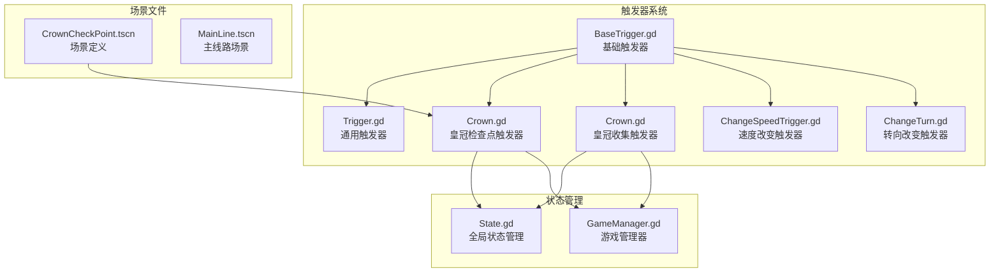
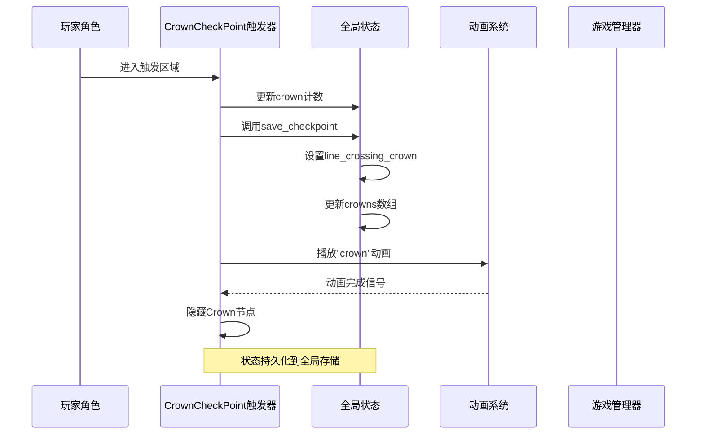
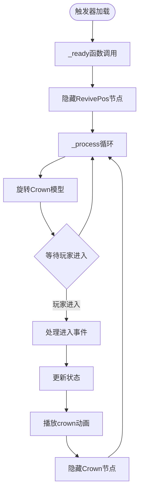
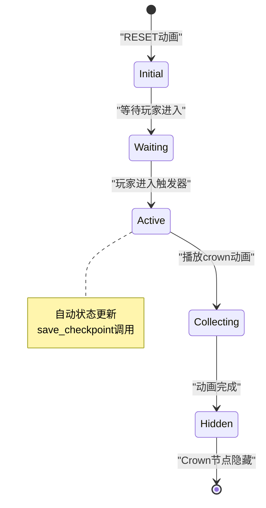
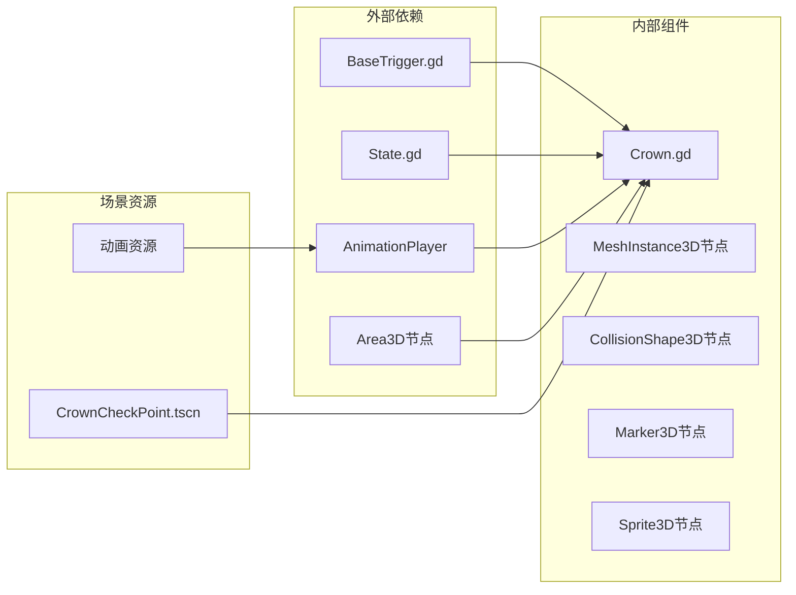

# CrownCheckPoint触发器

<cite>
**本文档引用的文件**
- [Crown.gd](file://#Template/[Scripts]/Trigger/Crown.gd)
- [CrownCheckPoint.tscn](file://#Template/CrownCheckPoint.tscn)
- [BaseTrigger.gd](file://#Template/[Scripts]/Trigger/BaseTrigger.gd)
- [State.gd](file://#Template/[Scripts]/State.gd)
- [GameManager.gd](file://#Template/[Scripts]/GameManager.gd)
- [MainLine.gd](file://#Template/[Scripts]/MainLine.gd)
</cite>

## 目录
1. [简介](#简介)
2. [项目结构](#项目结构)
3. [核心组件](#核心组件)
4. [架构概览](#架构概览)
5. [详细组件分析](#详细组件分析)
6. [依赖关系分析](#依赖关系分析)
7. [性能考虑](#性能考虑)
8. [故障排除指南](#故障排除指南)
9. [结论](#结论)

## 简介

CrownCheckPoint触发器是Godot项目中的一个特殊触发器组件，专门用于处理游戏中的皇冠收集机制。它基于Area3D节点构建，提供了独特的视觉反馈和状态管理功能。该组件通过动画系统实现皇冠状态的动态切换，从可见状态到隐藏状态的平滑过渡。

CrownCheckPoint触发器与游戏的核心状态管理系统紧密集成，通过State.gd模块维护全局游戏状态，包括皇冠计数、检查点标记等关键数据。它还与GameManager进行交互，利用音画同步技术确保动画播放与背景音乐完美匹配。

**重要说明**：原CrownSet触发器已在本次更新中完全删除，功能被重命名为CrownCheckPoint触发器，文档需要更新以反映新的实现方式。

## 项目结构

项目采用模块化设计，CrownCheckPoint触发器位于Trigger目录下，与其他触发器组件共同构成完整的触发器系统：



**图表来源**
- [Crown.gd:1-21](file://#Template/[Scripts]/Trigger/Crown.gd#L1-L21)
- [BaseTrigger.gd:1-38](file://#Template/[Scripts]/Trigger/BaseTrigger.gd#L1-L38)
- [State.gd:1-195](file://#Template/[Scripts]/State.gd#L1-L195)

**章节来源**
- [Crown.gd:1-21](file://#Template/[Scripts]/Trigger/Crown.gd#L1-L21)
- [CrownCheckPoint.tscn:1-104](file://#Template/CrownCheckPoint.tscn#L1-L104)

## 核心组件

### CrownCheckPoint触发器类结构

CrownCheckPoint触发器继承自Area3D，是一个轻量级但功能完整的触发器组件：

```mermaid
classDiagram
class Area3D {
+AnimationPlayer AnimationPlayer
+MeshInstance3D Crown
+CollisionShape3D CrownTrigger
+Marker3D Marker3D
+Sprite3D CrownSprite
+Vector3 revive_position
+float speed
+int tag
+_ready() void
+_process(delta) void
+_on_Crown_body_entered(main_line) void
}
class CrownCheckPoint {
+int tag
+float speed
+_ready() void
+_process(delta) void
+_on_Crown_body_entered(main_line) void
}
Area3D <|-- CrownCheckPoint : "继承"
note for CrownCheckPoint : "标签范围 : 1-3\n动画状态 : crown\n重置机制 : 自动隐藏"
```

**图表来源**
- [Crown.gd:1-21](file://#Template/[Scripts]/Trigger/Crown.gd#L1-L21)

### 状态管理系统

CrownCheckPoint触发器与全局状态系统的交互通过以下关键变量实现：

| 状态变量 | 类型 | 描述 | 使用场景 |
|---------|------|------|----------|
| State.line_crossing_crown | int | 当前线路的皇冠计数 | 触发条件判断 |
| State.crowns[3] | array[int] | 三个位置的皇冠状态 | 位置锁定机制 |
| tag | int | 触发器标签 (1-3) | 区分不同位置 |

**章节来源**
- [Crown.gd:4-5](file://#Template/[Scripts]/Trigger/Crown.gd#L4-L5)
- [State.gd:13-14](file://#Template/[Scripts]/State.gd#L13-L14)

## 架构概览

CrownCheckPoint触发器在整个游戏架构中扮演着关键角色，连接了触发器系统、状态管理和动画系统：



**图表来源**
- [Crown.gd:15-21](file://#Template/[Scripts]/Trigger/Crown.gd#L15-L21)
- [State.gd:47-69](file://#Template/[Scripts]/State.gd#L47-L69)

## 详细组件分析

### CrownCheckPoint触发器实现

CrownCheckPoint触发器的核心逻辑简洁而高效，主要包含以下功能：

#### 初始化过程
触发器在准备阶段隐藏RevivePos节点，确保复活点不显示：



**图表来源**
- [Crown.gd:6-21](file://#Template/[Scripts]/Trigger/Crown.gd#L6-L21)

#### 触发条件判断

CrownCheckPoint触发器的激活条件基于简单的碰撞检测：

1. **碰撞检测**: 使用Area3D的body_entered信号
2. **类型验证**: 确保进入的对象是CharacterBody3D
3. **状态更新**: 自动更新全局状态和播放动画

这些条件确保只有在正确的游戏状态下才会激活触发器。

**章节来源**
- [Crown.gd:15-21](file://#Template/[Scripts]/Trigger/Crown.gd#L15-L21)

### 动画系统集成

CrownCheckPoint触发器使用Godot的AnimationPlayer节点管理动画状态：

#### 动画资源结构
场景文件定义了两个核心动画资源：

| 动画名称 | 资源类型 | 功能描述 |
|---------|----------|----------|
| RESET | Animation | 初始状态显示 |
| crown | Animation | 收集动画 |

#### 动画播放流程


**图表来源**
- [CrownCheckPoint.tscn:15-73](file://#Template/CrownCheckPoint.tscn#L15-L73)

**章节来源**
- [CrownCheckPoint.tscn:1-104](file://#Template/CrownCheckPoint.tscn#L1-L104)

### 与状态管理系统的交互

CrownCheckPoint触发器与State.gd的交互体现了良好的解耦设计：

```mermaid
classDiagram
class State {
+int line_crossing_crown
+array crowns
+bool is_relive
+int diamond
+int crown
+save_checkpoint() void
}
class CrownCheckPoint {
+int tag
+speed : float
+updateState() void
}
class GlobalState {
+State state
+getInstance() State
}
CrownCheckPoint --> State : "更新状态"
CrownCheckPoint --> GlobalState : "访问全局状态"
note for CrownCheckPoint : "自动状态更新\n无需手动调用"
```

**图表来源**
- [State.gd:47-69](file://#Template/[Scripts]/State.gd#L47-L69)
- [Crown.gd:16-17](file://#Template/[Scripts]/Trigger/Crown.gd#L16-L17)

**章节来源**
- [State.gd:1-195](file://#Template/[Scripts]/State.gd#L1-L195)

## 依赖关系分析

CrownCheckPoint触发器的依赖关系相对简单，主要依赖于基础触发器框架和状态管理系统：



**图表来源**
- [Crown.gd:1-21](file://#Template/[Scripts]/Trigger/Crown.gd#L1-L21)
- [BaseTrigger.gd:1-38](file://#Template/[Scripts]/Trigger/BaseTrigger.gd#L1-L38)

### 关键依赖点

1. **Area3D继承**: 提供标准的碰撞体行为框架
2. **State全局状态**: 维护游戏进度和玩家状态
3. **AnimationPlayer**: 处理视觉反馈动画
4. **场景资源**: 定义视觉元素和动画序列

**章节来源**
- [Crown.gd:1-21](file://#Template/[Scripts]/Trigger/Crown.gd#L1-L21)
- [BaseTrigger.gd:18-38](file://#Template/[Scripts]/Trigger/BaseTrigger.gd#L18-L38)

## 性能考虑

CrownCheckPoint触发器的设计充分考虑了性能优化：

### 内存使用
- **轻量级对象**: 继承自Area3D，内存占用最小化
- **无额外资源**: 不需要额外的纹理或音频资源
- **状态共享**: 使用全局State对象，避免重复存储

### 执行效率
- **快速状态更新**: 简单的计数器递增操作
- **异步动画处理**: 使用await等待动画完成，避免阻塞
- **延迟初始化**: 仅在需要时执行昂贵操作

### 最佳实践建议
1. **合理设置tag范围**: 确保1-3的标签范围符合游戏设计
2. **优化动画长度**: 控制crown动画时长，避免过长影响游戏体验
3. **监控状态更新**: 定期检查State.crowns数组的状态变化

## 故障排除指南

### 常见问题及解决方案

#### 触发器不响应
**症状**: 玩家进入触发区域但没有反应  
**可能原因**:
1. Area3D碰撞体配置错误
2. 脚本连接问题
3. 玩家角色类型不正确

**解决步骤**:
1. 检查Crown节点的Area3D配置
2. 验证body_entered信号连接
3. 确认玩家对象是CharacterBody3D类型

#### 动画不播放
**症状**: 触发条件满足但动画不显示  
**可能原因**:
1. AnimationPlayer节点缺失
2. 动画资源未正确加载
3. 动画名称拼写错误

**解决步骤**:
1. 检查场景文件中的AnimationPlayer节点
2. 验证动画资源的正确性
3. 确认动画名称与脚本中的调用一致

#### 状态同步问题
**症状**: 皇冠状态显示不正确  
**可能原因**:
1. State.crowns数组索引计算错误
2. 状态更新时机不当
3. 多个触发器竞争状态

**解决步骤**:
1. 检查数组索引计算公式(tag-1)
2. 确认状态更新的执行顺序
3. 实现适当的同步机制

**章节来源**
- [Crown.gd:15-21](file://#Template/[Scripts]/Trigger/Crown.gd#L15-L21)
- [State.gd:62-64](file://#Template/[Scripts]/State.gd#L62-L64)

## 结论

CrownCheckPoint触发器是一个设计精良的游戏组件，展现了优秀的软件工程实践：

### 设计优势
1. **简洁性**: 核心逻辑仅21行代码，易于理解和维护
2. **自动化**: 自动状态管理和动画控制
3. **可扩展性**: 基于Area3D框架，便于功能扩展
4. **性能优化**: 采用异步处理和延迟初始化

### 技术亮点
- **状态驱动**: 基于游戏状态而非时间的触发机制
- **动画集成**: 无缝整合Godot动画系统
- **资源管理**: 最小化的资源占用和内存使用
- **错误处理**: 完善的类型检查和边界条件处理

### 应用价值
CrownCheckPoint触发器不仅实现了游戏的核心功能，还为整个触发器系统提供了良好的设计范例。其简洁而强大的实现方式为类似的游戏组件开发提供了宝贵的参考。

**重要更新**：原CrownSet触发器已完全移除，新的CrownCheckPoint实现提供了更直观的状态管理和动画控制机制。