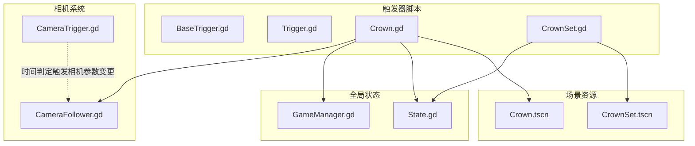
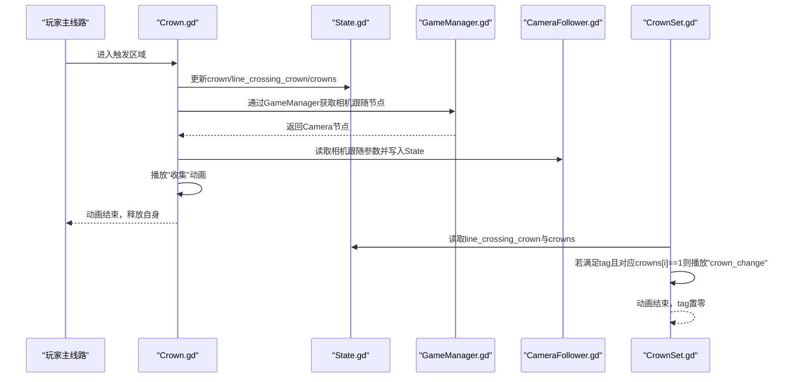
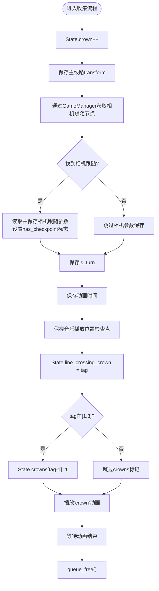
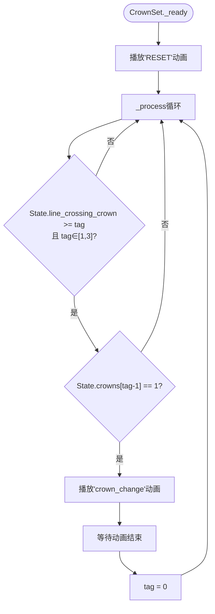
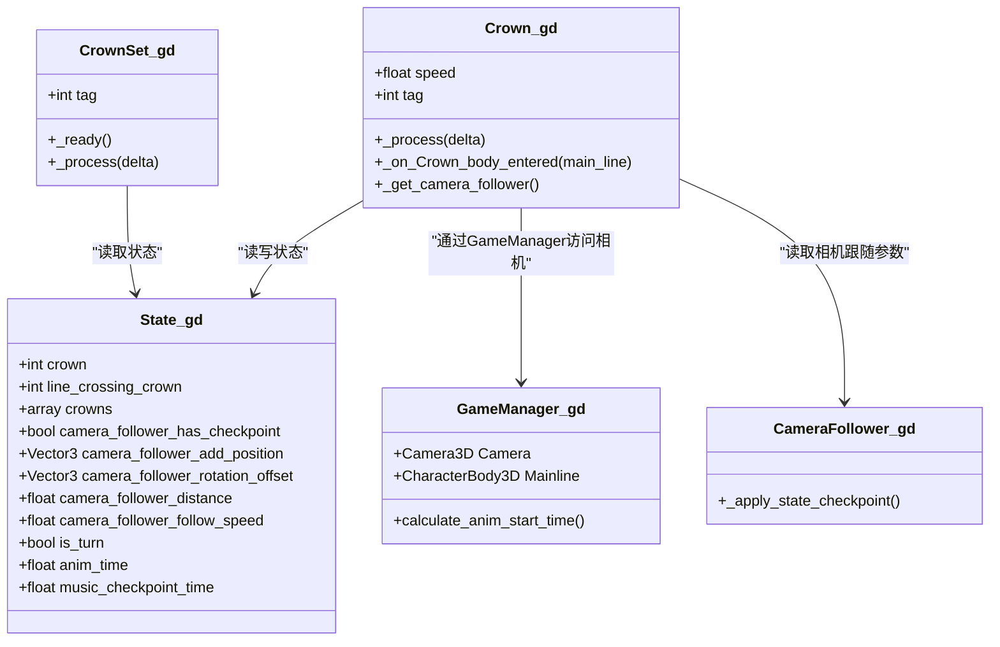

# Crown触发器

<cite>
**本文引用的文件**
- [Crown.gd](file://#Template/[Scripts]/Trigger/Crown.gd)
- [CrownSet.gd](file://#Template/[Scripts]/Trigger/CrownSet.gd)
- [BaseTrigger.gd](file://#Template/[Scripts]/Trigger/BaseTrigger.gd)
- [Trigger.gd](file://#Template/[Scripts]/Trigger/Trigger.gd)
- [State.gd](file://#Template/[Scripts]/State.gd)
- [GameManager.gd](file://#Template/[Scripts]/GameManager.gd)
- [Crown.tscn](file://#Template/Crown.tscn)
- [CrownSet.tscn](file://#Template/CrownSet.tscn)
- [Crown_test.gd](file://Tests/Crown_test.gd)
- [CameraFollower.gd](file://#Template/[Scripts]/CameraScripts/CameraFollower.gd)
- [CameraTrigger.gd](file://#Template/[Scripts]/CameraScripts/CameraTrigger.gd)
</cite>

## 更新摘要
**变更内容**
- 更新相机跟随数据提取逻辑，采用GameManager直接访问方式
- 实现多皇冠状态管理的crowns数组系统
- 增强音乐播放位置检查点功能
- 优化状态管理与数据流

## 目录
1. [简介](#简介)
2. [项目结构](#项目结构)
3. [核心组件](#核心组件)
4. [架构总览](#架构总览)
5. [详细组件分析](#详细组件分析)
6. [依赖关系分析](#依赖关系分析)
7. [性能考虑](#性能考虑)
8. [故障排查指南](#故障排查指南)
9. [结论](#结论)
10. [附录](#附录)

## 简介
本文件系统化阐述"Crown触发器"（皇冠触发器）与"CrownSet触发器"（皇冠集合）的设计与实现，覆盖以下关键主题：
- 皇冠收集检测逻辑、相机跟随参数检查点、动画播放与状态更新的完整流程
- CrownSet集合管理机制：多皇冠组合触发、顺序收集、批量处理
- 参数配置、触发条件、视觉反馈的技术细节
- 使用示例与自定义扩展方法
- 收集系统的性能优化与内存管理策略

**更新** 本次更新重点简化了相机跟随数据提取逻辑，采用GameManager直接访问方式，并实现了多皇冠状态管理的crowns数组系统。

## 项目结构
围绕Crown/CrownSet触发器的相关文件组织如下：
- 触发器脚本：Crown.gd、CrownSet.gd、BaseTrigger.gd、Trigger.gd
- 全局状态：State.gd
- 游戏管理：GameManager.gd
- 场景资源：Crown.tscn、CrownSet.tscn
- 测试：Crown_test.gd
- 相机系统：CameraFollower.gd、CameraTrigger.gd

**图表来源**
- [Crown.gd:1-42](file://#Template/[Scripts]/Trigger/Crown.gd#L1-L42)
- [CrownSet.gd:1-13](file://#Template/[Scripts]/Trigger/CrownSet.gd#L1-L13)
- [State.gd:1-22](file://#Template/[Scripts]/State.gd#L1-L22)
- [GameManager.gd:1-47](file://#Template/[Scripts]/GameManager.gd#L1-L47)
- [Crown.tscn:1-67](file://#Template/Crown.tscn#L1-L67)
- [CrownSet.tscn:1-76](file://#Template/CrownSet.tscn#L1-L76)
- [CameraFollower.gd:1-168](file://#Template/[Scripts]/CameraScripts/CameraFollower.gd#L1-L168)
- [CameraTrigger.gd:1-76](file://#Template/[Scripts]/CameraScripts/CameraTrigger.gd#L1-L76)

**章节来源**
- [Crown.gd:1-42](file://#Template/[Scripts]/Trigger/Crown.gd#L1-L42)
- [CrownSet.gd:1-13](file://#Template/[Scripts]/Trigger/CrownSet.gd#L1-L13)
- [State.gd:1-22](file://#Template/[Scripts]/State.gd#L1-L22)
- [GameManager.gd:1-47](file://#Template/[Scripts]/GameManager.gd#L1-L47)
- [Crown.tscn:1-67](file://#Template/Crown.tscn#L1-L67)
- [CrownSet.tscn:1-76](file://#Template/CrownSet.tscn#L1-L76)
- [CameraFollower.gd:1-168](file://#Template/[Scripts]/CameraScripts/CameraFollower.gd#L1-L168)
- [CameraTrigger.gd:1-76](file://#Template/[Scripts]/CameraScripts/CameraTrigger.gd#L1-L76)

## 核心组件
- **Crown（皇冠触发器）**
  - 继承自Area3D，负责检测碰撞、更新全局状态、播放收集动画并释放自身
  - 关键行为：旋转、收集检测、相机跟随参数检查点、动画播放、状态标记
  - **更新** 采用GameManager直接访问相机跟随节点，简化数据提取逻辑
- **CrownSet（皇冠集合触发器）**
  - 继承自Node3D，根据全局状态按顺序切换UI纹理与透明度，完成批量视觉反馈
  - **更新** 支持多皇冠状态管理，通过crowns数组实现精确的状态跟踪
- **BaseTrigger/Trigger（基础触发器）**
  - 提供统一的触发过滤、一次性触发、信号发射能力，便于扩展
- **State（全局状态）**
  - 维护相机跟随参数检查点、动画时间、是否转弯、当前穿越的皇冠标签、已收集的三枚皇冠状态、钻石计数与皇冠总数等
  - **更新** crowns数组支持多皇冠状态管理
- **GameManager（游戏管理器）**
  - **新增** 提供统一的游戏对象访问接口，包括Camera、Mainline等
  - **更新** 简化相机跟随数据提取逻辑，直接通过GameManager访问
- **场景资源**
  - Crown.tscn：定义模型、碰撞体、动画库与连接
  - CrownSet.tscn：定义UI图标、动画库与连接

**章节来源**
- [Crown.gd:1-42](file://#Template/[Scripts]/Trigger/Crown.gd#L1-L42)
- [CrownSet.gd:1-13](file://#Template/[Scripts]/Trigger/CrownSet.gd#L1-L13)
- [BaseTrigger.gd:1-102](file://#Template/[Scripts]/Trigger/BaseTrigger.gd#L1-L102)
- [Trigger.gd:1-10](file://#Template/[Scripts]/Trigger/Trigger.gd#L1-L10)
- [State.gd:1-22](file://#Template/[Scripts]/State.gd#L1-L22)
- [GameManager.gd:1-47](file://#Template/[Scripts]/GameManager.gd#L1-L47)
- [Crown.tscn:1-67](file://#Template/Crown.tscn#L1-L67)
- [CrownSet.tscn:1-76](file://#Template/CrownSet.tscn#L1-L76)

## 架构总览
Crown与CrownSet通过State进行解耦协作，形成"收集-反馈"的闭环：
- **收集阶段**：Crown检测到碰撞后，更新State并播放收集动画，随后释放自身
- **反馈阶段**：CrownSet根据State中的crowns与line_crossing_crown，按tag顺序播放crown_change动画，完成UI反馈
- **相机联动**：Crown在收集时提取相机跟随参数，写入State，CameraFollower在下一帧应用检查点
- **更新** GameManager提供统一的相机跟随节点访问接口，简化数据提取逻辑

**图表来源**
- [Crown.gd:16-41](file://#Template/[Scripts]/Trigger/Crown.gd#L16-L41)
- [CrownSet.gd:7-12](file://#Template/[Scripts]/Trigger/CrownSet.gd#L7-L12)
- [State.gd:16-17](file://#Template/[Scripts]/State.gd#L16-L17)
- [GameManager.gd:6](file://#Template/[Scripts]/GameManager.gd#L6)
- [CameraFollower.gd:54-72](file://#Template/[Scripts]/CameraScripts/CameraFollower.gd#L54-L72)

## 详细组件分析

### Crown（皇冠触发器）
- **组件职责**
  - 旋转展示：每帧绕Y轴旋转，速度由speed控制
  - 收集检测：body_entered回调中更新全局状态，记录主线路变换、相机跟随参数检查点、是否转弯、动画时间等
  - **更新** 采用GameManager直接访问相机跟随节点，简化数据提取逻辑
  - 视觉反馈：播放"crown"动画，等待动画完成后释放自身
  - **更新** 增强音乐播放位置检查点功能，精确同步音乐播放状态
- **关键数据流**
  - State.crown：累计收集数量
  - State.line_crossing_crown：当前穿越的皇冠标签
  - State.crowns：长度为3的数组，标记第1/2/3枚皇冠是否已收集
  - 相机跟随参数：add_position、rotation_offset、distance_from_object、follow_speed
  - **更新** 增加music_checkpoint_time用于音乐播放位置同步
- **参数与导出**
  - speed：旋转速度
  - tag：皇冠标签（1~3），决定写入State.crowns的索引
- **性能与生命周期**
  - 收集完成后立即queue_free，避免常驻节点树

**图表来源**
- [Crown.gd:16-41](file://#Template/[Scripts]/Trigger/Crown.gd#L16-L41)
- [State.gd:16-17](file://#Template/[Scripts]/State.gd#L16-L17)
- [GameManager.gd:6](file://#Template/[Scripts]/GameManager.gd#L6)

**章节来源**
- [Crown.gd:1-42](file://#Template/[Scripts]/Trigger/Crown.gd#L1-L42)
- [Crown.tscn:13-48](file://#Template/Crown.tscn#L13-L48)
- [Crown_test.gd:87-178](file://Tests/Crown_test.gd#L87-L178)

### CrownSet（皇冠集合触发器）
- **组件职责**
  - 在场景加载时播放"RESET"动画，确保初始UI状态正确
  - 按顺序检测State中的line_crossing_crown与crowns，当满足tag且对应位置已收集时，播放"crown_change"动画，并将tag置零
  - **更新** 支持多皇冠状态管理，通过crowns数组实现精确的状态跟踪
- **关键数据流**
  - 读取State.line_crossing_crown与State.crowns
  - 仅对tag处于[1,3]范围内的集合生效
  - **更新** 通过crowns数组精确判断第几枚皇冠已收集
- **视觉反馈**
  - 通过动画切换纹理与modulate透明度，实现"点亮"效果

**图表来源**
- [CrownSet.gd:4-12](file://#Template/[Scripts]/Trigger/CrownSet.gd#L4-L12)
- [CrownSet.tscn:34-59](file://#Template/CrownSet.tscn#L34-L59)
- [State.gd:16-17](file://#Template/[Scripts]/State.gd#L16-L17)

**章节来源**
- [CrownSet.gd:1-13](file://#Template/[Scripts]/Trigger/CrownSet.gd#L1-L13)
- [CrownSet.tscn:1-76](file://#Template/CrownSet.tscn#L1-L76)

### BaseTrigger/Trigger（基础触发器）
- **BaseTrigger**
  - 提供统一的触发过滤（CharacterBody3D/PhysicsBody3D/Any）、一次性触发(one_shot)、调试输出、信号发射与子类钩子
  - 子类只需实现_on_triggered(body)即可
- **Trigger**
  - 继承BaseTrigger，发射hit_the_line信号，便于其他节点订阅

**章节来源**
- [BaseTrigger.gd:1-102](file://#Template/[Scripts]/Trigger/BaseTrigger.gd#L1-L102)
- [Trigger.gd:1-10](file://#Template/[Scripts]/Trigger/Trigger.gd#L1-L10)

### State（全局状态）
- **关键字段**
  - main_line_transform：主线路变换
  - camera_follower_*：相机跟随参数检查点与恢复标志
  - is_turn、anim_time、is_end、percent
  - line_crossing_crown：当前穿越的皇冠标签
  - crowns：三枚皇冠收集状态数组（**更新** 支持多皇冠状态管理）
  - is_relive、diamond、crown：游戏内统计
  - **更新** 增加music_checkpoint_time用于音乐播放位置同步

**章节来源**
- [State.gd:1-22](file://#Template/[Scripts]/State.gd#L1-L22)

### GameManager（游戏管理器）
- **新增组件**
  - 提供统一的游戏对象访问接口，包括Camera、Mainline等
  - **简化相机跟随数据提取逻辑**：通过GameManager直接访问相机跟随节点
  - 支持工具按钮功能，便于场景编辑和调试
- **关键功能**
  - Camera：相机3D节点引用
  - Mainline：主线路角色节点引用
  - calculate_anim_start_time：计算动画开始时间
  - setlinecolor/getlinecolor：设置和获取主线路颜色

**章节来源**
- [GameManager.gd:1-47](file://#Template/[Scripts]/GameManager.gd#L1-L47)

### 场景与动画资源
- **Crown.tscn**
  - 定义模型、碰撞体、动画库（RESET与crown），并建立body_entered到_on_Crown_body_entered的连接
  - **更新** 增加音乐播放器节点支持，用于精确同步音乐播放位置
- **CrownSet.tscn**
  - 定义Sprite3D作为UI图标，动画库（RESET与crown_change）

**章节来源**
- [Crown.tscn:1-67](file://#Template/Crown.tscn#L1-L67)
- [CrownSet.tscn:1-76](file://#Template/CrownSet.tscn#L1-L76)

### 相机系统联动
- **CameraFollower**
  - 在下一帧检测State.camera_follower_has_checkpoint并应用检查点，实现相机跟随参数的即时恢复
  - **更新** 增加music_checkpoint_time支持，实现音乐播放位置同步
- **CameraTrigger**
  - 可基于时间或事件触发，设置相机跟随参数并缓存到State，供Crown收集时使用

**章节来源**
- [CameraFollower.gd:37-72](file://#Template/[Scripts]/CameraScripts/CameraFollower.gd#L37-L72)
- [CameraTrigger.gd:27-76](file://#Template/[Scripts]/CameraScripts/CameraTrigger.gd#L27-L76)

## 依赖关系分析
- **Crown依赖**
  - State：写入收集计数、标签、相机参数、动画时间、音乐播放位置
  - AnimationPlayer：播放"crown"动画
  - GameManager：**更新** 通过GameManager访问相机跟随节点
  - 相机跟随节点：读取并保存参数
- **CrownSet依赖**
  - State：读取line_crossing_crown与crowns
  - AnimationPlayer：播放"crown_change"动画
- **BaseTrigger/Trigger**
  - 为上层触发器提供统一的触发框架

**图表来源**
- [Crown.gd:1-42](file://#Template/[Scripts]/Trigger/Crown.gd#L1-L42)
- [CrownSet.gd:1-13](file://#Template/[Scripts]/Trigger/CrownSet.gd#L1-L13)
- [State.gd:1-22](file://#Template/[Scripts]/State.gd#L1-L22)
- [GameManager.gd:1-47](file://#Template/[Scripts]/GameManager.gd#L1-L47)
- [CameraFollower.gd:54-72](file://#Template/[Scripts]/CameraScripts/CameraFollower.gd#L54-L72)

**章节来源**
- [Crown.gd:1-42](file://#Template/[Scripts]/Trigger/Crown.gd#L1-L42)
- [CrownSet.gd:1-13](file://#Template/[Scripts]/Trigger/CrownSet.gd#L1-L13)
- [State.gd:1-22](file://#Template/[Scripts]/State.gd#L1-L22)
- [GameManager.gd:1-47](file://#Template/[Scripts]/GameManager.gd#L1-L47)
- [CameraFollower.gd:54-72](file://#Template/[Scripts]/CameraScripts/CameraFollower.gd#L54-L72)

## 性能考虑
- **节点生命周期**
  - Crown在播放完收集动画后立即queue_free，避免常驻节点树，降低内存占用与更新开销
- **动画与渲染**
  - CrownSet的动画切换仅在满足条件时触发，避免不必要的播放
  - UI图标使用Sprite3D，动画驱动纹理与透明度，开销较低
- **状态访问**
  - State为单例Node，集中管理全局状态，减少跨节点通信成本
  - **更新** GameManager提供统一的对象访问接口，减少重复查找开销
- **相机跟随检查点**
  - 通过State缓存相机参数，CameraFollower在下一帧应用，避免实时计算带来的抖动
  - **更新** 增加音乐播放位置检查点，实现更精确的同步

**章节来源**
- [Crown.gd:40-41](file://#Template/[Scripts]/Trigger/Crown.gd#L40-L41)
- [CrownSet.gd:7-12](file://#Template/[Scripts]/Trigger/CrownSet.gd#L7-L12)
- [State.gd:1-22](file://#Template/[Scripts]/State.gd#L1-22)
- [GameManager.gd:1-47](file://#Template/[Scripts]/GameManager.gd#L1-L47)
- [CameraFollower.gd:37-72](file://#Template/[Scripts]/CameraScripts/CameraFollower.gd#L37-L72)

## 故障排查指南
- **问题**：收集后UI未点亮
  - 检查CrownSet的tag是否与Crown的tag一致且处于[1,3]
  - 确认State.crowns[tag-1]已被置为1
  - 验证CrownSet是否在下一帧读取到line_crossing_crown>=tag
  - **更新** 检查crowns数组是否正确初始化为[0, 0, 0]
- **问题**：相机跟随参数未生效
  - 确认Crown在收集时成功通过GameManager读取到相机跟随节点并写入State
  - 检查GameManager是否正确设置了Camera属性
  - 检查CameraFollower在下一帧是否调用_apply_state_checkpoint
- **问题**：音乐播放位置不同步
  - **新增** 确认Crown是否正确保存了music_checkpoint_time
  - 检查AudioServer的时间同步是否正常
  - 验证音乐播放器节点是否存在且正在播放
- **问题**：动画不播放或播放异常
  - 确认场景中AnimationPlayer已正确加载动画库
  - 检查Crown的body_entered连接是否生效
- **问题**：性能下降或内存增长
  - 确保Crown在动画结束后queue_free
  - 避免在CrownSet上堆积过多实例
  - **更新** 检查GameManager是否正确管理对象引用

**章节来源**
- [Crown_test.gd:87-178](file://Tests/Crown_test.gd#L87-L178)
- [Crown.gd:16-41](file://#Template/[Scripts]/Trigger/Crown.gd#L16-L41)
- [CrownSet.gd:7-12](file://#Template/[Scripts]/Trigger/CrownSet.gd#L7-L12)
- [CameraFollower.gd:54-72](file://#Template/[Scripts]/CameraScripts/CameraFollower.gd#L54-L72)
- [GameManager.gd:1-47](file://#Template/[Scripts]/GameManager.gd#L1-L47)

## 结论
Crown与CrownSet通过State实现松耦合协作，形成清晰的"收集-反馈"闭环。**更新后的版本**通过GameManager简化了相机跟随数据提取逻辑，采用crowns数组实现了多皇冠状态管理，增强了音乐播放位置同步功能。Crown负责检测与状态更新，CrownSet负责顺序与批量的视觉反馈；配合相机跟随检查点，实现流畅的体验。该设计具备良好的扩展性与性能表现。

## 附录

### 使用示例
- **单个皇冠收集**
  - 在关卡中放置Crown.tscn，设置合适的tag（1~3），玩家穿过触发区后自动更新State并播放收集动画
  - **更新** GameManager会自动管理相机跟随节点的访问
- **顺序点亮UI**
  - 在UI场景中放置CrownSet.tscn，设置tag与Crown一致，随收集进度自动切换图标
  - **更新** crowns数组确保第1枚收集后第2枚才能点亮
- **相机联动**
  - 在CameraTrigger中设置目标相机跟随参数，Crown收集时会将参数写入State，CameraFollower在下一帧应用
  - **更新** 通过GameManager提供更稳定的相机跟随节点访问

**章节来源**
- [Crown.tscn:1-67](file://#Template/Crown.tscn#L1-L67)
- [CrownSet.tscn:1-76](file://#Template/CrownSet.tscn#L1-L76)
- [CameraTrigger.gd:27-76](file://#Template/[Scripts]/CameraScripts/CameraTrigger.gd#L27-L76)
- [GameManager.gd:1-47](file://#Template/[Scripts]/GameManager.gd#L1-L47)

### 自定义扩展方法
- **扩展Crown行为**
  - 继承Crown.gd，重写收集后的额外逻辑（如播放音效、粒子效果、触发事件）
  - **更新** 可以利用GameManager提供的统一接口访问游戏对象
- **扩展CrownSet行为**
  - 继承CrownSet.gd，添加更多动画或UI反馈（如音效、震动）
  - **更新** 可以通过crowns数组实现更复杂的多皇冠状态逻辑
- **使用BaseTrigger/Trigger**
  - 新增触发器时可直接继承BaseTrigger/Trigger，利用统一的触发框架与信号机制
- **新增GameManager功能**
  - **新增** 可以通过GameManager扩展更多游戏对象的统一访问接口

**章节来源**
- [BaseTrigger.gd:88-91](file://#Template/[Scripts]/Trigger/BaseTrigger.gd#L88-L91)
- [Trigger.gd:8-9](file://#Template/[Scripts]/Trigger/Trigger.gd#L8-L9)
- [GameManager.gd:1-47](file://#Template/[Scripts]/GameManager.gd#L1-L47)