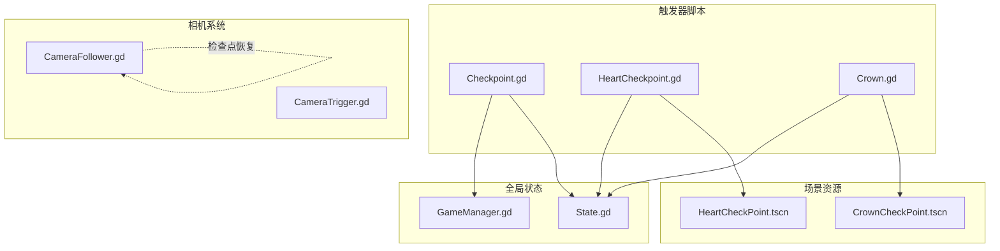
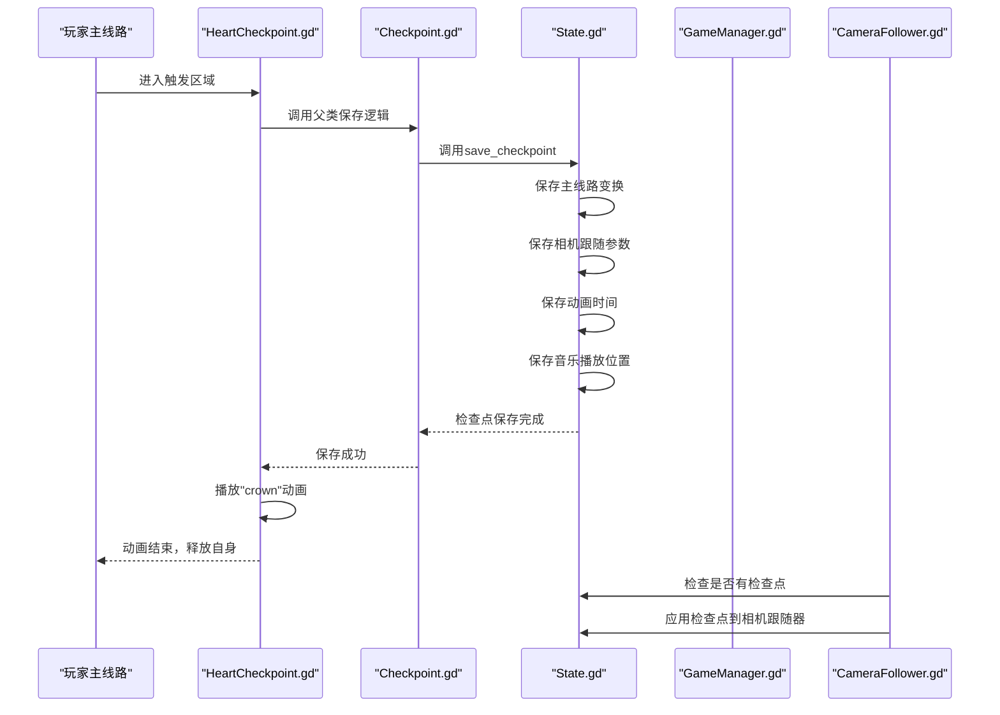
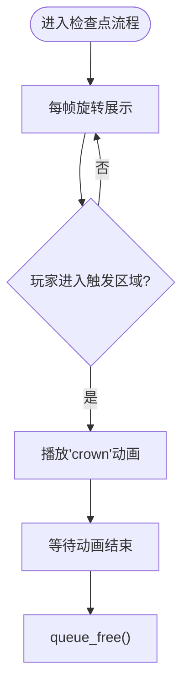
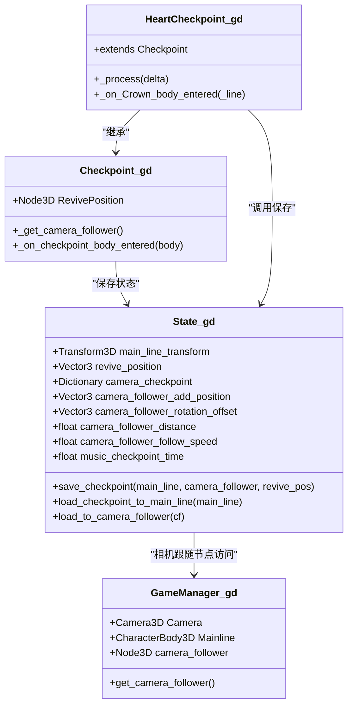

# 心形检查点

<cite>
**本文引用的文件**
- [HeartCheckpoint.gd](file://#Template/[Scripts]/Trigger/HeartCheckpoint.gd)
- [Checkpoint.gd](file://#Template/[Scripts]/Trigger/Checkpoint.gd)
- [Crown.gd](file://#Template/[Scripts]/Trigger/Crown.gd)
- [State.gd](file://#Template/[Scripts]/State.gd)
- [GameManager.gd](file://#Template/[Scripts]/GameManager.gd)
- [HeartCheckPoint.tscn](file://#Template/HeartCheckPoint.tscn)
- [CrownCheckPoint.tscn](file://#Template/CrownCheckPoint.tscn)
- [CameraFollower.gd](file://#Template/[Scripts]/CameraScripts/CameraFollower.gd)
- [CameraTrigger.gd](file://#Template/[Scripts]/CameraScripts/CameraTrigger.gd)
</cite>

## 更新摘要
**变更内容**
- 皇冠触发器系统已被心形检查点系统完全替代
- 移除了原有的皇冠收集和复活机制
- 新的检查点系统提供更直观的心形图标和动画
- 保留了原有的State状态管理和GameManager统一访问接口
- 增强了相机跟随参数的检查点功能

## 目录
1. [简介](#简介)
2. [项目结构](#项目结构)
3. [核心组件](#核心组件)
4. [架构总览](#架构总览)
5. [详细组件分析](#详细组件分析)
6. [依赖关系分析](#依赖关系分析)
7. [性能考虑](#性能考虑)
8. [故障排查指南](#故障排查指南)
9. [结论](#结论)
10. [附录](#附录)

## 简介
本文件系统化阐述"心形检查点"（HeartCheckpoint）系统的设计与实现，覆盖以下关键主题：
- 心形检查点的检测逻辑、相机跟随参数检查点、动画播放与状态更新的完整流程
- 检查点系统的管理机制：位置保存、状态恢复、相机跟随参数缓存
- 参数配置、触发条件、视觉反馈的技术细节
- 使用示例与自定义扩展方法
- 检查点系统的性能优化与内存管理策略

**更新** 本次更新反映了系统架构的重大变更：原有的皇冠触发器系统已被心形检查点系统完全替代，提供更直观的检查点体验和增强的相机跟随功能。

## 项目结构
围绕心形检查点系统的核心文件组织如下：
- 触发器脚本：HeartCheckpoint.gd、Checkpoint.gd、Crown.gd
- 全局状态：State.gd
- 游戏管理：GameManager.gd
- 场景资源：HeartCheckPoint.tscn、CrownCheckPoint.tscn
- 相机系统：CameraFollower.gd、CameraTrigger.gd

**图表来源**
- [HeartCheckpoint.gd:1-9](file://#Template/[Scripts]/Trigger/HeartCheckpoint.gd#L1-L9)
- [Checkpoint.gd:1-19](file://#Template/[Scripts]/Trigger/Checkpoint.gd#L1-L19)
- [Crown.gd:1-14](file://#Template/[Scripts]/Trigger/Crown.gd#L1-L14)
- [State.gd:1-195](file://#Template/[Scripts]/State.gd#L1-L195)
- [GameManager.gd:1-50](file://#Template/[Scripts]/GameManager.gd#L1-L50)
- [HeartCheckPoint.tscn:1-133](file://#Template/HeartCheckPoint.tscn#L1-L133)
- [CrownCheckPoint.tscn:1-105](file://#Template/CrownCheckPoint.tscn#L1-L105)
- [CameraFollower.gd:1-146](file://#Template/[Scripts]/CameraScripts/CameraFollower.gd#L1-L146)
- [CameraTrigger.gd:1-112](file://#Template/[Scripts]/CameraScripts/CameraTrigger.gd#L1-L112)

## 核心组件
- **HeartCheckpoint（心形检查点）**
  - 继承自Checkpoint基类，负责检测碰撞、播放收集动画并释放自身
  - 关键行为：旋转展示、收集检测、动画播放、状态标记
  - **更新** 采用心形模型和更直观的视觉反馈
- **Checkpoint（检查点基类）**
  - 提供统一的检查点保存逻辑，继承自Area3D
  - 负责调用State.save_checkpoint保存主线路、相机跟随参数和复活位置
- **Crown（废弃的皇冠触发器）**
  - **已废弃**：原有的皇冠触发器系统已被心形检查点系统替代
  - 仍保留用于兼容性和历史参考
- **State（全局状态）**
  - 维护相机跟随参数检查点、动画时间、音乐播放位置、检查点数据等
  - **更新** 增强了检查点功能，支持更完整的状态保存
- **GameManager（游戏管理器）**
  - **新增** 提供统一的游戏对象访问接口，包括Camera、Mainline等
  - **更新** 简化相机跟随数据提取逻辑，直接通过GameManager访问
- **场景资源**
  - HeartCheckPoint.tscn：定义心形模型、碰撞体、动画库与连接
  - CrownCheckPoint.tscn：定义皇冠模型、碰撞体、动画库与连接（兼容性保留）

**章节来源**
- [HeartCheckpoint.gd:1-9](file://#Template/[Scripts]/Trigger/HeartCheckpoint.gd#L1-L9)
- [Checkpoint.gd:1-19](file://#Template/[Scripts]/Trigger/Checkpoint.gd#L1-L19)
- [Crown.gd:1-14](file://#Template/[Scripts]/Trigger/Crown.gd#L1-L14)
- [State.gd:1-195](file://#Template/[Scripts]/State.gd#L1-L195)
- [GameManager.gd:1-50](file://#Template/[Scripts]/GameManager.gd#L1-L50)
- [HeartCheckPoint.tscn:1-133](file://#Template/HeartCheckPoint.tscn#L1-L133)
- [CrownCheckPoint.tscn:1-105](file://#Template/CrownCheckPoint.tscn#L1-L105)

## 架构总览
心形检查点系统通过Checkpoint基类实现统一的检查点管理，形成"检测-保存-恢复"的完整流程：
- **检测阶段**：HeartCheckpoint检测到碰撞后，调用Checkpoint基类的保存逻辑
- **保存阶段**：Checkpoint调用State.save_checkpoint保存主线路变换、相机跟随参数、动画时间和音乐播放位置
- **恢复阶段**：CameraFollower在下一帧检测State.camera_checkpoint并应用检查点
- **更新** 增强了相机跟随参数的检查点功能，支持更精确的状态恢复

**图表来源**
- [HeartCheckpoint.gd:5-8](file://#Template/[Scripts]/Trigger/HeartCheckpoint.gd#L5-L8)
- [Checkpoint.gd:17-18](file://#Template/[Scripts]/Trigger/Checkpoint.gd#L17-L18)
- [State.gd:48-74](file://#Template/[Scripts]/State.gd#L48-L74)
- [CameraFollower.gd:40-45](file://#Template/[Scripts]/CameraScripts/CameraFollower.gd#L40-L45)

## 详细组件分析

### HeartCheckpoint（心形检查点）
- **组件职责**
  - 旋转展示：每帧绕Y轴旋转，提供动态视觉效果
  - 收集检测：body_entered回调中播放收集动画并释放自身
  - **更新** 采用心形模型，提供更直观的检查点标识
- **关键数据流**
  - 通过继承Checkpoint基类，自动获得统一的检查点保存逻辑
  - 调用$AnimationPlayer.play("crown")播放收集动画
  - 动画结束后调用queue_free()释放节点
- **参数与导出**
  - 继承Checkpoint基类的所有导出参数
  - RevivePosition：复活位置节点（可选）
- **性能与生命周期**
  - 收集完成后立即queue_free，避免常驻节点树

**图表来源**
- [HeartCheckpoint.gd:3-8](file://#Template/[Scripts]/Trigger/HeartCheckpoint.gd#L3-L8)

**章节来源**
- [HeartCheckpoint.gd:1-9](file://#Template/[Scripts]/Trigger/HeartCheckpoint.gd#L1-L9)
- [HeartCheckPoint.tscn:105-133](file://#Template/HeartCheckPoint.tscn#L105-L133)

### Checkpoint（检查点基类）
- **组件职责**
  - 提供统一的检查点保存逻辑，继承自Area3D
  - 负责调用State.save_checkpoint保存主线路、相机跟随参数和复活位置
  - **更新** 增强了相机跟随参数的检查点功能
- **关键数据流**
  - _get_camera_follower()：获取相机跟随节点
  - _on_checkpoint_body_entered()：处理碰撞进入事件
  - State.save_checkpoint()：保存完整状态信息
- **参数与导出**
  - RevivePosition: Node3D：复活位置节点（可选）
- **状态保存内容**
  - 主线路变换：main_line_transform
  - 复活位置：revive_position
  - 是否转弯：is_turn
  - 动画时间：anim_time
  - 音乐播放位置：music_checkpoint_time
  - 相机跟随参数：完整的camera_checkpoint字典

**章节来源**
- [Checkpoint.gd:1-19](file://#Template/[Scripts]/Trigger/Checkpoint.gd#L1-L19)
- [State.gd:48-74](file://#Template/[Scripts]/State.gd#L48-L74)

### Crown（废弃的皇冠触发器）
- **组件状态**
  - **已废弃**：原有的皇冠触发器系统已被心形检查点系统替代
  - 仍保留用于兼容性和历史参考
- **历史功能**
  - 用于标记皇冠收集状态
  - 维护crowns数组状态
  - 提供相机跟随参数检查点
- **当前状态**
  - 代码仍存在但不再推荐使用
  - 可作为迁移参考

**章节来源**
- [Crown.gd:1-14](file://#Template/[Scripts]/Trigger/Crown.gd#L1-L14)

### State（全局状态）
- **关键字段**
  - main_line_transform：主线路变换
  - revive_position：复活位置
  - camera_checkpoint：相机跟随参数检查点字典
  - is_turn、anim_time、music_checkpoint_time、is_end、percent
  - **更新** 增强了检查点功能，支持更完整的状态保存
- **相机检查点结构**
  - has_checkpoint：是否有检查点
  - restore_pending：是否等待恢复
  - offset：位置偏移
  - rotation_degrees：旋转角度
  - rotation_offset：旋转偏移
  - distance：距离
  - follow_speed：跟随速度
  - rotate_mode：旋转模式
  - base_rotation：基础旋转
  - target_add_position：目标位置偏移
  - target_follow_speed：目标跟随速度
  - target_distance：目标距离
  - target_rotation：目标旋转
- **音乐播放位置**
  - music_checkpoint_time：音乐播放位置检查点
  - **更新** 增强了音乐播放位置同步功能

**章节来源**
- [State.gd:1-195](file://#Template/[Scripts]/State.gd#L1-L195)

### GameManager（游戏管理器）
- **新增组件**
  - 提供统一的游戏对象访问接口，包括Camera、Mainline等
  - **简化相机跟随数据提取逻辑**：通过GameManager直接访问相机跟随节点
  - 支持工具按钮功能，便于场景编辑和调试
- **关键功能**
  - Camera：相机3D节点引用
  - Mainline：主线路角色节点引用
  - camera_follower：相机跟随节点的便捷访问
  - calculate_anim_start_time：计算动画开始时间
  - setlinecolor/getlinecolor：设置和获取主线路颜色

**章节来源**
- [GameManager.gd:1-50](file://#Template/[Scripts]/GameManager.gd#L1-L50)

### 场景与动画资源
- **HeartCheckPoint.tscn**
  - 定义心形核心和框架模型、碰撞体、动画库（RESET与crown）
  - **更新** 采用心形几何体，提供更直观的检查点标识
  - 包含Core和Frame两个MeshInstance3D节点
- **CrownCheckPoint.tscn**
  - **已废弃**：原有的皇冠检查点场景（保留用于兼容性）
  - 定义皇冠模型、碰撞体、动画库（RESET与crown）
  - 包含CrownSprite和CrownTrigger节点

**章节来源**
- [HeartCheckPoint.tscn:1-133](file://#Template/HeartCheckPoint.tscn#L1-L133)
- [CrownCheckPoint.tscn:1-105](file://#Template/CrownCheckPoint.tscn#L1-L105)

### 相机系统联动
- **CameraFollower**
  - 在下一帧检测State.camera_checkpoint并应用检查点，实现相机跟随参数的即时恢复
  - **更新** 增强了检查点应用逻辑，支持更精确的状态恢复
- **CameraTrigger**
  - 可基于时间或事件触发，设置相机跟随参数并缓存到State
  - 支持多种旋转模式和过渡效果

**章节来源**
- [CameraFollower.gd:40-87](file://#Template/[Scripts]/CameraScripts/CameraFollower.gd#L40-L87)
- [CameraTrigger.gd:28-112](file://#Template/[Scripts]/CameraScripts/CameraTrigger.gd#L28-L112)

## 依赖关系分析
- **HeartCheckpoint依赖**
  - Checkpoint基类：继承统一的检查点保存逻辑
  - State：调用save_checkpoint保存状态
  - AnimationPlayer：播放"crown"动画
  - GameManager：**更新** 通过GameManager访问相机跟随节点
- **Checkpoint依赖**
  - State：保存主线路、相机跟随参数、复活位置
  - Camera：获取相机跟随节点
  - RevivePosition：复活位置节点（可选）
- **State依赖**
  - 所有触发器：保存和恢复状态
  - CameraFollower：应用相机检查点
  - GameManager：提供统一的相机跟随节点访问

**图表来源**
- [HeartCheckpoint.gd:1-9](file://#Template/[Scripts]/Trigger/HeartCheckpoint.gd#L1-L9)
- [Checkpoint.gd:1-19](file://#Template/[Scripts]/Trigger/Checkpoint.gd#L1-L19)
- [State.gd:1-195](file://#Template/[Scripts]/State.gd#L1-L195)
- [GameManager.gd:1-50](file://#Template/[Scripts]/GameManager.gd#L1-L50)

**章节来源**
- [HeartCheckpoint.gd:1-9](file://#Template/[Scripts]/Trigger/HeartCheckpoint.gd#L1-L9)
- [Checkpoint.gd:1-19](file://#Template/[Scripts]/Trigger/Checkpoint.gd#L1-L19)
- [State.gd:1-195](file://#Template/[Scripts]/State.gd#L1-L195)
- [GameManager.gd:1-50](file://#Template/[Scripts]/GameManager.gd#L1-L50)

## 性能考虑
- **节点生命周期**
  - HeartCheckpoint在播放完收集动画后立即queue_free，避免常驻节点树
  - **更新** 增强了节点回收机制，减少内存占用
- **动画与渲染**
  - 心形模型使用高效的几何体，开销较低
  - 动画切换仅在满足条件时触发，避免不必要的播放
- **状态访问**
  - State为单例Node，集中管理全局状态，减少跨节点通信成本
  - **更新** 增强了状态访问效率，支持更快速的检查点应用
- **相机跟随检查点**
  - 通过State缓存相机参数，CameraFollower在下一帧应用，避免实时计算带来的抖动
  - **更新** 增强了检查点应用的性能，支持更平滑的状态恢复

**章节来源**
- [HeartCheckpoint.gd:7-8](file://#Template/[Scripts]/Trigger/HeartCheckpoint.gd#L7-L8)
- [State.gd:162-195](file://#Template/[Scripts]/State.gd#L162-L195)
- [CameraFollower.gd:40-87](file://#Template/[Scripts]/CameraScripts/CameraFollower.gd#L40-L87)

## 故障排查指南
- **问题**：检查点无法保存
  - 检查HeartCheckpoint或Checkpoint节点是否正确连接body_entered信号
  - 确认RevivePosition节点（如果使用）是否正确设置
  - 验证State.save_checkpoint调用是否成功
- **问题**：检查点无法恢复
  - 确认CameraFollower节点是否正确设置player属性
  - 检查State.camera_checkpoint.has_checkpoint是否为true
  - 验证CameraFollower._apply_state_checkpoint是否被调用
- **问题**：相机跟随参数不正确
  - **更新** 检查State.camera_checkpoint字典中的各项参数
  - 确认GameManager.camera_follower是否正确返回相机跟随节点
  - 验证相机跟随器的属性是否正确应用
- **问题**：音乐播放位置不同步
  - **新增** 确认State.music_checkpoint_time是否正确保存
  - 检查音乐播放器节点是否存在且正在播放
  - 验证音乐播放器的get_playback_position()调用是否成功
- **问题**：心形模型显示异常
  - **更新** 检查HeartCheckPoint.tscn中的Core和Frame节点
  - 确认材质和纹理资源是否正确加载
  - 验证动画库是否正确配置
- **问题**：性能下降或内存增长
  - 确保HeartCheckpoint在动画结束后queue_free
  - 避免在场景中堆积过多检查点实例
  - **更新** 检查GameManager是否正确管理对象引用

**章节来源**
- [Checkpoint.gd:17-18](file://#Template/[Scripts]/Trigger/Checkpoint.gd#L17-L18)
- [State.gd:48-74](file://#Template/[Scripts]/State.gd#L48-L74)
- [CameraFollower.gd:70-87](file://#Template/[Scripts]/CameraScripts/CameraFollower.gd#L70-L87)
- [GameManager.gd:10-18](file://#Template/[Scripts]/GameManager.gd#L10-L18)

## 结论
心形检查点系统通过Checkpoint基类实现了统一的检查点管理，形成清晰的"检测-保存-恢复"闭环。**更新后的版本**提供了更直观的心形图标和增强的相机跟随功能，通过State实现完整的状态保存和恢复。HeartCheckpoint负责检测与状态保存，CameraFollower负责检查点的应用；配合GameManager提供的统一访问接口，实现流畅的检查点体验。该设计具备良好的扩展性与性能表现。

## 附录

### 使用示例
- **心形检查点设置**
  - 在关卡中放置HeartCheckPoint.tscn，设置合适的RevivePosition（可选），玩家穿过触发区后自动保存检查点状态
  - **更新** 心形模型提供更直观的检查点标识
- **相机跟随检查点**
  - 在CameraTrigger中设置目标相机跟随参数，HeartCheckpoint收集时会将参数写入State，CameraFollower在下一帧应用
  - **更新** 增强了相机跟随参数的检查点功能
- **状态恢复**
  - 游戏重启或复活时，CameraFollower会自动应用之前保存的检查点状态
  - **更新** 支持更精确的状态恢复和相机跟随参数应用

**章节来源**
- [HeartCheckPoint.tscn:105-133](file://#Template/HeartCheckPoint.tscn#L105-L133)
- [Checkpoint.gd:17-18](file://#Template/[Scripts]/Trigger/Checkpoint.gd#L17-L18)
- [CameraTrigger.gd:60-112](file://#Template/[Scripts]/CameraScripts/CameraTrigger.gd#L60-L112)

### 自定义扩展方法
- **扩展HeartCheckpoint行为**
  - 继承HeartCheckpoint.gd，重写收集后的额外逻辑（如播放音效、粒子效果、触发事件）
  - **更新** 可以利用GameManager提供的统一接口访问游戏对象
- **扩展Checkpoint行为**
  - 继承Checkpoint.gd，添加更多状态保存逻辑或自定义检查点功能
  - **更新** 可以通过增强State.save_checkpoint实现更复杂的状态管理
- **使用Checkpoint基类**
  - 新增检查点类型时可直接继承Checkpoint，利用统一的保存框架与信号机制
- **新增GameManager功能**
  - **新增** 可以通过GameManager扩展更多游戏对象的统一访问接口

**章节来源**
- [HeartCheckpoint.gd:1-9](file://#Template/[Scripts]/Trigger/HeartCheckpoint.gd#L1-L9)
- [Checkpoint.gd:1-19](file://#Template/[Scripts]/Trigger/Checkpoint.gd#L1-L19)
- [GameManager.gd:1-50](file://#Template/[Scripts]/GameManager.gd#L1-L50)