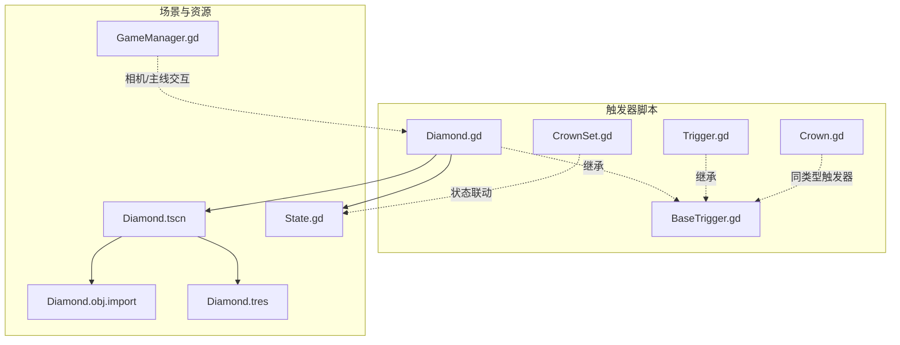
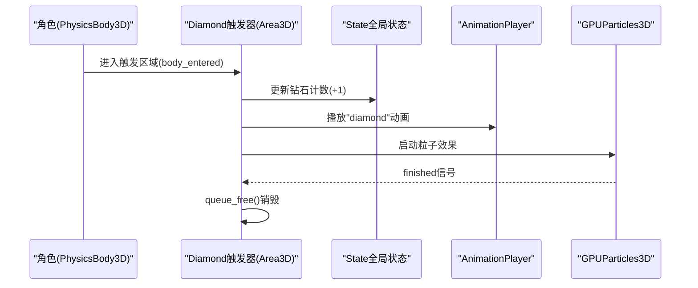
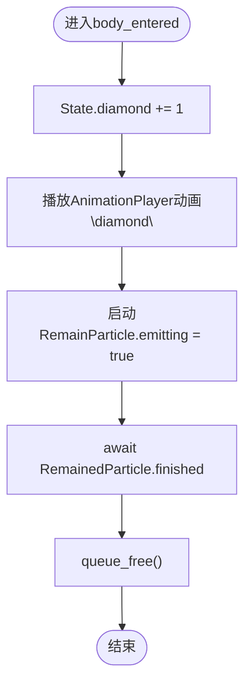
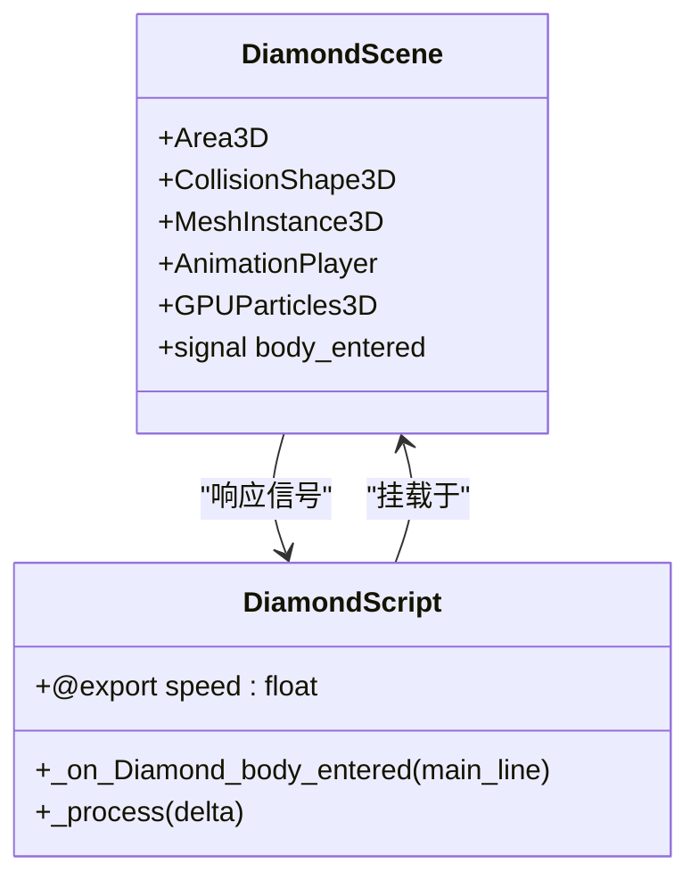
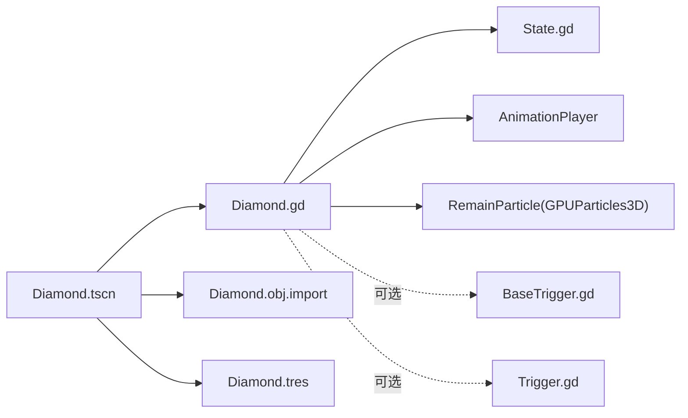

# Diamond触发器

<cite>
**本文档引用的文件**
- [Diamond.gd](file://#Template/[Scripts]/Trigger/Diamond.gd)
- [BaseTrigger.gd](file://#Template/[Scripts]/Trigger/BaseTrigger.gd)
- [Trigger.gd](file://#Template/[Scripts]/Trigger/Trigger.gd)
- [Diamond.tscn](file://#Template/Diamond.tscn)
- [State.gd](file://#Template/[Scripts]/State.gd)
- [Diamond_test.gd](file://Tests/Diamond_test.gd)
- [Crown.gd](file://#Template/[Scripts]/Trigger/Crown.gd)
- [CrownSet.gd](file://#Template/[Scripts]/Trigger/CrownSet.gd)
- [GameManager.gd](file://#Template/[Scripts]/GameManager.gd)
- [Diamond.obj.import](file://#Template/[Resources]/Models/Diamond.obj.import)
- [Diamond.tres](file://#Template/[Materials]/Diamond.tres)
</cite>

## 目录
1. [简介](#简介)
2. [项目结构](#项目结构)
3. [核心组件](#核心组件)
4. [架构总览](#架构总览)
5. [详细组件分析](#详细组件分析)
6. [依赖关系分析](#依赖关系分析)
7. [性能考虑](#性能考虑)
8. [故障排除指南](#故障排除指南)
9. [结论](#结论)
10. [附录](#附录)

## 简介
本文件系统化阐述Diamond（钻石）触发器的实现原理与工作机制，覆盖钻石收集检测逻辑、音效播放、动画效果、状态更新等完整流程；详解参数配置、触发条件、视觉反馈等技术细节；解释Diamond触发器与游戏状态管理的交互机制（分数计算、收集统计等）；提供使用示例与自定义扩展方法，并总结收集类触发器的性能优化与最佳实践。

## 项目结构
Diamond触发器位于模板脚本目录下的Trigger子模块中，配合场景文件、材质与模型资源共同构成完整的收集触发器系统。测试用例验证了Diamond脚本的行为与状态联动。

图表来源
- [Diamond.gd:1-17](file://#Template/[Scripts]/Trigger/Diamond.gd#L1-L17)
- [BaseTrigger.gd:1-102](file://#Template/[Scripts]/Trigger/BaseTrigger.gd#L1-L102)
- [Trigger.gd:1-10](file://#Template/[Scripts]/Trigger/Trigger.gd#L1-L10)
- [Diamond.tscn:1-127](file://#Template/Diamond.tscn#L1-L127)
- [State.gd:1-21](file://#Template/[Scripts]/State.gd#L1-L21)
- [Diamond.obj.import:1-26](file://#Template/[Resources]/Models/Diamond.obj.import#L1-L26)
- [Diamond.tres:1-5](file://#Template/[Materials]/Diamond.tres#L1-L5)
- [GameManager.gd:1-47](file://#Template/[Scripts]/GameManager.gd#L1-L47)

章节来源
- [Diamond.gd:1-17](file://#Template/[Scripts]/Trigger/Diamond.gd#L1-L17)
- [Diamond.tscn:1-127](file://#Template/Diamond.tscn#L1-L127)
- [State.gd:1-21](file://#Template/[Scripts]/State.gd#L1-L21)

## 核心组件
- Diamond触发器脚本：负责检测角色进入触发区域、更新全局状态、播放动画与粒子效果、销毁自身。
- BaseTrigger基础触发器：提供统一的触发逻辑、过滤器、一次性触发支持与调试开关。
- Trigger通用触发器：发射通用信号，便于其他节点监听。
- 场景与资源：包含碰撞体、网格、动画库、GPU粒子系统以及模型导入配置。
- 状态管理：集中记录钻石数量、皇冠状态、相机跟随参数等。

章节来源
- [Diamond.gd:1-17](file://#Template/[Scripts]/Trigger/Diamond.gd#L1-L17)
- [BaseTrigger.gd:1-102](file://#Template/[Scripts]/Trigger/BaseTrigger.gd#L1-L102)
- [Trigger.gd:1-10](file://#Template/[Scripts]/Trigger/Trigger.gd#L1-L10)
- [Diamond.tscn:1-127](file://#Template/Diamond.tscn#L1-L127)
- [State.gd:1-21](file://#Template/[Scripts]/State.gd#L1-L21)

## 架构总览
Diamond触发器采用“Area3D + 脚本”的典型Godot触发器模式，通过信号连接与状态共享实现解耦。整体交互如下：

图表来源
- [Diamond.gd:7-12](file://#Template/[Scripts]/Trigger/Diamond.gd#L7-L12)
- [State.gd:19-19](file://#Template/[Scripts]/State.gd#L19-L19)
- [Diamond.tscn:113-124](file://#Template/Diamond.tscn#L113-L124)

## 详细组件分析

### Diamond触发器脚本分析
- 继承关系：直接继承Area3D，不依赖BaseTrigger，但具备相似的触发入口命名约定。
- 参数导出：
  - speed：控制旋转速度，默认1.0。
- 触发流程：
  - 检测到角色进入触发区域后，立即增加全局钻石计数。
  - 播放名为“diamond”的动画。
  - 启动RemainParticle粒子系统，等待其结束信号。
  - 完成后销毁自身。
- 旋转逻辑：每帧根据delta与speed进行Y轴旋转，仅在运行时生效（编辑器提示时跳过）。

图表来源
- [Diamond.gd:7-12](file://#Template/[Scripts]/Trigger/Diamond.gd#L7-L12)

章节来源
- [Diamond.gd:1-17](file://#Template/[Scripts]/Trigger/Diamond.gd#L1-L17)

### 场景与资源配置
- 场景节点结构：
  - Area3D作为触发器容器，挂载脚本Diamond.gd。
  - CollisionShape3D作为碰撞体。
  - MeshInstance3D承载网格与材质。
  - AnimationPlayer包含“diamond”与“RESET”动画库。
  - GPUParticles3D作为收集特效。
  - 连接body_entered信号至_on_Diamond_body_entered方法。
- 模型与材质：
  - 模型由Diamond.obj导入生成，启用LOD与阴影网格。
  - 材质为浅青色标准材质，用于网格渲染。
- 动画与粒子：
  - “diamond”动画将网格缩放从初始值过渡至0，形成消失效果。
  - 粒子系统配置为一次性发射，具有爆炸性与固定生命周期。

图表来源
- [Diamond.tscn:100-126](file://#Template/Diamond.tscn#L100-L126)
- [Diamond.obj.import:1-26](file://#Template/[Resources]/Models/Diamond.obj.import#L1-L26)
- [Diamond.tres:1-5](file://#Template/[Materials]/Diamond.tres#L1-L5)

章节来源
- [Diamond.tscn:1-127](file://#Template/Diamond.tscn#L1-L127)
- [Diamond.obj.import:1-26](file://#Template/[Resources]/Models/Diamond.obj.import#L1-L26)
- [Diamond.tres:1-5](file://#Template/[Materials]/Diamond.tres#L1-L5)

### 状态管理与交互
- 全局状态State：
  - diamond：当前钻石收集数量，Diamond触发器在命中时递增。
  - crown、crowns、camera_follower_*等：用于相机跟随与皇冠状态联动。
- 与GameManager的关系：
  - GameManager提供相机、主线角色引用及动画起始时间计算工具，与Diamond触发器无直接耦合，但可作为相机/主线交互的上下文参考。

章节来源
- [State.gd:1-21](file://#Template/[Scripts]/State.gd#L1-L21)
- [GameManager.gd:1-47](file://#Template/[Scripts]/GameManager.gd#L1-L47)

### 与其他触发器的对比与扩展
- 与通用触发器Trigger对比：
  - Diamond直接在脚本内处理收集逻辑；Trigger仅发射hit_the_line信号，适合需要外部监听的场景。
- 与Crown触发器对比：
  - Diamond侧重“收集+特效+销毁”，Crown侧重“状态记录+相机跟随参数保存+动画播放”，两者均通过State进行状态共享。
- 与CrownSet联动：
  - CrownSet根据State中的line_crossing_crown与crowns数组状态播放动画，体现收集结果的可视化反馈。

章节来源
- [Trigger.gd:1-10](file://#Template/[Scripts]/Trigger/Trigger.gd#L1-L10)
- [Crown.gd:1-44](file://#Template/[Scripts]/Trigger/Crown.gd#L1-L44)
- [CrownSet.gd:1-13](file://#Template/[Scripts]/Trigger/CrownSet.gd#L1-L13)

## 依赖关系分析
Diamond触发器的核心依赖链路如下：

图表来源
- [Diamond.tscn:100-126](file://#Template/Diamond.tscn#L100-L126)
- [Diamond.gd:1-17](file://#Template/[Scripts]/Trigger/Diamond.gd#L1-L17)
- [State.gd:1-21](file://#Template/[Scripts]/State.gd#L1-L21)
- [Diamond.obj.import:1-26](file://#Template/[Resources]/Models/Diamond.obj.import#L1-L26)
- [Diamond.tres:1-5](file://#Template/[Materials]/Diamond.tres#L1-L5)

章节来源
- [Diamond.gd:1-17](file://#Template/[Scripts]/Trigger/Diamond.gd#L1-L17)
- [Diamond.tscn:1-127](file://#Template/Diamond.tscn#L1-L127)

## 性能考虑
- 旋转性能：Diamond在_process中按delta与speed旋转，建议：
  - 将speed设置为合理范围，避免过高导致视觉闪烁或CPU压力。
  - 在不需要时可通过禁用脚本或节点减少每帧开销。
- 动画与粒子：
  - “diamond”动画为短时缩放过渡，对性能影响较小。
  - RemainParticle为一次性发射，生命周期短，注意控制amount与lifetime以平衡视觉与性能。
- 状态更新：
  - State.diamond为轻量级整数累加，开销极低。
- 扩展建议：
  - 对大量Diamond实例，可考虑池化或延迟销毁策略，减少频繁queue_free带来的内存抖动。
  - 若需批量收集，可在上层逻辑合并状态更新，降低多次State访问成本。

## 故障排除指南
- 收集无效或未计数：
  - 确认触发区域与角色碰撞体正确配置，且Diamond脚本已挂载。
  - 检查body_entered信号是否连接至_on_Diamond_body_entered。
- 动画不播放或粒子不显示：
  - 确认AnimationPlayer中存在名为“diamond”的动画库。
  - 确认RemainParticle.emitting在触发时被置为true，并在finished后销毁。
- 旋转异常：
  - 确认Engine.is_editor_hint()判断逻辑，编辑器中不会执行旋转。
  - 检查speed参数是否为合理数值。
- 状态不同步：
  - 确认State节点存在于场景树中，且diamond变量可读写。
  - 如使用测试用例，请确保State在测试前被正确初始化。

章节来源
- [Diamond.gd:7-16](file://#Template/[Scripts]/Trigger/Diamond.gd#L7-L16)
- [Diamond.tscn:113-124](file://#Template/Diamond.tscn#L113-L124)
- [State.gd:1-21](file://#Template/[Scripts]/State.gd#L1-L21)

## 结论
Diamond触发器通过简洁的脚本逻辑与场景资源配合，实现了高效的收集检测、即时的视觉反馈与状态更新。其设计遵循Godot触发器的通用模式，易于扩展与维护。结合BaseTrigger的通用能力与Crown系列触发器的状态联动，可构建完整的收集与反馈体系。

## 附录

### 使用示例
- 在场景中放置Diamond.tscn，确保：
  - Area3D挂载Diamond.gd脚本。
  - AnimationPlayer包含“diamond”动画库。
  - GPUParticles3D配置为一次性发射。
- 在运行时，当角色进入触发区域，Diamond会：
  - 增加State.diamond计数。
  - 播放“diamond”动画并启动粒子效果。
  - 等待粒子结束后销毁自身。

章节来源
- [Diamond.tscn:100-126](file://#Template/Diamond.tscn#L100-L126)
- [Diamond.gd:7-12](file://#Template/[Scripts]/Trigger/Diamond.gd#L7-L12)

### 自定义扩展方法
- 增加音效播放：
  - 在Diamond脚本中添加AudioStreamPlayer节点与播放逻辑，在播放“diamond”动画前后触发音效。
- 多语言/多平台适配：
  - 将音效与动画资源路径改为资源字典或常量，便于切换。
- 批量收集优化：
  - 在上层逻辑聚合收集事件，统一更新State.diamond，减少多次状态写入。
- 一次性触发限制：
  - 如需Diamond仅触发一次，可参考BaseTrigger的one_shot模式，或在Diamond中加入_used标记并在首次触发后禁用collisionshape。

章节来源
- [BaseTrigger.gd:11-27](file://#Template/[Scripts]/Trigger/BaseTrigger.gd#L11-L27)
- [Diamond.gd:7-12](file://#Template/[Scripts]/Trigger/Diamond.gd#L7-L12)

### 测试要点
- Diamond脚本存在性与场景文件存在性验证。
- speed属性默认值与可设置性。
- 收集后State.diamond计数增加与累计行为。
- 颜色变化与网格更新方法的存在性（如适用）。

章节来源
- [Diamond_test.gd:1-167](file://Tests/Diamond_test.gd#L1-L167)