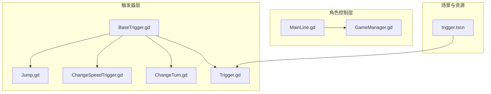
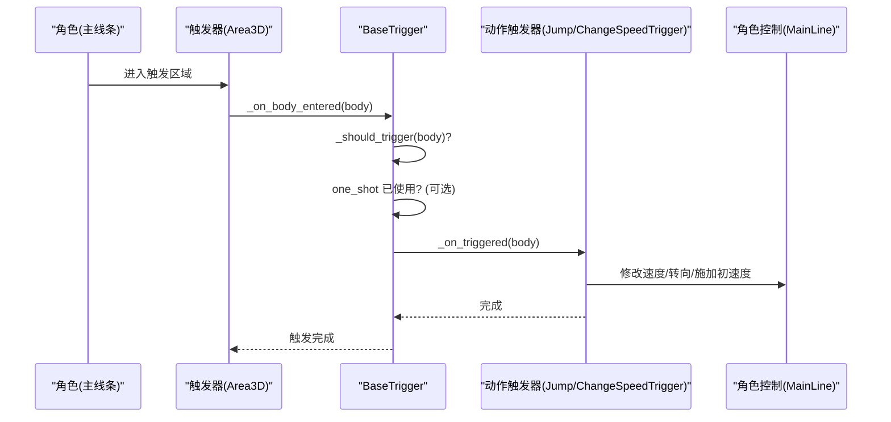
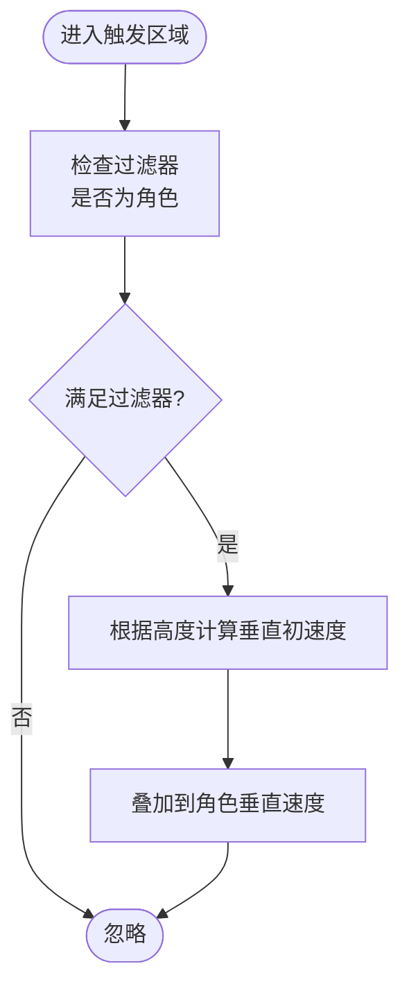
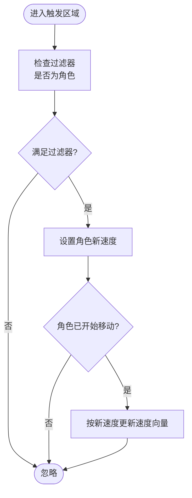
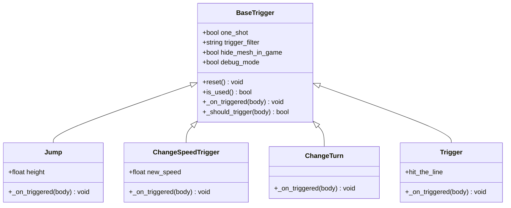
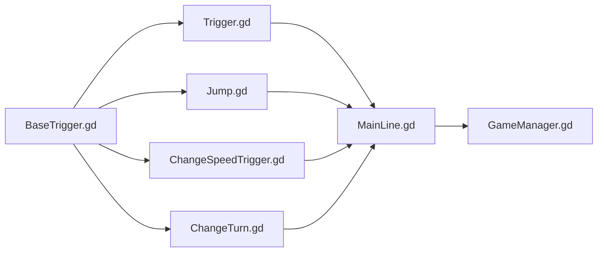

# 动作类触发器

<cite>
**本文引用的文件**
- [BaseTrigger.gd](file://#Template/[Scripts]/Trigger/BaseTrigger.gd)
- [Jump.gd](file://#Template/[Scripts]/Trigger/Jump.gd)
- [ChangeSpeedTrigger.gd](file://#Template/[Scripts]/Trigger/ChangeSpeedTrigger.gd)
- [ChangeTurn.gd](file://#Template/[Scripts]/Trigger/ChangeTurn.gd)
- [Trigger.gd](file://#Template/[Scripts]/Trigger/Trigger.gd)
- [MainLine.gd](file://#Template/[Scripts]/MainLine.gd)
- [GameManager.gd](file://#Template/[Scripts]/GameManager.gd)
- [trigger.tscn](file://#Template/trigger.tscn)
- [MainLine_test.gd](file://Tests/MainLine_test.gd)
</cite>

## 目录
1. [简介](#简介)
2. [项目结构](#项目结构)
3. [核心组件](#核心组件)
4. [架构总览](#架构总览)
5. [详细组件分析](#详细组件分析)
6. [依赖关系分析](#依赖关系分析)
7. [性能考量](#性能考量)
8. [故障排查指南](#故障排查指南)
9. [结论](#结论)
10. [附录](#附录)

## 简介
本文件聚焦于动作类触发器的设计与实现，重点解析两类典型触发器：Jump（跳跃）与 ChangeSpeedTrigger（速度变化）。文档从系统架构、数据流、处理逻辑、参数配置、触发时机、效果持续性、与角色控制系统的协同机制、重置与状态管理等方面进行深入说明，并提供使用示例与组合策略，帮助开发者在不深入源码的情况下也能正确使用与扩展动作类触发器。

## 项目结构
动作类触发器位于模板脚本目录下的 Trigger 子目录，基础触发器框架由 BaseTrigger 提供，具体动作触发器通过继承 BaseTrigger 并实现自定义的触发处理逻辑完成。角色控制主体 MainLine 实现了移动、转向、动画播放与物理状态管理；GameManager 提供动画起始时间计算等辅助能力；trigger.tscn 是一个通用触发器场景模板，便于快速实例化。

图表来源
- [BaseTrigger.gd:1-102](file://#Template/[Scripts]/Trigger/BaseTrigger.gd#L1-L102)
- [Jump.gd:1-13](file://#Template/[Scripts]/Trigger/Jump.gd#L1-L13)
- [ChangeSpeedTrigger.gd:1-15](file://#Template/[Scripts]/Trigger/ChangeSpeedTrigger.gd#L1-L15)
- [ChangeTurn.gd:1-10](file://#Template/[Scripts]/Trigger/ChangeTurn.gd#L1-L10)
- [Trigger.gd:1-10](file://#Template/[Scripts]/Trigger/Trigger.gd#L1-L10)
- [MainLine.gd:1-224](file://#Template/[Scripts]/MainLine.gd#L1-L224)
- [GameManager.gd:1-47](file://#Template/[Scripts]/GameManager.gd#L1-L47)
- [trigger.tscn:1-24](file://#Template/trigger.tscn#L1-L24)

章节来源
- [BaseTrigger.gd:1-102](file://#Template/[Scripts]/Trigger/BaseTrigger.gd#L1-L102)
- [Jump.gd:1-13](file://#Template/[Scripts]/Trigger/Jump.gd#L1-L13)
- [ChangeSpeedTrigger.gd:1-15](file://#Template/[Scripts]/Trigger/ChangeSpeedTrigger.gd#L1-L15)
- [ChangeTurn.gd:1-10](file://#Template/[Scripts]/Trigger/ChangeTurn.gd#L1-L10)
- [Trigger.gd:1-10](file://#Template/[Scripts]/Trigger/Trigger.gd#L1-L10)
- [MainLine.gd:1-224](file://#Template/[Scripts]/MainLine.gd#L1-L224)
- [GameManager.gd:1-47](file://#Template/[Scripts]/GameManager.gd#L1-L47)
- [trigger.tscn:1-24](file://#Template/trigger.tscn#L1-L24)

## 核心组件
- BaseTrigger：提供统一的触发入口、过滤器、一次性触发(one-shot)、调试输出与重置能力。子类仅需实现 _on_triggered(body) 即可完成自定义动作。
- Jump：在触发时为角色赋予垂直方向的初速度，模拟跳跃效果。
- ChangeSpeedTrigger：在触发时修改角色的移动速度属性，并在满足条件时即时更新速度向量。
- ChangeTurn：切换角色的转向状态标志位，配合 MainLine 的转向逻辑生效。
- Trigger：发射通用信号，便于与其他系统解耦联动。
- MainLine：角色主体，负责物理运动、动画播放、地面检测、死亡处理等。
- GameManager：提供动画起始时间计算等工具函数，辅助触发器与动画系统的衔接。

章节来源
- [BaseTrigger.gd:1-102](file://#Template/[Scripts]/Trigger/BaseTrigger.gd#L1-L102)
- [Jump.gd:1-13](file://#Template/[Scripts]/Trigger/Jump.gd#L1-L13)
- [ChangeSpeedTrigger.gd:1-15](file://#Template/[Scripts]/Trigger/ChangeSpeedTrigger.gd#L1-L15)
- [ChangeTurn.gd:1-10](file://#Template/[Scripts]/Trigger/ChangeTurn.gd#L1-L10)
- [Trigger.gd:1-10](file://#Template/[Scripts]/Trigger/Trigger.gd#L1-L10)
- [MainLine.gd:1-224](file://#Template/[Scripts]/MainLine.gd#L1-L224)
- [GameManager.gd:1-47](file://#Template/[Scripts]/GameManager.gd#L1-L47)

## 架构总览
动作类触发器采用“基类 + 多子类”的分层设计。BaseTrigger 负责生命周期钩子、碰撞事件接入、触发过滤与一次性触发控制；各动作触发器专注于对目标对象状态的修改或信号发射。角色控制层 MainLine 通过输入事件驱动转向与移动，同时与动画系统协作；GameManager 提供动画时间计算，保证触发器与动画的时序一致性。

图表来源
- [BaseTrigger.gd:53-91](file://#Template/[Scripts]/Trigger/BaseTrigger.gd#L53-L91)
- [Jump.gd:8-12](file://#Template/[Scripts]/Trigger/Jump.gd#L8-L12)
- [ChangeSpeedTrigger.gd:8-14](file://#Template/[Scripts]/Trigger/ChangeSpeedTrigger.gd#L8-L14)
- [MainLine.gd:168-184](file://#Template/[Scripts]/MainLine.gd#L168-L184)

## 详细组件分析

### Jump（跳跃）触发器
- 触发条件：当角色进入触发区域且满足过滤器要求时触发。
- 参数配置：
  - height：跳跃高度，用于计算垂直初速度。
- 触发时机：进入触发区域时立即执行。
- 效果与状态影响：
  - 对角色的垂直速度分量进行叠加，产生向上的初速度。
  - 与 MainLine 的重力累积逻辑配合，在物理帧中逐步衰减。
- 动画播放控制：Jump 不直接操作动画，但可与 MainLine 的转向/动画播放流程结合，形成“触发后转向+跳跃”的连贯动作。
- 使用示例：
  - 在关卡中放置 Jump 触发器，使角色在特定位置获得跳跃能力，配合地面/墙面检测实现二段跳或平台跳跃。
- 组合使用：
  - 与 ChangeSpeedTrigger 组合：先提升速度再触发跳跃，增强角色的爆发力与表现力。
  - 与 Trigger 组合：通过 Trigger 发出信号，驱动相机/特效联动。

图表来源
- [BaseTrigger.gd:76-86](file://#Template/[Scripts]/Trigger/BaseTrigger.gd#L76-L86)
- [Jump.gd:8-12](file://#Template/[Scripts]/Trigger/Jump.gd#L8-L12)

章节来源
- [Jump.gd:1-13](file://#Template/[Scripts]/Trigger/Jump.gd#L1-L13)
- [BaseTrigger.gd:11-22](file://#Template/[Scripts]/Trigger/BaseTrigger.gd#L11-L22)
- [BaseTrigger.gd:53-91](file://#Template/[Scripts]/Trigger/BaseTrigger.gd#L53-L91)

### ChangeSpeedTrigger（速度变化）触发器
- 触发条件：当角色进入触发区域且满足过滤器要求时触发。
- 参数配置：
  - new_speed：新的移动速度值。
- 触发时机：进入触发区域时立即执行。
- 效果与状态影响：
  - 修改角色的 speed 属性。
  - 若角色已处于“开始移动”状态，则即时更新速度向量，保证移动方向与速度一致。
- 动画播放控制：ChangeSpeedTrigger 不直接控制动画，但可与 MainLine 的转向/动画播放流程配合，形成“加速后转向”的连贯动作。
- 使用示例：
  - 在加速带/冲刺区域放置 ChangeSpeedTrigger，使角色在进入时获得更高的移动速度。
- 组合使用：
  - 与 Jump 组合：先加速再触发跳跃，提升角色的爆发与滞空表现。
  - 与 Trigger 组合：通过 Trigger 发出信号，驱动音效/粒子等反馈。

图表来源
- [BaseTrigger.gd:76-86](file://#Template/[Scripts]/Trigger/BaseTrigger.gd#L76-L86)
- [ChangeSpeedTrigger.gd:8-14](file://#Template/[Scripts]/Trigger/ChangeSpeedTrigger.gd#L8-L14)
- [MainLine.gd:182](file://#Template/[Scripts]/MainLine.gd#L182)

章节来源
- [ChangeSpeedTrigger.gd:1-15](file://#Template/[Scripts]/Trigger/ChangeSpeedTrigger.gd#L1-L15)
- [BaseTrigger.gd:11-22](file://#Template/[Scripts]/Trigger/BaseTrigger.gd#L11-L22)
- [BaseTrigger.gd:53-91](file://#Template/[Scripts]/Trigger/BaseTrigger.gd#L53-L91)
- [MainLine.gd:168-184](file://#Template/[Scripts]/MainLine.gd#L168-L184)

### ChangeTurn（转向变化）触发器
- 触发条件：当角色进入触发区域且满足过滤器要求时触发。
- 参数配置：无额外导出参数。
- 触发时机：进入触发区域时立即执行。
- 效果与状态影响：
  - 切换角色的转向状态标志位，配合 MainLine 的转向逻辑生效。
- 动画播放控制：ChangeTurn 不直接控制动画，但可与 MainLine 的动画播放流程配合，形成“触发后转向”的连贯动作。
- 使用示例：
  - 在弯道/转向区放置 ChangeTurn 触发器，使角色在进入时切换转向状态，配合动画播放实现流畅的转向表现。

章节来源
- [ChangeTurn.gd:1-10](file://#Template/[Scripts]/Trigger/ChangeTurn.gd#L1-L10)
- [BaseTrigger.gd:76-86](file://#Template/[Scripts]/Trigger/BaseTrigger.gd#L76-L86)
- [MainLine.gd:168-184](file://#Template/[Scripts]/MainLine.gd#L168-L184)

### Trigger（通用触发器）
- 触发条件：当任何物体进入触发区域时触发。
- 参数配置：无额外导出参数。
- 触发时机：进入触发区域时立即执行。
- 效果与状态影响：
  - 发射通用信号，供其他系统订阅，实现解耦联动。
- 动画播放控制：Trigger 不直接控制动画，但可作为触发器链路的中间环节，驱动后续动画/特效。
- 使用示例：
  - 通过 Trigger 发出信号，驱动动画播放器播放指定动画片段。

章节来源
- [Trigger.gd:1-10](file://#Template/[Scripts]/Trigger/Trigger.gd#L1-L10)
- [BaseTrigger.gd:76-86](file://#Template/[Scripts]/Trigger/BaseTrigger.gd#L76-L86)

### BaseTrigger（基础触发器）
- 统一的触发入口：通过 Area3D 的 body_entered 事件接入，调用内部处理流程。
- 触发过滤器：支持仅允许 CharacterBody3D、PhysicsBody3D 或任意类型进入。
- 一次性触发：可通过 one_shot 控制触发器仅触发一次，配合 reset 重置。
- 调试模式：可输出触发日志，便于定位问题。
- 重置与状态管理：提供 reset 与 is_used 接口，便于在关卡重置或回放时恢复状态。

图表来源
- [BaseTrigger.gd:11-22](file://#Template/[Scripts]/Trigger/BaseTrigger.gd#L11-L22)
- [BaseTrigger.gd:88-91](file://#Template/[Scripts]/Trigger/BaseTrigger.gd#L88-L91)
- [Jump.gd:6](file://#Template/[Scripts]/Trigger/Jump.gd#L6)
- [ChangeSpeedTrigger.gd:6](file://#Template/[Scripts]/Trigger/ChangeSpeedTrigger.gd#L6)
- [Trigger.gd:6](file://#Template/[Scripts]/Trigger/Trigger.gd#L6)

章节来源
- [BaseTrigger.gd:1-102](file://#Template/[Scripts]/Trigger/BaseTrigger.gd#L1-L102)

### 与角色控制系统的协调机制
- 输入与转向：MainLine 通过输入事件驱动 turn，进而切换 is_turn 状态并更新速度向量；动作触发器可与其配合，形成“触发后转向/加速/跳跃”的连贯动作。
- 物理参数修改：ChangeSpeedTrigger 直接修改角色速度属性，并在必要时更新速度向量，保证移动方向与速度一致。
- 动画播放：MainLine 的动画播放与触发器解耦，通过 Trigger 或状态切换驱动动画播放；GameManager 提供动画起始时间计算，保证时序一致性。
- 死亡与重置：MainLine 的死亡流程会暂停动画并生成粒子效果；触发器的重置可通过 BaseTrigger 的 reset 接口实现。

章节来源
- [MainLine.gd:105-184](file://#Template/[Scripts]/MainLine.gd#L105-L184)
- [MainLine.gd:197-219](file://#Template/[Scripts]/MainLine.gd#L197-L219)
- [GameManager.gd:23-39](file://#Template/[Scripts]/GameManager.gd#L23-L39)
- [BaseTrigger.gd:93-101](file://#Template/[Scripts]/Trigger/BaseTrigger.gd#L93-L101)

## 依赖关系分析
- 继承关系：Jump、ChangeSpeedTrigger、ChangeTurn、Trigger 均继承自 BaseTrigger，复用统一的触发逻辑与生命周期。
- 与角色控制的耦合：Jump 与 ChangeSpeedTrigger 直接修改角色状态；ChangeTurn 切换角色状态；Trigger 通过信号与其他系统解耦。
- 与动画系统的协作：MainLine 负责动画播放；GameManager 提供动画起始时间计算；Trigger 可作为信号中继。

图表来源
- [BaseTrigger.gd:1-102](file://#Template/[Scripts]/Trigger/BaseTrigger.gd#L1-L102)
- [Jump.gd:1-13](file://#Template/[Scripts]/Trigger/Jump.gd#L1-L13)
- [ChangeSpeedTrigger.gd:1-15](file://#Template/[Scripts]/Trigger/ChangeSpeedTrigger.gd#L1-L15)
- [ChangeTurn.gd:1-10](file://#Template/[Scripts]/Trigger/ChangeTurn.gd#L1-L10)
- [Trigger.gd:1-10](file://#Template/[Scripts]/Trigger/Trigger.gd#L1-L10)
- [MainLine.gd:1-224](file://#Template/[Scripts]/MainLine.gd#L1-L224)
- [GameManager.gd:1-47](file://#Template/[Scripts]/GameManager.gd#L1-L47)

章节来源
- [BaseTrigger.gd:1-102](file://#Template/[Scripts]/Trigger/BaseTrigger.gd#L1-L102)
- [MainLine.gd:1-224](file://#Template/[Scripts]/MainLine.gd#L1-L224)
- [GameManager.gd:1-47](file://#Template/[Scripts]/GameManager.gd#L1-L47)

## 性能考量
- 触发频率与开销：BaseTrigger 的过滤器与一次性触发控制可减少无效触发；建议在复杂场景中合理设置 one_shot，避免重复触发带来的状态更新开销。
- 信号与连接：Trigger 通过信号与其他系统解耦，降低耦合度；但过多信号连接可能增加事件处理成本，应避免在热路径中频繁发射大量信号。
- 物理与动画：Jump 与 ChangeSpeedTrigger 的状态修改发生在触发阶段，随后由 MainLine 的物理循环统一应用；建议在触发器中尽量保持轻量逻辑，避免在 _on_triggered 中执行重型计算。
- 可见性与渲染：BaseTrigger 支持在运行时隐藏可视化网格，减少不必要的渲染开销。

## 故障排查指南
- 触发未生效：
  - 检查触发器的过滤器设置是否与角色类型匹配。
  - 确认 one_shot 是否已被启用导致后续触发被忽略。
  - 开启 debug_mode 查看触发日志。
- 速度变化无效：
  - 确认角色具备 speed 属性且可被外部修改。
  - 检查角色是否已开始移动，若未开始则不会更新速度向量。
- 跳跃高度异常：
  - 检查 height 参数是否合理，确认与物理重力参数匹配。
- 动画不同步：
  - 使用 GameManager 的动画起始时间计算接口，确保动画播放与角色状态变化同步。
- 关卡重置：
  - 使用 BaseTrigger 的 reset 接口重置 one_shot 状态，或在场景重载时重新初始化触发器。

章节来源
- [BaseTrigger.gd:11-22](file://#Template/[Scripts]/Trigger/BaseTrigger.gd#L11-L22)
- [BaseTrigger.gd:53-91](file://#Template/[Scripts]/Trigger/BaseTrigger.gd#L53-L91)
- [BaseTrigger.gd:93-101](file://#Template/[Scripts]/Trigger/BaseTrigger.gd#L93-L101)
- [ChangeSpeedTrigger.gd:8-14](file://#Template/[Scripts]/Trigger/ChangeSpeedTrigger.gd#L8-L14)
- [Jump.gd:8-12](file://#Template/[Scripts]/Trigger/Jump.gd#L8-L12)
- [GameManager.gd:23-39](file://#Template/[Scripts]/GameManager.gd#L23-L39)

## 结论
动作类触发器通过 BaseTrigger 提供的统一框架，实现了对角色状态的轻量级修改与信号发射。Jump、ChangeSpeedTrigger、ChangeTurn 与 Trigger 各司其职，既可独立使用，也可组合形成复杂的动作序列。与 MainLine 的输入/转向/动画播放以及 GameManager 的动画时序计算协同，能够构建出流畅、可控且可扩展的动作触发体验。

## 附录
- 使用示例与组合策略：
  - 加速-跳跃组合：先放置 ChangeSpeedTrigger，再放置 Jump，使角色在加速后获得更高的跳跃表现。
  - 转向-加速-跳跃组合：先放置 ChangeTurn，再放置 ChangeSpeedTrigger，最后放置 Jump，形成“转向-加速-跳跃”的完整动作链。
  - 信号联动：使用 Trigger 发出信号，驱动动画播放器或特效系统，实现视觉反馈与动作触发的解耦。
- 场景模板：
  - trigger.tscn 提供了通用触发器场景的结构与连接，便于快速实例化与复用。

章节来源
- [trigger.tscn:1-24](file://#Template/trigger.tscn#L1-L24)
- [Trigger.gd:8-9](file://#Template/[Scripts]/Trigger/Trigger.gd#L8-L9)
- [MainLine_test.gd:31-44](file://Tests/MainLine_test.gd#L31-L44)