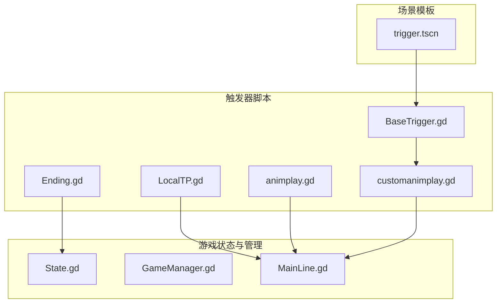
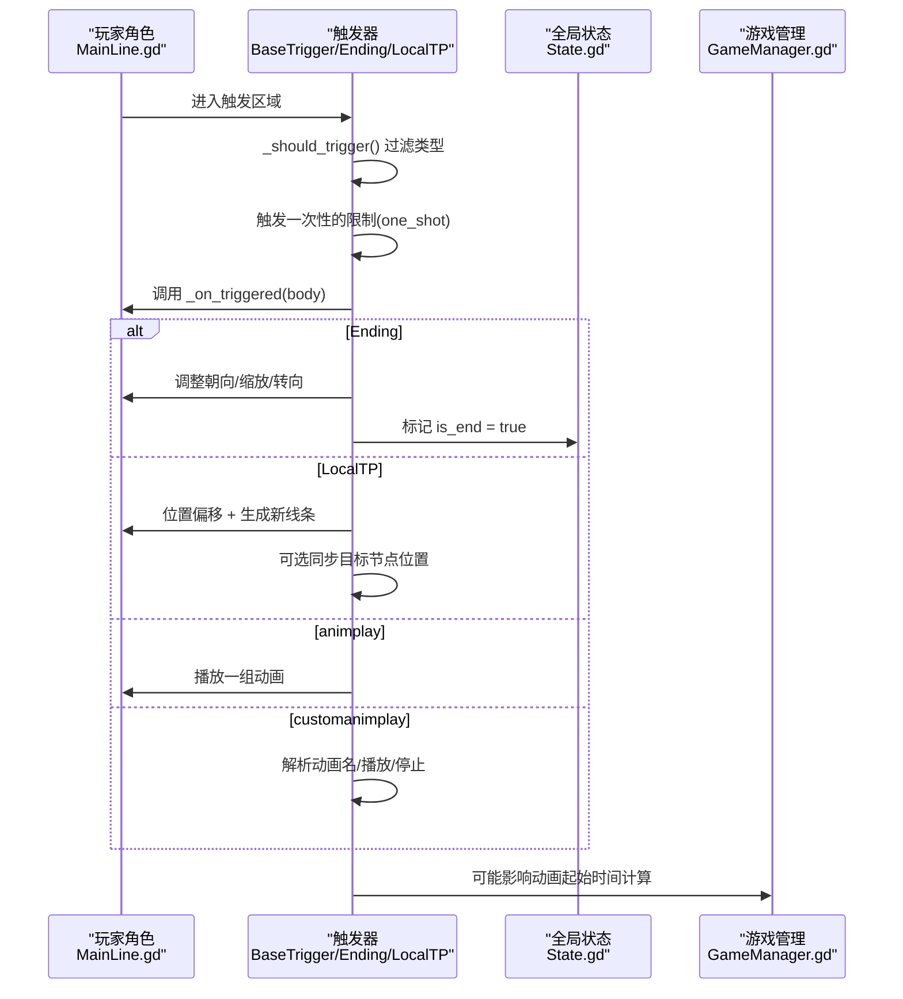
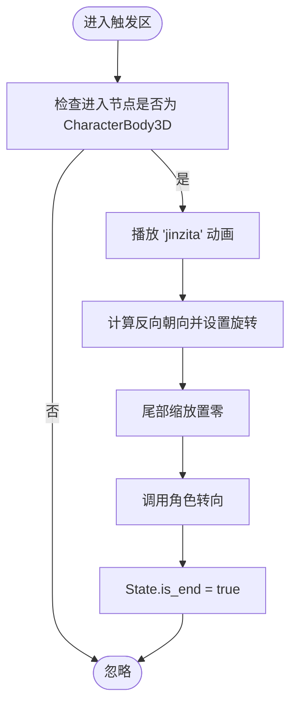
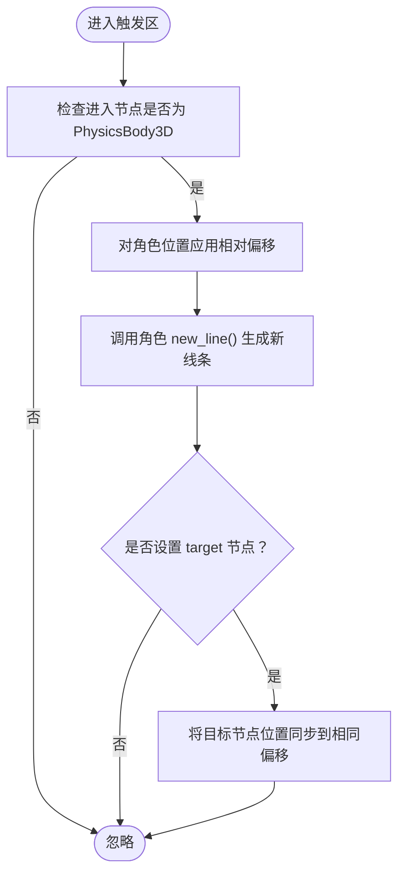
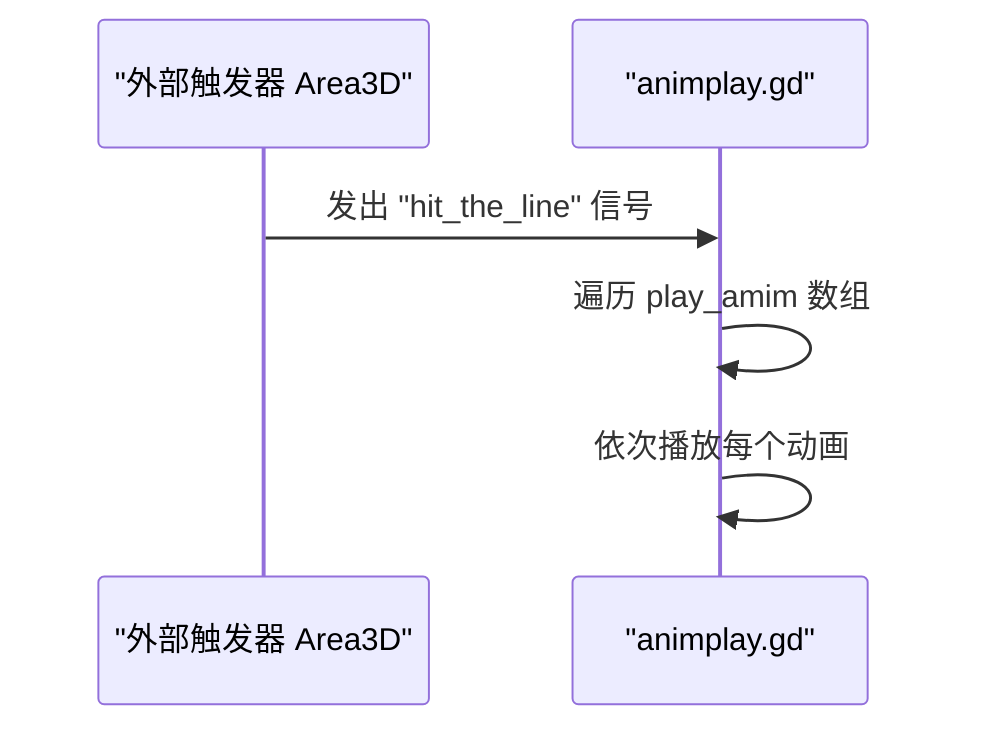
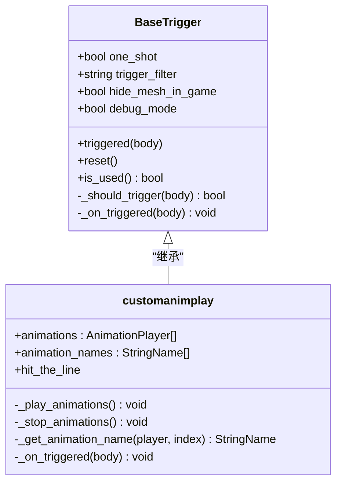
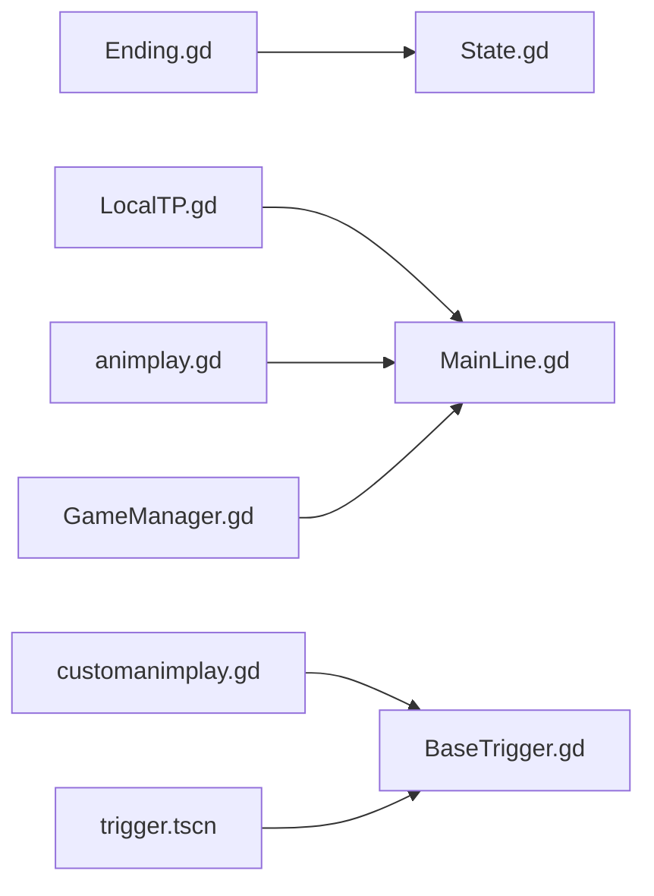

# 实用工具触发器

<cite>
**本文引用的文件**
- [Ending.gd](file://#Template/[Scripts]/Trigger/Ending.gd)
- [LocalTP.gd](file://#Template/[Scripts]/Trigger/LocalTP.gd)
- [animplay.gd](file://#Template/[Scripts]/Trigger/animplay.gd)
- [customanimplay.gd](file://#Template/[Scripts]/Trigger/customanimplay.gd)
- [BaseTrigger.gd](file://#Template/[Scripts]/Trigger/BaseTrigger.gd)
- [GameManager.gd](file://#Template/[Scripts]/GameManager.gd)
- [State.gd](file://#Template/[Scripts]/State.gd)
- [MainLine.gd](file://#Template/[Scripts]/MainLine.gd)
- [trigger.tscn](file://#Template/trigger.tscn)
</cite>

## 目录
1. [简介](#简介)
2. [项目结构](#项目结构)
3. [核心组件](#核心组件)
4. [架构总览](#架构总览)
5. [详细组件分析](#详细组件分析)
6. [依赖关系分析](#依赖关系分析)
7. [性能考量](#性能考量)
8. [故障排查指南](#故障排查指南)
9. [结论](#结论)
10. [附录](#附录)

## 简介
本文件系统化梳理并深入解析项目中的“实用工具触发器”，重点覆盖以下触发器的实现机制与使用方法：
- Ending（游戏结束触发器）：检测角色进入触发区后，播放特定动画、调整角色朝向与状态，并标记游戏结束。
- LocalTP（本地传送触发器）：在角色进入触发区时，对角色位置进行相对偏移并生成新线条，可选地同步目标节点位置。
- animplay（动画播放触发器）：通过外部 Area3D 的信号驱动，播放一组指定的动画序列。
- customanimplay（自定义动画播放触发器）：基于 BaseTrigger 的通用触发框架，支持多 AnimationPlayer 的批量播放与编辑器内预览。

同时，文档将解释这些触发器如何与游戏流程控制、角色传送、动画播放等功能协同工作；详述参数配置、触发条件、执行逻辑等技术细节；并提供使用示例与组合使用建议，以及与游戏状态管理的交互机制与最佳实践。

## 项目结构
实用工具触发器集中位于模板脚本目录的 Trigger 子目录中，采用“继承 Area3D”的通用触发器基类设计，辅以独立脚本实现特定功能。场景资源 trigger.tscn 提供了基础触发器场景模板，便于快速复用。

图表来源
- [BaseTrigger.gd](file://#Template/[Scripts]/Trigger/BaseTrigger.gd)
- [Ending.gd](file://#Template/[Scripts]/Trigger/Ending.gd)
- [LocalTP.gd](file://#Template/[Scripts]/Trigger/LocalTP.gd)
- [animplay.gd](file://#Template/[Scripts]/Trigger/animplay.gd)
- [customanimplay.gd](file://#Template/[Scripts]/Trigger/customanimplay.gd)
- [trigger.tscn](file://#Template/trigger.tscn)
- [State.gd](file://#Template/[Scripts]/State.gd)
- [GameManager.gd](file://#Template/[Scripts]/GameManager.gd)
- [MainLine.gd](file://#Template/[Scripts]/MainLine.gd)

章节来源
- [BaseTrigger.gd](file://#Template/[Scripts]/Trigger/BaseTrigger.gd)
- [trigger.tscn](file://#Template/trigger.tscn)

## 核心组件
- BaseTrigger：为所有触发器提供统一的触发逻辑、过滤器、一次性触发支持与调试输出。子类仅需实现 _on_triggered 即可获得完整的触发生命周期。
- Ending：继承 Area3D，检测角色进入后播放指定动画、调整角色朝向与尾部缩放、调用角色转向并设置全局结束标志。
- LocalTP：继承 Area3D，接收相对位移参数与目标节点路径，在角色进入时对角色位置进行偏移并生成新线条，可选同步目标节点位置。
- animplay：继承 AnimationPlayer，监听外部 Area3D 的信号，收到信号后依次播放一组动画。
- customanimplay：继承 BaseTrigger，支持多 AnimationPlayer 批量播放、按索引指定动画名、编辑器内预览与停止、自动停止等。

章节来源
- [BaseTrigger.gd](file://#Template/[Scripts]/Trigger/BaseTrigger.gd)
- [Ending.gd](file://#Template/[Scripts]/Trigger/Ending.gd)
- [LocalTP.gd](file://#Template/[Scripts]/Trigger/LocalTP.gd)
- [animplay.gd](file://#Template/[Scripts]/Trigger/animplay.gd)
- [customanimplay.gd](file://#Template/[Scripts]/Trigger/customanimplay.gd)

## 架构总览
实用工具触发器围绕“输入事件 → 触发器判定 → 业务动作 → 状态更新”展开。BaseTrigger 负责统一的触发入口与过滤；具体触发器负责执行业务逻辑；State 作为全局状态容器，承载游戏结束、动画时间等关键状态；MainLine 作为玩家角色，承担动画播放、转向、重生等核心行为。

图表来源
- [BaseTrigger.gd](file://#Template/[Scripts]/Trigger/BaseTrigger.gd)
- [Ending.gd](file://#Template/[Scripts]/Trigger/Ending.gd)
- [LocalTP.gd](file://#Template/[Scripts]/Trigger/LocalTP.gd)
- [animplay.gd](file://#Template/[Scripts]/Trigger/animplay.gd)
- [customanimplay.gd](file://#Template/[Scripts]/Trigger/customanimplay.gd)
- [State.gd](file://#Template/[Scripts]/State.gd)
- [GameManager.gd](file://#Template/[Scripts]/GameManager.gd)
- [MainLine.gd](file://#Template/[Scripts]/MainLine.gd)

## 详细组件分析

### Ending（游戏结束触发器）
- 继承关系与职责
  - 继承 Area3D，负责在角色进入触发区后执行“结束流程”。
  - 通过 AnimationPlayer 播放指定动画，调整角色朝向与尾部缩放，触发角色转向，并设置全局结束标志。
- 参数与配置
  - 无导出参数；依赖场景中的 AnimationPlayer 节点与碰撞体。
- 触发条件
  - 仅当进入触发区的节点为 CharacterBody3D 时生效。
- 执行逻辑
  - 播放“jinzita”动画；
  - 计算反向朝向并设置角色旋转；
  - 将角色尾部缩放置零并调用转向；
  - 设置 State.is_end = true，用于后续场景重载或结算。
- 与其他组件的交互
  - 与 State.gd 共享 is_end 标志，驱动 MainLine.gd 在 _ready 中判断是否需要重载场景。
- 使用示例
  - 将 Ending.gd 脚本挂载至场景节点，配置 AnimationPlayer 动画名称与碰撞体大小，放置于关卡终点位置。

图表来源
- [Ending.gd](file://#Template/[Scripts]/Trigger/Ending.gd)
- [State.gd](file://#Template/[Scripts]/State.gd)

章节来源
- [Ending.gd](file://#Template/[Scripts]/Trigger/Ending.gd)
- [State.gd](file://#Template/[Scripts]/State.gd)
- [MainLine.gd](file://#Template/[Scripts]/MainLine.gd)

### LocalTP（本地传送触发器）
- 继承关系与职责
  - 继承 Area3D，负责在角色进入触发区时对角色位置进行相对偏移，并生成新的线条。
  - 支持可选的目标节点路径，将目标节点同步到相同的相对偏移位置。
- 参数与配置
  - tp_x、tp_y、tp_z：相对位移向量。
  - target：NodePath，指向需要同步位置的目标节点。
- 触发条件
  - 进入触发区的节点类型为 PhysicsBody3D（默认继承 CharacterBody3D）。
- 执行逻辑
  - 对角色 position 应用 Vector3(tp_x, tp_y, tp_z) 的偏移；
  - 调用角色 new_line() 生成新线条；
  - 若设置了 target_node，则将其 position 同步到相同偏移位置。
- 与其他组件的交互
  - 与 MainLine.gd 的 new_line() 交互，用于生成连续线条；
  - 与 GameManager.gd 的 calculate_anim_start_time() 间接相关，因为线条变化会影响动画起始时间计算。
- 使用示例
  - 在传送门或传送带场景中，设置 tp_x/tp_z 使角色在水平方向移动，同时可选设置 target 以同步其他节点。

图表来源
- [LocalTP.gd](file://#Template/[Scripts]/Trigger/LocalTP.gd)
- [MainLine.gd](file://#Template/[Scripts]/MainLine.gd)
- [GameManager.gd](file://#Template/[Scripts]/GameManager.gd)

章节来源
- [LocalTP.gd](file://#Template/[Scripts]/Trigger/LocalTP.gd)
- [MainLine.gd](file://#Template/[Scripts]/MainLine.gd)
- [GameManager.gd](file://#Template/[Scripts]/GameManager.gd)

### animplay（动画播放触发器）
- 继承关系与职责
  - 继承 AnimationPlayer，监听外部 Area3D 的“hit_the_line”信号，收到信号后依次播放一组动画。
- 参数与配置
  - play_amim：要播放的动画名称数组。
  - trigger：绑定的 Area3D 触发器节点。
- 触发条件
  - 外部 Area3D 发出“hit_the_line”信号时触发。
- 执行逻辑
  - 在 _ready 中检查并连接 trigger 的“hit_the_line”信号；
  - 收到信号后遍历 play_amim 并逐个播放对应动画。
- 与其他组件的交互
  - 与 MainLine.gd 的 new_line() 信号配合，可在角色生成新线条时触发播放动画。
- 使用示例
  - 将 animplay.gd 挂载到场景中的 AnimationPlayer 节点，配置 play_amim 与 trigger，实现“每生成新线条即播放一次动画”。

图表来源
- [animplay.gd](file://#Template/[Scripts]/Trigger/animplay.gd)

章节来源
- [animplay.gd](file://#Template/[Scripts]/Trigger/animplay.gd)

### customanimplay（自定义动画播放触发器）
- 继承关系与职责
  - 继承 BaseTrigger，提供多 AnimationPlayer 批量播放能力，支持编辑器内预览与停止。
- 参数与配置
  - animations：AnimationPlayer 节点数组。
  - animation_names：与 animations 对应的动画名称数组，可为空则回退到当前或首个动画。
  - one_shot、trigger_filter、hide_mesh_in_game、debug_mode：来自 BaseTrigger 的通用配置。
- 触发条件
  - 由 BaseTrigger 的 _should_trigger() 决定，支持过滤类型与一次性触发。
- 执行逻辑
  - _on_triggered：发出 hit_the_line 信号并播放动画；
  - _play_animations：逐个播放指定或推断的动画名；
  - _stop_animations：停止所有 AnimationPlayer 并可选 seek 到起始；
  - _get_animation_name：优先使用指定名称，否则使用当前动画或首个动画。
- 与其他组件的交互
  - 与 BaseTrigger 的统一触发框架集成；
  - 与 MainLine.gd 的动画节点交互，受 State.gd 的动画时间影响。
- 使用示例
  - 在关卡中设置多个 AnimationPlayer，分别播放不同动画，通过 customanimplay 控制播放顺序与名称。

图表来源
- [BaseTrigger.gd](file://#Template/[Scripts]/Trigger/BaseTrigger.gd)
- [customanimplay.gd](file://#Template/[Scripts]/Trigger/customanimplay.gd)

章节来源
- [customanimplay.gd](file://#Template/[Scripts]/Trigger/customanimplay.gd)
- [BaseTrigger.gd](file://#Template/[Scripts]/Trigger/BaseTrigger.gd)

### BaseTrigger（触发器基类）
- 统一触发入口：在 _ready 中隐藏可视化网格、建立 body_entered 连接。
- 触发过滤：支持 CharacterBody3D、PhysicsBody3D、Any 三种过滤类型。
- 一次性触发：one_shot 标记防止重复触发。
- 调试输出：debug_mode 可在控制台打印触发日志。
- 子类扩展：子类只需实现 _on_triggered(body) 即可获得完整触发生命周期。

章节来源
- [BaseTrigger.gd](file://#Template/[Scripts]/Trigger/BaseTrigger.gd)

## 依赖关系分析
- Ending 依赖 State.gd 的 is_end 标志，用于结束流程与场景重载。
- LocalTP 依赖 MainLine.gd 的 new_line() 生成线条，并可能影响 GameManager.gd 的动画起始时间计算。
- animplay 依赖外部 Area3D 的“hit_the_line”信号，常与 MainLine.gd 的 new_line() 信号联动。
- customanimplay 依赖 BaseTrigger 的统一触发框架，支持多 AnimationPlayer 批量播放。
- trigger.tscn 提供基础触发器场景模板，便于复用统一的 Area3D 结构与连接。

图表来源
- [Ending.gd](file://#Template/[Scripts]/Trigger/Ending.gd)
- [LocalTP.gd](file://#Template/[Scripts]/Trigger/LocalTP.gd)
- [animplay.gd](file://#Template/[Scripts]/Trigger/animplay.gd)
- [customanimplay.gd](file://#Template/[Scripts]/Trigger/customanimplay.gd)
- [BaseTrigger.gd](file://#Template/[Scripts]/Trigger/BaseTrigger.gd)
- [trigger.tscn](file://#Template/trigger.tscn)
- [State.gd](file://#Template/[Scripts]/State.gd)
- [GameManager.gd](file://#Template/[Scripts]/GameManager.gd)
- [MainLine.gd](file://#Template/[Scripts]/MainLine.gd)

章节来源
- [BaseTrigger.gd](file://#Template/[Scripts]/Trigger/BaseTrigger.gd)
- [trigger.tscn](file://#Template/trigger.tscn)

## 性能考量
- 触发频率与开销
  - BaseTrigger 的 _on_body_entered 会进行类型判断与一次性触发检查，建议合理设置 one_shot 与 trigger_filter，减少不必要的重复触发。
- 动画播放
  - customanimplay 与 animplay 在收到信号后逐个播放动画，建议控制动画数量与长度，避免在高频触发场景中造成卡顿。
- 位置同步
  - LocalTP 在角色进入时进行位置偏移与线条生成，若 target 节点较多，建议在必要时才进行同步，降低耦合度。
- 编辑器模式
  - BaseTrigger 与 customanimplay 在编辑器模式下跳过游戏逻辑，仅做初始化，有助于提升编辑器响应速度。

## 故障排查指南
- 触发无效
  - 检查触发器的 trigger_filter 是否与进入节点类型匹配（默认为 CharacterBody3D）。
  - 确认 one_shot 已被使用后不会再次触发。
- 动画未播放
  - 对于 animplay：确认外部 Area3D 已正确发出“hit_the_line”信号。
  - 对于 customanimplay：确认 animations 数组有效且 animation_names 正确，或允许回退到当前/首个动画。
- 传送异常
  - 检查 tp_x/tp_y/tp_z 的数值是否合理，避免过大导致角色瞬移异常。
  - 若设置了 target，确认 NodePath 指向有效节点。
- 结束流程未生效
  - 确认 Ending.gd 已设置 State.is_end = true，MainLine.gd 在 _ready 中会据此重载场景。

章节来源
- [BaseTrigger.gd](file://#Template/[Scripts]/Trigger/BaseTrigger.gd)
- [animplay.gd](file://#Template/[Scripts]/Trigger/animplay.gd)
- [customanimplay.gd](file://#Template/[Scripts]/Trigger/customanimplay.gd)
- [LocalTP.gd](file://#Template/[Scripts]/Trigger/LocalTP.gd)
- [Ending.gd](file://#Template/[Scripts]/Trigger/Ending.gd)
- [State.gd](file://#Template/[Scripts]/State.gd)
- [MainLine.gd](file://#Template/[Scripts]/MainLine.gd)

## 结论
实用工具触发器通过统一的 BaseTrigger 框架实现了高内聚、低耦合的触发机制，结合 Ending、LocalTP、animplay、customanimplay 等专用触发器，能够灵活支撑游戏流程控制、角色传送与动画播放等核心玩法。配合 State.gd 的全局状态与 MainLine.gd 的角色行为，形成清晰的“输入 → 判定 → 执行 → 状态更新”闭环。建议在实际项目中根据场景需求选择合适的触发器类型，并合理配置参数与触发条件，以获得稳定且可维护的游戏体验。

## 附录
- 使用示例与组合建议
  - 关卡切换：在关卡出口放置 Ending.gd，触发后标记结束并重载场景；在入口处可配合 LocalTP 实现传送。
  - 动画联动：使用 animplay 或 customanimplay 在角色生成新线条时播放特效动画，增强反馈。
  - 多节点同步：在复杂场景中，使用 LocalTP 的 target 参数同步多个节点位置，保持视觉一致性。
- 最佳实践
  - 合理使用 one_shot 与 trigger_filter，避免误触发与性能浪费；
  - 在编辑器中利用 customanimplay 的预览与停止按钮快速验证动画；
  - 将动画播放与角色行为解耦，通过信号驱动而非直接耦合。