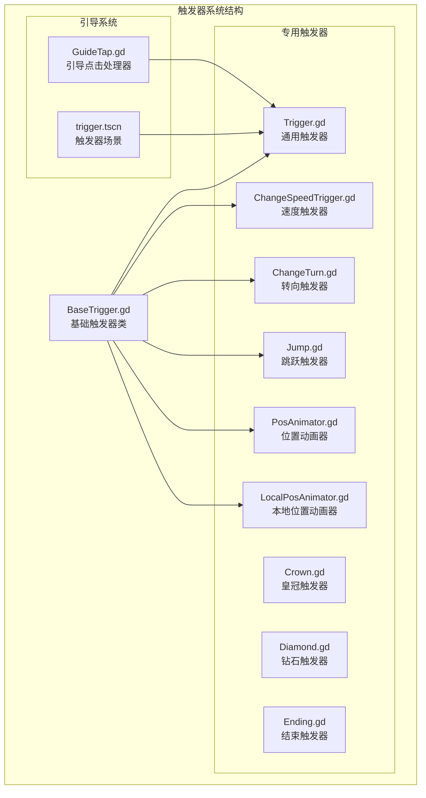
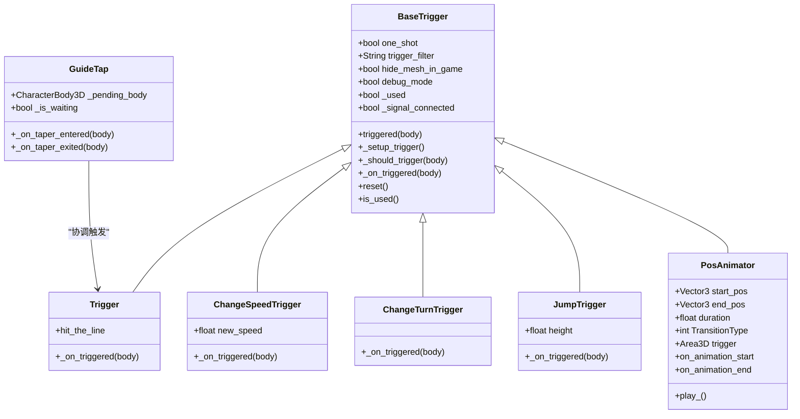
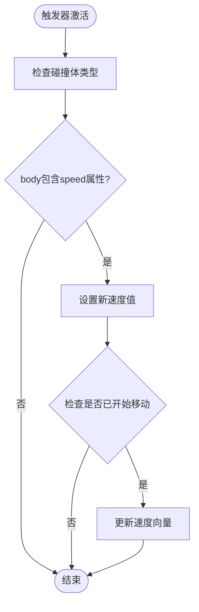
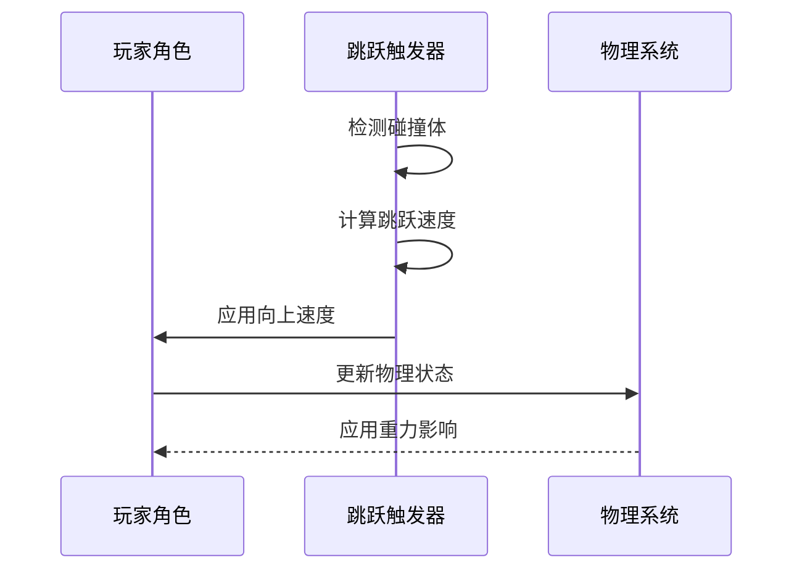
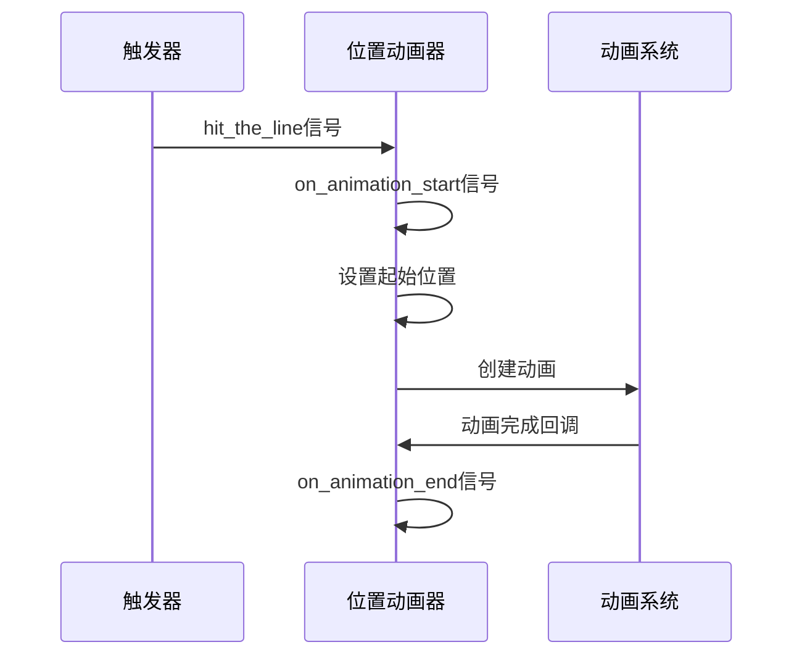
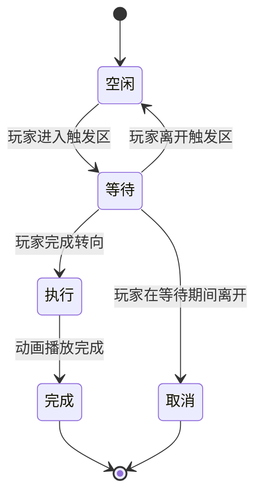
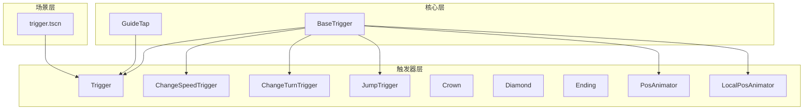

# 引导触发器

<cite>
**本文档引用的文件**
- [BaseTrigger.gd](file://#Template/[Scripts]/Trigger/BaseTrigger.gd)
- [Trigger.gd](file://#Template/[Scripts]/Trigger/Trigger.gd)
- [GuideTap.gd](file://#Template/[Scripts]/GuideLine/GuideTap.gd)
- [trigger.tscn](file://#Template/trigger.tscn)
- [ChangeSpeedTrigger.gd](file://#Template/[Scripts]/Trigger/ChangeSpeedTrigger.gd)
- [ChangeTurn.gd](file://#Template/[Scripts]/Trigger/ChangeTurn.gd)
- [Jump.gd](file://#Template/[Scripts]/Trigger/Jump.gd)
- [PosAnimator.gd](file://#Template/[Scripts]/Trigger/PosAnimator.gd)
- [LocalPosAnimator.gd](file://#Template/[Scripts]/Trigger/LocalPosAnimator.gd)
- [Crown.gd](file://#Template/[Scripts]/Trigger/Crown.gd)
- [Diamond.gd](file://#Template/[Scripts]/Trigger/Diamond.gd)
- [Ending.gd](file://#Template/[Scripts]/Trigger/Ending.gd)
</cite>

## 目录
1. [简介](#简介)
2. [项目结构](#项目结构)
3. [核心组件](#核心组件)
4. [架构概览](#架构概览)
5. [详细组件分析](#详细组件分析)
6. [依赖关系分析](#依赖关系分析)
7. [性能考虑](#性能考虑)
8. [故障排除指南](#故障排除指南)
9. [结论](#结论)

## 简介

引导触发器是Godot Line模板中的核心交互系统，负责管理游戏世界中的各种触发事件和玩家交互。该系统基于Area3D物理碰撞体构建，提供了统一的触发器基类和多种专用触发器类型，包括速度改变、转向控制、跳跃、动画播放等功能。

本系统的设计目标是提供一个灵活、可扩展的触发器框架，让开发者能够轻松创建各种游戏机制，同时保持代码的可维护性和性能优化。

## 项目结构

触发器系统主要位于`#Template/[Scripts]/Trigger/`目录下，包含基础触发器类和各种专用触发器实现：

**图表来源**
- [BaseTrigger.gd:1-102](file://#Template/[Scripts]/Trigger/BaseTrigger.gd#L1-L102)
- [Trigger.gd:1-10](file://#Template/[Scripts]/Trigger/Trigger.gd#L1-L10)
- [GuideTap.gd:1-24](file://#Template/[Scripts]/GuideLine/GuideTap.gd#L1-L24)

**章节来源**
- [BaseTrigger.gd:1-102](file://#Template/[Scripts]/Trigger/BaseTrigger.gd#L1-L102)
- [trigger.tscn:1-24](file://#Template/trigger.tscn#L1-L24)

## 核心组件

### 基础触发器系统

触发器系统的核心是BaseTrigger类，它提供了统一的触发逻辑和生命周期管理：

#### 触发器属性配置
- **一次性触发**：one_shot - 控制触发器是否只能触发一次
- **触发过滤器**：支持CharacterBody3D、PhysicsBody3D、Any三种类型
- **可视化控制**：hide_mesh_in_game - 运行时隐藏网格显示
- **调试模式**：debug_mode - 输出触发日志信息

#### 触发器生命周期
1. **初始化阶段**：设置碰撞体和可视化组件
2. **激活阶段**：建立信号连接和触发监听
3. **触发阶段**：检测碰撞体并执行相应逻辑
4. **重置阶段**：支持重新激活一次性触发器

**章节来源**
- [BaseTrigger.gd:11-28](file://#Template/[Scripts]/Trigger/BaseTrigger.gd#L11-L28)
- [BaseTrigger.gd:29-40](file://#Template/[Scripts]/Trigger/BaseTrigger.gd#L29-L40)

### 引导系统组件

引导触发器系统还包括专门的引导处理组件：

#### GuideTap组件
- **等待机制**：处理玩家角色的转向等待
- **动画协调**：与动画播放同步执行
- **状态管理**：跟踪等待状态和角色引用

#### 触发器场景
- **标准化配置**：预设的触发器场景模板
- **可视化标记**：包含调试用的Marker3D标记点

**章节来源**
- [GuideTap.gd:1-24](file://#Template/[Scripts]/GuideLine/GuideTap.gd#L1-L24)
- [trigger.tscn:1-24](file://#Template/trigger.tscn#L1-L24)

## 架构概览

触发器系统的整体架构采用继承和组合的设计模式：

**图表来源**
- [BaseTrigger.gd:1-102](file://#Template/[Scripts]/Trigger/BaseTrigger.gd#L1-L102)
- [Trigger.gd:1-10](file://#Template/[Scripts]/Trigger/Trigger.gd#L1-L10)
- [ChangeSpeedTrigger.gd:1-15](file://#Template/[Scripts]/Trigger/ChangeSpeedTrigger.gd#L1-L15)
- [ChangeTurn.gd:1-10](file://#Template/[Scripts]/Trigger/ChangeTurn.gd#L1-L10)
- [Jump.gd:1-13](file://#Template/[Scripts]/Trigger/Jump.gd#L1-L13)
- [PosAnimator.gd:1-44](file://#Template/[Scripts]/Trigger/PosAnimator.gd#L1-L44)
- [GuideTap.gd:1-24](file://#Template/[Scripts]/GuideLine/GuideTap.gd#L1-L24)

## 详细组件分析

### 通用触发器 (Trigger)

通用触发器是最简单的触发器类型，主要用于发射信号供其他节点监听：

#### 功能特性
- **信号发射**：hit_the_line信号用于通知其他组件
- **简单实现**：继承自BaseTrigger，重写触发处理方法
- **无副作用**：仅负责信号发射，不修改游戏状态

#### 使用场景
- 作为触发器链的起点
- 与其他触发器组合使用
- 触发外部系统响应

**章节来源**
- [Trigger.gd:1-10](file://#Template/[Scripts]/Trigger/Trigger.gd#L1-L10)

### 速度改变触发器 (ChangeSpeedTrigger)

速度触发器允许动态改变玩家角色的移动速度：

#### 核心逻辑

**图表来源**
- [ChangeSpeedTrigger.gd:8-15](file://#Template/[Scripts]/Trigger/ChangeSpeedTrigger.gd#L8-L15)

#### 性能考虑
- 使用条件检查避免不必要的计算
- 仅在角色开始移动时更新速度向量
- 支持实时速度调整

**章节来源**
- [ChangeSpeedTrigger.gd:1-15](file://#Template/[Scripts]/Trigger/ChangeSpeedTrigger.gd#L1-L15)

### 转向改变触发器 (ChangeTurnTrigger)

转向触发器用于切换玩家角色的转向状态：

#### 实现特点
- **状态切换**：使用逻辑非操作符切换is_turn状态
- **类型安全**：检查body是否包含is_turn属性
- **即时生效**：立即应用新的转向状态

#### 应用场景
- 创建转向陷阱
- 实现双模式切换机制
- 添加游戏策略元素

**章节来源**
- [ChangeTurn.gd:1-10](file://#Template/[Scripts]/Trigger/ChangeTurn.gd#L1-L10)

### 跳跃触发器 (JumpTrigger)

跳跃触发器为玩家角色添加垂直方向的速度：

#### 物理计算

**图表来源**
- [Jump.gd:8-13](file://#Template/[Scripts]/Trigger/Jump.gd#L8-L13)

#### 物理公式
使用公式：v = √(2gh)，其中g为重力常数，h为跳跃高度

**章节来源**
- [Jump.gd:1-13](file://#Template/[Scripts]/Trigger/Jump.gd#L1-L13)

### 位置动画器 (PosAnimator)

位置动画器提供基于触发器的平滑动画功能：

#### 动画控制
- **起始位置**：start_pos - 动画开始时的位置
- **结束位置**：end_pos - 动画结束时的位置  
- **持续时间**：duration - 动画总时长
- **缓动类型**：TransitionType - 动画缓动函数

#### 触发机制

**图表来源**
- [PosAnimator.gd:27-37](file://#Template/[Scripts]/Trigger/PosAnimator.gd#L27-L37)

**章节来源**
- [PosAnimator.gd:1-44](file://#Template/[Scripts]/Trigger/PosAnimator.gd#L1-L44)

### 引导点击处理器 (GuideTap)

引导点击处理器协调玩家的引导点击与动画播放：

#### 状态管理流程

**图表来源**
- [GuideTap.gd:9-24](file://#Template/[Scripts]/GuideLine/GuideTap.gd#L9-L24)

#### 协调机制
- **等待同步**：等待玩家角色完成转向动作
- **动画协调**：与引导动画播放同步
- **状态清理**：正确处理玩家离开的情况

**章节来源**
- [GuideTap.gd:1-24](file://#Template/[Scripts]/GuideLine/GuideTap.gd#L1-L24)

## 依赖关系分析

触发器系统内部的依赖关系呈现清晰的层次结构：

**图表来源**
- [BaseTrigger.gd:1-102](file://#Template/[Scripts]/Trigger/BaseTrigger.gd#L1-L102)
- [GuideTap.gd:1-24](file://#Template/[Scripts]/GuideLine/GuideTap.gd#L1-L24)
- [trigger.tscn:1-24](file://#Template/trigger.tscn#L1-L24)

### 外部依赖

触发器系统依赖于以下外部组件：
- **Godot引擎**：Area3D、CharacterBody3D、AnimationPlayer等核心类
- **物理系统**：碰撞检测和物理模拟
- **动画系统**：AnimationPlayer用于触发器动画

**章节来源**
- [BaseTrigger.gd:1-102](file://#Template/[Scripts]/Trigger/BaseTrigger.gd#L1-L102)
- [GuideTap.gd:1-24](file://#Template/[Scripts]/GuideLine/GuideTap.gd#L1-L24)

## 性能考虑

### 触发器性能优化

1. **一次性触发优化**：使用one_shot属性避免重复计算
2. **类型检查优化**：在触发前进行快速类型检查
3. **信号连接优化**：避免重复连接和断开信号
4. **可视化优化**：运行时隐藏网格减少渲染开销

### 内存管理

- **对象生命周期**：触发器完成后及时释放资源
- **动画内存**：使用队列释放避免内存泄漏
- **状态管理**：合理管理触发器状态避免内存累积

### 渲染性能

- **网格隐藏**：hide_mesh_in_game选项减少渲染负载
- **调试控制**：debug_mode仅在开发时启用
- **动画优化**：使用高效的缓动函数

## 故障排除指南

### 常见问题诊断

#### 触发器不响应
1. **检查碰撞体设置**：确认Area3D和CollisionShape3D正确配置
2. **验证触发过滤器**：确保目标节点类型匹配
3. **检查信号连接**：确认触发器已正确连接到body_entered信号

#### 动画不播放
1. **验证触发器连接**：确认PosAnimator正确连接到触发器信号
2. **检查动画资源**：确保AnimationPlayer包含正确的动画
3. **验证位置设置**：确认start_pos和end_pos已正确设置

#### 引导系统问题
1. **检查角色状态**：确认CharacterBody3D具有必要的属性
2. **验证等待逻辑**：确保等待状态正确管理
3. **检查动画同步**：确认动画播放与触发时机匹配

### 调试技巧

#### 日志输出
- 启用debug_mode查看详细的触发日志
- 监控触发器状态变化
- 跟踪碰撞体进入和离开事件

#### 场景调试
- 使用Marker3D标记触发器位置
- 可视化碰撞区域
- 检查触发器的可见性设置

**章节来源**
- [BaseTrigger.gd:20-23](file://#Template/[Scripts]/Trigger/BaseTrigger.gd#L20-L23)
- [BaseTrigger.gd:53-73](file://#Template/[Scripts]/Trigger/BaseTrigger.gd#L53-L73)

## 结论

引导触发器系统提供了一个强大而灵活的游戏交互框架。通过统一的基础触发器类和多样化的专用触发器，开发者可以轻松创建复杂的关卡机制和玩家交互体验。

系统的主要优势包括：
- **模块化设计**：清晰的继承层次和职责分离
- **性能优化**：合理的内存管理和渲染优化
- **扩展性强**：易于添加新的触发器类型
- **调试友好**：完善的日志输出和可视化工具

未来可以考虑的功能增强：
- 更多触发器类型的扩展
- 触发器组合和链式反应机制
- 更精细的动画控制系统
- 触发器状态持久化支持