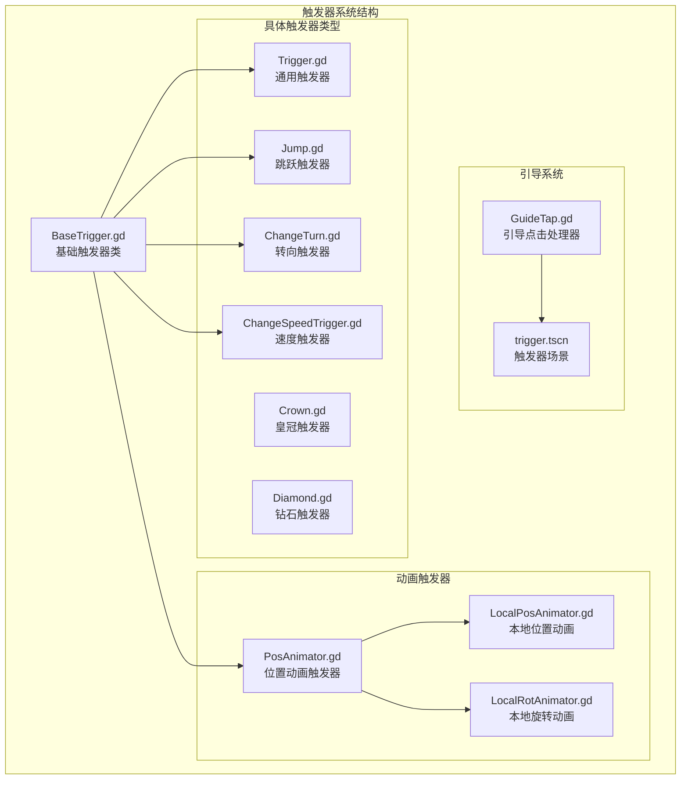
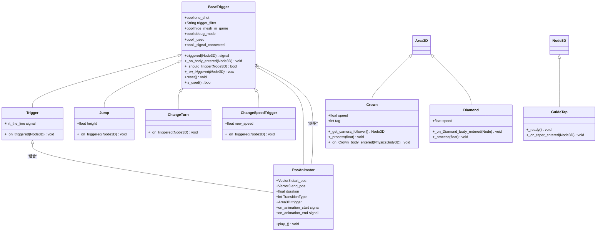
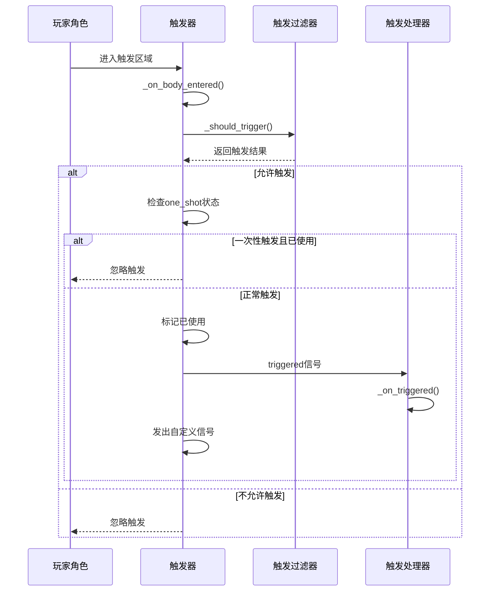
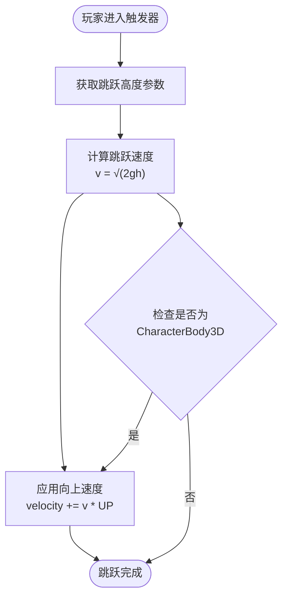
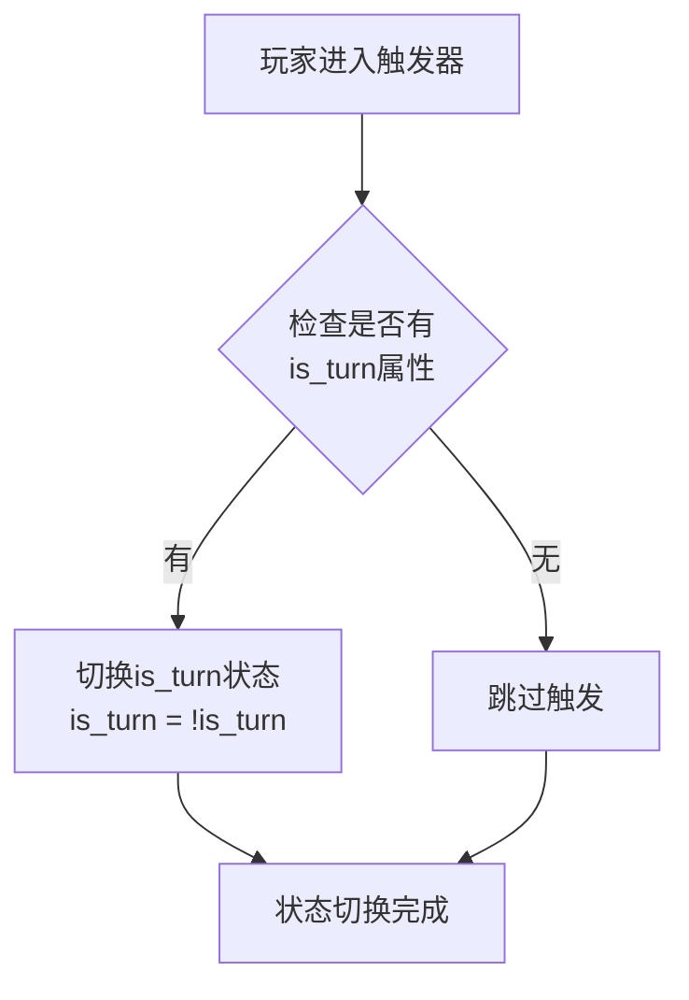
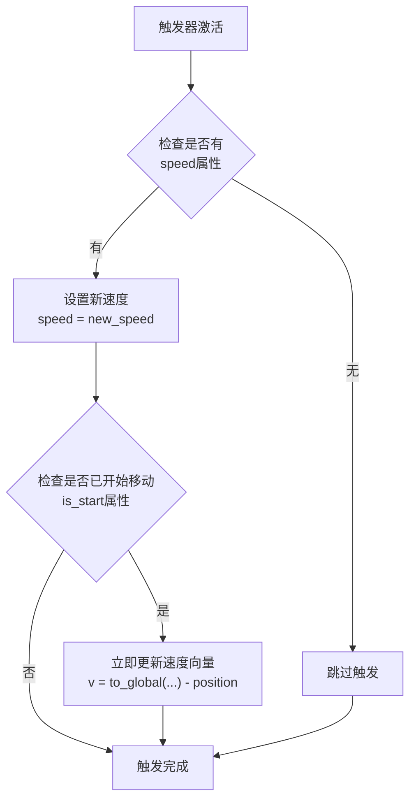
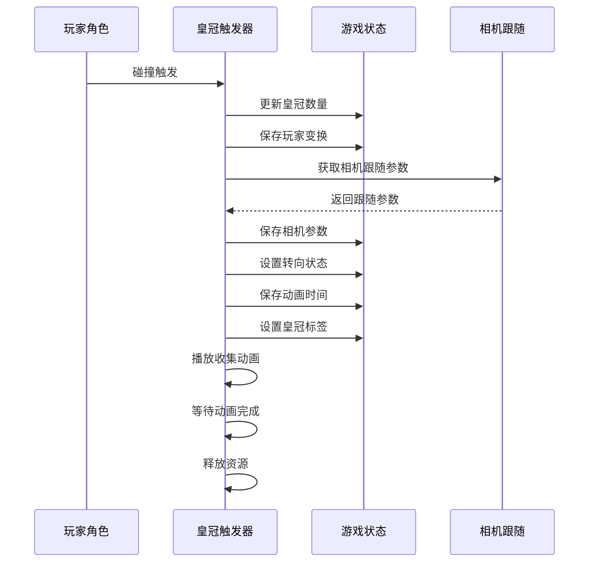
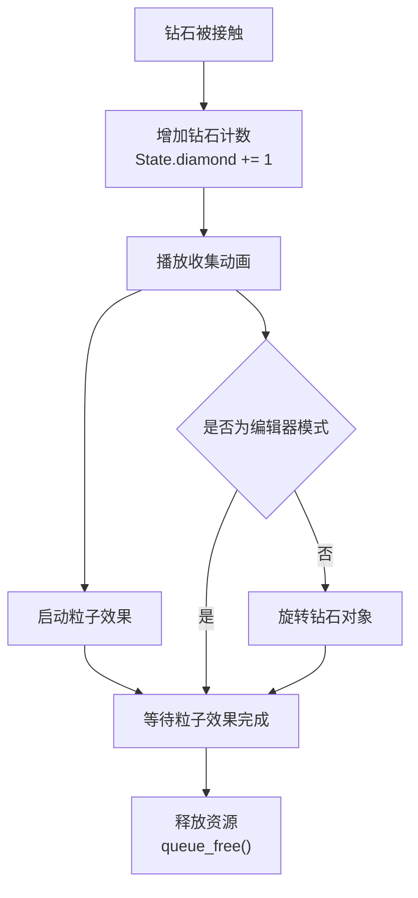
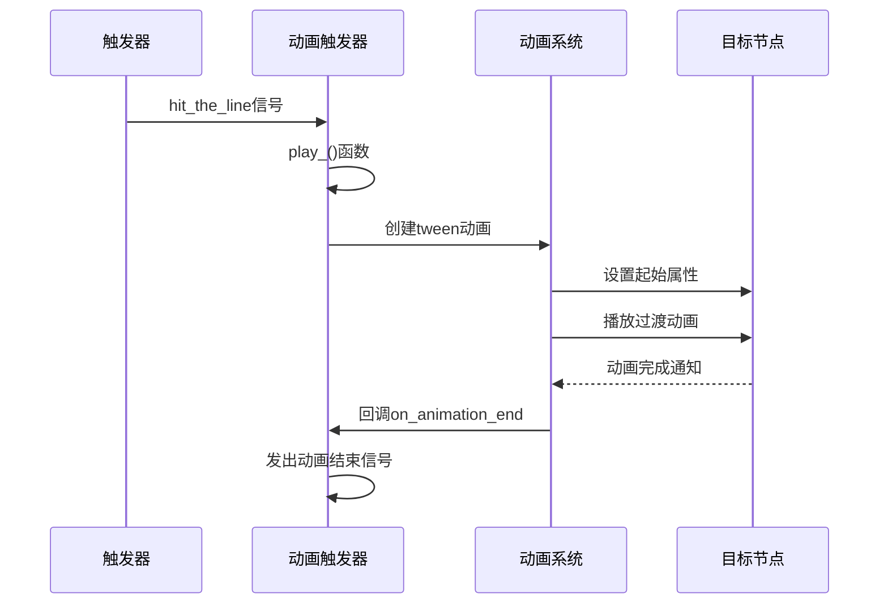
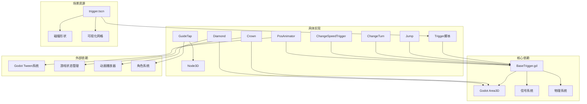

# 引导触发器

<cite>
**本文档引用的文件**
- [BaseTrigger.gd](file://#Template/[Scripts]/Trigger/BaseTrigger.gd)
- [Trigger.gd](file://#Template/[Scripts]/Trigger/Trigger.gd)
- [GuideTap.gd](file://#Template/[Scripts]/GuideLine/GuideTap.gd)
- [trigger.tscn](file://#Template/trigger.tscn)
- [Crown.gd](file://#Template/[Scripts]/Trigger/Crown.gd)
- [Diamond.gd](file://#Template/[Scripts]/Trigger/Diamond.gd)
- [Jump.gd](file://#Template/[Scripts]/Trigger/Jump.gd)
- [ChangeTurn.gd](file://#Template/[Scripts]/Trigger/ChangeTurn.gd)
- [ChangeSpeedTrigger.gd](file://#Template/[Scripts]/Trigger/ChangeSpeedTrigger.gd)
- [PosAnimator.gd](file://#Template/[Scripts]/Trigger/PosAnimator.gd)
- [LocalPosAnimator.gd](file://#Template/[Scripts]/Trigger/LocalPosAnimator.gd)
- [LocalRotAnimator.gd](file://#Template/[Scripts]/Trigger/LocalRotAnimator.gd)
</cite>

## 目录
1. [简介](#简介)
2. [项目结构](#项目结构)
3. [核心组件](#核心组件)
4. [架构概览](#架构概览)
5. [详细组件分析](#详细组件分析)
6. [依赖关系分析](#依赖关系分析)
7. [性能考虑](#性能考虑)
8. [故障排除指南](#故障排除指南)
9. [结论](#结论)

## 简介

引导触发器是Godot Line模板中的核心交互系统，负责处理玩家角色与游戏环境中各种触发器的交互。该系统基于Area3D物理碰撞体构建，提供了统一的触发机制和多种预定义的触发器类型。

触发器系统的主要目标是：
- 提供统一的触发器基类和接口
- 支持多种触发器类型（跳跃、转向改变、速度改变等）
- 实现引导线系统的视觉反馈
- 处理游戏状态管理和持久化

## 项目结构

触发器系统位于`#Template/[Scripts]/Trigger/`目录下，包含基础触发器类和各种具体的触发器实现：

**图表来源**
- [BaseTrigger.gd:1-102](file://#Template/[Scripts]/Trigger/BaseTrigger.gd#L1-L102)
- [Trigger.gd:1-10](file://#Template/[Scripts]/Trigger/Trigger.gd#L1-L10)
- [GuideTap.gd:1-11](file://#Template/[Scripts]/GuideLine/GuideTap.gd#L1-L11)

**章节来源**
- [BaseTrigger.gd:1-102](file://#Template/[Scripts]/Trigger/BaseTrigger.gd#L1-L102)
- [trigger.tscn:1-24](file://#Template/trigger.tscn#L1-L24)

## 核心组件

### 基础触发器系统

触发器系统的核心是`BaseTrigger`类，它提供了所有触发器的通用功能：

#### 触发器属性配置
- **一次性触发**：`one_shot` - 控制触发器是否只能触发一次
- **触发过滤器**：`trigger_filter` - 指定允许触发的节点类型
- **网格隐藏**：`hide_mesh_in_game` - 运行时隐藏可视化网格
- **调试模式**：`debug_mode` - 控制触发信息的输出

#### 触发机制
触发器通过`body_entered`信号检测碰撞体进入，并根据过滤器规则判断是否触发。触发后会发出`triggered`信号给其他节点监听。

**章节来源**
- [BaseTrigger.gd:11-28](file://#Template/[Scripts]/Trigger/BaseTrigger.gd#L11-L28)
- [BaseTrigger.gd:46-73](file://#Template/[Scripts]/Trigger/BaseTrigger.gd#L46-L73)

### 通用触发器

`Trigger`类是最简单的触发器实现，专门用于发射`hit_the_line`信号，供其他节点监听。

### 引导触发器

引导触发器系统包括`GuideTap`类和对应的场景资源，用于处理玩家的引导点击操作。

**章节来源**
- [Trigger.gd:1-10](file://#Template/[Scripts]/Trigger/Trigger.gd#L1-L10)
- [GuideTap.gd:1-11](file://#Template/[Scripts]/GuideLine/GuideTap.gd#L1-L11)

## 架构概览

触发器系统的整体架构基于继承和组合的设计模式：

**图表来源**
- [BaseTrigger.gd:1-102](file://#Template/[Scripts]/Trigger/BaseTrigger.gd#L1-L102)
- [Trigger.gd:1-10](file://#Template/[Scripts]/Trigger/Trigger.gd#L1-L10)
- [Jump.gd:1-13](file://#Template/[Scripts]/Trigger/Jump.gd#L1-L13)
- [ChangeTurn.gd:1-10](file://#Template/[Scripts]/Trigger/ChangeTurn.gd#L1-L10)
- [ChangeSpeedTrigger.gd:1-15](file://#Template/[Scripts]/Trigger/ChangeSpeedTrigger.gd#L1-L15)
- [Crown.gd:1-40](file://#Template/[Scripts]/Trigger/Crown.gd#L1-L40)
- [Diamond.gd:1-15](file://#Template/[Scripts]/Trigger/Diamond.gd#L1-L15)
- [PosAnimator.gd:1-44](file://#Template/[Scripts]/Trigger/PosAnimator.gd#L1-L44)
- [GuideTap.gd:1-11](file://#Template/[Scripts]/GuideLine/GuideTap.gd#L1-L11)

## 详细组件分析

### 基础触发器类分析

#### 触发流程控制

**图表来源**
- [BaseTrigger.gd:53-73](file://#Template/[Scripts]/Trigger/BaseTrigger.gd#L53-L73)
- [BaseTrigger.gd:75-86](file://#Template/[Scripts]/Trigger/BaseTrigger.gd#L75-L86)

#### 触发过滤器机制

触发器支持三种过滤模式：
- **CharacterBody3D**：仅允许CharacterBody3D及其子类触发
- **PhysicsBody3D**：允许所有物理体触发
- **Any**：允许任何类型的节点触发

**章节来源**
- [BaseTrigger.gd:75-86](file://#Template/[Scripts]/Trigger/BaseTrigger.gd#L75-L86)

### 跳跃触发器分析

跳跃触发器为玩家角色提供垂直方向的跳跃能力：

#### 跳跃物理计算

**图表来源**
- [Jump.gd:8-12](file://#Template/[Scripts]/Trigger/Jump.gd#L8-L12)

**章节来源**
- [Jump.gd:1-13](file://#Template/[Scripts]/Trigger/Jump.gd#L1-L13)

### 转向改变触发器

转向触发器用于切换玩家角色的转向状态：

#### 状态切换逻辑

**图表来源**
- [ChangeTurn.gd:6-9](file://#Template/[Scripts]/Trigger/ChangeTurn.gd#L6-L9)

**章节来源**
- [ChangeTurn.gd:1-10](file://#Template/[Scripts]/Trigger/ChangeTurn.gd#L1-L10)

### 速度改变触发器

速度触发器动态调整玩家角色的移动速度：

#### 速度更新机制

**图表来源**
- [ChangeSpeedTrigger.gd:8-14](file://#Template/[Scripts]/Trigger/ChangeSpeedTrigger.gd#L8-L14)

**章节来源**
- [ChangeSpeedTrigger.gd:1-15](file://#Template/[Scripts]/Trigger/ChangeSpeedTrigger.gd#L1-L15)

### 皇冠触发器分析

皇冠触发器处理玩家收集皇冠的逻辑：

#### 皇冠收集流程

**图表来源**
- [Crown.gd:16-39](file://#Template/[Scripts]/Trigger/Crown.gd#L16-L39)

**章节来源**
- [Crown.gd:1-40](file://#Template/[Scripts]/Trigger/Crown.gd#L1-L40)

### 钻石触发器分析

钻石触发器提供简单的收集功能和视觉反馈：

#### 钻石收集机制

**图表来源**
- [Diamond.gd:6-14](file://#Template/[Scripts]/Trigger/Diamond.gd#L6-L14)

**章节来源**
- [Diamond.gd:1-15](file://#Template/[Scripts]/Trigger/Diamond.gd#L1-L15)

### 动画触发器系统

动画触发器系统提供基于触发器的动画播放功能：

#### 动画播放流程

**图表来源**
- [PosAnimator.gd:27-37](file://#Template/[Scripts]/Trigger/PosAnimator.gd#L27-L37)

**章节来源**
- [PosAnimator.gd:1-44](file://#Template/[Scripts]/Trigger/PosAnimator.gd#L1-L44)

## 依赖关系分析

触发器系统内部的依赖关系如下：

**图表来源**
- [BaseTrigger.gd:2-6](file://#Template/[Scripts]/Trigger/BaseTrigger.gd#L2-L6)
- [PosAnimator.gd:27-30](file://#Template/[Scripts]/Trigger/PosAnimator.gd#L27-L30)
- [Crown.gd:6-9](file://#Template/[Scripts]/Trigger/Crown.gd#L6-L9)

**章节来源**
- [BaseTrigger.gd:1-102](file://#Template/[Scripts]/Trigger/BaseTrigger.gd#L1-L102)
- [trigger.tscn:3-23](file://#Template/trigger.tscn#L3-L23)

## 性能考虑

触发器系统的性能优化主要体现在以下几个方面：

### 触发器优化策略
- **一次性触发缓存**：使用`_used`标志避免重复触发
- **信号连接复用**：通过`_signal_connected`避免重复连接
- **编辑器模式跳过**：在编辑器中跳过运行时逻辑
- **网格隐藏**：运行时隐藏可视化网格减少渲染开销

### 内存管理
- **自动资源释放**：收集完成后及时释放内存
- **动画资源管理**：动画播放完成后清理相关资源
- **状态重置**：提供`reset()`方法重置触发器状态

### 性能监控
- **调试模式**：通过`debug_mode`输出触发信息
- **过滤器优化**：精确的触发器类型过滤减少不必要的处理

## 故障排除指南

### 常见问题及解决方案

#### 触发器不响应问题
1. **检查碰撞体设置**：确保Area3D的碰撞形状正确配置
2. **验证触发过滤器**：确认触发器类型与目标节点匹配
3. **检查one_shot状态**：如需重复触发，将`one_shot`设为false

#### 动画播放问题
1. **验证信号连接**：确保`hit_the_line`信号正确连接
2. **检查动画资源**：确认AnimationPlayer中有对应动画
3. **检查属性设置**：验证起始和结束位置参数

#### 状态同步问题
1. **检查状态变量**：确认全局状态变量正确更新
2. **验证相机跟随**：确保相机跟随参数正确保存
3. **检查时间同步**：确认音乐播放时间正确记录

**章节来源**
- [BaseTrigger.gd:54-73](file://#Template/[Scripts]/Trigger/BaseTrigger.gd#L54-L73)
- [PosAnimator.gd:27-37](file://#Template/[Scripts]/Trigger/PosAnimator.gd#L27-L37)

## 结论

引导触发器系统为Godot Line模板提供了完整而灵活的交互机制。通过统一的基础架构和多样化的触发器类型，开发者可以轻松创建丰富的游戏体验。

### 系统优势
- **模块化设计**：清晰的继承层次和职责分离
- **扩展性强**：基于BaseTrigger的简单扩展机制
- **性能优化**：合理的内存管理和渲染优化
- **调试友好**：完善的调试信息和错误处理

### 最佳实践
- 使用合适的触发器类型匹配游戏需求
- 合理配置触发器参数避免性能问题
- 利用调试模式进行开发和测试
- 注意资源管理和内存泄漏防护

该系统为后续的功能扩展奠定了良好的基础，开发者可以根据具体需求创建更多样化的触发器类型。