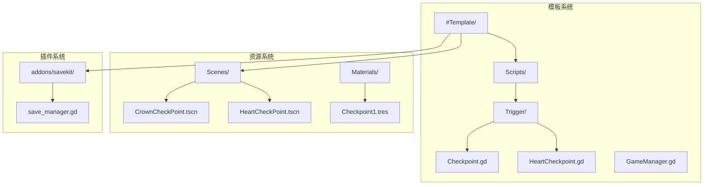
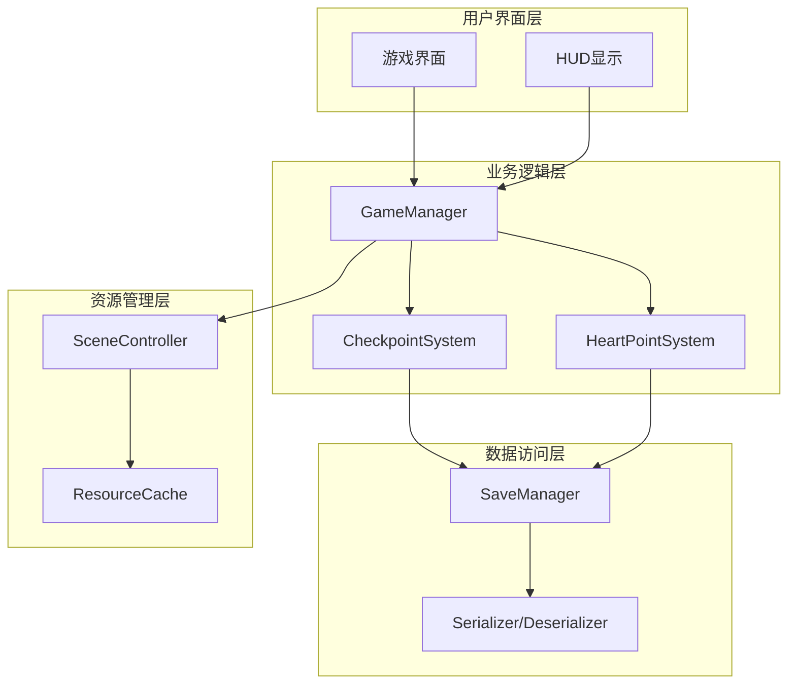
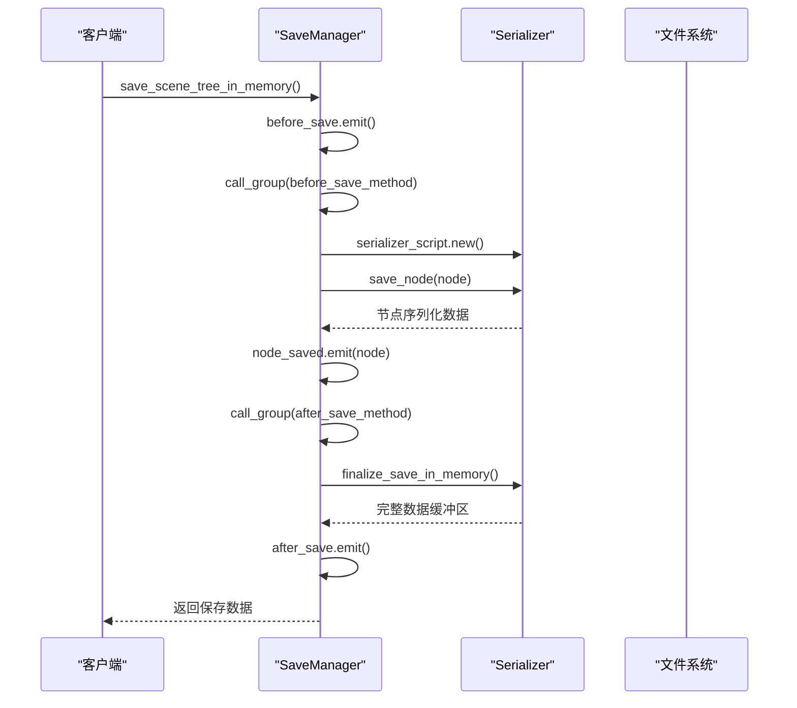
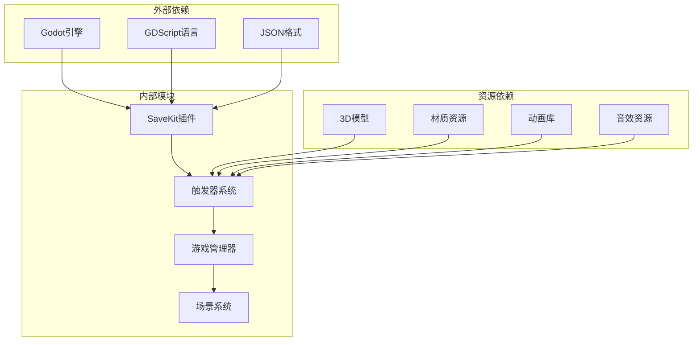

# 检查点系统

<cite>
**本文档引用的文件**
- [save_manager.gd](file://addons/savekit/save_manager.gd)
- [Checkpoint.gd](file://#Template/[Scripts]/Trigger/Checkpoint.gd)
- [HeartCheckpoint.gd](file://#Template/[Scripts]/Trigger/HeartCheckpoint.gd)
- [GameManager.gd](file://#Template/[Scripts]/GameManager.gd)
- [CrownCheckPoint.tscn](file://#Template/CrownCheckPoint.tscn)
- [HeartCheckPoint.tscn](file://#Template/HeartCheckPoint.tscn)
- [README.md](file://README.md)
</cite>

## 目录
1. [简介](#简介)
2. [项目结构](#项目结构)
3. [核心组件](#核心组件)
4. [架构概览](#架构概览)
5. [详细组件分析](#详细组件分析)
6. [依赖关系分析](#依赖关系分析)
7. [性能考虑](#性能考虑)
8. [故障排除指南](#故障排除指南)
9. [结论](#结论)

## 简介

检查点系统是Godot Line模板中的核心功能模块，负责管理玩家在游戏中设置的重生点和进度保存。该系统基于SaveKit插件构建，提供了完整的存档和读档功能，支持多种类型的检查点，包括普通检查点和心形检查点。

检查点系统的主要目标是在玩家角色死亡时提供重生位置，并允许玩家在游戏过程中保存进度。系统集成了动画效果、物理碰撞检测和状态管理，为玩家提供了流畅的游戏体验。

## 项目结构

检查点系统主要分布在以下目录结构中：

**图表来源**
- [Checkpoint.gd](file://#Template/[Scripts]/Trigger/Checkpoint.gd)
- [HeartCheckpoint.gd](file://#Template/[Scripts]/Trigger/HeartCheckpoint.gd)
- [GameManager.gd](file://#Template/[Scripts]/GameManager.gd)
- [CrownCheckPoint.tscn](file://#Template/CrownCheckPoint.tscn)
- [HeartCheckPoint.tscn](file://#Template/HeartCheckPoint.tscn)
- [save_manager.gd](file://addons/savekit/save_manager.gd)

**章节来源**
- [README.md:52-61](file://README.md#L52-L61)

## 核心组件

检查点系统由多个相互协作的核心组件组成，每个组件都有特定的功能和职责：

### SaveKit存档管理器
SaveKit插件提供了完整的存档和读档功能，支持JSON序列化格式，可以保存场景树中的所有节点状态。

### 检查点触发器
检查点触发器负责检测玩家角色与检查点的交互，处理重生逻辑和状态更新。

### 游戏管理器
游戏管理器协调整个检查点系统的操作，包括状态同步、事件处理和数据持久化。

### 场景资源
场景文件定义了检查点的视觉表现、物理属性和动画效果。

**章节来源**
- [save_manager.gd:1-294](file://addons/savekit/save_manager.gd#L1-L294)

## 架构概览

检查点系统的整体架构采用了分层设计模式，确保了模块间的松耦合和高内聚性：

**图表来源**
- [save_manager.gd:71-93](file://addons/savekit/save_manager.gd#L71-L93)
- [GameManager.gd](file://#Template/[Scripts]/GameManager.gd)
- [Checkpoint.gd](file://#Template/[Scripts]/Trigger/Checkpoint.gd)

## 详细组件分析

### SaveKit存档管理器

SaveKit插件是检查点系统的核心基础设施，提供了完整的序列化和反序列化功能：

#### 主要功能特性
- **场景树保存**：自动遍历并保存指定组的所有节点
- **生命周期钩子**：支持保存前后的回调函数
- **多格式支持**：默认使用JSON格式，可扩展其他格式
- **错误处理**：完善的错误检测和恢复机制

#### 序列化流程

**图表来源**
- [save_manager.gd:71-93](file://addons/savekit/save_manager.gd#L71-L93)

**章节来源**
- [save_manager.gd:96-105](file://addons/savekit/save_manager.gd#L96-L105)
- [save_manager.gd:182-188](file://addons/savekit/save_manager.gd#L182-L188)

### 检查点触发器系统

检查点触发器负责检测玩家与检查点的交互，并执行相应的重生逻辑。

#### 普通检查点（CrownCheckPoint）
普通检查点提供基本的重生功能，包含以下组件：
- **碰撞检测区域**：定义检查点的有效范围
- **重生标记**：指定玩家重生的具体位置
- **视觉效果**：动态的皇冠动画和材质变化
- **音效反馈**：收集时的音效播放

#### 心形检查点（HeartCheckPoint）
心形检查点提供增强的重生功能，具有更丰富的视觉效果：
- **复杂几何结构**：由核心和框架组成的双层结构
- **高级动画系统**：支持多种动画状态切换
- **材质系统**：动态材质变化和发光效果
- **阴影映射**：优化的阴影渲染效果

**章节来源**
- [CrownCheckPoint.tscn:77-104](file://#Template/CrownCheckPoint.tscn#L77-L104)
- [HeartCheckPoint.tscn:105-132](file://#Template/HeartCheckPoint.tscn#L105-L132)

### 游戏管理器集成

游戏管理器协调检查点系统与其他游戏组件的交互：

#### 状态管理
- **检查点状态跟踪**：记录当前有效的检查点位置
- **重生位置管理**：维护玩家的最近重生点
- **进度同步**：确保检查点状态与游戏进度一致

#### 事件处理
- **检查点激活事件**：处理玩家接近检查点的逻辑
- **重生触发事件**：响应玩家死亡时的重生流程
- **状态更新事件**：同步检查点状态到其他系统

**章节来源**
- [GameManager.gd](file://#Template/[Scripts]/GameManager.gd)

## 依赖关系分析

检查点系统的依赖关系体现了清晰的分层架构：

**图表来源**
- [save_manager.gd:67-69](file://addons/savekit/save_manager.gd#L67-L69)
- [Checkpoint.gd](file://#Template/[Scripts]/Trigger/Checkpoint.gd)
- [HeartCheckpoint.gd](file://#Template/[Scripts]/Trigger/HeartCheckpoint.gd)

### 关键依赖关系

1. **SaveKit依赖**：检查点系统完全依赖SaveKit插件提供的序列化功能
2. **场景依赖**：检查点触发器依赖具体的场景资源定义
3. **材质依赖**：视觉效果依赖预定义的材质和纹理资源
4. **动画依赖**：动画系统依赖场景中定义的动画库

**章节来源**
- [save_manager.gd:31-35](file://addons/savekit/save_manager.gd#L31-L35)

## 性能考虑

检查点系统在设计时充分考虑了性能优化：

### 内存管理
- **延迟加载**：检查点资源按需加载，减少初始内存占用
- **对象池**：重复使用的检查点对象进行缓存复用
- **垃圾回收**：及时释放不再使用的检查点资源

### 渲染优化
- **LOD系统**：根据距离动态调整检查点的细节级别
- **批量渲染**：相同材质的检查点进行批量绘制
- **剔除优化**：不可见的检查点不参与渲染

### 存储优化
- **增量保存**：只保存发生变化的检查点状态
- **压缩算法**：使用高效的JSON压缩减少存储空间
- **异步处理**：存档操作在后台线程执行，避免阻塞主线程

## 故障排除指南

### 常见问题及解决方案

#### 检查点无法激活
**症状**：玩家接近检查点但没有触发重生
**可能原因**：
- 碰撞检测区域配置错误
- 检查点脚本未正确连接
- 重生位置路径无效

**解决步骤**：
1. 检查检查点场景中的碰撞形状配置
2. 验证脚本与场景的连接关系
3. 确认重生位置节点路径正确

#### 存档失败
**症状**：游戏无法保存进度
**可能原因**：
- SaveKit插件配置错误
- 文件权限问题
- 磁盘空间不足

**解决步骤**：
1. 检查SaveManager的配置参数
2. 验证保存目录的写入权限
3. 确保有足够的磁盘空间

#### 动画异常
**症状**：检查点动画播放不正常
**可能原因**：
- 动画库资源缺失
- 动画播放器配置错误
- 材质资源加载失败

**解决步骤**：
1. 检查动画库资源是否完整
2. 验证动画播放器的连接关系
3. 确认材质资源正确加载

**章节来源**
- [save_manager.gd:114-144](file://addons/savekit/save_manager.gd#L114-L144)
- [save_manager.gd:202-214](file://addons/savekit/save_manager.gd#L202-L214)

## 结论

检查点系统通过精心设计的架构和实现，为Godot Line模板提供了强大而灵活的重生和进度管理功能。系统的主要优势包括：

1. **模块化设计**：清晰的分层架构使得系统易于维护和扩展
2. **高性能实现**：优化的内存管理和渲染策略确保流畅的游戏体验
3. **强大的存档功能**：基于SaveKit插件的完整存档系统
4. **丰富的视觉效果**：多样化的检查点类型满足不同游戏需求

未来可以考虑的改进方向：
- 添加更多类型的检查点效果
- 实现检查点的自定义配置
- 优化大规模场景下的性能表现
- 增强检查点系统的可定制性

检查点系统为开发者提供了一个坚实的基础，可以在此基础上构建更加丰富和有趣的游戏体验。