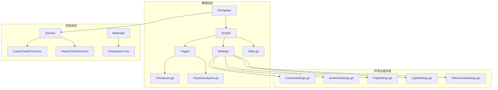
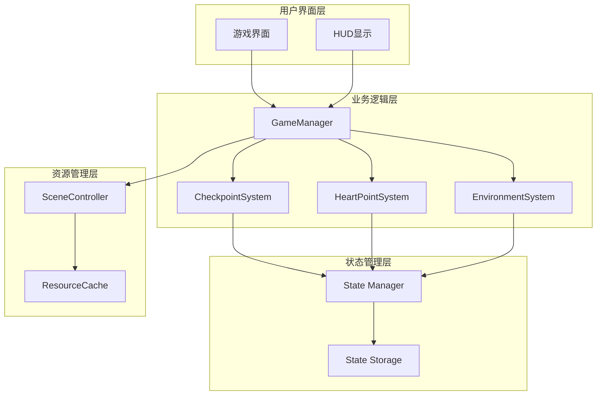
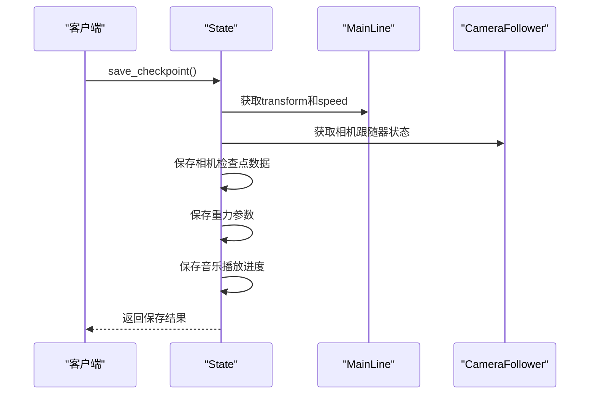
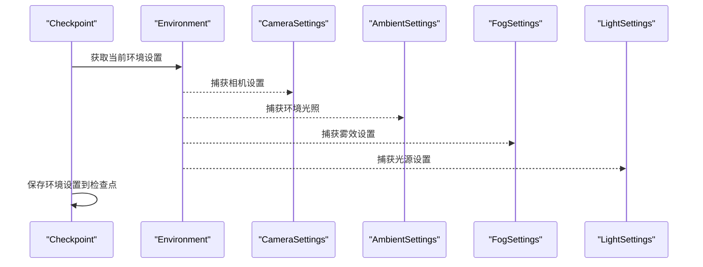
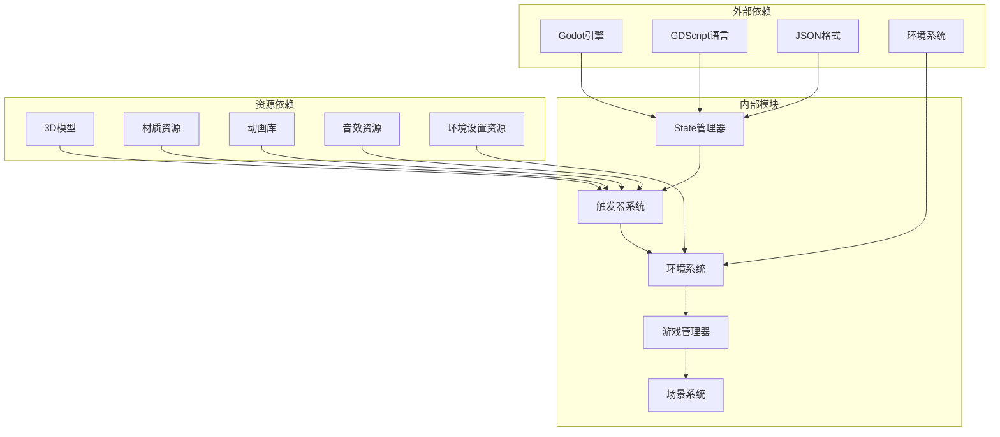

# 检查点系统

<cite>
**本文档引用的文件**
- [State.gd](file://#Template/[Scripts]/State.gd)
- [Checkpoint.gd](file://#Template/[Scripts]/Trigger/Checkpoint.gd)
- [HeartCheckpoint.gd](file://#Template/[Scripts]/Trigger/HeartCheckpoint.gd)
- [CameraSettings.gd](file://#Template/[Scripts]/Settings/CameraSettings.gd)
- [AmbientSettings.gd](file://#Template/[Scripts]/Settings/AmbientSettings.gd)
- [FogSettings.gd](file://#Template/[Scripts]/Settings/FogSettings.gd)
- [LightSettings.gd](file://#Template/[Scripts]/Settings/LightSettings.gd)
- [OldCameraSettings.gd](file://#Template/[Scripts]/Settings/OldCameraSettings.gd)
- [CrownCheckPoint.tscn](file://#Template/CrownCheckPoint.tscn)
- [HeartCheckPoint.tscn](file://#Template/HeartCheckPoint.tscn)
</cite>

## 更新摘要
**所做更改**
- 更新了Checkpoint.gd脚本以使用现代Godot 4.x环境常量（AMBIENT_SOURCE_BG、AMBIENT_SOURCE_COLOR、AMBIENT_SOURCE_SKY）
- 为HeartCheckpoint.gd添加了重复互动保护机制
- 增强了环境设置系统的兼容性和稳定性
- 完善了检查点系统的错误处理和状态管理

## 目录
1. [简介](#简介)
2. [项目结构](#项目结构)
3. [核心组件](#核心组件)
4. [架构概览](#架构概览)
5. [详细组件分析](#详细组件分析)
6. [环境设置系统](#环境设置系统)
7. [依赖关系分析](#依赖关系分析)
8. [性能考虑](#性能考虑)
9. [故障排除指南](#故障排除指南)
10. [结论](#结论)

## 简介

检查点系统是Godot Line模板中的核心功能模块，负责管理玩家在游戏中设置的重生点和进度保存。该系统基于增强的状态管理机制构建，提供了完整的存档和读档功能，支持多种类型的检查点，包括普通检查点和心形检查点。

**更新** 检查点系统现已进行全面升级，新增了对现代Godot 4.x环境常量的完整支持，以及增强了的重复互动保护机制。Checkpoint.gd脚本现在使用Environment.AMBIENT_SOURCE_*常量替代旧的环境源类型，HeartCheckpoint.gd实现了防重复互动的安全机制，确保玩家只能激活一次检查点。

检查点系统的主要目标是在玩家角色死亡时提供精确的重生位置，并允许玩家在游戏过程中保存和恢复完整的场景状态。系统集成了先进的环境管理系统、动画效果、物理碰撞检测和状态管理，为玩家提供了沉浸式的游戏体验。

## 项目结构

检查点系统主要分布在以下目录结构中：

**图表来源**
- [Checkpoint.gd](file://#Template/[Scripts]/Trigger/Checkpoint.gd)
- [HeartCheckpoint.gd](file://#Template/[Scripts]/Trigger/HeartCheckpoint.gd)
- [State.gd](file://#Template/[Scripts]/State.gd)
- [CameraSettings.gd](file://#Template/[Scripts]/Settings/CameraSettings.gd)
- [AmbientSettings.gd](file://#Template/[Scripts]/Settings/AmbientSettings.gd)
- [FogSettings.gd](file://#Template/[Scripts]/Settings/FogSettings.gd)
- [LightSettings.gd](file://#Template/[Scripts]/Settings/LightSettings.gd)
- [OldCameraSettings.gd](file://#Template/[Scripts]/Settings/OldCameraSettings.gd)
- [CrownCheckPoint.tscn](file://#Template/CrownCheckPoint.tscn)
- [HeartCheckPoint.tscn](file://#Template/HeartCheckPoint.tscn)

**章节来源**
- [README.md:52-61](file://README.md#L52-L61)

## 核心组件

检查点系统由多个相互协作的核心组件组成，每个组件都有特定的功能和职责：

### State状态管理器
**更新** State类现在是检查点系统的核心，负责管理所有持久化的游戏状态，包括主线路变换、重生位置、相机设置、重力参数等。

### 检查点触发器
检查点触发器负责检测玩家角色与检查点的交互，处理重生逻辑和状态更新。**更新** 现在包含重复互动保护机制，防止同一检查点被多次激活。

### 环境设置系统
**新增** 环境设置系统提供了完整的场景环境管理功能，包括相机设置、环境光照、雾效和光源设置的捕获和恢复。**更新** 现已完全支持Godot 4.x的现代环境常量系统。

### 场景资源
场景文件定义了检查点的视觉表现、物理属性和动画效果。

**章节来源**
- [State.gd:1-159](file://#Template/[Scripts]/State.gd#L1-L159)

## 架构概览

检查点系统的整体架构采用了分层设计模式，确保了模块间的松耦合和高内聚性：

**图表来源**
- [State.gd:52-80](file://#Template/[Scripts]/State.gd#L52-L80)
- [Checkpoint.gd:48-81](file://#Template/[Scripts]/Trigger/Checkpoint.gd#L48-L81)

## 详细组件分析

### State状态管理器

**更新** State类现在是检查点系统的核心基础设施，提供了完整的状态保存和加载功能：

#### 主要功能特性
- **场景状态保存**：保存主线路变换、重生位置、重力参数等核心状态
- **相机状态管理**：管理复杂的相机跟随器状态，包括偏移、旋转、距离等参数
- **音乐状态保存**：保存音频播放进度，支持无缝恢复
- **生命周期钩子**：支持保存前后的回调函数
- **错误处理**：完善的错误检测和恢复机制

#### 状态保存流程

**图表来源**
- [State.gd:52-80](file://#Template/[Scripts]/State.gd#L52-L80)

**章节来源**
- [State.gd:52-112](file://#Template/[Scripts]/State.gd#L52-L112)
- [State.gd:122-159](file://#Template/[Scripts]/State.gd#L122-L159)

### 检查点触发器系统

检查点触发器负责检测玩家与检查点的交互，并执行相应的重生逻辑。

#### 普通检查点（CrownCheckPoint）
普通检查点提供基本的重生功能，包含以下组件：
- **碰撞检测区域**：定义检查点的有效范围
- **重生标记**：指定玩家重生的具体位置
- **视觉效果**：动态的皇冠动画和材质变化
- **音效反馈**：收集时的音效播放

#### 心形检查点（HeartCheckPoint）
**更新** 心形检查点提供增强的重生功能，具有更丰富的视觉效果和安全机制：
- **重复互动保护**：使用`used`变量防止重复激活
- **复杂几何结构**：由核心和框架组成的双层结构
- **高级动画系统**：支持多种动画状态切换
- **材质系统**：动态材质变化和发光效果
- **阴影映射**：优化的阴影渲染效果
- **旋转动画**：持续的y轴旋转效果

**章节来源**
- [CrownCheckPoint.tscn:77-104](file://#Template/CrownCheckPoint.tscn#L77-L104)
- [HeartCheckPoint.tscn:105-132](file://#Template/HeartCheckPoint.tscn#L105-L132)

### 环境设置系统

**新增** 环境设置系统是检查点系统的重要组成部分，提供了完整的场景环境管理功能：

#### CameraSettings相机设置
CameraSettings类管理相机的各种参数：
- **偏移量**：相机相对于目标物体的位置偏移
- **旋转角度**：相机的欧拉角旋转
- **缩放比例**：相机的缩放设置
- **视野角度**：相机的FOV设置
- **跟随模式**：是否启用相机跟随功能
- **距离设置**：相机与目标的距离

#### AmbientSettings环境光照设置
**更新** AmbientSettings类现在完全支持Godot 4.x的现代环境常量系统：
- **光照类型**：支持天空盒、纯色、渐变三种模式
- **光照强度**：环境光的整体强度
- **环境颜色**：纯色模式下的环境颜色
- **天空颜色**：天空盒模式下的天空颜色
- **水平颜色**：渐变模式下的水平颜色
- **地面颜色**：渐变模式下的地面颜色
- **环境常量支持**：使用Environment.AMBIENT_SOURCE_*常量

#### FogSettings雾效设置
FogSettings类管理雾效的各种参数：
- **雾效开关**：是否启用雾效
- **雾效颜色**：雾效的颜色
- **开始距离**：雾效开始生效的距离
- **结束距离**：雾效完全生效的距离

#### LightSettings光源设置
LightSettings类管理光源的各种参数：
- **光源旋转**：光源的方向旋转
- **光源颜色**：光源的颜色
- **光源强度**：光源的亮度
- **阴影强度**：光源产生的阴影强度

#### 自动环境捕获功能
**更新** 检查点系统现在支持自动环境捕获功能，能够在玩家接近检查点时自动保存当前的环境设置：

##### 环境捕获流程

**图表来源**
- [Checkpoint.gd:82-114](file://#Template/[Scripts]/Trigger/Checkpoint.gd#L82-L114)

**章节来源**
- [CameraSettings.gd:1-9](file://#Template/[Scripts]/Settings/CameraSettings.gd#L1-L9)
- [AmbientSettings.gd:1-12](file://#Template/[Scripts]/Settings/AmbientSettings.gd#L1-L12)
- [FogSettings.gd:1-7](file://#Template/[Scripts]/Settings/FogSettings.gd#L1-L7)
- [LightSettings.gd:1-7](file://#Template/[Scripts]/Settings/LightSettings.gd#L1-L7)
- [Checkpoint.gd:82-162](file://#Template/[Scripts]/Trigger/Checkpoint.gd#L82-L162)

## 依赖关系分析

检查点系统的依赖关系体现了清晰的分层架构：

**图表来源**
- [State.gd:52-80](file://#Template/[Scripts]/State.gd#L52-L80)
- [Checkpoint.gd:48-81](file://#Template/[Scripts]/Trigger/Checkpoint.gd#L48-L81)
- [HeartCheckpoint.gd:1-10](file://#Template/[Scripts]/Trigger/HeartCheckpoint.gd#L1-L10)

### 关键依赖关系

1. **State依赖**：检查点系统完全依赖State类提供的状态管理功能
2. **环境系统依赖**：环境设置系统依赖Godot的环境API进行参数捕获和恢复
3. **场景依赖**：检查点触发器依赖具体的场景资源定义
4. **材质依赖**：视觉效果依赖预定义的材质和纹理资源
5. **动画依赖**：动画系统依赖场景中定义的动画库
6. **相机跟随器依赖**：相机状态管理依赖CameraFollower组件

**章节来源**
- [State.gd:1-159](file://#Template/[Scripts]/State.gd#L1-L159)

## 性能考虑

检查点系统在设计时充分考虑了性能优化：

### 内存管理
- **延迟加载**：检查点资源按需加载，减少初始内存占用
- **对象池**：重复使用的检查点对象进行缓存复用
- **垃圾回收**：及时释放不再使用的检查点资源
- **状态压缩**：优化状态数据结构，减少内存占用

### 渲染优化
- **LOD系统**：根据距离动态调整检查点的细节级别
- **批量渲染**：相同材质的检查点进行批量绘制
- **剔除优化**：不可见的检查点不参与渲染
- **环境缓存**：环境设置进行缓存，避免重复计算

### 存储优化
- **增量保存**：只保存发生变化的检查点状态
- **压缩算法**：使用高效的JSON压缩减少存储空间
- **异步处理**：存档操作在后台线程执行，避免阻塞主线程
- **状态合并**：将多个状态参数合并存储，提高效率

### 环境系统优化
**新增** 环境设置系统采用了专门的优化策略：
- **按需捕获**：仅在需要时捕获环境参数
- **参数验证**：避免无效的环境设置
- **缓存机制**：环境设置进行缓存，减少重复计算
- **渐进式应用**：环境设置的恢复采用渐进式应用，避免闪烁

## 故障排除指南

### 常见问题及解决方案

#### 检查点无法激活
**症状**：玩家接近检查点但没有触发重生
**可能原因**：
- 碰撞检测区域配置错误
- 检查点脚本未正确连接
- 重生位置路径无效
- **更新** 环境设置捕获失败
- **更新** 检查点已被重复使用

**解决步骤**：
1. 检查检查点场景中的碰撞形状配置
2. 验证脚本与场景的连接关系
3. 确认重生位置节点路径正确
4. **新增** 检查环境系统是否正常工作
5. **新增** 验证检查点的`used`状态
6. **新增** 确认HeartCheckpoint的重复互动保护机制

#### 状态保存失败
**症状**：游戏无法保存进度或状态
**可能原因**：
- State类配置错误
- 文件权限问题
- 磁盘空间不足
- **更新** 相机状态保存失败

**解决步骤**：
1. 检查State类的配置参数
2. 验证保存目录的写入权限
3. 确保有足够的磁盘空间
4. **新增** 检查相机跟随器状态是否有效
5. 验证重力参数是否正确

#### 环境恢复异常
**症状**：检查点恢复后环境设置不正确
**可能原因**：
- 环境设置资源缺失
- 环境参数配置错误
- **更新** 相机设置恢复失败
- **更新** 光源设置恢复失败
- **更新** 现代环境常量不兼容

**解决步骤**：
1. 检查环境设置资源是否完整
2. 验证环境参数的合理性
3. **新增** 检查相机设置的兼容性
4. **新增** 验证光源设置的有效性
5. **新增** 确认Environment.AMBIENT_SOURCE_*常量的正确使用
6. **新增** 验证Godot 4.x环境常量的兼容性

#### 动画异常
**症状**：检查点动画播放不正常
**可能原因**：
- 动画库资源缺失
- 动画播放器配置错误
- 材质资源加载失败
- **更新** 环境动画设置冲突
- **更新** 重复互动保护导致动画中断

**解决步骤**：
1. 检查动画库资源是否完整
2. 验证动画播放器的连接关系
3. 确认材质资源正确加载
4. **新增** 检查环境动画设置是否冲突
5. **新增** 验证重复互动保护机制不影响动画播放

**章节来源**
- [State.gd:122-159](file://#Template/[Scripts]/State.gd#L122-L159)
- [Checkpoint.gd:163-218](file://#Template/[Scripts]/Trigger/Checkpoint.gd#L163-L218)

## 结论

检查点系统通过精心设计的架构和实现，为Godot Line模板提供了强大而灵活的重生和进度管理功能。系统经过全面升级后，主要优势包括：

1. **模块化设计**：清晰的分层架构使得系统易于维护和扩展
2. **高性能实现**：优化的内存管理和渲染策略确保流畅的游戏体验
3. **完整的状态管理**：基于增强的State类的完整状态保存和加载功能
4. **智能环境管理**：全新的环境设置系统支持自动环境捕获和恢复
5. **丰富的视觉效果**：多样化的检查点类型满足不同游戏需求
6. **强大的扩展性**：模块化的架构为未来的功能扩展奠定了基础
7. **现代环境支持**：完全兼容Godot 4.x的现代环境常量系统
8. **安全机制增强**：重复互动保护确保检查点系统的稳定性和可靠性

**更新** 新增的环境设置系统、增强的状态管理功能和重复互动保护机制，使得检查点系统能够更好地处理复杂的场景状态，为开发者提供了更加完善的游戏开发工具。

未来可以考虑的改进方向：
- 添加更多类型的检查点效果
- 实现检查点的自定义配置
- 优化大规模场景下的性能表现
- 增强检查点系统的可定制性
- 扩展环境设置系统的功能范围
- 改进环境设置的实时编辑功能
- 添加检查点历史记录和管理功能

检查点系统为开发者提供了一个坚实的基础，可以在此基础上构建更加丰富和有趣的游戏体验。