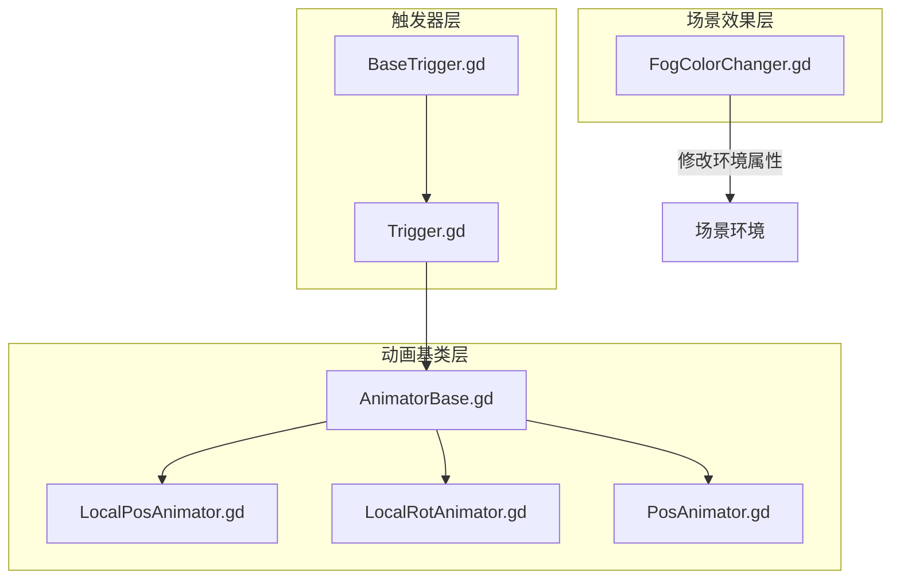
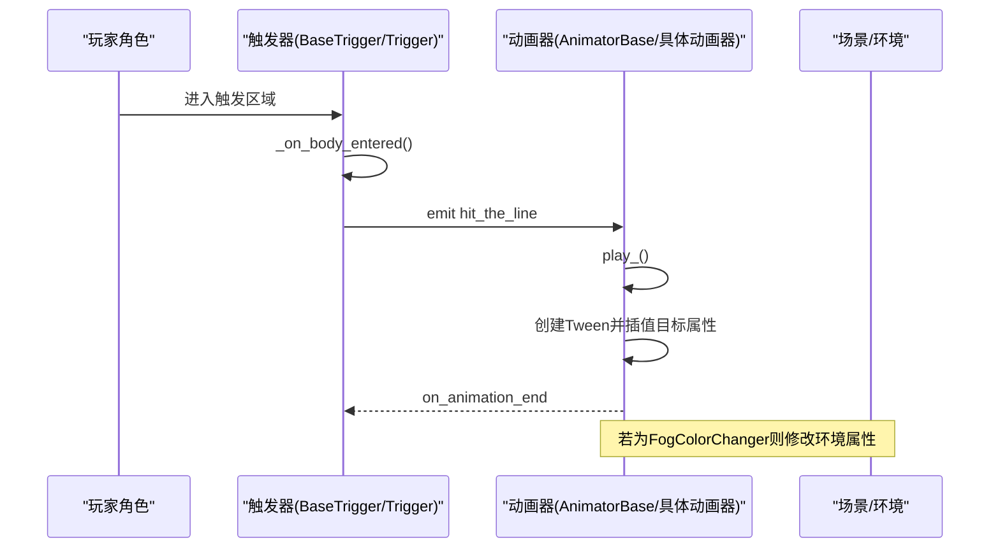
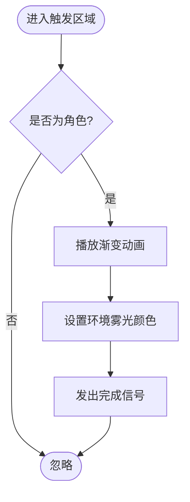
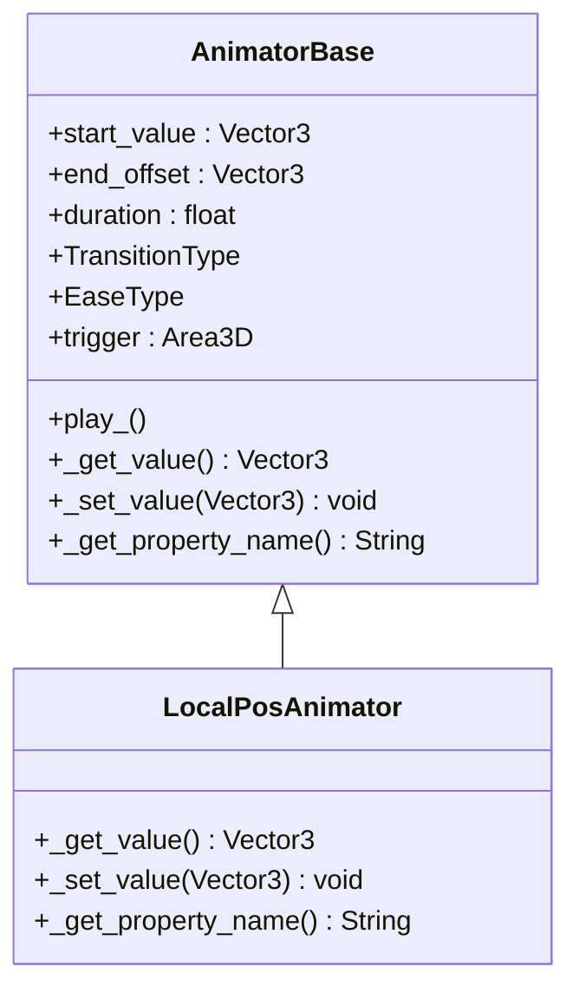
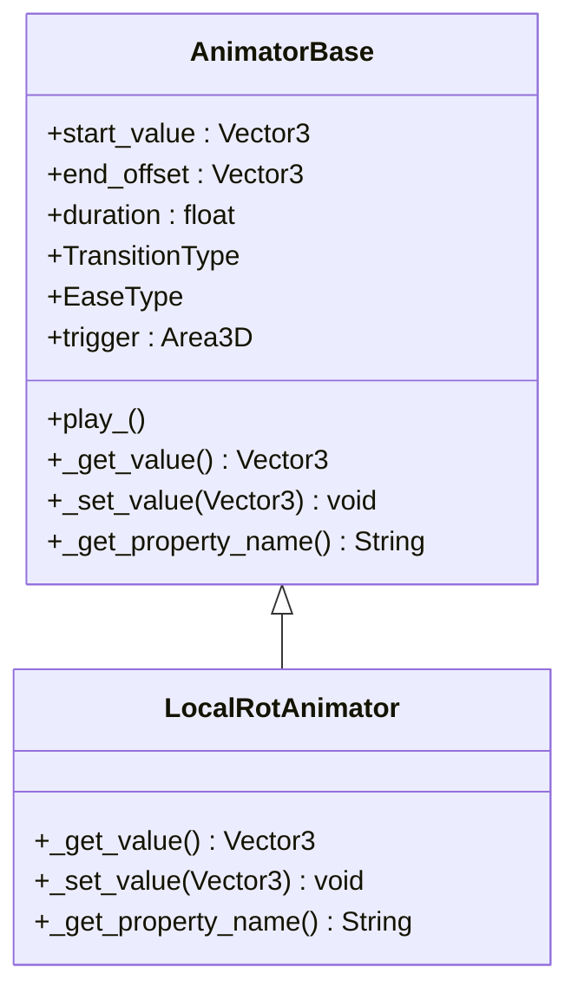
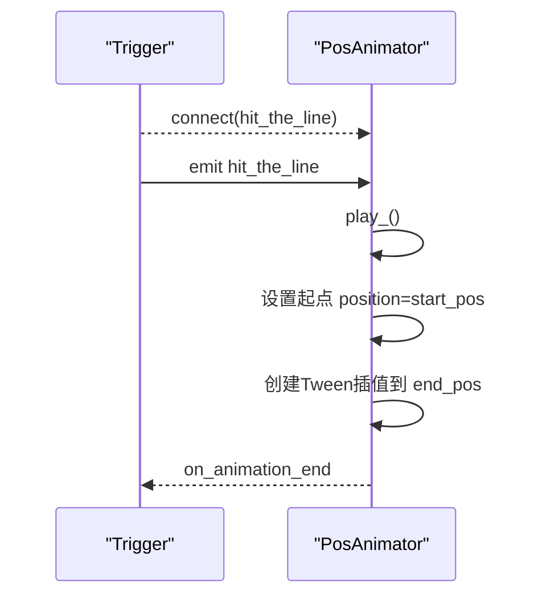
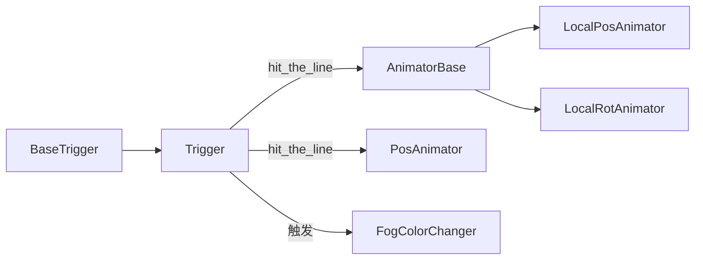
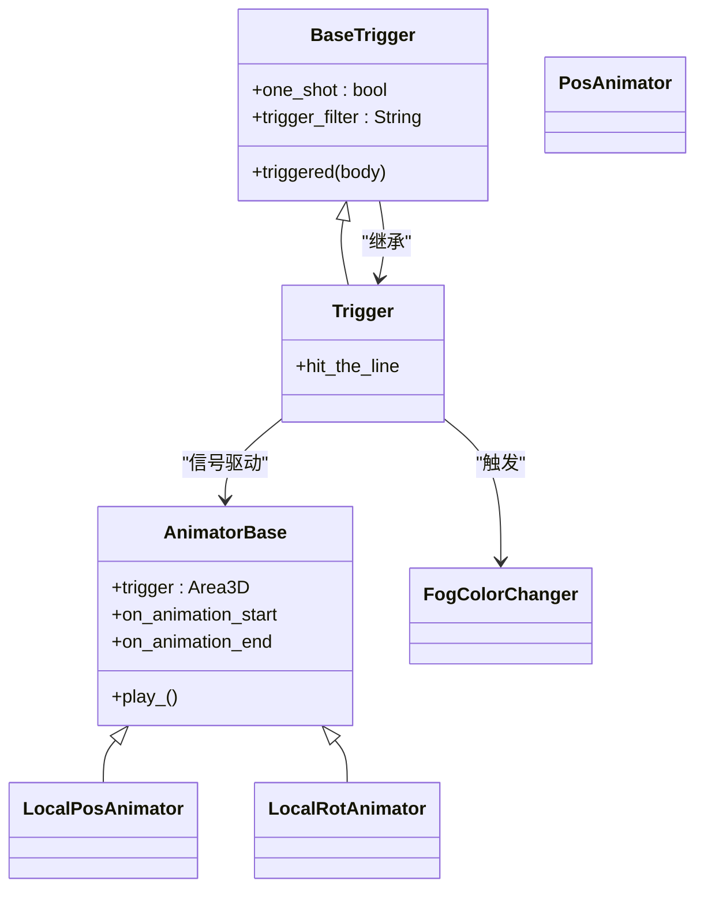

# 特殊效果触发器

<cite>
**本文引用的文件**
- [FogColorChanger.gd](file://#Template/[Scripts]/Trigger/FogColorChanger.gd)
- [LocalPosAnimator.gd](file://#Template/[Scripts]/Trigger/LocalPosAnimator.gd)
- [LocalRotAnimator.gd](file://#Template/[Scripts]/Trigger/LocalRotAnimator.gd)
- [PosAnimator.gd](file://#Template/[Scripts]/Trigger/PosAnimator.gd)
- [AnimatorBase.gd](file://#Template/[Scripts]/AnimBase.gd)
- [BaseTrigger.gd](file://#Template/[Scripts]/Trigger/BaseTrigger.gd)
- [Trigger.gd](file://#Template/[Scripts]/Trigger/Trigger.gd)
</cite>

## 目录
1. [简介](#简介)
2. [项目结构](#项目结构)
3. [核心组件](#核心组件)
4. [架构总览](#架构总览)
5. [详细组件分析](#详细组件分析)
6. [依赖关系分析](#依赖关系分析)
7. [性能考量](#性能考量)
8. [故障排查指南](#故障排查指南)
9. [结论](#结论)
10. [附录](#附录)

## 简介
本文件系统性梳理并解释项目中的“特殊效果触发器”体系，重点覆盖以下组件：
- FogColorChanger：基于环境雾光颜色的渐变过渡，用于营造场景氛围变化
- LocalPosAnimator：对节点进行局部位置动画（基于自身坐标系）
- LocalRotAnimator：对节点进行局部旋转动画（基于自身坐标系）
- PosAnimator：对节点进行全局位置动画（世界坐标系）

这些组件通过统一的触发器框架与动画基类协作，实现可配置、可复用且易于编辑器调试的动画与环境效果。

## 项目结构
围绕“触发器与动画”的核心目录与文件如下：
- 触发器基类与通用触发器
  - BaseTrigger.gd：统一的触发逻辑、过滤器、一次性触发与信号分发
  - Trigger.gd：发射通用触发信号的触发器
- 动画基类与具体动画器
  - AnimatorBase.gd：抽象动画器基类，提供起始值/结束偏移、时长、缓动类型、触发器连接、播放流程
  - LocalPosAnimator.gd：局部位置动画器
  - LocalRotAnimator.gd：局部旋转动画器
  - PosAnimator.gd：全局位置动画器
- 场景级环境效果
  - FogColorChanger.gd：对相机环境的雾光颜色进行渐变

**图表来源**
- [BaseTrigger.gd:1-102](file://#Template/[Scripts]/Trigger/BaseTrigger.gd#L1-L102)
- [Trigger.gd:1-10](file://#Template/[Scripts]/Trigger/Trigger.gd#L1-L10)
- [AnimatorBase.gd:1-82](file://#Template/[Scripts]/AnimBase.gd#L1-L82)
- [LocalPosAnimator.gd:1-13](file://#Template/[Scripts]/Trigger/LocalPosAnimator.gd#L1-L13)
- [LocalRotAnimator.gd:1-13](file://#Template/[Scripts]/Trigger/LocalRotAnimator.gd#L1-L13)
- [PosAnimator.gd:1-44](file://#Template/[Scripts]/Trigger/PosAnimator.gd#L1-L44)
- [FogColorChanger.gd:1-25](file://#Template/[Scripts]/Trigger/FogColorChanger.gd#L1-L25)

**章节来源**
- [BaseTrigger.gd:1-102](file://#Template/[Scripts]/Trigger/BaseTrigger.gd#L1-L102)
- [Trigger.gd:1-10](file://#Template/[Scripts]/Trigger/Trigger.gd#L1-L10)
- [AnimatorBase.gd:1-82](file://#Template/[Scripts]/AnimBase.gd#L1-L82)
- [LocalPosAnimator.gd:1-13](file://#Template/[Scripts]/Trigger/LocalPosAnimator.gd#L1-L13)
- [LocalRotAnimator.gd:1-13](file://#Template/[Scripts]/Trigger/LocalRotAnimator.gd#L1-L13)
- [PosAnimator.gd:1-44](file://#Template/[Scripts]/Trigger/PosAnimator.gd#L1-L44)
- [FogColorChanger.gd:1-25](file://#Template/[Scripts]/Trigger/FogColorChanger.gd#L1-L25)

## 核心组件
- 触发器基类 BaseTrigger
  - 提供统一的触发入口、过滤器（角色/物理体/任意）、一次性触发(one-shot)、调试开关
  - 将“进入触发区”事件转换为子类可覆写的触发处理
- 通用触发器 Trigger
  - 发射 hit_the_line 信号，供其他节点订阅以驱动动画器
- 动画基类 AnimatorBase
  - 统一管理起始值、结束偏移、时长、缓动类型、触发器连接
  - 在编辑器模式下支持“设置起点/终点偏移/播放”工具按钮
  - 使用 Tween 实现平滑插值，并在回调中复位编辑器状态
- 局部动画器
  - LocalPosAnimator：对 position 执行局部空间动画
  - LocalRotAnimator：对 rotation_degrees 执行局部空间动画
- 全局动画器
  - PosAnimator：对 position 执行世界空间动画（直接修改节点位置）
- 环境效果
  - FogColorChanger：对场景相机环境的 fog_light_color 进行颜色渐变

**章节来源**
- [BaseTrigger.gd:1-102](file://#Template/[Scripts]/Trigger/BaseTrigger.gd#L1-L102)
- [Trigger.gd:1-10](file://#Template/[Scripts]/Trigger/Trigger.gd#L1-L10)
- [AnimatorBase.gd:1-82](file://#Template/[Scripts]/AnimBase.gd#L1-L82)
- [LocalPosAnimator.gd:1-13](file://#Template/[Scripts]/Trigger/LocalPosAnimator.gd#L1-L13)
- [LocalRotAnimator.gd:1-13](file://#Template/[Scripts]/Trigger/LocalRotAnimator.gd#L1-L13)
- [PosAnimator.gd:1-44](file://#Template/[Scripts]/Trigger/PosAnimator.gd#L1-L44)
- [FogColorChanger.gd:1-25](file://#Template/[Scripts]/Trigger/FogColorChanger.gd#L1-L25)

## 架构总览
整体采用“触发器-动画器-场景效果”的分层设计：
- 触发器层负责事件捕获与信号发射
- 动画器层负责对节点属性或环境属性进行插值动画
- 场景效果层负责对环境参数（如雾光颜色）进行修改

**图表来源**
- [BaseTrigger.gd:54-72](file://#Template/[Scripts]/Trigger/BaseTrigger.gd#L54-L72)
- [Trigger.gd:8-9](file://#Template/[Scripts]/Trigger/Trigger.gd#L8-L9)
- [AnimatorBase.gd:55-71](file://#Template/[Scripts]/AnimBase.gd#L55-L71)
- [FogColorChanger.gd:22-24](file://#Template/[Scripts]/Trigger/FogColorChanger.gd#L22-L24)

## 详细组件分析

### FogColorChanger（雾色变化）
- 作用：在触发后对场景相机环境的 fog_light_color 进行颜色渐变
- 关键点
  - 参数：目标颜色、动画时长、缓动类型
  - 触发方式：当 CharacterBody3D 进入触发区域时自动播放
  - 动画实现：使用 Tween 对环境属性执行插值，并在回调中发出完成信号
- 使用建议
  - 适合用于场景氛围切换、情绪渲染、阶段性事件提示
  - 建议与 Trigger 配合，确保仅在特定区域生效

**图表来源**
- [FogColorChanger.gd:13-24](file://#Template/[Scripts]/Trigger/FogColorChanger.gd#L13-L24)

**章节来源**
- [FogColorChanger.gd:1-25](file://#Template/[Scripts]/Trigger/FogColorChanger.gd#L1-L25)

### LocalPosAnimator（局部位置动画）
- 作用：对节点的 position（局部坐标）进行动画插值
- 关键点
  - 继承自 AnimatorBase，重写 _get_value/_set_value/_get_property_name
  - 在编辑器中可通过工具按钮设置起点与终点偏移
  - 运行时根据 duration、TransitionType、EaseType 执行插值
- 使用建议
  - 适用于需要保持父节点变换不变的局部移动
  - 可与 Trigger 协作，在特定时机播放

**图表来源**
- [AnimatorBase.gd:1-82](file://#Template/[Scripts]/AnimBase.gd#L1-L82)
- [LocalPosAnimator.gd:1-13](file://#Template/[Scripts]/Trigger/LocalPosAnimator.gd#L1-L13)

**章节来源**
- [LocalPosAnimator.gd:1-13](file://#Template/[Scripts]/Trigger/LocalPosAnimator.gd#L1-L13)
- [AnimatorBase.gd:1-82](file://#Template/[Scripts]/AnimBase.gd#L1-L82)

### LocalRotAnimator（局部旋转动画）
- 作用：对节点的 rotation_degrees（局部欧拉角）进行动画插值
- 关键点
  - 与 LocalPosAnimator 类似，但操作的是旋转属性
  - 支持编辑器下的起点/终点设置与播放
- 使用建议
  - 适合局部翻转、摆动、开合等旋转效果
  - 注意欧拉角连续性与万向节锁问题，必要时考虑使用四元数插值（若扩展）

**图表来源**
- [AnimatorBase.gd:1-82](file://#Template/[Scripts]/AnimBase.gd#L1-L82)
- [LocalRotAnimator.gd:1-13](file://#Template/[Scripts]/Trigger/LocalRotAnimator.gd#L1-L13)

**章节来源**
- [LocalRotAnimator.gd:1-13](file://#Template/[Scripts]/Trigger/LocalRotAnimator.gd#L1-L13)
- [AnimatorBase.gd:1-82](file://#Template/[Scripts]/AnimBase.gd#L1-L82)

### PosAnimator（位置动画）
- 作用：对节点 position（全局坐标）进行动画插值
- 关键点
  - 直接修改节点 position，不继承 AnimatorBase
  - 提供编辑器工具按钮用于采集起点/终点与回放
  - 通过 Trigger 的 hit_the_line 信号驱动播放
- 使用建议
  - 适合需要跨越多层级父节点的全局移动
  - 注意与父节点变换叠加导致的视觉差异

**图表来源**
- [PosAnimator.gd:27-37](file://#Template/[Scripts]/Trigger/PosAnimator.gd#L27-L37)
- [Trigger.gd:8-9](file://#Template/[Scripts]/Trigger/Trigger.gd#L8-L9)

**章节来源**
- [PosAnimator.gd:1-44](file://#Template/[Scripts]/Trigger/PosAnimator.gd#L1-L44)
- [Trigger.gd:1-10](file://#Template/[Scripts]/Trigger/Trigger.gd#L1-L10)

### 触发器与动画器协作
- BaseTrigger 提供统一的触发入口与过滤逻辑
- Trigger 发出 hit_the_line 信号
- AnimatorBase 订阅该信号并执行动画
- FogColorChanger 不依赖 AnimatorBase，而是直接对场景环境进行修改

**图表来源**
- [BaseTrigger.gd:1-102](file://#Template/[Scripts]/Trigger/BaseTrigger.gd#L1-L102)
- [Trigger.gd:1-10](file://#Template/[Scripts]/Trigger/Trigger.gd#L1-L10)
- [AnimatorBase.gd:1-82](file://#Template/[Scripts]/AnimBase.gd#L1-L82)
- [LocalPosAnimator.gd:1-13](file://#Template/[Scripts]/Trigger/LocalPosAnimator.gd#L1-L13)
- [LocalRotAnimator.gd:1-13](file://#Template/[Scripts]/Trigger/LocalRotAnimator.gd#L1-L13)
- [PosAnimator.gd:1-44](file://#Template/[Scripts]/Trigger/PosAnimator.gd#L1-L44)
- [FogColorChanger.gd:1-25](file://#Template/[Scripts]/Trigger/FogColorChanger.gd#L1-L25)

## 依赖关系分析
- 继承关系
  - LocalPosAnimator、LocalRotAnimator 继承自 AnimatorBase
  - Trigger 继承自 BaseTrigger
- 信号依赖
  - AnimatorBase 通过 trigger 的 hit_the_line 信号驱动播放
  - Trigger 将触发事件转化为 hit_the_line 信号
  - 各动画器在播放完成后发出 on_animation_end
- 外部依赖
  - FogColorChanger 依赖场景相机的环境属性（fog_light_color）
  - 所有动画器依赖 Tween 插值

**图表来源**
- [BaseTrigger.gd:1-102](file://#Template/[Scripts]/Trigger/BaseTrigger.gd#L1-L102)
- [Trigger.gd:1-10](file://#Template/[Scripts]/Trigger/Trigger.gd#L1-L10)
- [AnimatorBase.gd:1-82](file://#Template/[Scripts]/AnimBase.gd#L1-L82)
- [LocalPosAnimator.gd:1-13](file://#Template/[Scripts]/Trigger/LocalPosAnimator.gd#L1-L13)
- [LocalRotAnimator.gd:1-13](file://#Template/[Scripts]/Trigger/LocalRotAnimator.gd#L1-L13)
- [PosAnimator.gd:1-44](file://#Template/[Scripts]/Trigger/PosAnimator.gd#L1-L44)
- [FogColorChanger.gd:1-25](file://#Template/[Scripts]/Trigger/FogColorChanger.gd#L1-L25)

**章节来源**
- [BaseTrigger.gd:1-102](file://#Template/[Scripts]/Trigger/BaseTrigger.gd#L1-L102)
- [Trigger.gd:1-10](file://#Template/[Scripts]/Trigger/Trigger.gd#L1-L10)
- [AnimatorBase.gd:1-82](file://#Template/[Scripts]/AnimBase.gd#L1-L82)
- [LocalPosAnimator.gd:1-13](file://#Template/[Scripts]/Trigger/LocalPosAnimator.gd#L1-L13)
- [LocalRotAnimator.gd:1-13](file://#Template/[Scripts]/Trigger/LocalRotAnimator.gd#L1-L13)
- [PosAnimator.gd:1-44](file://#Template/[Scripts]/Trigger/PosAnimator.gd#L1-L44)
- [FogColorChanger.gd:1-25](file://#Template/[Scripts]/Trigger/FogColorChanger.gd#L1-L25)

## 性能考量
- 动画数量与插值复杂度
  - 同时播放多个动画器会增加插值计算量，建议按需启用与合并
- 缓动与时长
  - 过短的时长与复杂的缓动会增加 CPU/GPU 压力，应结合实际帧率权衡
- 触发频率
  - one_shot 与合理的触发区域尺寸可避免重复触发带来的抖动
- 环境修改
  - FogColorChanger 修改环境属性通常成本较低，但仍建议避免频繁切换
- 编辑器模式
  - 动画器在编辑器下会复位到起始状态，避免运行时状态污染

[本节为通用指导，无需列出章节来源]

## 故障排查指南
- 动画未播放
  - 检查触发器是否正确连接 hit_the_line 信号
  - 确认触发过滤器与进入对象类型匹配
  - 查看 on_animation_start/on_animation_end 信号是否正常发出
- 动画卡住或重复播放
  - one_shot 模式下需手动 reset 或更换区域
  - 检查 _is_playing 标志与播放流程
- 环境颜色无变化
  - 确认场景存在有效相机与环境资源
  - 检查 fog_light_color 是否被其他逻辑覆盖
- 局部/全局动画差异
  - LocalPosAnimator/LocalRotAnimator 与 PosAnimator 的坐标系不同，注意变换叠加

**章节来源**
- [BaseTrigger.gd:54-72](file://#Template/[Scripts]/Trigger/BaseTrigger.gd#L54-L72)
- [AnimatorBase.gd:55-71](file://#Template/[Scripts]/AnimBase.gd#L55-L71)
- [PosAnimator.gd:27-37](file://#Template/[Scripts]/Trigger/PosAnimator.gd#L27-L37)
- [FogColorChanger.gd:17-24](file://#Template/[Scripts]/Trigger/FogColorChanger.gd#L17-L24)

## 结论
本套“特殊效果触发器”体系通过清晰的层次化设计与统一的触发/动画协议，实现了从环境氛围到物体变换的多样化视觉效果。开发者可基于 AnimatorBase 快速扩展新的局部动画器，或结合 Trigger 与 BaseTrigger 构建复杂的触发序列；同时，FogColorChanger 提供了低成本的场景氛围切换能力。建议在实际项目中遵循参数化与可编辑原则，配合 one_shot 与调试开关提升迭代效率。

[本节为总结性内容，无需列出章节来源]

## 附录

### 参数与配置清单
- AnimatorBase（通用动画器基类）
  - start_value：起始值（Vector3）
  - end_offset：结束偏移（Vector3）
  - duration：动画时长（秒）
  - TransitionType：缓动类型（Tween.TransitionType）
  - EaseType：缓动方向（Tween.EaseType）
  - trigger：触发器（Area3D）
- LocalPosAnimator
  - 操作属性：position（局部）
- LocalRotAnimator
  - 操作属性：rotation_degrees（局部）
- PosAnimator
  - start_pos：起始位置（Vector3）
  - end_pos：结束位置（Vector3）
  - duration：动画时长（秒）
  - TransitionType：缓动类型（Tween.TransitionType）
  - trigger：触发器（Area3D）
- FogColorChanger
  - target_fog_color：目标雾光颜色（Color）
  - duration：动画时长（秒）
  - TransitionType：缓动类型（Tween.TransitionType）

**章节来源**
- [AnimatorBase.gd:6-13](file://#Template/[Scripts]/AnimBase.gd#L6-L13)
- [LocalPosAnimator.gd:5-12](file://#Template/[Scripts]/Trigger/LocalPosAnimator.gd#L5-L12)
- [LocalRotAnimator.gd:5-12](file://#Template/[Scripts]/Trigger/LocalRotAnimator.gd#L5-L12)
- [PosAnimator.gd:4-8](file://#Template/[Scripts]/Trigger/PosAnimator.gd#L4-L8)
- [FogColorChanger.gd:4-6](file://#Template/[Scripts]/Trigger/FogColorChanger.gd#L4-L6)

### 使用示例与组合建议
- 环境氛围切换
  - 将 FogColorChanger 放置于关键区域，配合 Trigger 发出 hit_the_line 信号
  - 适合在剧情节点或阶段性事件中使用
- 物体局部动画
  - 使用 LocalPosAnimator/LocalRotAnimator 对门、旗帜、装饰物等进行局部运动
  - 可叠加 one_shot 与调试开关，便于编辑器预览
- 全局位移动画
  - 使用 PosAnimator 对可交互物体进行跨区域移动
  - 注意与父节点变换的关系，必要时在 _ready 中初始化 position
- 组合使用
  - 先通过 Trigger 激活，再由 AnimatorBase 播放局部/全局动画
  - 最后在动画结束后触发环境变化（如 FogColorChanger），形成“事件-动作-氛围”的完整链路

**章节来源**
- [Trigger.gd:8-9](file://#Template/[Scripts]/Trigger/Trigger.gd#L8-L9)
- [AnimatorBase.gd:45-46](file://#Template/[Scripts]/AnimBase.gd#L45-L46)
- [PosAnimator.gd:27-30](file://#Template/[Scripts]/Trigger/PosAnimator.gd#L27-L30)
- [FogColorChanger.gd:17-24](file://#Template/[Scripts]/Trigger/FogColorChanger.gd#L17-L24)