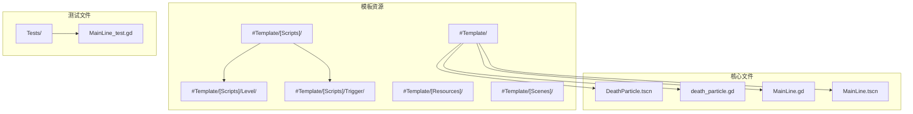
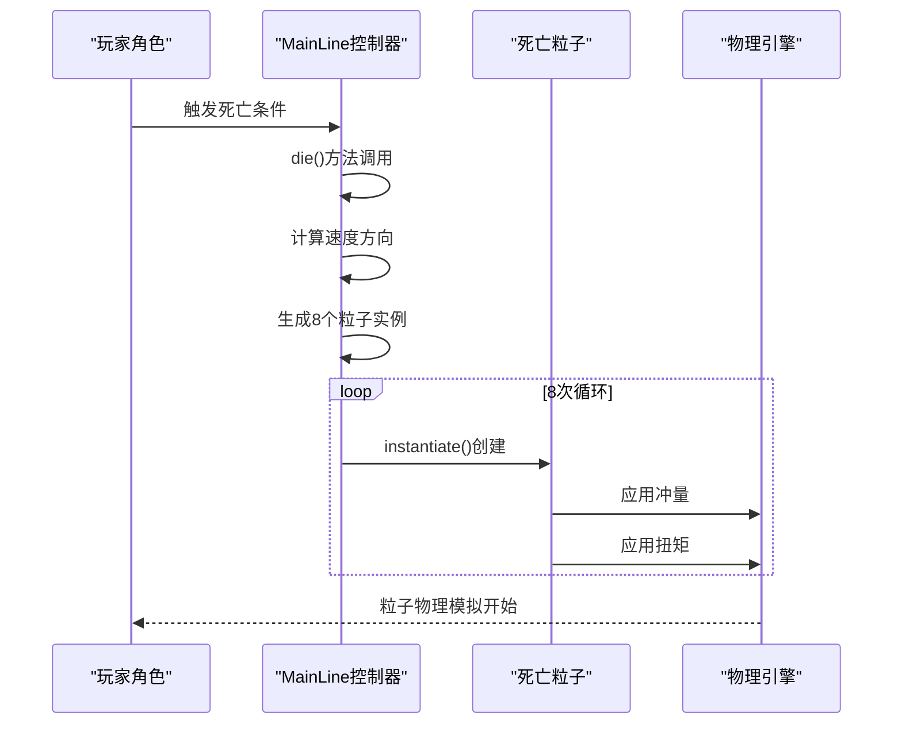
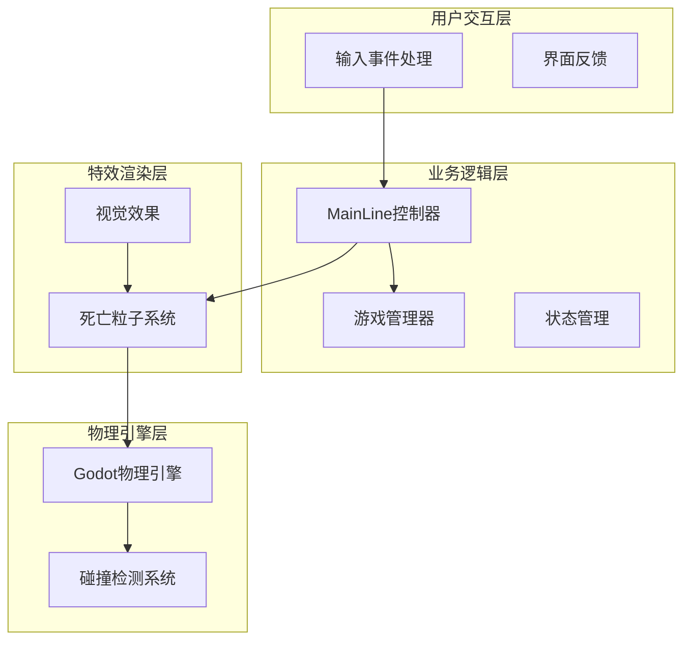
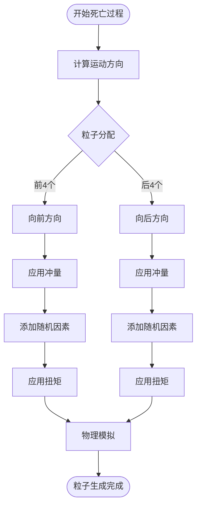
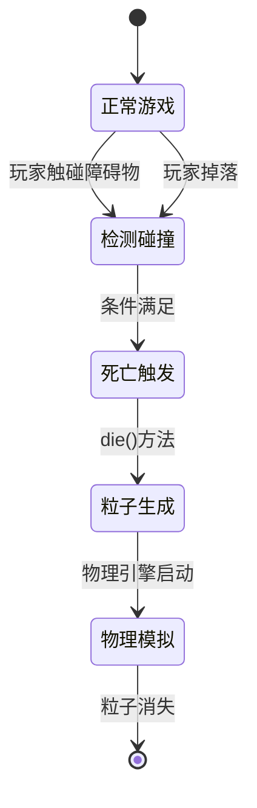
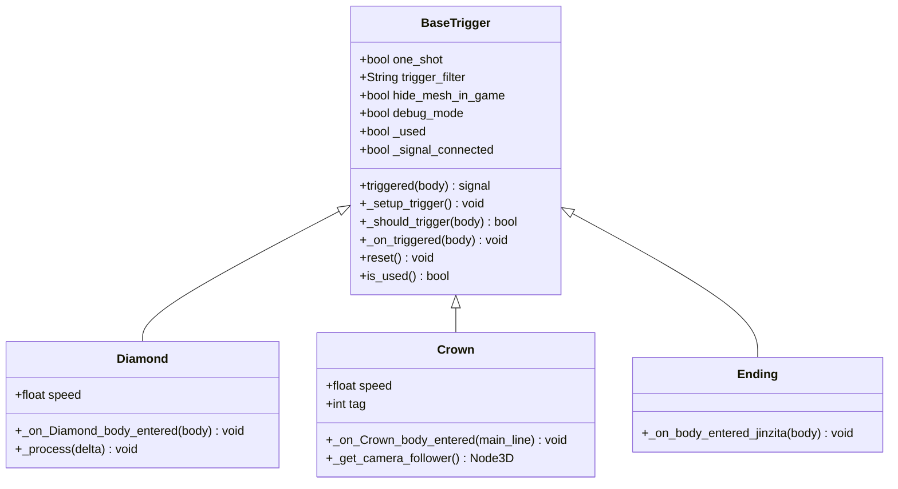
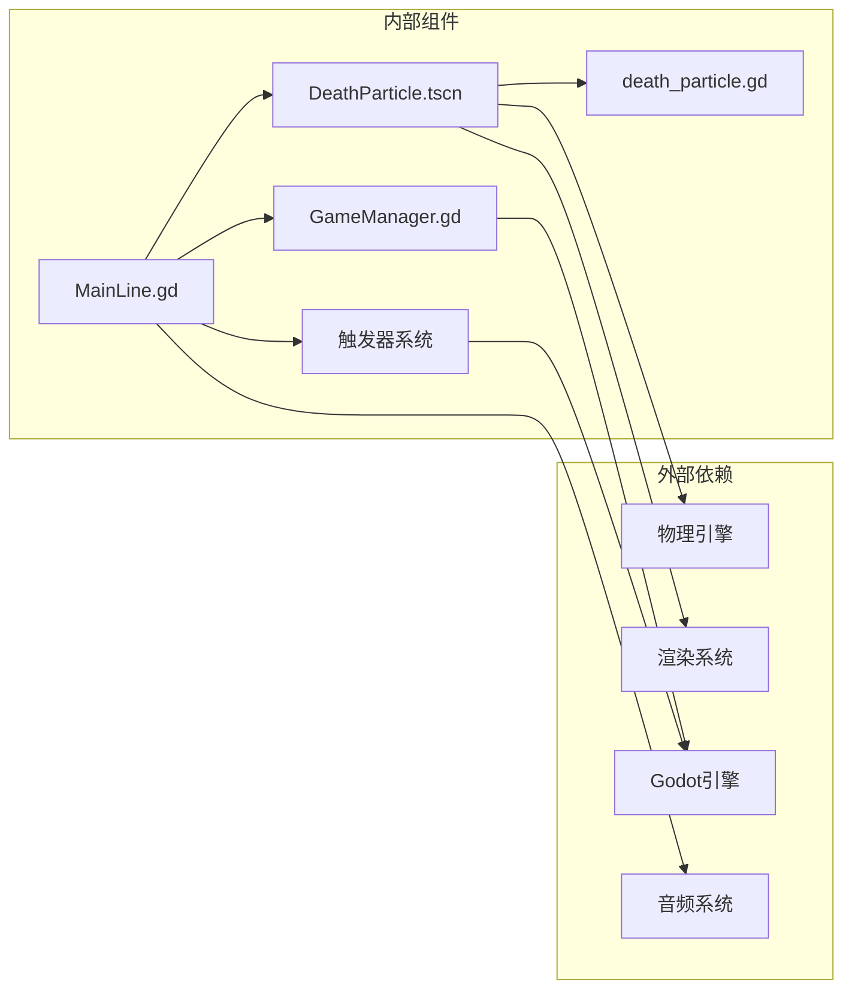
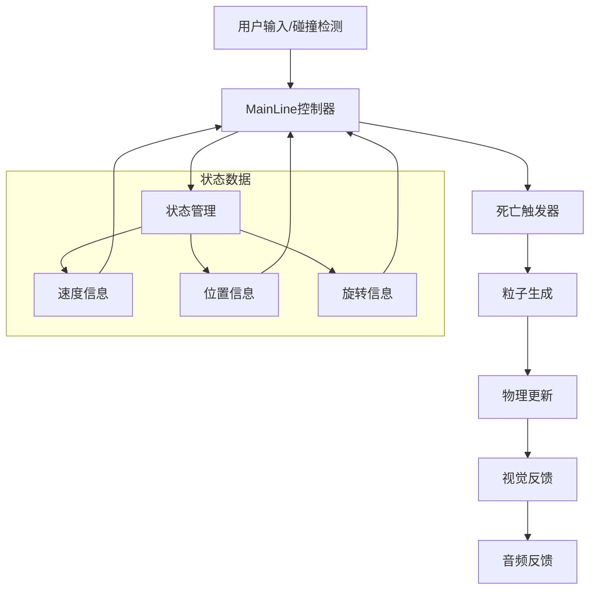

# 死亡粒子系统

<cite>
**本文档引用的文件**
- [death_particle.gd](file://#Template/[Scripts]/Level/death_particle.gd)
- [DeathParticle.tscn](file://#Template/[Resources]/DeathParticle.tscn)
- [MainLine.gd](file://#Template/[Scripts]/Level/MainLine.gd)
- [MainLine.tscn](file://#Template/MainLine.tscn)
- [Diamond.gd](file://#Template/[Scripts]/Trigger/Diamond.gd)
- [Crown.gd](file://#Template/[Scripts]/Trigger/Crown.gd)
- [Ending.gd](file://#Template/[Scripts]/Trigger/Ending.gd)
- [BaseTrigger.gd](file://#Template/[Scripts]/Trigger/BaseTrigger.gd)
- [GameManager.gd](file://#Template/[Scripts]/GameManager.gd)
- [MainLine_test.gd](file://Tests/MainLine_test.gd)
</cite>

## 更新摘要
**所做更改**
- 更新了项目结构以反映DeathParticle资源已移动到[Resources]目录
- 修改了所有相关文件路径引用，确保与新的资源组织结构保持一致
- 更新了架构图和依赖关系分析，反映新的资源定位方式

## 目录
1. [简介](#简介)
2. [项目结构](#项目结构)
3. [核心组件](#核心组件)
4. [架构概览](#架构概览)
5. [详细组件分析](#详细组件分析)
6. [依赖关系分析](#依赖关系分析)
7. [性能考虑](#性能考虑)
8. [故障排除指南](#故障排除指南)
9. [结论](#结论)

## 简介

死亡粒子系统是Godot项目中的一个重要视觉效果组件，负责在玩家角色死亡时产生逼真的粒子爆炸效果。该系统通过物理引擎驱动的刚体粒子，结合随机化的物理参数，创造出动态且富有表现力的死亡动画。

系统的核心设计理念是：
- **物理真实性**：使用RigidBody3D模拟真实的物理行为
- **视觉冲击**：通过随机化参数创造不可预测的视觉效果
- **性能优化**：合理控制粒子数量和生命周期
- **可扩展性**：模块化设计便于后续功能扩展

## 项目结构

项目采用模块化组织方式，死亡粒子系统主要分布在以下目录结构中：

**更新** DeathParticle资源已从模板根目录移动到[Resources]目录，确保了更好的资源组织和访问效率。

**图表来源**
- [DeathParticle.tscn:1-24](file://#Template/[Resources]/DeathParticle.tscn#L1-L24)
- [death_particle.gd:1-4](file://#Template/[Scripts]/Level/death_particle.gd#L1-L4)
- [MainLine.gd:25-26](file://#Template/[Scripts]/Level/MainLine.gd#L25-L26)
- [MainLine.tscn:4-5](file://#Template/MainLine.tscn#L4-L5)

**章节来源**
- [DeathParticle.tscn:1-24](file://#Template/[Resources]/DeathParticle.tscn#L1-L24)
- [death_particle.gd:1-4](file://#Template/[Scripts]/Level/death_particle.gd#L1-L4)
- [MainLine.gd:25-26](file://#Template/[Scripts]/Level/MainLine.gd#L25-L26)
- [MainLine.tscn:4-5](file://#Template/MainLine.tscn#L4-L5)

## 核心组件

### 死亡粒子实体

死亡粒子系统的核心是一个继承自RigidBody3D的物理实体，具有以下关键特性：

| 组件 | 描述 | 物理属性 |
|------|------|----------|
| **刚体物理** | 使用RigidBody3D实现真实物理模拟 | 质量：默认 阻尼：空气阻力 摩擦：0.5 |
| **碰撞检测** | BoxShape3D提供精确的碰撞边界 | 边界盒形状 3D碰撞体积 |
| **视觉渲染** | MeshInstance3D承载3D模型显示 | 可替换的网格 材质覆盖 |

### 主线角色集成

MainLine.gd作为核心角色控制器，实现了完整的死亡粒子触发机制：

**更新** 现在DeathParticle资源位于`res://#Template/[Resources]/DeathParticle.tscn`路径，通过MainLine.tscn场景文件正确引用。

**图表来源**
- [MainLine.gd:220-245](file://#Template/[Scripts]/Level/MainLine.gd#L220-L245)
- [MainLine.tscn:5](file://#Template/MainLine.tscn#L5)

**章节来源**
- [MainLine.gd:220-245](file://#Template/[Scripts]/Level/MainLine.gd#L220-L245)
- [death_particle.gd:1-4](file://#Template/[Scripts]/Level/death_particle.gd#L1-L4)
- [MainLine.tscn:5](file://#Template/MainLine.tscn#L5)

## 架构概览

死亡粒子系统采用分层架构设计，确保各组件职责清晰且相互独立：

**更新** 资源路径现在指向新的[Resources]目录结构，确保了更好的资源管理和访问效率。

**图表来源**
- [MainLine.gd:1-200](file://#Template/[Scripts]/Level/MainLine.gd#L1-L200)
- [GameManager.gd:1-47](file://#Template/[Scripts]/GameManager.gd#L1-L47)
- [MainLine.tscn:5](file://#Template/MainLine.tscn#L5)

系统的关键优势包括：
- **解耦设计**：各组件间依赖关系清晰
- **可测试性**：完整的单元测试覆盖
- **可维护性**：模块化结构便于代码维护
- **性能优化**：合理的资源管理和生命周期控制

## 详细组件分析

### 死亡粒子实体组件

死亡粒子实体是整个系统的核心，基于以下设计原则构建：

#### 物理属性配置

| 属性 | 数值 | 说明 |
|------|------|------|
| **质量** | 默认质量 | 影响粒子对力的响应 |
| **摩擦系数** | 0.5 | 控制与表面的摩擦力 |
| **弹性系数** | 0.5 | 控制碰撞后的反弹程度 |
| **碰撞层** | 2 | 与地面层发生碰撞 |
| **碰撞掩码** | 6 | 接受地面和障碍物碰撞 |

#### 粒子生成算法

系统采用智能的粒子分布策略：

**更新** 现在通过MainLine.tscn场景文件中的ExtResource引用DeathParticle.tscn，确保了正确的资源定位。

**图表来源**
- [MainLine.gd:231-245](file://#Template/[Scripts]/Level/MainLine.gd#L231-L245)
- [MainLine.tscn:5](file://#Template/MainLine.tscn#L5)

#### 随机化参数系统

系统实现了多层次的随机化机制：

| 参数类型 | 范围 | 作用 | 实现方式 |
|----------|------|------|----------|
| **初始位置** | ±0.5单位 | 避免完全重叠 | 随机偏移 |
| **初始旋转** | 0-360度 | 随机朝向 | 欧拉角随机化 |
| **冲量强度** | 0.5-1.5倍速度 | 力度变化 | 速度乘数 |
| **随机冲量** | ±speed | 随机扰动 | 三维随机向量 |
| **扭矩** | ±1.0 | 旋转效果 | 随机扭矩向量 |

**章节来源**
- [MainLine.gd:231-252](file://#Template/[Scripts]/Level/MainLine.gd#L231-L252)
- [DeathParticle.tscn:5-8](file://#Template/[Resources]/DeathParticle.tscn#L5-L8)

### 主线角色控制器集成

MainLine.gd作为核心控制器，实现了完整的死亡粒子触发流程：

#### 死亡检测机制

**更新** 现在通过@export var deathParticle: PackedScene变量直接引用DeathParticle.tscn资源，确保了资源的正确加载和使用。

**图表来源**
- [MainLine.gd:218-245](file://#Template/[Scripts]/Level/MainLine.gd#L218-L245)
- [MainLine.tscn:40](file://#Template/MainLine.tscn#L40)

#### 音效同步机制

系统集成了音效同步功能，确保视觉效果与音频完美配合：

| 音效类型 | 文件名 | 触发时机 | 功能描述 |
|----------|--------|----------|----------|
| **死亡音效** | WaterDie.wav | 玩家死亡瞬间 | 提供听觉反馈 |
| **背景音乐** | Sample.mp3 | 游戏进行时 | 营造氛围 |
| **特殊音效** | crown_get_*.wav | 获得皇冠时 | 标识重要事件 |

**章节来源**
- [MainLine.gd:220-225](file://#Template/[Scripts]/Level/MainLine.gd#L220-L225)
- [MainLine.tscn:4](file://#Template/MainLine.tscn#L4)

### 触发器系统集成

系统与多种触发器组件协同工作，形成完整的交互体验：

#### 基础触发器框架

BaseTrigger.gd提供了统一的触发器接口：

**图表来源**
- [BaseTrigger.gd:1-102](file://#Template/[Scripts]/Trigger/BaseTrigger.gd#L1-L102)
- [Diamond.gd:1-14](file://#Template/[Scripts]/Trigger/Diamond.gd#L1-L14)
- [Crown.gd:1-42](file://#Template/[Scripts]/Trigger/Crown.gd#L1-L42)
- [Ending.gd:1-15](file://#Template/[Scripts]/Trigger/Ending.gd#L1-L15)

**章节来源**
- [BaseTrigger.gd:1-102](file://#Template/[Scripts]/Trigger/BaseTrigger.gd#L1-L102)
- [Diamond.gd:1-14](file://#Template/[Scripts]/Trigger/Diamond.gd#L1-L14)
- [Crown.gd:1-42](file://#Template/[Scripts]/Trigger/Crown.gd#L1-L42)
- [Ending.gd:1-15](file://#Template/[Scripts]/Trigger/Ending.gd#L1-L15)

## 依赖关系分析

### 组件间依赖图

**更新** 现在DeathParticle资源通过MainLine.tscn场景文件中的ExtResource正确引用，路径为`res://#Template/[Resources]/DeathParticle.tscn`。

**图表来源**
- [MainLine.gd:25-26](file://#Template/[Scripts]/Level/MainLine.gd#L25-L26)
- [DeathParticle.tscn:13-17](file://#Template/[Resources]/DeathParticle.tscn#L13-L17)
- [MainLine.tscn:5](file://#Template/MainLine.tscn#L5)

### 数据流分析

系统遵循清晰的数据流向：

**更新** 现在通过MainLine.tscn场景文件中的deathParticle属性直接绑定到DeathParticle.tscn资源，确保了正确的数据流传递。

**图表来源**
- [MainLine.gd:220-245](file://#Template/[Scripts]/Level/MainLine.gd#L220-L245)
- [MainLine.tscn:40](file://#Template/MainLine.tscn#L40)

**章节来源**
- [MainLine.gd:25-26](file://#Template/[Scripts]/Level/MainLine.gd#L25-L26)
- [DeathParticle.tscn:13-17](file://#Template/[Resources]/DeathParticle.tscn#L13-L17)
- [MainLine.tscn:5](file://#Template/MainLine.tscn#L5)

## 性能考虑

### 优化策略

死亡粒子系统采用了多项性能优化措施：

#### 粒子数量控制
- **限制数量**：每次死亡只生成8个粒子，平衡视觉效果与性能
- **生命周期管理**：利用物理引擎自然衰减，无需手动销毁
- **批量创建**：使用instantiate()批量创建，提高效率

#### 内存管理
- **资源复用**：通过预加载DEATH_PARTICLE资源减少内存开销
- **自动回收**：依赖Godot的垃圾回收机制
- **层级管理**：将粒子添加到场景树的合适层级

#### 物理性能
- **简化碰撞**：使用BoxShape3D提供精确但高效的碰撞检测
- **合理质量**：默认质量设置确保物理模拟稳定
- **阻尼控制**：适当的空气阻力避免过度漂移

### 性能监控指标

| 指标类型 | 目标值 | 测量方法 | 优化建议 |
|----------|--------|----------|----------|
| **帧率** | ≥60 FPS | FPS计数器 | 减少粒子数量或简化材质 |
| **内存使用** | <100MB | 内存监控 | 优化纹理大小和材质复杂度 |
| **CPU占用** | <5% | 性能分析器 | 合理调整物理步长 |
| **GPU占用** | <30% | 图形分析器 | 简化粒子着色器 |

**更新** 新的资源组织结构提高了资源加载效率，减少了不必要的文件系统访问。

## 故障排除指南

### 常见问题及解决方案

#### 粒子不显示问题

**症状**：死亡时没有看到粒子效果

**可能原因**：
1. MeshInstance3D未正确设置网格
2. 材质覆盖未正确应用
3. 粒子位置设置错误
4. **新问题**：DeathParticle资源路径配置错误

**解决步骤**：
1. 检查DeathParticle.tscn中的MeshInstance3D配置
2. 验证material_override是否正确设置
3. 确认global_position是否在正确位置
4. **新增**：检查MainLine.tscn中的ExtResource路径`res://#Template/[Resources]/DeathParticle.tscn`

#### 物理模拟异常

**症状**：粒子移动不符合预期

**可能原因**：
1. 冲量计算错误
2. 扭矩应用不当
3. 物理材质设置问题

**解决步骤**：
1. 检查apply_central_impulse的参数
2. 验证apply_torque的随机化逻辑
3. 调整PhysicsMaterial的摩擦和弹性系数

#### 性能问题

**症状**：游戏帧率下降

**可能原因**：
1. 粒子数量过多
2. 物理更新频率过高
3. 材质过于复杂

**解决步骤**：
1. 减少同时存在的粒子数量
2. 优化物理材质设置
3. 简化粒子着色器效果

**章节来源**
- [MainLine.gd:231-245](file://#Template/[Scripts]/Level/MainLine.gd#L231-L245)
- [DeathParticle.tscn:5-8](file://#Template/[Resources]/DeathParticle.tscn#L5-L8)
- [MainLine.tscn:5](file://#Template/MainLine.tscn#L5)

### 调试工具使用

系统提供了完善的调试支持：

#### 日志记录
- **调试模式**：BaseTrigger的debug_mode开关
- **状态跟踪**：MainLine的状态变化日志
- **性能监控**：内置的性能指标收集

#### 断点调试
- **关键函数**：die()方法、_on_body_entered()
- **物理回调**：apply_central_impulse、apply_torque
- **状态变更**：is_live状态切换

## 结论

死亡粒子系统展现了Godot引擎在游戏开发中的强大能力。通过精心设计的物理模拟、智能的随机化算法和优雅的架构组织，系统成功实现了既美观又高性能的视觉效果。

### 主要成就

1. **技术实现**：成功运用RigidBody3D实现真实的物理效果
2. **性能优化**：在保证视觉质量的同时控制资源消耗
3. **可扩展性**：模块化设计为未来功能扩展奠定基础
4. **用户体验**：提供流畅且富有表现力的游戏体验

### 未来发展方向

1. **增强视觉效果**：引入更复杂的粒子着色器和材质
2. **优化性能**：探索GPU粒子系统以进一步提升性能
3. **扩展功能**：支持不同类型的死亡效果和环境互动
4. **工具完善**：开发专用的粒子编辑器和调试工具

**更新** 新的资源组织结构为系统的长期维护和发展奠定了更好的基础，确保了资源管理的规范性和可扩展性。

该系统为类似的游戏特效开发提供了优秀的参考范例，展示了如何在实际项目中平衡技术实现、性能考虑和用户体验。