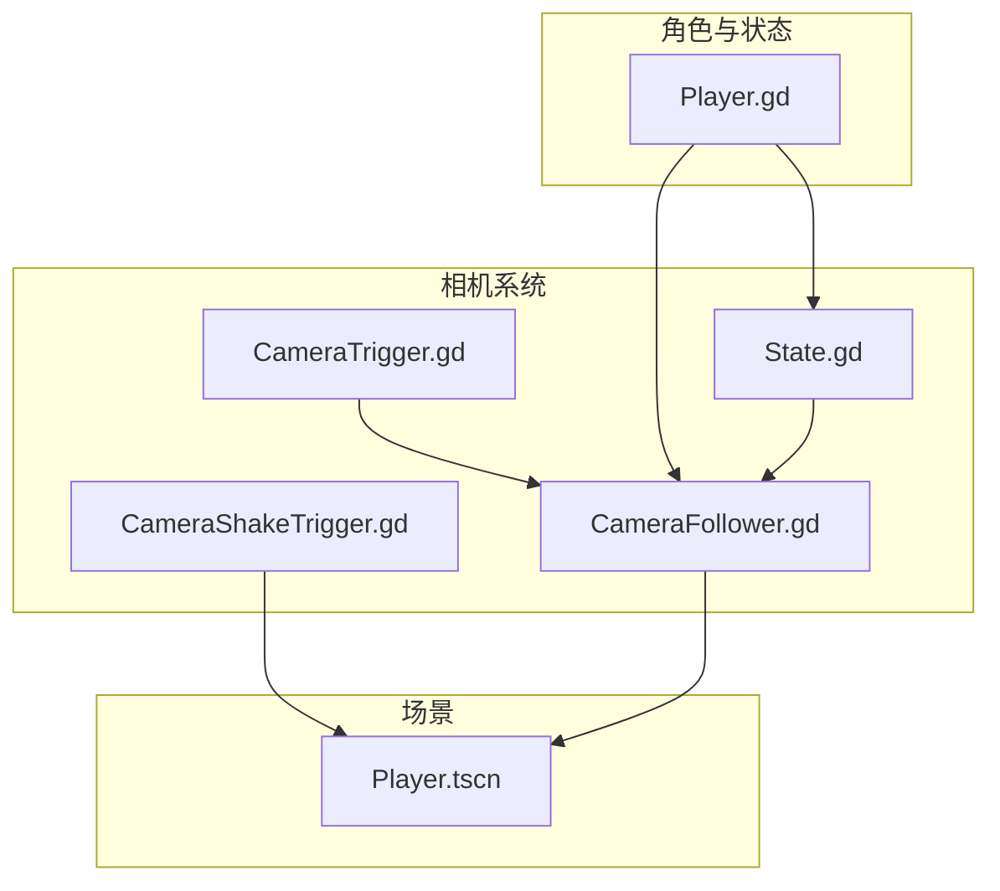
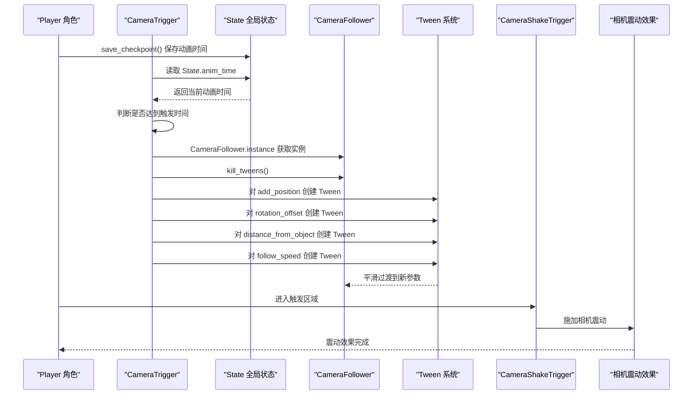
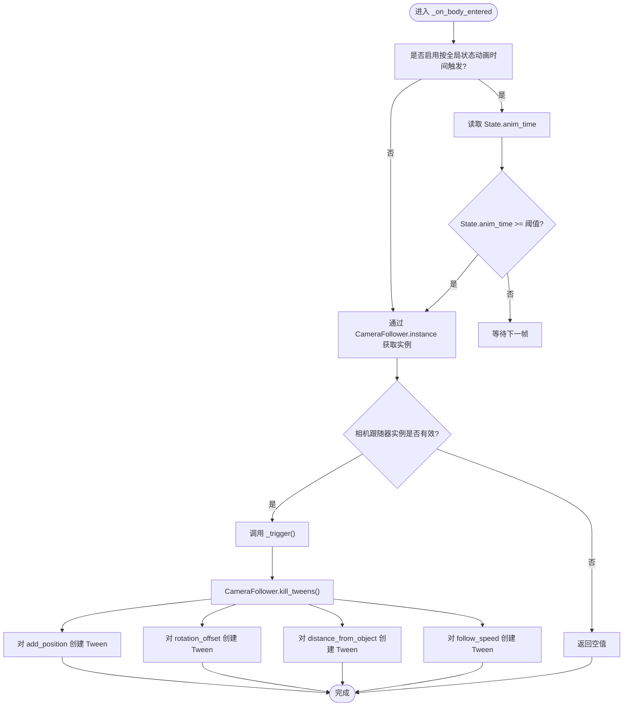
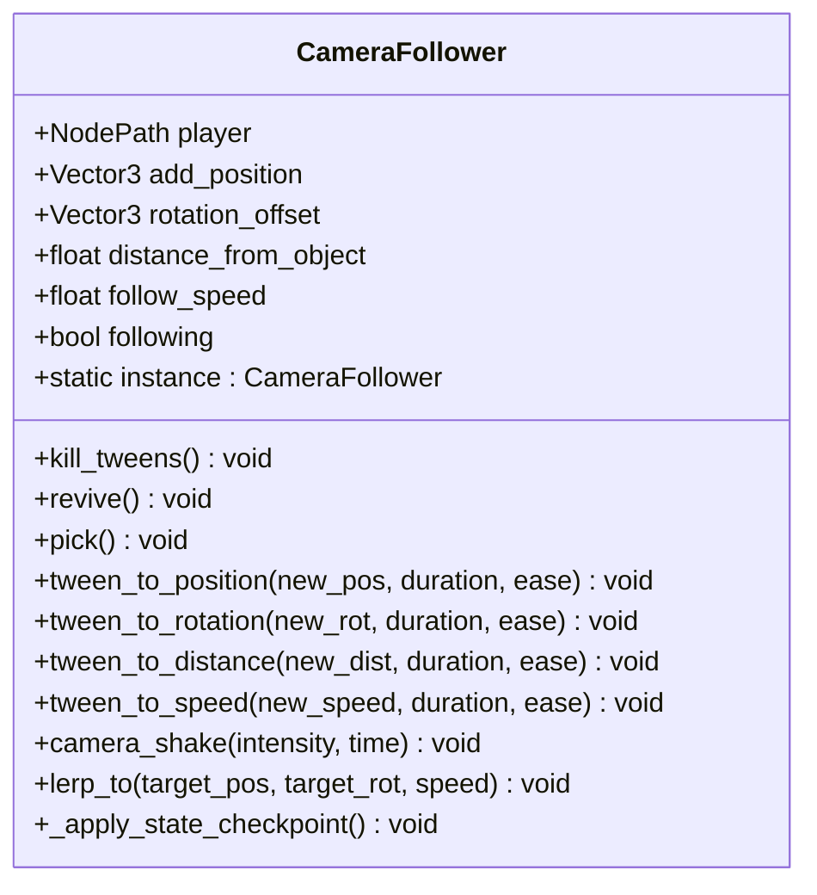
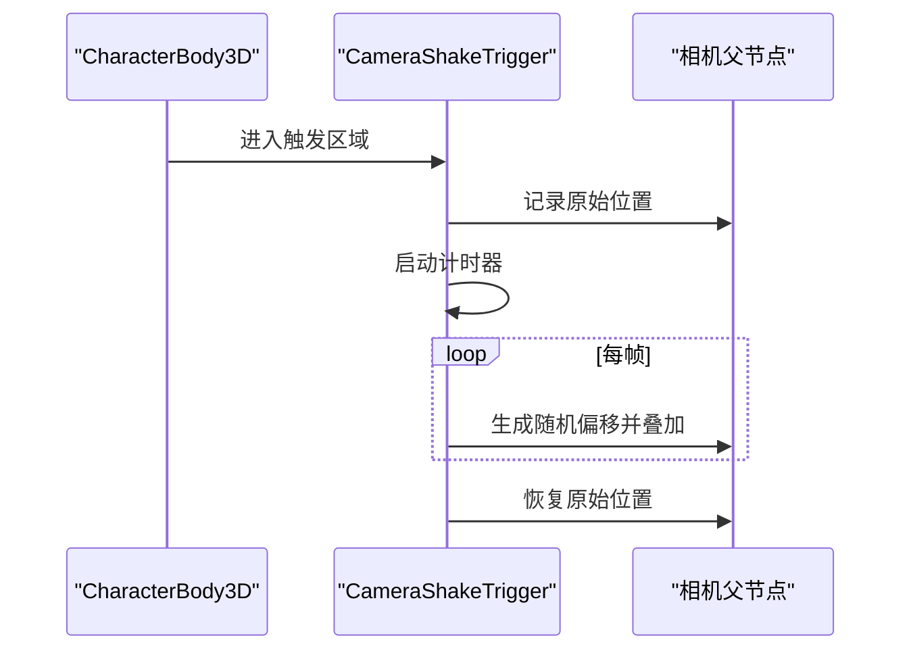
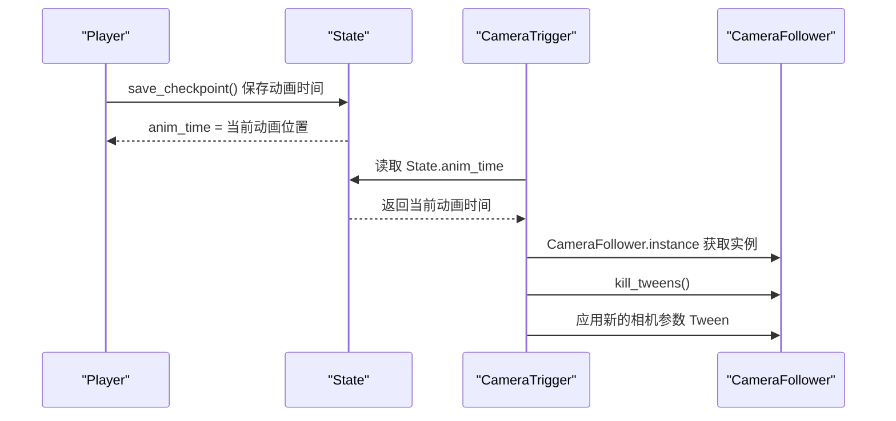
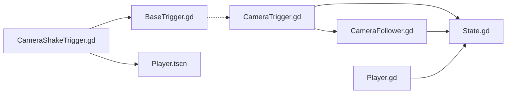

# 相机触发器

<cite>
**本文引用的文件**
- [CameraTrigger.gd](file://#Template/[Scripts]/CameraScripts/CameraTrigger.gd)
- [CameraFollower.gd](file://#Template/[Scripts]/CameraScripts/CameraFollower.gd)
- [CameraShakeTrigger.gd](file://#Template/[Scripts]/CameraScripts/CameraShakeTrigger.gd)
- [State.gd](file://#Template/[Scripts]/State.gd)
- [Player.gd](file://#Template/[Scripts]/Level/Player.gd)
- [BaseTrigger.gd](file://#Template/[Scripts]/Trigger/BaseTrigger.gd)
- [Player.tscn](file://#Template/Player.tscn)
</cite>

## 更新摘要
**变更内容**
- 更新动画时间触发机制：从基于动画节点属性改为基于全局状态的动画时间跟踪
- 优化相机触发器的时间触发逻辑，使用 State.anim_time 替代直接读取 AnimationPlayer 属性
- 改进相机跟随器的检查点恢复机制，增强状态持久化能力
- 更新相机震动触发器的实现，移除对 GameManager 的依赖
- 完善相机系统与角色控制系统的协调机制

## 目录
1. [简介](#简介)
2. [项目结构](#项目结构)
3. [核心组件](#核心组件)
4. [架构总览](#架构总览)
5. [详细组件分析](#详细组件分析)
6. [依赖关系分析](#依赖关系分析)
7. [性能考量](#性能考量)
8. [故障排查指南](#故障排查指南)
9. [结论](#结论)
10. [附录](#附录)

## 简介
本文件系统化阐述"相机触发器"的设计与实现，重点覆盖以下方面：
- CameraTrigger（相机触发器）如何通过触发区域控制摄像机跟随行为、视角偏移、镜头距离与跟随速度，并支持基于全局状态动画时间的精确触发。
- CameraFollower（相机跟随器）如何通过增强的插值系统实现平滑的相机过渡，包括位置和旋转的lerp插值、角度插值优化与状态管理。
- CameraShakeTrigger（相机震动触发器）如何通过独立的触发器实现相机震动效果，提供更简洁的实现方式。
- 相机触发器与角色控制系统的协同机制，包括全局状态动画时间读取、触发条件与状态恢复。
- 参数配置、触发条件、效果持续时间等关键要素的使用方法与最佳实践。

**更新** 相机触发器的动画时间触发机制已更新为基于全局状态的动画时间跟踪，通过 State.anim_time 提供统一的动画时间源，替代了原有的直接读取 AnimationPlayer 属性的方式，提高了系统的稳定性和一致性。

## 项目结构
围绕相机系统的关键脚本与场景如下：
- 相机控制与触发
  - CameraFollower.gd：负责跟随目标、平滑插值、状态保存/恢复、Tween控制与相机震动，新增lerp插值功能。
  - CameraTrigger.gd：基于区域触发，对 CameraFollower 的位置、旋转、距离与速度进行Tween过渡，支持基于全局状态动画时间的精确触发。
  - CameraShakeTrigger.gd：继承自BaseTrigger，对相机父节点施加随机抖动，常用于受击或爆炸等反馈。
- 角色与状态
  - Player.gd：角色主体，提供动画播放、转向、死亡等行为，并与相机系统交互。
  - State.gd：全局状态容器，用于跨关卡/场景的状态持久化与恢复，包含动画时间跟踪功能。
- 基础触发器框架
  - BaseTrigger.gd：统一的触发器基类，提供过滤器、一次性触发与信号发射能力。

**图表来源**
- [CameraFollower.gd:1-150](file://#Template/[Scripts]/CameraScripts/CameraFollower.gd#L1-L150)
- [CameraTrigger.gd:1-104](file://#Template/[Scripts]/CameraScripts/CameraTrigger.gd#L1-L104)
- [CameraShakeTrigger.gd:1-33](file://#Template/[Scripts]/CameraScripts/CameraShakeTrigger.gd#L1-L33)
- [State.gd:1-159](file://#Template/[Scripts]/State.gd#L1-L159)
- [Player.gd:1-200](file://#Template/[Scripts]/Level/Player.gd#L1-L200)
- [Player.tscn:1-78](file://#Template/Player.tscn#L1-L78)

**章节来源**
- [CameraFollower.gd:1-150](file://#Template/[Scripts]/CameraScripts/CameraFollower.gd#L1-L150)
- [CameraTrigger.gd:1-104](file://#Template/[Scripts]/CameraScripts/CameraTrigger.gd#L1-L104)
- [CameraShakeTrigger.gd:1-33](file://#Template/[Scripts]/CameraScripts/CameraShakeTrigger.gd#L1-L33)
- [State.gd:1-159](file://#Template/[Scripts]/State.gd#L1-L159)
- [Player.gd:1-200](file://#Template/[Scripts]/Level/Player.gd#L1-L200)
- [Player.tscn:1-78](file://#Template/Player.tscn#L1-L78)

## 核心组件
- CameraFollower.gd
  - 负责跟随目标、平滑插值、状态保存/恢复、Tween控制与相机震动。
  - 新增lerp_to方法，提供基于指数衰减的平滑插值过渡，支持位置和旋转的独立控制。
  - 改进角度插值算法，使用最短角路径和角度逼近检测，提高旋转插值的精度和稳定性。
  - 支持检查点状态恢复，通过 State.camera_checkpoint 实现跨场景状态持久化。
  - 关键属性：跟随目标、附加位置、旋转偏移、距离、跟随速度、是否跟随。
  - 关键方法：kill_tweens、revive、pick、tween_to_* 系列、camera_shake、lerp_to。
- CameraTrigger.gd
  - 基于 Area3D 区域触发，向 CameraFollower 应用位置、旋转、距离与速度的Tween过渡。
  - 支持"按全局状态动画时间触发"，通过 State.anim_time 判断触发时机。
  - 新增多参数独立控制，支持位置、旋转、距离、速度的分别启用/禁用。
  - **新增** 动态相机跟随解析：通过静态 CameraFollower.instance 获取相机跟随器实例。
- CameraShakeTrigger.gd
  - 继承自BaseTrigger，对相机父节点施加随机抖动，支持强度与持续时间配置。
  - 改进实时抖动控制，提供更好的性能表现。
  - 直接操作相机父节点，无需GameManager依赖。
- State.gd
  - 全局状态容器，提供动画时间跟踪、检查点数据持久化与跨场景状态恢复。
  - 包含 anim_time 静态变量，用于统一的动画时间源。
  - 提供相机检查点数据结构，支持完整的相机状态保存与恢复。
- Player.gd 与 Player.tscn
  - 提供动画播放、转向、死亡等行为；通过 State.save_checkpoint 保存动画时间。
  - Player.tscn 场景包含 CharacterBody3D 节点，作为相机跟随的目标。

**章节来源**
- [CameraFollower.gd:1-150](file://#Template/[Scripts]/CameraScripts/CameraFollower.gd#L1-L150)
- [CameraTrigger.gd:1-104](file://#Template/[Scripts]/CameraScripts/CameraTrigger.gd#L1-L104)
- [CameraShakeTrigger.gd:1-33](file://#Template/[Scripts]/CameraScripts/CameraShakeTrigger.gd#L1-L33)
- [State.gd:1-159](file://#Template/[Scripts]/State.gd#L1-L159)
- [Player.gd:1-200](file://#Template/[Scripts]/Level/Player.gd#L1-L200)
- [Player.tscn:1-78](file://#Template/Player.tscn#L1-L78)

## 架构总览
相机触发器与角色控制系统的协作流程如下：
- 角色 Player 控制移动与动画播放，同时维护动画时间并通过 State.save_checkpoint 保存。
- CameraTrigger 侦测角色进入触发区域，若启用"按全局状态动画时间触发"，则读取 State.anim_time，达到阈值后触发。
- CameraTrigger 调用静态 CameraFollower.instance 获取相机跟随器实例，然后调用 CameraFollower.kill_tweens 停止旧动画，随后对 add_position、rotation_offset、distance_from_object、follow_speed 分别创建 Tween，应用缓动与持续时间。
- CameraFollower 提供两种插值方式：Tween插值和lerp插值，支持平滑的相机过渡效果。
- CameraShakeTrigger 通过继承BaseTrigger基类，直接响应角色进入触发区域，对相机父节点施加随机抖动效果。

**更新** 新增基于全局状态的动画时间触发机制：
- CameraTrigger 使用 State.anim_time 作为统一的动画时间源
- State.save_checkpoint 自动保存当前动画播放位置
- CameraFollower 支持从 State 恢复完整的相机状态
- CameraShakeTrigger 提供更简洁的实现方式，直接继承BaseTrigger基类

**图表来源**
- [CameraTrigger.gd:45-50](file://#Template/[Scripts]/CameraScripts/CameraTrigger.gd#L45-L50)
- [State.gd:59-60](file://#Template/[Scripts]/State.gd#L59-L60)
- [CameraTrigger.gd:52-63](file://#Template/[Scripts]/CameraScripts/CameraTrigger.gd#L52-L63)
- [CameraFollower.gd:37-42](file://#Template/[Scripts]/CameraScripts/CameraFollower.gd#L37-L42)
- [CameraShakeTrigger.gd:27-33](file://#Template/[Scripts]/CameraScripts/CameraShakeTrigger.gd#L27-L33)

**章节来源**
- [CameraTrigger.gd:45-50](file://#Template/[Scripts]/CameraScripts/CameraTrigger.gd#L45-L50)
- [State.gd:59-60](file://#Template/[Scripts]/State.gd#L59-L60)
- [CameraTrigger.gd:52-63](file://#Template/[Scripts]/CameraScripts/CameraTrigger.gd#L52-L63)
- [CameraFollower.gd:37-42](file://#Template/[Scripts]/CameraScripts/CameraFollower.gd#L37-L42)
- [CameraShakeTrigger.gd:27-33](file://#Template/[Scripts]/CameraScripts/CameraShakeTrigger.gd#L27-L33)

## 详细组件分析

### CameraTrigger（相机触发器）
- 触发条件
  - 默认仅当角色进入触发区域时触发；若启用"按全局状态动画时间触发"，则需满足 State.anim_time 大于等于设定阈值。
  - 新增触发状态管理，防止重复触发同一事件。
- 触发动作
  - 通过静态 CameraFollower.instance 获取相机跟随器实例。
  - 调用 CameraFollower.kill_tweens 停止正在进行的 Tween。
  - 对以下参数分别创建 Tween：
    - 位置偏移（add_position）
    - 旋转偏移（rotation_offset）
    - 距离（distance_from_object）
    - 跟随速度（follow_speed）
  - 使用统一的缓动类型与过渡时长。
- 参数要点
  - active_*：开关各参数的过渡。
  - new_*：目标值。
  - ease_type：缓动类型。
  - need_time：过渡时长。
  - use_time / trigger_time：按全局状态动画时间触发的开关与阈值。

**更新** 新增基于全局状态的动画时间触发机制：
- _process 函数中使用 State.anim_time 替代直接读取 AnimationPlayer 属性
- 提供更稳定的动画时间源，避免不同场景间的差异
- 支持跨场景的动画时间一致性

**图表来源**
- [CameraTrigger.gd:40-50](file://#Template/[Scripts]/CameraScripts/CameraTrigger.gd#L40-L50)
- [CameraTrigger.gd:52-63](file://#Template/[Scripts]/CameraScripts/CameraTrigger.gd#L52-L63)
- [CameraFollower.gd:37-42](file://#Template/[Scripts]/CameraScripts/CameraFollower.gd#L37-L42)

**章节来源**
- [CameraTrigger.gd:1-104](file://#Template/[Scripts]/CameraScripts/CameraTrigger.gd#L1-L104)
- [CameraFollower.gd:37-42](file://#Template/[Scripts]/CameraScripts/CameraFollower.gd#L37-L42)

### CameraFollower（相机跟随器）
- 跟随与插值
  - 每帧根据目标位置与附加偏移计算基础变换，使用球面线性插值（slerp）平滑移动。
  - 支持暂停跟随（如角色停止时）并清理 Tween。
  - **新增** lerp_to方法：提供基于指数衰减的平滑插值，支持位置和旋转的独立控制。
  - **更新** 角度插值优化：使用最短角路径和角度逼近检测，提高旋转插值的精度和稳定性。
- 状态管理
  - 提供 pick/revive 保存/恢复相机参数，便于状态快照与回滚。
  - 提供 kill_tweens 清理所有正在进行的 Tween。
  - **更新** 检查点恢复：支持从 State.camera_checkpoint 恢复完整相机状态。
- 动画过渡
  - 提供 tween_to_* 系列方法，封装对 add_position、rotation_offset、distance_from_object、follow_speed 的 Tween 动画。
- 相机震动
  - camera_shake 通过在短时间内对相机节点位置施加随机偏移，实现震动效果。

**更新** 新增检查点状态恢复功能：
- 支持从 State.camera_checkpoint 恢复完整的相机状态
- 包含位置、旋转、距离、跟随速度等所有相关参数
- 提供 _apply_state_checkpoint 方法实现状态恢复

**图表来源**
- [CameraFollower.gd:1-150](file://#Template/[Scripts]/CameraScripts/CameraFollower.gd#L1-L150)

**章节来源**
- [CameraFollower.gd:1-150](file://#Template/[Scripts]/CameraScripts/CameraFollower.gd#L1-L150)

### CameraShakeTrigger（相机震动触发器）
- 继承关系
  - 继承自 BaseTrigger 基类，具备通用触发器的所有特性。
- 触发条件
  - 仅对 CharacterBody3D 生效。
- 执行流程
  - 记录相机父节点原始位置，启动计时器。
  - 在计时期间每帧生成随机偏移并叠加到父节点位置。
  - 计时结束时恢复原位。
- 优势
  - 直接操作相机父节点，无需GameManager依赖。
  - 继承BaseTrigger的过滤器和一次性触发功能。
  - 更简洁的实现方式，移除了CamShaker的复杂逻辑。

**图表来源**
- [CameraShakeTrigger.gd:27-33](file://#Template/[Scripts]/CameraScripts/CameraShakeTrigger.gd#L27-L33)

**章节来源**
- [CameraShakeTrigger.gd:1-33](file://#Template/[Scripts]/CameraScripts/CameraShakeTrigger.gd#L1-L33)
- [BaseTrigger.gd:1-38](file://#Template/[Scripts]/Trigger/BaseTrigger.gd#L1-L38)

### 与角色控制系统的协调
- 全局状态动画时间驱动
  - CameraTrigger 在启用"按全局状态动画时间触发"时，从 State.anim_time 读取当前动画时间，达到阈值后触发。
  - Player.gd 通过 State.save_checkpoint 自动保存动画播放位置。
- 角色行为
  - Player.gd 提供各种角色控制方法，控制角色转向、重载与死亡。
  - Player.gd 维护动画播放与状态，为相机触发器提供时间基准。
- 状态持久化
  - State 提供跨场景的状态存储与恢复，CameraFollower 支持从 State 恢复相机参数。
  - State.camera_checkpoint 包含完整的相机状态数据结构。

**更新** 新增全局状态协调机制：
- State.anim_time 提供统一的动画时间源
- State.save_checkpoint 自动保存动画播放位置
- State.camera_checkpoint 支持完整的相机状态持久化
- CameraFollower._apply_state_checkpoint 实现状态恢复

**图表来源**
- [State.gd:59-60](file://#Template/[Scripts]/State.gd#L59-L60)
- [CameraTrigger.gd:45-50](file://#Template/[Scripts]/CameraScripts/CameraTrigger.gd#L45-L50)
- [CameraFollower.gd:37-42](file://#Template/[Scripts]/CameraScripts/CameraFollower.gd#L37-L42)

**章节来源**
- [State.gd:59-60](file://#Template/[Scripts]/State.gd#L59-L60)
- [CameraTrigger.gd:45-50](file://#Template/[Scripts]/CameraScripts/CameraTrigger.gd#L45-L50)
- [CameraFollower.gd:37-42](file://#Template/[Scripts]/CameraScripts/CameraFollower.gd#L37-L42)

## 依赖关系分析
- CameraTrigger 依赖 State 的全局动画时间跟踪能力。
- CameraTrigger 依赖 CameraFollower 的静态实例访问接口。
- CameraFollower 依赖 State 的检查点数据结构与恢复功能。
- State 提供全局状态管理，包括动画时间跟踪与相机状态持久化。
- CameraShakeTrigger 依赖 BaseTrigger 的通用触发器功能，直接操作相机父节点。
- Player.gd 依赖 State 进行状态保存与恢复。

**更新** 新增全局状态依赖关系：
- CameraTrigger 通过 State.anim_time 获取动画时间
- CameraFollower 通过 State.camera_checkpoint 恢复状态
- State.save_checkpoint 自动保存动画播放位置
- CameraShakeTrigger 不再依赖 GameManager，提供更独立的实现

**图表来源**
- [CameraTrigger.gd:28-32](file://#Template/[Scripts]/CameraScripts/CameraTrigger.gd#L28-L32)
- [State.gd:9](file://#Template/[Scripts]/State.gd#L9)
- [CameraFollower.gd:4](file://#Template/[Scripts]/CameraScripts/CameraFollower.gd#L4)
- [Player.gd:52-60](file://#Template/[Scripts]/Level/Player.gd#L52-L60)
- [CameraShakeTrigger.gd:3-5](file://#Template/[Scripts]/CameraScripts/CameraShakeTrigger.gd#L3-L5)
- [BaseTrigger.gd:1-38](file://#Template/[Scripts]/Trigger/BaseTrigger.gd#L1-L38)

**章节来源**
- [CameraTrigger.gd:28-32](file://#Template/[Scripts]/CameraScripts/CameraTrigger.gd#L28-L32)
- [State.gd:9](file://#Template/[Scripts]/State.gd#L9)
- [CameraFollower.gd:4](file://#Template/[Scripts]/CameraScripts/CameraFollower.gd#L4)
- [Player.gd:52-60](file://#Template/[Scripts]/Level/Player.gd#L52-L60)
- [CameraShakeTrigger.gd:3-5](file://#Template/[Scripts]/CameraScripts/CameraShakeTrigger.gd#L3-L5)
- [BaseTrigger.gd:1-38](file://#Template/[Scripts]/Trigger/BaseTrigger.gd#L1-L38)

## 性能考量
- Tween 复用与清理
  - CameraTrigger 在每次触发前调用 kill_tweens，避免多个 Tween 并行导致的资源浪费与状态冲突。
- 插值效率
  - CameraFollower 使用 slerp 平滑移动，delta 驱动的插值保证帧率无关的顺滑体验。
  - **新增** lerp插值优化：使用指数衰减算法，提供更平滑的过渡效果。
- 角度插值优化
  - **更新** 改进了旋转插值的精度和稳定性，使用最短角路径和角度逼近检测。
- 全局状态动画时间读取
  - CameraTrigger 仅在启用按全局状态动画时间触发时读取 State.anim_time，避免不必要的开销。
- 实时抖动优化
  - CameraShakeTrigger 改进的实时抖动控制，减少每帧计算开销。
  - 直接操作相机父节点，避免GameManager查询开销。
- **新增** 检查点状态恢复优化
  - CameraFollower 支持延迟状态恢复，避免不必要的状态处理
  - State.camera_checkpoint 提供结构化的状态数据，提高恢复效率

**更新** 新增全局状态性能优化：
- State.anim_time 提供高效的动画时间读取
- CameraTrigger 使用静态实例访问，避免频繁查找
- CameraFollower._apply_state_checkpoint 支持延迟执行
- CameraShakeTrigger 提供更高效的震动实现

## 故障排查指南
- 触发无效
  - 确认触发器是否正确连接 body_entered 信号；检查 one_shot 与触发过滤器设置。
  - 若启用按全局状态动画时间触发，确认 State.anim_time 是否正确更新。
  - **新增** 检查 State.save_checkpoint 是否正确保存动画时间。
- 相机不跟随
  - 检查 CameraFollower 的 player 节点路径是否正确；确认 following 未被意外置为 false。
  - **新增** 确认 CameraFollower.instance 是否正确设置。
- **新增** lerp插值问题
  - 检查 lerp_to 方法的参数设置，确认目标位置和旋转值合理。
  - 确认 Tween 状态标志正确设置和清除。
- 抖动无效
  - 确认 CameraShakeTrigger 的 camera_parent 是否正确绑定；检查强度与持续时间参数。
  - **新增** 确认 CameraShakeTrigger 继承自BaseTrigger，具备正确的触发条件。
- 多参数调整问题
  - 检查各 active_* 参数是否正确设置；确认 new_* 目标值范围合理。
- **新增** 全局状态相关问题
  - 确认 State.instance 是否正确初始化。
  - 检查 State.camera_checkpoint 数据结构的完整性。
  - 验证 State.save_checkpoint 的执行时机。
- **新增** CameraShakeTrigger故障排查
  - 确认触发器是否正确继承BaseTrigger基类。
  - 检查 camera_parent 是否正确设置为相机父节点。
  - 验证 shake_intensity 和 shake_duration 参数范围。

**更新** 新增全局状态故障排查：
- 确认 State.instance 是否正确初始化
- 检查 State.save_checkpoint 是否正确保存动画时间
- 验证 State.camera_checkpoint 数据结构的完整性
- 确认 CameraFollower.instance 的正确设置
- 检查 _get_camera_follower() 方法的执行路径

**章节来源**
- [BaseTrigger.gd:18-38](file://#Template/[Scripts]/Trigger/BaseTrigger.gd#L18-L38)
- [CameraFollower.gd:37-42](file://#Template/[Scripts]/CameraScripts/CameraFollower.gd#L37-L42)
- [CameraShakeTrigger.gd:13-33](file://#Template/[Scripts]/CameraScripts/CameraShakeTrigger.gd#L13-L33)
- [CameraTrigger.gd:28-32](file://#Template/[Scripts]/CameraScripts/CameraTrigger.gd#L28-L32)
- [State.gd:59-60](file://#Template/[Scripts]/State.gd#L59-L60)

## 结论
- CameraTrigger 通过 Area3D 触发与 Tween 动画，实现了对相机位置、旋转、距离与速度的可控过渡，并支持基于全局状态动画时间的精确触发。
- CameraFollower 作为相机控制中枢，承担了平滑插值、状态管理与动画协调职责，新增的lerp插值功能提供了更平滑的相机过渡效果。
- CameraShakeTrigger 作为CamShaker的重命名版本，提供了更简洁的相机震动实现，继承自BaseTrigger基类，直接操作相机父节点。
- 与角色控制系统的协同确保了相机行为与角色动画的同步，State 则保障了跨场景状态的一致性。
- **新增** 全局状态协调机制提供了统一的动画时间源，通过 State.anim_time 实现了更稳定的动画触发。
- **新增** 检查点状态恢复功能增强了相机系统的持久化能力，支持完整的相机状态保存与恢复。

## 附录

### 参数配置与使用示例（步骤式说明）
- 配置 CameraTrigger
  - 开启 active_position/active_rotate/active_distance/active_speed 以启用对应参数的过渡。
  - 设定 new_* 为目标值，ease_type 与 need_time 控制缓动与时长。
  - 如需按全局状态动画时间触发，启用 use_time 并设置 trigger_time。
  - **新增** 确保 State.save_checkpoint 正确保存动画时间。
- 配置 CameraFollower
  - 设置 player 指向 Player 节点。
  - 调整 add_position、rotation_offset、distance_from_object、follow_speed 的初始值。
  - 如需临时禁用跟随，可将 following 置为 false。
  - **新增** 使用 lerp_to 方法实现平滑的相机过渡。
- 配置 CameraShakeTrigger
  - 设置 camera_parent 为相机父节点。
  - 调整 shake_intensity 与 shake_duration。
  - **新增** 确保触发器继承自BaseTrigger基类。
- **新增** 配置全局状态
  - 确保 State.instance 正确初始化。
  - Player.gd 会自动调用 State.save_checkpoint 保存动画时间。
  - State.camera_checkpoint 提供完整的相机状态数据结构。

**章节来源**
- [CameraTrigger.gd:3-23](file://#Template/[Scripts]/CameraScripts/CameraTrigger.gd#L3-L23)
- [CameraFollower.gd:13-18](file://#Template/[Scripts]/CameraScripts/CameraFollower.gd#L13-L18)
- [CameraShakeTrigger.gd:3-5](file://#Template/[Scripts]/CameraScripts/CameraShakeTrigger.gd#L3-L5)
- [State.gd:52-75](file://#Template/[Scripts]/State.gd#L52-L75)
- [Player.gd:52-60](file://#Template/[Scripts]/Level/Player.gd#L52-L60)