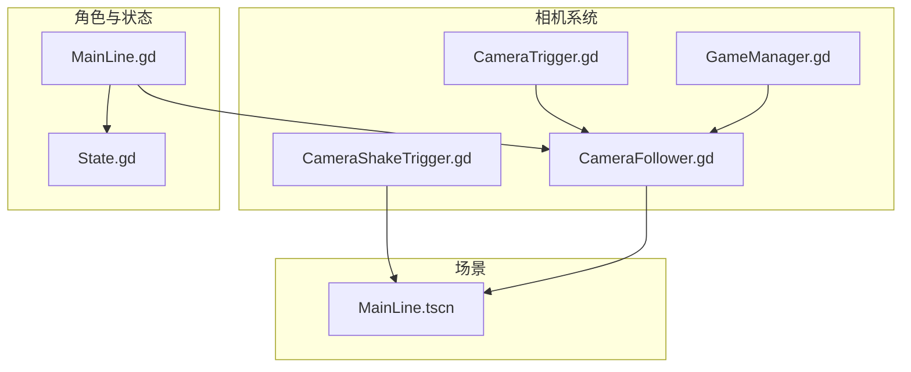
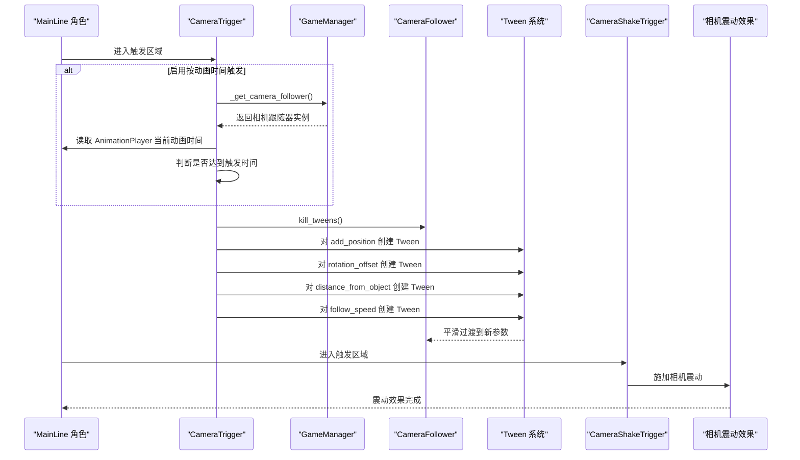
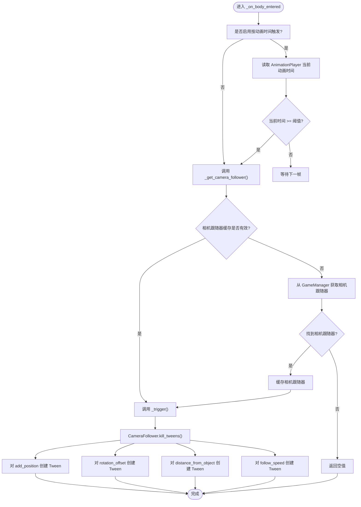
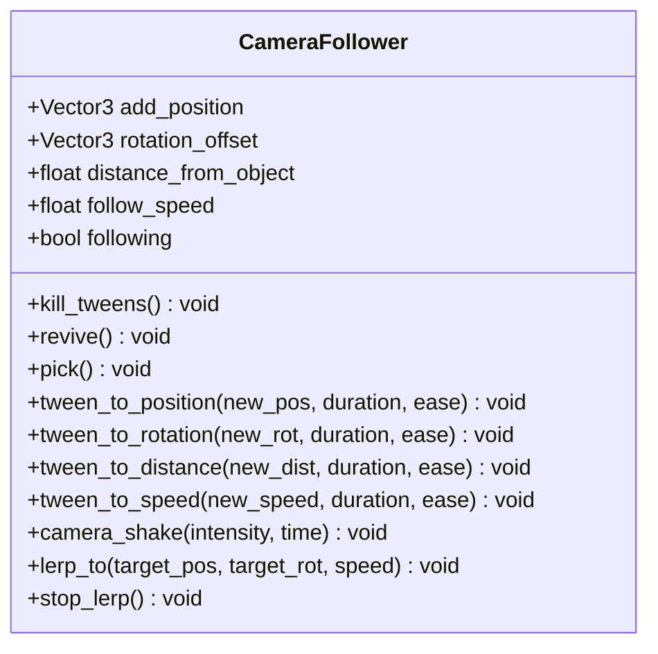
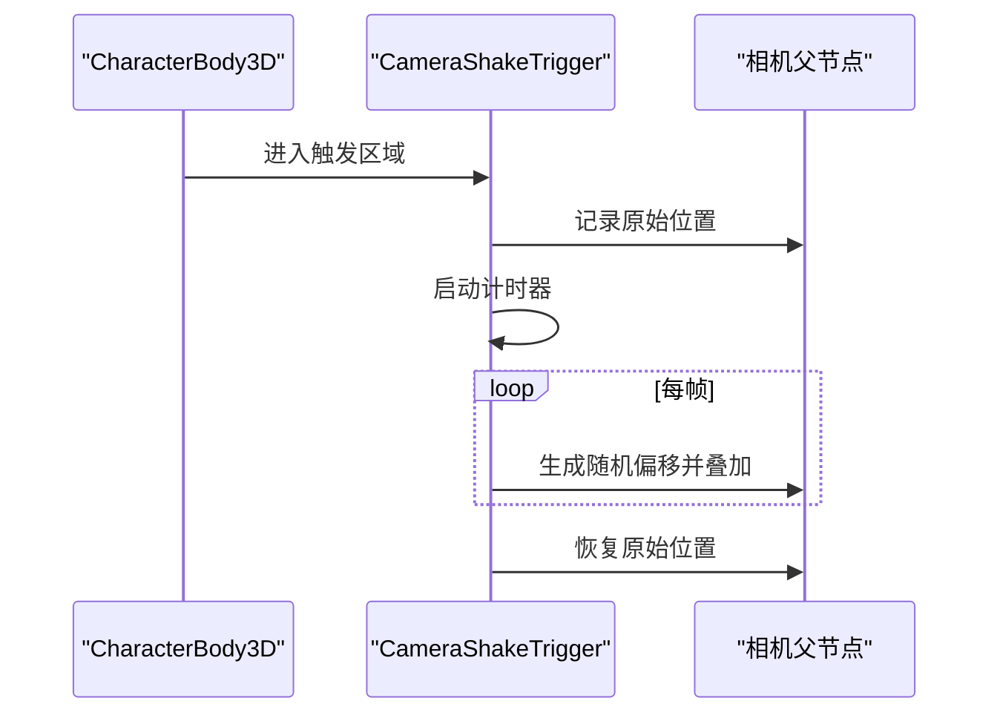
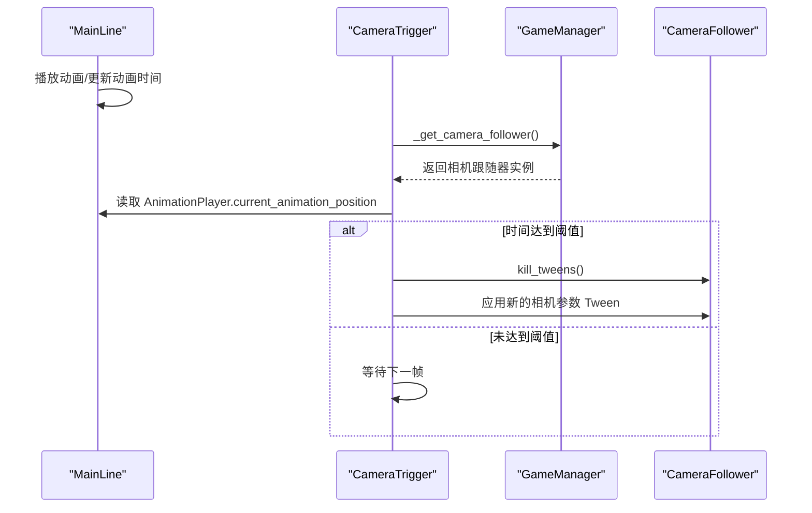
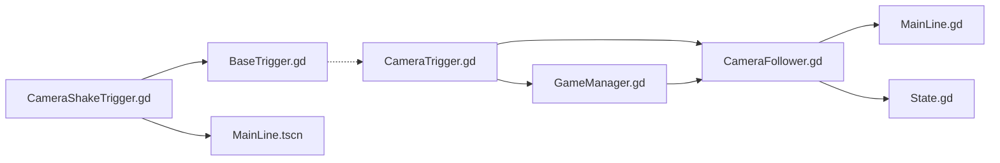

# 相机触发器

<cite>
**本文引用的文件**
- [CameraTrigger.gd](file://#Template/[Scripts]/CameraScripts/CameraTrigger.gd)
- [CameraFollower.gd](file://#Template/[Scripts]/CameraScripts/CameraFollower.gd)
- [CameraShakeTrigger.gd](file://#Template/[Scripts]/CameraScripts/CameraShakeTrigger.gd)
- [GameManager.gd](file://#Template/[Scripts]/GameManager.gd)
- [MainLine.gd](file://#Template/[Scripts]/Level/MainLine.gd)
- [State.gd](file://#Template/[Scripts]/State.gd)
- [BaseTrigger.gd](file://#Template/[Scripts]/Trigger/BaseTrigger.gd)
- [MainLine.tscn](file://#Template/MainLine.tscn)
</cite>

## 更新摘要
**变更内容**
- CamTransitionTrigger脚本已被完全删除，其投影切换功能已由增强的CameraFollower系统替代
- CameraFollower系统新增lerp_to和stop_lerp方法，提供更平滑的相机过渡效果
- CameraFollower系统新增角度插值优化，改进旋转插值的精度和稳定性
- CamShaker脚本已完全删除，功能被重命名为CameraShakeTrigger，继承自BaseTrigger基类
- CameraShakeTrigger提供更简洁的相机震动实现，移除了对GameManager的依赖
- 移除了CamTransitionTrigger相关的投影切换功能文档
- 更新了相机系统架构图和相关流程说明

## 目录
1. [简介](#简介)
2. [项目结构](#项目结构)
3. [核心组件](#核心组件)
4. [架构总览](#架构总览)
5. [详细组件分析](#详细组件分析)
6. [依赖关系分析](#依赖关系分析)
7. [性能考量](#性能考量)
8. [故障排查指南](#故障排查指南)
9. [结论](#结论)
10. [附录](#附录)

## 简介
本文件系统化阐述"相机触发器"的设计与实现，重点覆盖以下方面：
- CameraTrigger（相机触发器）如何通过触发区域控制摄像机跟随行为、视角偏移、镜头距离与跟随速度，并支持基于动画时间的精确触发。
- CameraFollower（相机跟随器）如何通过增强的插值系统实现平滑的相机过渡，包括位置和旋转的lerp插值、角度插值优化与状态管理。
- CameraShakeTrigger（相机震动触发器）如何通过独立的触发器实现相机震动效果，提供更简洁的实现方式。
- 相机触发器与 MainLine 角色控制系统的协同机制，包括动画时间读取、触发条件与状态恢复。
- 参数配置、触发条件、效果持续时间等关键要素的使用方法与最佳实践。

**更新** CamTransitionTrigger脚本已被完全删除，其投影切换功能已由增强的CameraFollower系统替代，新增了lerp_to方法提供更平滑的相机过渡效果。CamShaker脚本已完全删除，功能被重命名为CameraShakeTrigger，继承自BaseTrigger基类，提供更简洁的相机震动实现。

## 项目结构
围绕相机系统的关键脚本与场景如下：
- 相机控制与触发
  - CameraFollower.gd：负责跟随目标、平滑插值、状态保存/恢复、Tween控制与相机震动，新增lerp插值功能。
  - CameraTrigger.gd：基于区域触发，对 CameraFollower 的位置、旋转、距离与速度进行Tween过渡，支持基于动画时间的精确触发。
  - CameraShakeTrigger.gd：继承自BaseTrigger，对相机父节点施加随机抖动，常用于受击或爆炸等反馈。
- 角色与状态
  - MainLine.gd：角色主体，提供动画播放、转向、死亡等行为，并与相机系统交互。
  - State.gd：全局状态容器，用于跨关卡/场景的状态持久化与恢复。
  - GameManager.gd：游戏管理器，提供相机跟随器的动态解析与访问。
- 基础触发器框架
  - BaseTrigger.gd：统一的触发器基类，提供过滤器、一次性触发与信号发射能力。

**图表来源**
- [CameraFollower.gd:1-179](file://#Template/[Scripts]/CameraScripts/CameraFollower.gd#L1-L179)
- [CameraTrigger.gd:1-75](file://#Template/[Scripts]/CameraScripts/CameraTrigger.gd#L1-L75)
- [CameraShakeTrigger.gd:1-33](file://#Template/[Scripts]/CameraScripts/CameraShakeTrigger.gd#L1-L33)
- [GameManager.gd:1-50](file://#Template/[Scripts]/GameManager.gd#L1-L50)
- [MainLine.gd:1-218](file://#Template/[Scripts]/Level/MainLine.gd#L1-L218)
- [State.gd:1-196](file://#Template/[Scripts]/State.gd#L1-L196)
- [MainLine.tscn:1-72](file://#Template/MainLine.tscn#L1-L72)

**章节来源**
- [CameraFollower.gd:1-179](file://#Template/[Scripts]/CameraScripts/CameraFollower.gd#L1-L179)
- [CameraTrigger.gd:1-75](file://#Template/[Scripts]/CameraScripts/CameraTrigger.gd#L1-L75)
- [CameraShakeTrigger.gd:1-33](file://#Template/[Scripts]/CameraScripts/CameraShakeTrigger.gd#L1-L33)
- [GameManager.gd:1-50](file://#Template/[Scripts]/GameManager.gd#L1-L50)
- [MainLine.gd:1-218](file://#Template/[Scripts]/Level/MainLine.gd#L1-L218)
- [State.gd:1-196](file://#Template/[Scripts]/State.gd#L1-L196)
- [MainLine.tscn:1-72](file://#Template/MainLine.tscn#L1-L72)

## 核心组件
- CameraFollower.gd
  - 负责跟随目标、平滑插值、状态保存/恢复、Tween控制与相机震动。
  - 新增lerp_to方法，提供基于指数衰减的平滑插值过渡，支持位置和旋转的独立控制。
  - 新增_stop_lerp方法，停止正在进行的lerp插值。
  - 改进角度插值算法，使用最短角路径和角度逼近检测，提高旋转插值的精度和稳定性。
  - 关键属性：跟随目标、附加位置、旋转偏移、距离、跟随速度、是否跟随。
  - 关键方法：kill_tweens、revive、pick、tween_to_* 系列、camera_shake、lerp_to、stop_lerp。
- CameraTrigger.gd
  - 基于 Area3D 区域触发，向 CameraFollower 应用位置、旋转、距离与速度的Tween过渡。
  - 支持"按动画时间触发"，通过 MainLine 的 AnimationPlayer 当前动画时间判断。
  - 新增多参数独立控制，支持位置、旋转、距离、速度的分别启用/禁用。
  - **新增** 动态相机跟随解析：通过 _get_camera_follower() 方法从 GameManager 获取相机跟随器实例。
- CameraShakeTrigger.gd
  - 继承自BaseTrigger，对相机父节点施加随机抖动，支持强度与持续时间配置。
  - 改进实时抖动控制，提供更好的性能表现。
  - 直接操作相机父节点，无需GameManager依赖。
- GameManager.gd 与 MainLine.gd 与 State.gd
  - 提供动画播放、转向、死亡等行为；State 用于跨场景状态持久化与恢复。
  - GameManager 提供相机跟随器的动态解析与访问。
- BaseTrigger.gd
  - 通用触发器基类，提供过滤器、一次性触发与信号发射能力。

**章节来源**
- [CameraFollower.gd:1-179](file://#Template/[Scripts]/CameraScripts/CameraFollower.gd#L1-L179)
- [CameraTrigger.gd:1-75](file://#Template/[Scripts]/CameraScripts/CameraTrigger.gd#L1-L75)
- [CameraShakeTrigger.gd:1-33](file://#Template/[Scripts]/CameraScripts/CameraShakeTrigger.gd#L1-L33)
- [GameManager.gd:1-50](file://#Template/[Scripts]/GameManager.gd#L1-L50)
- [MainLine.gd:1-218](file://#Template/[Scripts]/Level/MainLine.gd#L1-L218)
- [State.gd:1-196](file://#Template/[Scripts]/State.gd#L1-L196)
- [BaseTrigger.gd:1-38](file://#Template/[Scripts]/Trigger/BaseTrigger.gd#L1-L38)

## 架构总览
相机触发器与角色控制系统的协作流程如下：
- 角色 MainLine 控制移动与动画播放，同时维护动画时间。
- CameraTrigger 侦测角色进入触发区域，若启用"按动画时间触发"，则读取 MainLine 的 AnimationPlayer 当前动画时间，达到阈值后触发。
- CameraTrigger 调用 _get_camera_follower() 通过 GameManager 获取相机跟随器实例，然后调用 CameraFollower.kill_tweens 停止旧动画，随后对 add_position、rotation_offset、distance_from_object、follow_speed 分别创建 Tween，应用缓动与持续时间。
- CameraFollower 提供两种插值方式：Tween插值和lerp插值，支持平滑的相机过渡效果。
- CameraShakeTrigger 通过继承BaseTrigger基类，直接响应角色进入触发区域，对相机父节点施加随机抖动效果。

**更新** 新增动态相机跟随解析流程：CameraTrigger 通过 _get_camera_follower() 方法从 GameManager 获取相机跟随器实例，替代原有的硬编码NodePath依赖，提高了系统的灵活性和可维护性。CameraShakeTrigger提供更简洁的实现方式，直接继承BaseTrigger基类，无需GameManager依赖。

**图表来源**
- [CameraTrigger.gd:21-28](file://#Template/[Scripts]/CameraScripts/CameraTrigger.gd#L21-L28)
- [GameManager.gd:10-14](file://#Template/[Scripts]/GameManager.gd#L10-L14)
- [CameraTrigger.gd:41-53](file://#Template/[Scripts]/CameraScripts/CameraTrigger.gd#L41-L53)
- [CameraFollower.gd:86-90](file://#Template/[Scripts]/CameraScripts/CameraFollower.gd#L86-L90)
- [MainLine.gd:150-172](file://#Template/[Scripts]/Level/MainLine.gd#L150-L172)
- [CameraShakeTrigger.gd:27-33](file://#Template/[Scripts]/CameraScripts/CameraShakeTrigger.gd#L27-L33)

**章节来源**
- [CameraTrigger.gd:21-28](file://#Template/[Scripts]/CameraScripts/CameraTrigger.gd#L21-L28)
- [GameManager.gd:10-14](file://#Template/[Scripts]/GameManager.gd#L10-L14)
- [CameraTrigger.gd:41-53](file://#Template/[Scripts]/CameraScripts/CameraTrigger.gd#L41-L53)
- [CameraFollower.gd:86-90](file://#Template/[Scripts]/CameraScripts/CameraFollower.gd#L86-L90)
- [MainLine.gd:150-172](file://#Template/[Scripts]/Level/MainLine.gd#L150-L172)
- [CameraShakeTrigger.gd:27-33](file://#Template/[Scripts]/CameraScripts/CameraShakeTrigger.gd#L27-L33)

## 详细组件分析

### CameraTrigger（相机触发器）
- 触发条件
  - 默认仅当角色进入触发区域时触发；若启用"按动画时间触发"，则需满足 AnimationPlayer 当前动画时间大于等于设定阈值。
  - 新增触发状态管理，防止重复触发同一事件。
- 触发动作
  - 通过 _get_camera_follower() 方法从 GameManager 获取相机跟随器实例。
  - 调用 CameraFollower.kill_tweens 停止正在进行的 Tween。
  - 对以下参数分别创建 Tween：
    - 位置偏移（add_position）
    - 旋转偏移（rotation_offset）
    - 距离（distance_from_object）
    - 跟随速度（follow_speed）
  - 使用统一的缓动类型与过渡时长。
- 参数要点
  - active_*：开关各参数的过渡。
  - new_*：目标值。
  - ease_type：缓动类型。
  - need_time：过渡时长。
  - use_time / trigger_time：按动画时间触发的开关与阈值。

**更新** 新增动态相机跟随解析机制：
- _get_camera_follower() 方法优先使用缓存的相机跟随器实例
- 如果缓存为空，则从当前场景的 GameManager 获取相机跟随器
- 通过 GameManager.camera_follower 属性获取相机跟随器的父节点
- 提供空值检查和错误处理机制

**图表来源**
- [CameraTrigger.gd:21-28](file://#Template/[Scripts]/CameraScripts/CameraTrigger.gd#L21-L28)
- [CameraTrigger.gd:41-53](file://#Template/[Scripts]/CameraScripts/CameraTrigger.gd#L41-L53)
- [CameraTrigger.gd:54-75](file://#Template/[Scripts]/CameraScripts/CameraTrigger.gd#L54-L75)
- [GameManager.gd:10-14](file://#Template/[Scripts]/GameManager.gd#L10-L14)

**章节来源**
- [CameraTrigger.gd:1-75](file://#Template/[Scripts]/CameraScripts/CameraTrigger.gd#L1-L75)
- [GameManager.gd:10-14](file://#Template/[Scripts]/GameManager.gd#L10-L14)
- [CameraFollower.gd:86-90](file://#Template/[Scripts]/CameraScripts/CameraFollower.gd#L86-L90)

### CameraFollower（相机跟随器）
- 跟随与插值
  - 每帧根据目标位置与附加偏移计算基础变换，使用球面线性插值（slerp）平滑移动。
  - 支持暂停跟随（如角色停止时）并清理 Tween。
  - **新增** lerp_to方法：提供基于指数衰减的平滑插值，支持位置和旋转的独立控制。
  - **新增** stop_lerp方法：停止正在进行的lerp插值。
  - **更新** 角度插值优化：使用最短角路径和角度逼近检测，提高旋转插值的精度和稳定性。
- 状态管理
  - 提供 pick/revive 保存/恢复相机参数，便于状态快照与回滚。
  - 提供 kill_tweens 清理所有正在进行的 Tween。
- 动画过渡
  - 提供 tween_to_* 系列方法，封装对 add_position、rotation_offset、distance_from_object、follow_speed 的 Tween 动画。
- 相机震动
  - camera_shake 通过在短时间内对相机节点位置施加随机偏移，实现震动效果。

**更新** 新增lerp插值功能：
- lerp_to方法：开始到目标位置和旋转的平滑插值过渡
- stop_lerp方法：停止正在进行的lerp插值
- 角度插值优化：改进了旋转插值的精度和稳定性

**图表来源**
- [CameraFollower.gd:1-179](file://#Template/[Scripts]/CameraScripts/CameraFollower.gd#L1-L179)

**章节来源**
- [CameraFollower.gd:1-179](file://#Template/[Scripts]/CameraScripts/CameraFollower.gd#L1-L179)

### CameraShakeTrigger（相机震动触发器）
- 继承关系
  - 继承自 BaseTrigger 基类，具备通用触发器的所有特性。
- 触发条件
  - 仅对 CharacterBody3D 生效。
- 执行流程
  - 记录相机父节点原始位置，启动计时器。
  - 在计时期间每帧生成随机偏移并叠加到父节点位置。
  - 计时结束时恢复原位。
- 优势
  - 直接操作相机父节点，无需GameManager依赖。
  - 继承BaseTrigger的过滤器和一次性触发功能。
  - 更简洁的实现方式，移除了CamShaker的复杂逻辑。

**图表来源**
- [CameraShakeTrigger.gd:27-33](file://#Template/[Scripts]/CameraScripts/CameraShakeTrigger.gd#L27-L33)

**章节来源**
- [CameraShakeTrigger.gd:1-33](file://#Template/[Scripts]/CameraScripts/CameraShakeTrigger.gd#L1-L33)
- [BaseTrigger.gd:1-38](file://#Template/[Scripts]/Trigger/BaseTrigger.gd#L1-L38)

### 与 MainLine 角色控制系统的协调
- 动画时间驱动
  - CameraTrigger 在启用"按动画时间触发"时，从 MainLine 的 AnimationPlayer 读取当前动画时间，达到阈值后触发。
- 角色行为
  - MainLine 提供 turn、reload、die 等方法，控制角色转向、重载与死亡。
  - MainLine 维护动画播放与状态，为相机触发器提供时间基准。
- 状态持久化
  - State 提供跨场景的状态存储与恢复，CameraFollower 支持从 State 恢复相机参数。

**更新** 新增 GameManager 协调机制：
- GameManager 提供相机跟随器的动态解析与访问
- 通过 GameManager.camera_follower 属性获取相机跟随器实例
- 支持运行时相机跟随器的发现与缓存

**图表来源**
- [CameraTrigger.gd:21-28](file://#Template/[Scripts]/CameraScripts/CameraTrigger.gd#L21-L28)
- [GameManager.gd:10-14](file://#Template/[Scripts]/GameManager.gd#L10-L14)
- [CameraTrigger.gd:41-53](file://#Template/[Scripts]/CameraScripts/CameraTrigger.gd#L41-L53)
- [MainLine.gd:150-172](file://#Template/[Scripts]/Level/MainLine.gd#L150-L172)

**章节来源**
- [CameraTrigger.gd:21-28](file://#Template/[Scripts]/CameraScripts/CameraTrigger.gd#L21-L28)
- [GameManager.gd:10-14](file://#Template/[Scripts]/GameManager.gd#L10-L14)
- [CameraTrigger.gd:41-53](file://#Template/[Scripts]/CameraScripts/CameraTrigger.gd#L41-L53)
- [MainLine.gd:150-172](file://#Template/[Scripts]/Level/MainLine.gd#L150-L172)
- [State.gd:1-196](file://#Template/[Scripts]/State.gd#L1-L196)

## 依赖关系分析
- CameraTrigger 依赖 GameManager 的相机跟随器解析能力。
- CameraTrigger 依赖 CameraFollower 的 Tween 接口与状态字段。
- CameraFollower 依赖 MainLine 的动画时间与状态。
- GameManager 提供相机跟随器的动态访问。
- CameraShakeTrigger 依赖 BaseTrigger 的通用触发器功能，直接操作相机父节点。
- BaseTrigger 提供通用触发器基类能力，可作为其他触发器的基类扩展。

**更新** 新增 GameManager 依赖关系：
- CameraTrigger 通过 GameManager 获取相机跟随器实例
- GameManager 提供相机跟随器的父节点访问
- 支持运行时相机跟随器的发现与缓存
- CameraShakeTrigger不再依赖GameManager，提供更独立的实现

**图表来源**
- [CameraTrigger.gd:19-28](file://#Template/[Scripts]/CameraScripts/CameraTrigger.gd#L19-L28)
- [GameManager.gd:10-14](file://#Template/[Scripts]/GameManager.gd#L10-L14)
- [CameraFollower.gd:12-13](file://#Template/[Scripts]/CameraScripts/CameraFollower.gd#L12-L13)
- [MainLine.gd:21-21](file://#Template/[Scripts]/Level/MainLine.gd#L21-L21)
- [State.gd:46-95](file://#Template/[Scripts]/State.gd#L46-L95)
- [CameraShakeTrigger.gd:3-5](file://#Template/[Scripts]/CameraScripts/CameraShakeTrigger.gd#L3-L5)
- [BaseTrigger.gd:1-38](file://#Template/[Scripts]/Trigger/BaseTrigger.gd#L1-L38)

**章节来源**
- [CameraTrigger.gd:19-28](file://#Template/[Scripts]/CameraScripts/CameraTrigger.gd#L19-L28)
- [GameManager.gd:10-14](file://#Template/[Scripts]/GameManager.gd#L10-L14)
- [CameraFollower.gd:12-13](file://#Template/[Scripts]/CameraScripts/CameraFollower.gd#L12-L13)
- [MainLine.gd:21-21](file://#Template/[Scripts]/Level/MainLine.gd#L21-L21)
- [State.gd:46-95](file://#Template/[Scripts]/State.gd#L46-L95)
- [CameraShakeTrigger.gd:3-5](file://#Template/[Scripts]/CameraScripts/CameraShakeTrigger.gd#L3-L5)
- [BaseTrigger.gd:1-38](file://#Template/[Scripts]/Trigger/BaseTrigger.gd#L1-L38)

## 性能考量
- Tween 复用与清理
  - CameraTrigger 在每次触发前调用 kill_tweens，避免多个 Tween 并行导致的资源浪费与状态冲突。
- 插值效率
  - CameraFollower 使用 slerp 平滑移动，delta 驱动的插值保证帧率无关的顺滑体验。
  - **新增** lerp插值优化：使用指数衰减算法，提供更平滑的过渡效果。
- 角度插值优化
  - **更新** 改进了旋转插值的精度和稳定性，使用最短角路径和角度逼近检测。
- 动画时间读取
  - CameraTrigger 仅在启用按动画时间触发时读取 AnimationPlayer 的当前时间，避免不必要的开销。
- 实时抖动优化
  - CameraShakeTrigger 改进的实时抖动控制，减少每帧计算开销。
  - 直接操作相机父节点，避免GameManager查询开销。
- **新增** 动态解析优化
  - CameraTrigger 通过缓存机制避免重复查找相机跟随器实例
  - GameManager 提供高效的相机跟随器访问接口

**更新** 新增动态解析性能优化：
- _get_camera_follower() 方法使用缓存机制，避免重复查找
- GameManager.camera_follower 属性提供快速访问
- 支持相机跟随器实例的延迟初始化
- CameraShakeTrigger提供更高效的震动实现

## 故障排查指南
- 触发无效
  - 确认触发器是否正确连接 body_entered 信号；检查 one_shot 与触发过滤器设置。
  - 若启用按动画时间触发，确认 MainLine 的 AnimationPlayer 是否存在且正在播放。
  - **新增** 检查 GameManager 是否正确设置 camera_follower 属性。
- 相机不跟随
  - 检查 CameraFollower 的 player_node 是否正确绑定；确认 following 未被意外置为 false。
  - **新增** 确认 GameManager 的相机跟随器实例是否正确设置。
- **新增** lerp插值问题
  - 检查 lerp_to 方法的参数设置，确认目标位置和旋转值合理。
  - 确认 _lerping 状态标志正确设置和清除。
- 抖动无效
  - 确认 CameraShakeTrigger 的 camera_parent 是否正确绑定；检查强度与持续时间参数。
  - **新增** 确认 CameraShakeTrigger 继承自BaseTrigger，具备正确的触发条件。
- 多参数调整问题
  - 检查各 active_* 参数是否正确设置；确认 new_* 目标值范围合理。
- **新增** 动态解析问题
  - 确认 GameManager 实例存在于当前场景中。
  - 检查 GameManager.camera_follower 属性是否正确设置。
  - 验证相机跟随器实例的父节点是否正确。
- **新增** CameraShakeTrigger故障排查
  - 确认触发器是否正确继承BaseTrigger基类。
  - 检查 camera_parent 是否正确设置为相机父节点。
  - 验证 shake_intensity 和 shake_duration 参数范围。

**更新** 新增动态解析故障排查：
- 确认 GameManager 实例存在于当前场景中
- 检查 GameManager.camera_follower 属性的正确性
- 验证相机跟随器实例的父节点结构
- 检查 _get_camera_follower() 方法的执行路径
- 确认CameraShakeTrigger的继承关系和触发条件

**章节来源**
- [BaseTrigger.gd:18-38](file://#Template/[Scripts]/Trigger/BaseTrigger.gd#L18-L38)
- [CameraFollower.gd:48-65](file://#Template/[Scripts]/CameraScripts/CameraFollower.gd#L48-L65)
- [CameraShakeTrigger.gd:13-33](file://#Template/[Scripts]/CameraScripts/CameraShakeTrigger.gd#L13-L33)
- [CameraTrigger.gd:21-28](file://#Template/[Scripts]/CameraScripts/CameraTrigger.gd#L21-L28)
- [GameManager.gd:10-14](file://#Template/[Scripts]/GameManager.gd#L10-L14)

## 结论
- CameraTrigger 通过 Area3D 触发与 Tween 动画，实现了对相机位置、旋转、距离与速度的可控过渡，并支持基于动画时间的精确触发。
- CameraFollower 作为相机控制中枢，承担了平滑插值、状态管理与动画协调职责，新增的lerp插值功能提供了更平滑的相机过渡效果。
- CameraShakeTrigger 作为CamShaker的重命名版本，提供了更简洁的相机震动实现，继承自BaseTrigger基类，直接操作相机父节点。
- 与 MainLine 的协同确保了相机行为与角色动画的同步，State 则保障了跨场景状态的一致性。
- **新增** GameManager 提供了动态相机跟随解析能力，通过 _get_camera_follower() 方法实现了运行时相机跟随器的发现与缓存，替代了原有的硬编码NodePath依赖，提高了系统的灵活性和可维护性。
- **新增** CameraShakeTrigger简化了相机震动的实现，移除了对GameManager的依赖，提供了更直接的震动效果控制。

## 附录

### 参数配置与使用示例（步骤式说明）
- 配置 CameraTrigger
  - 开启 active_position/active_rotate/active_distance/active_speed 以启用对应参数的过渡。
  - 设定 new_* 为目标值，ease_type 与 need_time 控制缓动与时长。
  - 如需按动画时间触发，启用 use_time 并设置 trigger_time。
  - **新增** 确保 GameManager 实例正确设置 camera_follower 属性。
- **移除** CamTransitionTrigger配置说明（该脚本已被删除）
- 配置 CameraFollower
  - 设置 player 指向 MainLine。
  - 调整 add_position、rotation_offset、distance_from_object、follow_speed 的初始值。
  - 如需临时禁用跟随，可将 following 置为 false。
  - **新增** 使用 lerp_to 方法实现平滑的相机过渡。
- 配置 CameraShakeTrigger
  - 设置 camera_parent 为相机父节点。
  - 调整 shake_intensity 与 shake_duration。
  - **新增** 确保触发器继承自BaseTrigger基类。
- **新增** 配置 GameManager
  - 确保 GameManager 实例存在于场景中。
  - 设置 Camera 属性指向场景中的 Camera3D。
  - GameManager 会自动解析相机跟随器的父节点作为 camera_follower。

**章节来源**
- [CameraTrigger.gd:3-17](file://#Template/[Scripts]/CameraScripts/CameraTrigger.gd#L3-L17)
- [CameraFollower.gd:3-10](file://#Template/[Scripts]/CameraScripts/CameraFollower.gd#L3-L10)
- [CameraShakeTrigger.gd:3-5](file://#Template/[Scripts]/CameraScripts/CameraShakeTrigger.gd#L3-L5)
- [GameManager.gd:5-14](file://#Template/[Scripts]/GameManager.gd#L5-L14)