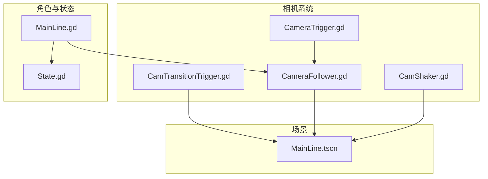
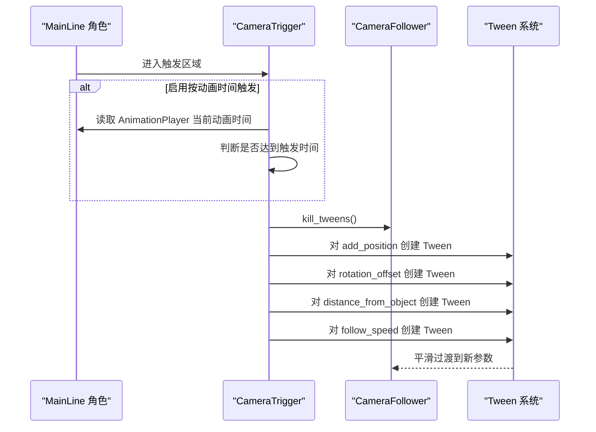
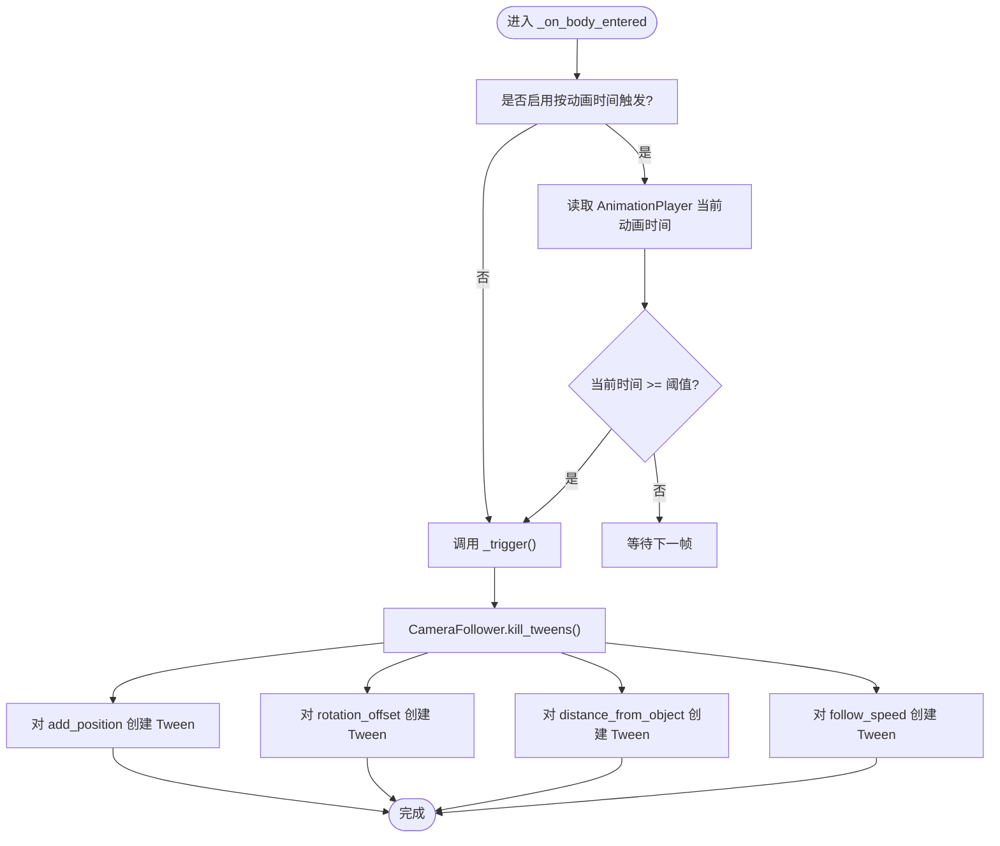
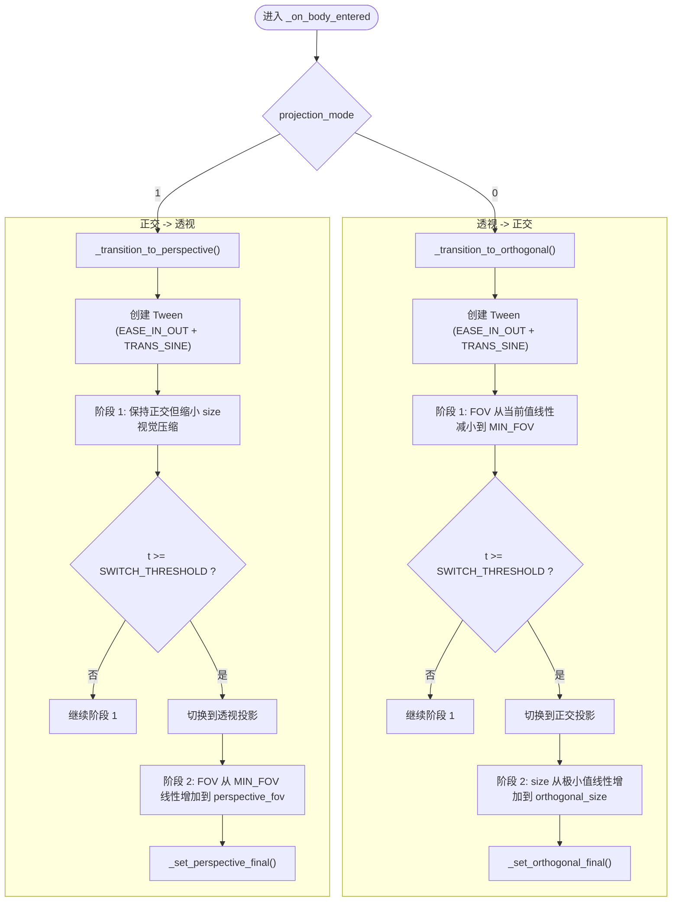
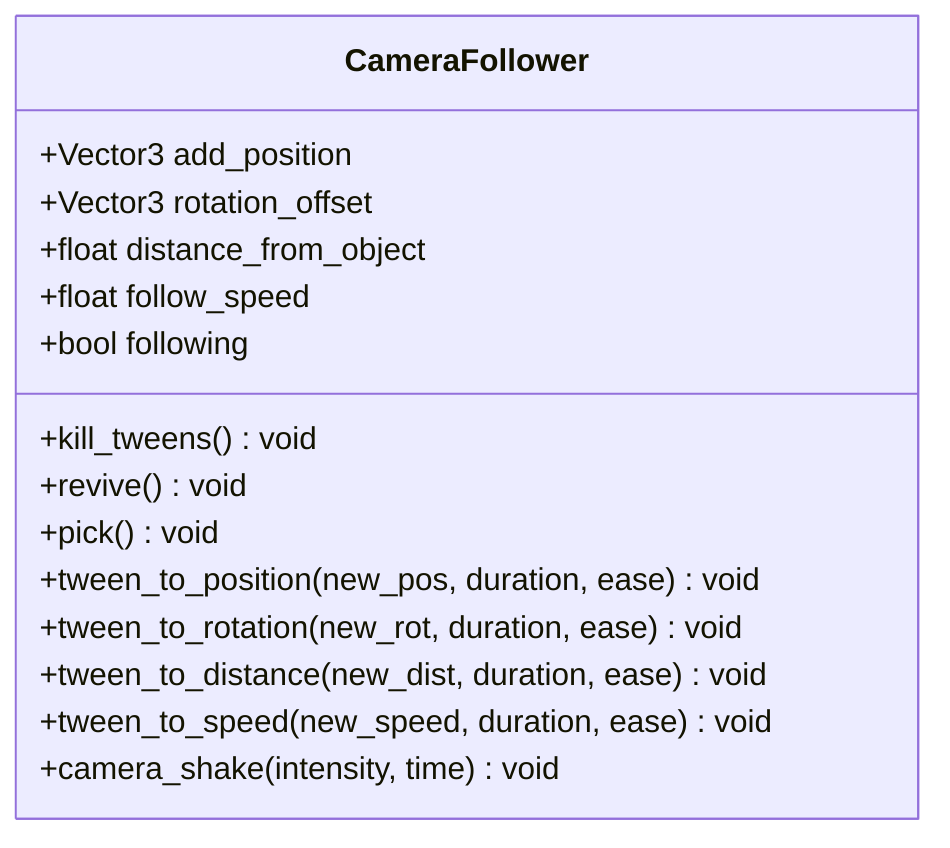
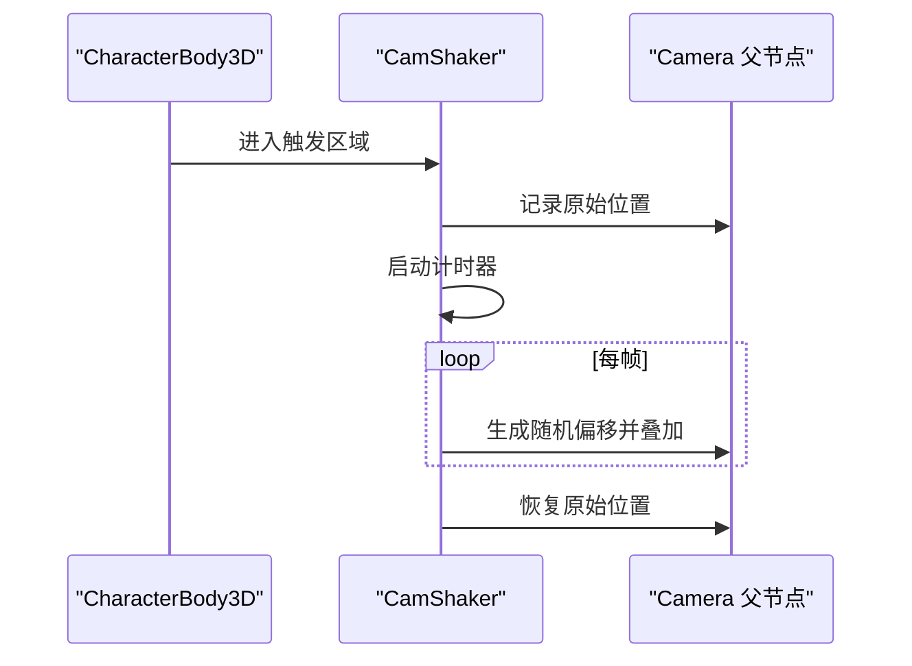
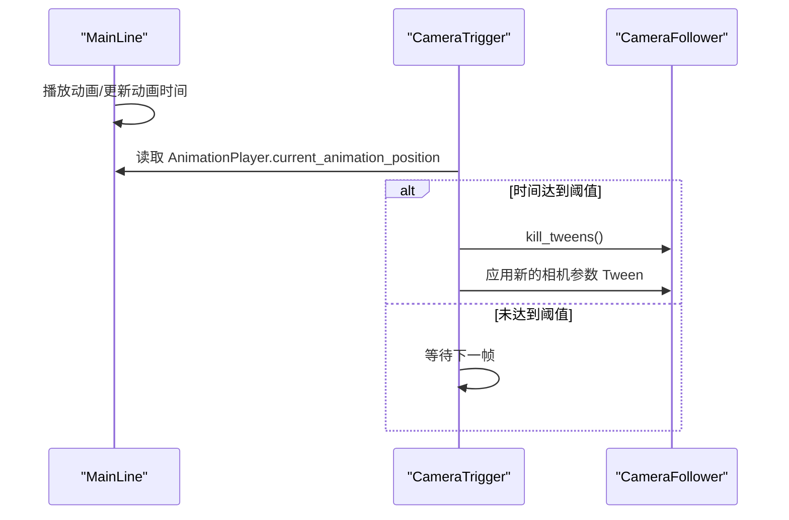
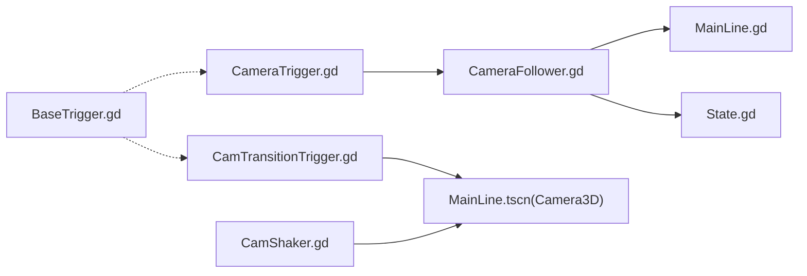

# 相机触发器

<cite>
**本文引用的文件**
- [CameraTrigger.gd](file://#Template/[Scripts]/CameraScripts/CameraTrigger.gd)
- [CamTransitionTrigger.gd](file://#Template/[Scripts]/CameraScripts/CamTransitionTrigger.gd)
- [CameraFollower.gd](file://#Template/[Scripts]/CameraScripts/CameraFollower.gd)
- [CamShaker.gd](file://#Template/[Scripts]/CameraScripts/CamShaker.gd)
- [MainLine.gd](file://#Template/[Scripts]/MainLine.gd)
- [State.gd](file://#Template/[Scripts]/State.gd)
- [BaseTrigger.gd](file://#Template/[Scripts]/Trigger/BaseTrigger.gd)
- [MainLine.tscn](file://#Template/MainLine.tscn)
</cite>

## 更新摘要
**变更内容**
- 新增基于动画时间的精确触发机制，支持按动画进度触发相机参数调整
- 增强多参数同时调整功能，支持位置、旋转、距离、跟随速度的独立控制
- 完善缓动动画系统，提供统一的缓动类型和过渡时长配置
- 优化相机过渡触发器的分阶段插值算法，提升视觉平滑度
- 增强相机震动器的实时抖动控制和状态管理

## 目录
1. [简介](#简介)
2. [项目结构](#项目结构)
3. [核心组件](#核心组件)
4. [架构总览](#架构总览)
5. [详细组件分析](#详细组件分析)
6. [依赖关系分析](#依赖关系分析)
7. [性能考量](#性能考量)
8. [故障排查指南](#故障排查指南)
9. [结论](#结论)
10. [附录](#附录)

## 简介
本文件系统化阐述"相机触发器"与"相机过渡触发器"的设计与实现，重点覆盖以下方面：
- CameraTrigger（相机触发器）如何通过触发区域控制摄像机跟随行为、视角偏移、镜头距离与跟随速度，并支持基于动画时间的精确触发。
- CamTransitionTrigger（相机过渡触发器）如何在正交与透视投影之间进行平滑过渡，包含分阶段插值、缓动函数与阈值切换策略。
- 相机触发器与 MainLine 角色控制系统的协同机制，包括动画时间读取、触发条件与状态恢复。
- 参数配置、触发条件、效果持续时间等关键要素的使用方法与最佳实践。

## 项目结构
围绕相机系统的关键脚本与场景如下：
- 相机控制与触发
  - CameraFollower.gd：负责跟随目标、平滑插值、状态保存/恢复、Tween控制与相机震动。
  - CameraTrigger.gd：基于区域触发，对 CameraFollower 的位置、旋转、距离与速度进行Tween过渡，支持基于动画时间的精确触发。
  - CamTransitionTrigger.gd：在正交/透视投影间进行平滑过渡，含阶段化插值与缓动。
  - CamShaker.gd：对相机父节点施加随机抖动，常用于受击或爆炸等反馈。
- 角色与状态
  - MainLine.gd：角色主体，提供动画播放、转向、死亡等行为，并与相机系统交互。
  - State.gd：全局状态容器，用于跨关卡/场景的状态持久化与恢复。
- 基础触发器框架
  - BaseTrigger.gd：统一的触发器基类，提供过滤器、一次性触发与信号发射能力。

**图表来源**
- [CameraFollower.gd:1-168](file://#Template/[Scripts]/CameraScripts/CameraFollower.gd#L1-L168)
- [CameraTrigger.gd:1-76](file://#Template/[Scripts]/CameraScripts/CameraTrigger.gd#L1-L76)
- [CamTransitionTrigger.gd:1-125](file://#Template/[Scripts]/CameraScripts/CamTransitionTrigger.gd#L1-L125)
- [CamShaker.gd:1-37](file://#Template/[Scripts]/CameraScripts/CamShaker.gd#L1-L37)
- [MainLine.gd:1-251](file://#Template/[Scripts]/MainLine.gd#L1-L251)
- [State.gd:1-22](file://#Template/[Scripts]/State.gd#L1-L22)
- [MainLine.tscn:1-70](file://#Template/MainLine.tscn#L1-L70)

**章节来源**
- [CameraFollower.gd:1-168](file://#Template/[Scripts]/CameraScripts/CameraFollower.gd#L1-L168)
- [CameraTrigger.gd:1-76](file://#Template/[Scripts]/CameraScripts/CameraTrigger.gd#L1-L76)
- [CamTransitionTrigger.gd:1-125](file://#Template/[Scripts]/CameraScripts/CamTransitionTrigger.gd#L1-L125)
- [CamShaker.gd:1-37](file://#Template/[Scripts]/CameraScripts/CamShaker.gd#L1-L37)
- [MainLine.gd:1-251](file://#Template/[Scripts]/MainLine.gd#L1-L251)
- [State.gd:1-22](file://#Template/[Scripts]/State.gd#L1-L22)
- [MainLine.tscn:1-70](file://#Template/MainLine.tscn#L1-L70)

## 核心组件
- CameraFollower.gd
  - 负责跟随目标、平滑插值、状态保存/恢复、Tween控制与相机震动。
  - 关键属性：跟随目标、附加位置、旋转偏移、距离、跟随速度、是否跟随。
  - 关键方法：kill_tweens、revive、pick、tween_to_* 系列、camera_shake。
- CameraTrigger.gd
  - 基于 Area3D 区域触发，向 CameraFollower 应用位置、旋转、距离与速度的Tween过渡。
  - 支持"按动画时间触发"，通过 MainLine 的 AnimationPlayer 当前动画时间判断。
  - 新增多参数独立控制，支持位置、旋转、距离、速度的分别启用/禁用。
- CamTransitionTrigger.gd
  - 在正交/透视投影之间进行平滑过渡，采用两阶段插值与缓动，包含阈值切换。
  - 优化分阶段插值算法，提升视觉平滑度和过渡自然性。
- CamShaker.gd
  - 对相机父节点施加随机抖动，支持强度与持续时间配置。
  - 改进实时抖动控制，提供更好的性能表现。
- MainLine.gd 与 State.gd
  - 提供动画播放、转向、死亡等行为；State 用于跨场景状态持久化与恢复。
- BaseTrigger.gd
  - 通用触发器基类，提供过滤器、一次性触发与信号发射能力。

**章节来源**
- [CameraFollower.gd:1-168](file://#Template/[Scripts]/CameraScripts/CameraFollower.gd#L1-L168)
- [CameraTrigger.gd:1-76](file://#Template/[Scripts]/CameraScripts/CameraTrigger.gd#L1-L76)
- [CamTransitionTrigger.gd:1-125](file://#Template/[Scripts]/CameraScripts/CamTransitionTrigger.gd#L1-L125)
- [CamShaker.gd:1-37](file://#Template/[Scripts]/CameraScripts/CamShaker.gd#L1-L37)
- [MainLine.gd:1-251](file://#Template/[Scripts]/MainLine.gd#L1-L251)
- [State.gd:1-22](file://#Template/[Scripts]/State.gd#L1-L22)
- [BaseTrigger.gd:1-102](file://#Template/[Scripts]/Trigger/BaseTrigger.gd#L1-L102)

## 架构总览
相机触发器与角色控制系统的协作流程如下：
- 角色 MainLine 控制移动与动画播放，同时维护动画时间。
- CameraTrigger 侦测角色进入触发区域，若启用"按动画时间触发"，则读取 MainLine 的 AnimationPlayer 当前动画时间，达到阈值后触发。
- CameraTrigger 调用 CameraFollower.kill_tweens 停止旧动画，随后对 add_position、rotation_offset、distance_from_object、follow_speed 分别创建 Tween，应用缓动与持续时间。
- CamTransitionTrigger 在角色进入触发区域时，根据投影模式选择过渡路径，分阶段插值并设置最终状态。

**图表来源**
- [CameraTrigger.gd:27-76](file://#Template/[Scripts]/CameraScripts/CameraTrigger.gd#L27-L76)
- [CameraFollower.gd:74-148](file://#Template/[Scripts]/CameraScripts/CameraFollower.gd#L74-L148)
- [MainLine.gd:168-184](file://#Template/[Scripts]/MainLine.gd#L168-L184)

**章节来源**
- [CameraTrigger.gd:27-76](file://#Template/[Scripts]/CameraScripts/CameraTrigger.gd#L27-L76)
- [CameraFollower.gd:74-148](file://#Template/[Scripts]/CameraScripts/CameraFollower.gd#L74-L148)
- [MainLine.gd:168-184](file://#Template/[Scripts]/MainLine.gd#L168-L184)

## 详细组件分析

### CameraTrigger（相机触发器）
- 触发条件
  - 默认仅当角色进入触发区域时触发；若启用"按动画时间触发"，则需满足 AnimationPlayer 当前动画时间大于等于设定阈值。
  - 新增触发状态管理，防止重复触发同一事件。
- 触发动作
  - 调用 CameraFollower.kill_tweens 停止正在进行的 Tween。
  - 对以下参数分别创建 Tween：
    - 位置偏移（add_position）
    - 旋转偏移（rotation_offset）
    - 距离（distance_from_object）
    - 跟随速度（follow_speed）
  - 使用统一的缓动类型与过渡时长。
- 参数要点
  - set_camera：指向 CameraFollower 的节点路径。
  - active_*：开关各参数的过渡。
  - new_*：目标值。
  - ease_type：缓动类型。
  - need_time：过渡时长。
  - use_time / trigger_time：按动画时间触发的开关与阈值。

**图表来源**
- [CameraTrigger.gd:27-76](file://#Template/[Scripts]/CameraScripts/CameraTrigger.gd#L27-L76)
- [CameraFollower.gd:74-82](file://#Template/[Scripts]/CameraScripts/CameraFollower.gd#L74-L82)

**章节来源**
- [CameraTrigger.gd:1-76](file://#Template/[Scripts]/CameraScripts/CameraTrigger.gd#L1-L76)
- [CameraFollower.gd:74-82](file://#Template/[Scripts]/CameraScripts/CameraFollower.gd#L74-L82)

### CamTransitionTrigger（相机过渡触发器）
- 功能概述
  - 在正交与透视投影之间进行平滑过渡，包含两个阶段：
    - 透视 → 正交：先将 FOV 缩小至超长焦（接近正交观感），再切换投影并调整 size。
    - 正交 → 透视：先在正交下缩小 size（视觉压缩），再切换投影并增大 FOV 至目标视角。
  - 使用阈值（SWITCH_THRESHOLD）划分阶段，配合缓动函数实现自然过渡。
- 关键参数
  - transition_duration：过渡总时长。
  - orthogonal_size / perspective_fov：目标正交 size 与透视 FOV。
  - projection_mode：0 表示切换到正交，1 表示切换到透视。
- 执行流程
  - 根据 projection_mode 选择过渡路径。
  - 创建 Tween，设置缓动与过渡类型。
  - 使用 tween_method 插值，结合阈值分阶段更新投影与视图参数。
  - 过渡完成后设置最终状态。

**图表来源**
- [CamTransitionTrigger.gd:21-125](file://#Template/[Scripts]/CameraScripts/CamTransitionTrigger.gd#L21-L125)

**章节来源**
- [CamTransitionTrigger.gd:1-125](file://#Template/[Scripts]/CameraScripts/CamTransitionTrigger.gd#L1-L125)

### CameraFollower（相机跟随器）
- 跟随与插值
  - 每帧根据目标位置与附加偏移计算基础变换，使用球面线性插值（slerp）平滑移动。
  - 支持暂停跟随（如角色停止时）并清理 Tween。
- 状态管理
  - 提供 pick/revive 保存/恢复相机参数，便于状态快照与回滚。
  - 提供 kill_tweens 清理所有正在进行的 Tween。
- 动画过渡
  - 提供 tween_to_* 系列方法，封装对 add_position、rotation_offset、distance_from_object、follow_speed 的 Tween 动画。
- 相机震动
  - camera_shake 通过在短时间内对相机父节点位置施加随机偏移，实现震动效果。

**图表来源**
- [CameraFollower.gd:1-168](file://#Template/[Scripts]/CameraScripts/CameraFollower.gd#L1-L168)

**章节来源**
- [CameraFollower.gd:1-168](file://#Template/[Scripts]/CameraScripts/CameraFollower.gd#L1-L168)

### CamShaker（相机震动器）
- 触发条件
  - 仅对 CharacterBody3D 生效。
- 执行流程
  - 记录相机父节点原始位置，启动计时器。
  - 在计时期间每帧生成随机偏移并叠加到父节点位置。
  - 计时结束时恢复原位。

**图表来源**
- [CamShaker.gd:30-37](file://#Template/[Scripts]/CameraScripts/CamShaker.gd#L30-L37)

**章节来源**
- [CamShaker.gd:1-37](file://#Template/[Scripts]/CameraScripts/CamShaker.gd#L1-L37)

### 与 MainLine 角色控制系统的协调
- 动画时间驱动
  - CameraTrigger 在启用"按动画时间触发"时，从 MainLine 的 AnimationPlayer 读取当前动画时间，达到阈值后触发。
- 角色行为
  - MainLine 提供 turn、reload、die 等方法，控制角色转向、重载与死亡。
  - MainLine 维护动画播放与状态，为相机触发器提供时间基准。
- 状态持久化
  - State 提供跨场景的状态存储与恢复，CameraFollower 支持从 State 恢复相机参数。

**图表来源**
- [CameraTrigger.gd:32-43](file://#Template/[Scripts]/CameraScripts/CameraTrigger.gd#L32-L43)
- [MainLine.gd:168-184](file://#Template/[Scripts]/MainLine.gd#L168-L184)

**章节来源**
- [CameraTrigger.gd:32-43](file://#Template/[Scripts]/CameraScripts/CameraTrigger.gd#L32-L43)
- [MainLine.gd:168-184](file://#Template/[Scripts]/MainLine.gd#L168-L184)
- [State.gd:1-22](file://#Template/[Scripts]/State.gd#L1-L22)

## 依赖关系分析
- CameraTrigger 依赖 CameraFollower 的 Tween 接口与状态字段。
- CamTransitionTrigger 依赖场景中的 Camera3D 节点与投影切换接口。
- CameraFollower 依赖 MainLine 的动画时间与状态。
- CamShaker 依赖相机父节点的位置修改。
- BaseTrigger 提供通用触发器基类能力，可作为其他触发器的基类扩展。

**图表来源**
- [CameraTrigger.gd:19-76](file://#Template/[Scripts]/CameraScripts/CameraTrigger.gd#L19-L76)
- [CamTransitionTrigger.gd:8-9](file://#Template/[Scripts]/CameraScripts/CamTransitionTrigger.gd#L8-L9)
- [CameraFollower.gd:10-11](file://#Template/[Scripts]/CameraScripts/CameraFollower.gd#L10-L11)
- [MainLine.gd:21-21](file://#Template/[Scripts]/MainLine.gd#L21-L21)
- [State.gd:4-9](file://#Template/[Scripts]/State.gd#L4-L9)
- [CamShaker.gd:3-5](file://#Template/[Scripts]/CameraScripts/CamShaker.gd#L3-L5)
- [BaseTrigger.gd:1-102](file://#Template/[Scripts]/Trigger/BaseTrigger.gd#L1-L102)

**章节来源**
- [CameraTrigger.gd:19-76](file://#Template/[Scripts]/CameraScripts/CameraTrigger.gd#L19-L76)
- [CamTransitionTrigger.gd:8-9](file://#Template/[Scripts]/CameraScripts/CamTransitionTrigger.gd#L8-L9)
- [CameraFollower.gd:10-11](file://#Template/[Scripts]/CameraScripts/CameraFollower.gd#L10-L11)
- [MainLine.gd:21-21](file://#Template/[Scripts]/MainLine.gd#L21-L21)
- [State.gd:4-9](file://#Template/[Scripts]/State.gd#L4-L9)
- [CamShaker.gd:3-5](file://#Template/[Scripts]/CameraScripts/CamShaker.gd#L3-L5)
- [BaseTrigger.gd:1-102](file://#Template/[Scripts]/Trigger/BaseTrigger.gd#L1-L102)

## 性能考量
- Tween 复用与清理
  - CameraTrigger 在每次触发前调用 kill_tweens，避免多个 Tween 并行导致的资源浪费与状态冲突。
- 插值效率
  - CameraFollower 使用 slerp 平滑移动，delta 驱动的插值保证帧率无关的顺滑体验。
- 过渡阶段化
  - CamTransitionTrigger 将投影切换拆分为两个阶段，降低单次切换的视觉冲击，同时减少计算复杂度。
- 动画时间读取
  - CameraTrigger 仅在启用按动画时间触发时读取 AnimationPlayer 的当前时间，避免不必要的开销。
- 实时抖动优化
  - CamShaker 改进的实时抖动控制，减少每帧计算开销。

## 故障排查指南
- 触发无效
  - 确认触发器是否正确连接 body_entered 信号；检查 one_shot 与触发过滤器设置。
  - 若启用按动画时间触发，确认 MainLine 的 AnimationPlayer 是否存在且正在播放。
- 相机不跟随
  - 检查 CameraFollower 的 player_node 是否正确绑定；确认 following 未被意外置为 false。
- 过渡异常
  - 检查 CamTransitionTrigger 的 camera 引用是否有效；确认 projection_mode 与目标参数设置合理。
- 抖动无效
  - 确认 CamShaker 的 camera_parent 是否正确绑定；检查强度与持续时间参数。
- 多参数调整问题
  - 检查各 active_* 参数是否正确设置；确认 new_* 目标值范围合理。

**章节来源**
- [BaseTrigger.gd:29-102](file://#Template/[Scripts]/Trigger/BaseTrigger.gd#L29-L102)
- [CameraFollower.gd:30-53](file://#Template/[Scripts]/CameraScripts/CameraFollower.gd#L30-L53)
- [CamTransitionTrigger.gd:17-20](file://#Template/[Scripts]/CameraScripts/CamTransitionTrigger.gd#L17-L20)
- [CamShaker.gd:10-37](file://#Template/[Scripts]/CameraScripts/CamShaker.gd#L10-L37)

## 结论
- CameraTrigger 通过 Area3D 触发与 Tween 动画，实现了对相机位置、旋转、距离与速度的可控过渡，并支持基于动画时间的精确触发。
- CamTransitionTrigger 通过分阶段插值与缓动，提供了正交/透视投影间的自然过渡。
- CameraFollower 作为相机控制中枢，承担了平滑插值、状态管理与动画协调职责。
- CamShaker 为相机系统提供了即时反馈的震动效果。
- 与 MainLine 的协同确保了相机行为与角色动画的同步，State 则保障了跨场景状态的一致性。

## 附录

### 参数配置与使用示例（步骤式说明）
- 配置 CameraTrigger
  - 设置 set_camera 指向 CameraFollower。
  - 开启 active_position/active_rotate/active_distance/active_speed 以启用对应参数的过渡。
  - 设定 new_* 为目标值，ease_type 与 need_time 控制缓动与时长。
  - 如需按动画时间触发，启用 use_time 并设置 trigger_time。
- 配置 CamTransitionTrigger
  - 设置 transition_duration、orthogonal_size、perspective_fov。
  - 设置 projection_mode（0 为正交，1 为透视）。
  - 确保 camera 引用指向场景中的 Camera3D。
- 配置 CameraFollower
  - 设置 player 指向 MainLine。
  - 调整 add_position、rotation_offset、distance_from_object、follow_speed 的初始值。
  - 如需临时禁用跟随，可将 following 置为 false。
- 配置 CamShaker
  - 设置 camera_parent 为 Camera3D 的父节点。
  - 调整 shake_intensity 与 shake_duration。

**章节来源**
- [CameraTrigger.gd:3-17](file://#Template/[Scripts]/CameraScripts/CameraTrigger.gd#L3-L17)
- [CamTransitionTrigger.gd:3-9](file://#Template/[Scripts]/CameraScripts/CamTransitionTrigger.gd#L3-L9)
- [CameraFollower.gd:3-8](file://#Template/[Scripts]/CameraScripts/CameraFollower.gd#L3-L8)
- [CamShaker.gd:3-5](file://#Template/[Scripts]/CameraScripts/CamShaker.gd#L3-L5)