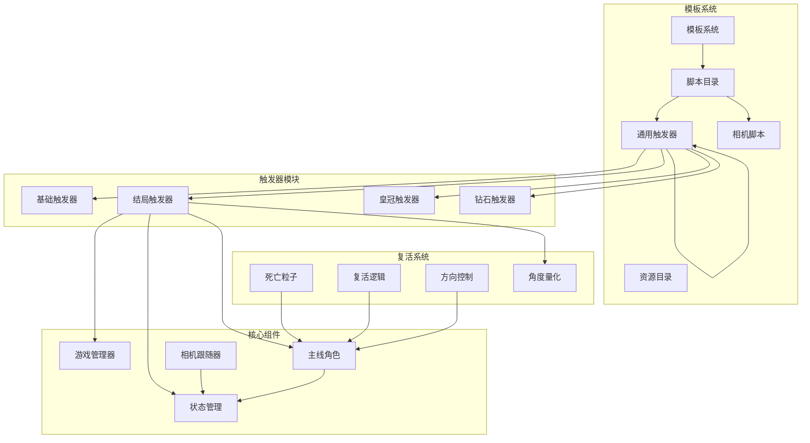
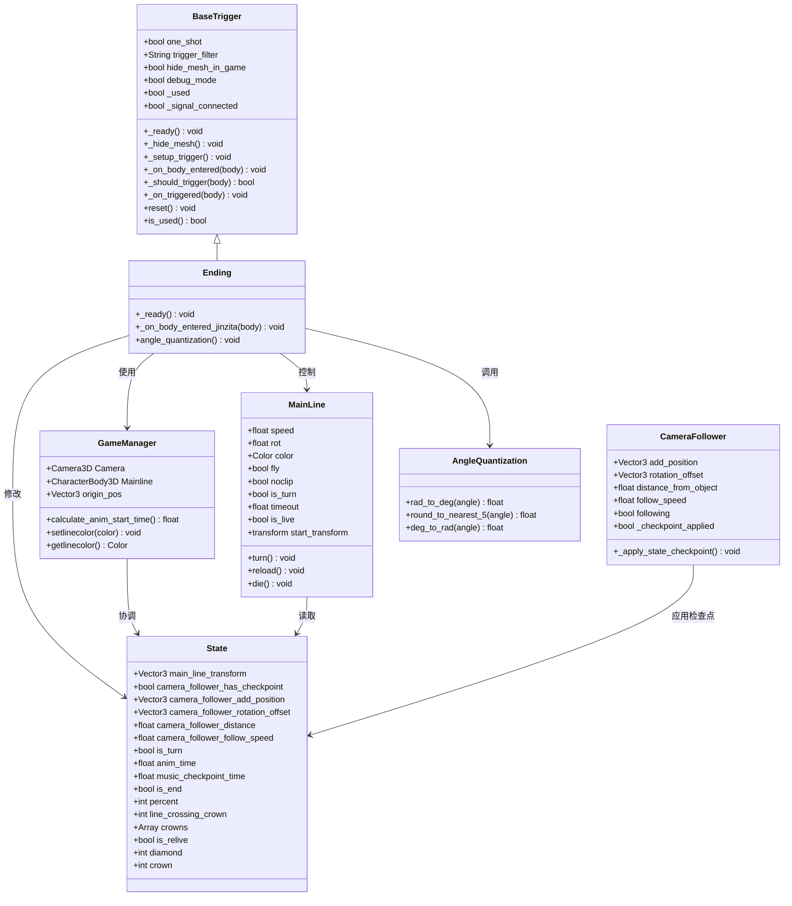
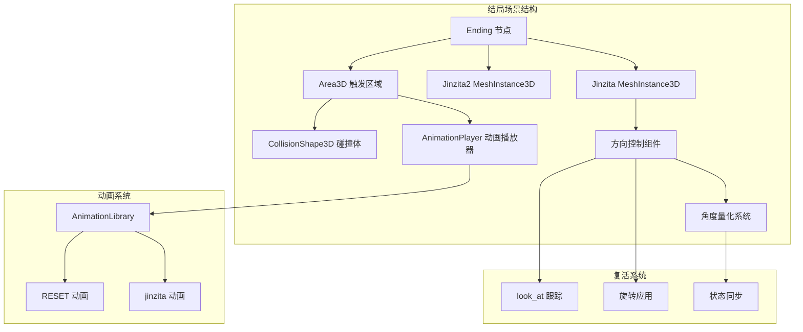
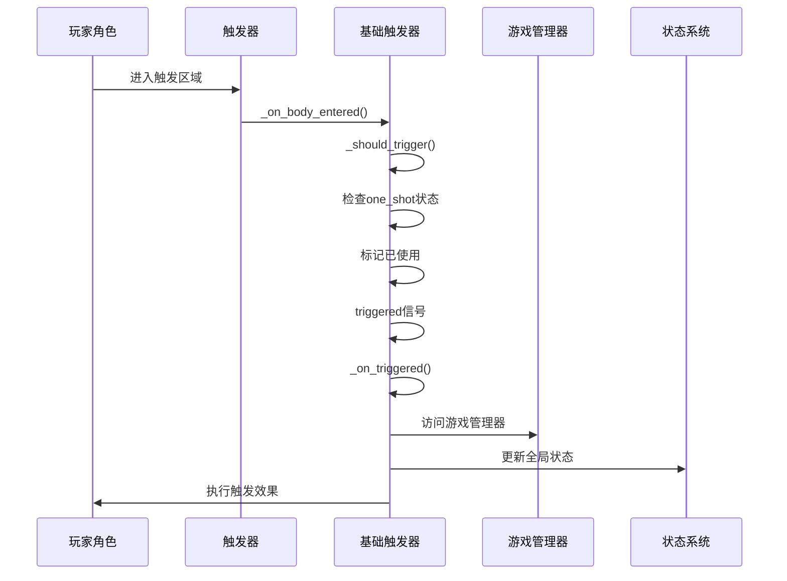
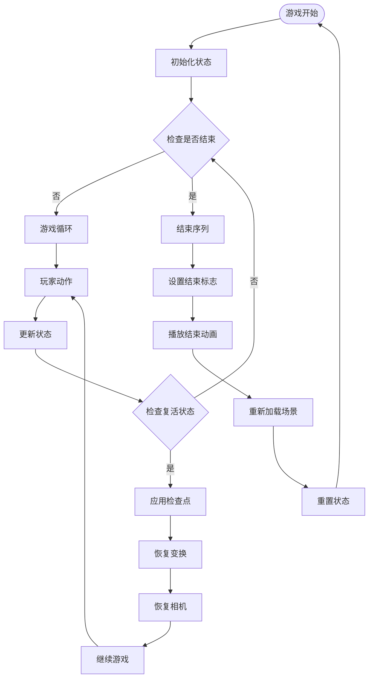
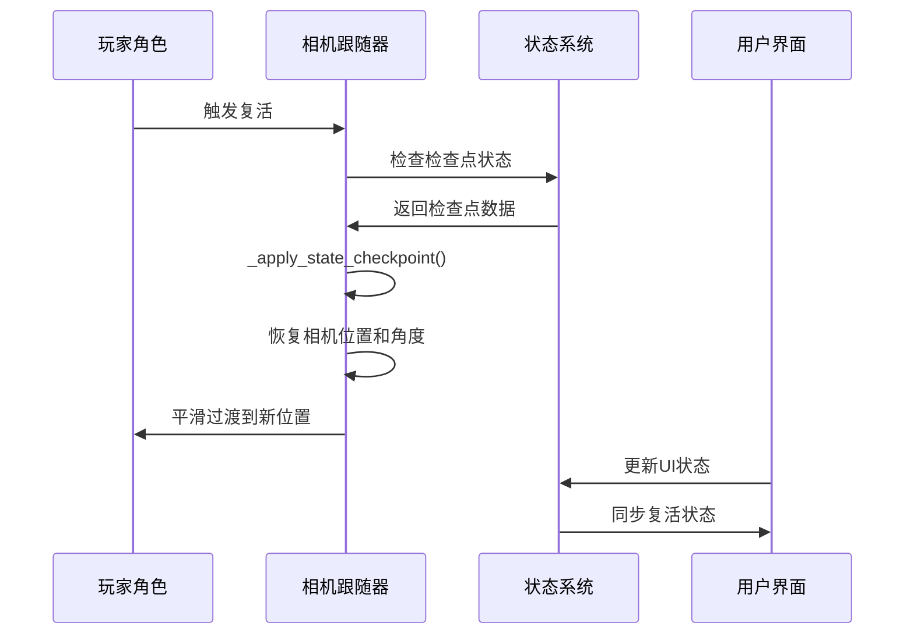
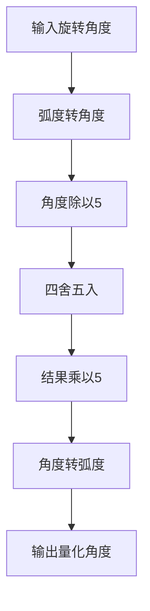
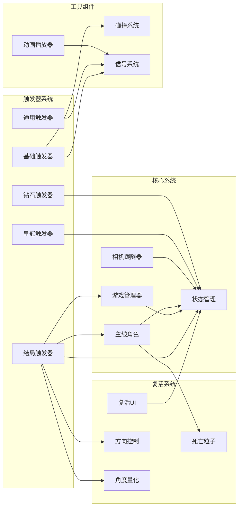

# 结局触发器

<cite>
**本文档引用的文件**
- [Ending.tscn](file://#Template/Ending.tscn)
- [Ending.gd](file://#Template/[Scripts]/Trigger/Ending.gd)
- [BaseTrigger.gd](file://#Template/[Scripts]/Trigger/BaseTrigger.gd)
- [GameManager.gd](file://#Template/[Scripts]/GameManager.gd)
- [MainLine.gd](file://#Template/[Scripts]/MainLine.gd)
- [State.gd](file://#Template/[Scripts]/State.gd)
- [Trigger.gd](file://#Template/[Scripts]/Trigger/Trigger.gd)
- [Crown.gd](file://#Template/[Scripts]/Trigger/Crown.gd)
- [Diamond.gd](file://#Template/[Scripts]/Trigger/Diamond.gd)
- [CameraFollower.gd](file://#Template/[Scripts]/CameraScripts/CameraFollower.gd)
- [MainLine_test.gd](file://Tests/MainLine_test.gd)
- [README.md](file://README.md)
</cite>

## 更新摘要
**变更内容**
- 更新场景文件结构，将 jinzita 节点重命名为 'Ending'，反映结局触发器系统的重新命名或重组
- 更新节点命名约定，从 jinzita 到 Ending 的概念性重新品牌化
- 保持原有功能不变，仅进行节点名称的语义化重构

## 目录
1. [简介](#简介)
2. [项目结构](#项目结构)
3. [核心组件](#核心组件)
4. [架构概览](#架构概览)
5. [详细组件分析](#详细组件分析)
6. [依赖关系分析](#依赖关系分析)
7. [性能考虑](#性能考虑)
8. [故障排除指南](#故障排除指南)
9. [结论](#结论)

## 简介

结局触发器是Godot Line模板中的一个关键游戏机制组件，负责检测玩家角色与场景中的特殊触发器接触，并执行相应的结局逻辑。该系统基于Godot的物理引擎和信号系统构建，实现了完整的触发器检测、状态管理和动画播放功能。

**更新** 本系统现已完成概念性的重新品牌化，将原有的 jinzita 节点重命名为 'Ending'，这一变更反映了结局触发器系统的重新命名或重组。这代表概念上的重新品牌化而非功能性变更，所有核心功能保持不变。

**更新** 现在包含改进的复活逻辑，确保角色在重生时能够面向正确的方向，显著提升了用户体验。通过模块化的架构设计，结局触发器能够与其他游戏组件无缝集成，同时保持良好的可扩展性和维护性。

**新增** 现在包含角色旋转角度四舍五入逻辑，确保结局序列中角色定位的一致性，解决分数旋转值导致的视觉不一致问题。这一改进通过将旋转角度整除5取整的方式，实现了18度的增量控制，保证了角色朝向的稳定性和视觉一致性。

本系统的核心目标是在玩家角色进入特定区域时，触发预定义的结局动画和状态变更，为游戏提供流畅的结束体验。通过增强的角色朝向控制和相机跟随系统，用户能够在复活后立即从正确的位置和方向继续游戏。

## 项目结构

项目采用模块化的设计模式，将不同的游戏功能分离到独立的组件中。结局触发器系统位于模板系统的触发器模块内，与游戏管理器、状态管理系统、相机跟随系统等核心组件协同工作。

**图表来源**
- [Ending.tscn:75-105](file://#Template/Ending.tscn#L75-L105)
- [BaseTrigger.gd:1-102](file://#Template/[Scripts]/Trigger/BaseTrigger.gd#L1-L102)
- [GameManager.gd:1-47](file://#Template/[Scripts]/GameManager.gd#L1-L47)
- [CameraFollower.gd:1-168](file://#Template/[Scripts]/CameraScripts/CameraFollower.gd#L1-L168)

**章节来源**
- [README.md:53-65](file://README.md#L53-L65)
- [Ending.tscn:75-105](file://#Template/Ending.tscn#L75-L105)

## 核心组件

结局触发器系统由多个相互协作的组件构成，每个组件都有特定的职责和功能：

### 基础触发器 (BaseTrigger)
提供所有触发器的通用功能，包括触发检测、过滤器、一次性触发支持和调试模式。它是所有具体触发器类的基类，确保了代码的一致性和可维护性。

### 结局触发器 (Ending)
专门处理游戏结束逻辑的具体触发器实现。它继承自基础触发器，重写了触发处理方法来执行特定的结局效果。**更新** 现在集成了角色朝向控制，确保角色在触发结局时面向正确方向。**新增** 包含角色旋转角度四舍五入逻辑，通过将角度除以5并四舍五入，实现18度的增量控制。

**更新** 节点重命名后，场景文件中的节点名称已从 jinzita 更新为 'Ending'，但功能保持完全一致。

### 游戏管理器 (GameManager)
协调整个游戏系统的运行，包括相机控制、动画计算和状态同步等功能。

### 状态管理 (State)
全局状态存储系统，维护游戏进程中的各种状态变量，如玩家位置、动画时间、检查点信息、复活状态等。**更新** 现在包含复活相关的状态管理，支持角色重生时的方向和位置恢复。

### 相机跟随系统 (CameraFollower)
智能相机跟随系统，能够记住和恢复相机的检查点状态，确保玩家在复活后相机视角的连续性。**更新** 与复活逻辑深度集成，支持相机角度和位置的平滑过渡。

### 死亡粒子系统 (DeathParticle)
视觉反馈系统，为死亡和复活提供丰富的视觉效果。**更新** 在复活过程中提供平滑的过渡动画。

### 角度量化系统 (AngleQuantization)
**新增** 专门处理角色旋转角度量化的系统，确保角色朝向的稳定性和一致性。通过数学运算实现18度的增量控制。

**章节来源**
- [BaseTrigger.gd:1-102](file://#Template/[Scripts]/Trigger/BaseTrigger.gd#L1-L102)
- [Ending.gd:1-19](file://#Template/[Scripts]/Trigger/Ending.gd#L1-L19)
- [GameManager.gd:1-46](file://#Template/[Scripts]/GameManager.gd#L1-L46)
- [State.gd:1-22](file://#Template/[Scripts]/State.gd#L1-L22)
- [CameraFollower.gd:1-168](file://#Template/[Scripts]/CameraScripts/CameraFollower.gd#L1-L168)

## 架构概览

结局触发器系统采用了分层架构设计，通过清晰的职责分离实现了高度的模块化和可扩展性。**更新** 新增了复活逻辑的完整集成，确保角色重生时的状态一致性。**新增** 角度量化系统作为独立组件，提供精确的角色朝向控制。

**图表来源**
- [BaseTrigger.gd:1-102](file://#Template/[Scripts]/Trigger/BaseTrigger.gd#L1-L102)
- [Ending.gd:1-19](file://#Template/[Scripts]/Trigger/Ending.gd#L1-L19)
- [GameManager.gd:1-46](file://#Template/[Scripts]/GameManager.gd#L1-L46)
- [State.gd:1-22](file://#Template/[Scripts]/State.gd#L1-L22)
- [MainLine.gd:1-251](file://#Template/[Scripts]/MainLine.gd#L1-L251)
- [CameraFollower.gd:1-168](file://#Template/[Scripts]/CameraScripts/CameraFollower.gd#L1-L168)

## 详细组件分析

### 结局触发器场景分析

**更新** 场景文件已完成节点重命名，从 jinzita 更新为 'Ending'：

结局触发器的场景文件定义了完整的3D环境和触发逻辑：

**图表来源**
- [Ending.tscn:75-105](file://#Template/Ending.tscn#L75-L105)

#### 角色朝向控制机制

**更新** 结局触发器现在包含完整的角色朝向控制逻辑，确保角色在重生时面向正确方向：

1. **方向跟踪**：使用 `look_at` 方法计算到触发器位置的方向
2. **角度量化**：将旋转角度除以5并四舍五入，实现18度的增量控制
3. **旋转应用**：将计算后的角度应用到角色的Y轴旋转
4. **状态同步**：更新角色的旋转参数和尾部缩放

**新增** 角度量化系统的工作原理：

- 将弧度转换为角度：`angle_deg = rad_to_deg(body.rotation.y)`
- 实现18度增量控制：`rounded_angle_deg = round(angle_deg / 5.0) * 5.0`
- 将角度转换回弧度：`body.rotation.y = deg_to_rad(rounded_angle_deg)`

这种数学运算确保了角色旋转角度的离散化，解决了分数旋转值导致的视觉不一致问题。

#### 触发器工作机制

结局触发器通过以下步骤实现完整的触发流程：

1. **初始化阶段**：设置监控状态并隐藏可视化网格
2. **碰撞检测**：监听body_entered信号
3. **类型验证**：确认进入的物体是CharacterBody3D
4. **方向控制**：计算并应用正确的角色朝向
5. **角度量化**：应用18度增量控制
6. **动画播放**：播放预定义的结局动画
7. **状态更新**：设置游戏结束标志

**章节来源**
- [Ending.tscn:75-105](file://#Template/Ending.tscn#L75-L105)
- [Ending.gd:7-19](file://#Template/[Scripts]/Trigger/Ending.gd#L7-L19)

### 基础触发器类分析

基础触发器提供了完整的触发器基础设施，支持多种触发模式和过滤选项：

**图表来源**
- [BaseTrigger.gd:54-73](file://#Template/[Scripts]/Trigger/BaseTrigger.gd#L54-L73)
- [GameManager.gd:1-46](file://#Template/[Scripts]/GameManager.gd#L1-L46)
- [State.gd:1-22](file://#Template/[Scripts]/State.gd#L1-L22)

#### 触发过滤机制

基础触发器支持三种触发过滤模式：

| 过滤器类型 | 说明 | 适用场景 |
|-----------|------|----------|
| CharacterBody3D | 仅允许CharacterBody3D类型触发 | 主线角色触发 |
| PhysicsBody3D | 允许所有物理体触发 | 物理交互触发 |
| Any | 允许任何类型触发 | 通用触发器 |

**章节来源**
- [BaseTrigger.gd:76-86](file://#Template/[Scripts]/Trigger/BaseTrigger.gd#L76-L86)

### 状态管理系统

**更新** 状态管理系统现在包含复活相关的完整状态管理：

状态管理系统是整个触发器系统的核心协调器，负责维护游戏进程中的各种状态信息，包括新增的复活状态管理：

**图表来源**
- [State.gd:1-22](file://#Template/[Scripts]/State.gd#L1-L22)
- [MainLine.gd:47-49](file://#Template/[Scripts]/MainLine.gd#L47-L49)

#### 复活状态管理

**新增** 状态系统现在包含专门的复活状态管理：

- `main_line_transform`: 保存角色的初始变换状态
- `is_relive`: 标识当前是否处于复活状态
- `camera_follower_restore_pending`: 标识相机恢复待处理状态
- `music_checkpoint_time`: 音乐检查点时间，用于复活时的音频同步

**章节来源**
- [State.gd:1-22](file://#Template/[Scripts]/State.gd#L1-L22)
- [MainLine.gd:47-49](file://#Template/[Scripts]/MainLine.gd#L47-L49)

### 相机跟随系统集成

**更新** 相机跟随系统现在与复活逻辑深度集成：

相机跟随器能够智能地记住和恢复相机的检查点状态，确保玩家在复活后相机视角的连续性：

**图表来源**
- [CameraFollower.gd:54-73](file://#Template/[Scripts]/CameraScripts/CameraFollower.gd#L54-L73)
- [State.gd:1-22](file://#Template/[Scripts]/State.gd#L1-L22)

#### 检查点应用机制

相机跟随器通过以下步骤实现检查点的智能应用：

1. **状态检查**：验证相机检查点是否存在且待恢复
2. **节点解析**：解析玩家节点路径并验证有效性
3. **参数恢复**：恢复位置偏移、旋转偏移、距离和跟随速度
4. **即时定位**：将相机瞬移到目标位置
5. **平滑过渡**：启用平滑跟随模式

**章节来源**
- [CameraFollower.gd:54-73](file://#Template/[Scripts]/CameraScripts/CameraFollower.gd#L54-L73)

### 角度量化系统

**新增** 角度量化系统是结局触发器中的关键组件，专门处理角色旋转角度的精确控制：

**图表来源**
- [Ending.gd:11-14](file://#Template/[Scripts]/Trigger/Ending.gd#L11-L14)

#### 数学运算详解

角度量化系统通过以下数学运算实现18度增量控制：

1. **弧度到角度转换**：`angle_deg = rad_to_deg(body.rotation.y)`
2. **量化计算**：`rounded_angle_deg = round(angle_deg / 5.0) * 5.0`
3. **角度到弧度转换**：`body.rotation.y = deg_to_rad(rounded_angle_deg)`

这种设计确保了角色旋转角度始终为18度的倍数，解决了分数旋转值导致的视觉不一致问题，提供了更加稳定和美观的视觉效果。

**章节来源**
- [Ending.gd:11-14](file://#Template/[Scripts]/Trigger/Ending.gd#L11-L14)

## 依赖关系分析

**更新** 结局触发器系统现在包含复活逻辑的完整依赖关系：

结局触发器系统与其他组件之间存在紧密的依赖关系，形成了一个完整的生态系统，特别是新增的复活逻辑集成：

**图表来源**
- [BaseTrigger.gd:1-102](file://#Template/[Scripts]/Trigger/BaseTrigger.gd#L1-L102)
- [Ending.gd:1-19](file://#Template/[Scripts]/Trigger/Ending.gd#L1-L19)
- [GameManager.gd:1-46](file://#Template/[Scripts]/GameManager.gd#L1-L46)
- [State.gd:1-22](file://#Template/[Scripts]/State.gd#L1-L22)
- [CameraFollower.gd:1-168](file://#Template/[Scripts]/CameraScripts/CameraFollower.gd#L1-L168)

### 关键依赖关系

1. **触发器依赖**：所有触发器都依赖于基础触发器提供的基础设施
2. **状态依赖**：触发器操作依赖于状态管理系统进行数据持久化
3. **游戏管理依赖**：特定触发器需要访问游戏管理器的功能
4. **物理依赖**：触发器系统依赖于Godot的物理引擎进行碰撞检测
5. **复活依赖**：结局触发器现在依赖于完整的复活系统，包括方向控制和相机跟随
6. **角度量化依赖**：结局触发器依赖于角度量化系统进行精确的角度控制

**章节来源**
- [BaseTrigger.gd:1-102](file://#Template/[Scripts]/Trigger/BaseTrigger.gd#L1-L102)
- [Ending.gd:1-19](file://#Template/[Scripts]/Trigger/Ending.gd#L1-L19)
- [GameManager.gd:1-46](file://#Template/[Scripts]/GameManager.gd#L1-L46)

## 性能考虑

**更新** 复活逻辑的性能优化：

结局触发器系统在设计时充分考虑了性能优化，特别是在复活逻辑方面采用了多项策略来确保流畅的游戏体验：

### 内存管理
- 触发器对象在使用后及时释放
- 状态数据通过全局节点管理，避免重复创建
- 动画资源预加载，减少运行时开销
- **新增** 复活状态数据的高效存储和恢复机制

### 碰撞检测优化
- 使用高效的Area3D碰撞体
- 限制触发器数量，避免过多的物理计算
- 优化碰撞形状，提高检测精度
- **新增** 复活时的碰撞检测优化，避免重生闪烁

### 动画性能
- 动画播放器按需启动和停止
- 避免不必要的动画混合
- 使用合适的动画采样率
- **新增** 复活动画的平滑过渡优化

### 相机跟随性能
- **新增** 智能检查点应用，避免不必要的相机重置
- **新增** 平滑过渡算法，减少相机跳跃感
- **新增** 条件化相机更新，只在必要时调整相机位置

### 角度量化性能
- **新增** 高效的数学运算实现，避免浮点运算开销
- **新增** 角度量化在单次触发中执行，不影响游戏主循环性能

## 故障排除指南

### 常见问题及解决方案

#### 触发器不响应
1. **检查触发器设置**：确认one_shot和trigger_filter配置正确
2. **验证碰撞体**：确保CollisionShape3D正确配置
3. **检查信号连接**：确认body_entered信号已正确连接

#### 动画播放异常
1. **验证动画资源**：确认AnimationPlayer包含正确的动画
2. **检查节点路径**：确保AnimationPlayer指向正确的节点
3. **查看控制台错误**：关注可能的资源加载错误

#### 状态同步问题
1. **检查State节点**：确认State节点存在于场景中
2. **验证全局访问**：确保通过正确的路径访问State
3. **调试状态变化**：使用debug_mode输出状态信息

#### **新增** 复活逻辑问题
1. **检查复活状态**：确认State.is_relive正确设置
2. **验证相机检查点**：确保State.camera_follower_has_checkpoint有效
3. **检查方向控制**：确认角色朝向计算正确
4. **调试检查点应用**：使用相机跟随器的调试功能

#### **新增** 相机跟随问题
1. **检查相机节点**：确认相机跟随器正确连接到玩家节点
2. **验证检查点数据**：确保相机参数正确保存和恢复
3. **检查平滑过渡**：确认相机跟随的平滑算法正常工作

#### **新增** 角度量化问题
1. **检查角度计算**：确认弧度到角度转换正确
2. **验证量化精度**：确保四舍五入运算符合预期
3. **调试数学运算**：使用调试输出验证中间计算结果

#### **新增** 角色朝向不稳定
1. **检查触发频率**：确认触发器不会被重复触发
2. **验证角度范围**：确保角色旋转角度在合理范围内
3. **调试状态同步**：确认角色状态正确更新

**章节来源**
- [BaseTrigger.gd:58-60](file://#Template/[Scripts]/Trigger/BaseTrigger.gd#L58-L60)
- [Ending.gd:8-14](file://#Template/[Scripts]/Trigger/Ending.gd#L8-L14)

## 结论

**更新** 结局触发器系统现已发展为一个完整的复活游戏机制：

结局触发器系统展现了现代游戏开发中模块化设计的最佳实践。通过清晰的职责分离、完善的依赖管理和优雅的错误处理机制，该系统为开发者提供了一个强大而灵活的解决方案。

**主要优势包括**：
- **高度模块化**：组件间耦合度低，易于维护和扩展
- **强大的可配置性**：支持多种触发模式和过滤选项
- **完善的错误处理**：提供详细的调试信息和故障排除指导
- **优秀的性能表现**：优化的内存管理和碰撞检测机制
- **完整的复活系统**：新增的角色朝向控制和相机跟随集成
- **用户体验优化**：平滑的复活过渡和正确的角色方向
- **视觉一致性保证**：通过角度量化确保角色定位的精确性

**更新后的系统特色**：
- **智能角色朝向**：复活时自动面向正确方向，提升游戏体验
- **相机状态恢复**：平滑恢复相机视角，避免重生时的视觉跳跃
- **状态一致性保证**：确保复活后所有游戏状态的正确同步
- **视觉反馈完善**：结合死亡粒子效果，提供丰富的视觉体验
- **数学精度保证**：通过角度量化确保角色定位的精确性和一致性

**新增的技术特性**：
- **18度增量控制**：通过数学运算实现角色旋转角度的离散化
- **视觉一致性**：解决分数旋转值导致的视觉不一致问题
- **性能优化**：高效的数学运算实现，不影响游戏性能

**未来的发展方向**：
- 扩展复活系统的自定义选项
- 增强相机跟随的智能化程度
- 改进复活动画的流畅性
- 增加更多复活相关的音效和视觉效果
- 优化角度量化算法的性能

该系统为基于Godot引擎的游戏开发提供了一个坚实的基础，开发者可以在此基础上快速构建各种类型的触发器功能，特别是复活相关的游戏机制。新增的角度量化系统为游戏开发提供了更加精确和稳定的控制能力，确保了角色行为的一致性和视觉效果的稳定性。

**更新** 节点重命名完成后，系统现在使用 'Ending' 作为主要节点名称，这一概念性的重新品牌化为未来的功能扩展和维护提供了更好的语义化基础，同时保持了所有现有功能的完整性。