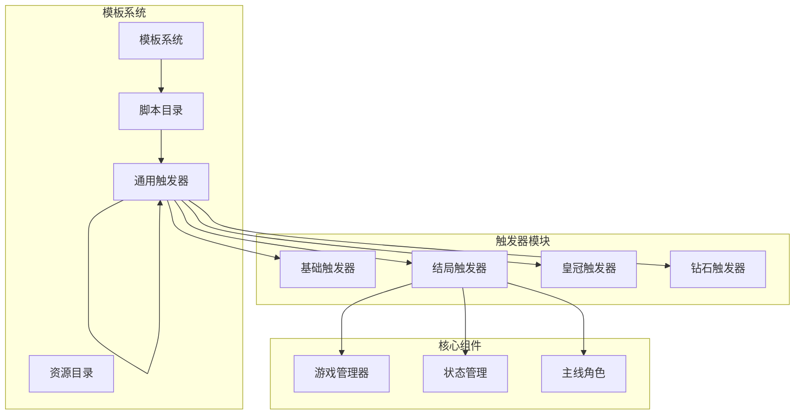
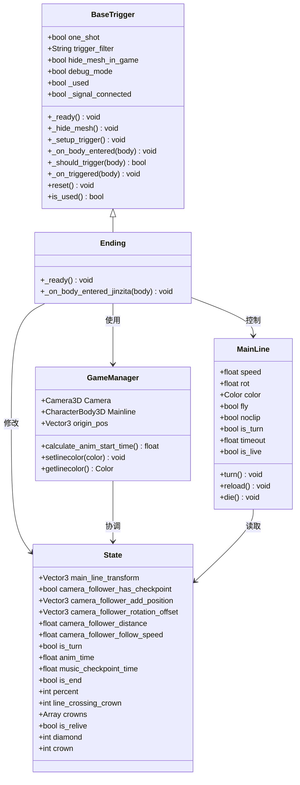
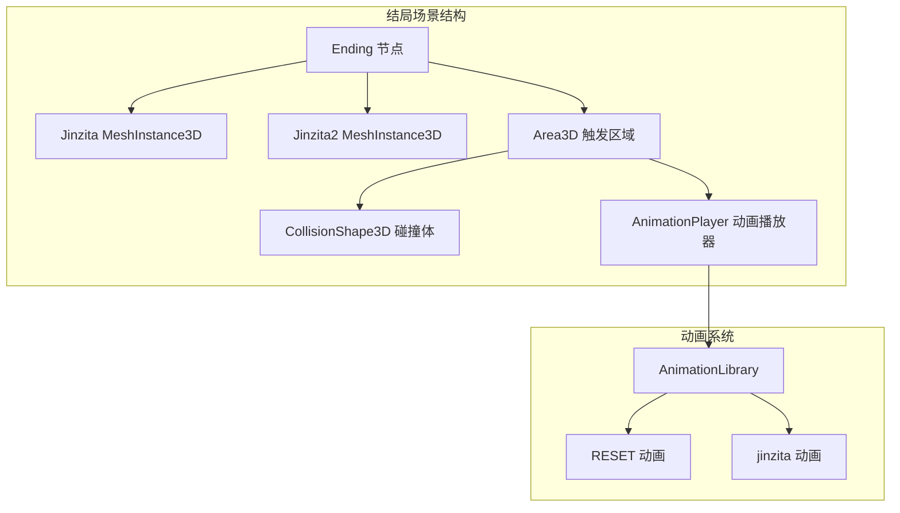
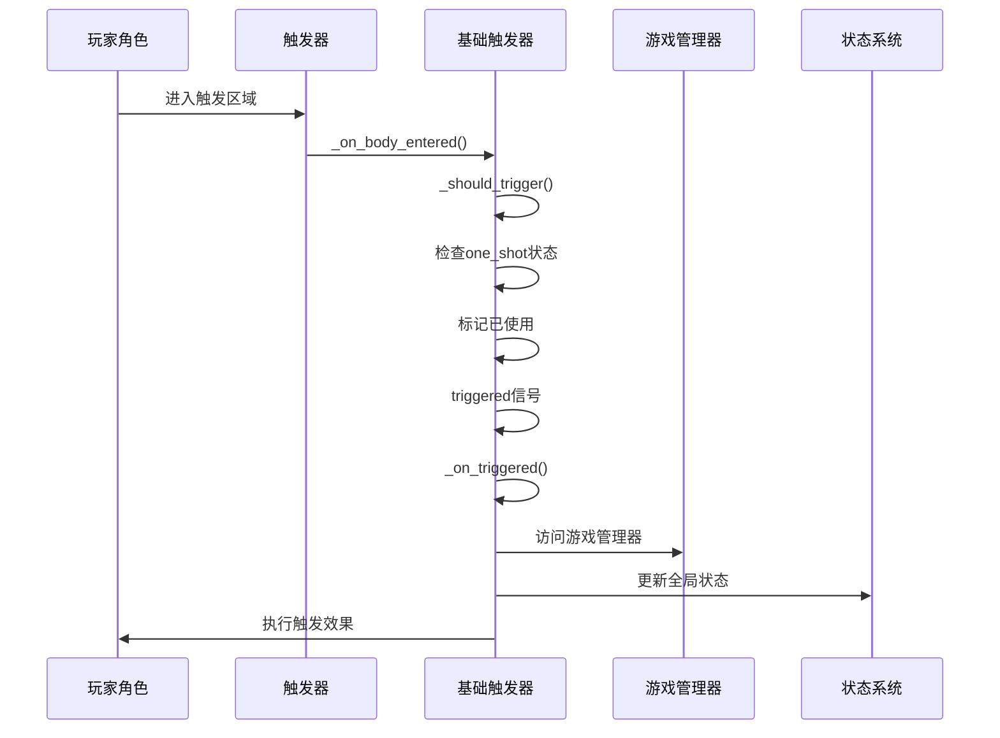
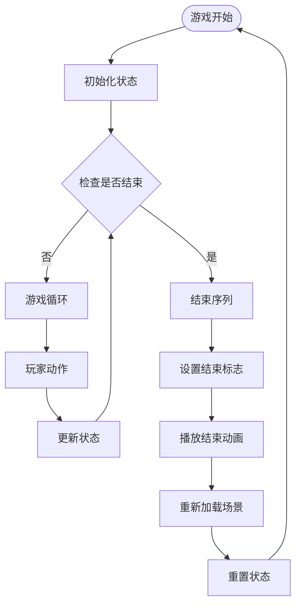
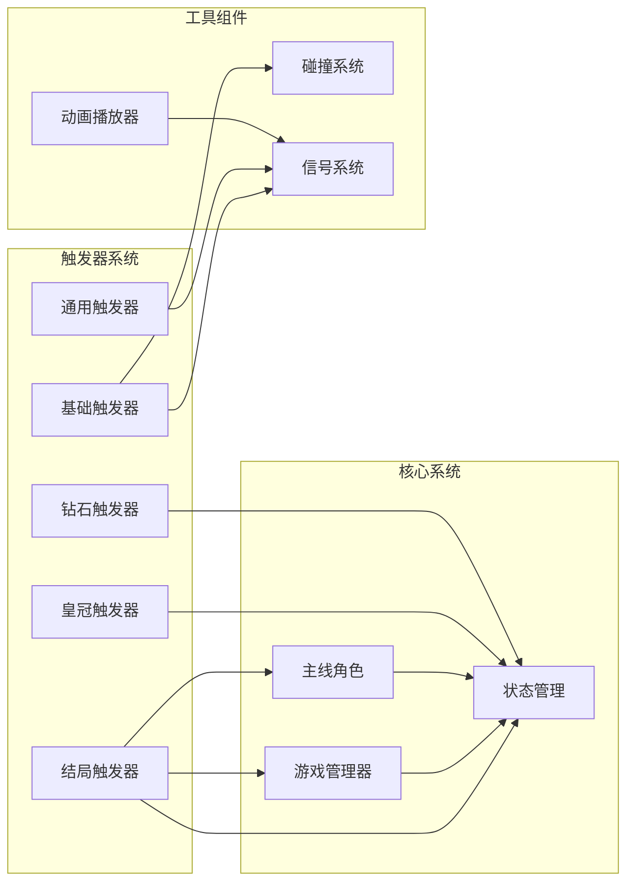

# 结局触发器

<cite>
**本文档引用的文件**
- [Ending.tscn](file://#Template/Ending.tscn)
- [Ending.gd](file://#Template/[Scripts]/Trigger/Ending.gd)
- [BaseTrigger.gd](file://#Template/[Scripts]/Trigger/BaseTrigger.gd)
- [GameManager.gd](file://#Template/[Scripts]/GameManager.gd)
- [MainLine.gd](file://#Template/[Scripts]/MainLine.gd)
- [State.gd](file://#Template/[Scripts]/State.gd)
- [Trigger.gd](file://#Template/[Scripts]/Trigger/Trigger.gd)
- [Crown.gd](file://#Template/[Scripts]/Trigger/Crown.gd)
- [Diamond.gd](file://#Template/[Scripts]/Trigger/Diamond.gd)
- [MainLine_test.gd](file://Tests/MainLine_test.gd)
- [Crown_test.gd](file://Tests/Crown_test.gd)
- [README.md](file://README.md)
</cite>

## 目录
1. [简介](#简介)
2. [项目结构](#项目结构)
3. [核心组件](#核心组件)
4. [架构概览](#架构概览)
5. [详细组件分析](#详细组件分析)
6. [依赖关系分析](#依赖关系分析)
7. [性能考虑](#性能考虑)
8. [故障排除指南](#故障排除指南)
9. [结论](#结论)

## 简介

结局触发器是Godot Line模板中的一个关键游戏机制组件，负责检测玩家角色与场景中的特殊触发器接触，并执行相应的结局逻辑。该系统基于Godot的物理引擎和信号系统构建，实现了完整的触发器检测、状态管理和动画播放功能。

本系统的核心目标是在玩家角色进入特定区域时，触发预定义的结局动画和状态变更，为游戏提供流畅的结束体验。通过模块化的架构设计，结局触发器能够与其他游戏组件无缝集成，同时保持良好的可扩展性和维护性。

## 项目结构

项目采用模块化的设计模式，将不同的游戏功能分离到独立的组件中。结局触发器系统位于模板系统的触发器模块内，与游戏管理器、状态管理系统等核心组件协同工作。

**图表来源**
- [Ending.tscn:1-105](file://#Template/Ending.tscn#L1-L105)
- [BaseTrigger.gd:1-102](file://#Template/[Scripts]/Trigger/BaseTrigger.gd#L1-L102)
- [GameManager.gd:1-47](file://#Template/[Scripts]/GameManager.gd#L1-L47)

**章节来源**
- [README.md:53-65](file://README.md#L53-L65)
- [Ending.tscn:1-105](file://#Template/Ending.tscn#L1-L105)

## 核心组件

结局触发器系统由多个相互协作的组件构成，每个组件都有特定的职责和功能：

### 基础触发器 (BaseTrigger)
提供所有触发器的通用功能，包括触发检测、过滤器、一次性触发支持和调试模式。它是所有具体触发器类的基类，确保了代码的一致性和可维护性。

### 结局触发器 (Ending)
专门处理游戏结束逻辑的具体触发器实现。它继承自基础触发器，重写了触发处理方法来执行特定的结局效果。

### 游戏管理器 (GameManager)
协调整个游戏系统的运行，包括相机控制、动画计算和状态同步等功能。

### 状态管理 (State)
全局状态存储系统，维护游戏进程中的各种状态变量，如玩家位置、动画时间、检查点信息等。

**章节来源**
- [BaseTrigger.gd:1-102](file://#Template/[Scripts]/Trigger/BaseTrigger.gd#L1-L102)
- [Ending.gd:1-15](file://#Template/[Scripts]/Trigger/Ending.gd#L1-L15)
- [GameManager.gd:1-47](file://#Template/[Scripts]/GameManager.gd#L1-L47)
- [State.gd:1-22](file://#Template/[Scripts]/State.gd#L1-L22)

## 架构概览

结局触发器系统采用了分层架构设计，通过清晰的职责分离实现了高度的模块化和可扩展性。

**图表来源**
- [BaseTrigger.gd:1-102](file://#Template/[Scripts]/Trigger/BaseTrigger.gd#L1-L102)
- [Ending.gd:1-15](file://#Template/[Scripts]/Trigger/Ending.gd#L1-L15)
- [GameManager.gd:1-47](file://#Template/[Scripts]/GameManager.gd#L1-L47)
- [State.gd:1-22](file://#Template/[Scripts]/State.gd#L1-L22)
- [MainLine.gd:1-251](file://#Template/[Scripts]/MainLine.gd#L1-L251)

## 详细组件分析

### 结局触发器场景分析

结局触发器的场景文件定义了完整的3D环境和触发逻辑：

**图表来源**
- [Ending.tscn:75-105](file://#Template/Ending.tscn#L75-L105)

#### 触发器工作机制

结局触发器通过以下步骤实现完整的触发流程：

1. **初始化阶段**：设置监控状态并隐藏可视化网格
2. **碰撞检测**：监听body_entered信号
3. **类型验证**：确认进入的物体是CharacterBody3D
4. **动画播放**：播放预定义的结局动画
5. **状态更新**：设置游戏结束标志

**章节来源**
- [Ending.tscn:1-105](file://#Template/Ending.tscn#L1-L105)
- [Ending.gd:1-15](file://#Template/[Scripts]/Trigger/Ending.gd#L1-L15)

### 基础触发器类分析

基础触发器提供了完整的触发器基础设施，支持多种触发模式和过滤选项：

**图表来源**
- [BaseTrigger.gd:54-73](file://#Template/[Scripts]/Trigger/BaseTrigger.gd#L54-L73)
- [GameManager.gd:1-47](file://#Template/[Scripts]/GameManager.gd#L1-L47)
- [State.gd:1-22](file://#Template/[Scripts]/State.gd#L1-L22)

#### 触发过滤机制

基础触发器支持三种触发过滤模式：

| 过滤器类型 | 说明 | 适用场景 |
|-----------|------|----------|
| CharacterBody3D | 仅允许CharacterBody3D类型触发 | 主线角色触发 |
| PhysicsBody3D | 允许所有物理体触发 | 物理交互触发 |
| Any | 允许任何类型触发 | 通用触发器 |

**章节来源**
- [BaseTrigger.gd:76-86](file://#Template/[Scripts]/Trigger/BaseTrigger.gd#L76-L86)

### 状态管理系统

状态管理系统是整个触发器系统的核心协调器，负责维护游戏进程中的各种状态信息：

**图表来源**
- [State.gd:1-22](file://#Template/[Scripts]/State.gd#L1-L22)
- [MainLine.gd:47-49](file://#Template/[Scripts]/MainLine.gd#L47-L49)

**章节来源**
- [State.gd:1-22](file://#Template/[Scripts]/State.gd#L1-L22)
- [MainLine.gd:47-49](file://#Template/[Scripts]/MainLine.gd#L47-L49)

## 依赖关系分析

结局触发器系统与其他组件之间存在紧密的依赖关系，形成了一个完整的生态系统：

**图表来源**
- [BaseTrigger.gd:1-102](file://#Template/[Scripts]/Trigger/BaseTrigger.gd#L1-L102)
- [Ending.gd:1-15](file://#Template/[Scripts]/Trigger/Ending.gd#L1-L15)
- [GameManager.gd:1-47](file://#Template/[Scripts]/GameManager.gd#L1-L47)
- [State.gd:1-22](file://#Template/[Scripts]/State.gd#L1-L22)

### 关键依赖关系

1. **触发器依赖**：所有触发器都依赖于基础触发器提供的基础设施
2. **状态依赖**：触发器操作依赖于状态管理系统进行数据持久化
3. **游戏管理依赖**：特定触发器需要访问游戏管理器的功能
4. **物理依赖**：触发器系统依赖于Godot的物理引擎进行碰撞检测

**章节来源**
- [BaseTrigger.gd:1-102](file://#Template/[Scripts]/Trigger/BaseTrigger.gd#L1-L102)
- [Ending.gd:1-15](file://#Template/[Scripts]/Trigger/Ending.gd#L1-L15)
- [GameManager.gd:1-47](file://#Template/[Scripts]/GameManager.gd#L1-L47)

## 性能考虑

结局触发器系统在设计时充分考虑了性能优化，采用了多种策略来确保流畅的游戏体验：

### 内存管理
- 触发器对象在使用后及时释放
- 状态数据通过全局节点管理，避免重复创建
- 动画资源预加载，减少运行时开销

### 碰撞检测优化
- 使用高效的Area3D碰撞体
- 限制触发器数量，避免过多的物理计算
- 优化碰撞形状，提高检测精度

### 动画性能
- 动画播放器按需启动和停止
- 避免不必要的动画混合
- 使用合适的动画采样率

## 故障排除指南

### 常见问题及解决方案

#### 触发器不响应
1. **检查触发器设置**：确认one_shot和trigger_filter配置正确
2. **验证碰撞体**：确保CollisionShape3D正确配置
3. **检查信号连接**：确认body_entered信号已正确连接

#### 动画播放异常
1. **验证动画资源**：确认AnimationPlayer包含正确的动画
2. **检查节点路径**：确保AnimationPlayer指向正确的节点
3. **查看控制台错误**：关注可能的资源加载错误

#### 状态同步问题
1. **检查State节点**：确认State节点存在于场景中
2. **验证全局访问**：确保通过正确的路径访问State
3. **调试状态变化**：使用debug_mode输出状态信息

**章节来源**
- [BaseTrigger.gd:58-60](file://#Template/[Scripts]/Trigger/BaseTrigger.gd#L58-L60)
- [Ending.gd:8-14](file://#Template/[Scripts]/Trigger/Ending.gd#L8-L14)

## 结论

结局触发器系统展现了现代游戏开发中模块化设计的最佳实践。通过清晰的职责分离、完善的依赖管理和优雅的错误处理机制，该系统为开发者提供了一个强大而灵活的解决方案。

系统的主要优势包括：
- **高度模块化**：组件间耦合度低，易于维护和扩展
- **强大的可配置性**：支持多种触发模式和过滤选项
- **完善的错误处理**：提供详细的调试信息和故障排除指导
- **优秀的性能表现**：优化的内存管理和碰撞检测机制

未来的发展方向可以包括：
- 增加更多类型的触发器
- 扩展状态管理功能
- 改进动画系统
- 增强调试和监控工具

该系统为基于Godot引擎的游戏开发提供了一个坚实的基础，开发者可以在此基础上快速构建各种类型的触发器功能。