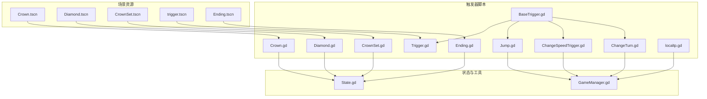
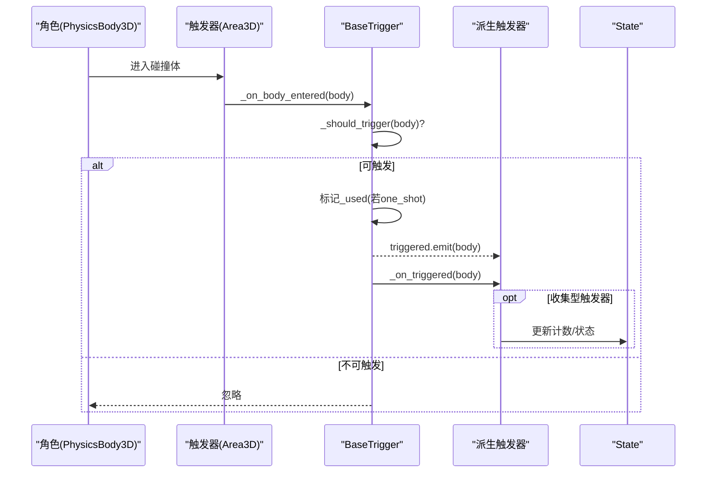
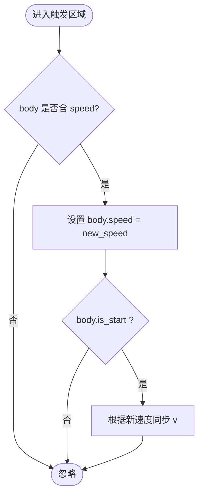
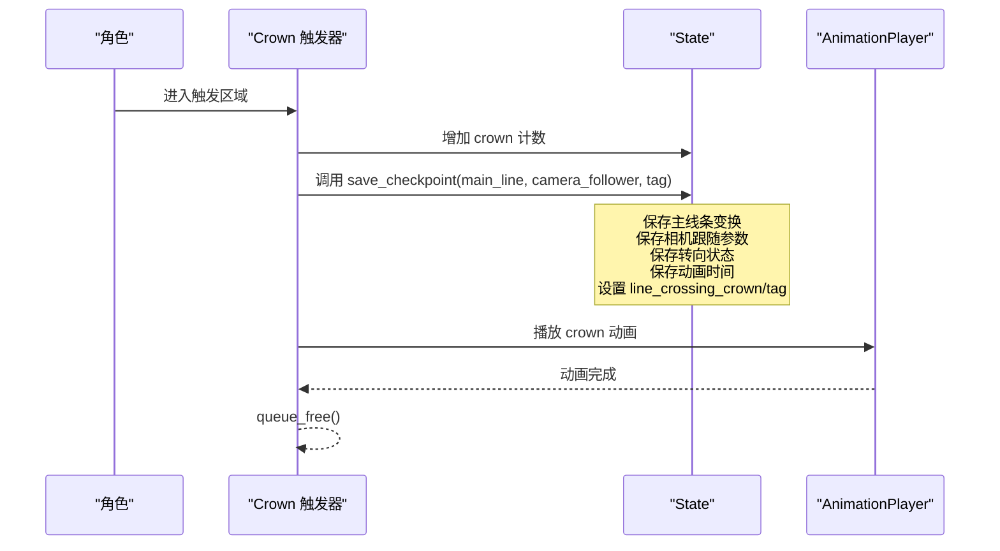
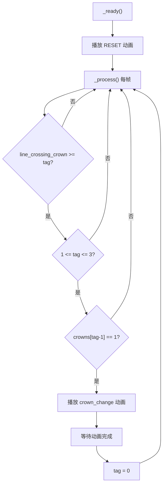
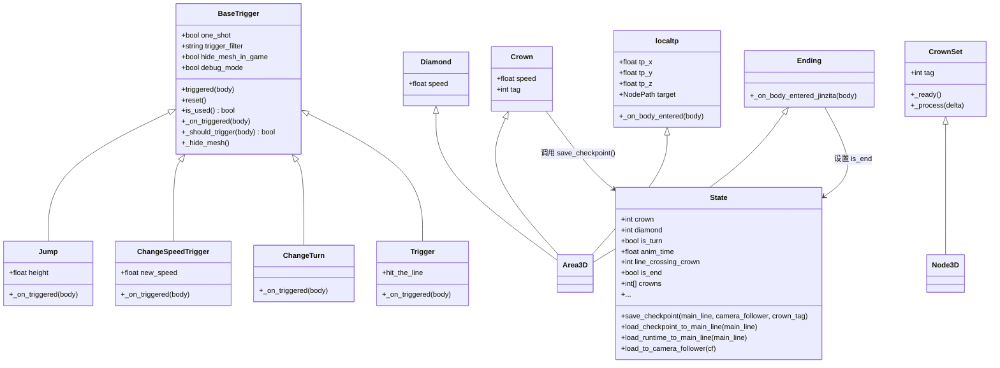
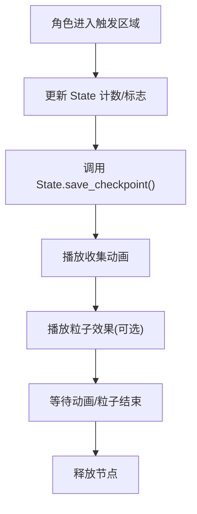
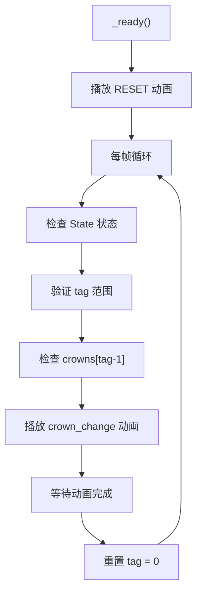
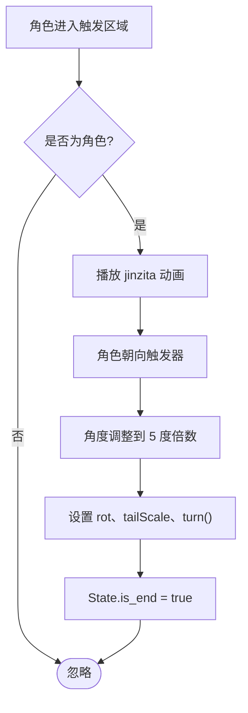

# 触发器系统

<cite>
**本文引用的文件**
- [BaseTrigger.gd](file://#Template/[Scripts]/Trigger/BaseTrigger.gd)
- [Jump.gd](file://#Template/[Scripts]/Trigger/Jump.gd)
- [ChangeSpeedTrigger.gd](file://#Template/[Scripts]/Trigger/ChangeSpeedTrigger.gd)
- [ChangeTurn.gd](file://#Template/[Scripts]/Trigger/ChangeTurn.gd)
- [Trigger.gd](file://#Template/[Scripts]/Trigger/Trigger.gd)
- [Crown.gd](file://#Template/[Scripts]/Trigger/Crown.gd)
- [Diamond.gd](file://#Template/[Scripts]/Trigger/Diamond.gd)
- [CrownSet.gd](file://#Template/[Scripts]/Trigger/CrownSet.gd)
- [State.gd](file://#Template/[Scripts]/State.gd)
- [GameManager.gd](file://#Template/[Scripts]/GameManager.gd)
- [Crown.tscn](file://#Template/Crown.tscn)
- [Diamond.tscn](file://#Template/Diamond.tscn)
- [CrownSet.tscn](file://#Template/CrownSet.tscn)
- [trigger.tscn](file://#Template/trigger.tscn)
- [Ending.tscn](file://#Template/Ending.tscn)
- [Ending.gd](file://#Template/[Scripts]/Trigger/Ending.gd)
- [CamTransitionTrigger.gd](file://#Template/[Scripts]/CameraScripts/CamTransitionTrigger.gd)
- [localtp.gd](file://#Template/[Scripts]/Trigger/localtp.gd)
- [Crown_test.gd](file://Tests/Crown_test.gd)
- [Diamond_test.gd](file://Tests/Diamond_test.gd)
- [MainLine_test.gd](file://Tests/MainLine_test.gd)
</cite>

## 更新摘要
**变更内容**
- 更新了 BaseTrigger 基类中网格组件可见性控制的说明
- 新增了模板场景文件获得新的触发器组件的说明
- 更新了 Ending 触发器的实现细节
- 增强了触发器系统简化说明

## 目录
1. [简介](#简介)
2. [项目结构](#项目结构)
3. [核心组件](#核心组件)
4. [架构总览](#架构总览)
5. [详细组件分析](#详细组件分析)
6. [依赖关系分析](#依赖关系分析)
7. [性能考量](#性能考量)
8. [故障排查指南](#故障排查指南)
9. [结论](#结论)
10. [附录](#附录)

## 简介
本文件系统化阐述触发器系统的整体设计与实现，重点覆盖：
- BaseTrigger 基类的设计理念、扩展机制与生命周期
- 内置触发器的实现细节：Crown（皇冠）、Diamond（钻石）、Jump（跳跃）、ChangeSpeedTrigger（速度变化）、ChangeTurn（转向变化）、Trigger（通用触发器）、CrownSet（多皇冠状态管理）、Ending（终点触发器）等
- 触发器的激活条件、执行时机与参数配置
- 与游戏状态管理 State 的交互机制
- 新触发器类型开发流程、最佳实践与注意事项

## 项目结构
触发器系统位于模板脚本目录下的 Trigger 子目录，并配套场景资源与测试用例。核心文件组织如下：
- 基类与通用触发器：BaseTrigger.gd、Trigger.gd
- 行为型触发器：Jump.gd、ChangeSpeedTrigger.gd、ChangeTurn.gd
- 收集型触发器：Crown.gd、Diamond.gd、CrownSet.gd
- 特殊触发器：Ending.gd、localtp.gd
- 状态管理：State.gd
- 辅助工具：GameManager.gd
- 场景资源：Crown.tscn、Diamond.tscn、CrownSet.tscn、trigger.tscn、Ending.tscn
- 单元测试：Crown_test.gd、Diamond_test.gd、MainLine_test.gd

**图表来源**
- [BaseTrigger.gd:1-102](file://#Template/[Scripts]/Trigger/BaseTrigger.gd#L1-L102)
- [Trigger.gd:1-10](file://#Template/[Scripts]/Trigger/Trigger.gd#L1-L10)
- [Jump.gd:1-13](file://#Template/[Scripts]/Trigger/Jump.gd#L1-L13)
- [ChangeSpeedTrigger.gd:1-15](file://#Template/[Scripts]/Trigger/ChangeSpeedTrigger.gd#L1-L15)
- [ChangeTurn.gd:1-10](file://#Template/[Scripts]/Trigger/ChangeTurn.gd#L1-L10)
- [Crown.gd:1-22](file://#Template/[Scripts]/Trigger/Crown.gd#L1-L22)
- [Diamond.gd:1-17](file://#Template/[Scripts]/Trigger/Diamond.gd#L1-L17)
- [CrownSet.gd:1-13](file://#Template/[Scripts]/Trigger/CrownSet.gd#L1-L13)
- [Ending.gd:1-18](file://#Template/[Scripts]/Trigger/Ending.gd#L1-L18)
- [localtp.gd:1-21](file://#Template/[Scripts]/Trigger/localtp.gd#L1-L21)
- [State.gd:1-190](file://#Template/[Scripts]/State.gd#L1-L190)
- [GameManager.gd:1-46](file://#Template/[Scripts]/GameManager.gd#L1-L46)
- [Crown.tscn:1-67](file://#Template/Crown.tscn#L1-L67)
- [Diamond.tscn:1-127](file://#Template/Diamond.tscn#L1-L127)
- [CrownSet.tscn:1-76](file://#Template/CrownSet.tscn#L1-L76)
- [trigger.tscn:1-24](file://#Template/trigger.tscn#L1-L24)
- [Ending.tscn:1-110](file://#Template/Ending.tscn#L1-L110)

**章节来源**
- [BaseTrigger.gd:1-102](file://#Template/[Scripts]/Trigger/BaseTrigger.gd#L1-L102)
- [Crown.tscn:1-67](file://#Template/Crown.tscn#L1-L67)
- [Diamond.tscn:1-127](file://#Template/Diamond.tscn#L1-L127)
- [CrownSet.tscn:1-76](file://#Template/CrownSet.tscn#L1-L76)
- [trigger.tscn:1-24](file://#Template/trigger.tscn#L1-L24)
- [Ending.tscn:1-110](file://#Template/Ending.tscn#L1-L110)

## 核心组件
本节聚焦 BaseTrigger 基类与通用触发器 Trigger 的设计理念与扩展机制。

- 设计理念
  - 统一触发入口：基于 Area3D 的 body_entered 信号，集中处理进入逻辑
  - 过滤与一次性触发：通过 trigger_filter 与 one_shot 控制触发范围与次数
  - **更新**：网格组件可见性控制：通过 hide_mesh_in_game 属性控制运行时网格显示，默认隐藏以优化性能
  - 扩展点：子类仅需实现 _on_triggered(body) 即可注入自定义行为
  - 调试友好：debug_mode 输出触发日志
  - 状态复位：reset() 支持重新激活 one_shot 触发器

- 生命周期与控制流
  - _ready(): 编辑器模式下跳过；运行时根据 hide_mesh_in_game 设置隐藏网格并建立触发连接
  - _setup_trigger(): 建立 body_entered 与 _on_body_entered 的连接（幂等）
  - _on_body_entered(): 条件判断 → 标记使用 → 发出 triggered 信号 → 调用 _on_triggered
  - _should_trigger(): 默认按 CharacterBody3D/PhysicsBody3D/Any 过滤，子类可重写
  - reset()/is_used(): 状态管理

- 扩展机制
  - 继承 BaseTrigger 并导出参数（如高度、速度、新速度等）
  - 实现 _on_triggered(body) 完成具体行为（如修改速度、切换转向、播放动画等）
  - 可选择性重写 _should_trigger() 以定制触发条件
  - 使用 triggered 信号与其他节点解耦协作（如通用触发器 Trigger）

**章节来源**
- [BaseTrigger.gd:1-102](file://#Template/[Scripts]/Trigger/BaseTrigger.gd#L1-L102)

## 架构总览
触发器系统采用"基类 + 多种派生触发器"的分层架构，配合 State 状态管理与场景资源完成从输入到反馈的闭环。

**图表来源**
- [BaseTrigger.gd:54-91](file://#Template/[Scripts]/Trigger/BaseTrigger.gd#L54-L91)
- [Trigger.gd:8-10](file://#Template/[Scripts]/Trigger/Trigger.gd#L8-L10)
- [Crown.gd:16-22](file://#Template/[Scripts]/Trigger/Crown.gd#L16-L22)
- [Diamond.gd:7-12](file://#Template/[Scripts]/Trigger/Diamond.gd#L7-L12)
- [State.gd:1-190](file://#Template/[Scripts]/State.gd#L1-L190)

## 详细组件分析

### BaseTrigger 基类
- 关键特性
  - 触发过滤：支持 CharacterBody3D、PhysicsBody3D、Any 三种过滤策略
  - 一次性触发：one_shot 标记避免重复触发
  - **更新**：网格组件可见性控制：hide_mesh_in_game 在运行时控制 MeshInstance3D 的显示，默认隐藏以优化性能
  - 调试输出：debug_mode 打印触发日志
  - 扩展点：_on_triggered(body) 由子类实现

- 数据结构与复杂度
  - 过滤匹配为 O(1)，整体触发处理为 O(1)
  - 信号连接建立为 O(1)，避免重复连接

- 错误处理与边界
  - 未连接信号时自动建立连接
  - one_shot 后忽略后续触发
  - 默认过滤策略回退到 CharacterBody3D
  - **更新**：网格隐藏功能仅在运行时生效，编辑器模式下网格仍可见

**章节来源**
- [BaseTrigger.gd:11-102](file://#Template/[Scripts]/Trigger/BaseTrigger.gd#L11-L102)

### Jump 触发器（Jump.gd）
- 激活条件
  - 角色进入触发区域（默认过滤 CharacterBody3D）
- 执行时机
  - 进入时立即生效
- 参数配置
  - height：跳跃高度（决定起跳速度）
- 行为逻辑
  - 计算起跳速度并叠加到角色 velocity 的 Y 分量
  - 仅对 CharacterBody3D 生效

**图表来源**
- [Jump.gd:8-13](file://#Template/[Scripts]/Trigger/Jump.gd#L8-L13)

**章节来源**
- [Jump.gd:1-13](file://#Template/[Scripts]/Trigger/Jump.gd#L1-L13)

### ChangeSpeedTrigger（速度变化）（ChangeSpeedTrigger.gd）
- 激活条件
  - 角色进入触发区域（默认过滤 CharacterBody3D）
- 执行时机
  - 进入时立即生效
- 参数配置
  - new_speed：目标速度
- 行为逻辑
  - 将 body.speed 设为 new_speed
  - 若检测到 body.is_start 为真，则同步更新移动向量 v

**图表来源**
- [ChangeSpeedTrigger.gd:8-15](file://#Template/[Scripts]/Trigger/ChangeSpeedTrigger.gd#L8-L15)

**章节来源**
- [ChangeSpeedTrigger.gd:1-15](file://#Template/[Scripts]/Trigger/ChangeSpeedTrigger.gd#L1-L15)

### ChangeTurn 触发器（转向变化）（ChangeTurn.gd）
- 激活条件
  - 角色进入触发区域（默认过滤 CharacterBody3D）
- 执行时机
  - 进入时立即生效
- 参数配置
  - 无导出参数
- 行为逻辑
  - 切换 body.is_turn 状态

**章节来源**
- [ChangeTurn.gd:1-10](file://#Template/[Scripts]/Trigger/ChangeTurn.gd#L1-L10)

### Trigger 通用触发器（Trigger.gd）
- 激活条件
  - 任意进入触发区域的节点（默认过滤 Any）
- 执行时机
  - 进入时发出 hit_the_line 信号
- 参数配置
  - 无导出参数
- 行为逻辑
  - 发出 hit_the_line 信号，供其他节点订阅

**章节来源**
- [Trigger.gd:1-10](file://#Template/[Scripts]/Trigger/Trigger.gd#L1-L10)

### 收集型触发器：Crown（皇冠）（Crown.gd）
- 激活条件
  - 物理角色进入触发区域
- 执行时机
  - 进入时立即处理
- 参数配置
  - speed：旋转速度
  - tag：标识当前皇冠组别（1/2/3）
- 行为逻辑
  - 增加 State.crown 计数
  - **更新**：使用 State.save_checkpoint() 方法简化状态管理，替代手动状态复制
  - 播放 crown 动画并等待结束，随后释放节点
  - 根据 tag 标记对应检查点状态

**更新** Crown触发器现在使用新的State.save_checkpoint()方法，该方法封装了完整的状态保存逻辑，包括主线条变换、相机跟随参数、转向状态、动画时间等，消除了手动状态复制的复杂性和潜在错误。

**图表来源**
- [Crown.gd:16-22](file://#Template/[Scripts]/Trigger/Crown.gd#L16-L22)
- [State.gd:46-66](file://#Template/[Scripts]/State.gd#L46-L66)

**章节来源**
- [Crown.gd:1-22](file://#Template/[Scripts]/Trigger/Crown.gd#L1-L22)
- [Crown.tscn:1-67](file://#Template/Crown.tscn#L1-L67)

### 收集型触发器：Diamond（钻石）（Diamond.gd）
- 激活条件
  - 任意进入触发区域的节点（默认过滤 Any）
- 执行时机
  - 进入时立即处理
- 参数配置
  - speed：旋转速度
- 行为逻辑
  - 增加 State.diamond 计数
  - 播放 diamond 动画并开启粒子效果，等待粒子结束后释放节点

**章节来源**
- [Diamond.gd:1-17](file://#Template/[Scripts]/Trigger/Diamond.gd#L1-L17)
- [Diamond.tscn:1-127](file://#Template/Diamond.tscn#L1-L127)

### CrownSet（多皇冠状态管理）（CrownSet.gd）
- 功能概述
  - 基于 State 中的检查点状态与当前 tag，管理多皇冠状态显示
  - 通过 AnimationPlayer 播放 crown_change 动画，实现皇冠状态切换
  - 自动重置 tag 状态，确保状态机正确流转
- 执行时机
  - 每帧轮询 State 标志位，实时响应状态变化
- 参数配置
  - tag：当前皇冠组别标识（1-3）
- 行为逻辑
  - 初始化时播放 RESET 动画，设置初始状态
  - 每帧检查：State.line_crossing_crown >= tag 且 tag 在有效范围内
  - 当 State.crowns[tag-1] == 1 时，播放 crown_change 动画
  - 动画完成后将 tag 置零，表示该组皇冠状态已处理

**图表来源**
- [CrownSet.gd:7-13](file://#Template/[Scripts]/Trigger/CrownSet.gd#L7-L13)
- [CrownSet.tscn:34-59](file://#Template/CrownSet.tscn#L34-L59)

**章节来源**
- [CrownSet.gd:1-13](file://#Template/[Scripts]/Trigger/CrownSet.gd#L1-L13)
- [CrownSet.tscn:1-76](file://#Template/CrownSet.tscn#L1-L76)

### Ending 终点触发器（Ending.gd）
- 激活条件
  - 角色进入触发区域（默认过滤 CharacterBody3D）
- 执行时机
  - 进入时立即生效
- 参数配置
  - 无导出参数
- 行为逻辑
  - 播放 jinzita 动画
  - 使角色朝向触发器方向
  - 将旋转角度调整到 5 度的倍数
  - 设置 body.rot、body.tailScale 和调用 body.turn()
  - 设置 State.is_end = true 标记游戏结束

**更新** Ending 触发器现在使用更精确的角度调整算法，将旋转角度整除 5 取整，确保角色面向固定的角度。

```mermaid
flowchart TD
Start(["角色进入触发区域"]) --> CheckChar{"是否为角色?"}
CheckChar --> |否| End(["忽略"])
CheckChar --> |是| PlayAnim["播放 jinzita 动画"]
PlayAnim --> LookAt["角色朝向触发器"]
LookAt --> RoundAngle["角度调整到 5 度倍数"]
RoundAngle --> SetFlags["设置 rot、tailScale、turn()"]
SetFlags --> SetEnd["State.is_end = true"]
SetEnd --> End
```

**图表来源**
- [Ending.gd:6-17](file://#Template/[Scripts]/Trigger/Ending.gd#L6-L17)

**章节来源**
- [Ending.gd:1-18](file://#Template/[Scripts]/Trigger/Ending.gd#L1-L18)
- [Ending.tscn:1-110](file://#Template/Ending.tscn#L1-L110)

### localtp 本地传送触发器（localtp.gd）
- 激活条件
  - 物理体进入触发区域（默认过滤 PhysicsBody3D）
- 执行时机
  - 进入时立即生效
- 参数配置
  - tp_x、tp_y、tp_z：传送向量
  - target：目标节点路径
- 行为逻辑
  - 将角色位置偏移 tp_x、tp_y、tp_z
  - 调用 body.new_line()
  - 如果存在目标节点，将其位置设置为传送向量

**章节来源**
- [localtp.gd:1-21](file://#Template/[Scripts]/Trigger/localtp.gd#L1-L21)

### 与游戏状态管理的交互（State.gd）
- 全局状态字段
  - 主线条变换、相机跟随参数、转向状态、动画时间、结算相关标志
  - 皇冠与钻石计数、检查点标记
  - **新增**：crowns 数组 [0, 0, 0] 用于管理三组皇冠状态
  - **新增**：is_end 标志用于游戏结束状态管理
- **更新**：State.save_checkpoint() 方法提供统一的状态保存接口
  - 保存主线条变换和转向状态
  - 保存相机跟随器的相对位置、旋转偏移、距离和跟随速度
  - 保存当前动画播放位置和音乐播放进度
  - 设置 line_crossing_crown 和对应的 crowns 标志
- 交互要点
  - 收集型触发器在触发时更新相应计数与标志位
  - CrownSet 触发器读取 State.crowns 数组状态，实现多皇冠状态管理
  - 通用触发器通过信号驱动外部逻辑
  - Ending 触发器设置 State.is_end 标志，通知游戏结束

**章节来源**
- [State.gd:1-190](file://#Template/[Scripts]/State.gd#L1-L190)

## 依赖关系分析
- 继承关系
  - Jump、ChangeSpeedTrigger、ChangeTurn、Trigger 均继承自 BaseTrigger
  - Crown、Diamond 继承自 Area3D，不依赖 BaseTrigger
  - **新增**：CrownSet 继承自 Node3D，独立管理多皇冠状态
  - **新增**：Ending 继承自 Area3D，独立管理游戏结束逻辑
  - **新增**：localtp 继承自 Area3D，独立管理本地传送逻辑

- 信号与事件
  - BaseTrigger 通过 triggered 信号与派生类解耦
  - Trigger 通过 hit_the_line 信号对外广播
  - 场景资源通过连接函数名绑定到脚本方法

- 外部依赖
  - GameManager 提供动画起始时间计算等辅助能力
  - 场景资源提供网格、碰撞形状与动画库
  - **新增**：CrownSet 依赖 State.crowns 数组状态
  - **更新**：Crown 触发器依赖 State.save_checkpoint() 方法
  - **新增**：Ending 触发器依赖 State.is_end 标志
  - **新增**：localtp 触发器依赖目标节点路径

**图表来源**
- [BaseTrigger.gd:6-91](file://#Template/[Scripts]/Trigger/BaseTrigger.gd#L6-L91)
- [Jump.gd:2-13](file://#Template/[Scripts]/Trigger/Jump.gd#L2-L13)
- [ChangeSpeedTrigger.gd:2-15](file://#Template/[Scripts]/Trigger/ChangeSpeedTrigger.gd#L2-L15)
- [ChangeTurn.gd:2-10](file://#Template/[Scripts]/Trigger/ChangeTurn.gd#L2-L10)
- [Trigger.gd:2-10](file://#Template/[Scripts]/Trigger/Trigger.gd#L2-L10)
- [Crown.gd:1-22](file://#Template/[Scripts]/Trigger/Crown.gd#L1-L22)
- [Diamond.gd:1-17](file://#Template/[Scripts]/Trigger/Diamond.gd#L1-L17)
- [CrownSet.gd:1-13](file://#Template/[Scripts]/Trigger/CrownSet.gd#L1-L13)
- [Ending.gd:1-18](file://#Template/[Scripts]/Trigger/Ending.gd#L1-L18)
- [localtp.gd:1-21](file://#Template/[Scripts]/Trigger/localtp.gd#L1-L21)
- [State.gd:46-95](file://#Template/[Scripts]/State.gd#L46-L95)

## 性能考量
- 触发频率与开销
  - BaseTrigger 的过滤与触发处理均为 O(1)，适合高频触发场景
  - one_shot 可减少重复处理成本
- **更新**：网格组件可见性优化
  - hide_mesh_in_game 在运行时隐藏网格，降低渲染开销
  - 编辑器模式下网格仍可见，便于调试
- 动画与粒子
  - 收集型触发器播放短时动画与粒子，建议在队列释放前完成
  - **新增**：CrownSet 的每帧检查开销较小，但需注意大量 CrownSet 实例时的性能影响
  - **新增**：Ending 触发器的动画播放开销较小，但需确保动画资源优化
- **更新**：State.save_checkpoint() 方法优化了状态保存性能
  - 统一的状态保存接口减少了重复代码
  - 避免了手动状态复制可能产生的性能损耗
- 信号风暴
  - 通用触发器 Trigger 可能被大量触发器共享，注意避免过度订阅导致的信号风暴

## 故障排查指南
- 触发无效
  - 检查 trigger_filter 与角色类型是否匹配
  - one_shot 已触发后需调用 reset() 重置
  - 确认 body_entered 信号连接正常（基类已自动建立）
  - **更新**：检查 hide_mesh_in_game 设置是否正确，确保网格在运行时被正确隐藏
- 行为异常
  - Jump：确认角色具备 velocity 字段且为 CharacterBody3D
  - ChangeSpeedTrigger：确认目标节点具备 speed 字段，必要时同步更新 v
  - ChangeTurn：确认目标节点具备 is_turn 字段
  - **新增**：Ending：确认角色具备 turn() 方法和相关属性
  - **新增**：localtp：确认目标节点路径正确且存在
- 收集型触发器
  - Crown/Diamond：确认 State 计数与标志位正确更新
  - **新增**：CrownSet：确认 State.crowns 数组状态正确设置，tag 值在 1-3 范围内
  - **更新**：Crown：确认 State.save_checkpoint() 调用成功，检查相机跟随器是否存在
- 场景资源问题
  - 确认场景中的连接函数名与脚本方法一致（如 _on_Crown_body_entered/_on_Diamond_body_entered）
  - **新增**：CrownSet 场景中 AnimationPlayer 的动画库配置正确
  - **更新**：Crown 场景中 AnimationPlayer 的 crown 动画配置正确
  - **新增**：Ending 场景中 AnimationPlayer 的 jinzita 动画配置正确
  - **新增**：localtp 场景中目标节点路径配置正确

**章节来源**
- [BaseTrigger.gd:47-91](file://#Template/[Scripts]/Trigger/BaseTrigger.gd#L47-L91)
- [Jump.gd:8-13](file://#Template/[Scripts]/Trigger/Jump.gd#L8-L13)
- [ChangeSpeedTrigger.gd:8-15](file://#Template/[Scripts]/Trigger/ChangeSpeedTrigger.gd#L8-L15)
- [ChangeTurn.gd:6-10](file://#Template/[Scripts]/Trigger/ChangeTurn.gd#L6-L10)
- [Crown.gd:16-22](file://#Template/[Scripts]/Trigger/Crown.gd#L16-L22)
- [Diamond.gd:7-12](file://#Template/[Scripts]/Trigger/Diamond.gd#L7-L12)
- [CrownSet.gd:7-13](file://#Template/[Scripts]/Trigger/CrownSet.gd#L7-L13)
- [Ending.gd:6-17](file://#Template/[Scripts]/Trigger/Ending.gd#L6-L17)
- [localtp.gd:15-21](file://#Template/[Scripts]/Trigger/localtp.gd#L15-L21)
- [CrownSet.tscn:61-65](file://#Template/CrownSet.tscn#L61-L65)
- [trigger.tscn:23-23](file://#Template/trigger.tscn#L23-L23)

## 结论
触发器系统通过 BaseTrigger 提供统一的触发框架，结合多种派生触发器满足不同玩法需求。**新增的 CrownSet 触发器组件完善了多皇冠状态管理系统，通过与 State.crowns 数组的协作，实现了精确的多组皇冠状态跟踪与视觉反馈。** 收集型触发器与 State 的紧密协作实现了清晰的状态管理，而通用触发器则提供了灵活的信号广播能力。

**重要更新**：Crown 触发器现在使用 State.save_checkpoint() 方法简化了状态管理逻辑，该方法封装了完整的状态保存流程，包括主线条变换、相机跟随参数、转向状态、动画时间等，显著提升了代码的可维护性和可靠性。这一改进消除了手动状态复制的复杂性和潜在错误，同时提供了更好的性能表现。

**新增**：模板场景文件获得了新的触发器组件，包括优化的 trigger.tscn 场景，提供了更好的可视化网格控制和调试支持。Ending 触发器现在具有更精确的角度调整算法，确保角色面向固定的角度。

遵循本文的扩展指南与最佳实践，可快速开发新的触发器类型并保持系统的可维护性与性能。

## 附录

### 开发新触发器的步骤与最佳实践
- 步骤
  - 继承 BaseTrigger 或直接使用 Area3D（如收集型）
  - 导出必要的参数（如高度、速度、新速度、tag 等）
  - 实现 _on_triggered(body) 注入行为
  - 如需定制触发条件，重写 _should_trigger(body)
  - 在场景中添加碰撞体与可视化网格（可选），并建立信号连接
  - **新增**：对于状态管理型触发器，考虑与 State.gd 的集成方式
  - **新增**：利用 hide_mesh_in_game 属性优化运行时性能
- 最佳实践
  - 明确触发过滤器与 one_shot 策略
  - 使用 debug_mode 排查触发链路
  - 对外暴露最小必要参数，避免过度耦合
  - 收尾时及时释放节点或重置状态
  - **新增**：合理使用 State.gd 的全局状态，避免状态竞争
  - **更新**：优先使用 State.save_checkpoint() 等封装好的状态管理方法
  - **新增**：考虑运行时网格可见性优化，提升性能
- 注意事项
  - 避免在触发回调中进行重型计算
  - 通用触发器避免滥用，防止信号风暴
  - 收集型触发器需与 State 同步更新，保证结算逻辑正确
  - **新增**：多实例触发器需考虑性能影响，避免过度创建实例
  - **更新**：确保相机跟随器等依赖项存在，避免 State.save_checkpoint() 调用失败
  - **新增**：Ending 触发器需确保角色具备必要的属性和方法

### 关键流程图：收集型触发器（Crown/Diamond）

**图表来源**
- [Crown.gd:16-22](file://#Template/[Scripts]/Trigger/Crown.gd#L16-L22)
- [Diamond.gd:7-12](file://#Template/[Scripts]/Trigger/Diamond.gd#L7-L12)
- [Crown.tscn:63-67](file://#Template/Crown.tscn#L63-L67)
- [Diamond.tscn:113-127](file://#Template/Diamond.tscn#L113-L127)

### 关键流程图：多皇冠状态管理（CrownSet）

**图表来源**
- [CrownSet.gd:7-13](file://#Template/[Scripts]/Trigger/CrownSet.gd#L7-L13)
- [CrownSet.tscn:34-59](file://#Template/CrownSet.tscn#L34-L59)
- [State.gd:16-17](file://#Template/[Scripts]/State.gd#L16-L17)

### 关键流程图：Ending 终点触发器

**图表来源**
- [Ending.gd:6-17](file://#Template/[Scripts]/Trigger/Ending.gd#L6-L17)

### State.save_checkpoint() 方法详解
**新增**：State.save_checkpoint() 是触发器系统的核心状态管理方法，提供统一的状态保存接口。

- 方法签名
  - static func save_checkpoint(main_line: PhysicsBody3D, camera_follower: Node3D, crown_tag: int) -> void

- 保存内容
  - 主线条变换（transform）和转向状态（is_turn）
  - 当前动画播放位置（anim_time）
  - 相机跟随器的相对位置、旋转偏移、距离和跟随速度
  - 音乐播放进度（music_checkpoint_time）
  - 设置 line_crossing_crown 和对应的 crowns 标志

- 性能优势
  - 统一的状态保存逻辑，避免重复代码
  - 减少了手动状态复制的开销和错误风险
  - 提供了更好的可维护性和扩展性

**章节来源**
- [State.gd:46-66](file://#Template/[Scripts]/State.gd#L46-L66)
- [Crown.gd:18](file://#Template/[Scripts]/Trigger/Crown.gd#L18)

### 模板场景文件更新说明
**新增**：模板场景文件获得了新的触发器组件，提升了开发体验和性能优化。

- trigger.tscn 场景
  - 包含 BoxShape3D 碰撞形状和 BoxMesh 可视化网格
  - MeshInstance3D 默认设置为不可见（visible = false）
  - 提供 Marker3D 作为场景标记
  - 建立标准的 body_entered 信号连接

- Ending.tscn 场景
  - 包含两个 Area3D 触发器，分别配置不同的触发逻辑
  - 提供完整的动画库，包括 jinzita 和 RESET 动画
  - 包含两个 Jinzita MeshInstance3D 实体
  - 支持双触发器的复杂交互逻辑

- 其他场景文件
  - Crown.tscn、Diamond.tscn、CrownSet.tscn 等场景文件保持原有结构
  - 所有场景文件都建立了正确的信号连接函数名

**章节来源**
- [trigger.tscn:1-24](file://#Template/trigger.tscn#L1-L24)
- [Ending.tscn:1-110](file://#Template/Ending.tscn#L1-L110)
- [Crown.tscn:1-67](file://#Template/Crown.tscn#L1-L67)
- [Diamond.tscn:1-127](file://#Template/Diamond.tscn#L1-L127)
- [CrownSet.tscn:1-76](file://#Template/CrownSet.tscn#L1-L76)