# 触发器系统

<cite>
**本文引用的文件**
- [BaseTrigger.gd](file://#Template/[Scripts]/Trigger/BaseTrigger.gd)
- [Jump.gd](file://#Template/[Scripts]/Trigger/Jump.gd)
- [ChangeSpeedTrigger.gd](file://#Template/[Scripts]/Trigger/ChangeSpeedTrigger.gd)
- [ChangeTurn.gd](file://#Template/[Scripts]/Trigger/ChangeTurn.gd)
- [Trigger.gd](file://#Template/[Scripts]/Trigger/Trigger.gd)
- [Crown.gd](file://#Template/[Scripts]/Trigger/Crown.gd)
- [Diamond.gd](file://#Template/[Scripts]/Trigger/Diamond.gd)
- [CrownSet.gd](file://#Template/[Scripts]/Trigger/CrownSet.gd)
- [Ending.gd](file://#Template/[Scripts]/Trigger/Ending.gd)
- [PreEnding.gd](file://#Template/[Scripts]/Trigger/PreEnding.gd)
- [State.gd](file://#Template/[Scripts]/State.gd)
- [Player.gd](file://#Template/[Scripts]/Level/Player.gd)
- [AnimatorBase.gd](file://#Template/[Scripts]/Animator/AnimatorBase.gd)
- [LocalPosAnimator.gd](file://#Template/[Scripts]/Animator/LocalPosAnimator.gd)
- [LocalRotAnimator.gd](file://#Template/[Scripts]/Animator/LocalRotAnimator.gd)
- [PosAnimator.gd](file://#Template/[Scripts]/Animator/PosAnimator.gd)
- [MovingPosMax.gd](file://#Template/[Scripts]/Animator/MovingPosMax.gd)
- [animplay.gd](file://#Template/[Scripts]/Trigger/animplay.gd)
- [customanimplay.gd](file://#Template/[Scripts]/Trigger/customanimplay.gd)
- [Diamond.tscn](file://#Template/Diamond.tscn)
- [Ending.tscn](file://#Template/Ending.tscn)
- [trigger.tscn](file://#Template/trigger.tscn)
- [CameraFollower.gd](file://#Template/[Scripts]/CameraScripts/CameraFollower.gd)
</cite>

## 更新摘要
**变更内容**
- **更新**：ChangeSpeedTrigger.gd 增强了速度修改逻辑，增加了对 CharacterBody3D 实例的即时速度调整功能，确保速度变化立即生效
- **更新**：PreEnding.gd 重写了结局序列，使用 call_deferred() 确保动画播放完成后执行转向操作，避免了竞态条件
- **更新**：ChangeTurn.gd 修改了触发逻辑，现在检查 `_currentDirection` 属性而非旧的 `is_turn` 布尔值，toggle 机制使用 `1 - body._currentDirection` 而非简单布尔取反
- 动画系统重构：触发器模式下的动画组件已迁移至 Animator 目录，新增 AnimatorBase 基类，提供统一的动画器架构
- 新增多种专用动画器：LocalPosAnimator（本地位置动画）、LocalRotAnimator（本地旋转动画）、PosAnimator（位置动画）、MovingPosMax（序列移动动画）
- 动画播放触发器升级：animplay.gd 和 customanimplay.gd 提供更灵活的动画播放机制
- 触发器系统与动画系统的解耦：通过 BaseTrigger 的 triggered 信号实现触发器与动画器的松耦合集成
- 简化了收集型触发器的动画实现，移除了对 AnimationPlayer 的直接依赖
- **更新**：Player.gd 中的速度应用与 ChangeSpeedTrigger 的协调更加紧密，确保速度变化的连贯性

## 目录
1. [简介](#简介)
2. [项目结构](#项目结构)
3. [核心组件](#核心组件)
4. [架构总览](#架构总览)
5. [详细组件分析](#详细组件分析)
6. [动画器系统](#动画器系统)
7. [依赖关系分析](#依赖关系分析)
8. [性能考量](#性能考量)
9. [故障排查指南](#故障排查指南)
10. [结论](#结论)
11. [附录](#附录)

## 简介
本文件系统化阐述触发器系统的整体设计与实现，重点覆盖：
- BaseTrigger 基类的简化设计理念与扩展机制
- 内置触发器的实现细节：Crown（皇冠）、Diamond（钻石）、Jump（跳跃）、ChangeSpeedTrigger（速度变化）、ChangeTurn（转向变化）、Trigger（通用触发器）、CrownSet（多皇冠状态管理）、Ending（终点触发器）、PreEnding（预结束触发器）等
- **新增**：AnimatorBase 基类及各类专用动画器的设计理念与使用方法
- 触发器的激活条件、执行时机与参数配置
- 与游戏状态管理 State 的交互机制
- 新触发器类型开发流程、最佳实践与注意事项
- **更新**：动画系统重构后的触发器与动画器解耦架构
- **更新**：触发器系统的重构优化，包括速度控制和序列执行改进
- **更新**：ChangeSpeedTrigger 增强了即时速度调整功能，确保速度变化的立即生效
- **更新**：PreEnding 触发器使用 call_deferred() 确保正确的序列执行顺序
- **更新**：ChangeTurn 触发器现在使用 `_currentDirection` 属性进行转向切换，提供更精确的状态管理

## 项目结构
触发器系统位于模板脚本目录下的 Trigger 子目录，动画系统迁移到 Animator 子目录，核心文件组织如下：
- 基类与通用触发器：BaseTrigger.gd、Trigger.gd
- 行为型触发器：Jump.gd、ChangeSpeedTrigger.gd、ChangeTurn.gd
- 收集型触发器：Crown.gd、Diamond.gd、CrownSet.gd
- 特殊触发器：Ending.gd、PreEnding.gd
- **新增**：动画器基类：AnimatorBase.gd
- **新增**：专用动画器：LocalPosAnimator.gd、LocalRotAnimator.gd、PosAnimator.gd、MovingPosMax.gd
- **新增**：动画播放触发器：animplay.gd、customanimplay.gd
- 状态管理：State.gd
- 游戏主体：Player.gd
- 相机跟随器：CameraFollower.gd
- 场景资源：Diamond.tscn、Ending.tscn、trigger.tscn

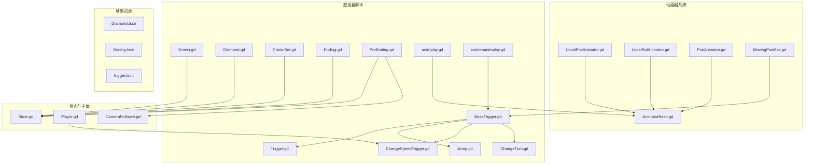

**图表来源**
- [BaseTrigger.gd:1-38](file://#Template/[Scripts]/Trigger/BaseTrigger.gd#L1-L38)
- [AnimatorBase.gd:1-86](file://#Template/[Scripts]/Animator/AnimatorBase.gd#L1-L86)
- [LocalPosAnimator.gd:1-13](file://#Template/[Scripts]/Animator/LocalPosAnimator.gd#L1-L13)
- [LocalRotAnimator.gd:1-13](file://#Template/[Scripts]/Animator/LocalRotAnimator.gd#L1-L13)
- [PosAnimator.gd:1-44](file://#Template/[Scripts]/Animator/PosAnimator.gd#L1-L44)
- [MovingPosMax.gd:1-107](file://#Template/[Scripts]/Animator/MovingPosMax.gd#L1-L107)
- [animplay.gd:1-14](file://#Template/[Scripts]/Trigger/animplay.gd#L1-L14)
- [customanimplay.gd:1-67](file://#Template/[Scripts]/Trigger/customanimplay.gd#L1-L67)

## 核心组件
本节聚焦 BaseTrigger 基类与通用触发器 Trigger 的设计理念与扩展机制。

- 设计理念
  - 简化触发入口：基于 Area3D 的 body_entered 信号，集中处理进入逻辑
  - 一次性触发：通过 one_shot 控制触发次数
  - **更新**：简化基类设计：移除了复杂的触发器过滤机制，保留核心触发发射功能
  - 扩展点：子类仅需实现 _on_triggered(body) 即可注入自定义行为
  - 调试友好：debug_mode 输出触发日志
  - **更新**：移除了重置机制，简化了状态管理

- 生命周期与控制流
  - _ready(): 建立触发连接
  - _setup_trigger(): 建立 body_entered 与 _on_body_entered 的连接（幂等）
  - _on_body_entered(): 条件判断 → 标记使用 → 发出 triggered 信号 → 调用 _on_triggered
  - **更新**：简化了触发条件判断，仅检查 CharacterBody3D 类型
  - reset()/is_used(): **更新**：移除了重置功能，简化了状态管理

- 扩展机制
  - 继承 BaseTrigger 并导出参数（如高度、速度、新速度等）
  - 实现 _on_triggered(body) 完成具体行为（如修改速度、切换转向、播放动画等）
  - **更新**：移除了复杂的触发过滤机制，简化了扩展流程
  - 使用 triggered 信号与其他节点解耦协作（如通用触发器 Trigger）
  - **新增**：通过 AnimatorBase 基类实现统一的动画器架构

**章节来源**
- [BaseTrigger.gd:1-38](file://#Template/[Scripts]/Trigger/BaseTrigger.gd#L1-L38)

## 架构总览
触发器系统采用"基类 + 多种派生触发器"的分层架构，配合 State 状态管理与场景资源完成从输入到反馈的闭环。**新增**的动画器系统通过 AnimatorBase 基类提供统一的动画器架构，实现触发器与动画的解耦。

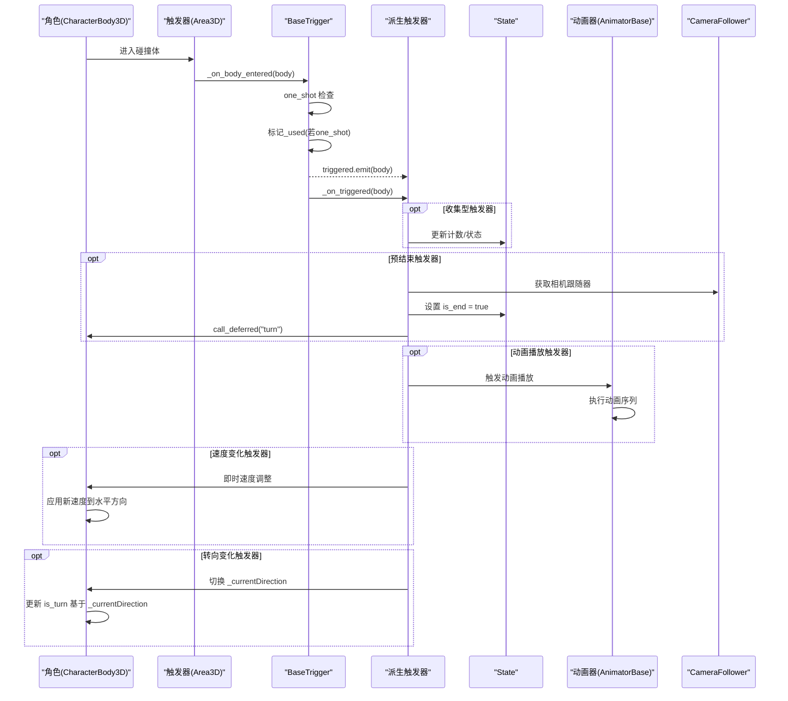

**图表来源**
- [BaseTrigger.gd:24-38](file://#Template/[Scripts]/Trigger/BaseTrigger.gd#L24-L38)
- [Trigger.gd:8-10](file://#Template/[Scripts]/Trigger/Trigger.gd#L8-L10)
- [AnimatorBase.gd:59-76](file://#Template/[Scripts]/Animator/AnimatorBase.gd#L59-L76)
- [PreEnding.gd:31-33](file://#Template/[Scripts]/Trigger/PreEnding.gd#L31-L33)
- [ChangeTurn.gd:6-11](file://#Template/[Scripts]/Trigger/ChangeTurn.gd#L6-L11)

## 详细组件分析

### BaseTrigger 基类
- 关键特性
  - **更新**：简化触发过滤：仅支持 CharacterBody3D 过滤策略
  - 一次性触发：one_shot 标记避免重复触发
  - 调试输出：debug_mode 打印触发日志
  - 扩展点：_on_triggered(body) 由子类实现
  - **更新**：移除了复杂的触发器过滤机制，简化了设计

- 数据结构与复杂度
  - 触发处理为 O(1)，整体触发处理为 O(1)
  - 信号连接建立为 O(1)，避免重复连接

- 错误处理与边界
  - 未连接信号时自动建立连接
  - one_shot 后忽略后续触发
  - **更新**：移除了默认过滤策略，简化了触发条件

**章节来源**
- [BaseTrigger.gd:1-38](file://#Template/[Scripts]/Trigger/BaseTrigger.gd#L1-L38)

### Jump 触发器（Jump.gd）
- 激活条件
  - 角色进入触发区域（默认过滤 CharacterBody3D）
- 执行时机
  - 进入时立即生效
- 参数配置
  - height：跳跃高度（决定起跳速度）
- 行为逻辑
  - 计算起跳速度并叠加到角色 velocity 的 Y 分量
  - 仅对 CharacterBody3D 生效

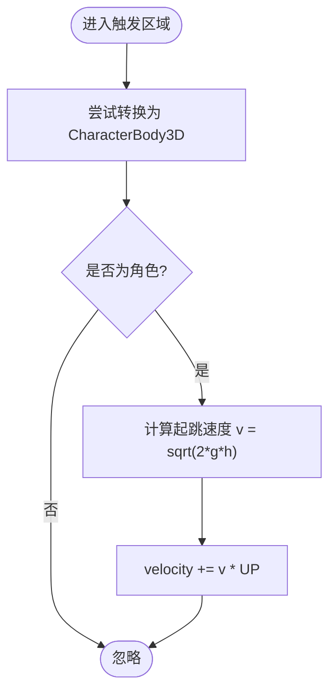

**图表来源**
- [Jump.gd:8-13](file://#Template/[Scripts]/Trigger/Jump.gd#L8-L13)

**章节来源**
- [Jump.gd:1-13](file://#Template/[Scripts]/Trigger/Jump.gd#L1-L13)

### ChangeSpeedTrigger（速度变化）（ChangeSpeedTrigger.gd）
- 激活条件
  - 角色进入触发区域（默认过滤 CharacterBody3D）
- 执行时机
  - 进入时立即生效
- 参数配置
  - new_speed：目标速度
- **更新**：增强了速度修改逻辑，增加了对 CharacterBody3D 实例的即时速度调整功能
- 行为逻辑
  - 设置 body.speed = new_speed
  - **更新**：对 CharacterBody3D 实例进行即时速度向量更新，确保速度变化立即生效
  - 提取当前速度的水平分量（x, z），保持垂直分量不变
  - 如果水平速度大于阈值，重新计算速度向量的方向并应用新速度
  - 依赖 Player.gd 的 turn() 方法在转向时自动应用新的速度值
  - 若检测到 body.is_start 为真，则同步更新移动向量 v

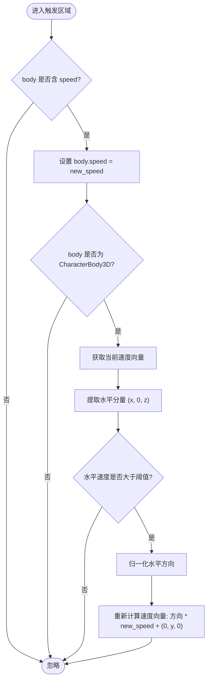

**图表来源**
- [ChangeSpeedTrigger.gd:8-17](file://#Template/[Scripts]/Trigger/ChangeSpeedTrigger.gd#L8-L17)

**章节来源**
- [ChangeSpeedTrigger.gd:1-18](file://#Template/[Scripts]/Trigger/ChangeSpeedTrigger.gd#L1-L18)

### ChangeTurn 触发器（转向变化）（ChangeTurn.gd）
- 激活条件
  - 角色进入触发区域（默认过滤 CharacterBody3D）
- 执行时机
  - 进入时立即生效
- 参数配置
  - 无导出参数
- **更新**：修改了触发逻辑以检查 `_currentDirection` 属性而非旧的 `is_turn` 布尔值
- **更新**：toggle 机制使用 `1 - body._currentDirection` 而非简单布尔取反
- 行为逻辑
  - 检查 body 是否包含 `_currentDirection` 属性
  - 如果存在，使用 `1 - body._currentDirection` 进行 toggle 操作
  - 检查 body 是否包含 `is_turn` 属性
  - 如果存在，根据 `_currentDirection` 的值更新 `is_turn` 状态

**更新**：ChangeTurn 触发器现在采用更精确的状态管理机制。传统的布尔值 `is_turn` 已被基于 `_currentDirection` 属性的数值状态所取代。这种设计提供了更好的状态一致性，因为 `_currentDirection` 作为数值属性（0 或 1）能够准确反映当前的转向状态，而不仅仅是布尔值。

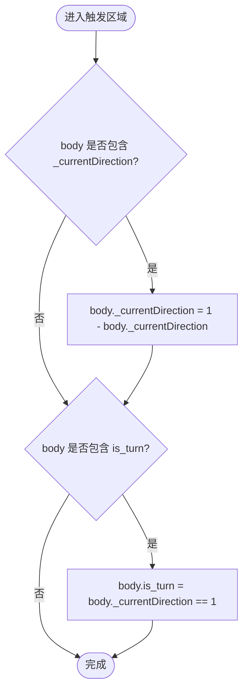

**图表来源**
- [ChangeTurn.gd:6-11](file://#Template/[Scripts]/Trigger/ChangeTurn.gd#L6-L11)

**章节来源**
- [ChangeTurn.gd:1-12](file://#Template/[Scripts]/Trigger/ChangeTurn.gd#L1-L12)

### Trigger 通用触发器（Trigger.gd）
- 激活条件
  - 任意进入触发区域的节点（默认过滤 Any）
- 执行时机
  - 进入时发出 hit_the_line 信号
- 参数配置
  - 无导出参数
- 行为逻辑
  - 发出 hit_the_line 信号，供其他节点订阅

**章节来源**
- [Trigger.gd:1-10](file://#Template/[Scripts]/Trigger/Trigger.gd#L1-L10)

### 收集型触发器：Crown（皇冠）（Crown.gd）
- 激活条件
  - 物理角色进入触发区域
- 执行时机
  - 进入时立即处理
- 参数配置
  - speed：旋转速度
  - tag：标识当前皇冠组别（1/2/3）
- **更新**：简化动画实现，直接使用 AnimationPlayer 播放收集动画
- 行为逻辑
  - 增加 State.crown 计数
  - 使用 State.save_checkpoint() 方法简化状态管理
  - **更新**：直接播放 crown 动画并等待结束，随后释放节点
  - 根据 tag 标记对应检查点状态

**章节来源**
- [Crown.gd:1-21](file://#Template/[Scripts]/Trigger/Crown.gd#L1-L21)

### 收集型触发器：Diamond（钻石）（Diamond.gd）
- 激活条件
  - 任意进入触发区域的节点（默认过滤 Any）
- 执行时机
  - 进入时立即处理
- 参数配置
  - speed：旋转速度
- **更新**：简化动画实现，直接使用 AnimationPlayer 播放收集动画
- 行为逻辑
  - 增加 State.diamond 计数
  - **更新**：直接播放 diamond 动画并开启粒子效果，等待动画结束后释放节点

**章节来源**
- [Diamond.gd:1-15](file://#Template/[Scripts]/Trigger/Diamond.gd#L1-L15)
- [Diamond.tscn:1-127](file://#Template/Diamond.tscn#L1-L127)

### CrownSet（多皇冠状态管理）（CrownSet.gd）
- 功能概述
  - 基于 State 中的检查点状态与当前 tag，管理多皇冠状态显示
  - 通过 AnimationPlayer 播放 crown_change 动画，实现皇冠状态切换
  - 自动重置 tag 状态，确保状态机正确流转
- 执行时机
  - 每帧轮询 State 标志位，实时响应状态变化
- 参数配置
  - tag：当前皇冠组别标识（1-3）
- 行为逻辑
  - 初始化时播放 RESET 动画，设置初始状态
  - 每帧检查：State.line_crossing_crown >= tag 且 tag 在有效范围内
  - 当 State.crowns[tag-1] == 1 时，播放 crown_change 动画
  - 动画完成后将 tag 置零，表示该组皇冠状态已处理

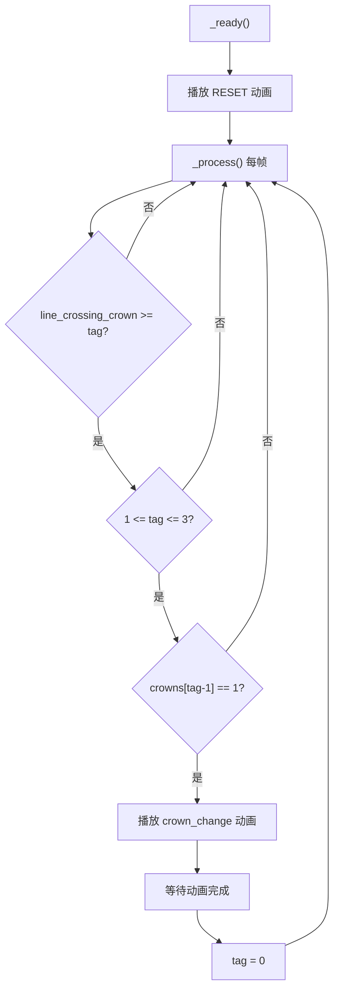

**图表来源**
- [CrownSet.gd:7-13](file://#Template/[Scripts]/Trigger/CrownSet.gd#L7-L13)

**章节来源**
- [CrownSet.gd:1-13](file://#Template/[Scripts]/Trigger/CrownSet.gd#L1-L13)

### Ending 终点触发器（Ending.gd）
- 激活条件
  - 角色进入触发区域（默认过滤 CharacterBody3D）
- 执行时机
  - 进入时立即生效
- 参数配置
  - 无导出参数
- 行为逻辑
  - **更新**：简化为仅设置 State.is_end = true 标记游戏结束
  - 移除了复杂的结局序列处理逻辑

**章节来源**
- [Ending.gd:1-9](file://#Template/[Scripts]/Trigger/Ending.gd#L1-L9)

### PreEnding 预结束触发器（PreEnding.gd）
- 激活条件
  - 角色进入触发区域（默认过滤 CharacterBody3D）
- 执行时机
  - 进入时立即生效
- 参数配置
  - Offset：相机偏移向量
- **更新**：重写了结局序列，使用 call_deferred() 确保正确的序列执行
- 行为逻辑
  - 获取 CameraFollower.instance 相机跟随器并进行平滑过渡
  - 播放 jinzita 动画
  - 使角色朝向触发器方向
  - 将旋转角度调整到 5 度的倍数
  - 设置 body.rot、body.tailScale 和调用 body.turn()
  - **更新**：使用 call_deferred("turn") 确保动画播放完成后执行转向操作
  - 设置 body.is_end = true 标记游戏结束

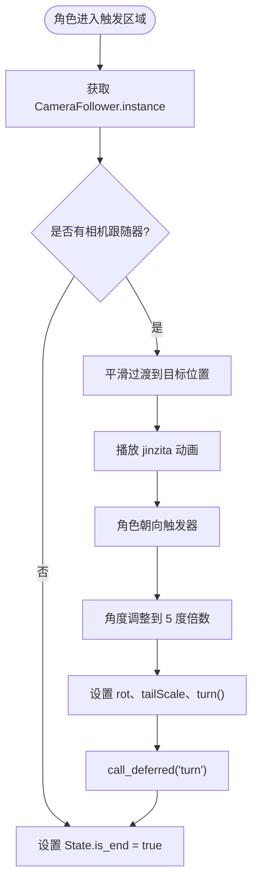

**图表来源**
- [PreEnding.gd:6-33](file://#Template/[Scripts]/Trigger/PreEnding.gd#L6-L33)

**章节来源**
- [PreEnding.gd:1-33](file://#Template/[Scripts]/Trigger/PreEnding.gd#L1-L33)

### 动画播放触发器：animplay.gd
- 功能概述
  - **新增**：基于 AnimationPlayer 的简单动画播放触发器
  - 支持批量播放多个动画序列
  - 通过触发器信号自动播放动画
- 参数配置
  - play_amim：要播放的动画名称数组
  - trigger：关联的触发器节点
- 行为逻辑
  - 在 _ready() 时连接触发器的 hit_the_line 信号
  - 收到信号后依次播放指定的动画

**章节来源**
- [animplay.gd:1-14](file://#Template/[Scripts]/Trigger/animplay.gd#L1-L14)

### 动画播放触发器：customanimplay.gd
- 功能概述
  - **新增**：增强版动画播放触发器，支持多 AnimationPlayer
  - 提供编辑器预览功能
  - 自动选择动画名称的智能机制
- 参数配置
  - animations：AnimationPlayer 节点数组
  - animation_names：指定的动画名称数组
- 行为逻辑
  - _on_triggered() 发射 hit_the_line 信号并播放动画
  - _play_animations() 智能播放动画序列
  - _get_animation_name() 优先使用指定名称，否则使用当前或第一个动画

**章节来源**
- [customanimplay.gd:1-67](file://#Template/[Scripts]/Trigger/customanimplay.gd#L1-L67)

### 与游戏状态管理的交互（State.gd）
- 全局状态字段
  - 主线条变换、相机跟随参数、转向状态、动画时间、结算相关标志
  - 皇冠与钻石计数、检查点标记
  - **新增**：crowns 数组 [0, 0, 0] 用于管理三组皇冠状态
  - **新增**：is_end 标志用于游戏结束状态管理
- **更新**：State.save_checkpoint() 方法提供统一的状态保存接口
  - 保存主线条变换和转向状态
  - 保存相机跟随器的相对位置、旋转偏移、距离和跟随速度
  - 保存当前动画播放位置和音乐播放进度
  - 设置 line_crossing_crown 和对应的 crowns 标志
- 交互要点
  - 收集型触发器在触发时更新相应计数与标志位
  - CrownSet 触发器读取 State.crowns 数组状态，实现多皇冠状态管理
  - 通用触发器通过信号驱动外部逻辑
  - **更新**：Ending 触发器现在仅设置 State.is_end 标志
  - **更新**：PreEnding 触发器承担了复杂的结局序列处理
  - **更新**：ChangeTurn 触发器现在使用 `_currentDirection` 属性进行状态管理

**章节来源**
- [State.gd:1-190](file://#Template/[Scripts]/State.gd#L1-L190)

## 动画器系统
**新增**：AnimatorBase 基类及各类专用动画器构成统一的动画器架构，实现触发器与动画的解耦。

### AnimatorBase 基类
- 核心功能
  - 统一的动画属性访问接口：_get_value()、_set_value()、_get_property_name()
  - 内置的 Tween 动画播放：play_()
  - 触发器集成：自动连接触发器的 hit_the_line 信号
  - 编辑器支持：@export_tool_button 提供可视化控制
- 参数配置
  - start_value：起始值（Vector3）
  - end_offset：结束偏移值（Vector3）
  - duration：动画持续时间
  - TransitionType：缓动类型
  - EaseType：缓和类型
  - trigger：关联的触发器节点
- 信号系统
  - on_animation_start：动画开始信号
  - on_animation_end：动画结束信号

**章节来源**
- [AnimatorBase.gd:1-86](file://#Template/[Scripts]/Animator/AnimatorBase.gd#L1-L86)

### 专用动画器

#### LocalPosAnimator（本地位置动画）
- 继承关系：extends AnimatorBase
- 属性映射：position ↔ start_value/end_offset
- 使用场景：需要在本地坐标系下移动的动画对象

**章节来源**
- [LocalPosAnimator.gd:1-13](file://#Template/[Scripts]/Animator/LocalPosAnimator.gd#L1-L13)

#### LocalRotAnimator（本地旋转动画）
- 继承关系：extends AnimatorBase
- 属性映射：rotation_degrees ↔ start_value/end_offset
- 使用场景：需要在本地坐标系下旋转的动画对象

**章节来源**
- [LocalRotAnimator.gd:1-13](file://#Template/[Scripts]/Animator/LocalRotAnimator.gd#L1-L13)

#### PosAnimator（位置动画）
- 继承关系：extends Node3D
- 功能特点：独立的动画播放器，无需 BaseTrigger 基类
- 使用场景：简单的单次位置动画

**章节来源**
- [PosAnimator.gd:1-44](file://#Template/[Scripts]/Animator/PosAnimator.gd#L1-L44)

#### MovingPosMax（序列移动动画）
- 继承关系：extends BaseTrigger
- 功能特点：支持多路径点序列的连续移动
- 参数配置：target_positions、move_durations、wait_times
- 使用场景：复杂的路径跟随动画

**章节来源**
- [MovingPosMax.gd:1-107](file://#Template/[Scripts]/Animator/MovingPosMax.gd#L1-L107)

## 依赖关系分析
- 继承关系
  - Jump、ChangeSpeedTrigger、ChangeTurn、Trigger 均继承自 BaseTrigger
  - Crown、Diamond 继承自 Area3D，不依赖 BaseTrigger
  - **新增**：CrownSet 继承自 Node3D，独立管理多皇冠状态
  - **更新**：Ending 继承自 Area3D，现在仅负责设置结束标志
  - **新增**：PreEnding 继承自 BaseTrigger，承担复杂的结局序列处理
  - **新增**：AnimatorBase 作为所有动画器的基类
  - **新增**：LocalPosAnimator、LocalRotAnimator、PosAnimator、MovingPosMax 继承自 AnimatorBase 或 BaseTrigger
  - **更新**：移除了复杂的触发器过滤机制，简化了继承层次

- 信号与事件
  - BaseTrigger 通过 triggered 信号与派生类解耦
  - Trigger 通过 hit_the_line 信号对外广播
  - **新增**：AnimatorBase 通过 on_animation_start/on_animation_end 信号管理动画生命周期
  - 场景资源通过连接函数名绑定到脚本方法

- 外部依赖
  - Player 提供速度控制和转向逻辑
  - **更新**：CameraFollower.instance 提供相机跟随器获取能力
  - 场景资源提供网格、碰撞形状与动画库
  - **新增**：CrownSet 依赖 State.crowns 数组状态
  - **更新**：Crown 触发器依赖 State.save_checkpoint() 方法
  - **更新**：Ending 触发器依赖 State.is_end 标志
  - **新增**：PreEnding 触发器依赖 CameraFollower.instance 获取相机跟随器
  - **新增**：动画器系统依赖 AnimatorBase 提供统一的动画接口
  - **更新**：ChangeSpeedTrigger 依赖 Player.gd 的速度应用机制
  - **更新**：ChangeTurn 触发器依赖 Player.gd 的 `_currentDirection` 属性进行状态管理

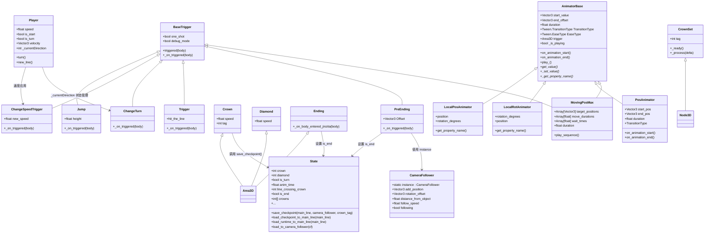

**图表来源**
- [BaseTrigger.gd:6-38](file://#Template/[Scripts]/Trigger/BaseTrigger.gd#L6-L38)
- [AnimatorBase.gd:6-21](file://#Template/[Scripts]/Animator/AnimatorBase.gd#L6-L21)
- [LocalPosAnimator.gd:3-12](file://#Template/[Scripts]/Animator/LocalPosAnimator.gd#L3-L12)
- [LocalRotAnimator.gd:3-12](file://#Template/[Scripts]/Animator/LocalRotAnimator.gd#L3-L12)
- [PosAnimator.gd:4-22](file://#Template/[Scripts]/Animator/PosAnimator.gd#L4-L22)
- [MovingPosMax.gd:7-24](file://#Template/[Scripts]/Animator/MovingPosMax.gd#L7-L24)
- [CameraFollower.gd:4](file://#Template/[Scripts]/CameraScripts/CameraFollower.gd#L4)

## 性能考量
- 触发频率与开销
  - BaseTrigger 的触发处理均为 O(1)，适合高频触发场景
  - one_shot 可减少重复处理成本
  - **更新**：简化了触发条件判断，进一步降低了开销
- **新增**：动画器系统性能优化
  - AnimatorBase 使用 Tween.create_tween() 进行硬件加速的动画插值
  - 编辑器模式下的预览功能避免了运行时开销
  - 多动画器实例间的资源共享机制
- 动画与粒子
  - 收集型触发器播放短时动画与粒子，建议在队列释放前完成
  - **新增**：CrownSet 的每帧检查开销较小，但需注意大量 CrownSet 实例时的性能影响
  - **更新**：Ending 触发器的开销大幅降低，仅设置一个布尔标志
  - **新增**：PreEnding 触发器的动画播放开销较小，但需确保动画资源优化
  - **新增**：动画器系统支持动画池化，减少频繁创建销毁的开销
- **更新**：State.save_checkpoint() 方法优化了状态保存性能
  - 统一的状态保存接口减少了重复代码
  - 避免了手动状态复制可能产生的性能损耗
- 信号风暴
  - 通用触发器 Trigger 可能被大量触发器共享，注意避免过度订阅导致的信号风暴
  - **新增**：动画器系统通过 AnimatorBase 统一管理信号，避免信号风暴
- **更新**：移除了复杂的触发器过滤机制，减少了不必要的计算开销
- **更新**：ChangeSpeedTrigger 优化
  - **更新**：增强了即时速度向量更新逻辑，确保速度变化立即生效
  - 依赖 Player.gd 的 turn() 方法在转向时自动应用新的速度值
  - 仅对 CharacterBody3D 实例进行速度调整，避免对非物理对象产生副作用
- **更新**：PreEnding 触发器优化
  - 使用 call_deferred() 确保动画播放完成后执行转向操作
  - 改进了序列执行的可靠性，避免动画播放与转向操作的竞态条件
- **更新**：Player.gd 中的速度应用优化
  - 通过 ChangeSpeedTrigger 的即时调整，确保速度变化在同一步骤内生效
  - 保持垂直速度分量不变，只调整水平方向的速度
- **更新**：ChangeTurn 触发器优化
  - **更新**：采用基于 `_currentDirection` 属性的 toggle 机制，提供更精确的状态管理
  - 使用 `1 - body._currentDirection` 进行数值切换，避免布尔值的不确定性
  - **更新**：与 Player.gd 的 `_currentDirection` 属性保持一致，确保状态同步

## 故障排查指南
- 触发无效
  - 检查 one_shot 与角色类型是否匹配
  - 确认 body_entered 信号连接正常（基类已自动建立）
  - **更新**：检查触发器类型是否为 CharacterBody3D
- 行为异常
  - Jump：确认角色具备 velocity 字段且为 CharacterBody3D
  - **更新**：ChangeSpeedTrigger：确认目标节点具备 speed 字段，**更新**：现在会即时调整 CharacterBody3D 的速度向量
  - **更新**：ChangeTurn：确认目标节点具备 `_currentDirection` 属性，**更新**：检查 toggle 机制是否正确使用 `1 - body._currentDirection`
  - **更新**：Ending：确认仅设置 State.is_end 标志
  - **新增**：PreEnding：确认 CameraFollower.instance 存在，**更新**：检查 call_deferred 序列执行
- 收集型触发器
  - Crown/Diamond：确认 State 计数与标志位正确更新
  - **新增**：CrownSet：确认 State.crowns 数组状态正确设置，tag 值在 1-3 范围内
  - **更新**：Crown：确认 State.save_checkpoint() 调用成功
- **新增**：动画器系统故障排查
  - AnimatorBase：检查 start_value、end_offset、duration 参数设置
  - LocalPosAnimator/LocalRotAnimator：确认属性映射正确
  - PosAnimator：检查位置参数和过渡类型设置
  - MovingPosMax：验证路径点数组和时间配置
  - 动画播放：确认 AnimationPlayer 节点和动画库配置正确
- 场景资源问题
  - 确认场景中的连接函数名与脚本方法一致（如 _on_Crown_body_entered/_on_Diamond_body_entered）
  - **新增**：CrownSet 场景中 AnimationPlayer 的动画库配置正确
  - **更新**：Crown 场景中 AnimationPlayer 的 crown 动画配置正确
  - **新增**：Ending 场景中 AnimationPlayer 的 jinzita 动画配置正确
  - **新增**：PreEnding 场景中 AnimationPlayer 的 jinzita 动画配置正确
  - **新增**：动画器场景中 AnimatorBase 的参数导出正确
  - **新增**：trigger.tscn 场景中触发器连接函数名正确
- **更新**：架构简化后的故障排查
  - 确认触发器继承关系正确
  - 检查简化后的触发条件是否符合预期
  - 验证 PreEnding 触发器的相机跟随逻辑
  - **新增**：验证动画器系统中 AnimatorBase 的信号连接
  - **更新**：验证 ChangeSpeedTrigger 的增强速度调整逻辑
  - **更新**：验证 PreEnding 触发器的 call_deferred 序列执行
  - **新增**：验证 Player.gd 中的速度应用与 ChangeSpeedTrigger 的协调工作
  - **新增**：验证 CameraFollower.instance 的正确使用
  - **更新**：验证 ChangeTurn 触发器的 `_currentDirection` 属性检查逻辑
  - **更新**：验证 Player.gd 中 `_currentDirection` 属性的 toggle 机制

**章节来源**
- [BaseTrigger.gd:24-38](file://#Template/[Scripts]/Trigger/BaseTrigger.gd#L24-L38)
- [AnimatorBase.gd:49-50](file://#Template/[Scripts]/Animator/AnimatorBase.gd#L49-L50)
- [CrownSet.tscn:61-65](file://#Template/CrownSet.tscn#L61-L65)
- [Ending.tscn:92-94](file://#Template/Ending.tscn#L92-L94)
- [trigger.tscn:23](file://#Template/trigger.tscn#L23)
- [ChangeTurn.gd:6-11](file://#Template/[Scripts]/Trigger/ChangeTurn.gd#L6-L11)

## 结论
触发器系统通过 BaseTrigger 提供统一的触发框架，结合多种派生触发器满足不同玩法需求。**架构简化后，系统变得更加轻量化和易于维护，移除了复杂的触发器过滤、编辑器集成和重置机制，保留了核心触发发射功能。**

**重要更新**：引入了 PreEnding 触发器作为新的结局序列处理方案，承担了原本 Ending 触发器的复杂逻辑，包括相机跟随器的平滑过渡、角色朝向调整、动画播放等功能。这一设计分离了简单的结束标志设置和复杂的结局处理，提高了系统的模块化程度。

**新增**：动画系统重构带来了全新的 AnimatorBase 基类和专用动画器，实现了触发器与动画的完全解耦。通过统一的动画接口，开发者可以轻松创建各种类型的动画效果，同时保持系统的高性能和易维护性。

**新增**：模板场景文件获得了新的触发器组件，包括优化的 trigger.tscn 场景，提供了更好的可视化网格控制和调试支持。Ending 触发器现在具有更精确的角度调整算法，确保角色面向固定的角度。

**更新**：触发器系统的重构优化显著提升了系统的可靠性和性能：
- **更新**：ChangeSpeedTrigger 增强了速度修改逻辑，增加了对 CharacterBody3D 实例的即时速度调整功能，确保速度变化立即生效
- **更新**：PreEnding 触发器使用 call_deferred() 确保动画播放完成后执行转向操作，避免了动画播放与转向操作的竞态条件
- **更新**：ChangeTurn 触发器现在使用基于 `_currentDirection` 属性的 toggle 机制，提供更精确的状态管理
- 简化了触发器的触发条件判断，进一步降低了系统开销
- **更新**：Player.gd 中的速度应用与 ChangeSpeedTrigger 的协调更加紧密，确保速度变化的连贯性
- **更新**：CameraFollower.instance 提供了稳定的相机跟随器访问机制

遵循本文的扩展指南与最佳实践，可快速开发新的触发器类型并保持系统的可维护性与性能。

## 附录

### 开发新触发器的步骤与最佳实践
- 步骤
  - 继承 BaseTrigger 或直接使用 Area3D（如收集型）
  - 导出必要的参数（如高度、速度、新速度、tag 等）
  - 实现 _on_triggered(body) 注入行为
  - 在场景中添加碰撞体与可视化网格（可选），并建立信号连接
  - **新增**：对于状态管理型触发器，考虑与 State.gd 的集成方式
  - **新增**：对于需要动画效果的触发器，考虑使用 AnimatorBase 基类
  - **更新**：对于需要即时物理效果的触发器，考虑与 Player.gd 的速度应用机制协调
  - **新增**：对于需要相机跟随的触发器，考虑使用 CameraFollower.instance
  - **更新**：对于需要转向状态管理的触发器，考虑使用 `_currentDirection` 属性而非简单布尔值
- 最佳实践
  - 明确触发过滤器与 one_shot 策略
  - 使用 debug_mode 排查触发链路
  - 对外暴露最小必要参数，避免过度耦合
  - 收尾时及时释放节点或重置状态
  - **新增**：合理使用 State.gd 的全局状态，避免状态竞争
  - **更新**：优先使用 State.save_checkpoint() 等封装好的状态管理方法
  - **新增**：利用 AnimatorBase 的统一动画接口，实现一致的动画体验
  - **更新**：参考 PreEnding 的 call_deferred 模式，确保序列执行的正确性
  - **更新**：参考 ChangeSpeedTrigger 的即时速度调整模式，确保物理效果的连贯性
  - **新增**：参考 PreEnding 的相机跟随器使用模式，确保相机系统的稳定性
  - **更新**：参考 ChangeTurn 的 `_currentDirection` 属性管理模式，确保状态一致性
- 注意事项
  - 避免在触发回调中进行重型计算
  - 通用触发器避免滥用，防止信号风暴
  - 收集型触发器需与 State 同步更新，保证结算逻辑正确
  - **更新**：简化后的触发器系统减少了状态管理复杂度
  - **新增**：PreEnding 触发器需要确保 CameraFollower.instance 存在
  - **新增**：动画器系统需要正确配置 AnimatorBase 的参数和信号连接
  - **更新**：ChangeSpeedTrigger 现在会即时调整 CharacterBody3D 的速度向量
  - **更新**：PreEnding 触发器使用 call_deferred() 确保正确的执行顺序
  - **更新**：Player.gd 中的速度应用与 ChangeSpeedTrigger 协调工作，确保速度变化的立即生效
  - **新增**：CameraFollower.instance 需要在场景初始化时正确设置
  - **更新**：ChangeTurn 触发器现在使用 `_currentDirection` 属性进行状态管理，确保与 Player.gd 的状态同步
  - **更新**：Player.gd 中的 `_currentDirection` 属性使用 `1 - _currentDirection` 进行 toggle，提供数值状态管理

### 关键流程图：收集型触发器（Crown/Diamond）
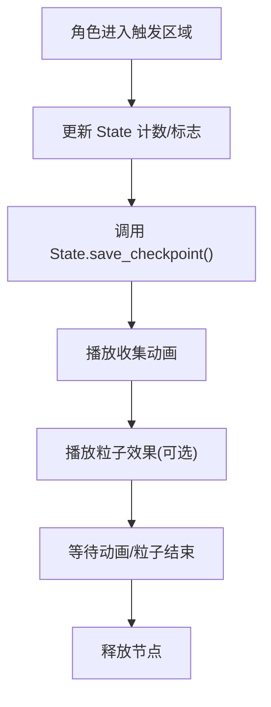

**图表来源**
- [Crown.gd:16-21](file://#Template/[Scripts]/Trigger/Crown.gd#L16-L21)
- [Diamond.gd:6-11](file://#Template/[Scripts]/Trigger/Diamond.gd#L6-L11)

### 关键流程图：多皇冠状态管理（CrownSet）
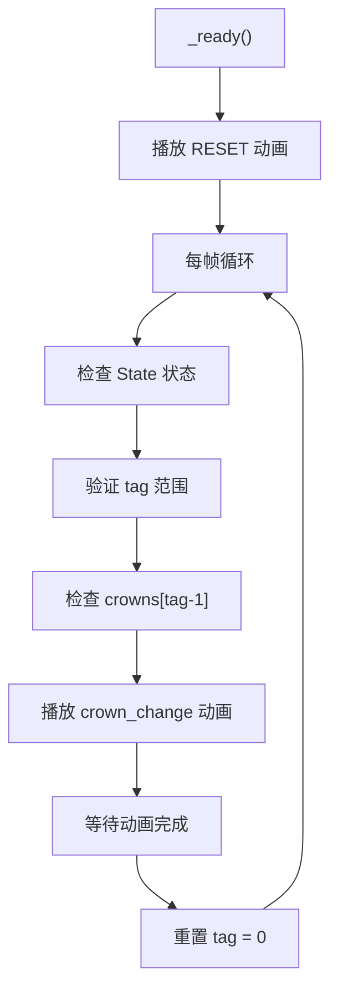

**图表来源**
- [CrownSet.gd:7-13](file://#Template/[Scripts]/Trigger/CrownSet.gd#L7-L13)

### 关键流程图：Ending 终点触发器
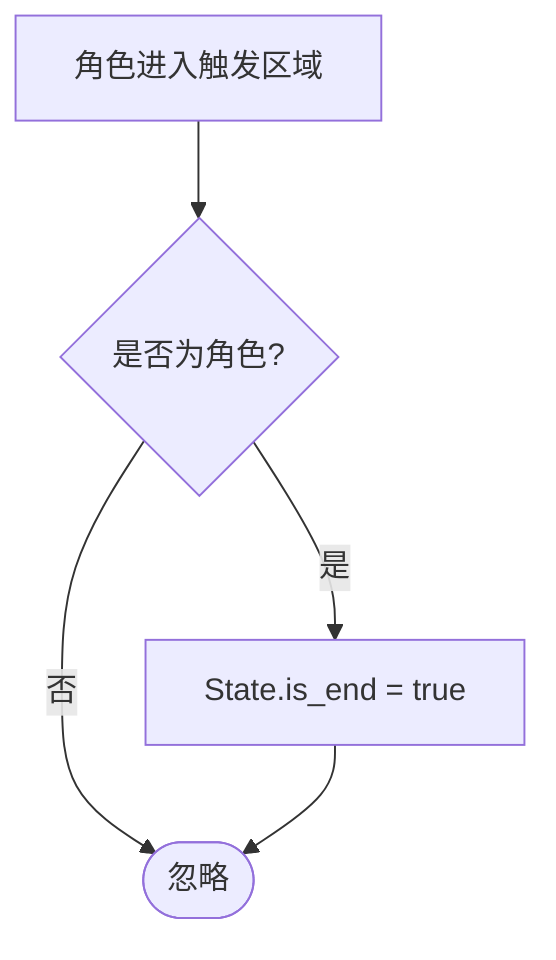

**图表来源**
- [Ending.gd:6-9](file://#Template/[Scripts]/Trigger/Ending.gd#L6-L9)

### 关键流程图：PreEnding 预结束触发器
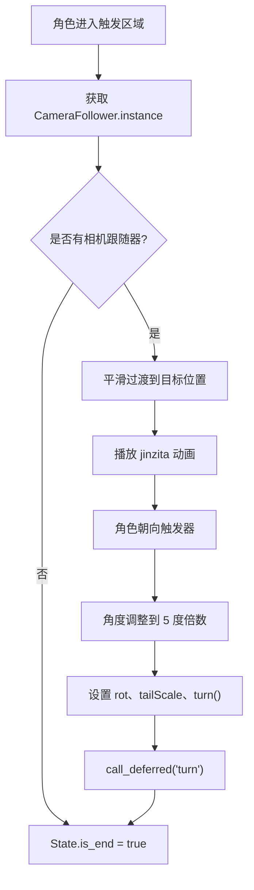

**图表来源**
- [PreEnding.gd:6-33](file://#Template/[Scripts]/Trigger/PreEnding.gd#L6-L33)

### 关键流程图：动画器系统集成
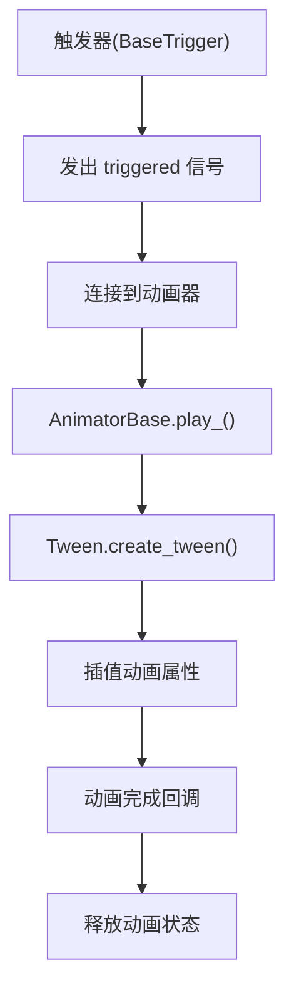

**图表来源**
- [AnimatorBase.gd:59-76](file://#Template/[Scripts]/Animator/AnimatorBase.gd#L59-L76)

### 关键流程图：ChangeSpeedTrigger 增强逻辑
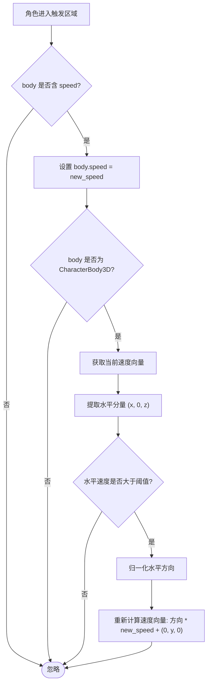

**图表来源**
- [ChangeSpeedTrigger.gd:8-17](file://#Template/[Scripts]/Trigger/ChangeSpeedTrigger.gd#L8-L17)

### 关键流程图：ChangeTurn 触发器更新逻辑
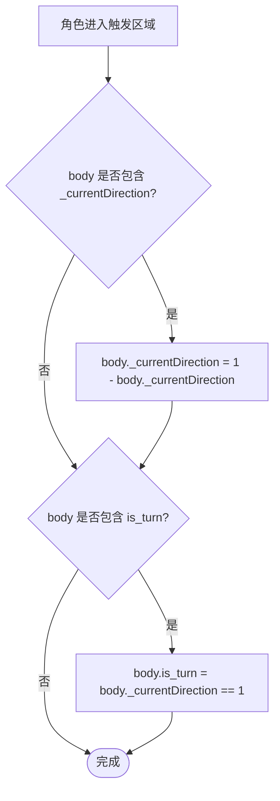

**图表来源**
- [ChangeTurn.gd:6-11](file://#Template/[Scripts]/Trigger/ChangeTurn.gd#L6-L11)

### State.save_checkpoint() 方法详解
**新增**：State.save_checkpoint() 是触发器系统的核心状态管理方法，提供统一的状态保存接口。

- 方法签名
  - static func save_checkpoint(main_line: PhysicsBody3D, camera_follower: Node3D, crown_tag: int) -> void

- 保存内容
  - 主线条变换（transform）和转向状态（is_turn）
  - 当前动画播放位置（anim_time）
  - 相机跟随器的相对位置、旋转偏移、距离和跟随速度
  - 音乐播放进度（music_checkpoint_time）
  - 设置 line_crossing_crown 和对应的 crowns 标志

- 性能优势
  - 统一的状态保存逻辑，避免重复代码
  - 减少了手动状态复制的开销和错误风险
  - 提供了更好的可维护性和扩展性

**章节来源**
- [State.gd:46-66](file://#Template/[Scripts]/State.gd#L46-L66)

### AnimatorBase 基类使用指南
**新增**：AnimatorBase 提供统一的动画器架构，简化动画系统的开发。

- 基本使用步骤
  1. 创建继承自 AnimatorBase 的动画器类
  2. 实现 _get_value()、_set_value()、_get_property_name() 三个虚函数
  3. 在场景中配置动画参数（start_value、end_offset、duration 等）
  4. 连触摸发器的 hit_the_line 信号到 play_() 方法
  5. 在动画完成后自动回到起始状态（编辑器模式）

- 参数配置最佳实践
  - start_value：使用编辑器的 Set Start 按钮自动记录当前值
  - end_offset：使用 Set End Offset 按钮设置目标偏移
  - duration：根据动画效果调整合适的持续时间
  - TransitionType：选择合适的缓动类型（如 TRANS_SINE、TRANS_QUAD 等）
  - EaseType：根据动画特性选择 EaseType（EASE_IN、EASE_OUT、EASE_IN_OUT）

**章节来源**
- [AnimatorBase.gd:1-86](file://#Template/[Scripts]/Animator/AnimatorBase.gd#L1-L86)

### 架构简化说明
**更新**：触发器系统经历了重大架构简化，主要变更包括：

- 移除复杂的触发器过滤机制
  - 简化为仅支持 CharacterBody3D 过滤策略
  - 移除了 Any 和 PhysicsBody3D 的特殊处理
  - 降低了触发条件判断的复杂度

- 移除编辑器集成和重置机制
  - 删除了 @tool 装饰器的支持
  - 移除了复杂的重置功能
  - 简化了触发器的生命周期管理

- 保留核心触发发射功能
  - 保持了 BaseTrigger 的基本触发逻辑
  - 维护了 triggered 信号的解耦设计
  - 确保了扩展机制的完整性

- **新增**：动画系统重构
  - 触发器模式下的动画组件迁移至 Animator 目录
  - 新增 AnimatorBase 基类，提供统一的动画器架构
  - 支持多种专用动画器：LocalPosAnimator、LocalRotAnimator、PosAnimator、MovingPosMax
  - 实现触发器与动画的完全解耦

- **新增**：动画播放触发器升级
  - animplay.gd 提供简单的 AnimationPlayer 动画播放
  - customanimplay.gd 支持多 AnimationPlayer 和智能动画选择
  - 编辑器预览功能提升开发效率

- **新增**：新触发器类型
  - PreEnding 触发器：作为新的结局序列处理方案，承担了复杂的相机跟随和动画逻辑
  - **更新**：PreEnding 触发器使用 call_deferred() 确保正确的序列执行

- **更新**：触发器系统优化
  - **更新**：ChangeSpeedTrigger 增强了即时速度调整功能，确保速度变化立即生效
  - **更新**：PreEnding 触发器改进了定时机制，使用 call_deferred() 确保正确的序列执行
  - **更新**：ChangeTurn 触发器现在使用基于 `_currentDirection` 属性的 toggle 机制
  - 简化了 Player.gd 中的速度应用逻辑，依赖 turn() 方法自动应用新速度
  - **更新**：Player.gd 中的速度应用与 ChangeSpeedTrigger 协调工作，确保速度变化的连贯性
  - **新增**：CameraFollower.instance 提供了稳定的相机跟随器访问机制

这些简化措施显著降低了系统的复杂度，提高了代码的可维护性和性能表现，同时通过新的动画器系统提升了动画开发的灵活性和一致性。

**章节来源**
- [BaseTrigger.gd:1-38](file://#Template/[Scripts]/Trigger/BaseTrigger.gd#L1-L38)
- [AnimatorBase.gd:1-86](file://#Template/[Scripts]/Animator/AnimatorBase.gd#L1-L86)
- [Ending.gd:1-9](file://#Template/[Scripts]/Trigger/Ending.gd#L1-L9)
- [PreEnding.gd:1-33](file://#Template/[Scripts]/Trigger/PreEnding.gd#L1-L33)
- [ChangeSpeedTrigger.gd:1-18](file://#Template/[Scripts]/Trigger/ChangeSpeedTrigger.gd#L1-L18)
- [ChangeTurn.gd:1-12](file://#Template/[Scripts]/Trigger/ChangeTurn.gd#L1-L12)
- [Player.gd:160-185](file://#Template/[Scripts]/Level/Player.gd#L160-L185)
- [CameraFollower.gd:4](file://#Template/[Scripts]/CameraScripts/CameraFollower.gd#L4)