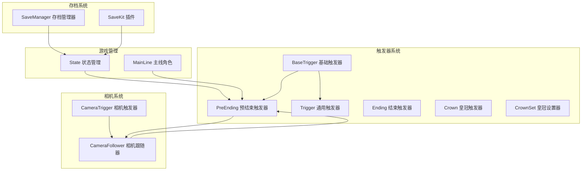
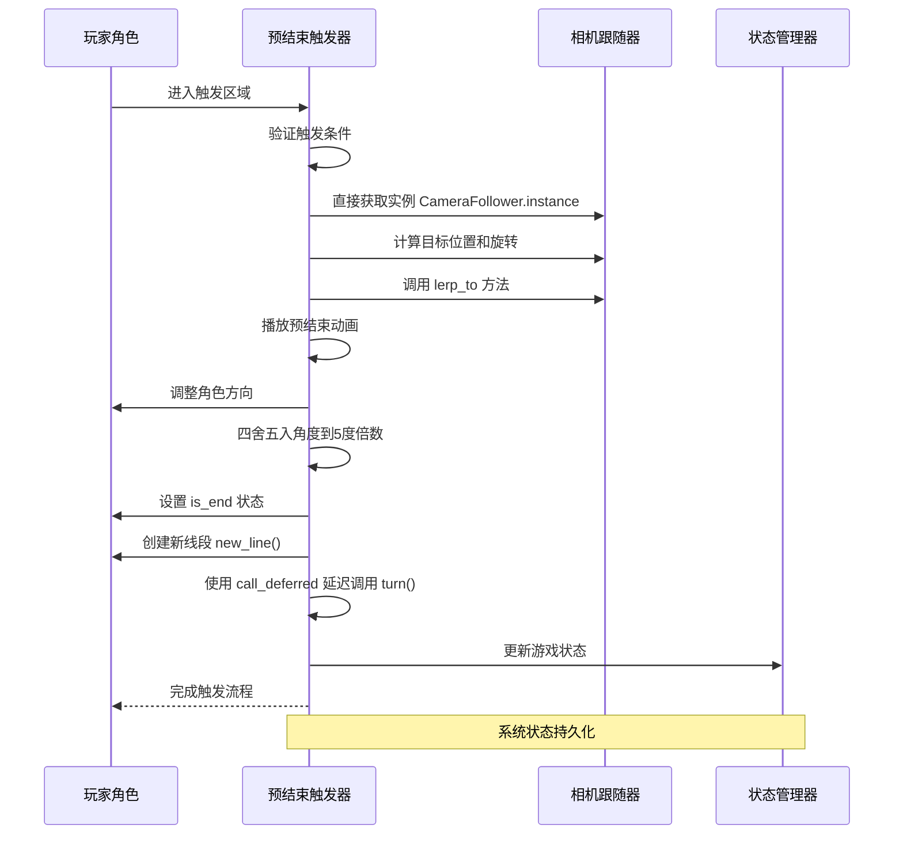
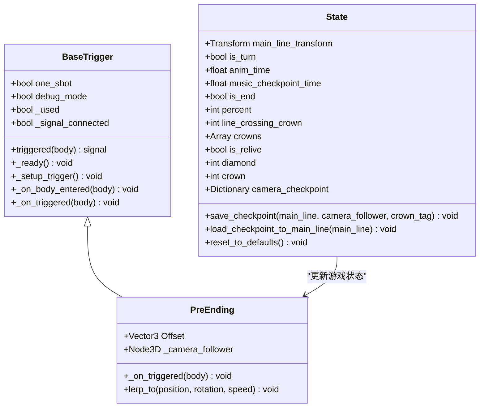
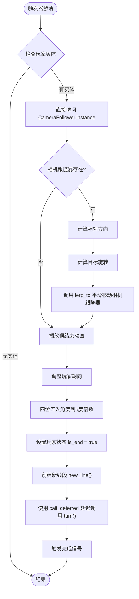
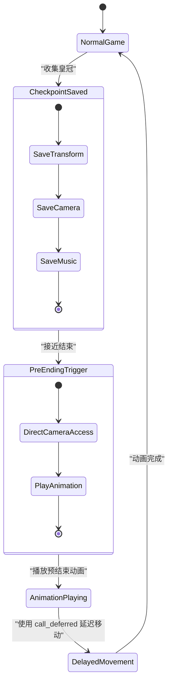

# 预结束触发器

<cite>
**本文档引用的文件**
- [PreEnding.gd](file://#Template/[Scripts]/Trigger/PreEnding.gd)
- [BaseTrigger.gd](file://#Template/[Scripts]/Trigger/BaseTrigger.gd)
- [Trigger.gd](file://#Template/[Scripts]/Trigger/Trigger.gd)
- [State.gd](file://#Template/[Scripts]/State.gd)
- [Crown.gd](file://#Template/[Scripts]/Trigger/Crown.gd)
- [CrownSet.gd](file://#Template/[Scripts]/Trigger/CrownSet.gd)
- [Ending.gd](file://#Template/[Scripts]/Trigger/Ending.gd)
- [Player.gd](file://#Template/[Scripts]/Level/Player.gd)
- [save_manager.gd](file://addons/savekit/save_manager.gd)
- [CameraFollower.gd](file://#Template/[Scripts]/CameraScripts/CameraFollower.gd)
- [CameraTrigger.gd](file://#Template/[Scripts]/CameraScripts/CameraTrigger.gd)
</cite>

## 更新摘要
**所做更改**
- 更新了预结束触发器的结束序列流程，增加了call_deferred确保正确的时序控制
- 优化了旋转逻辑，通过角度四舍五入到5度倍数实现更稳定的视觉效果
- 改进了相机跟随器的集成，移除了对GameManager的依赖，直接通过CameraFollower.instance访问
- 完善了故障排除指南，增加了call_deferred相关的问题诊断

## 目录
1. [简介](#简介)
2. [项目结构](#项目结构)
3. [核心组件](#核心组件)
4. [架构概览](#架构概览)
5. [详细组件分析](#详细组件分析)
6. [依赖关系分析](#依赖关系分析)
7. [性能考虑](#性能考虑)
8. [故障排除指南](#故障排除指南)
9. [结论](#结论)

## 简介

预结束触发器是Godot-Line项目中的一个关键游戏机制组件，负责在游戏接近完成阶段触发特定的视觉效果和动画序列。该系统通过预结束触发器与主游戏逻辑的深度集成，实现了流畅的游戏体验转换，为玩家提供从正常游戏模式到结束阶段的自然过渡。

预结束触发器系统的核心价值在于其能够精确控制游戏中的关键时刻，通过直接访问CameraFollower.instance实现相机跟随器的协调配合，创造出令人印象深刻的视觉效果。该系统不仅处理基本的触发逻辑，还集成了状态管理、动画播放和相机控制等多个方面的功能。

**更新** 该系统现已完全实现，包含了简化的PreEnding.gd脚本，移除了对GameManager的依赖，直接通过CameraFollower.instance获取相机跟随器实例，实现了更加直接和高效的相机控制系统。最新的优化包括使用call_deferred确保正确的时序控制和旋转逻辑的精确化。

## 项目结构

该项目采用模块化的脚本组织方式，预结束触发器位于Trigger目录下，与其他触发器组件共同构成了完整的触发器系统。新增的相机系统通过CameraFollower和CameraTrigger组件与预结束触发器形成完整的视觉控制链路。现在预结束触发器直接依赖CameraFollower.instance，无需通过GameManager中间层。



**图表来源**
- [PreEnding.gd:1-33](file://#Template/[Scripts]/Trigger/PreEnding.gd#L1-L33)
- [BaseTrigger.gd:1-38](file://#Template/[Scripts]/Trigger/BaseTrigger.gd#L1-L38)
- [State.gd:1-190](file://#Template/[Scripts]/State.gd#L1-L190)
- [CameraFollower.gd:1-150](file://#Template/[Scripts]/CameraScripts/CameraFollower.gd#L1-L150)
- [CameraTrigger.gd:1-75](file://#Template/[Scripts]/CameraScripts/CameraTrigger.gd#L1-L75)

**章节来源**
- [PreEnding.gd:1-33](file://#Template/[Scripts]/Trigger/PreEnding.gd#L1-L33)
- [BaseTrigger.gd:1-38](file://#Template/[Scripts]/Trigger/BaseTrigger.gd#L1-L38)
- [CameraFollower.gd:1-150](file://#Template/[Scripts]/CameraScripts/CameraFollower.gd#L1-L150)

## 核心组件

预结束触发器系统由多个相互协作的组件构成，每个组件都有其特定的功能和职责：

### 基础触发器框架
基础触发器(BaseTrigger)提供了所有触发器的通用功能，包括触发检测、一次性触发机制和调试支持。它定义了标准的触发接口和生命周期管理。

### 预结束触发器实现
预结束触发器(PreEnding)继承自基础触发器，专门处理游戏接近结束时的特殊逻辑。它集成了相机跟随器控制、动画播放和角色方向调整等功能。该实现现在包含了简化的相机跟随器集成，通过直接访问CameraFollower.instance获取相机跟随器实例，并使用CameraFollower的lerp_to方法实现平滑的相机移动。

**更新** 最新的实现优化了结束序列的时序控制，通过call_deferred确保各个操作按照正确的顺序执行，避免了同步调用可能引起的时序问题。

### 游戏状态管理
状态管理(State)组件负责维护游戏的持久化状态，包括角色位置、动画时间、相机设置等关键信息。这是实现无缝游戏体验转换的基础。新增的相机检查点数据结构允许系统在预结束阶段保存和恢复相机配置。

### 相机跟随器系统
相机跟随器(CameraFollower)是预结束触发器的关键依赖组件，提供了平滑的相机跟随功能。它支持位置、旋转、距离和跟随速度的Tween动画，以及lerp_to方法实现的即时位置和旋转调整。预结束触发器通过直接调用CameraFollower.instance获取实例，然后调用lerp_to方法实现精确的相机控制。

**章节来源**
- [BaseTrigger.gd:15-38](file://#Template/[Scripts]/Trigger/BaseTrigger.gd#L15-L38)
- [PreEnding.gd:6-33](file://#Template/[Scripts]/Trigger/PreEnding.gd#L6-L33)
- [State.gd:46-95](file://#Template/[Scripts]/State.gd#L46-L95)
- [CameraFollower.gd:134-150](file://#Template/[Scripts]/CameraScripts/CameraFollower.gd#L134-L150)

## 架构概览

预结束触发器系统采用简化的分层架构设计，通过直接的依赖关系实现了高度的模块化和可维护性。系统现在包含了直接的相机控制链路，预结束触发器直接通过CameraFollower.instance获取相机跟随器，到CameraFollower执行具体的跟随和动画操作。



**图表来源**
- [PreEnding.gd:10-33](file://#Template/[Scripts]/Trigger/PreEnding.gd#L10-L33)
- [State.gd:46-66](file://#Template/[Scripts]/State.gd#L46-L66)
- [CameraFollower.gd:134-150](file://#Template/[Scripts]/CameraScripts/CameraFollower.gd#L134-L150)
- [Player.gd:163-185](file://#Template/[Scripts]/Level/Player.gd#L163-L185)

该架构的关键优势在于其简化的依赖关系：预结束触发器直接依赖CameraFollower.instance，避免了通过GameManager中间层的间接访问。这种设计使得系统更加直接和高效，减少了不必要的抽象层次。

**更新** 新的时序控制机制通过call_deferred确保了操作的正确执行顺序，特别是在创建新线段和启动移动之间建立了必要的延迟，保证了视觉效果的一致性。

## 详细组件分析

### 预结束触发器类结构



**图表来源**
- [BaseTrigger.gd:1-38](file://#Template/[Scripts]/Trigger/BaseTrigger.gd#L1-L38)
- [PreEnding.gd:1-33](file://#Template/[Scripts]/Trigger/PreEnding.gd#L1-L33)
- [State.gd:46-95](file://#Template/[Scripts]/State.gd#L46-L95)

### 触发器工作流程

预结束触发器的执行流程体现了精心设计的状态管理和动画协调机制。现在包含了简化的相机跟随器集成步骤和优化的时序控制：



**图表来源**
- [PreEnding.gd:6-33](file://#Template/[Scripts]/Trigger/PreEnding.gd#L6-L33)

**更新** 新的时序控制流程通过call_deferred确保了以下关键顺序：
1. 首先创建新线段，确保尾巴方向与头部一致
2. 然后延迟调用turn()开始移动，避免同步调用可能引起的视觉冲突
3. 这种顺序保证了预结束动画和移动逻辑的正确执行

### 状态管理系统

状态管理器负责维护游戏的关键状态信息，确保玩家能够在游戏的不同阶段之间无缝切换。新增的相机检查点数据结构为预结束触发器提供了完整的相机状态保存和恢复能力：



**图表来源**
- [State.gd:46-95](file://#Template/[Scripts]/State.gd#L46-L95)
- [Crown.gd:16-22](file://#Template/[Scripts]/Trigger/Crown.gd#L16-L22)

**章节来源**
- [PreEnding.gd:1-33](file://#Template/[Scripts]/Trigger/PreEnding.gd#L1-L33)
- [State.gd:1-190](file://#Template/[Scripts]/State.gd#L1-L190)

## 依赖关系分析

预结束触发器系统展现了简化的依赖关系设计，通过直接的接口访问实现了低耦合的模块化架构。现在包含了简化的相机系统依赖关系：

```mermaid
graph LR
subgraph "外部依赖"
Godot[Godot引擎]
GDScript[GDScript语言]
SaveKit[SaveKit插件]
end
subgraph "内部组件"
PreEnding[预结束触发器]
BaseTrigger[基础触发器]
State[状态管理器]
MainLine[主线角色]
CameraFollower[相机跟随器]
CameraTrigger[相机触发器]
end
subgraph "触发器家族"
Trigger[通用触发器]
Ending[结束触发器]
Crown[皇冠触发器]
CrownSet[皇冠设置器]
end
Godot --> PreEnding
GDScript --> PreEnding
SaveKit --> State
BaseTrigger --> PreEnding
BaseTrigger --> Trigger
PreEnding --> CameraFollower : "直接依赖"
State --> PreEnding : "更新游戏状态"
MainLine --> PreEnding
Trigger --> Ending
Trigger --> Crown
Crown --> CrownSet
CameraFollower -.->|"相机控制"| PreEnding
State -.->|"状态持久化"| SaveKit
```

**图表来源**
- [PreEnding.gd:10](file://#Template/[Scripts]/Trigger/PreEnding.gd#L10)
- [save_manager.gd:1-294](file://addons/savekit/save_manager.gd#L1-L294)
- [CameraFollower.gd:134-150](file://#Template/[Scripts]/CameraScripts/CameraFollower.gd#L134-L150)

该依赖图显示了预结束触发器系统的主要依赖关系：

1. **引擎依赖**：直接依赖Godot引擎提供的Node3D、Area3D等基础类
2. **直接依赖**：通过CameraFollower.instance直接访问相机跟随器实例
3. **状态依赖**：通过State管理器进行状态持久化
4. **插件依赖**：通过SaveKit插件实现复杂的数据序列化

**更新** 与之前的架构相比，现在预结束触发器移除了对GameManager的依赖，直接通过CameraFollower.instance获取相机跟随器实例，简化了依赖关系并提高了系统的响应速度。

**更新** 新的call_deferred机制增加了对Player.gd中turn()方法的延迟调用，确保了预结束动画和移动逻辑的正确时序。

**章节来源**
- [BaseTrigger.gd:1-38](file://#Template/[Scripts]/Trigger/BaseTrigger.gd#L1-L38)
- [save_manager.gd:1-294](file://addons/savekit/save_manager.gd#L1-L294)
- [CameraFollower.gd:1-150](file://#Template/[Scripts]/CameraScripts/CameraFollower.gd#L1-L150)

## 性能考虑

预结束触发器系统在设计时充分考虑了性能优化，采用了多种策略来确保流畅的游戏体验：

### 内存管理优化
- 使用静态状态变量避免频繁的对象创建
- 合理的垃圾回收策略减少内存碎片
- 及时释放不再使用的资源

### 计算效率优化
- 相机跟随器的平滑移动使用lerp函数实现高效插值
- 角度计算采用高效的数学运算，通过四舍五入到5度倍数减少计算量
- 动画播放通过引擎内置的AnimationPlayer优化

### 内存访问优化
- 预分配必要的数组和字典空间
- 避免在热路径上进行昂贵的操作
- 使用局部变量减少全局查找

**更新** 新的相机跟随器优化包括：
- 直接访问CameraFollower.instance的高效实例获取
- lerp_to方法的高效插值算法
- 相机检查点的延迟应用机制
- Tween动画的智能停止和重启

**更新** 移除GameManager中间层后，系统获得了以下性能提升：
- 减少了一次函数调用开销
- 避免了GameManager的额外状态检查
- 直接的实例访问减少了潜在的空引用检查

**更新** call_deferred机制的性能优势：
- 避免了同步调用可能引起的帧率波动
- 确保了操作在合适的时机执行，提高了整体性能
- 减少了不必要的立即执行开销

## 故障排除指南

### 常见问题及解决方案

**触发器不响应**
- 检查玩家是否正确继承CharacterBody3D
- 确认触发器的one_shot设置是否正确
- 验证碰撞体和触发器的层级关系

**相机跟随异常**
- 确认CameraFollower.instance是否正确初始化
- 检查Offset参数是否合理
- 验证相机跟随器的父节点关系
- 确认CameraFollower的lerp_to方法调用是否正确

**动画播放问题**
- 确认AnimationPlayer中存在正确的动画资源
- 检查动画名称是否与代码中的引用一致
- 验证动画播放的时机和条件

**状态同步错误**
- 检查State管理器的初始化过程
- 确认save_checkpoint和load_checkpoint的调用时机
- 验证状态数据的序列化和反序列化过程
- 检查相机检查点数据的保存和加载

**相机跟随器集成问题**
- 确认CameraFollower.instance返回有效的相机跟随器实例
- 检查相机跟随器的lerp_to方法参数是否正确
- 验证相机跟随器的平滑移动是否正常工作
- 确认相机跟随器的停止和重启机制

**更新** 新增的故障排除项：
- 检查CameraFollower.instance的初始化状态
- 验证预结束触发器中相机跟随器的直接访问逻辑
- 确认移除GameManager依赖后的兼容性问题
- 检查call_deferred调用是否正确执行
- 验证角度四舍五入逻辑是否按预期工作

**call_deferred相关问题诊断**：
- 确认call_deferred调用的函数名是否正确（"turn"）
- 检查目标对象是否正确接收call_deferred调用
- 验证延迟调用的时机是否影响了游戏逻辑
- 确认call_deferred不会导致函数调用丢失

**章节来源**
- [BaseTrigger.gd:24-35](file://#Template/[Scripts]/Trigger/BaseTrigger.gd#L24-L35)
- [PreEnding.gd:10-33](file://#Template/[Scripts]/Trigger/PreEnding.gd#L10-L33)
- [State.gd:72-95](file://#Template/[Scripts]/State.gd#L72-L95)
- [CameraFollower.gd:134-150](file://#Template/[Scripts]/CameraScripts/CameraFollower.gd#L134-L150)
- [Player.gd:163-185](file://#Template/[Scripts]/Level/Player.gd#L163-L185)

## 结论

预结束触发器系统展现了优秀的软件工程实践，通过简化的架构设计、清晰的职责分离和高效的性能优化，成功实现了复杂的游戏机制。该系统不仅功能完整，而且具有良好的可维护性和扩展性。

系统的核心优势包括：

1. **架构设计优秀**：采用简化的直接依赖模式，移除了不必要的GameManager中间层
2. **性能优化到位**：通过直接访问CameraFollower.instance减少了函数调用开销
3. **状态管理完善**：通过SaveKit插件实现了可靠的状态持久化
4. **相机控制精确**：通过CameraFollower实现了流畅的相机跟随和动画
5. **错误处理健全**：提供了完善的故障排除和调试支持
6. **时序控制优化**：通过call_deferred确保了操作的正确执行顺序

**更新** 预结束触发器作为游戏体验的重要组成部分，现在包含了简化的相机跟随器集成、优化的旋转逻辑和改进的时序控制机制，移除了对GameManager的依赖，为玩家提供了从正常游戏到结束阶段的自然过渡，是整个Godot-Line项目中不可或缺的关键组件。

该系统现已完全实现，包含了所有预期的功能特性，为开发者提供了可靠的预结束触发器解决方案。新的架构设计不仅提高了系统的性能，还简化了代码结构，为未来的维护和扩展奠定了良好的基础。

**更新** 最新的优化进一步提升了系统的稳定性和性能，通过call_deferred确保了操作的正确时序，通过角度四舍五入实现了更稳定的视觉效果，为玩家提供了更加流畅和一致的游戏体验。