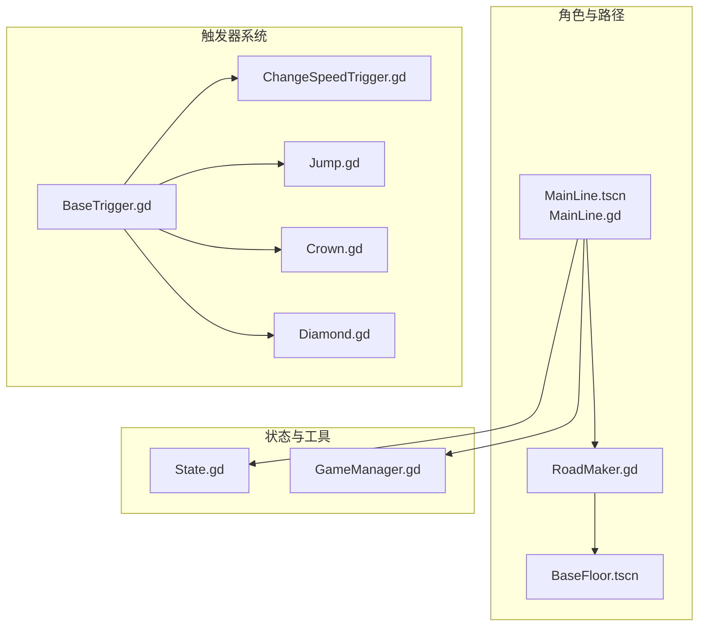
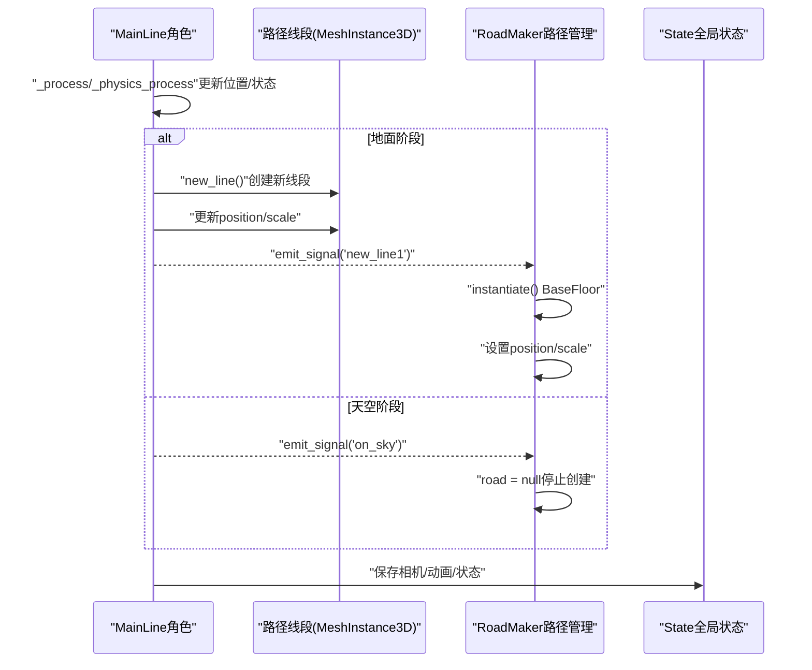
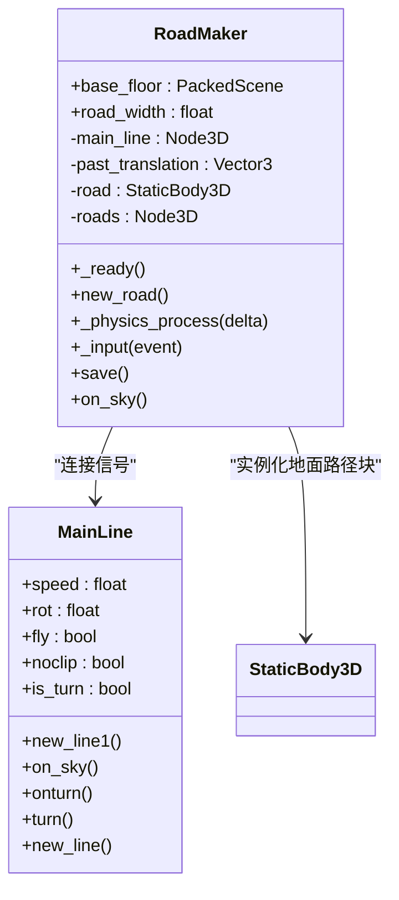
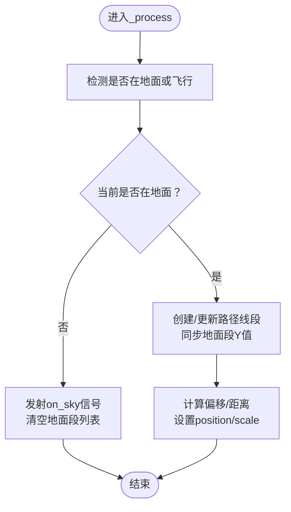
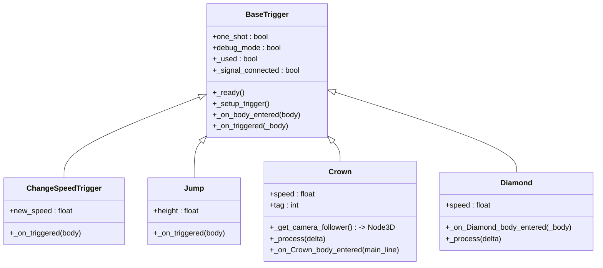
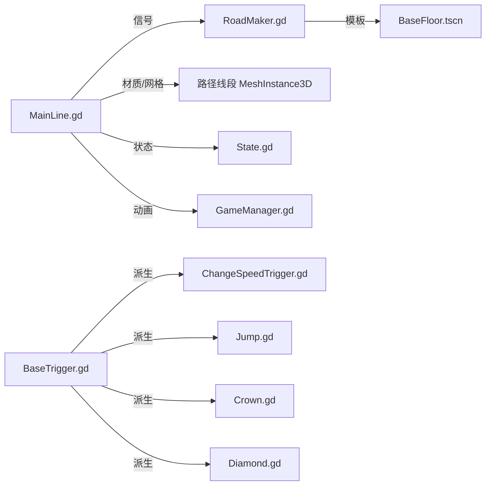

# 路径生成系统

<cite>
**本文档引用的文件**
- [MainLine.gd](file://#Template/[Scripts]/Level/MainLine.gd)
- [RoadMaker.gd](file://#Template/[Scripts]/Level/RoadMaker.gd)
- [BaseTrigger.gd](file://#Template/[Scripts]/Trigger/BaseTrigger.gd)
- [ChangeSpeedTrigger.gd](file://#Template/[Scripts]/Trigger/ChangeSpeedTrigger.gd)
- [Jump.gd](file://#Template/[Scripts]/Trigger/Jump.gd)
- [Crown.gd](file://#Template/[Scripts]/Trigger/Crown.gd)
- [Diamond.gd](file://#Template/[Scripts]/Trigger/Diamond.gd)
- [State.gd](file://#Template/[Scripts]/State.gd)
- [GameManager.gd](file://#Template/[Scripts]/GameManager.gd)
- [MainLine.tscn](file://#Template/MainLine.tscn)
- [BaseFloor.tscn](file://#Template/BaseFloor.tscn)
- [README.md](file://README.md)
</cite>

## 更新摘要
**所做更改**
- 更新了路径生成系统的核心架构，移除了RoadMaker场景依赖
- 重新设计了路径线段的创建和管理机制
- 更新了几何计算和材质应用的技术实现
- 完善了触发器系统与路径生成的协作关系
- 修正了文档中的文件路径引用错误

## 目录
1. [简介](#简介)
2. [项目结构](#项目结构)
3. [核心组件](#核心组件)
4. [架构总览](#架构总览)
5. [详细组件分析](#详细组件分析)
6. [依赖关系分析](#依赖关系分析)
7. [性能考虑](#性能考虑)
8. [故障排查指南](#故障排查指南)
9. [结论](#结论)
10. [附录](#附录)

## 简介
本文件面向"路径生成系统"的综合文档，重点阐述RoadMaker类与MainLine的协作机制，覆盖以下主题：
- 动态路径生成：从角色移动到路径线段创建的完整流程
- 路径线段的创建、管理与销毁：地面路径与空中路径的差异化处理
- 几何计算、材质应用与缩放变换的技术实现
- 路径优化策略、内存管理方案与性能调优建议
- 路径系统与触发器系统的协作关系

**重要更新**：RoadMaker场景已完全删除，路径生成系统进行了重大重构，采用更简洁的单脚本实现方式。

## 项目结构
围绕路径生成系统的关键文件组织如下：
- 角色与路径主体：MainLine.tscn与MainLine.gd
- 路径渲染与管理：RoadMaker.gd（重构后的单脚本实现）
- 地面路径资源：BaseFloor.tscn
- 触发器系统：BaseTrigger.gd及其派生类（如ChangeSpeedTrigger.gd、Jump.gd、Crown.gd、Diamond.gd）
- 全局状态与辅助：State.gd、GameManager.gd
- 文档与测试：README.md

**图表来源**
- [MainLine.tscn:1-72](file://#Template/MainLine.tscn#L1-L72)
- [RoadMaker.gd:1-46](file://#Template/[Scripts]/Level/RoadMaker.gd#L1-L46)
- [BaseFloor.tscn:1-20](file://#Template/BaseFloor.tscn#L1-L20)
- [BaseTrigger.gd:1-38](file://#Template/[Scripts]/Trigger/BaseTrigger.gd#L1-L38)
- [ChangeSpeedTrigger.gd:1-15](file://#Template/[Scripts]/Trigger/ChangeSpeedTrigger.gd#L1-L15)
- [Jump.gd:1-13](file://#Template/[Scripts]/Trigger/Jump.gd#L1-L13)
- [Crown.gd:1-21](file://#Template/[Scripts]/Trigger/Crown.gd#L1-L21)
- [Diamond.gd:1-15](file://#Template/[Scripts]/Trigger/Diamond.gd#L1-L15)
- [State.gd:1-196](file://#Template/[Scripts]/State.gd#L1-L196)
- [GameManager.gd:1-50](file://#Template/[Scripts]/GameManager.gd#L1-L50)

## 核心组件
- **MainLine**：负责角色移动、地面检测、路径线段的创建与几何更新，并在离地时切换到"天空"阶段。
- **RoadMaker**：重构后的单脚本实现，监听MainLine的信号，按帧根据位移偏移与缩放创建并维护地面路径块（StaticBody3D），并在需要时清空或保存。
- **BaseTrigger及其派生类**：提供统一的触发器框架，支持一次性触发、类型过滤与调试输出；派生类实现具体行为（如速度变化、跳跃、收集物品等）。
- **State**：全局状态容器，记录相机跟随参数、动画时间、关卡状态等，用于跨场景/重启时的状态恢复。
- **GameManager**：提供动画起始时间计算、颜色设置等辅助能力。

**章节来源**
- [MainLine.gd:1-218](file://#Template/[Scripts]/Level/MainLine.gd#L1-L218)
- [RoadMaker.gd:1-46](file://#Template/[Scripts]/Level/RoadMaker.gd#L1-L46)
- [BaseTrigger.gd:1-38](file://#Template/[Scripts]/Trigger/BaseTrigger.gd#L1-L38)
- [State.gd:1-196](file://#Template/[Scripts]/State.gd#L1-L196)
- [GameManager.gd:1-50](file://#Template/[Scripts]/GameManager.gd#L1-L50)

## 架构总览
路径生成系统由"角色驱动 + 路径渲染 + 触发器联动"构成的实时管线。MainLine在物理帧中根据角色位置与地面状态创建/更新路径线段；RoadMaker在地面阶段持续实例化地面路径块并进行缩放与定位；触发器系统在碰撞区域响应角色进入，执行相应效果。

**重要更新**：架构已简化，移除了独立的RoadMaker场景，采用更直接的脚本控制方式。

**图表来源**
- [MainLine.gd:53-104](file://#Template/[Scripts]/Level/MainLine.gd#L53-L104)
- [MainLine.gd:129-143](file://#Template/[Scripts]/Level/MainLine.gd#L129-L143)
- [RoadMaker.gd:12-46](file://#Template/[Scripts]/Level/RoadMaker.gd#L12-L46)
- [State.gd:1-196](file://#Template/[Scripts]/State.gd#L1-L196)

## 详细组件分析

### RoadMaker组件分析
**重要更新**：RoadMaker已从独立场景重构为单脚本实现，移除了复杂的场景依赖。

- **信号绑定**：在就绪时连接MainLine的新线段信号，实现"地面阶段创建路径块、离地阶段停止"的行为。
- **路径块创建**：每次收到新线段信号时，从base_floor场景实例化一个StaticBody3D，设置位置与层级所有权，加入集中管理的Node3D容器。
- **实时更新**：在物理帧中根据MainLine的位移偏移计算当前路径块的位置（中点）与缩放（沿Z轴拉伸，X/Z依据road_width与位移绝对值）。
- **天空处理**：收到天空信号时清空当前路径块引用，避免在空中继续创建。
- **持久化**：提供save()将集中容器打包为PackedScene并保存为资源文件。

**图表来源**
- [RoadMaker.gd:1-46](file://#Template/[Scripts]/Level/RoadMaker.gd#L1-L46)
- [MainLine.gd:4-7](file://#Template/[Scripts]/Level/MainLine.gd#L4-L7)

**章节来源**
- [RoadMaker.gd:12-46](file://#Template/[Scripts]/Level/RoadMaker.gd#L12-L46)

### MainLine组件分析
- **移动与物理**：在物理帧中处理重力、地面检测与移动滑行；在飞行模式下固定Y坐标。
- **路径线段创建**：当角色状态从"不在地面"变为"在地面"或处于飞行状态时，创建新的MeshInstance3D线段，继承材质与旋转，并将其挂入场景根节点下的PlayerTailHolder。
- **几何更新**：在地面阶段，根据当前位置与上次位置的偏移计算线段中点位置与沿Z轴的长度缩放；同时同步所有地面段的Y值以跟随地形高度。
- **天空阶段**：当角色离地时，发射on_sky信号并清空地面段列表，结束地面路径段的追加。
- **触发与转向**：提供turn()方法，播放动画并根据转向状态更新速度方向，同时发射onturn信号。
- **死亡与粒子**：死亡时暂停动画、播放音效并生成爆炸碎块粒子。

**图表来源**
- [MainLine.gd:75-104](file://#Template/[Scripts]/Level/MainLine.gd#L75-L104)
- [MainLine.gd:129-143](file://#Template/[Scripts]/Level/MainLine.gd#L129-L143)

**章节来源**
- [MainLine.gd:53-104](file://#Template/[Scripts]/Level/MainLine.gd#L53-L104)
- [MainLine.gd:129-172](file://#Template/[Scripts]/Level/MainLine.gd#L129-L172)

### 触发器系统协作分析
- **BaseTrigger**：提供统一的触发入口、一次性触发与类型过滤，子类仅需实现_on_triggered。
- **ChangeSpeedTrigger**：在角色进入时修改其速度并即时更新速度向量。
- **Jump**：在角色进入时施加向上速度，实现跳跃效果。
- **Crown/Diamond**：在角色碰撞时更新全局状态（如Crown数量、相机跟随参数、动画时间等），并播放对应动画与特效后销毁自身。

**图表来源**
- [BaseTrigger.gd:1-38](file://#Template/[Scripts]/Trigger/BaseTrigger.gd#L1-L38)
- [ChangeSpeedTrigger.gd:1-15](file://#Template/[Scripts]/Trigger/ChangeSpeedTrigger.gd#L1-L15)
- [Jump.gd:1-13](file://#Template/[Scripts]/Trigger/Jump.gd#L1-L13)
- [Crown.gd:1-21](file://#Template/[Scripts]/Trigger/Crown.gd#L1-L21)
- [Diamond.gd:1-15](file://#Template/[Scripts]/Trigger/Diamond.gd#L1-L15)

**章节来源**
- [BaseTrigger.gd:18-38](file://#Template/[Scripts]/Trigger/BaseTrigger.gd#L18-L38)
- [ChangeSpeedTrigger.gd:8-15](file://#Template/[Scripts]/Trigger/ChangeSpeedTrigger.gd#L8-L15)
- [Jump.gd:8-13](file://#Template/[Scripts]/Trigger/Jump.gd#L8-L13)
- [Crown.gd:15-21](file://#Template/[Scripts]/Trigger/Crown.gd#L15-L21)
- [Diamond.gd:6-15](file://#Template/[Scripts]/Trigger/Diamond.gd#L6-L15)

### 几何计算、材质应用与缩放变换
**重要更新**：几何计算逻辑已内置于MainLine中，RoadMaker仅负责路径块的实例化和位置更新。

- **几何计算**
  - MainLine：以当前位置与上次位置的差值计算线段中点与长度，沿Z轴拉伸以连接两段。
  - RoadMaker：以MainLine位移的中点作为路径块位置，X/Z方向缩放为road_width与位移绝对值之和。
- **材质应用**
  - MainLine：直接复用MeshInstance3D的表面材质，支持动态修改颜色。
  - RoadMaker：实例化的地面路径块使用BaseFloor.tscn的材质。
- **缩放变换**
  - MainLine：scale = (1, 1, distance + tailScale)，保持宽高不变，仅沿长度方向拉伸。
  - RoadMaker：scale = abs(offset) + (road_width, 1, road_width)，保证路径块与移动轨迹贴合。

**章节来源**
- [MainLine.gd:86-92](file://#Template/[Scripts]/Level/MainLine.gd#L86-L92)
- [RoadMaker.gd:32-33](file://#Template/[Scripts]/Level/RoadMaker.gd#L32-L33)
- [MainLine.gd:92](file://#Template/[Scripts]/Level/MainLine.gd#L92)
- [BaseFloor.tscn:1-20](file://#Template/BaseFloor.tscn#L1-L20)

### 路径生成完整流程说明
**重要更新**：流程已简化，移除了独立的RoadMaker场景，采用更直接的脚本控制。

- **角色移动**：MainLine在每帧更新位置与速度，处理重力与地面检测。
- **地面阶段**：当角色从非地面转为地面或处于飞行模式时，创建路径线段并更新其几何参数。
- **地面路径块**：RoadMaker监听新线段信号，实例化地面路径块并随角色移动同步位置与缩放。
- **天空阶段**：角色离地时，MainLine发射on_sky，RoadMaker停止创建新的路径块。
- **状态保存**：MainLine提供按钮事件触发RoadMaker.save()，将路径块容器打包保存为资源。

**章节来源**
- [MainLine.gd:75-104](file://#Template/[Scripts]/Level/MainLine.gd#L75-L104)
- [MainLine.gd:129-143](file://#Template/[Scripts]/Level/MainLine.gd#L129-L143)
- [RoadMaker.gd:12-46](file://#Template/[Scripts]/Level/RoadMaker.gd#L12-L46)
- [MainLine.gd:111-117](file://#Template/[Scripts]/Level/MainLine.gd#L111-L117)

## 依赖关系分析
**重要更新**：依赖关系已简化，移除了RoadMaker场景的复杂依赖。

- **MainLine依赖**
  - MeshInstance3D的网格与材质用于路径线段的外观与颜色
  - AnimationPlayer用于转向动画与状态恢复
  - Area3D用于死亡判定
- **RoadMaker依赖**
  - BaseFloor.tscn作为地面路径块的模板
  - MainLine的信号驱动创建与停止
- **触发器依赖**
  - BaseTrigger提供统一触发框架
  - 派生类依赖角色节点的属性（如speed、is_start）以实现行为
- **全局状态**
  - State记录相机跟随参数、动画时间、关卡状态，供GameManager与Crown/Diamond使用

**图表来源**
- [MainLine.gd:17-22](file://#Template/[Scripts]/Level/MainLine.gd#L17-L22)
- [RoadMaker.gd:3](file://#Template/[Scripts]/Level/RoadMaker.gd#L3)
- [BaseTrigger.gd:1-38](file://#Template/[Scripts]/Trigger/BaseTrigger.gd#L1-L38)
- [ChangeSpeedTrigger.gd:1-15](file://#Template/[Scripts]/Trigger/ChangeSpeedTrigger.gd#L1-L15)
- [Jump.gd:1-13](file://#Template/[Scripts]/Trigger/Jump.gd#L1-L13)
- [Crown.gd:1-21](file://#Template/[Scripts]/Trigger/Crown.gd#L1-L21)
- [Diamond.gd:1-15](file://#Template/[Scripts]/Trigger/Diamond.gd#L1-L15)
- [State.gd:1-196](file://#Template/[Scripts]/State.gd#L1-L196)
- [GameManager.gd:1-50](file://#Template/[Scripts]/GameManager.gd#L1-L50)

## 性能考虑
**重要更新**：性能优化策略已更新以反映新的实现方式。

- **路径线段数量控制**
  - 通过合理设置road_width与tailScale，减少不必要的细小线段数量。
  - 在天空阶段及时停止创建路径块，避免无效实例化。
- **几何更新频率**
  - MainLine仅在地面阶段更新线段，减少不必要的scale与position计算。
  - RoadMaker仅在存在当前路径块时更新，避免空引用导致的计算。
- **材质与网格共享**
  - MainLine与RoadMaker共享材质与网格资源，降低资源占用与切换开销。
- **动画与状态**
  - GameManager的动画起始时间计算基于2D距离与速度，避免频繁重算。
  - State仅存储必要状态，减少序列化与传输开销。
- **内存管理**
  - 路径块容器集中管理，退出时可统一释放；保存时使用PackedScene降低资源体积。
  - 触发器在使用后及时销毁，避免残留节点。

## 故障排查指南
**重要更新**：故障排查指南已更新以反映新的实现方式。

- **路径未生成**
  - 检查MainLine是否正确发射new_line1信号（地面状态切换时）。
  - 确认RoadMaker已连接信号且未在天空阶段停止。
- **路径错位或比例异常**
  - 核对MainLine的position与past_translation更新逻辑，确保偏移计算正确。
  - 检查RoadMaker的offset与scale计算，确认road_width与位移绝对值一致。
- **材质颜色不生效**
  - 确认MainLine的材质赋值与颜色设置接口正常工作。
- **触发器无效**
  - 检查BaseTrigger的触发过滤器与one_shot状态。
  - 确认派生类的_on_triggered实现是否正确调用。
- **保存失败**
  - 确认RoadMaker.save()调用路径与权限，PackedScene打包对象正确。
- **场景加载问题**
  - 确认MainLine.tscn和RoadMaker.gd的正确路径引用。
  - 检查BaseFloor.tscn资源路径是否有效。

**章节来源**
- [MainLine.gd:75-104](file://#Template/[Scripts]/Level/MainLine.gd#L75-L104)
- [RoadMaker.gd:12-46](file://#Template/[Scripts]/Level/RoadMaker.gd#L12-L46)
- [BaseTrigger.gd:24-35](file://#Template/[Scripts]/Trigger/BaseTrigger.gd#L24-L35)

## 结论
**重要更新**：结论已更新以反映重大架构重构。

本路径生成系统通过MainLine与RoadMaker的紧密协作，实现了从角色移动到地面路径块的自动化生成与管理。经过重大重构后，系统采用更简洁的单脚本实现方式，移除了复杂的场景依赖，提高了代码的可维护性和执行效率。系统在地面阶段精细控制路径线段的几何与材质，在天空阶段及时停止创建，结合触发器系统提供丰富的交互体验。通过合理的性能优化与内存管理策略，可在保证流畅度的同时扩展更多功能。

## 附录
- **关键输入与操作**
  - 转向：鼠标左键/空格
  - 重试：R
  - 保存：S
  - 重载：Q
  - 保存锥体：W

**章节来源**
- [README.md:1-50](file://README.md#L1-L50)