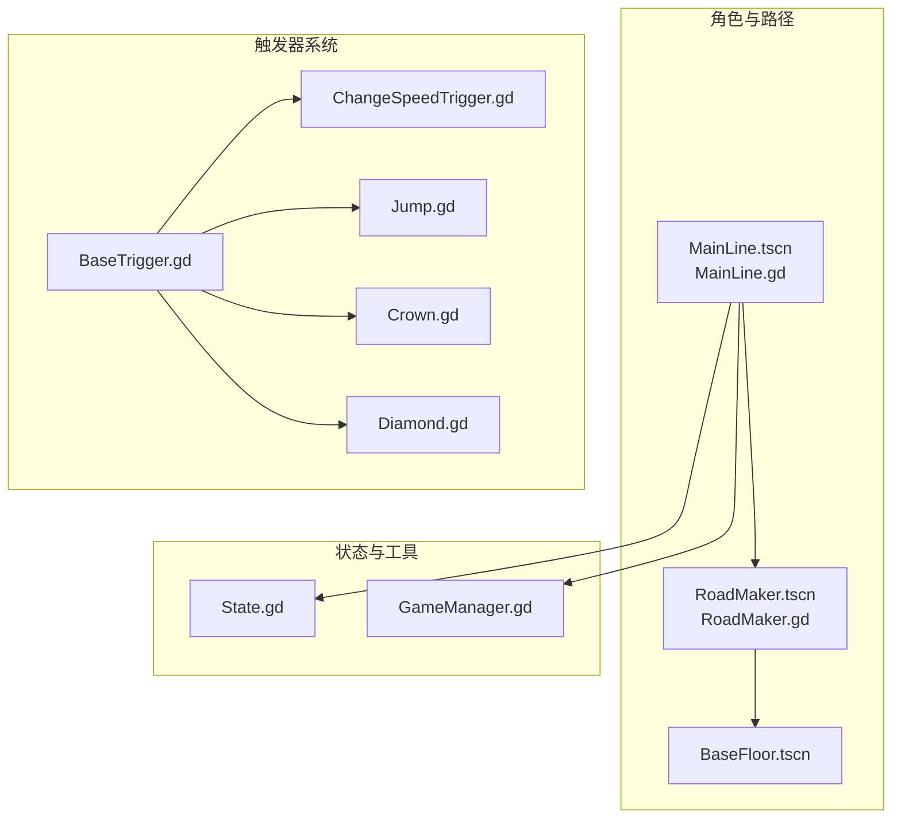
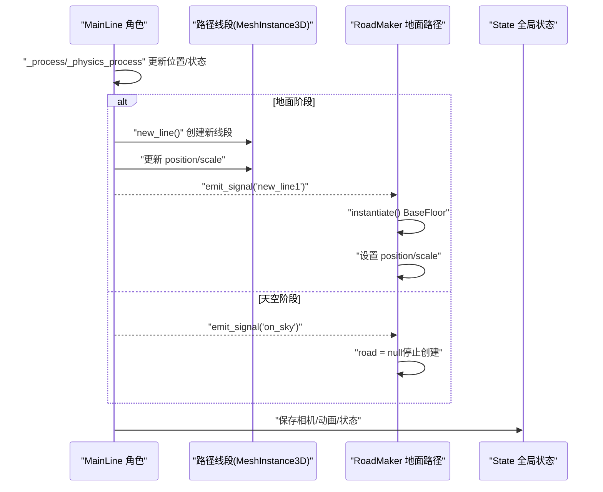
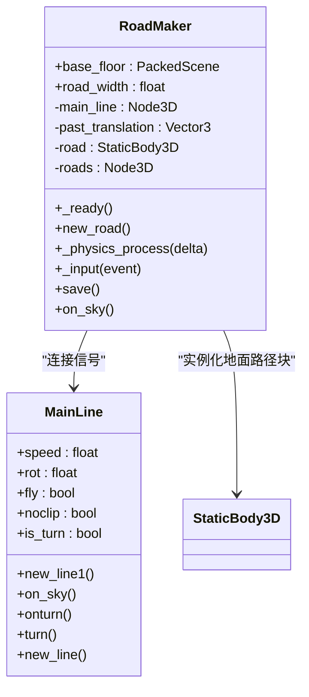
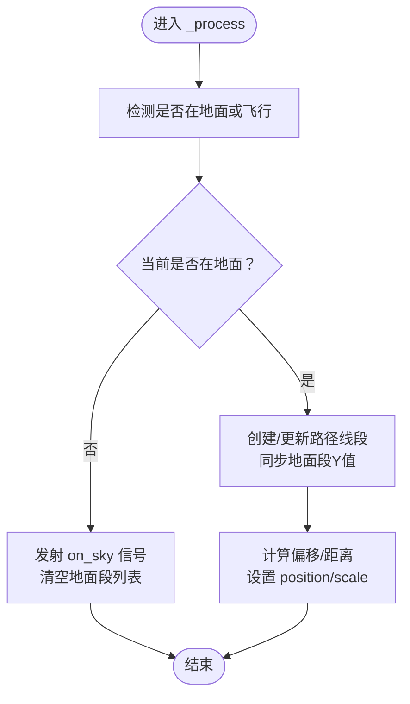
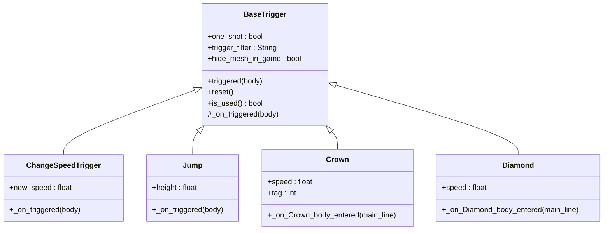
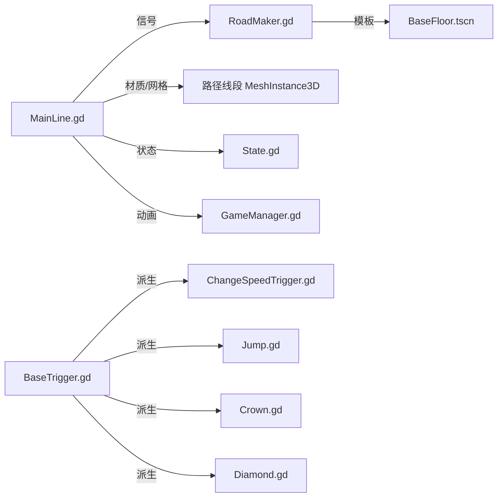

# 路径生成系统

<cite>
**本文引用的文件**
- [RoadMaker.gd](file://#Template/[Scripts]/RoadMaker.gd)
- [MainLine.gd](file://#Template/[Scripts]/MainLine.gd)
- [BaseTrigger.gd](file://#Template/[Scripts]/Trigger/BaseTrigger.gd)
- [ChangeSpeedTrigger.gd](file://#Template/[Scripts]/Trigger/ChangeSpeedTrigger.gd)
- [Jump.gd](file://#Template/[Scripts]/Trigger/Jump.gd)
- [Crown.gd](file://#Template/[Scripts]/Trigger/Crown.gd)
- [Diamond.gd](file://#Template/[Scripts]/Trigger/Diamond.gd)
- [State.gd](file://#Template/[Scripts]/State.gd)
- [GameManager.gd](file://#Template/[Scripts]/GameManager.gd)
- [MainLine.tscn](file://#Template/MainLine.tscn)
- [RoadMaker.tscn](file://#Template/RoadMaker.tscn)
- [BaseFloor.tscn](file://#Template/BaseFloor.tscn)
- [MainLine_test.gd](file://Tests/MainLine_test.gd)
- [README.md](file://README.md)
</cite>

## 目录
1. [简介](#简介)
2. [项目结构](#项目结构)
3. [核心组件](#核心组件)
4. [架构总览](#架构总览)
5. [详细组件分析](#详细组件分析)
6. [依赖关系分析](#依赖关系分析)
7. [性能考虑](#性能考虑)
8. [故障排查指南](#故障排查指南)
9. [结论](#结论)
10. [附录](#附录)

## 简介
本文件面向“路径生成系统”的综合文档，重点阐述 RoadMaker 类与 MainLine 的协作机制，覆盖以下主题：
- 动态路径生成：从角色移动到路径线段创建的完整流程
- 路径线段的创建、管理与销毁：地面路径与空中路径的差异化处理
- 几何计算、材质应用与缩放变换的技术实现
- 路径优化策略、内存管理方案与性能调优建议
- 路径系统与触发器系统的协作关系

## 项目结构
围绕路径生成系统的关键文件组织如下：
- 角色与路径主体：MainLine.tscn 与 MainLine.gd
- 路径渲染与持久化：RoadMaker.tscn 与 RoadMaker.gd
- 地面路径资源：BaseFloor.tscn
- 触发器系统：BaseTrigger.gd 及其派生类（如 ChangeSpeedTrigger.gd、Jump.gd、Crown.gd、Diamond.gd）
- 全局状态与辅助：State.gd、GameManager.gd
- 测试与文档：MainLine_test.gd、README.md

图表来源
- [MainLine.tscn:1-68](file://#Template/MainLine.tscn#L1-L68)
- [RoadMaker.tscn:1-10](file://#Template/RoadMaker.tscn#L1-L10)
- [BaseFloor.tscn:1-20](file://#Template/BaseFloor.tscn#L1-L20)
- [BaseTrigger.gd:1-102](file://#Template/[Scripts]/Trigger/BaseTrigger.gd#L1-L102)
- [ChangeSpeedTrigger.gd:1-15](file://#Template/[Scripts]/Trigger/ChangeSpeedTrigger.gd#L1-L15)
- [Jump.gd:1-13](file://#Template/[Scripts]/Trigger/Jump.gd#L1-L13)
- [Crown.gd:1-58](file://#Template/[Scripts]/Trigger/Crown.gd#L1-L58)
- [Diamond.gd:1-17](file://#Template/[Scripts]/Trigger/Diamond.gd#L1-L17)
- [State.gd:1-23](file://#Template/[Scripts]/State.gd#L1-L23)
- [GameManager.gd:1-47](file://#Template/[Scripts]/GameManager.gd#L1-L47)

章节来源
- [README.md:53-65](file://README.md#L53-L65)

## 核心组件
- MainLine：负责角色移动、地面检测、路径线段的创建与几何更新，并在离地时切换到“天空”阶段。
- RoadMaker：监听 MainLine 的信号，按帧根据位移偏移与缩放创建并维护地面路径块（StaticBody3D），并在需要时清空或保存。
- BaseTrigger 及其派生类：提供统一的触发器框架，支持一次性触发、类型过滤与调试输出；派生类实现具体行为（如速度变化、跳跃、收集物品等）。
- State：全局状态容器，记录相机跟随参数、动画时间、关卡状态等，用于跨场景/重启时的状态恢复。
- GameManager：提供动画起始时间计算、颜色设置等辅助能力。

章节来源
- [MainLine.gd:1-224](file://#Template/[Scripts]/MainLine.gd#L1-L224)
- [RoadMaker.gd:1-46](file://#Template/[Scripts]/RoadMaker.gd#L1-L46)
- [BaseTrigger.gd:1-102](file://#Template/[Scripts]/Trigger/BaseTrigger.gd#L1-L102)
- [State.gd:1-23](file://#Template/[Scripts]/State.gd#L1-L23)
- [GameManager.gd:1-47](file://#Template/[Scripts]/GameManager.gd#L1-L47)

## 架构总览
路径生成系统由“角色驱动 + 路径渲染 + 触发器联动”构成的实时管线。MainLine 在物理帧中根据角色位置与地面状态创建/更新路径线段；RoadMaker 在地面阶段持续实例化地面路径块并进行缩放与定位；触发器系统在碰撞区域响应角色进入，执行相应效果。

图表来源
- [MainLine.gd:75-103](file://#Template/[Scripts]/MainLine.gd#L75-L103)
- [MainLine.gd:139-161](file://#Template/[Scripts]/MainLine.gd#L139-L161)
- [RoadMaker.gd:22-46](file://#Template/[Scripts]/RoadMaker.gd#L22-L46)
- [State.gd:1-23](file://#Template/[Scripts]/State.gd#L1-L23)

## 详细组件分析

### RoadMaker 组件分析
- 信号绑定：在就绪时连接 MainLine 的 new_line1 与 on_sky 信号，实现“地面阶段创建路径块、离地阶段停止”的行为。
- 路径块创建：每次收到 new_line1 时，从 base_floor 场景实例化一个 StaticBody3D，设置位置与层级所有权，加入集中管理的 Node3D 容器。
- 实时更新：在物理帧中根据 MainLine 的位移偏移计算当前路径块的位置（中点）与缩放（沿 Z 轴拉伸，X/Z 依据 road_width 与位移绝对值）。
- 天空处理：收到 on_sky 信号时清空当前路径块引用，避免在空中继续创建。
- 持久化：提供 save() 将集中容器打包为 PackedScene 并保存为资源文件。

图表来源
- [RoadMaker.gd:1-46](file://#Template/[Scripts]/RoadMaker.gd#L1-L46)
- [MainLine.gd:4-26](file://#Template/[Scripts]/MainLine.gd#L4-L26)

章节来源
- [RoadMaker.gd:12-46](file://#Template/[Scripts]/RoadMaker.gd#L12-L46)

### MainLine 组件分析
- 移动与物理：在物理帧中处理重力、地面检测与移动滑行；在飞行模式下固定 Y 坐标。
- 路径线段创建：当角色状态从“不在地面”变为“在地面”或处于飞行状态时，创建新的 MeshInstance3D 线段，继承材质与旋转，并将其挂入场景根节点下的 PlayerTailHolder。
- 几何更新：在地面阶段，根据当前位置与上次位置的偏移计算线段中点位置与沿 Z 轴的长度缩放；同时同步所有地面段的 Y 值以跟随地形高度。
- 天空阶段：当角色离地时，发射 on_sky 信号并清空地面段列表，结束地面路径段的追加。
- 触发与转向：提供 turn() 方法，播放动画并根据转向状态更新速度方向，同时发射 onturn 信号。
- 死亡与粒子：死亡时暂停动画、播放音效并生成爆炸碎块粒子。

图表来源
- [MainLine.gd:75-103](file://#Template/[Scripts]/MainLine.gd#L75-L103)
- [MainLine.gd:139-161](file://#Template/[Scripts]/MainLine.gd#L139-L161)

章节来源
- [MainLine.gd:53-103](file://#Template/[Scripts]/MainLine.gd#L53-L103)
- [MainLine.gd:139-184](file://#Template/[Scripts]/MainLine.gd#L139-L184)

### 触发器系统协作分析
- BaseTrigger：提供统一的触发入口、一次性触发与类型过滤，子类仅需实现 _on_triggered。
- ChangeSpeedTrigger：在角色进入时修改其速度并即时更新速度向量。
- Jump：在角色进入时施加向上速度，实现跳跃效果。
- Crown/Diamond：在角色碰撞时更新全局状态（如 Crown 数量、相机跟随参数、动画时间等），并播放对应动画与特效后销毁自身。

图表来源
- [BaseTrigger.gd:1-102](file://#Template/[Scripts]/Trigger/BaseTrigger.gd#L1-L102)
- [ChangeSpeedTrigger.gd:1-15](file://#Template/[Scripts]/Trigger/ChangeSpeedTrigger.gd#L1-L15)
- [Jump.gd:1-13](file://#Template/[Scripts]/Trigger/Jump.gd#L1-L13)
- [Crown.gd:1-58](file://#Template/[Scripts]/Trigger/Crown.gd#L1-L58)
- [Diamond.gd:1-17](file://#Template/[Scripts]/Trigger/Diamond.gd#L1-L17)

章节来源
- [BaseTrigger.gd:29-102](file://#Template/[Scripts]/Trigger/BaseTrigger.gd#L29-L102)
- [ChangeSpeedTrigger.gd:8-15](file://#Template/[Scripts]/Trigger/ChangeSpeedTrigger.gd#L8-L15)
- [Jump.gd:8-13](file://#Template/[Scripts]/Trigger/Jump.gd#L8-L13)
- [Crown.gd:25-58](file://#Template/[Scripts]/Trigger/Crown.gd#L25-L58)
- [Diamond.gd:7-17](file://#Template/[Scripts]/Trigger/Diamond.gd#L7-L17)

### 几何计算、材质应用与缩放变换
- 几何计算
  - MainLine：以当前位置与上次位置的差值计算线段中点与长度，沿 Z 轴拉伸以连接两段。
  - RoadMaker：以 MainLine 位移的中点作为路径块位置，X/Z 方向缩放为 road_width 与位移绝对值之和。
- 材质应用
  - MainLine：直接复用 MeshInstance3D 的表面材质，支持动态修改颜色。
  - RoadMaker：实例化的地面路径块使用 BaseFloor.tscn 的材质。
- 缩放变换
  - MainLine：scale = (1, 1, distance + tailScale)，保持宽高不变，仅沿长度方向拉伸。
  - RoadMaker：scale = abs(offset) + (road_width, 1, road_width)，保证路径块与移动轨迹贴合。

章节来源
- [MainLine.gd:81-89](file://#Template/[Scripts]/MainLine.gd#L81-L89)
- [RoadMaker.gd:32-33](file://#Template/[Scripts]/RoadMaker.gd#L32-L33)
- [MainLine.gd:140-144](file://#Template/[Scripts]/MainLine.gd#L140-L144)
- [BaseFloor.tscn:1-20](file://#Template/BaseFloor.tscn#L1-L20)

### 路径生成完整流程说明
- 角色移动：MainLine 在每帧更新位置与速度，处理重力与地面检测。
- 地面阶段：当角色从非地面转为地面或处于飞行模式时，创建路径线段并更新其几何参数。
- 地面路径块：RoadMaker 监听 new_line1 信号，实例化地面路径块并随角色移动同步位置与缩放。
- 天空阶段：角色离地时，MainLine 发射 on_sky，RoadMaker 停止创建新的路径块。
- 状态保存：MainLine 提供按钮事件触发 RoadMaker.save()，将路径块容器打包保存为资源。

章节来源
- [MainLine.gd:75-103](file://#Template/[Scripts]/MainLine.gd#L75-L103)
- [MainLine.gd:139-161](file://#Template/[Scripts]/MainLine.gd#L139-L161)
- [RoadMaker.gd:22-46](file://#Template/[Scripts]/RoadMaker.gd#L22-L46)
- [MainLine.gd:220-221](file://#Template/[Scripts]/MainLine.gd#L220-L221)

## 依赖关系分析
- MainLine 依赖
  - MeshInstance3D 的网格与材质用于路径线段的外观与颜色
  - AnimationPlayer 用于转向动画与状态恢复
  - Area3D 用于死亡判定
- RoadMaker 依赖
  - BaseFloor.tscn 作为地面路径块的模板
  - MainLine 的信号驱动创建与停止
- 触发器依赖
  - BaseTrigger 提供统一触发框架
  - 派生类依赖角色节点的属性（如 speed、is_start）以实现行为
- 全局状态
  - State 记录相机跟随参数、动画时间、关卡状态，供 GameManager 与 Crown/Diamond 使用

图表来源
- [MainLine.gd:17-21](file://#Template/[Scripts]/MainLine.gd#L17-L21)
- [RoadMaker.gd:3-6](file://#Template/[Scripts]/RoadMaker.gd#L3-L6)
- [BaseTrigger.gd:1-102](file://#Template/[Scripts]/Trigger/BaseTrigger.gd#L1-L102)
- [ChangeSpeedTrigger.gd:1-15](file://#Template/[Scripts]/Trigger/ChangeSpeedTrigger.gd#L1-L15)
- [Jump.gd:1-13](file://#Template/[Scripts]/Trigger/Jump.gd#L1-L13)
- [Crown.gd:1-58](file://#Template/[Scripts]/Trigger/Crown.gd#L1-L58)
- [Diamond.gd:1-17](file://#Template/[Scripts]/Trigger/Diamond.gd#L1-L17)
- [State.gd:1-23](file://#Template/[Scripts]/State.gd#L1-L23)
- [GameManager.gd:1-47](file://#Template/[Scripts]/GameManager.gd#L1-L47)

## 性能考虑
- 路径线段数量控制
  - 通过合理设置 road_width 与 tailScale，减少不必要的细小线段数量。
  - 在天空阶段及时停止创建路径块，避免无效实例化。
- 几何更新频率
  - MainLine 仅在地面阶段更新线段，减少不必要的 scale 与 position 计算。
  - RoadMaker 仅在存在当前路径块时更新，避免空引用导致的计算。
- 材质与网格共享
  - MainLine 与 RoadMaker 共享材质与网格资源，降低资源占用与切换开销。
- 动画与状态
  - GameManager 的动画起始时间计算基于 2D 距离与速度，避免频繁重算。
  - State 仅存储必要状态，减少序列化与传输开销。
- 内存管理
  - 路径块容器集中管理，退出时可统一释放；保存时使用 PackedScene 降低资源体积。
  - 触发器在使用后及时销毁，避免残留节点。

## 故障排查指南
- 路径未生成
  - 检查 MainLine 是否正确发射 new_line1 信号（地面状态切换时）。
  - 确认 RoadMaker 已连接信号且未在天空阶段停止。
- 路径错位或比例异常
  - 核对 MainLine 的 position 与 past_translation 更新逻辑，确保偏移计算正确。
  - 检查 RoadMaker 的 offset 与 scale 计算，确认 road_width 与位移绝对值一致。
- 材质颜色不生效
  - 确认 MainLine 的材质赋值与颜色设置接口正常工作。
- 触发器无效
  - 检查 BaseTrigger 的触发过滤器与 one_shot 状态。
  - 确认派生类的 _on_triggered 实现是否正确调用。
- 保存失败
  - 确认 RoadMaker.save() 调用路径与权限，PackedScene 打包对象正确。

章节来源
- [MainLine.gd:75-103](file://#Template/[Scripts]/MainLine.gd#L75-L103)
- [RoadMaker.gd:22-46](file://#Template/[Scripts]/RoadMaker.gd#L22-L46)
- [BaseTrigger.gd:54-73](file://#Template/[Scripts]/Trigger/BaseTrigger.gd#L54-L73)
- [MainLine_test.gd:141-177](file://Tests/MainLine_test.gd#L141-L177)

## 结论
本路径生成系统通过 MainLine 与 RoadMaker 的紧密协作，实现了从角色移动到地面路径块的自动化生成与管理。系统在地面阶段精细控制路径线段的几何与材质，在天空阶段及时停止创建，结合触发器系统提供丰富的交互体验。通过合理的性能优化与内存管理策略，可在保证流畅度的同时扩展更多功能。

## 附录
- 关键输入与操作
  - 转向：鼠标左键/空格
  - 重试：R
  - 保存：S
  - 重载：Q
  - 保存锥体：W

章节来源
- [README.md:43-52](file://README.md#L43-L52)