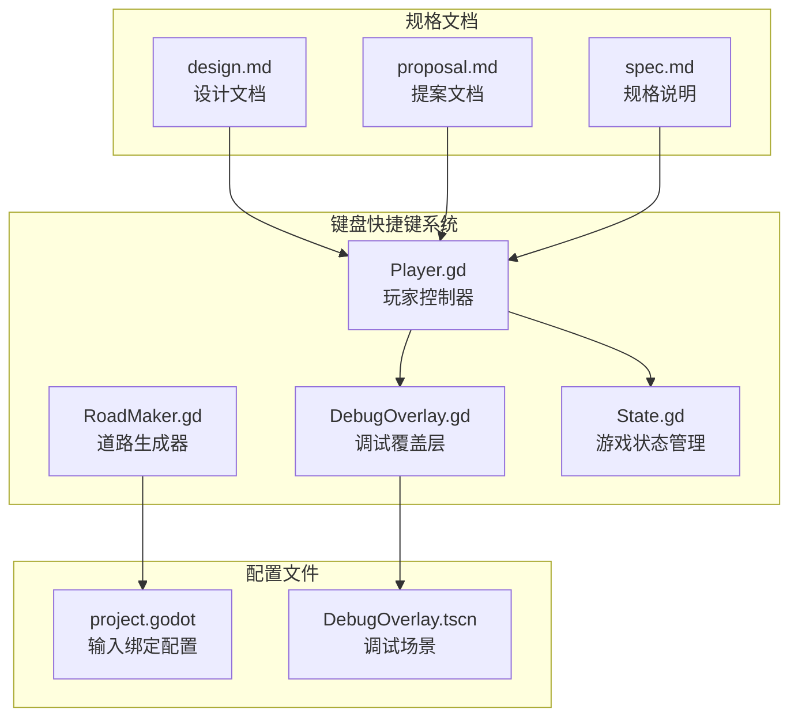
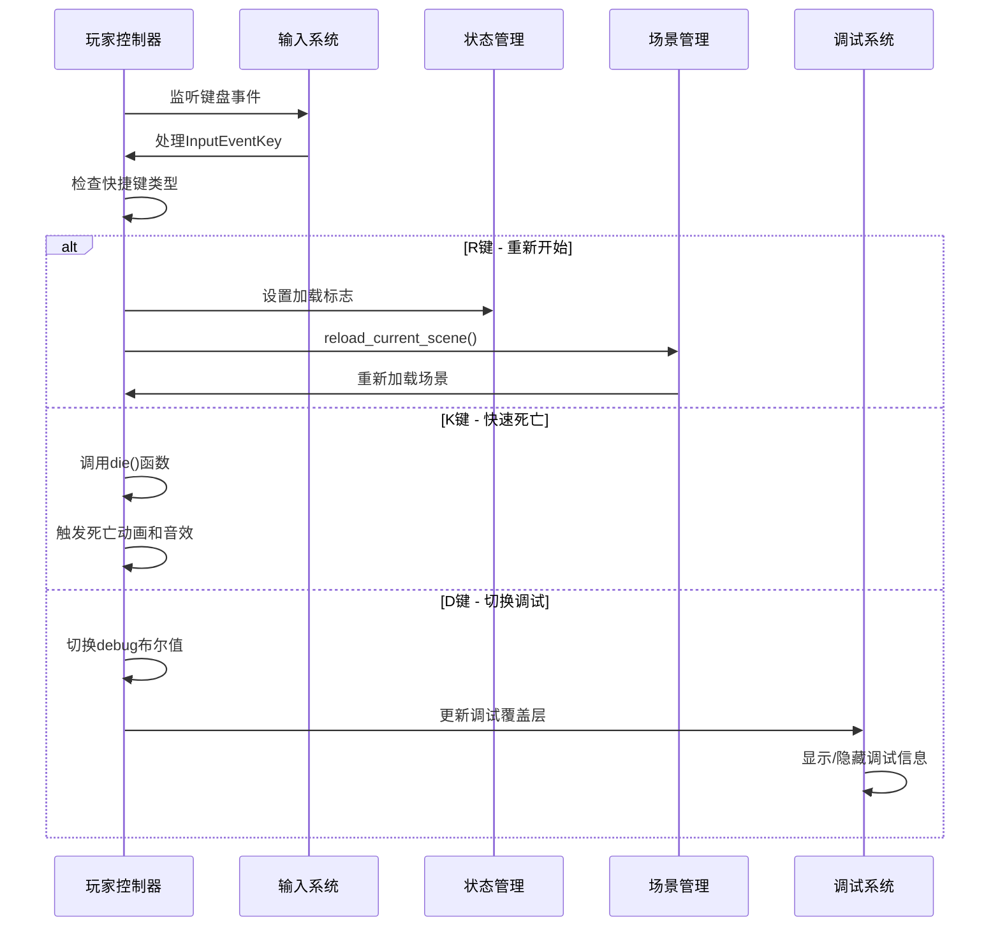
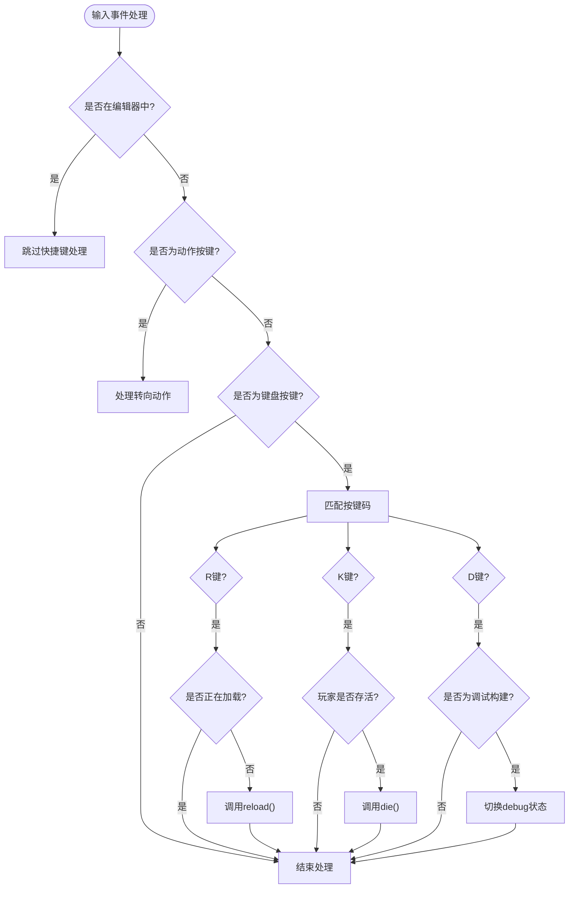
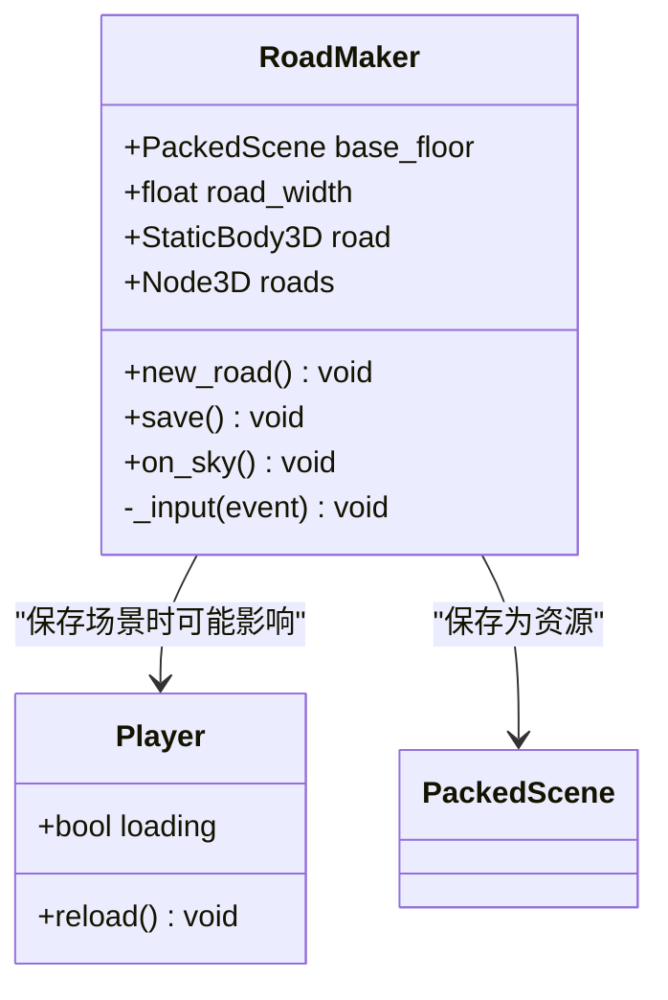
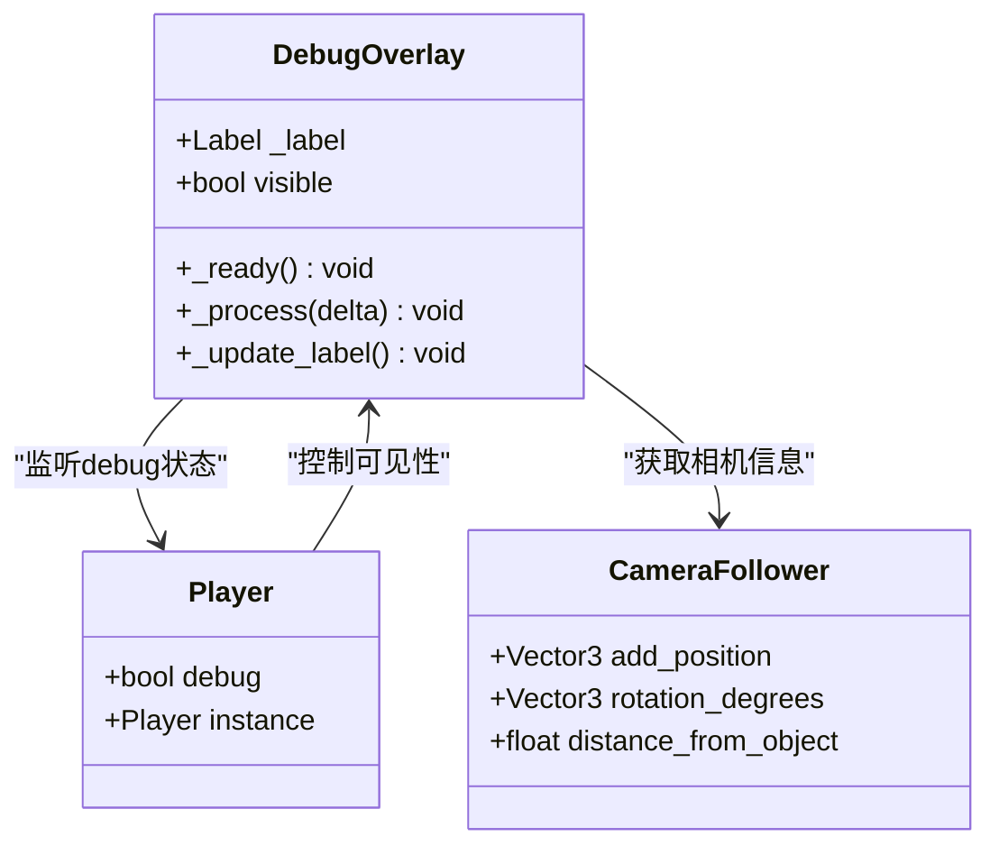
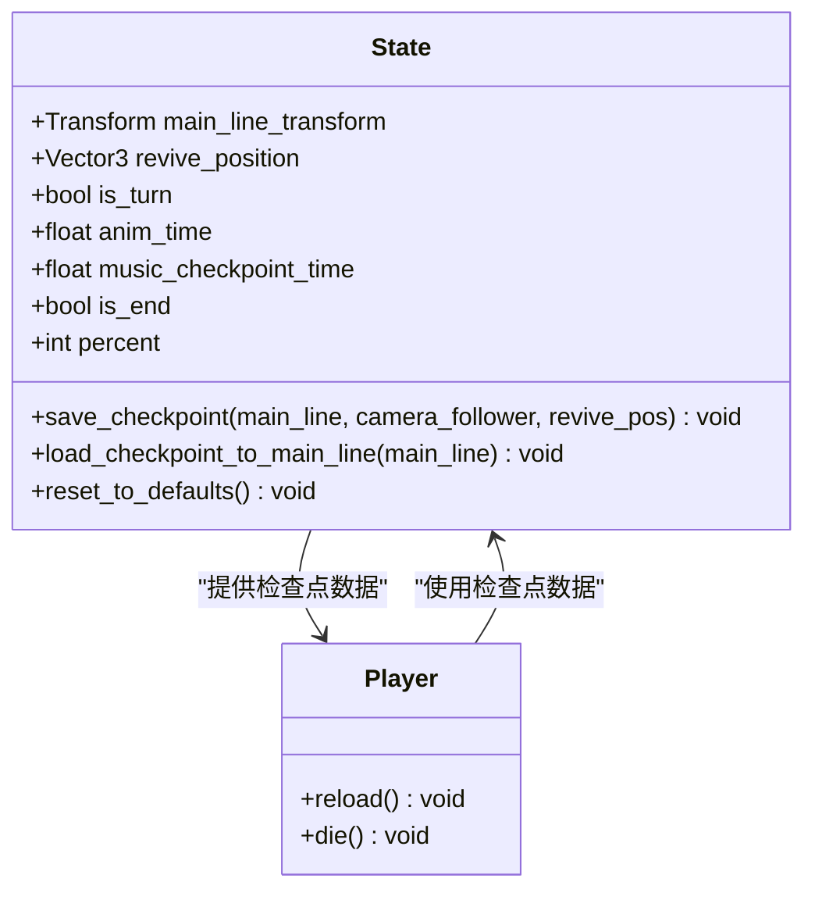
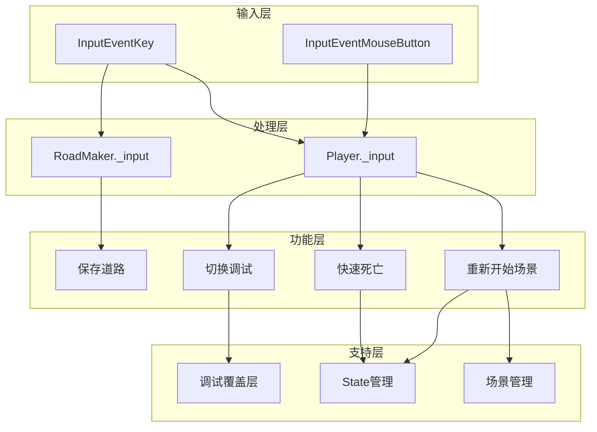

# 键盘快捷键系统

<cite>
**本文档引用的文件**
- [README.md](file://README.md)
- [Player.gd](file://#Template/[Scripts]/Level/Player.gd)
- [RoadMaker.gd](file://#Template/[Scripts]/Level/RoadMaker.gd)
- [project.godot](file://project.godot)
- [DebugOverlay.gd](file://#Template/[Scripts]/Level/DebugOverlay.gd)
- [DebugOverlay.tscn](file://#Template/[Resources]/DebugOverlay.tscn)
- [State.gd](file://#Template/[Scripts]/State.gd)
- [design.md](file://openspec/changes/archive/2026-04-18-port-keyboard-shortcuts/design.md)
- [proposal.md](file://openspec/changes/archive/2026-04-18-port-keyboard-shortcuts/proposal.md)
- [spec.md](file://openspec/changes/archive/2026-04-18-port-keyboard-shortcuts/specs/keyboard-shortcuts/spec.md)
</cite>

## 目录
1. [简介](#简介)
2. [项目结构](#项目结构)
3. [核心组件](#核心组件)
4. [架构概览](#架构概览)
5. [详细组件分析](#详细组件分析)
6. [依赖关系分析](#依赖关系分析)
7. [性能考虑](#性能考虑)
8. [故障排除指南](#故障排除指南)
9. [结论](#结论)

## 简介

键盘快捷键系统是Godot Line模板项目中的重要功能模块，为开发者和玩家提供了便捷的操作方式。该系统实现了三个主要的键盘快捷键：R键用于重新开始关卡、K键用于快速死亡、D键用于切换调试模式。

根据项目文档，该系统基于Godot Engine 4.6开发，采用了与Unity版本相同的快捷键行为，确保了引擎迁移过程中的功能一致性。

## 项目结构

键盘快捷键系统的实现涉及多个关键文件和组件：

**图表来源**
- [Player.gd:116-133](file://#Template/[Scripts]/Level/Player.gd#L116-L133)
- [RoadMaker.gd:35-42](file://#Template/[Scripts]/Level/RoadMaker.gd#L35-L42)
- [project.godot:29-56](file://project.godot#L29-L56)

**章节来源**
- [README.md:42-51](file://README.md#L42-L51)
- [project.godot:29-56](file://project.godot#L29-L56)

## 核心组件

键盘快捷键系统由以下核心组件构成：

### 1. Player.gd - 主要快捷键处理器
Player.gd是键盘快捷键系统的核心组件，负责处理所有键盘输入事件。它实现了三个主要的快捷键功能：
- R键：重新开始当前场景
- K键：立即死亡（游戏中）
- D键：切换调试模式（仅调试构建）

### 2. RoadMaker.gd - 保存功能
RoadMaker.gd实现了保存道路的功能，使用S键触发，将生成的道路保存为PackedScene资源。

### 3. DebugOverlay.gd - 调试界面
DebugOverlay.gd提供了一个CanvasLayer场景，用于显示实时的游戏信息，包括FPS、进度、状态等。

### 4. State.gd - 状态管理
State.gd管理游戏的持久化状态，包括检查点数据、玩家状态等，为快捷键功能提供状态支持。

**章节来源**
- [Player.gd:116-133](file://#Template/[Scripts]/Level/Player.gd#L116-L133)
- [RoadMaker.gd:35-42](file://#Template/[Scripts]/Level/RoadMaker.gd#L35-L42)
- [DebugOverlay.gd:1-66](file://#Template/[Scripts]/Level/DebugOverlay.gd#L1-L66)

## 架构概览

键盘快捷键系统的整体架构采用分层设计，确保了功能的模块化和可维护性：

**图表来源**
- [Player.gd:116-140](file://#Template/[Scripts]/Level/Player.gd#L116-L140)
- [DebugOverlay.gd:20-25](file://#Template/[Scripts]/Level/DebugOverlay.gd#L20-L25)

## 详细组件分析

### Player.gd - 键盘快捷键实现

Player.gd中的键盘快捷键处理逻辑位于`_input()`函数中，采用直接的按键码匹配方式：

**图表来源**
- [Player.gd:116-133](file://#Template/[Scripts]/Level/Player.gd#L116-L133)

#### 键盘快捷键功能详解

1. **R键 - 重新开始**
   - 功能：重新加载当前场景
   - 条件：非编辑器模式且非加载中状态
   - 实现：设置加载标志后调用`reload()`函数

2. **K键 - 快速死亡**
   - 功能：在游戏中立即死亡
   - 条件：玩家必须处于存活状态
   - 实现：调用`die()`函数触发完整死亡流程

3. **D键 - 调试模式**
   - 功能：切换调试信息显示
   - 条件：仅在调试构建中可用
   - 实现：切换`debug`布尔变量状态

**章节来源**
- [Player.gd:116-133](file://#Template/[Scripts]/Level/Player.gd#L116-L133)
- [Player.gd:134-140](file://#Template/[Scripts]/Level/Player.gd#L134-L140)

### RoadMaker.gd - 保存功能

RoadMaker.gd实现了保存道路的功能，使用S键触发保存操作：

**图表来源**
- [RoadMaker.gd:1-46](file://#Template/[Scripts]/Level/RoadMaker.gd#L1-L46)

**章节来源**
- [RoadMaker.gd:35-42](file://#Template/[Scripts]/Level/RoadMaker.gd#L35-L42)

### DebugOverlay.gd - 调试界面

DebugOverlay.gd提供了一个独立的CanvasLayer场景，用于显示实时的游戏信息：

**图表来源**
- [DebugOverlay.gd:1-66](file://#Template/[Scripts]/Level/DebugOverlay.gd#L1-L66)

**章节来源**
- [DebugOverlay.gd:20-66](file://#Template/[Scripts]/Level/DebugOverlay.gd#L20-L66)

### State.gd - 状态管理

State.gd管理游戏的持久化状态，为快捷键功能提供必要的状态支持：

**图表来源**
- [State.gd:1-159](file://#Template/[Scripts]/State.gd#L1-L159)

**章节来源**
- [State.gd:52-80](file://#Template/[Scripts]/State.gd#L52-L80)
- [State.gd:86-95](file://#Template/[Scripts]/State.gd#L86-L95)

## 依赖关系分析

键盘快捷键系统的依赖关系体现了清晰的模块化设计：

**图表来源**
- [Player.gd:116-133](file://#Template/[Scripts]/Level/Player.gd#L116-L133)
- [RoadMaker.gd:35-42](file://#Template/[Scripts]/Level/RoadMaker.gd#L35-L42)

**章节来源**
- [Player.gd:47-64](file://#Template/[Scripts]/Level/Player.gd#L47-L64)
- [project.godot:29-56](file://project.godot#L29-L56)

## 性能考虑

键盘快捷键系统在设计时充分考虑了性能优化：

1. **事件过滤**：系统只在非编辑器模式下处理快捷键，避免在编辑器中产生不必要的处理开销。

2. **条件检查**：每个快捷键都包含适当的条件检查，如加载状态检查、玩家状态检查等，防止无效操作。

3. **调试构建限制**：D键的调试功能仅在调试构建中启用，避免在发布版本中产生额外的渲染开销。

4. **延迟处理**：场景重载使用`reload_current_scene()`方法，确保平滑的场景切换体验。

## 故障排除指南

### 常见问题及解决方案

1. **快捷键无响应**
   - 检查是否在编辑器模式下运行
   - 确认快捷键对应的按键码正确配置
   - 验证`_input()`函数是否被正确调用

2. **R键重复触发**
   - 检查`loading`标志的状态
   - 确认场景重载过程是否完成

3. **D键不工作**
   - 验证是否为调试构建
   - 检查`OS.is_debug_build()`返回值
   - 确认调试覆盖层场景正确加载

4. **调试信息不显示**
   - 检查`Player.instance.debug`状态
   - 验证`DebugOverlay`节点的可见性设置
   - 确认`_update_label()`函数正常执行

**章节来源**
- [Player.gd:124-132](file://#Template/[Scripts]/Level/Player.gd#L124-L132)
- [DebugOverlay.gd:20-25](file://#Template/[Scripts]/Level/DebugOverlay.gd#L20-L25)

## 结论

键盘快捷键系统成功实现了与Unity版本一致的功能，为Godot引擎提供了完整的开发者工具集。系统采用模块化设计，具有良好的可维护性和扩展性。

主要成就包括：
- 实现了R、K、D三个核心快捷键功能
- 提供了调试模式支持，仅在调试构建中可用
- 保持了与Unity版本的兼容性
- 采用了Godot的原生输入系统和最佳实践

该系统为后续的功能扩展奠定了坚实的基础，可以轻松添加新的快捷键功能而不会影响现有代码的稳定性。